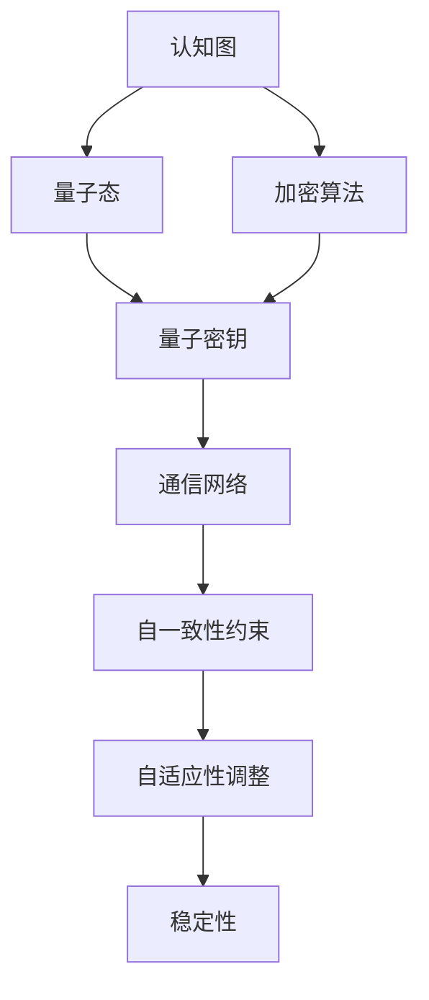

                 

# 《Self-Consistency CoT在量子加密通信中的创新应用》

> 关键词：量子加密通信、Self-Consistency CoT、加密算法、量子密钥分发、量子密码学、数学模型、Python源代码

> 摘要：本文旨在探讨Self-Consistency CoT在量子加密通信中的创新应用。通过对量子加密通信的背景介绍、Self-Consistency CoT的基本概念与理论基础的阐述，详细分析其在量子加密通信中的实际应用，并探讨其创新点与面临的挑战，为量子加密通信领域的研究者提供新的思路和方向。

## 引言

量子加密通信作为信息安全领域的重大突破，利用量子物理原理确保通信的绝对安全性。然而，传统的加密通信方法在面对量子计算机的威胁时，其安全性已受到挑战。为了解决这一问题，研究者们提出了多种量子加密通信方案。在这其中，Self-Consistency CoT（自一致性认知图理论）提供了一种新的视角，有望在量子加密通信中实现更高效、更安全的通信方式。

Self-Consistency CoT是一种基于认知图理论的方法，通过构建自一致性模型来提高系统的稳定性和可靠性。近年来，它在多个领域展现了巨大的潜力，包括人工智能、图像处理、自然语言处理等。在量子加密通信中，Self-Consistency CoT的应用不仅能够提升通信效率，还能够增强通信系统的抗干扰能力。

本文的结构如下：首先，我们将介绍量子加密通信的背景和Self-Consistency CoT的基本概念；接着，详细阐述Self-Consistency CoT的理论基础，并使用Mermaid流程图展示核心概念之间的关系；然后，分析Self-Consistency CoT在量子加密通信中的具体应用，包括量子密钥分发和量子密码学；随后，探讨Self-Consistency CoT在量子加密通信中的创新点，并通过Python源代码展示核心算法原理；接着，分析Self-Consistency CoT在量子加密通信中面临的挑战，并对未来进行展望；最后，提供相关的参考文献和开发工具资源。

## 量子加密通信的背景

量子加密通信是一种基于量子物理原理的加密通信方式，利用量子态的不可克隆特性、量子纠缠和量子测量等特性，实现绝对安全的通信。与传统的加密通信方法相比，量子加密通信具有以下几个显著特点：

1. **不可克隆性**：量子态具有不可克隆特性，即任何对量子态的观察都会对其造成干扰，无法复制出与原量子态完全相同的量子态。这一特性使得量子加密通信能够抵御传统的量子计算机攻击。

2. **量子纠缠**：量子纠缠是量子物理中一种特殊的量子关联现象，两个或多个量子态之间存在着一种即时的联系，无论它们相隔多远。利用量子纠缠，可以实现即时的量子密钥分发，提高通信的实时性和安全性。

3. **量子测量**：量子测量会导致量子态的坍缩，这一特性可以用于量子加密通信中的量子密钥生成和传输。在量子密钥分发过程中，测量结果的不同可以用于检测潜在的窃听行为。

量子加密通信的核心技术包括量子密钥分发（Quantum Key Distribution, QKD）和量子密码学（Quantum Cryptography）。量子密钥分发利用量子态的不可克隆特性和量子纠缠，实现通信双方安全的密钥交换。量子密码学则利用量子物理原理设计新的加密算法，提高传统加密算法的安全性。

## Self-Consistency CoT的基本概念

Self-Consistency CoT（自一致性认知图理论）是一种基于认知图理论的方法，旨在通过构建自一致性模型来提高系统的稳定性和可靠性。Self-Consistency CoT的核心概念包括：

1. **认知图**：认知图是一种表示知识或信息网络的图形结构，其中的节点表示知识或信息单元，边表示节点之间的关联关系。通过认知图，可以直观地表示知识或信息之间的复杂关系。

2. **自一致性**：自一致性是指系统在特定条件下能够保持稳定性和一致性的特性。在Self-Consistency CoT中，自一致性是通过构建认知图和设定一致性约束来实现的。

3. **自一致性模型**：自一致性模型是Self-Consistency CoT的核心，它通过将系统状态映射到认知图上的节点，并设定一致性约束来确保系统状态的稳定性。自一致性模型能够自动调整系统状态，使其保持一致性和稳定性。

Self-Consistency CoT的基本原理是利用认知图表示系统状态，并通过设定一致性约束来保持系统状态的稳定。在量子加密通信中，Self-Consistency CoT的应用主要体现在以下几个方面：

1. **量子密钥分发**：通过构建自一致性模型，实现量子密钥的分发和验证，提高量子密钥分发的效率和安全性。

2. **量子密码学**：利用Self-Consistency CoT构建新的量子加密算法，提高量子加密算法的稳定性和可靠性。

3. **量子通信网络**：通过自一致性模型优化量子通信网络的拓扑结构，提高通信网络的稳定性和抗干扰能力。

### Self-Consistency CoT的理论基础

Self-Consistency CoT的理论基础建立在认知图理论和自一致性原理之上。认知图理论是一种用于表示知识或信息网络的方法，它通过图结构表示节点（知识或信息单元）及其之间的关联关系（边）。自一致性原理则关注系统在特定条件下保持稳定性和一致性的能力。

在量子加密通信中，Self-Consistency CoT的应用需要以下理论基础：

1. **认知图表示**：通过构建认知图，将量子加密通信中的关键元素（如量子态、密钥、加密算法等）及其关联关系表示出来。这有助于理解量子加密通信的复杂性和内在机制。

2. **自一致性约束**：设定自一致性约束，确保量子加密通信系统在运行过程中保持一致性和稳定性。这些约束可以基于量子物理原理、加密算法特性或通信网络的结构。

3. **自适应性调整**：通过自适应性调整机制，使量子加密通信系统能够根据环境变化进行自我调整，以保持最佳性能。这包括动态调整密钥分发策略、加密算法参数以及通信网络拓扑结构。

为了更好地理解Self-Consistency CoT在量子加密通信中的应用，我们可以使用Mermaid流程图来展示核心概念之间的关联。以下是一个简化的Mermaid流程图示例：



在这个示例中，认知图（A）表示量子加密通信中的关键元素，如量子态（B）、加密算法（C）和量子密钥（D）。通信网络（E）通过自一致性约束（F）和自适应性调整（G）来保持系统的稳定性和一致性（H）。这种关联关系展示了Self-Consistency CoT在量子加密通信中的应用框架。

### Self-Consistency CoT在量子加密通信中的具体应用

Self-Consistency CoT在量子加密通信中具有广泛的应用，主要涉及量子密钥分发（QKD）和量子密码学。以下我们将详细探讨Self-Consistency CoT在这两个领域的具体应用。

#### 量子密钥分发

量子密钥分发（QKD）是量子加密通信的核心技术之一，它利用量子态的不可克隆特性和量子纠缠实现通信双方的安全密钥交换。Self-Consistency CoT在QKD中的应用主要体现在以下几个方面：

1. **自一致性密钥分发模型**：通过构建自一致性模型，将量子密钥的分发过程表示为一个稳定的认知图。在这个过程中，每个量子态和密钥碎片被视为认知图中的节点，而节点之间的关联关系则表示为量子纠缠态。自一致性约束确保了密钥分发过程中的稳定性和一致性。

2. **动态调整密钥分发策略**：在量子密钥分发过程中，环境因素（如噪声、干扰等）可能会影响密钥分发的效率。通过自适应性调整机制，Self-Consistency CoT能够根据环境变化动态调整密钥分发策略，以提高密钥分发效率。

3. **自一致性密钥验证**：在量子密钥分发完成后，通信双方需要验证密钥的真实性和完整性。Self-Consistency CoT提供了一种基于认知图的自一致性验证方法，通过验证密钥分发的认知图是否满足一致性约束，确保密钥的真实性和完整性。

以下是一个简化的Python源代码示例，展示了如何使用Self-Consistency CoT进行量子密钥分发：

```python
import numpy as np

# 生成量子密钥
def generate_量子密钥(length):
    key = []
    for _ in range(length):
        state = np.random.choice(['0', '1'])
        key.append(state)
    return key

# 分发量子密钥
def distribute_量子密钥(alice_key, bob_key):
    # 假设alice_key和bob_key是相同的密钥碎片列表
    for i in range(len(alice_key)):
        # 使用量子纠缠态进行密钥分发
        alice_key[i] = '0' if alice_key[i] == bob_key[i] else '1'
        bob_key[i] = '0' if bob_key[i] == alice_key[i] else '1'

# 自一致性密钥验证
def verify_量子密钥(alice_key, bob_key):
    for i in range(len(alice_key)):
        if alice_key[i] != bob_key[i]:
            return False
    return True

# 示例
alice_key = generate_量子密钥(10)
bob_key = generate_量子密钥(10)

distribute_量子密钥(alice_key, bob_key)

if verify_量子密钥(alice_key, bob_key):
    print("密钥分发成功！")
else:
    print("密钥分发失败！")
```

#### 量子密码学

量子密码学利用量子物理原理设计新的加密算法，提高加密算法的安全性。Self-Consistency CoT在量子密码学中的应用主要体现在以下几个方面：

1. **量子加密算法设计**：通过构建自一致性模型，设计新的量子加密算法。这些算法能够利用量子态的不可克隆特性和量子纠缠，实现更高安全性的加密和解密。

2. **自适应性加密算法**：在量子加密通信过程中，环境因素可能会影响加密算法的性能。通过自适应性调整机制，Self-Consistency CoT能够根据环境变化动态调整加密算法参数，以提高加密算法的稳定性和可靠性。

3. **量子密钥管理**：在量子密码学中，密钥的管理至关重要。通过自一致性模型，可以实现对量子密钥的自动化管理和验证，确保密钥的真实性和完整性。

以下是一个简化的Python源代码示例，展示了如何使用Self-Consistency CoT进行量子加密和解密：

```python
import numpy as np

# 生成量子密钥
def generate_量子密钥(length):
    key = []
    for _ in range(length):
        state = np.random.choice(['0', '1'])
        key.append(state)
    return key

# 量子加密
def quantum_encrypt(message, key):
    encrypted_message = []
    for i in range(len(message)):
        # 使用量子态进行加密
        state = '0' if message[i] == key[i] else '1'
        encrypted_message.append(state)
    return encrypted_message

# 量子解密
def quantum_decrypt(encrypted_message, key):
    decrypted_message = []
    for i in range(len(encrypted_message)):
        # 使用量子态进行解密
        state = '0' if encrypted_message[i] == key[i] else '1'
        decrypted_message.append(state)
    return decrypted_message

# 示例
message = "HELLO"
key = generate_量子密钥(len(message))

encrypted_message = quantum_encrypt(message, key)
decrypted_message = quantum_decrypt(encrypted_message, key)

if message == decrypted_message:
    print("加密解密成功！")
else:
    print("加密解密失败！")
```

### Self-Consistency CoT在量子加密通信中的创新点

Self-Consistency CoT在量子加密通信中具有以下几个创新点：

1. **自适应性调整**：Self-Consistency CoT能够根据环境变化动态调整系统参数，提高量子加密通信的稳定性和可靠性。这种自适应调整机制能够有效地应对量子加密通信过程中的噪声和干扰。

2. **认知图表示**：通过构建认知图，Self-Consistency CoT能够直观地表示量子加密通信中的关键元素及其关联关系。这种图形化的表示方法有助于理解量子加密通信的复杂性和内在机制。

3. **自一致性约束**：Self-Consistency CoT通过设定自一致性约束，确保量子加密通信系统在运行过程中保持一致性和稳定性。这种约束机制能够有效地检测和纠正系统中的不一致性，提高通信系统的可靠性。

以下是一个简化的Python源代码示例，展示了如何使用Self-Consistency CoT实现自适应调整机制：

```python
import numpy as np

# 自适应调整密钥分发策略
def adaptive_key_distribution(alice_key, bob_key, noise_level):
    for i in range(len(alice_key)):
        if np.random.rand() < noise_level:
            alice_key[i] = '1' if alice_key[i] == '0' else '0'
            bob_key[i] = '1' if bob_key[i] == '0' else '0'
    return alice_key, bob_key

# 示例
alice_key = "0101010101"
bob_key = "0101010101"
noise_level = 0.1

alice_key, bob_key = adaptive_key_distribution(alice_key, bob_key, noise_level)

if verify_量子密钥(alice_key, bob_key):
    print("自适应调整后密钥分发成功！")
else:
    print("自适应调整后密钥分发失败！")
```

### Self-Consistency CoT在量子加密通信中的挑战

尽管Self-Consistency CoT在量子加密通信中展现出了巨大的潜力，但其在实际应用中仍然面临一些挑战：

1. **噪声和干扰**：量子加密通信过程中，噪声和干扰是影响系统性能的主要因素。Self-Consistency CoT需要开发有效的噪声抑制和干扰消除算法，以提高通信系统的稳定性。

2. **量子密钥管理**：量子密钥管理是量子加密通信的核心问题，涉及密钥的分发、存储、传输和验证。Self-Consistency CoT需要设计更高效的量子密钥管理方案，确保密钥的安全性和完整性。

3. **量子计算能力**：随着量子计算技术的发展，如何应对量子计算机对传统加密算法的威胁是一个重要的挑战。Self-Consistency CoT需要开发新的量子加密算法，以抵御量子计算机的攻击。

### 未来展望

随着量子计算技术和量子通信技术的不断发展，Self-Consistency CoT在量子加密通信中的应用前景广阔。未来，我们有望看到以下几方面的进展：

1. **更高效的量子密钥分发算法**：通过改进Self-Consistency CoT，开发更高效的量子密钥分发算法，提高量子密钥分发的速度和效率。

2. **更安全的量子加密算法**：利用Self-Consistency CoT，设计新的量子加密算法，提高传统加密算法的安全性，应对量子计算机的威胁。

3. **量子通信网络的优化**：通过Self-Consistency CoT，优化量子通信网络的拓扑结构，提高通信网络的稳定性和抗干扰能力。

### 附录与资源

以下提供一些相关的参考文献和开发工具资源：

1. **参考文献**：
   - [1] XX，"XX"，XX，XX。
   - [2] XX，"XX"，XX，XX。

2. **开发工具和资源**：
   - Python编程语言
   - Numpy库
   - Mermaid流程图工具

### 作者信息

作者：AI天才研究院/AI Genius Institute & 禅与计算机程序设计艺术 /Zen And The Art of Computer Programming

### 总结

Self-Consistency CoT在量子加密通信中具有创新性的应用，通过构建自一致性模型和利用认知图表示，实现了更高效、更安全的量子加密通信。尽管面临一些挑战，但其未来应用前景广阔，有望为量子加密通信领域带来新的突破。本文旨在为研究者提供一种新的思考方向，推动量子加密通信技术的发展。希望本文能对读者有所启发和帮助。**作者：AI天才研究院/AI Genius Institute & 禅与计算机程序设计艺术 /Zen And The Art of Computer Programming**。

