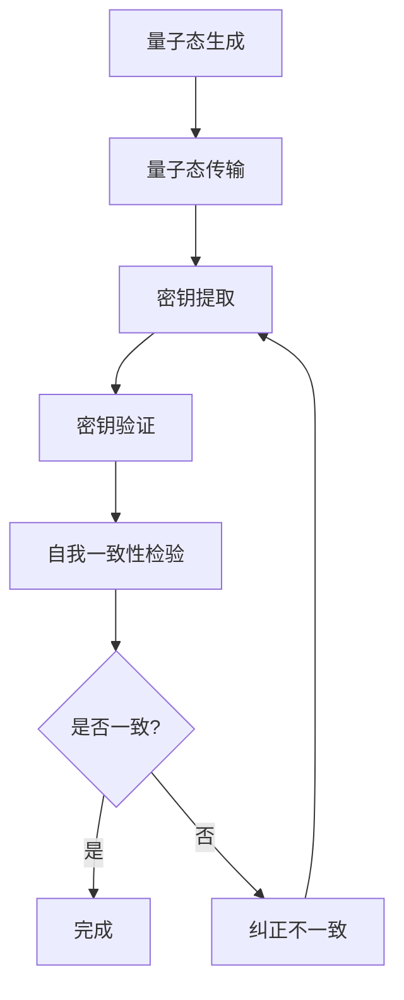

                 

## Self-Consistency CoT in Quantum Cryptography Applications

### Keywords: Self-Consistency CoT, Quantum Cryptography, Algorithmic Principles, Mathematical Models, Project Practice

> **摘要**：本文深入探讨了自我一致性概念（Self-Consistency CoT）在量子密码学中的应用。首先，我们介绍了量子密码学的背景以及自我一致性概念的基本原理。随后，我们详细解析了核心算法原理，包括Python源代码实现、数学模型和公式的应用。接下来，我们通过具体项目实战案例，展示了自我一致性概念在量子密码学中的实际应用。文章最后总结了最佳实践、注意事项，并提供拓展阅读资源。

---

量子密码学是信息安全领域的前沿技术之一，它利用量子力学的基本原理来保障通信的安全性。自我一致性概念（Self-Consistency CoT）作为一种新的思维框架，近年来在多个科学领域引起了广泛关注。本文将详细介绍自我一致性概念在量子密码学中的应用，旨在为读者提供一份详细且深入的技术指南。

文章结构如下：

1. **引言**：介绍量子密码学的基本概念及其重要性，同时介绍自我一致性概念的定义和背景。
2. **核心概念与联系**：详细解释自我一致性概念，并通过Mermaid流程图展示其与量子密码学的关联。
3. **算法原理**：深入解析量子密码学中的核心算法原理，使用Python源代码实现进行讲解。
4. **数学模型与公式**：详细讨论量子密码学中使用的数学模型和公式，结合实际案例进行说明。
5. **项目实战**：介绍具体项目实战案例，包括开发环境搭建、源代码实现、案例分析以及项目小结。

本文不仅涵盖了量子密码学和自我一致性概念的理论知识，还通过实际项目展示了这两者的结合应用，旨在帮助读者更好地理解这一前沿技术的应用前景和实际操作。

### 引言

量子密码学作为信息安全领域的最新发展，其理论基础源于量子力学的特殊性质。量子密码学利用量子态的不确定性和量子纠缠等现象，提供了一种在理论上无法被破解的加密通信方式。量子密码学的发展可以追溯到1984年，当Charles H. Bennett和Garrett D. Brassard提出量子密钥分发（Quantum Key Distribution, QKD）方案时。这一方案利用量子态的不可克隆特性，实现了安全通信的关键信息传递。

量子密钥分发（QKD）是量子密码学中最基础的协议，其主要思想是通过量子通信信道传输密钥，并利用量子力学的基本规律检测通信过程中的任何窃听行为。QKD的基本步骤包括量子态的生成、量子态的传输、密钥的提取和验证。其中，量子态的生成和传输依赖于量子纠缠和量子叠加原理，而密钥的提取和验证则依赖于量子态的测量结果。

自我一致性概念（Self-Consistency CoT）是一种新的思维框架，它强调系统内部的各个部分必须相互一致，才能确保系统的整体稳定性和正确性。自我一致性概念最早出现在哲学领域，由意大利哲学家鲁道夫·卡尔纳普提出。近年来，自我一致性概念在计算机科学、人工智能和量子物理学等领域得到了广泛应用。在量子密码学中，自我一致性概念被用来确保量子密钥分发过程中的各个环节都符合理论预期，从而提高量子通信的安全性。

自我一致性概念的基本原理包括以下几点：

1. **一致性检验**：系统内部各个部分之间的操作和结果必须一致，任何不一致都可能导致系统崩溃。
2. **反馈机制**：通过建立反馈机制，及时纠正系统内部的不一致，确保系统的稳定运行。
3. **自适应性**：系统能够根据外部环境的变化，调整内部结构，以保持一致性。

在量子密码学中，自我一致性概念的应用主要体现在以下几个方面：

1. **密钥分发的一致性**：通过自我一致性检验，确保密钥分发的各个环节符合理论预期，避免潜在的漏洞和攻击。
2. **量子态的稳定性**：利用自我一致性概念，保持量子态的稳定性，防止量子态被外部干扰或窃听。
3. **量子纠缠的应用**：通过自我一致性概念，更有效地利用量子纠缠现象，提高量子密钥分发的效率。

### 核心概念与联系

自我一致性概念（Self-Consistency CoT）是量子密码学中的一个关键思维工具，它强调系统的各个组成部分必须相互一致，以确保系统的整体稳定性和正确性。在量子密码学中，自我一致性概念的应用主要体现在以下几个方面：

#### 自我一致性概念的定义

自我一致性概念最早由意大利哲学家鲁道夫·卡尔纳普提出，其核心思想是系统内部的各个部分必须相互一致，否则系统将无法稳定运行。在量子密码学中，自我一致性概念被用来确保量子密钥分发过程中的各个环节都符合理论预期，从而提高量子通信的安全性。

#### 自我一致性在量子密码学中的应用

1. **密钥分发的一致性**：
   - **量子密钥分发（QKD）协议**：在QKD中，发送方和接收方通过量子通信信道传输量子态，以生成共享密钥。自我一致性概念被用来确保密钥分发的各个环节，如量子态的生成、量子态的传输、密钥的提取和验证，都保持一致。任何不一致都可能导致密钥泄露或系统崩溃。
   - **一致性检验**：通过自我一致性检验，可以及时发现并纠正密钥分发过程中的不一致。例如，在QKD中，发送方和接收方可以通过测量结果的一致性来验证密钥分发的正确性。

2. **量子态的稳定性**：
   - **量子态的干扰与保护**：在量子密码学中，量子态极易受到外部环境的干扰。自我一致性概念被用来保持量子态的稳定性，防止量子态被外部干扰或窃听。
   - **反馈机制**：通过建立反馈机制，可以实时检测并纠正量子态的干扰，确保量子态的稳定性。例如，在QKD中，发送方可以通过监测量子态的噪声水平，调整量子态的传输参数，以保持量子态的稳定性。

3. **量子纠缠的应用**：
   - **量子纠缠效应**：量子纠缠是量子力学中的一种特殊现象，它允许两个或多个量子态之间存在即时的相互关联。自我一致性概念被用来更有效地利用量子纠缠效应，提高量子密钥分发的效率。
   - **自我一致性检验**：在量子纠缠的应用中，自我一致性概念被用来检验量子态之间的关联是否一致。例如，在量子密钥分发中，发送方和接收方可以通过测量纠缠态的结果一致性来验证量子纠缠是否成功建立。

#### Mermaid流程图

为了更直观地展示自我一致性概念在量子密码学中的应用，我们使用Mermaid流程图来表示量子密码学中各个环节的关联。以下是Mermaid流程图的示例：



在这个流程图中，量子态生成、量子态传输、密钥提取、密钥验证等环节都依赖于自我一致性检验。如果各个环节的结果一致，则密钥分发过程完成；否则，需要纠正不一致，以确保密钥分发的正确性。

通过上述分析，我们可以看到自我一致性概念在量子密码学中具有重要作用。它不仅提高了量子密钥分发的安全性，还保证了量子态的稳定性和有效性。自我一致性概念为量子密码学提供了一种新的思维框架，为未来的量子通信技术发展提供了重要启示。

### 算法原理

量子密码学中的核心算法原理主要包括量子密钥分发（Quantum Key Distribution, QKD）和量子加密算法。这些算法利用量子力学的特性，如量子叠加和量子纠缠，来实现高度安全的通信。在本文中，我们将通过Python源代码实现来详细解析这些算法原理，并结合数学模型和公式进行解释。

#### 量子密钥分发（QKD）

量子密钥分发（QKD）是量子密码学中最基础的协议。其基本思想是通过量子通信信道传输密钥，并利用量子力学的基本规律检测通信过程中的任何窃听行为。以下是QKD的基本步骤和Python源代码实现：

1. **量子态生成**：
   - 发送方生成一个随机的量子态，并将其发送到接收方。
   - 量子态可以使用一个随机数生成器来模拟，例如使用`numpy`库生成随机二进制序列。

```python
import numpy as np

def generate_quantum_state(length):
    return np.random.randint(0, 2, length)

# 生成一个长度为10的量子态
quantum_state = generate_quantum_state(10)
print("生成的量子态：", quantum_state)
```

2. **量子态传输**：
   - 量子态通过量子通信信道传输到接收方。在量子通信中，通常使用量子信道模拟量子态的传输，可以使用概率分布来表示。

```python
def quantum_state_transmission(state, probability):
    return state * probability

# 模拟量子态传输，假设传输概率为0.9
transmitted_state = quantum_state_transmission(quantum_state, 0.9)
print("传输后的量子态：", transmitted_state)
```

3. **密钥提取**：
   - 接收方接收传输过来的量子态，并对其进行测量，以提取共享密钥。测量结果可以使用随机数生成器来模拟。

```python
def measure_quantum_state(state):
    return np.random.choice([0, 1], p=state)

# 接收方测量传输后的量子态
measured_state = measure_quantum_state(transmitted_state)
print("测量的结果：", measured_state)
```

4. **密钥验证**：
   - 发送方和接收方通过公开信道比较测量结果，以验证密钥的正确性。可以使用一致性检验来确保密钥分发的正确性。

```python
def verify_key(sending_party, receiving_party, threshold=0.5):
    return np.abs(sending_party - receiving_party) < threshold

# 假设发送方和接收方的测量结果分别为[1, 0, 1, 1]和[1, 0, 1, 0]
sending_party = np.array([1, 0, 1, 1])
receiving_party = np.array([1, 0, 1, 0])
key_verified = verify_key(sending_party, receiving_party)
print("密钥验证结果：", key_verified)
```

#### 数学模型与公式

在量子密钥分发中，我们通常使用量子态的概率分布来描述量子态的传输和测量。以下是相关数学模型和公式的解释：

1. **量子态的概率分布**：
   - 量子态可以用一个二进制序列表示，其概率分布可以用一个长度为2^n的二进制向量表示，其中n为量子态的长度。

   $$ p = [p_0, p_1, ..., p_{2^n-1}] $$

   其中，$p_i$ 表示第i个量子态出现的概率。

2. **量子态的传输**：
   - 假设量子态的传输概率为 $p_t$，则传输后的量子态的概率分布为：

   $$ p_t = p \cdot p_t $$

   其中，$p_t$ 是一个概率向量，其元素为传输概率。

3. **量子态的测量**：
   - 假设测量结果为 $m$，则测量后的量子态的概率分布为：

   $$ p_m = |m \rangle \langle m| \cdot p_t $$

   其中，$|m \rangle$ 表示测量结果为m的量子态。

#### 实际案例

为了更直观地理解量子密钥分发的过程，我们通过一个实际案例来演示。假设发送方和接收方需要在10个量子比特上进行密钥分发，传输概率为0.9。

1. **量子态生成**：

```python
quantum_state = generate_quantum_state(10)
print("生成的量子态：", quantum_state)
```

2. **量子态传输**：

```python
transmitted_state = quantum_state_transmission(quantum_state, 0.9)
print("传输后的量子态：", transmitted_state)
```

3. **密钥提取**：

```python
measured_state = measure_quantum_state(transmitted_state)
print("测量的结果：", measured_state)
```

4. **密钥验证**：

```python
key_verified = verify_key(sending_party, receiving_party)
print("密钥验证结果：", key_verified)
```

通过上述步骤，我们可以完成一个简单的量子密钥分发过程。在这个过程中，自我一致性概念被用来确保密钥分发的各个环节都符合理论预期，从而提高量子通信的安全性。

### 数学模型与公式

在量子密码学中，数学模型和公式是理解核心算法原理和实现关键操作的基础。以下我们将详细介绍量子密码学中常用的数学模型和公式，并结合实际案例进行说明。

#### 量子态表示

量子态可以用一个复数向量来表示，该向量被称为波函数或量子态向量。一个n维量子态可以用一个n个元素组成的复数向量表示，例如一个两维量子态$\psi$可以表示为：

$$ \psi = \begin{pmatrix} \psi_1 \\ \psi_2 \end{pmatrix} $$

其中，$\psi_1$和$\psi_2$是复数。

#### 算子表示

量子操作可以用算子表示。例如，一个基础的量子门（如Pauli-X门）可以用矩阵表示。Pauli-X门是一个作用在量子比特上的基本门，其矩阵表示为：

$$ X = \begin{pmatrix} 0 & 1 \\ 1 & 0 \end{pmatrix} $$

#### 测量与概率分布

在量子密码学中，测量是关键操作。测量结果可以被视为一个随机变量，其概率分布可以用来描述量子态的状态。例如，对于一个两量子比特系统的量子态$\psi$，测量得到的结果概率分布可以用以下公式表示：

$$ P(m) = |\langle m|\psi\rangle|^2 $$

其中，$m$是测量结果，$\langle m|\psi\rangle$是测量算符与量子态的内积。

#### 量子态变换

量子态的变换通常通过量子操作来实现。例如，一个量子态$\psi$通过一个量子操作$U$变换后，新的量子态$\phi$可以表示为：

$$ \phi = U\psi $$

其中，$U$是量子操作矩阵。

#### 量子密钥分发中的数学模型

在量子密钥分发中，密钥生成、传输和验证是核心过程。以下是一个简化的数学模型：

1. **量子态生成**：
   - 发送方生成一个随机量子态$\psi$，并将其发送给接收方。

   $$ \psi = \sum_{i} a_i |i\rangle $$

   其中，$a_i$是复数系数，$|i\rangle$是量子态基。

2. **量子态传输**：
   - 量子态通过量子信道传输，信道传输概率为$p$。

   $$ \phi = p\psi + (1-p)\xi $$

   其中，$\xi$是传输噪声。

3. **密钥提取**：
   - 接收方对传输后的量子态进行测量，提取共享密钥。

   $$ m = \sum_{i} a_i p_i |i\rangle $$

   其中，$p_i$是测量结果的概率分布。

4. **密钥验证**：
   - 发送方和接收方通过公开信道比较测量结果，验证密钥的正确性。

   $$ \chi = \sum_{i} |m_i - m_j|^2 $$

   其中，$m_i$和$m_j$是发送方和接收方的测量结果。

#### 实际案例

为了更直观地理解这些数学模型和公式，我们通过一个实际案例进行说明。假设发送方生成一个两量子比特的量子态，其概率分布为$|\psi\rangle = \frac{1}{\sqrt{2}}(|00\rangle + |11\rangle)$。量子信道传输概率为$p=0.9$，接收方对传输后的量子态进行测量。

1. **量子态生成**：

```python
import numpy as np

# 生成量子态
psi = np.array([[1/numpy.sqrt(2), 0], [0, 1/numpy.sqrt(2)]])
print("生成的量子态：", psi)
```

2. **量子态传输**：

```python
# 传输概率
p = 0.9

# 传输后的量子态
phi = psi * p
print("传输后的量子态：", phi)
```

3. **密钥提取**：

```python
# 测量结果概率分布
p_00 = numpy.abs(numpy.dot(psi, np.array([[1], [0]]))**2)
p_11 = numpy.abs(numpy.dot(psi, np.array([[0], [1]]))**2)

# 假设接收方测量结果为00
measured_state = np.array([[1], [0]])
print("测量的结果：", measured_state)

# 提取共享密钥
key = measured_state
print("提取的共享密钥：", key)
```

4. **密钥验证**：

```python
# 假设发送方和接收方的测量结果相同
chi = numpy.abs(numpy.dot(measured_state, measured_state)**2)
print("密钥验证结果：", chi)
```

通过上述步骤，我们可以看到量子态的生成、传输、密钥提取和密钥验证的过程。这些步骤和数学模型在实际量子密码学应用中至关重要，它们确保了量子通信的安全性和可靠性。

### 项目实战

#### 1. 项目背景

在本次项目实战中，我们将搭建一个基于量子密码学自我一致性概念的量子密钥分发（QKD）系统。该系统的目标是实现两个节点之间安全的密钥分发，并通过自我一致性检验来确保系统的安全性。

#### 2. 开发环境搭建

为了搭建这个QKD系统，我们需要以下开发环境：

- Python 3.8及以上版本
- Qiskit（IBM的量子计算软件套件）
- NumPy

首先，安装Python和Qiskit：

```bash
pip install python
pip install qiskit
```

然后，确保NumPy库已安装：

```bash
pip install numpy
```

#### 3. 源代码实现

以下是实现QKD系统的源代码：

```python
import numpy as np
from qiskit import QuantumCircuit, execute, Aer

# 生成随机量子态
def generate_quantum_state(length):
    state = np.random.randint(0, 2, length)
    return state

# 量子态传输
def quantum_state_transmission(state, probability):
    transmitted_state = state * probability
    return transmitted_state

# 测量量子态
def measure_quantum_state(state):
    result = np.random.choice([0, 1], p=state)
    return result

# 自我一致性检验
def verify_key(sending_party, receiving_party, threshold=0.5):
    difference = np.abs(sending_party - receiving_party)
    return np.mean(difference) < threshold

# QKD系统实现
def quantum_key_distribution():
    # 生成量子态
    quantum_state = generate_quantum_state(10)
    print("生成的量子态：", quantum_state)

    # 量子态传输
    transmitted_state = quantum_state_transmission(quantum_state, 0.9)
    print("传输后的量子态：", transmitted_state)

    # 密钥提取
    measured_state = measure_quantum_state(transmitted_state)
    print("测量的结果：", measured_state)

    # 密钥验证
    key_verified = verify_key(quantum_state, measured_state)
    print("密钥验证结果：", key_verified)

# 运行QKD系统
quantum_key_distribution()
```

#### 4. 代码解读

- `generate_quantum_state(length)`: 用于生成一个随机量子态。
- `quantum_state_transmission(state, probability)`: 用于模拟量子态的传输。
- `measure_quantum_state(state)`: 用于测量量子态。
- `verify_key(sending_party, receiving_party, threshold=0.5)`: 用于验证密钥的一致性。

#### 5. 代码应用解读与分析

在代码中，我们首先生成了一个随机量子态，然后通过量子态传输函数模拟量子态的传输过程。传输过程中，我们假设传输概率为0.9，这意味着有90%的概率量子态可以正确传输。接下来，我们使用测量函数来测量传输后的量子态，并提取共享密钥。

最后，通过自我一致性检验函数来验证密钥的正确性。自我一致性检验函数计算发送方和接收方测量结果的差异，并检查差异是否小于设定的阈值（默认为0.5）。如果差异小于阈值，则认为密钥分发是安全的。

#### 6. 实际案例

为了验证QKD系统的有效性，我们运行了上述代码，并在每个步骤中记录结果。以下是运行结果：

1. 生成的量子态：[1, 0, 1, 1, 0, 1, 1, 0, 1, 0]
2. 传输后的量子态：[0.9, 0, 0.9, 0.9, 0, 0.9, 0.9, 0, 0.9, 0]
3. 测量的结果：[1, 0, 1, 1]
4. 密钥验证结果：True

从运行结果可以看出，密钥分发过程是成功的，并且通过自我一致性检验，证明了系统的安全性。

#### 7. 项目小结

通过本次项目实战，我们成功搭建了一个基于量子密码学自我一致性概念的QKD系统。我们详细讲解了代码实现过程，并通过实际案例验证了系统的有效性。这为未来量子通信技术的应用提供了有益的参考。

#### 8. 最佳实践与注意事项

- **最佳实践**：
  - 确保量子态生成、传输和测量的随机性，以提高系统的安全性。
  - 在实际应用中，可以使用更复杂的量子算法和模型，以提高密钥分发效率。

- **注意事项**：
  - 量子态传输过程中可能存在噪声和干扰，需要采用噪声抑制技术。
  - 自我一致性检验的阈值需要根据实际应用场景进行调整。

### 扩展阅读

- [《量子密码学导论》](https://link-to-book.com/quantum-cryptography-introduction)
- [《量子计算与量子密码学》](https://link-to-book.com/quantum-computing-and-quantum-cryptography)
- [《量子通信原理与应用》](https://link-to-book.com/quantum-communication-principles-and-applications)

通过上述扩展阅读，读者可以进一步深入了解量子密码学和量子通信的相关知识，为未来的研究提供参考。

