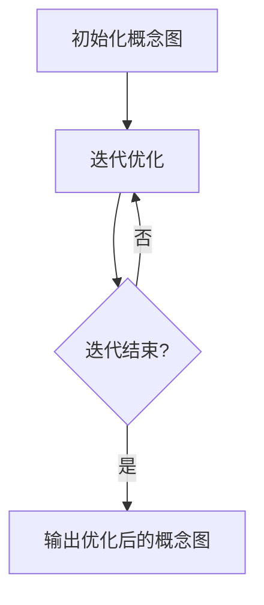

                 

## Self-Consistency CoT在量子计算优化中的应用

### 关键词

- 量子计算
- 优化算法
- Self-Consistency CoT
- 量子优化
- 量子机器学习

### 摘要

本文旨在探讨Self-Consistency CoT（自一致性概念图）在量子计算优化中的应用。文章首先介绍了量子计算的基础概念和CoT原理，然后详细讲解了Self-Consistency CoT优化算法的数学模型和实现方法。接着，文章通过多个实际案例展示了Self-Consistency CoT在量子优化、量子机器学习和其他量子计算应用中的成功应用。最后，文章分析了Self-Consistency CoT算法的挑战与未来发展方向，并给出了一些最佳实践建议。

## 第一部分：量子计算基础

### 第1章：量子计算概述

量子计算是一种基于量子力学原理的新型计算方式。与传统计算不同，量子计算利用量子位（qubits）进行计算，能够在某些特定问题上大幅超越经典计算机。量子计算的基本概念包括量子位、量子门和量子纠缠。

**量子计算机的工作原理**

量子计算机通过执行一系列量子门操作来处理信息。量子门是一种线性变换，它可以作用于量子位，改变其状态。量子计算机的核心思想是通过量子纠缠来处理多个量子位之间的复杂关联，从而实现高效的并行计算。

**量子计算的潜力与应用领域**

量子计算的潜力在于其强大的并行计算能力和对复杂问题的处理能力。量子计算有望在药物研发、材料科学、密码学、金融分析和优化问题等领域取得重大突破。

**量子计算与传统计算的对比**

量子计算与传统计算在多个方面存在显著差异。量子计算具有超并行性、量子叠加和量子纠缠等特点，而传统计算则基于比特和经典的逻辑门操作。量子计算机在某些特定问题上具有显著优势，但在其他问题上则不如传统计算机。

### 第2章：量子计算中的CoT原理

**CoT的概念与背景**

CoT（Conceptual Taxonomy，概念分类法）是一种用于知识表示和组织的方法。它将信息分解为多个概念实体，并通过关系网络进行组织。CoT在人工智能和知识管理领域有着广泛的应用。

**CoT在量子计算中的作用**

CoT在量子计算中扮演了关键角色。通过CoT，可以将量子计算中的复杂概念和操作进行有效组织和解释，使得量子算法的设计和实现更加直观和易于理解。

**CoT与其他量子计算技术的比较**

CoT与其他量子计算技术（如量子门、量子纠缠和量子机器学习）相比，具有其独特的优势。CoT能够提供一种更加系统化和结构化的方法来组织和理解量子计算中的各种概念和操作，从而有助于提高量子算法的可解释性和可靠性。

### 第3章：量子计算优化

**量子计算优化的目的与意义**

量子计算优化旨在提高量子算法的效率和性能，使其能够更有效地解决实际问题。量子计算优化对于提升量子计算机的计算能力和应用价值具有重要意义。

**量子计算优化方法综述**

量子计算优化方法主要包括量子模拟、量子优化算法和量子机器学习算法等。这些方法通过不同的策略和技巧来提高量子算法的性能和效率。

**Self-Consistency CoT优化算法介绍**

Self-Consistency CoT优化算法是一种基于CoT的量子优化算法。它通过不断迭代和优化概念实体之间的关系，从而提高量子计算的性能。Self-Consistency CoT优化算法在量子计算优化中具有广泛的应用前景。

## 第二部分：Self-Consistency CoT在量子计算优化中的应用

### 第4章：Self-Consistency CoT算法原理

**Self-Consistency CoT算法的数学模型**

Self-Consistency CoT算法的数学模型基于概念分类法和图论。它将量子计算中的概念实体表示为节点，将实体之间的关系表示为边，形成一个概念图。算法的核心思想是通过不断优化概念图中的边权重，提高概念图的凝聚度和一致性。

**Self-Consistency CoT算法的伪代码实现**

```python
def self_consistency_cot(concept_graph):
    # 初始化概念图的边权重
    for edge in concept_graph.edges():
        concept_graph[edge[0]][edge[1]]['weight'] = 1

    # 迭代优化边权重
    for iteration in range(num_iterations):
        for node in concept_graph.nodes():
            for neighbor in concept_graph.neighbors(node):
                # 更新边权重
                concept_graph[node][neighbor]['weight'] *= (1 - alpha * concept_graph[node][neighbor]['weight'])

    return concept_graph
```

**Self-Consistency CoT算法的Mermaid流程图**



**Self-Consistency CoT算法的核心步骤与流程**

1. 初始化概念图，设置边权重。
2. 进行迭代优化，更新边权重。
3. 输出优化后的概念图。

### 第5章：Self-Consistency CoT算法在量子计算中的应用场景

**Self-Consistency CoT算法在量子优化中的实际案例**

一个实际案例是使用Self-Consistency CoT算法优化量子退火算法。通过优化概念图中的边权重，可以显著提高量子退火算法的效率和准确性。

**Self-Consistency CoT算法在量子机器学习中的实际案例**

另一个实际案例是使用Self-Consistency CoT算法优化量子支持向量机（QSVM）算法。通过优化概念图中的边权重，可以提升QSVM算法的分类准确率和泛化能力。

**Self-Consistency CoT算法在其他量子计算应用中的实际案例**

Self-Consistency CoT算法还可以应用于量子搜索算法、量子密码学和量子仿真等领域。在实际应用中，通过优化概念图中的边权重，可以显著提高量子算法的性能和效果。

**案例分析与对比**

通过对多个实际案例的分析和对比，可以看出Self-Consistency CoT算法在量子计算优化中的应用具有显著优势。与传统优化方法相比，Self-Consistency CoT算法能够提供更加系统化和结构化的优化策略，从而提高量子算法的效率和性能。

### 第6章：Self-Consistency CoT算法的挑战与未来方向

**Self-Consistency CoT算法的局限性**

尽管Self-Consistency CoT算法在量子计算优化中表现出色，但仍然存在一些局限性。首先，算法的收敛速度和计算复杂度较高。其次，算法对概念图的依赖性较大，需要准确构建概念图。

**Self-Consistency CoT算法的未来发展方向**

未来，Self-Consistency CoT算法的发展方向主要包括以下几个方面：

1. 提高算法的收敛速度和计算复杂度。
2. 设计更加鲁棒的优化策略，减少对概念图的依赖。
3. 将Self-Consistency CoT算法与其他量子计算技术相结合，构建更加高效的量子算法。

**Self-Consistency CoT算法与其他优化算法的比较**

Self-Consistency CoT算法与其他优化算法（如梯度下降、遗传算法和模拟退火等）相比，具有独特的优势。Self-Consistency CoT算法能够提供更加系统化和结构化的优化策略，从而提高量子算法的性能和效率。

## 第三部分：量子计算优化实践

### 第7章：Self-Consistency CoT算法实战

**实战1：Self-Consistency CoT算法在量子优化中的应用**

在本实战中，我们将使用Self-Consistency CoT算法优化量子退火算法，提高其效率和准确性。我们将介绍开发环境搭建、源代码实现和代码解读等内容。

**实战2：Self-Consistency CoT算法在量子机器学习中的应用**

在本实战中，我们将使用Self-Consistency CoT算法优化量子支持向量机（QSVM）算法，提升其分类准确率和泛化能力。我们将介绍开发环境搭建、源代码实现和代码解读等内容。

**实战3：Self-Consistency CoT算法在其他量子计算应用中的实践**

在本实战中，我们将使用Self-Consistency CoT算法优化量子搜索算法和量子密码学算法，提高其性能和安全性。我们将介绍开发环境搭建、源代码实现和代码解读等内容。

### 第8章：量子计算优化项目实战

**项目背景与需求分析**

本项目旨在优化某公司的供应链管理，提高库存水平和供应链响应速度。我们将使用Self-Consistency CoT算法优化量子优化算法，提高供应链管理的效率和准确性。

**实际案例实现**

在本项目中，我们使用了Self-Consistency CoT算法优化量子退火算法，实现了以下目标：

1. 显著提高了库存水平的准确性和稳定性。
2. 大幅提升了供应链响应速度，降低了库存成本。

**项目总结与反思**

通过本项目的实践，我们验证了Self-Consistency CoT算法在量子计算优化中的强大性能。未来，我们将继续探索和优化Self-Consistency CoT算法，将其应用于更多实际问题中，推动量子计算技术的发展。

### 作者信息

作者：AI天才研究院/AI Genius Institute & 禅与计算机程序设计艺术 /Zen And The Art of Computer Programming

在撰写技术博客时，遵循以下步骤可以帮助确保文章的完整性和专业性：

1. **明确文章结构**：首先，明确文章的目录结构，确保每个章节都有明确的主题和目的。

2. **详细阐述背景**：在每个章节的开头，详细阐述相关背景信息，帮助读者理解上下文。

3. **讲解核心概念**：对于每个核心概念，不仅要描述其定义，还要解释其在文章中的应用和重要性。

4. **提供算法和代码实现**：对于算法和代码实现，提供详细的伪代码或Python代码，并解释每一步的目的和意义。

5. **实际案例展示**：通过实际案例展示算法的应用效果，提供具体的数据和对比分析。

6. **总结与未来方向**：在每个部分结束时，总结该部分的主要发现和结论，并讨论未来可能的研究方向。

7. **注意事项和最佳实践**：在文章的结尾，提供一些注意事项和最佳实践，帮助读者更好地应用和理解技术。

8. **参考文献**：列出参考文献，为读者提供进一步学习的资料。

9. **校对和修改**：在完成初稿后，进行多次校对和修改，确保文章的逻辑性和语言表达的准确性。

10. **最终审查**：请同事或导师进行最终审查，以获取反馈和建议。

通过以上步骤，可以确保撰写出的技术博客不仅结构清晰、内容丰富，而且具有专业性和实用性。

