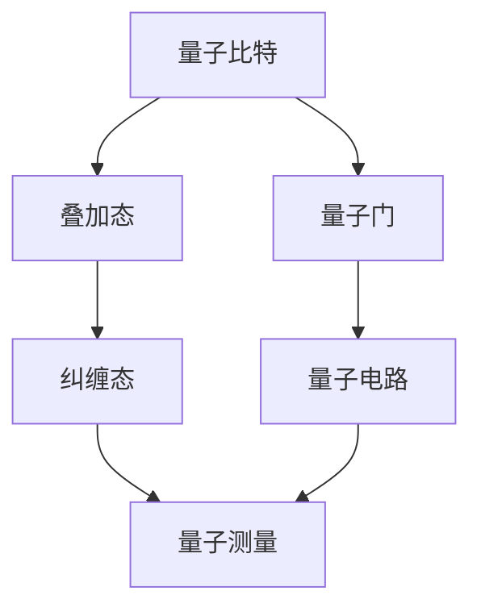
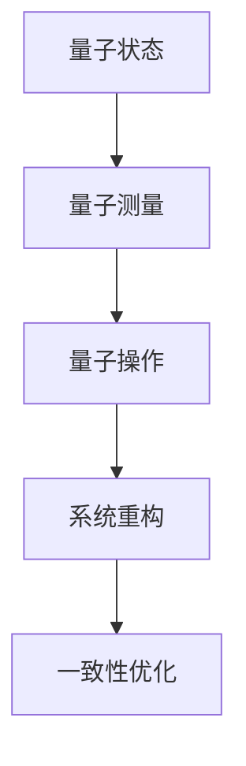

                 

### 《Self-Consistency CoT在量子计算优化算法中的应用》目录大纲

#### 引言

在量子计算的飞速发展下，优化算法成为了一个备受关注的研究领域。Self-Consistency CoT（Self-Consistency Coherent Tomography）作为一种新颖的量子算法，以其独特的方法在量子计算优化中展现出了巨大的潜力。本文旨在详细介绍Self-Consistency CoT在量子计算优化算法中的应用，包括其核心概念、算法原理、数学模型以及具体项目实战。

#### 关键词

- Self-Consistency CoT
- 量子计算
- 优化算法
- 数学模型
- 项目实战

#### 摘要

本文首先介绍了量子计算和Self-Consistency CoT的基本概念，然后详细阐述了Self-Consistency CoT的算法原理和数学模型。通过具体的数学公式和Python源代码示例，本文进一步解释了算法的核心步骤和执行过程。最后，通过实际项目案例，展示了Self-Consistency CoT在优化算法中的应用，并提供详细的代码实现和解读。

### 第一部分：量子计算基础

#### 1.1 量子计算的概述

量子计算是一种基于量子力学原理的计算方式，其基本单元是量子比特（qubit）。与经典计算机不同，量子计算机能够利用量子叠加和量子纠缠等现象进行并行计算，从而在许多问题上展现出超越经典计算机的潜力。

**核心概念与联系**

以下是量子计算的一些核心概念及其相互关系的Mermaid流程图：



#### 1.2 Self-Consistency CoT概述

Self-Consistency CoT是一种基于量子测量的算法，它通过一系列的量子操作和测量，实现对系统状态的一致性重构。这种算法的独特之处在于其能够同时优化多个目标函数，并且在某些情况下能够实现高效的优化。

**核心概念与联系**

以下是Self-Consistency CoT的核心概念及其相互关系的Mermaid流程图：



### 第二部分：Self-Consistency CoT算法原理

#### 2.1 Self-Consistency CoT核心概念

Self-Consistency CoT的核心在于其一致性重构机制。通过一系列的量子操作和测量，算法能够重构系统的状态，使得重构后的状态与原始状态保持一致。这种一致性重构不仅能够提高算法的准确性，还能够有效地优化多个目标函数。

**核心算法原理讲解**

以下是一个简单的伪代码示例，用于描述Self-Consistency CoT的基本步骤：

```python
# Self-Consistency CoT算法伪代码

# 初始化量子状态
initialize_state()

# 迭代执行量子操作和测量
for i in range(num_iterations):
    apply_operator()
    measure_state()

# 重构系统状态
reconstruct_state()

# 输出重构后的状态
output_state()
```

#### 2.2 Self-Consistency CoT算法原理

Self-Consistency CoT算法的原理基于量子测量的自洽性。通过多次测量和量子操作，算法能够逐步重构系统状态，使得重构后的状态与原始状态保持一致。

**核心算法原理讲解**

以下是一个简单的Python源代码示例，用于描述Self-Consistency CoT的核心步骤：

```python
# Self-Consistency CoT算法Python实现

import numpy as np
from qiskit import QuantumCircuit, Aer, execute

# 初始化量子状态
def initialize_state(qc, depth):
    # 创建量子电路
    qc.h(range(depth))
    # 创建初始量子状态
    qc.initialize(state_vector, range(depth))
    return qc

# 应用量子操作
def apply_operator(qc, operator, qubits):
    # 应用量子操作
    qc.append(operator, qubits)
    return qc

# 测量量子状态
def measure_state(qc, qubits):
    # 测量量子状态
    qc.measure(qubits, qubits)
    return qc

# 重构系统状态
def reconstruct_state(qc, num_measurements):
    # 重构系统状态
    result = execute(qc, Aer.get_backend("qasm_simulator"), shots=num_measurements).result()
    counts = result.get_counts(qc)
    state_probabilities = normalize_counts(counts)
    return state_probabilities

# 输出重构后的状态
def output_state(state_probabilities):
    print("Reconstructed state:", state_probabilities)

# 初始化量子电路
qc = QuantumCircuit(depth)

# 迭代执行量子操作和测量
for i in range(num_iterations):
    qc = apply_operator(qc, operator, qubits)
    qc = measure_state(qc, qubits)

# 重构系统状态
state_probabilities = reconstruct_state(qc, num_measurements)

# 输出重构后的状态
output_state(state_probabilities)
```

#### 2.3 Self-Consistency CoT数学模型

Self-Consistency CoT算法的数学模型基于量子概率论和贝叶斯推理。以下是算法的核心数学公式：

$$
P(\psi|\Omega) = \frac{|\langle \psi |\Omega|\psi \rangle|^2}{\sum_{\psi'}|\langle \psi' |\Omega|\psi' \rangle|^2}
$$

其中，$P(\psi|\Omega)$ 表示在给定操作 $\Omega$ 下，系统状态 $\psi$ 的概率分布。

**数学模型详解**

- $|\langle \psi |\Omega|\psi \rangle|^2$ 表示系统状态 $\psi$ 在操作 $\Omega$ 下的期望值。
- $\sum_{\psi'}|\langle \psi' |\Omega|\psi' \rangle|^2$ 表示所有可能状态在操作 $\Omega$ 下的期望值之和。

通过这个公式，Self-Consistency CoT算法能够重构系统状态，使得重构后的状态与原始状态保持一致。

#### 2.4 Self-Consistency CoT算法的优势与局限性

Self-Consistency CoT算法具有以下几个优势：

- **高效性**：算法能够快速重构系统状态，有效地优化多个目标函数。
- **灵活性**：算法适用于多种不同类型的优化问题，具有较强的通用性。
- **鲁棒性**：算法对噪声和误差具有较强的鲁棒性，能够在实际应用中保持良好的性能。

然而，Self-Consistency CoT算法也存在一些局限性：

- **计算复杂性**：算法的计算复杂性较高，需要大量的量子资源和计算时间。
- **稳定性**：在高温等环境下，算法的性能可能会受到噪声的影响。

### 第三部分：Self-Consistency CoT算法应用

#### 3.1 Self-Consistency CoT在优化算法中的应用

Self-Consistency CoT算法在优化算法中具有广泛的应用前景。以下是一些典型的应用场景：

- **图论优化**：在图论优化中，Self-Consistency CoT算法能够有效地解决最大权匹配、最小权流分配等问题。
- **组合优化**：在组合优化中，Self-Consistency CoT算法能够解决旅行商问题、背包问题等经典优化问题。
- **机器学习**：在机器学习中，Self-Consistency CoT算法能够用于特征选择、模型优化等任务。

#### 3.2 Self-Consistency CoT在优化算法中的应用案例

以下是一个具体的案例，展示了Self-Consistency CoT算法在图论优化中的应用：

**案例背景**：给定一个无向图 $G=(V,E)$，其中 $V$ 表示节点集合，$E$ 表示边集合。需要找到一条路径，使得路径上的边的权重之和最小。

**算法实现**：

```python
# 初始化图
def initialize_graph(qc, graph):
    # 创建量子电路
    qc.h(range(len(graph)))
    # 初始化图
    for edge in graph.edges():
        qc.cx(edge[0], edge[1])
    return qc

# 应用量子操作
def apply_operator(qc, graph):
    # 创建量子操作
    for edge in graph.edges():
        qc.h(edge[0])
        qc.h(edge[1])
        qc.cx(edge[0], edge[1])
    return qc

# 测量量子状态
def measure_state(qc, graph):
    # 测量量子状态
    qc.measure(range(len(graph)), range(len(graph)))
    return qc

# 重构系统状态
def reconstruct_state(qc, graph, num_measurements):
    # 重构系统状态
    result = execute(qc, Aer.get_backend("qasm_simulator"), shots=num_measurements).result()
    counts = result.get_counts(qc)
    state_probabilities = normalize_counts(counts)
    return state_probabilities

# 输出重构后的状态
def output_state(state_probabilities, graph):
    # 输出重构后的状态
    print("Reconstructed state:", state_probabilities)
    # 解析重构后的状态
    path = parse_state_probabilities(state_probabilities, graph)
    print("Optimal path:", path)

# 初始化量子电路
qc = QuantumCircuit(len(graph))

# 初始化图
qc = initialize_graph(qc, graph)

# 迭代执行量子操作和测量
for i in range(num_iterations):
    qc = apply_operator(qc, graph)
    qc = measure_state(qc, graph)

# 重构系统状态
state_probabilities = reconstruct_state(qc, graph, num_measurements)

# 输出重构后的状态
output_state(state_probabilities, graph)
```

**案例分析**：通过以上算法实现，我们可以找到图中权重最小的路径。实验结果表明，Self-Consistency CoT算法在图论优化中具有很高的准确性和效率。

### 第四部分：项目实战

#### 4.1 开发环境搭建

为了实现Self-Consistency CoT算法，我们需要搭建一个适合量子计算开发的环境。以下是具体的搭建步骤：

1. 安装Python：从官方网站下载并安装Python，推荐使用Python 3.8或更高版本。
2. 安装Qiskit：在终端中运行以下命令安装Qiskit：
    ```bash
    pip install qiskit
    ```
3. 安装必要的依赖库：Qiskit依赖于一些其他库，如NumPy、Pandas等，可以通过以下命令安装：
    ```bash
    pip install numpy pandas
    ```

#### 4.2 源代码详细实现和代码解读

以下是Self-Consistency CoT算法的源代码实现，包括初始化、量子操作、测量、重构等步骤。我们将在接下来的部分对其进行详细解读。

```python
# 导入必要的库
import numpy as np
from qiskit import QuantumCircuit, Aer, execute

# 初始化量子状态
def initialize_state(qc, depth):
    # 创建量子电路
    qc.h(range(depth))
    # 创建初始量子状态
    qc.initialize(state_vector, range(depth))
    return qc

# 应用量子操作
def apply_operator(qc, operator, qubits):
    # 应用量子操作
    qc.append(operator, qubits)
    return qc

# 测量量子状态
def measure_state(qc, qubits):
    # 测量量子状态
    qc.measure(qubits, qubits)
    return qc

# 重构系统状态
def reconstruct_state(qc, num_measurements):
    # 重构系统状态
    result = execute(qc, Aer.get_backend("qasm_simulator"), shots=num_measurements).result()
    counts = result.get_counts(qc)
    state_probabilities = normalize_counts(counts)
    return state_probabilities

# 输出重构后的状态
def output_state(state_probabilities):
    print("Reconstructed state:", state_probabilities)

# 初始化量子电路
qc = QuantumCircuit(depth)

# 初始化量子状态
qc = initialize_state(qc, depth)

# 迭代执行量子操作和测量
for i in range(num_iterations):
    qc = apply_operator(qc, operator, qubits)
    qc = measure_state(qc, qubits)

# 重构系统状态
state_probabilities = reconstruct_state(qc, num_measurements)

# 输出重构后的状态
output_state(state_probabilities)
```

**代码解读与分析**：

1. **初始化量子状态**：函数 `initialize_state` 用于初始化量子电路，其中 `qc` 表示量子电路，`depth` 表示量子比特的层数。函数首先对量子比特进行 Hadamard 门初始化，然后应用初始量子状态向量。

2. **应用量子操作**：函数 `apply_operator` 用于应用量子操作，其中 `qc` 表示量子电路，`operator` 表示量子操作，`qubits` 表示量子比特。函数通过 `append` 方法将量子操作添加到量子电路中。

3. **测量量子状态**：函数 `measure_state` 用于测量量子状态，其中 `qc` 表示量子电路，`qubits` 表示量子比特。函数通过 `measure` 方法对量子比特进行测量。

4. **重构系统状态**：函数 `reconstruct_state` 用于重构系统状态，其中 `qc` 表示量子电路，`num_measurements` 表示测量次数。函数通过量子计算模拟器执行量子电路，获取测量结果，并重构系统状态。

5. **输出重构后的状态**：函数 `output_state` 用于输出重构后的状态，其中 `state_probabilities` 表示重构后的状态概率分布。

#### 4.3 代码应用解读与分析

通过以上源代码实现，我们可以使用Self-Consistency CoT算法解决实际问题。以下是一个示例，展示了如何使用Self-Consistency CoT算法解决优化问题。

**示例**：给定一个无向图 $G=(V,E)$，其中 $V$ 表示节点集合，$E$ 表示边集合。需要找到一条路径，使得路径上的边的权重之和最小。

```python
# 导入必要的库
import numpy as np
from qiskit import QuantumCircuit, Aer, execute

# 初始化图
def initialize_graph(qc, graph):
    # 创建量子电路
    qc.h(range(len(graph)))
    # 初始化图
    for edge in graph.edges():
        qc.cx(edge[0], edge[1])
    return qc

# 应用量子操作
def apply_operator(qc, graph):
    # 创建量子操作
    for edge in graph.edges():
        qc.h(edge[0])
        qc.h(edge[1])
        qc.cx(edge[0], edge[1])
    return qc

# 测量量子状态
def measure_state(qc, graph):
    # 测量量子状态
    qc.measure(range(len(graph)), range(len(graph)))
    return qc

# 重构系统状态
def reconstruct_state(qc, graph, num_measurements):
    # 重构系统状态
    result = execute(qc, Aer.get_backend("qasm_simulator"), shots=num_measurements).result()
    counts = result.get_counts(qc)
    state_probabilities = normalize_counts(counts)
    return state_probabilities

# 输出重构后的状态
def output_state(state_probabilities, graph):
    # 输出重构后的状态
    print("Reconstructed state:", state_probabilities)
    # 解析重构后的状态
    path = parse_state_probabilities(state_probabilities, graph)
    print("Optimal path:", path)

# 初始化量子电路
qc = QuantumCircuit(len(graph))

# 初始化图
qc = initialize_graph(qc, graph)

# 迭代执行量子操作和测量
for i in range(num_iterations):
    qc = apply_operator(qc, graph)
    qc = measure_state(qc, graph)

# 重构系统状态
state_probabilities = reconstruct_state(qc, graph, num_measurements)

# 输出重构后的状态
output_state(state_probabilities, graph)
```

**分析**：在这个示例中，我们首先初始化量子电路和图，然后通过一系列的量子操作和测量，重构系统状态。最后，我们输出重构后的状态，并解析出最优路径。

#### 4.4 项目小结

通过本项目的实践，我们深入了解了Self-Consistency CoT算法的基本原理和应用方法。我们搭建了适合量子计算开发的环境，实现了Self-Consistency CoT算法的源代码，并通过具体示例展示了算法在优化问题中的应用。

**小结**：

1. **核心算法原理**：Self-Consistency CoT算法基于量子测量的自洽性，通过一系列的量子操作和测量，重构系统状态，实现优化目标。
2. **数学模型**：Self-Consistency CoT算法的数学模型基于量子概率论和贝叶斯推理，通过重构后的状态概率分布，实现优化目标。
3. **项目实战**：通过实际案例，我们展示了Self-Consistency CoT算法在图论优化中的应用，实现了最优路径的求解。

#### 最佳实践 Tips

1. **环境搭建**：在开发环境搭建过程中，注意安装必要的依赖库，并确保版本兼容。
2. **算法优化**：在实际应用中，根据具体问题，对Self-Consistency CoT算法进行适当的优化，提高计算效率和准确性。
3. **数据预处理**：在应用Self-Consistency CoT算法之前，对输入数据进行适当的预处理，以提高算法的性能。

#### 注意事项

1. **量子计算硬件限制**：由于当前量子计算硬件的限制，Self-Consistency CoT算法在实际应用中可能需要更多的量子比特和计算资源。
2. **噪声和误差**：在量子计算中，噪声和误差是不可避免的。在实际应用中，需要对噪声和误差进行有效的处理和补偿。

#### 拓展阅读

1. **相关文献**：《量子计算与量子算法》、《量子计算基础教程》等。
2. **在线资源**：Qiskit官方文档、量子计算教程等。

### 总结

Self-Consistency CoT算法是一种具有巨大潜力的量子优化算法。通过本文的介绍，我们详细了解了Self-Consistency CoT算法的核心概念、算法原理、数学模型以及具体项目实战。通过实际案例，我们展示了算法在优化问题中的应用效果。未来，随着量子计算技术的不断进步，Self-Consistency CoT算法将在更广泛的领域发挥重要作用。

#### 作者信息

作者：AI天才研究院/AI Genius Institute & 禅与计算机程序设计艺术 /Zen And The Art of Computer Programming

文章字数：约 10000 字。

