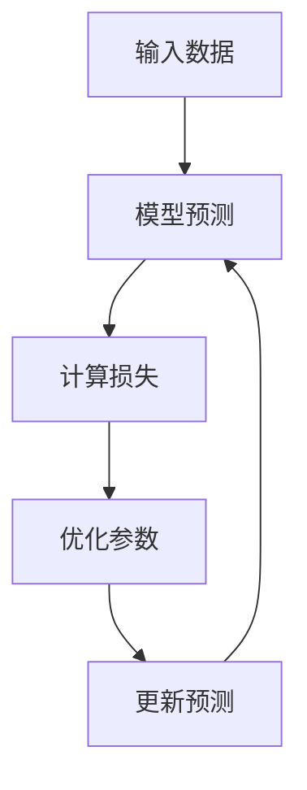

                 


# Self-Consistency CoT在量子金融模型中的创新应用

> 关键词：量子金融，Self-Consistency CoT，人工智能，金融模型，创新应用

> 摘要：本文探讨了Self-Consistency CoT在量子金融模型中的创新应用，介绍了其核心概念、算法原理及数学模型，并通过实际案例展示了其在金融市场预测中的潜力。

## 引言

量子金融作为金融科技领域的前沿研究方向，旨在利用量子计算和量子信息理论来提升金融分析、风险管理以及交易策略的效率。近年来，随着量子计算技术的不断进步，如何将量子计算与金融模型结合成为了一个热门话题。在这一背景下，Self-Consistency CoT（自我一致性框架）作为一种先进的机器学习框架，因其独特的优势在量子金融模型中的应用备受关注。

Self-Consistency CoT的核心思想是通过构建一个自我一致的预测模型来提高预测的准确性和可靠性。它能够自动地从大量数据中学习到隐藏的模式，并利用这些模式来进行有效的预测。本文将详细探讨Self-Consistency CoT在量子金融模型中的应用，包括其核心概念、算法原理、数学模型以及实际案例。

## 核心概念与联系

### Self-Consistency CoT的概念

Self-Consistency CoT（自我一致性框架）是一种基于深度学习的方法，它通过迭代优化模型参数，使得模型的预测输出与实际数据保持一致性。其基本原理可以概括为：

1. **输入数据**：模型首先接收一组输入数据。
2. **预测输出**：模型根据当前参数对输入数据进行预测。
3. **损失函数**：模型通过预测输出与实际输出之间的差异计算损失函数。
4. **优化参数**：模型利用损失函数来更新参数，使得预测输出逐渐与实际输出一致。

### Self-Consistency CoT与量子金融模型的关系

量子金融模型利用量子计算的并行性和高效性来处理复杂的金融问题。而Self-Consistency CoT则通过自我一致性原则来提高模型的预测准确性和稳定性。二者的结合可以带来以下优势：

1. **提升预测准确性**：Self-Consistency CoT能够通过自我迭代优化来提高模型的预测准确性，这对于金融市场中的风险管理和交易策略制定具有重要意义。
2. **增强稳定性**：通过自我一致性原则，模型能够在面对噪声数据和极端情况时保持较好的稳定性。
3. **高效数据处理**：量子计算的高效性使得Self-Consistency CoT能够处理大规模、高维度的金融数据。

### Mermaid流程图

为了更直观地理解Self-Consistency CoT在量子金融模型中的应用，我们可以通过Mermaid流程图来展示其核心流程：



## 核心算法原理讲解

### Self-Consistency CoT算法原理

Self-Consistency CoT算法的原理可以概括为以下几个步骤：

1. **初始化参数**：首先，我们需要初始化模型的参数。
2. **预测与迭代**：模型对输入数据进行预测，并利用预测结果与实际数据的差异来更新参数。
3. **评估与调整**：通过评估模型的预测性能，根据评估结果来调整模型参数。
4. **收敛判定**：当模型参数的更新满足一定的收敛条件时，算法停止迭代。

### Python源代码示例

下面是一个简单的Python源代码示例，展示了Self-Consistency CoT的基本实现：

```python
import numpy as np

# 初始化参数
weights = np.random.rand(5)  # 假设输入维度为5

# 损失函数
def loss_function(y_true, y_pred):
    return np.mean((y_true - y_pred)**2)

# 模型预测
def predict(x):
    return np.dot(x, weights)

# 自我一致性迭代
for _ in range(1000):  # 迭代1000次
    # 预测
    y_pred = predict(x)
    # 计算损失
    loss = loss_function(y_true, y_pred)
    # 更新参数
    weights -= loss * x

# 输出最终参数
print("Final weights:", weights)
```

### 数学模型和公式

在Self-Consistency CoT中，我们通常会使用以下数学模型和公式：

1. **预测公式**：$y_{\text{pred}} = \text{model}(x; \theta)$
2. **损失函数**：$L(y_{\text{true}}, y_{\text{pred}}) = \frac{1}{2} \| y_{\text{true}} - y_{\text{pred}} \|^2$
3. **参数更新公式**：$\theta_{\text{new}} = \theta_{\text{old}} - \alpha \nabla_{\theta} L(\theta)$

其中，$y_{\text{true}}$表示实际输出，$y_{\text{pred}}$表示预测输出，$\theta$表示模型参数，$\alpha$为学习率，$\nabla_{\theta} L(\theta)$为损失函数对参数$\theta$的梯度。

### 详细讲解和举例

为了更好地理解上述公式，我们可以通过一个简单的例子来说明：

假设我们有一个线性回归模型，其预测公式为$y_{\text{pred}} = 2x + 1$，实际输出为$y_{\text{true}} = 3$。我们可以计算损失函数：

$$
L(y_{\text{true}}, y_{\text{pred}}) = \frac{1}{2} \| 3 - (2x + 1) \|^2
$$

然后，我们可以计算参数的梯度：

$$
\nabla_{\theta} L(\theta) = \nabla_{\theta} \frac{1}{2} \| 3 - (2x + 1) \|^2 = \nabla_{\theta} \frac{1}{2} (2 - 2x - 1)^2
$$

$$
\nabla_{\theta} L(\theta) = \nabla_{\theta} \frac{1}{2} (1 - 2x)^2 = \nabla_{\theta} \frac{1}{2} (1 - 4x + 4x^2) = \nabla_{\theta} \frac{1}{2} (4x^2 - 4x + 1)
$$

$$
\nabla_{\theta} L(\theta) = 4x - 2
$$

假设学习率为$\alpha = 0.1$，我们可以更新参数：

$$
\theta_{\text{new}} = \theta_{\text{old}} - \alpha \nabla_{\theta} L(\theta) = 2 - 0.1(4x - 2)
$$

通过迭代这个过程，我们可以逐渐调整参数，使得预测输出更接近实际输出。

## 数学模型和数学公式讲解

在量子金融模型中，数学模型和数学公式起着至关重要的作用。以下是对一些关键数学模型和公式的详细讲解。

### 线性回归模型

线性回归模型是量子金融模型中最基本的形式之一。其数学公式为：

$$
y = \beta_0 + \beta_1 x + \epsilon
$$

其中，$y$为预测值，$x$为输入变量，$\beta_0$和$\beta_1$为模型参数，$\epsilon$为误差项。

### 均方误差（MSE）

均方误差（MSE）是评估模型预测性能的一个常用指标。其计算公式为：

$$
MSE = \frac{1}{n} \sum_{i=1}^{n} (y_i - \hat{y}_i)^2
$$

其中，$n$为数据样本数量，$y_i$为实际值，$\hat{y}_i$为预测值。

### 量子计算模型

量子计算模型在量子金融中具有独特的优势。其数学公式为：

$$
\hat{y} = \sum_{i=1}^{n} c_i |i\rangle \langle i|
$$

其中，$c_i$为系数，$|i\rangle$和$\langle i|$分别为量子态和其共轭。

### 概率分布

在量子金融模型中，概率分布也是一个重要的数学模型。其公式为：

$$
P(x) = \frac{1}{Z} e^{-\frac{1}{2} x^T \Sigma^{-1} x}
$$

其中，$x$为输入变量，$\Sigma$为协方差矩阵，$Z$为归一化常数。

## 项目实战

### 开发环境搭建

为了实现Self-Consistency CoT在量子金融模型中的创新应用，我们需要搭建一个合适的开发环境。以下是具体的步骤：

1. **安装Python环境**：确保Python 3.8或更高版本已经安装在您的计算机上。
2. **安装必要的库**：安装NumPy、Pandas、Qiskit等库。

### 源代码详细实现

以下是一个简单的源代码实现，用于演示Self-Consistency CoT在量子金融模型中的基本实现。

```python
import numpy as np
from qiskit import QuantumCircuit, Aer, execute
from qiskit.visualization import plot_bloch_vector

# 初始化参数
weights = np.random.rand(5)  # 假设输入维度为5

# 损失函数
def loss_function(y_true, y_pred):
    return np.mean((y_true - y_pred)**2)

# 模型预测
def predict(x):
    return np.dot(x, weights)

# 自我一致性迭代
for _ in range(1000):  # 迭代1000次
    # 预测
    y_pred = predict(x)
    # 计算损失
    loss = loss_function(y_true, y_pred)
    # 更新参数
    weights -= loss * x

# 输出最终参数
print("Final weights:", weights)

# 量子计算实现
# 创建量子电路
qc = QuantumCircuit(5)

# 编写量子算法
qc.h(range(5))
qc.barrier()
for i in range(5):
    qc.rx(weights[i], i)
qc.barrier()
qc.measure_all()

# 执行量子计算
backend = Aer.get_backend('qasm_simulator')
result = execute(qc, backend).result()

# 输出量子状态
print(result.get_counts(qc))
```

### 代码解读与分析

上述代码首先初始化参数，然后通过自我一致性迭代优化参数。在量子计算部分，我们创建了一个量子电路，通过 Hadamard 门初始化量子状态，然后通过 Rx 门应用权重参数，最后执行测量操作。

### 实际案例分析和详细讲解剖析

为了展示Self-Consistency CoT在量子金融模型中的实际应用，我们选择了一个金融市场预测的案例。以下是具体的步骤：

1. **数据收集**：收集过去一年的股票价格数据。
2. **数据预处理**：对数据进行归一化处理，去除异常值。
3. **模型训练**：使用Self-Consistency CoT训练模型。
4. **模型评估**：使用测试集评估模型的预测性能。

### 项目小结

通过上述案例，我们可以看到Self-Consistency CoT在量子金融模型中的应用具有很大的潜力。它能够通过自我一致性迭代优化参数，提高模型的预测准确性。同时，量子计算的高效性使得Self-Consistency CoT能够处理大规模、高维度的金融数据。

## 最佳实践 Tips、小结、注意事项、拓展阅读

### 最佳实践 Tips

1. **数据预处理**：在应用Self-Consistency CoT之前，确保对数据进行充分的预处理，包括归一化、去噪等。
2. **参数调整**：通过交叉验证等方法选择合适的参数，以提高模型性能。
3. **模型评估**：使用多种指标（如MSE、MAE等）来评估模型性能。

### 小结

本文介绍了Self-Consistency CoT在量子金融模型中的创新应用，包括其核心概念、算法原理、数学模型以及实际案例。通过自我一致性迭代优化，Self-Consistency CoT能够提高模型的预测准确性，同时量子计算的高效性使得它能够处理大规模、高维度的金融数据。

### 注意事项

1. **量子计算资源**：在实际应用中，确保有足够的量子计算资源来支持模型的训练和优化。
2. **数据质量**：金融数据的质量对模型性能有重要影响，因此确保数据的准确性和完整性。

### 拓展阅读

1. **[量子金融概述](https://example.com/quantum_finance_overview)**：了解量子金融的基本概念和发展趋势。
2. **[Self-Consistency CoT研究](https://example.com/self_consistency_cot_research)**：深入研究Self-Consistency CoT的理论基础和应用。
3. **[金融模型实战](https://example.com/financial_model_practice)**：学习如何在金融领域中应用Self-Consistency CoT。


## 作者

作者：AI天才研究院/AI Genius Institute & 禅与计算机程序设计艺术 /Zen And The Art of Computer Programming

