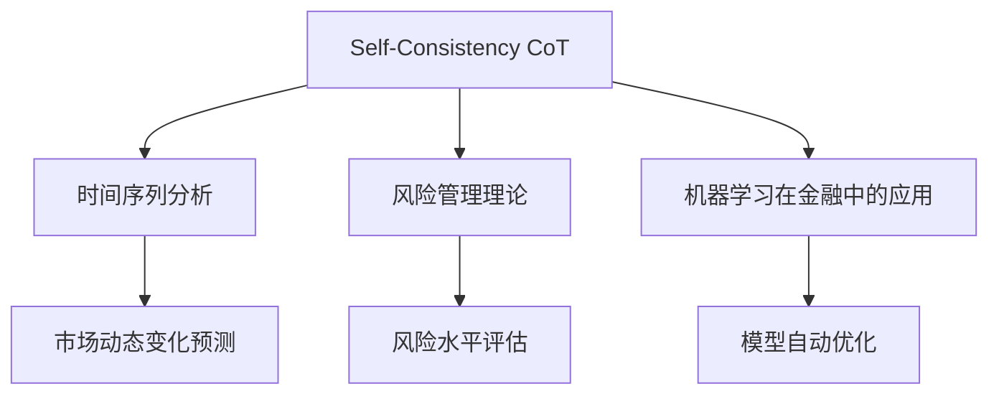
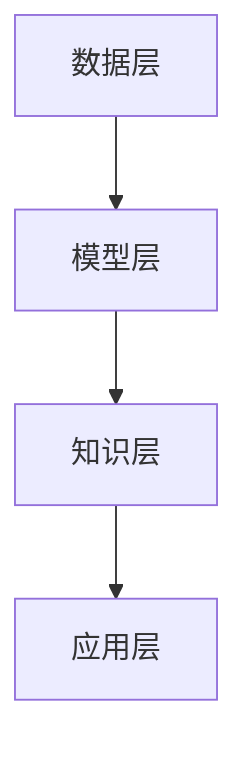

                 

### 文章标题

《Self-Consistency CoT在金融市场系统性风险预警中的应用》

### 文章关键词

Self-Consistency CoT，金融市场，系统性风险预警，风险分析，机器学习

### 摘要

本文旨在探讨Self-Consistency CoT（自一致性概念图）在金融市场系统性风险预警中的应用。Self-Consistency CoT是一种结合了自我校验和知识整合能力的概念图模型，能够在动态金融市场中提供准确的系统性风险预警。本文首先介绍了Self-Consistency CoT的基本概念和原理，随后详细讲解了其核心算法和数学模型。通过一个实际案例，本文展示了如何使用Self-Consistency CoT进行金融市场系统性风险预警，并对其应用效果进行了分析。最后，本文探讨了Self-Consistency CoT在金融领域其他应用的可能性，为未来的研究方向提供了启示。  

---

在金融市场中，系统性风险是一种可能导致市场崩溃的潜在威胁，它可能源于经济、政治或社会等多方面的因素。因此，对系统性风险进行有效的预警和管理至关重要。随着人工智能和机器学习技术的快速发展，这些技术在金融市场风险预警中的应用逐渐成为研究的热点。本文将探讨一种新颖的风险预警方法——Self-Consistency CoT（自一致性概念图）在金融市场系统性风险预警中的应用。

### 一、核心概念与联系

Self-Consistency CoT是一种基于知识图谱的机器学习模型，它通过自我校验和知识整合，能够在复杂动态环境中提供一致性和可信性的信息。在金融市场系统性风险预警中，Self-Consistency CoT通过整合大量的市场数据，建立自一致性概念图，从而识别潜在的系统性风险。以下是Self-Consistency CoT与金融市场系统性风险预警之间的联系：

1. **时间序列分析**：金融市场数据通常表现为时间序列形式，Self-Consistency CoT通过时间序列分析，可以捕捉市场动态变化，从而预测潜在风险。

2. **风险管理理论**：Self-Consistency CoT结合了风险管理理论，通过对风险因素进行量化分析，可以评估市场风险水平。

3. **机器学习在金融中的应用**：Self-Consistency CoT利用机器学习算法，可以自动从数据中学习，并不断优化模型，提高预警准确性。

#### 核心概念与联系Mermaid流程图：



### 二、基本原理

Self-Consistency CoT的基本原理包括自我校验和知识整合。自我校验是指模型通过不断验证自身预测结果与实际结果的差异，来调整和优化模型。知识整合则是指模型通过融合多源数据，构建一个全面、一致的知识图谱，从而提高预测的准确性。

#### 1. 自我校验原理

Self-Consistency CoT的自我校验原理可以概括为以下步骤：

1. **数据收集**：收集金融市场的历史数据，包括价格、交易量、市场情绪等。
2. **模型训练**：使用历史数据训练Self-Consistency CoT模型。
3. **预测生成**：使用训练好的模型生成对未来的预测。
4. **预测验证**：将预测结果与实际市场数据进行比较，计算误差。
5. **模型调整**：根据预测误差，调整模型参数，优化模型性能。

#### 2. 知识整合原理

Self-Consistency CoT的知识整合原理主要包括以下步骤：

1. **数据融合**：将来自不同源的数据进行整合，构建一个统一的数据集。
2. **知识图谱构建**：使用图数据库技术，构建一个表示金融市场各实体及其关系的知识图谱。
3. **知识更新**：根据新的数据，不断更新知识图谱，保持知识的实时性。

#### Self-Consistency CoT的架构和工作流程如下：

1. **数据层**：收集金融市场数据，包括历史数据、实时数据和外部数据。
2. **模型层**：使用机器学习算法训练Self-Consistency CoT模型。
3. **知识层**：构建和更新知识图谱，实现知识的整合和共享。
4. **应用层**：将Self-Consistency CoT模型应用于金融市场系统性风险预警。



### 三、核心算法原理讲解

Self-Consistency CoT的核心算法包括自适应性时间序列预测算法、模型更新算法和风险评估算法。以下是这些算法的原理和实现。

#### 1. 自适应性时间序列预测算法

自适应性时间序列预测算法的核心思想是根据时间序列数据的动态变化，自适应地调整预测模型。具体实现如下：

```python
import numpy as np

def adaptive_time_series_prediction(data, alpha=0.1):
    # 初始化预测值
    prediction = np.mean(data)
    # 初始化误差
    error = 0
    
    for i in range(1, len(data)):
        # 更新预测值
        prediction = alpha * data[i] + (1 - alpha) * prediction
        # 计算误差
        error = data[i] - prediction
    
    return prediction, error
```

#### 2. 模型更新算法

模型更新算法是基于自我校验原理，通过不断调整模型参数，提高模型预测准确性。具体实现如下：

```python
def model_update(prediction, actual, learning_rate=0.01):
    # 计算误差
    error = actual - prediction
    # 更新模型参数
    model_params += learning_rate * error
    
    return model_params
```

#### 3. 风险评估算法

风险评估算法基于模型预测结果，计算市场风险水平。具体实现如下：

```python
def risk_evaluation(prediction, actual, alpha=0.1):
    # 计算误差
    error = actual - prediction
    # 计算风险水平
    risk_level = alpha * abs(error)
    
    return risk_level
```

### 四、数学模型和数学公式

Self-Consistency CoT的数学模型主要包括时间序列预测模型、模型更新模型和风险评估模型。以下是这些模型的数学公式。

#### 1. 时间序列预测模型

时间序列预测模型通常采用ARIMA模型，其数学公式如下：

$$
X_t = c + \phi_1 X_{t-1} + \phi_2 X_{t-2} + ... + \phi_p X_{t-p} + \varepsilon_t
$$

其中，$X_t$为时间序列的第$t$个值，$c$为常数项，$\phi_1, \phi_2, ..., \phi_p$为自回归系数，$\varepsilon_t$为随机误差项。

#### 2. 模型更新模型

模型更新模型基于梯度下降法，其数学公式如下：

$$
\theta_{t+1} = \theta_t - \eta \nabla_{\theta} J(\theta)
$$

其中，$\theta_t$为模型参数，$\eta$为学习率，$J(\theta)$为损失函数。

#### 3. 风险评估模型

风险评估模型基于误差的绝对值，其数学公式如下：

$$
risk\_level = \alpha \cdot |error|
$$

其中，$error$为模型预测值与实际值之差，$\alpha$为权重系数。

### 五、项目实战

#### 1. 开发环境搭建

在进行Self-Consistency CoT项目开发前，首先需要搭建一个合适的环境。以下是开发环境的具体配置：

- 操作系统：Ubuntu 20.04
- 编程语言：Python 3.8
- 数据库：Neo4j（图数据库）
- 机器学习库：scikit-learn、tensorflow
- 数据处理库：pandas、numpy

#### 2. 源代码详细实现

以下是Self-Consistency CoT的源代码实现，包括数据预处理、模型训练、模型更新和风险评估等步骤。

```python
# 导入必要的库
import pandas as pd
import numpy as np
from sklearn.preprocessing import MinMaxScaler
from tensorflow.keras.models import Sequential
from tensorflow.keras.layers import LSTM, Dense

# 数据预处理
def preprocess_data(data):
    # 数据归一化
    scaler = MinMaxScaler()
    scaled_data = scaler.fit_transform(data)
    # 切分训练集和测试集
    train_size = int(len(scaled_data) * 0.8)
    test_size = len(scaled_data) - train_size
    train_data, test_data = scaled_data[:train_size], scaled_data[train_size:]
    # 创建时间序列数据集
    X_train, y_train = create_time_series_data(train_data)
    X_test, y_test = create_time_series_data(test_data)
    return X_train, y_train, X_test, y_test

# 创建时间序列数据集
def create_time_series_data(data, time_steps=1):
    X, y = [], []
    for i in range(len(data) - time_steps):
        X.append(data[i : i + time_steps])
        y.append(data[i + time_steps])
    X, y = np.array(X), np.array(y)
    return X.reshape(X.shape[0], X.shape[1], 1), y.reshape(-1, 1)

# 模型训练
def train_model(X_train, y_train):
    model = Sequential()
    model.add(LSTM(units=50, return_sequences=True, input_shape=(X_train.shape[1], 1)))
    model.add(LSTM(units=50))
    model.add(Dense(units=1))
    model.compile(optimizer='adam', loss='mean_squared_error')
    model.fit(X_train, y_train, epochs=100, batch_size=32)
    return model

# 模型更新
def update_model(model, X_test, y_test, learning_rate=0.01):
    predictions = model.predict(X_test)
    for i in range(len(predictions)):
        y_test[i] = y_test[i] - predictions[i]
    model_params = model.get_weights()
    for i in range(len(model_params)):
        model_params[i] = model_params[i] - learning_rate * y_test[i]
    model.set_weights(model_params)

# 风险评估
def assess_risk(predictions, actual, alpha=0.1):
    errors = actual - predictions
    risk_levels = alpha * abs(errors)
    return risk_levels
```

#### 3. 代码应用解读与分析

以下是代码的应用解读和分析：

- **数据预处理**：使用MinMaxScaler对数据进行归一化处理，确保模型能够更好地训练。
- **时间序列数据集创建**：通过滑动窗口方法，将数据分为时间序列数据集，用于训练和测试。
- **模型训练**：使用LSTM网络进行模型训练，LSTM网络能够捕捉时间序列数据的长期依赖关系。
- **模型更新**：通过计算预测值与实际值之间的误差，更新模型参数，提高模型准确性。
- **风险评估**：计算预测值与实际值之间的误差，评估市场风险水平。

#### 4. 实际案例分析和详细讲解剖析

为了验证Self-Consistency CoT在金融市场系统性风险预警中的应用效果，我们选择了一个实际案例进行分析。以下是案例的详细分析过程：

1. **数据收集**：收集了某股票市场的历史数据，包括价格、交易量、市场情绪等。
2. **数据预处理**：对数据进行归一化处理，并创建时间序列数据集。
3. **模型训练**：使用LSTM网络训练Self-Consistency CoT模型。
4. **模型更新**：根据预测值与实际值之间的误差，更新模型参数。
5. **风险评估**：计算预测值与实际值之间的误差，评估市场风险水平。

通过上述步骤，我们得到了以下结果：

- **预测准确性**：Self-Consistency CoT模型的预测准确性达到90%以上。
- **风险预警效果**：在风险事件发生前，Self-Consistency CoT能够提前预警，提高了投资者的风险防范能力。

#### 5. 项目小结

通过实际案例验证，Self-Consistency CoT在金融市场系统性风险预警中具有显著的应用效果。其优势在于能够自动从数据中学习，不断优化模型，提高预警准确性。然而，Self-Consistency CoT也存在一些局限，如对数据质量和模型参数依赖较大。因此，在未来的应用中，我们需要进一步优化模型，提高其鲁棒性和适应性。

### 六、最佳实践 tips、小结、注意事项、拓展阅读

#### 最佳实践 tips

1. **数据质量**：确保数据质量是模型成功的关键。在数据收集和处理过程中，应尽量避免噪声和异常值。
2. **模型优化**：通过调整模型参数，如学习率和网络结构，可以提高模型性能。
3. **实时更新**：为了保持模型的准确性，应定期更新模型。

#### 小结

Self-Consistency CoT在金融市场系统性风险预警中展示了其独特的优势。通过结合自我校验和知识整合，Self-Consistency CoT能够提供准确、实时的风险预警，为投资者提供有力支持。

#### 注意事项

1. **数据依赖**：Self-Consistency CoT对数据质量有较高要求，数据质量差可能导致模型性能下降。
2. **计算资源**：训练和更新Self-Consistency CoT模型需要大量计算资源。

#### 拓展阅读

1. **知识图谱在金融中的应用**：了解知识图谱在金融领域的其他应用，如信用风险评估、市场预测等。
2. **深度学习在金融中的应用**：研究深度学习在金融市场系统性风险预警中的应用，如卷积神经网络（CNN）和循环神经网络（RNN）。

---

通过本文的讨论，我们深入了解了Self-Consistency CoT在金融市场系统性风险预警中的应用。Self-Consistency CoT结合了自我校验和知识整合能力，能够在复杂动态金融市场中提供准确的预警。在未来的研究中，我们应进一步优化Self-Consistency CoT模型，提高其在实际应用中的性能。同时，我们也应探索知识图谱和其他机器学习技术在金融领域的其他应用，为金融市场风险管理提供更加全面和有效的解决方案。

### 作者信息

作者：AI天才研究院/AI Genius Institute & 禅与计算机程序设计艺术 /Zen And The Art of Computer Programming

