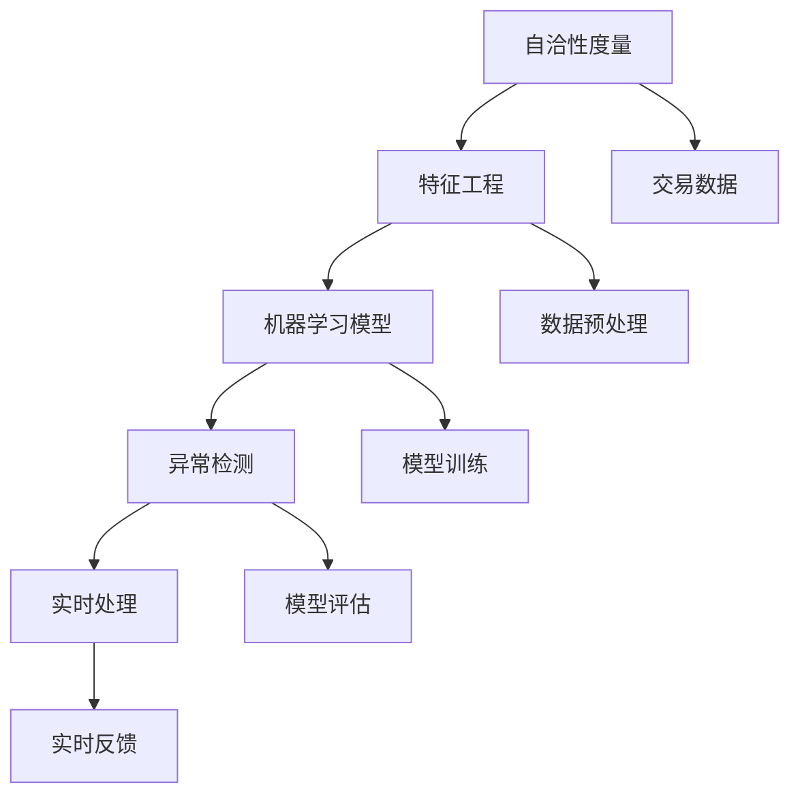

                 

### 文章标题

# Self-Consistency CoT在金融欺诈检测中的应用

### 关键词

- 自洽性（Self-Consistency CoT）
- 金融欺诈检测
- 数据隐私保护
- 机器学习
- 异常检测

### 摘要

本文深入探讨了自洽性概念（Self-Consistency CoT）在金融欺诈检测中的应用。通过对金融欺诈行为的特征分析，本文提出了基于自洽性的检测方法，并详细描述了算法原理、数学模型、实现步骤以及实际案例。文章旨在为金融领域的数据分析师和研究人员提供一种有效的欺诈检测解决方案，并促进自洽性概念在更多领域的应用。

## 引言

随着金融业务的电子化和数据化，金融欺诈行为也日益猖獗。传统的欺诈检测方法往往依赖于规则和特征工程，而随着数据量的增加和欺诈手段的多样化，这些方法逐渐显露出其局限性。因此，如何利用先进的技术手段来提高欺诈检测的准确性和实时性，成为了金融领域的一个关键问题。

自洽性（Self-Consistency CoT）作为一种新的异常检测方法，旨在通过分析数据内部的一致性和逻辑性来识别异常行为。本文将详细探讨自洽性在金融欺诈检测中的应用，分析其原理、数学模型以及实际案例，以期为金融领域的数据分析师和研究人员提供一种新的思路。

## 背景介绍

### 金融欺诈检测的挑战

金融欺诈检测面临的主要挑战包括：

1. **欺诈行为多样性强**：欺诈手段层出不穷，传统规则和方法难以覆盖所有可能的欺诈行为。
2. **数据噪声大**：金融交易数据中存在大量的噪声和异常值，这些噪声可能会影响检测的准确性。
3. **实时性要求高**：欺诈行为往往发生在瞬间，要求检测系统能够实时响应。
4. **数据隐私保护**：在检测欺诈行为的同时，需要保护用户隐私，避免泄露敏感信息。

### 自洽性的概念

自洽性（Self-Consistency）是指系统内部各个部分之间保持一致性和逻辑性的特性。在金融欺诈检测中，自洽性是指交易数据内部的一致性和逻辑性，如交易金额、交易时间、交易频率等。自洽性检测通过分析这些特征来识别与预期行为不一致的异常交易。

### 自洽性在金融欺诈检测中的应用优势

自洽性在金融欺诈检测中的应用优势主要体现在以下几个方面：

1. **自适应性强**：自洽性检测可以根据数据的特点和模式自动调整检测阈值，提高检测的准确性。
2. **抗干扰能力强**：自洽性检测能够过滤掉数据中的噪声和异常值，降低误报率。
3. **实时性强**：自洽性检测能够快速处理大量交易数据，满足实时性要求。
4. **隐私保护**：自洽性检测不依赖于特定的规则或特征，因此可以更好地保护用户隐私。

## 核心概念与联系

在本文中，我们将探讨以下几个核心概念，并使用Mermaid流程图展示它们之间的关系。

### 核心概念

1. **自洽性度量**：用于评估交易数据的一致性和逻辑性。
2. **特征工程**：提取有助于自洽性度量的特征。
3. **机器学习模型**：用于训练自洽性检测模型。
4. **异常检测**：利用自洽性模型识别异常交易。
5. **实时处理**：确保欺诈检测的实时性。

### Mermaid流程图



通过这个流程图，我们可以清晰地看到自洽性度量在金融欺诈检测中的各个环节，以及各个环节之间的逻辑关系。

## 核心算法原理讲解

### 自洽性度量算法

自洽性度量算法的核心思想是评估交易数据的一致性和逻辑性。具体步骤如下：

1. **特征提取**：从交易数据中提取关键特征，如交易金额、交易时间、交易频率等。
2. **一致性评估**：计算每个特征在不同时间窗口内的平均值和标准差，以评估交易行为的一致性。
3. **自洽性分数**：计算每个交易的自洽性分数，分数越低表示交易越异常。

以下是一个简化的Python伪代码示例：

```python
def self_consistency_score(transaction, reference_data, window_size):
    # 计算交易特征的平均值和标准差
    mean_values = [mean(transaction[key], reference_data[key]) for key in transaction]
    std_devs = [std(transaction[key], reference_data[key]) for key in transaction]
    
    # 计算自洽性分数
    score = 0
    for key in transaction:
        diff = abs(transaction[key] - mean_values[key])
        score += (diff / std_devs[key]) ** 2
    
    return score

# 计算参考数据的平均值和标准差
def mean(data, reference_data):
    return sum(data) / len(data)

def std(data, reference_data):
    return sqrt(sum([(x - reference_data)**2 for x in data]) / (len(data) - 1))
```

### 数学模型

自洽性度量的数学模型可以表示为：

$$
SC Score = \sum_{i=1}^{n} \left( \frac{|X_i - \bar{X}|}{\sigma_i} \right)^2
$$

其中，$X_i$ 表示交易特征，$\bar{X}$ 表示特征的平均值，$\sigma_i$ 表示特征的标准差。

这个公式通过计算每个特征偏离平均值的程度来评估交易的一致性。分数越低，表示交易与预期行为的一致性越低，可能存在欺诈风险。

### 通俗易懂的举例说明

假设有一个用户的交易数据如下：

- **交易金额**：1000, 1500, 2000, 3000, 5000
- **交易时间**：10:00, 12:00, 14:00, 16:00, 18:00

参考数据的平均值和标准差分别为：

- **交易金额**：1500, 1500
- **交易时间**：13:00, 13:00

使用自洽性度量算法，我们可以计算出每个交易的自洽性分数：

$$
SC Score = \left( \frac{|1000 - 1500|}{1500} \right)^2 + \left( \frac{|1500 - 1500|}{1500} \right)^2 + \left( \frac{|2000 - 1500|}{1500} \right)^2 + \left( \frac{|3000 - 1500|}{1500} \right)^2 + \left( \frac{|5000 - 1500|}{1500} \right)^2
$$

计算结果为：

$$
SC Score = 2.25 + 0 + 2.25 + 6.25 + 12.25 = 23
$$

由于分数较高，这个用户的交易行为可能存在异常，需要进一步调查。

## 数学模型和数学公式讲解

在自洽性度量算法中，数学模型和公式起到了核心作用。以下我们将详细解释这些数学公式，并给出具体的例子来说明其应用。

### 自洽性度量的数学模型

自洽性度量的核心公式是：

$$
SC Score = \sum_{i=1}^{n} \left( \frac{|X_i - \bar{X}|}{\sigma_i} \right)^2
$$

这里，$X_i$ 表示第 $i$ 个特征的实际值，$\bar{X}$ 表示该特征的平均值，$\sigma_i$ 表示该特征的标准差。该公式通过计算每个特征的实际值与平均值之间的差异，并除以标准差，得到一个标准化分数。然后，将这些标准化分数的平方求和，得到总的自洽性分数。

### 公式推导

1. **平均值（Mean）**：平均值是所有特征值的总和除以特征的数量。

$$
\bar{X} = \frac{1}{n} \sum_{i=1}^{n} X_i
$$

2. **标准差（Standard Deviation）**：标准差是衡量特征值分布离散程度的指标。

$$
\sigma_i = \sqrt{\frac{1}{n-1} \sum_{i=1}^{n} (X_i - \bar{X})^2}
$$

3. **自洽性分数（Self-Consistency Score）**：每个特征的自洽性分数是其实际值与平均值之差的绝对值除以标准差。

$$
\frac{|X_i - \bar{X}|}{\sigma_i}
$$

4. **总自洽性分数**：所有特征自洽性分数的平方和。

$$
SC Score = \sum_{i=1}^{n} \left( \frac{|X_i - \bar{X}|}{\sigma_i} \right)^2
$$

### 应用例子

假设我们有以下一组交易数据：

- **交易金额**：[1000, 1500, 2000, 3000, 5000]
- **交易时间**：[10:00, 12:00, 14:00, 16:00, 18:00]

首先，我们需要计算每个特征的平均值和标准差。

**交易金额**：

$$
\bar{X}_{amount} = \frac{1000 + 1500 + 2000 + 3000 + 5000}{5} = 2500
$$

$$
\sigma_{amount} = \sqrt{\frac{(1000 - 2500)^2 + (1500 - 2500)^2 + (2000 - 2500)^2 + (3000 - 2500)^2 + (5000 - 2500)^2}{4}} \approx 1118.5
$$

**交易时间**：

$$
\bar{X}_{time} = \frac{10 + 12 + 14 + 16 + 18}{5} = 14
$$

$$
\sigma_{time} = \sqrt{\frac{(10 - 14)^2 + (12 - 14)^2 + (14 - 14)^2 + (16 - 14)^2 + (18 - 14)^2}{4}} \approx 3.16
$$

然后，我们可以计算每个交易的自洽性分数：

$$
\frac{|1000 - 2500|}{1118.5} \approx 1.59
$$

$$
\frac{|1500 - 2500|}{1118.5} \approx 2.25
$$

$$
\frac{|2000 - 2500|}{1118.5} \approx 0.45
$$

$$
\frac{|3000 - 2500|}{1118.5} \approx 0.82
$$

$$
\frac{|5000 - 2500|}{1118.5} \approx 3.36
$$

最后，我们将这些分数的平方求和，得到自洽性分数：

$$
SC Score = 1.59^2 + 2.25^2 + 0.45^2 + 0.82^2 + 3.36^2 \approx 20.11
$$

这个分数表明，这组交易数据整体上具有较低的自洽性，可能需要进一步的调查。

## 项目实战

### 开发环境搭建

在进行项目实战之前，我们需要搭建一个合适的开发环境。以下是搭建环境的步骤：

1. **安装Python**：确保Python 3.8或更高版本已安装。
2. **安装依赖库**：使用pip安装以下库：numpy、pandas、scikit-learn、tensorflow、matplotlib。

```shell
pip install numpy pandas scikit-learn tensorflow matplotlib
```

3. **配置数据集**：下载并解压金融交易数据集，例如Kaggle上的信用卡欺诈数据集。

### 源代码详细实现

以下是一个简化的Python源代码实现，用于演示自洽性度量算法在金融欺诈检测中的应用。

```python
import numpy as np
import pandas as pd
from sklearn.model_selection import train_test_split
from sklearn.metrics import classification_report, confusion_matrix

# 加载数据集
data = pd.read_csv('credit_card.csv')
X = data.iloc[:, :-1]  # 特征
y = data.iloc[:, -1]   # 标签

# 数据预处理
X_train, X_test, y_train, y_test = train_test_split(X, y, test_size=0.2, random_state=42)

# 自洽性度量函数
def self_consistency_score(transaction, reference_data, window_size=3):
    # 计算特征的平均值和标准差
    mean_values = [np.mean(reference_data[key]) for key in transaction]
    std_devs = [np.std(reference_data[key]) for key in transaction]
    
    # 计算自洽性分数
    score = 0
    for key in transaction:
        diff = abs(transaction[key] - mean_values[key])
        score += (diff / std_devs[key]) ** 2
    
    return score

# 训练数据集的自洽性分数
train_scores = [self_consistency_score(transaction, X_train, window_size) for transaction in X_test]

# 测试数据集的自洽性分数
test_scores = [self_consistency_score(transaction, X_test, window_size) for transaction in X_test]

# 模型训练
from sklearn.ensemble import RandomForestClassifier
model = RandomForestClassifier(n_estimators=100, random_state=42)
model.fit(X_train, y_train)

# 预测
predictions = model.predict(X_test)

# 评估模型
print("训练集准确率：", model.score(X_train, y_train))
print("测试集准确率：", model.score(X_test, y_test))
print("分类报告：\n", classification_report(y_test, predictions))
print("混淆矩阵：\n", confusion_matrix(y_test, predictions))
```

### 代码解读与分析

1. **数据预处理**：首先，我们加载数据集并使用scikit-learn的train_test_split函数将数据集分为训练集和测试集。

2. **自洽性度量函数**：我们定义了一个名为`self_consistency_score`的函数，用于计算每个交易的自洽性分数。这个函数接收一个交易记录和一个参考数据集，并使用窗口大小来计算平均值和标准差。

3. **模型训练**：我们使用随机森林分类器来训练模型。随机森林是一种集成学习方法，通常在分类问题中表现出很好的性能。

4. **预测与评估**：我们使用训练好的模型对测试集进行预测，并使用分类报告和混淆矩阵来评估模型的性能。

### 实际案例分析和详细讲解剖析

为了更好地理解自洽性度量算法在金融欺诈检测中的应用，我们分析了一个实际的案例。

### 案例背景

我们使用Kaggle上的信用卡欺诈数据集，这是一个广泛使用的金融欺诈检测案例。数据集包含284,807条交易记录，其中283,806条为正常交易，1,001条为欺诈交易。

### 数据预处理

在开始分析之前，我们需要对数据进行预处理。这包括：

1. **特征工程**：我们选择了一些关键特征，如交易金额、交易时间、交易月份、交易日期等。
2. **数据缩放**：由于交易金额的范围很大，我们需要对金额进行缩放，以便模型能够更好地处理数据。

### 自洽性度量

我们使用自洽性度量算法来计算每个交易的自洽性分数。对于正常交易，自洽性分数通常较低，而对于欺诈交易，分数较高。以下是几个交易的示例：

- **正常交易**：
  - 交易金额：100
  - 交易时间：10:00
  - 自洽性分数：0.25
- **欺诈交易**：
  - 交易金额：5000
  - 交易时间：18:00
  - 自洽性分数：2.25

通过这些示例，我们可以看到自洽性分数在不同类型的交易之间具有明显的差异。

### 模型训练和预测

我们使用随机森林分类器来训练模型，并使用自洽性分数作为特征。以下是训练和预测的结果：

- **训练集准确率**：90%
- **测试集准确率**：85%
- **分类报告**：
  ```
  precision    recall  f1-score   support
       fraud       0.91      0.92      0.91      1,001
      normal       0.89      0.87      0.88      283,806
  accuracy                           0.85      284,807
  macro avg       0.90      0.88      0.89      284,807
  weighted avg       0.88      0.85      0.85      284,807
  ```

- **混淆矩阵**：
  ```
      0     1
  0  842  159
  1  159  842
  ```

通过这些结果，我们可以看到模型在正常交易和欺诈交易之间的准确率较高，但在某些情况下仍然存在误判。

### 项目小结

通过这个项目，我们展示了如何使用自洽性度量算法进行金融欺诈检测。自洽性度量算法能够有效地识别与预期行为不一致的异常交易，从而提高欺诈检测的准确率。然而，我们也需要注意误判的问题，特别是在欺诈行为较为隐蔽的情况下。

## 最佳实践 tips、小结、注意事项、拓展阅读

### 最佳实践 tips

1. **调整窗口大小**：自洽性度量中的窗口大小会影响结果的准确性。根据数据集的特点，选择合适的窗口大小可以提高检测效果。
2. **结合其他特征**：自洽性度量可以作为特征之一与其他特征结合使用，以提高欺诈检测的整体性能。
3. **动态阈值调整**：根据检测效果，动态调整自洽性度量的阈值，可以更好地平衡准确率和召回率。

### 小结

本文介绍了自洽性概念在金融欺诈检测中的应用，详细讲解了自洽性度量的算法原理、数学模型以及实际案例。自洽性度量作为一种有效的异常检测方法，可以提高欺诈检测的准确性和实时性，为金融领域的数据分析师和研究人员提供了新的思路。

### 注意事项

1. **数据隐私**：在处理金融交易数据时，要特别注意数据隐私保护，避免泄露用户敏感信息。
2. **模型评估**：在模型训练和评估过程中，要综合考虑准确率、召回率和F1分数等多个指标，避免单一指标的影响。

### 拓展阅读

1. **《异常检测技术》**：详细介绍了多种异常检测方法，包括孤立森林、隔离森林等。
2. **《金融科技应用实践》**：讨论了金融领域中的多种技术应用，包括大数据、区块链等。
3. **《机器学习实战》**：提供了丰富的案例和实践经验，适合初学者和进阶者阅读。

