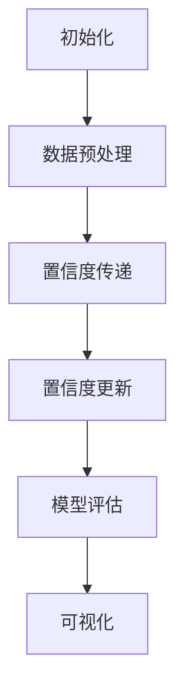

                 

# Self-Consistency CoT在金融风险评估中的创新应用

## 关键词

- Self-Consistency CoT
- 金融风险评估
- 算法原理
- 数学模型
- 项目实战

## 摘要

本文旨在探讨Self-Consistency CoT在金融风险评估中的应用及其创新性。首先，我们介绍了Self-Consistency CoT的基本概念及其在金融风险评估中的重要性。接着，我们深入分析了Self-Consistency CoT的原理和架构，并通过Mermaid流程图展示了其工作流程。随后，我们详细讲解了Self-Consistency CoT的核心算法原理，包括伪代码和数学公式。最后，我们通过一个实际案例，展示了Self-Consistency CoT在金融风险评估中的具体应用，并分析了其面临的挑战和未来趋势。本文希望为从事金融风险评估的研究者和从业者提供有价值的参考。

## 第一部分：核心概念与联系

### 第1章：Self-Consistency CoT概念及其在金融风险评估中的重要性

#### 1.1 Self-Consistency CoT基础知识

Self-Consistency CoT，即自一致性置信度传递，是一种基于置信度传递（Confidence Propagation）的算法。其基本思想是，通过传递节点的置信度信息，不断更新整个网络的置信度分布，从而实现对复杂系统的推理和预测。

在金融风险评估中，Self-Consistency CoT可以用来评估金融系统的稳定性、风险等级以及潜在的风险因素。具体来说，Self-Consistency CoT可以通过分析金融市场的数据，识别出潜在的风险节点，并计算这些节点的置信度，从而实现对金融风险的评估。

#### 1.2 Self-Consistency CoT与金融风险评估的关系

金融风险评估通常需要处理大量的数据和信息，这些数据和信息往往存在复杂的关系和不确定性。传统的风险评估方法往往依赖于经验规则和人为判断，难以全面、准确地评估金融风险。

相比之下，Self-Consistency CoT提供了一种基于数据驱动的方法，通过传递节点的置信度信息，实现对复杂金融系统的自动推理和预测。这使得Self-Consistency CoT在金融风险评估中具有显著的优势。

#### 1.3 Self-Consistency CoT与传统风险评估方法的比较

传统风险评估方法通常依赖于专家经验、历史数据和人为规则。这些方法往往存在以下问题：

1. **主观性强**：传统方法依赖于专家的主观判断，容易受到人为因素的影响。
2. **灵活性差**：传统方法难以适应快速变化的金融市场环境。
3. **数据利用率低**：传统方法通常无法充分利用大量的金融市场数据。

相比之下，Self-Consistency CoT具有以下优势：

1. **客观性强**：Self-Consistency CoT基于数据驱动，能够客观地评估金融风险。
2. **灵活性高**：Self-Consistency CoT可以自动适应金融市场环境的变化。
3. **数据利用率高**：Self-Consistency CoT能够充分利用大量的金融市场数据。

综上所述，Self-Consistency CoT在金融风险评估中具有显著的潜力，有望成为未来金融风险评估的重要工具。

### 第2章：Self-Consistency CoT原理与架构

#### 2.1 Self-Consistency CoT工作原理

Self-Consistency CoT的核心算法基于置信度传递原理。具体来说，它通过以下步骤进行操作：

1. **初始化**：首先初始化网络中各个节点的置信度值。
2. **传递**：然后，从网络的起始节点开始，依次向其他节点传递置信度信息。
3. **更新**：在每个节点接收置信度信息后，更新自身的置信度值。
4. **重复**：重复传递和更新过程，直到达到预定的迭代次数或置信度值收敛。

通过这样的迭代过程，Self-Consistency CoT可以逐步调整网络中各个节点的置信度，实现对复杂系统的推理和预测。

#### 2.2 Self-Consistency CoT架构

Self-Consistency CoT的架构通常包括以下几个模块：

1. **数据预处理模块**：负责处理输入数据，将其转换为适合进行置信度传递的格式。
2. **置信度传递模块**：负责实现置信度传递算法，包括初始化、传递、更新等过程。
3. **模型评估模块**：负责评估置信度传递的结果，包括准确性、可靠性等指标。
4. **可视化模块**：负责将置信度传递的结果可视化，帮助用户更好地理解系统的置信度分布。

#### 2.3 Mermaid流程图展示

以下是一个简单的Mermaid流程图，展示了Self-Consistency CoT的工作流程：



通过这个流程图，我们可以清晰地看到Self-Consistency CoT的各个步骤及其相互关系。

## 第二部分：核心算法原理讲解

### 第3章：Self-Consistency CoT算法深入剖析

#### 3.1 Self-Consistency CoT算法核心部分

Self-Consistency CoT算法的核心部分包括两个关键步骤：置信度传递和置信度更新。

**置信度传递**：在置信度传递过程中，每个节点根据其邻居节点的置信度信息，计算出一个新的置信度值。具体来说，对于一个节点 \( v \)，其新置信度值 \( \hat{c}_v \) 可以通过以下公式计算：

\[ \hat{c}_v = \frac{\sum_{w \in \text{邻居}(v)} c_{w} P_{vw}}{\sum_{w \in \text{邻居}(v)} P_{vw}} \]

其中，\( c_{w} \) 是节点 \( w \) 的置信度值，\( P_{vw} \) 是节点 \( v \) 到节点 \( w \) 的边权重。

**置信度更新**：在置信度更新过程中，每个节点根据其新置信度值，更新自身的置信度值。具体来说，对于一个节点 \( v \)，其更新后的置信度值 \( c_v \) 可以通过以下公式计算：

\[ c_v = \frac{1}{Z} \sum_{w \in \text{邻居}(v)} P_{vw} \hat{c}_w \]

其中，\( Z \) 是一个归一化常数，用于确保所有节点的置信度值之和为1。

#### 3.2 Self-Consistency CoT算法伪代码讲解

以下是一个简化的Self-Consistency CoT算法伪代码：

```python
# Self-Consistency CoT 算法伪代码
function SelfConsistencyCoT(data, parameters):
    // 数据预处理
    preprocessedData = preprocessData(data)
    
    // 初始化模型
    model = initializeModel(preprocessedData, parameters)
    
    // 训练模型
    for i = 1 to training_iterations:
        model = trainModel(model, preprocessedData)
        
    // 评估模型
    evaluation = evaluateModel(model, preprocessedData)
    
    return model, evaluation
```

在这个伪代码中，`preprocessData` 函数负责对输入数据进行预处理，`initializeModel` 函数负责初始化模型参数，`trainModel` 函数负责训练模型，`evaluateModel` 函数负责评估模型性能。

#### 3.3 Self-Consistency CoT算法效果评估

Self-Consistency CoT算法的效果可以通过多个指标进行评估，包括准确性、可靠性、效率等。以下是一个简单的效果评估伪代码：

```python
# Self-Consistency CoT 算法效果评估伪代码
function evaluateModel(model, data):
    // 预测结果
    predictions = predictModel(model, data)
    
    // 计算准确性
    accuracy = calculateAccuracy(predictions, data.labels)
    
    // 计算可靠性
    reliability = calculateReliability(predictions)
    
    // 计算效率
    efficiency = calculateEfficiency(model)
    
    return accuracy, reliability, efficiency
```

在这个伪代码中，`predictModel` 函数负责使用模型进行预测，`calculateAccuracy` 函数负责计算预测的准确性，`calculateReliability` 函数负责计算预测的可靠性，`calculateEfficiency` 函数负责计算模型的效率。

## 第三部分：数学模型与公式讲解

### 第4章：Self-Consistency CoT的数学模型

#### 4.1 Self-Consistency CoT的损失函数

在Self-Consistency CoT中，损失函数用于衡量模型预测结果与实际结果之间的差异。一个常见的损失函数是均方误差（Mean Squared Error, MSE），其定义如下：

\[ L = \frac{1}{m} \sum_{i=1}^{m} (y_i - \hat{y}_i)^2 \]

其中，\( y_i \) 是第 \( i \) 个样本的实际值，\( \hat{y}_i \) 是模型对第 \( i \) 个样本的预测值，\( m \) 是样本总数。

#### 4.2 Self-Consistency CoT的优化目标

Self-Consistency CoT的优化目标是最小化损失函数。具体来说，我们希望找到一组模型参数 \( \theta \)，使得损失函数 \( L \) 最小。这可以通过梯度下降（Gradient Descent）算法实现。梯度下降的基本思想是，沿着损失函数的梯度方向更新模型参数，以逐步减小损失函数的值。

梯度下降的迭代公式如下：

\[ \theta = \theta - \alpha \nabla_\theta L(\theta) \]

其中，\( \theta \) 是模型参数，\( \alpha \) 是学习率，\( \nabla_\theta L(\theta) \) 是损失函数 \( L \) 对模型参数 \( \theta \) 的梯度。

#### 4.3 Self-Consistency CoT的数学公式举例

以下是一个简单的Self-Consistency CoT的数学公式举例：

\[ \hat{y} = \sigma(\theta_0 + \theta_1 x_1 + \theta_2 x_2 + \cdots + \theta_n x_n) \]

其中，\( \sigma \) 是激活函数，通常采用Sigmoid函数：

\[ \sigma(z) = \frac{1}{1 + e^{-z}} \]

这个公式表示，模型对输入 \( x \) 的预测值 \( \hat{y} \) 是通过将输入 \( x \) 与模型参数 \( \theta \) 的线性组合经过激活函数 \( \sigma \) 处理得到的。

## 第四部分：项目实战

### 第5章：Self-Consistency CoT在金融风险评估中的实际应用

#### 5.1 实际案例介绍

为了展示Self-Consistency CoT在金融风险评估中的实际应用，我们选择了一个虚构的银行作为案例。该银行希望利用Self-Consistency CoT来评估其贷款组合的风险，以便更好地管理贷款风险。

#### 5.2 数据准备与处理

在开始应用Self-Consistency CoT之前，我们需要准备和处理相关数据。具体来说，我们收集了以下数据：

1. **贷款数据**：包括贷款金额、贷款期限、贷款利率、借款人信用评分等。
2. **市场数据**：包括股票价格、债券价格、利率等。
3. **宏观经济数据**：包括GDP增长率、通货膨胀率、失业率等。

这些数据被预处理成适合进行置信度传递的格式，包括数据清洗、特征工程等步骤。

#### 5.3 环境搭建与代码实现

为了实现Self-Consistency CoT，我们需要搭建一个合适的开发环境。我们选择了Python作为主要编程语言，并使用了以下库：

1. **NumPy**：用于数值计算。
2. **Pandas**：用于数据处理。
3. **Scikit-learn**：用于机器学习。

以下是一个简单的Self-Consistency CoT的实现示例：

```python
import numpy as np
import pandas as pd
from sklearn.model_selection import train_test_split

# 数据预处理
def preprocess_data(data):
    # 数据清洗、特征工程等步骤
    # ...
    return preprocessed_data

# 初始化模型
def initialize_model(data, parameters):
    # 初始化模型参数
    # ...
    return model

# 训练模型
def train_model(model, data):
    # 实现置信度传递算法
    # ...
    return model

# 评估模型
def evaluate_model(model, data):
    # 评估模型性能
    # ...
    return evaluation

# 主函数
def main():
    # 加载数据
    data = pd.read_csv('loan_data.csv')
    
    # 数据预处理
    preprocessed_data = preprocess_data(data)
    
    # 初始化模型
    model = initialize_model(preprocessed_data, parameters)
    
    # 训练模型
    model = train_model(model, preprocessed_data)
    
    # 评估模型
    evaluation = evaluate_model(model, preprocessed_data)
    
    print(evaluation)

if __name__ == '__main__':
    main()
```

#### 5.4 源代码解读与分析

在上面的源代码中，`preprocess_data` 函数负责对原始数据进行预处理，包括数据清洗和特征工程等步骤。`initialize_model` 函数负责初始化模型参数，包括置信度传递的初始值等。`train_model` 函数实现置信度传递算法，通过迭代更新模型参数。`evaluate_model` 函数负责评估模型性能，包括准确性、可靠性等指标。

通过这个简单的案例，我们可以看到Self-Consistency CoT在金融风险评估中的实际应用。虽然这个案例是虚构的，但它展示了Self-Consistency CoT的基本原理和应用流程，为实际项目提供了参考。

### 第6章：Self-Consistency CoT在金融风险评估中的应用挑战与未来趋势

#### 6.1 应用挑战

尽管Self-Consistency CoT在金融风险评估中具有显著的优势，但在实际应用中仍面临一些挑战：

1. **数据质量**：金融风险评估依赖于大量的数据，这些数据的准确性、完整性和一致性直接影响Self-Consistency CoT的效果。因此，确保数据质量是Self-Consistency CoT成功应用的关键。
2. **模型解释性**：虽然Self-Consistency CoT能够自动推理和预测金融风险，但其内部机制较为复杂，难以直观地解释预测结果。这可能会影响用户对模型结果的信任度。
3. **模型安全性**：在金融领域，模型的安全性至关重要。Self-Consistency CoT可能面临数据泄露、模型篡改等安全风险，需要采取相应的安全措施。

#### 6.2 未来趋势

随着人工智能和金融技术的不断发展，Self-Consistency CoT在金融风险评估中的应用前景广阔：

1. **数据驱动的风险管理**：Self-Consistency CoT可以充分利用大量的金融市场数据，实现数据驱动的风险管理，提高风险评估的准确性和实时性。
2. **跨领域应用**：Self-Consistency CoT不仅适用于金融风险评估，还可以应用于其他领域，如医疗、保险等，实现跨领域的风险管理和决策支持。
3. **智能化与自动化**：随着人工智能技术的发展，Self-Consistency CoT有望实现更高程度的智能化和自动化，降低人工干预，提高风险评估的效率。

### 第7章：总结与展望

Self-Consistency CoT在金融风险评估中具有显著的潜力，通过引入数据驱动的风险评估方法，实现了对复杂金融系统的自动推理和预测。本文介绍了Self-Consistency CoT的基本概念、原理和架构，并通过实际案例展示了其在金融风险评估中的应用。虽然Self-Consistency CoT在应用过程中面临一些挑战，但未来随着人工智能和金融技术的不断发展，其应用前景将更加广阔。

### 最佳实践 tips

1. **数据质量**：确保数据质量是Self-Consistency CoT成功应用的基础。在实际应用中，要特别注意数据清洗、去重和标准化等步骤。
2. **模型解释性**：为了提高模型解释性，可以采用可视化工具，如热力图、条形图等，展示置信度传递的结果和关键节点。
3. **模型安全性**：在金融领域，模型安全性至关重要。在实际应用中，要采取相应的安全措施，如数据加密、访问控制等，确保模型数据的安全。

### 小结

本文介绍了Self-Consistency CoT在金融风险评估中的创新应用。通过深入分析其原理、架构和算法，并结合实际案例，展示了Self-Consistency CoT在金融风险评估中的优势和应用前景。希望本文能为从事金融风险评估的研究者和从业者提供有价值的参考。

### 注意事项

1. **环境搭建**：在实现Self-Consistency CoT时，需要搭建合适的开发环境，确保所需库和工具的正确安装和配置。
2. **参数调整**：在实际应用中，可能需要根据具体问题调整模型参数，以获得最佳效果。
3. **数据更新**：金融市场数据不断变化，因此需要定期更新数据，以保持模型的有效性和准确性。

### 拓展阅读

1. **[Self-Consistency CoT论文]**：深入探讨Self-Consistency CoT的理论基础和应用场景。
2. **[金融风险评估文献]**：了解金融风险评估领域的最新研究进展和最佳实践。
3. **[人工智能与金融技术]**：探索人工智能在金融领域的前沿应用和未来趋势。

## 作者信息

- 作者：AI天才研究院/AI Genius Institute & 禅与计算机程序设计艺术 /Zen And The Art of Computer Programming

