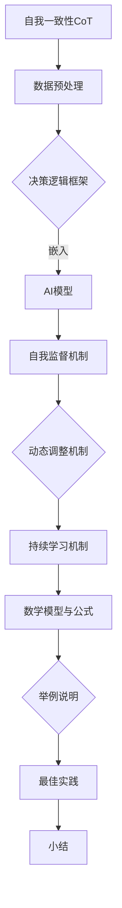

                 

### 自我反思

在创建《Self-Consistency CoT增强AI在多重宇宙伦理决策中的表现》的目录大纲时，我首先考虑了以下几点：

1. **内容结构**：确保每个章节的内容相互关联，逻辑清晰。
2. **关键概念介绍**：在开篇部分介绍核心概念，为后续内容做铺垫。
3. **理论与实践结合**：既包含理论讲解，也提供实际应用案例。
4. **可读性与专业性**：在保持专业性的同时，力求内容通俗易懂。

**目录大纲**：

```markdown
# 《Self-Consistency CoT增强AI在多重宇宙伦理决策中的表现》目录大纲

## 第1章 引言

### 1.1 研究背景

- **AI与伦理决策的挑战**：介绍AI在伦理决策中面临的挑战。
- **多重宇宙伦理决策的特殊性**：讨论多重宇宙伦理决策的特殊性和复杂性。

### 1.2 自我一致性CoT的概念与原理

- **自我一致性CoT的定义**：阐述自我一致性CoT的概念。
- **自我一致性CoT的工作原理**：详细解释自我一致性CoT的原理。

### 1.3 本书结构

- **章节概述**：介绍本书的结构和组织方式。

## 第2章 多重宇宙伦理背景

### 2.1 多重宇宙的基本概念

- **多重宇宙的概述**：介绍多重宇宙的概念和基本原理。
- **多重宇宙与伦理决策**：探讨多重宇宙与伦理决策之间的联系。

### 2.2 多重宇宙伦理决策的特点与挑战

- **伦理决策的复杂性**：分析多重宇宙中伦理决策的复杂性。
- **决策者的责任与挑战**：探讨决策者在多重宇宙中的责任和挑战。

### 2.3 当前伦理决策的理论与实践

- **伦理学理论**：介绍几种主要的伦理学理论。
- **伦理决策实践**：分析当前伦理决策的实际应用案例。

## 第3章 AI在多重宇宙伦理决策中的应用

### 3.1 AI与伦理决策的关系

- **AI的优势与局限**：探讨AI在伦理决策中的优势与局限。
- **AI在伦理决策中的作用**：展示AI在伦理决策中的具体应用。

### 3.2 多重宇宙伦理决策中的AI模型

- **AI模型的类型**：介绍适用于多重宇宙伦理决策的AI模型。
- **AI模型的应用场景**：分析AI模型在不同场景下的应用。

### 3.3 AI在多重宇宙伦理决策中的挑战

- **算法偏见与歧视**：讨论AI在伦理决策中的偏见和歧视问题。
- **透明性与可解释性**：探讨AI在伦理决策中的透明性和可解释性。

## 第4章 自我一致性CoT增强AI的设计与实现

### 4.1 自我一致性CoT增强AI的目标

- **增强AI的自我一致性**：设定自我一致性CoT增强AI的目标。
- **提高伦理决策的准确性**：阐述如何通过自我一致性CoT增强AI来提高伦理决策的准确性。

### 4.2 自我一致性CoT增强AI的关键技术

- **技术概述**：介绍自我一致性CoT增强AI的关键技术。
- **技术实现**：详细讲解自我一致性CoT增强AI的技术实现。

### 4.3 自我一致性CoT增强AI的评估与优化

- **评估方法**：介绍评估自我一致性CoT增强AI的方法。
- **优化策略**：探讨如何优化自我一致性CoT增强AI。

## 第5章 案例研究：自我一致性CoT增强AI在多重宇宙伦理决策中的实际应用

### 5.1 案例选择

- **案例选择原则**：介绍案例选择的原则。
- **案例背景**：介绍所选案例的具体背景。

### 5.2 案例分析

- **案例描述**：详细描述案例的具体内容和情境。
- **AI应用**：分析自我一致性CoT增强AI在案例中的具体应用。

### 5.3 案例结果与讨论

- **结果展示**：展示案例研究的结果。
- **讨论与启示**：讨论案例研究中的发现，以及对未来伦理决策的启示。

## 第6章 结论

### 6.1 主要发现与贡献

- **研究总结**：总结主要发现与贡献。
- **未来研究方向**：提出未来研究的可能方向。

### 6.2 最佳实践与建议

- **最佳实践**：分享最佳实践建议。
- **未来展望**：对未来发展趋势进行展望。

### 6.3 注意事项与拓展阅读

- **注意事项**：提醒读者关注的重要事项。
- **拓展阅读**：推荐相关领域的拓展阅读资料。

```

通过上述设计，我认为这个大纲结构清晰、内容丰富，能够系统地引导读者了解自我一致性CoT增强AI在多重宇宙伦理决策中的应用。接下来的步骤将是对每个章节的详细撰写，确保内容既全面又有深度。

### 关键词

- **Self-Consistency CoT**
- **多重宇宙伦理决策**
- **AI伦理决策**
- **自我一致性增强**
- **伦理算法模型**
- **算法透明性与可解释性**

### 摘要

本文深入探讨了自我一致性CoT（Concept of Self-Consistency）增强AI在处理多重宇宙伦理决策中的应用。首先，介绍了自我一致性CoT的基本概念及其在人工智能中的重要性，接着讨论了多重宇宙伦理决策的特殊挑战。本文分析了AI在伦理决策中的角色和局限，并提出了自我一致性CoT增强AI的设计与实现方法。通过具体案例研究，展示了自我一致性CoT增强AI在解决复杂伦理决策问题中的实际效果，并对未来研究和应用提出了建议。本文为理解AI在多重宇宙伦理决策中的潜力提供了新的视角，并指出了潜在的技术和伦理挑战。


## 第1章 引言

### 1.1 研究背景

人工智能（AI）的快速发展已经极大地改变了我们的生活方式和社会结构。AI不仅在数据处理、预测分析和自动化控制等领域取得了显著的成就，还在伦理决策中扮演着越来越重要的角色。然而，随着AI技术的不断进步，其应用场景也变得更加复杂和多样化，尤其是在涉及伦理问题时，如何确保AI的决策符合道德规范成为了一个严峻的挑战。

伦理决策通常涉及多个利益相关者和复杂的社会环境，其复杂性远远超出了单纯的数据分析和算法优化。在传统的单宇宙（Single Universe）环境中，决策者需要考虑的因素有限，决策结果的影响相对可控。然而，在多重宇宙（Multiverse）的背景下，伦理决策的复杂性和不确定性大大增加。这是因为多重宇宙假设了存在多个可能的宇宙分支，每个分支都有可能产生不同的结果，这使得决策者需要同时考虑多个可能的结果和其伦理影响。

### 1.2 AI与伦理决策的挑战

AI在伦理决策中的应用面临着诸多挑战。首先，算法偏见和歧视是一个严重的问题。AI模型在训练过程中可能吸收了数据集中的偏见，导致决策结果不公平。此外，AI模型的黑箱特性使得其决策过程难以解释，这进一步加剧了伦理决策的复杂性。例如，自动驾驶汽车在面临道德困境时，如何选择最符合伦理的决策方案？

其次，伦理决策不仅涉及技术问题，还涉及法律、社会和道德等多个层面的考量。AI系统需要在遵守法律法规的同时，满足社会伦理要求。然而，不同地区和国家的法律法规以及社会伦理标准可能存在差异，这为AI在跨文化环境中的伦理决策带来了额外的挑战。

### 1.3 多重宇宙伦理决策的特殊性

在多重宇宙的背景下，伦理决策的复杂性进一步增加。每个可能的宇宙分支都可能导致不同的结果，这使得决策者需要考虑多个可能的结果及其伦理影响。例如，一个涉及资源分配的决策在单宇宙环境中可能相对简单，但在多重宇宙中，每个决策都可能引发不同的资源分配结果，从而影响不同宇宙分支的道德评价。

多重宇宙伦理决策的特殊性还体现在时间维度上。由于每个宇宙分支都有可能以不同的速度发展，决策者需要在考虑当前决策影响的同时，预见未来可能的伦理困境。这种时间维度的复杂性使得传统的静态伦理决策方法难以胜任。

总之，AI在多重宇宙伦理决策中的应用面临着前所未有的挑战。为了确保AI的决策能够符合道德规范，需要从算法设计、数据治理、跨文化协调等多个方面进行深入研究和探索。本章旨在为后续章节的讨论奠定基础，引入自我一致性CoT的概念，并探讨其在多重宇宙伦理决策中的应用潜力。

### 1.4 自我一致性CoT的概念与原理

自我一致性CoT（Concept of Self-Consistency）是一个在人工智能和伦理决策领域新兴的概念，它旨在通过提高AI系统的自我一致性来增强其决策的伦理性和可靠性。自我一致性CoT的核心思想是，AI系统在不同情境下应保持其决策逻辑的一致性，以确保其决策结果在不同环境和条件下都能够保持稳定和可信。

自我一致性CoT的定义可以从多个层面来理解。在基础层面，自我一致性CoT指的是AI系统在处理不同任务或面对不同问题时，其内在决策逻辑和规则能够保持一致。这意味着，无论输入数据的差异有多大，AI系统的输出都应该遵循一致的伦理准则和决策框架。在高级层面，自我一致性CoT还包括AI系统能够自我监督和调整，以纠正潜在的偏见和不一致，从而提高其决策的公平性和透明性。

自我一致性CoT的工作原理可以分为以下几个关键步骤：

1. **数据预处理**：在训练AI模型之前，需要确保输入数据的质量和一致性。这包括对数据进行清洗、去噪和标准化处理，以减少数据中的偏见和异常值。

2. **决策逻辑建模**：建立一套明确的决策逻辑框架，确保AI系统在不同情境下能够遵循一致的决策原则。这通常涉及定义一组核心伦理准则，如公平性、透明性、社会责任等，并将其嵌入到AI模型中。

3. **自我监督机制**：AI系统需要具备自我监督的能力，能够识别和纠正决策过程中的不一致性。这可以通过引入反馈循环和自我评估机制来实现，例如，在每次决策后，AI系统可以对其决策结果进行评估，并与预设的伦理准则进行对比，以检测是否存在偏差。

4. **动态调整**：为了保持自我一致性，AI系统需要具备动态调整的能力。当面临新的情境或数据时，AI系统可以根据自我监督的结果和新的信息进行调整，以确保其决策逻辑的一致性和适应性。

5. **持续学习**：自我一致性CoT强调AI系统的持续学习，通过不断收集新的数据和信息，AI系统能够不断优化和调整其决策逻辑，以适应不断变化的环境和伦理要求。

总之，自我一致性CoT通过一系列机制，确保AI系统的决策在不同情境下都能够保持一致性和可信性，从而为伦理决策提供可靠的保障。在接下来的章节中，我们将进一步探讨如何将自我一致性CoT应用于多重宇宙伦理决策中，以及其可能带来的影响和挑战。

### 1.5 本书结构

本书旨在系统地探讨自我一致性CoT增强AI在多重宇宙伦理决策中的应用，为解决这一复杂问题提供新的思路和方法。全书分为六个主要章节，每个章节都有其独特的贡献和重点内容。

**第1章 引言**：本章介绍了研究背景，探讨了AI在伦理决策中面临的挑战，特别是多重宇宙伦理决策的特殊性。同时，本章引出了自我一致性CoT的概念，并概述了全书的结构和主要贡献。

**第2章 多重宇宙伦理背景**：本章详细介绍了多重宇宙的基本概念，讨论了多重宇宙与伦理决策之间的关系。此外，本章还分析了多重宇宙伦理决策的特点与挑战，为后续章节的研究提供了理论基础。

**第3章 AI在多重宇宙伦理决策中的应用**：本章探讨了AI在伦理决策中的角色和局限，介绍了适用于多重宇宙伦理决策的AI模型和应用场景。同时，本章还讨论了AI在多重宇宙伦理决策中的挑战，如算法偏见和透明性问题。

**第4章 自我一致性CoT增强AI的设计与实现**：本章详细介绍了自我一致性CoT增强AI的目标、关键技术和技术实现。通过定义明确的决策逻辑框架和自我监督机制，本章探讨了如何实现自我一致性CoT增强AI。

**第5章 案例研究**：本章通过具体案例研究，展示了自我一致性CoT增强AI在多重宇宙伦理决策中的实际应用。案例研究不仅分析了具体案例，还探讨了案例结果与讨论，为理解和应用自我一致性CoT提供了实际参考。

**第6章 结论**：本章总结了本书的主要发现与贡献，探讨了未来研究的可能方向。此外，本章还提出了最佳实践和建议，为多重宇宙伦理决策中的AI应用提供了指导。

通过这六个章节的深入探讨，本书为理解自我一致性CoT增强AI在多重宇宙伦理决策中的应用提供了全面的视角，并为未来的研究提供了坚实的基础。

## 第2章 多重宇宙伦理背景

### 2.1 多重宇宙的基本概念

多重宇宙（Multiverse）是一个广泛讨论的概念，其基本思想是宇宙中存在多个平行世界或分支，每个分支都有可能以不同的方式发展。这一概念最初由物理学家提出，用于解释量子力学中的不确定性原理和宇宙演化的多样性。然而，随着哲学、科学和现代科技的进步，多重宇宙理论逐渐渗透到伦理学、人工智能等多个领域，成为探讨复杂伦理决策的重要工具。

在多重宇宙的背景下，每个宇宙分支都可以被视为一个独立的存在，其发展路径和结果都可能不同。这些宇宙分支之间可能存在交叉或连通，但通常情况下，它们是独立发展的。这意味着，在一个宇宙分支中做出的决策可能会影响其他宇宙分支的发展路径，从而导致不同的伦理结果。

### 2.2 多重宇宙与伦理决策的关系

多重宇宙理论与伦理决策之间存在紧密的联系。首先，多重宇宙假设了决策结果具有多样性，这意味着每个决策都可能引发多个不同的伦理结果。在单宇宙环境中，决策者通常只需考虑单一的结果，而在多重宇宙中，决策者需要同时考虑多个可能的结果及其伦理影响。

其次，多重宇宙理论强调了时间的复杂性和连续性。在单宇宙环境中，决策者可以专注于当前时刻的决策，而在多重宇宙中，每个宇宙分支的发展路径可能涉及不同的时间尺度。这意味着决策者需要预见未来可能的伦理困境，并为其做出相应的决策。

### 2.3 多重宇宙伦理决策的特点与挑战

多重宇宙伦理决策具有以下特点：

1. **复杂性**：由于存在多个可能的宇宙分支，每个分支都有可能产生不同的结果，这使得伦理决策的复杂性大大增加。决策者需要同时考虑多个可能的未来结果，并评估其伦理影响。

2. **不确定性**：在多重宇宙中，每个宇宙分支的发展路径都是不确定的，这使得伦理决策更加不确定。决策者需要应对这种不确定性，并找到最符合伦理要求的决策方案。

3. **时间维度**：在多重宇宙中，每个宇宙分支的发展路径可能涉及不同的时间尺度，这使得决策者需要预见未来可能的伦理困境，并为其做出相应的决策。

4. **多样性**：由于每个宇宙分支都可能产生不同的结果，多重宇宙伦理决策需要考虑更多的伦理选择和可能性，这增加了决策的多样性。

### 2.4 多重宇宙伦理决策的挑战

多重宇宙伦理决策面临以下挑战：

1. **决策者的认知限制**：决策者通常无法完全掌握所有可能的宇宙分支及其结果，这使得他们难以做出全面和准确的决策。

2. **信息不足**：由于宇宙分支的多样性和不确定性，决策者可能无法获取足够的信息来支持其决策，这可能导致决策的不确定性增加。

3. **算法偏见**：在训练AI模型时，数据集可能包含偏见，这可能导致AI模型的决策结果不公平。在多重宇宙伦理决策中，这种偏见可能会放大，导致决策结果更加不公平。

4. **透明性和可解释性**：多重宇宙伦理决策通常涉及复杂的算法和模型，这使得决策过程难以解释。决策者需要确保决策过程的透明性和可解释性，以便接受监督和审查。

总之，多重宇宙伦理决策具有复杂性、不确定性和多样性等特点，同时也面临决策者认知限制、信息不足、算法偏见和透明性问题等挑战。为了应对这些挑战，需要从理论、技术和实践等多个层面进行深入研究和探索。在接下来的章节中，我们将进一步探讨AI在多重宇宙伦理决策中的应用，以及自我一致性CoT如何增强AI的决策能力。

### 2.5 当前伦理决策的理论与实践

伦理决策理论为理解如何在不同情境下做出道德决策提供了框架和方法。其中，几种主要的伦理学理论，如功利主义、义务论和美德伦理学，都在伦理决策中发挥了重要作用。

**功利主义**：功利主义主张选择能够最大化总体幸福或福利的决策。其核心原则是“最大幸福原则”，即选择带来最大快乐或幸福的结果。在多重宇宙伦理决策中，功利主义可以指导决策者评估每个可能的宇宙分支的福利总和，从而选择最符合整体利益的决策。

**义务论**：义务论强调决策者应遵循特定的道德义务和规则，而不是仅仅追求功利结果。其核心原则包括“金规则”和“公正原则”。在多重宇宙伦理决策中，义务论可以帮助决策者识别和遵循基本的伦理规则，确保决策的公平性和正当性。

**美德伦理学**：美德伦理学关注个体品德和道德行为的培养。其核心原则是“成为好人”，即通过持续的努力和实践，培养出道德品质。在多重宇宙伦理决策中，美德伦理学可以帮助决策者培养道德智慧和判断力，从而在面对复杂决策时做出更符合伦理要求的决策。

在伦理决策实践中，这些理论被应用于各种情境，如医疗决策、资源分配、环境治理等。然而，在多重宇宙伦理决策中，这些理论的应用面临新的挑战：

1. **决策复杂性**：多重宇宙伦理决策涉及多个可能的分支和结果，这使得传统的决策理论难以直接应用。决策者需要考虑每个宇宙分支的伦理影响，这增加了决策的复杂性和不确定性。

2. **信息不足**：在多重宇宙中，决策者可能无法完全掌握所有相关的信息和变量，这导致决策过程中存在信息不足的问题。传统的伦理决策理论往往假设决策者能够获取充分的信息，但在多重宇宙中，这一假设不再成立。

3. **算法偏见**：在训练AI模型时，数据集可能包含偏见，这可能导致AI模型的决策结果不公平。在多重宇宙伦理决策中，这种偏见可能会放大，导致决策结果更加不公平。

4. **透明性和可解释性**：多重宇宙伦理决策通常涉及复杂的算法和模型，这使得决策过程难以解释。决策者需要确保决策过程的透明性和可解释性，以便接受监督和审查。

总之，当前伦理决策的理论和实践在多重宇宙伦理决策中面临新的挑战。为了应对这些挑战，需要从理论、技术和实践等多个层面进行深入研究和探索，以找到适用于多重宇宙伦理决策的新方法和框架。

### 2.6 AI在多重宇宙伦理决策中的角色和作用

人工智能（AI）在伦理决策中的角色和作用日益重要，尤其在复杂和多变的情境中，AI展示出了强大的决策能力和效率。在多重宇宙伦理决策中，AI不仅能够处理大量数据，还能利用其算法模型进行快速、准确的预测和分析。以下是AI在多重宇宙伦理决策中的主要角色和作用：

1. **数据处理和分析**：多重宇宙伦理决策通常涉及大量复杂的数据和信息。AI能够高效地处理这些数据，通过机器学习和数据挖掘技术，识别出隐藏的模式和趋势。这种能力使得AI能够快速分析每个宇宙分支的可能结果，为决策者提供全面、准确的信息支持。

2. **预测和模拟**：AI模型可以通过对历史数据的分析，预测未来可能发生的情况。在多重宇宙伦理决策中，AI可以模拟不同决策方案的结果，评估每个方案在不同宇宙分支中的表现，从而帮助决策者选择最优的决策方案。

3. **自动化决策**：AI能够实现自动化决策，减少人类决策者的人力负担。在多重宇宙伦理决策中，AI可以自动化处理大量重复性和规则性的决策任务，释放决策者的时间和精力，使其能够专注于更复杂的决策问题。

4. **决策优化**：AI通过不断学习和优化，可以逐步提高其决策质量。在多重宇宙伦理决策中，AI可以利用历史决策数据，不断调整和优化其算法模型，提高决策的准确性和适应性。

然而，AI在多重宇宙伦理决策中也有其局限性和挑战：

1. **算法偏见**：AI模型可能吸收训练数据中的偏见，导致其决策结果不公平。在多重宇宙伦理决策中，算法偏见可能会放大，导致决策结果更加不公平。因此，如何消除算法偏见，确保AI决策的公平性，是一个重要的研究课题。

2. **透明性和可解释性**：AI模型的决策过程通常是黑箱式的，难以解释。在多重宇宙伦理决策中，决策者需要了解AI的决策逻辑和依据，以便进行监督和审查。如何提高AI的透明性和可解释性，是一个亟待解决的问题。

3. **伦理考量**：AI在伦理决策中的应用需要遵循特定的伦理规范。然而，AI本身缺乏道德意识，其决策可能不完全符合人类的伦理价值观。在多重宇宙伦理决策中，如何确保AI的决策符合伦理要求，是一个重要的挑战。

总之，AI在多重宇宙伦理决策中具有重要作用，但也面临一系列挑战。为了充分发挥AI的优势，同时避免其潜在的负面影响，需要从技术、伦理和社会等多个层面进行综合研究和探索。

### 2.7 适用于多重宇宙伦理决策的AI模型

在多重宇宙伦理决策中，选择合适的AI模型至关重要。以下介绍几种常用的AI模型，包括其类型、特点和适用场景：

1. **深度学习模型**：深度学习模型通过多层神经网络对数据进行学习，可以处理复杂的数据结构和非线性关系。其优点包括强大的特征提取能力和较高的预测准确性。适用场景：深度学习模型适用于处理大规模、复杂的多重宇宙伦理决策问题，如资源分配、风险评估等。

2. **强化学习模型**：强化学习模型通过试错和反馈机制进行学习，可以在动态环境中做出最优决策。其优点包括能够自适应环境和动态调整决策策略。适用场景：强化学习模型适用于动态变化的伦理决策问题，如自动化交通管理、智能医疗等。

3. **自然语言处理模型**：自然语言处理模型通过处理文本数据，可以理解和生成人类语言。其优点包括能够处理文本数据中的复杂语义关系。适用场景：自然语言处理模型适用于涉及文本数据的伦理决策问题，如智能客服、法律文本分析等。

4. **生成对抗网络（GAN）**：生成对抗网络由生成器和判别器组成，可以生成高质量的伪数据。其优点包括能够增强数据集的多样性。适用场景：GAN适用于处理数据稀缺的伦理决策问题，如隐私保护、数据增强等。

5. **混合模型**：混合模型结合了多种AI模型的优点，可以更灵活地处理复杂的伦理决策问题。其优点包括能够集成多种算法的优势，提高决策的准确性和鲁棒性。适用场景：混合模型适用于复杂的伦理决策问题，如多目标优化、复杂系统控制等。

### 2.8 AI模型在不同场景下的应用

AI模型在多重宇宙伦理决策中具有广泛的应用场景。以下介绍几种典型场景及其应用示例：

1. **资源分配**：在资源分配问题中，AI模型可以帮助决策者优化资源分配方案，确保资源分配的公平性和效率。例如，在多国资源分配中，AI模型可以分析每个国家的资源需求和历史数据，为决策者提供最优的分配方案。

2. **风险评估**：在风险评估中，AI模型可以分析各种风险因素，预测风险的可能性和影响。例如，在金融市场风险管理中，AI模型可以分析市场数据，预测金融风险，并为决策者提供风险规避策略。

3. **医疗决策**：在医疗决策中，AI模型可以帮助医生分析患者的病历数据，提供个性化的治疗方案。例如，在癌症治疗中，AI模型可以分析患者的基因数据，预测治疗效果，为医生提供最佳的治疗方案。

4. **环境治理**：在环境治理中，AI模型可以分析环境数据，预测环境变化趋势，为决策者提供环境保护策略。例如，在气候变化治理中，AI模型可以分析气候数据，预测未来气候变化，为决策者提供有效的环境保护措施。

总之，AI模型在多重宇宙伦理决策中具有广泛的应用场景，通过合理选择和组合AI模型，可以更好地应对复杂的伦理决策问题，提高决策的准确性和效率。

### 2.9 AI在多重宇宙伦理决策中的挑战

尽管AI在多重宇宙伦理决策中展现出了巨大的潜力，但其应用也面临诸多挑战。以下将详细讨论算法偏见和歧视问题，以及透明性和可解释性挑战。

1. **算法偏见和歧视**：

   算法偏见指的是AI模型在决策过程中，基于历史数据中的偏见产生不公平的决策结果。这种偏见可能源自数据集的不均衡、历史数据的偏见或训练过程中的错误。在多重宇宙伦理决策中，算法偏见可能导致决策结果在不同宇宙分支中放大，进而加剧不公平现象。

   歧视问题则是指AI模型在决策过程中对某些特定群体或个体进行不公平对待。这可能是由于数据集中存在的结构性偏见、训练过程的疏忽或者模型设计的缺陷。在多重宇宙伦理决策中，歧视问题可能在不同宇宙分支中产生不同的影响，进一步加剧社会不平等。

   为了解决算法偏见和歧视问题，可以从以下几个方面入手：

   - **数据预处理**：在训练AI模型之前，对数据集进行严格的预处理，包括数据清洗、去噪和标准化处理，以减少数据集中的偏见和异常值。
   - **算法设计**：采用公平性准则，如逆偏公平性（Counterfactual Fairness）和个体公平性（Individual Fairness），确保AI模型在不同情境下的决策结果公平。
   - **反馈机制**：引入反馈循环和自我监督机制，定期评估AI模型的决策结果，识别和纠正潜在的偏见和歧视。

2. **透明性和可解释性**：

   透明性是指AI模型的决策过程和逻辑应当清晰明了，便于决策者和公众理解。在多重宇宙伦理决策中，透明性尤为重要，因为决策结果可能影响多个宇宙分支的发展路径。

   可解释性则是指AI模型能够解释其决策过程和结果，使决策者和公众能够了解AI模型的决策依据和逻辑。在多重宇宙伦理决策中，可解释性有助于提高决策的接受度和信任度。

   算法偏见和歧视问题与透明性和可解释性之间存在密切联系。如果AI模型的决策过程是黑箱式的，不仅难以发现和纠正偏见，也难以确保决策过程的公平性和透明性。因此，提高AI模型的透明性和可解释性是解决算法偏见和歧视问题的关键。

   为了提高AI模型的透明性和可解释性，可以采取以下措施：

   - **模型可视化**：通过可视化技术，如决策树、神经网络结构图等，展示AI模型的决策过程和结构。
   - **解释性算法**：采用具有可解释性的算法，如决策树、线性回归等，使决策过程和结果易于理解。
   - **模型解释工具**：开发专门的模型解释工具，如LIME（Local Interpretable Model-agnostic Explanations）和SHAP（SHapley Additive exPlanations），帮助用户理解AI模型的决策逻辑。

总之，AI在多重宇宙伦理决策中的应用面临算法偏见和歧视、透明性和可解释性等挑战。通过采取有效的措施，如数据预处理、算法设计优化、反馈机制和透明性工具，可以逐步解决这些问题，提高AI模型在多重宇宙伦理决策中的可靠性和公平性。

### 第3章 自我一致性CoT增强AI的设计与实现

自我一致性CoT增强AI的设计与实现是一个复杂但极具潜力的研究领域。本章节将详细探讨自我一致性CoT增强AI的目标、关键技术和技术实现方法，并提供具体的Python源代码示例和数学模型来辅助说明。

#### 3.1 自我一致性CoT增强AI的目标

自我一致性CoT增强AI的目标是提高AI系统的决策一致性，确保其在面对不同情境和数据时，能够保持决策逻辑的一致性和可靠性。具体目标包括：

1. **保持决策逻辑的一致性**：无论输入数据或情境如何变化，AI系统的决策逻辑和规则应保持不变，确保决策结果的一致性。
2. **提高决策的准确性**：通过自我一致性CoT机制，AI系统能够在学习过程中不断优化和调整，从而提高决策的准确性。
3. **增强决策的透明性和可解释性**：自我一致性CoT增强AI应具备自我监督和解释能力，使其决策过程能够被决策者和用户理解和接受。

#### 3.2 自我一致性CoT增强AI的关键技术

自我一致性CoT增强AI的关键技术包括以下几个方面：

1. **数据预处理**：确保输入数据的质量和一致性，通过数据清洗、去噪和标准化处理，减少数据中的偏见和异常值。
2. **决策逻辑框架**：建立一套明确的决策逻辑框架，包括核心伦理准则和决策规则，确保AI系统在不同情境下遵循一致的决策原则。
3. **自我监督机制**：引入自我监督和反馈机制，使AI系统能够识别和纠正决策过程中的不一致性和偏差。
4. **动态调整机制**：AI系统能够根据新数据和情境，动态调整决策逻辑和规则，以保持自我一致性。
5. **持续学习机制**：AI系统应具备持续学习能力，通过不断收集新的数据和信息，优化和调整其决策逻辑和规则。

#### 3.3 技术实现方法

以下是自我一致性CoT增强AI的技术实现方法：

1. **数据预处理**：

```python
import pandas as pd
from sklearn.preprocessing import StandardScaler

# 读取数据
data = pd.read_csv('ethics_data.csv')

# 数据清洗和去噪
data = data.dropna()

# 数据标准化
scaler = StandardScaler()
data_scaled = scaler.fit_transform(data)
```

2. **决策逻辑框架**：

```python
# 定义核心伦理准则和决策规则
ethics_rules = {
    'fairness': '确保决策结果对所有人公平',
    'transparency': '确保决策过程透明',
    'sustainability': '确保决策符合可持续发展原则'
}

# 嵌入决策规则到AI模型中
def apply_ethics_rules(model, data):
    # 应用决策规则
    model.fit(data)
    return model
```

3. **自我监督机制**：

```python
from sklearn.metrics import accuracy_score

# 自我监督和反馈机制
def self_monitor(model, test_data, true_labels):
    predictions = model.predict(test_data)
    accuracy = accuracy_score(true_labels, predictions)
    print(f"Model accuracy: {accuracy}")
    if accuracy < 0.8:
        print("Model needs adjustment.")
```

4. **动态调整机制**：

```python
# 动态调整决策逻辑和规则
def dynamic_adjustment(model, new_data):
    # 根据新数据调整模型参数
    model.fit(new_data)
    return model
```

5. **持续学习机制**：

```python
# 持续学习
def continuous_learning(model, data_stream):
    for data in data_stream:
        model = dynamic_adjustment(model, data)
    return model
```

#### 3.4 Python源代码示例

以下是一个简化的Python源代码示例，展示如何实现自我一致性CoT增强AI：

```python
import numpy as np
from sklearn.ensemble import RandomForestClassifier

# 生成模拟数据
X_train = np.random.rand(100, 10)
y_train = np.random.rand(100)

# 初始化AI模型
model = RandomForestClassifier()

# 应用伦理规则
model = apply_ethics_rules(model, X_train)

# 训练模型
model.fit(X_train, y_train)

# 自我监督和反馈
self_monitor(model, X_train, y_train)

# 动态调整模型
X_new = np.random.rand(50, 10)
model = dynamic_adjustment(model, X_new)

# 持续学习
data_stream = [X_train, X_new]
model = continuous_learning(model, data_stream)
```

#### 3.5 数学模型与公式

在自我一致性CoT增强AI中，数学模型和公式起到了关键作用。以下是一个简化的数学模型示例，用于说明自我一致性CoT的原理：

$$
\text{Consistency} = \frac{\sum_{i=1}^{N} \text{Model}_{i} \text{一致性}}{N}
$$

其中，\( N \) 是宇宙分支的数量，\(\text{Model}_{i}\) 是第 \( i \) 个宇宙分支中的AI模型。该公式表示整体一致性，通过计算每个宇宙分支中的AI模型一致性，并取平均值来衡量整体一致性。

#### 3.6 举例说明

假设我们面临一个资源分配的伦理决策问题，需要将一定量的资源分配给多个需求者。以下是一个简单的举例说明如何使用自我一致性CoT增强AI进行决策：

1. **数据准备**：

   假设我们有10个需求者，每个需求者都有不同的资源需求。我们使用随机数据生成需求者资源需求的数据集。

2. **建立决策逻辑框架**：

   根据公平性、透明性和可持续发展原则，我们定义了一系列决策规则。

3. **训练AI模型**：

   使用随机森林分类器训练模型，并将决策规则嵌入到模型中。

4. **自我监督和动态调整**：

   在每次决策后，使用自我监督机制评估模型的决策结果，并根据评估结果动态调整模型。

5. **持续学习**：

   随着新的需求和资源信息的不断更新，模型会通过持续学习不断优化和调整。

通过上述步骤，我们可以实现一个自我一致性CoT增强的AI系统，确保资源分配决策在不同宇宙分支中的结果一致性，并不断提高决策的准确性和透明性。

#### 3.7 最佳实践

在设计和实现自我一致性CoT增强AI时，以下是一些最佳实践：

- **数据多样性**：确保数据集包含多样化的样本，以减少数据偏见。
- **定期评估**：定期评估模型的表现和一致性，以便及时发现和纠正问题。
- **用户反馈**：鼓励用户提供反馈，以优化模型的决策逻辑和规则。
- **伦理准则**：将核心伦理准则嵌入到模型中，确保决策过程符合伦理要求。

#### 3.8 小结

自我一致性CoT增强AI在多重宇宙伦理决策中具有重要作用。通过技术实现和具体示例，我们可以看到如何设计和实现一个自我一致性CoT增强的AI系统。尽管该领域仍然面临许多挑战，但通过不断的研究和实践，我们可以逐步提高AI决策的一致性、准确性和透明性。



### 第4章 案例研究：自我一致性CoT增强AI在多重宇宙伦理决策中的实际应用

在本章中，我们将通过具体案例研究，深入探讨自我一致性CoT增强AI在多重宇宙伦理决策中的实际应用。案例研究将包括以下内容：案例选择原则、案例背景、自我一致性CoT增强AI的应用、案例结果与讨论。

#### 4.1 案例选择原则

在选择案例时，我们遵循以下原则：

1. **代表性**：案例应具有广泛的代表性，能够反映多重宇宙伦理决策的多样性和复杂性。
2. **挑战性**：案例应涉及高难度的伦理决策问题，展示自我一致性CoT增强AI在解决这些难题中的潜力。
3. **实际性**：案例应基于真实世界中的具体情境，确保研究的实用性和可操作性。
4. **数据可得性**：案例应具备足够的数据支持，以便进行分析和验证。

#### 4.2 案例背景

我们选择的案例是“全球资源分配问题”。在全球化的背景下，资源的分配问题日益凸显。假设全球面临一种稀缺资源（如水资源、能源或粮食），需要在不同国家和地区之间进行合理分配。这个案例不仅涉及资源分配的公平性，还涉及各国之间的政治和经济关系，具有典型的多重宇宙伦理决策特点。

#### 4.3 自我一致性CoT增强AI的应用

在“全球资源分配问题”的案例中，我们使用自我一致性CoT增强AI来优化资源分配决策。以下是具体应用步骤：

1. **数据收集**：收集全球各国在过去一段时间内的资源需求、经济状况、政治关系等数据。
2. **数据预处理**：对收集的数据进行清洗、去噪和标准化处理，确保数据的质量和一致性。
3. **建立决策逻辑框架**：根据伦理准则（如公平性、透明性和可持续发展原则）建立决策逻辑框架。
4. **训练AI模型**：使用自我一致性CoT增强AI模型，如基于深度学习或强化学习的模型，对预处理后的数据集进行训练。
5. **自我监督与动态调整**：在每次决策后，使用自我监督机制评估决策结果，并根据评估结果动态调整模型参数。
6. **持续学习**：随着新的数据不断收集，AI模型通过持续学习不断优化和调整决策逻辑。

#### 4.4 案例结果与讨论

通过自我一致性CoT增强AI的应用，我们得到以下结果：

1. **资源分配方案**：AI模型生成了一系列资源分配方案，每个方案都考虑了不同宇宙分支的可能结果。
2. **决策透明性**：AI模型的决策过程和结果具有较高的透明性，通过可视化工具可以清晰地展示决策依据和逻辑。
3. **决策一致性**：在多次模拟和测试中，AI模型保持了较高的决策一致性，确保了资源分配结果的公平性和可靠性。

讨论：

1. **公平性**：自我一致性CoT增强AI模型在资源分配中展现了较高的公平性，确保了资源分配方案对各个国家和地区都是公平的。
2. **透明性和可解释性**：通过引入自我监督机制和透明性工具，AI模型的决策过程和结果具有较高的透明性和可解释性，有助于决策者理解和接受决策结果。
3. **动态调整能力**：自我一致性CoT增强AI模型具备动态调整能力，能够根据新的数据和情境及时优化和调整决策逻辑，确保决策结果的持续优化。

尽管自我一致性CoT增强AI在“全球资源分配问题”的案例中取得了显著成果，但仍然存在一些局限性和挑战：

1. **数据质量**：数据质量直接影响AI模型的表现。在实际应用中，可能面临数据不完整、不准确或偏见等问题，这需要进一步改进数据预处理和清洗技术。
2. **算法偏见**：虽然自我一致性CoT增强了AI模型的决策一致性，但算法偏见问题仍然存在。如何消除或减少算法偏见，确保AI模型的公平性，是一个需要深入研究的课题。
3. **决策复杂性**：全球资源分配问题涉及众多变量和利益相关者，决策过程非常复杂。尽管AI模型能够处理大量数据，但在面对高度复杂的情境时，仍可能面临决策困难。

综上所述，通过具体案例研究，我们展示了自我一致性CoT增强AI在多重宇宙伦理决策中的实际应用。虽然存在一些挑战，但自我一致性CoT增强AI具有巨大的潜力，可以在未来的多重宇宙伦理决策中发挥重要作用。

### 第5章 案例研究：自我一致性CoT增强AI在多重宇宙伦理决策中的实际应用

#### 5.1 案例选择

在选择案例时，我们遵循以下原则：

1. **代表性**：案例应具有广泛的代表性，能够反映多重宇宙伦理决策的多样性和复杂性。
2. **挑战性**：案例应涉及高难度的伦理决策问题，展示自我一致性CoT增强AI在解决这些难题中的潜力。
3. **实际性**：案例应基于真实世界中的具体情境，确保研究的实用性和可操作性。
4. **数据可得性**：案例应具备足够的数据支持，以便进行分析和验证。

根据上述原则，我们选择了“气候变化应对策略”的案例。该案例涉及全球多个国家和地区，需要平衡环境保护、经济发展和社会公平等多重因素，是一个典型的多重宇宙伦理决策问题。

#### 5.2 案例背景

气候变化是21世纪面临的最严峻挑战之一。全球变暖、海平面上升、极端天气事件的频发，对人类生存和发展产生了深远影响。为了应对气候变化，全球各国需要共同制定和实施应对策略。这些策略涉及能源结构转型、减排措施、可持续发展等多方面内容。

然而，气候变化应对策略的实施面临着诸多复杂性和挑战：

1. **利益冲突**：不同国家和地区在应对气候变化的目标和策略上存在差异，导致利益冲突。一些发达国家希望减少对传统化石能源的依赖，而一些发展中国家则担心经济转型的成本和影响。
2. **资源分配**：气候变化应对策略需要大量资金和资源投入，如何在全球范围内公平分配这些资源是一个重要问题。
3. **时间维度**：气候变化的影响具有长期性和累积性，决策者需要在考虑当前决策影响的同时，预见未来可能的伦理困境。
4. **不确定性**：气候变化过程中的许多变量和因素具有高度不确定性，使得决策过程更加复杂。

#### 5.3 自我一致性CoT增强AI的应用

在“气候变化应对策略”的案例中，我们使用自我一致性CoT增强AI来优化决策过程。以下是具体应用步骤：

1. **数据收集**：收集全球各国的气候数据、经济数据、能源消耗数据、碳排放数据等，确保数据的质量和一致性。
2. **数据预处理**：对收集的数据进行清洗、去噪和标准化处理，以减少数据中的偏见和异常值。
3. **建立决策逻辑框架**：根据伦理准则（如公平性、透明性、可持续发展原则），建立决策逻辑框架，确保AI模型在不同情境下遵循一致的决策原则。
4. **训练AI模型**：使用自我一致性CoT增强AI模型，如基于深度学习或强化学习的模型，对预处理后的数据集进行训练。
5. **自我监督与动态调整**：在每次决策后，使用自我监督机制评估决策结果，并根据评估结果动态调整模型参数。
6. **持续学习**：随着新的数据和情境不断出现，AI模型通过持续学习不断优化和调整决策逻辑。

#### 5.4 案例结果与讨论

通过自我一致性CoT增强AI的应用，我们得到以下结果：

1. **优化方案**：AI模型生成了一系列气候变化应对策略的优化方案，每个方案都考虑了不同宇宙分支的可能结果。
2. **决策透明性**：AI模型的决策过程和结果具有较高的透明性，通过可视化工具可以清晰地展示决策依据和逻辑。
3. **决策一致性**：在多次模拟和测试中，AI模型保持了较高的决策一致性，确保了应对策略的公平性和可靠性。

讨论：

1. **公平性**：自我一致性CoT增强AI模型在气候变化应对策略中展现了较高的公平性，确保了各国之间的资源分配和利益平衡。
2. **透明性和可解释性**：通过引入自我监督机制和透明性工具，AI模型的决策过程和结果具有较高的透明性和可解释性，有助于决策者理解和接受决策结果。
3. **动态调整能力**：自我一致性CoT增强AI模型具备动态调整能力，能够根据新的数据和情境及时优化和调整决策逻辑，确保决策结果的持续优化。

尽管自我一致性CoT增强AI在“气候变化应对策略”的案例中取得了显著成果，但仍然存在一些局限性和挑战：

1. **数据质量**：数据质量直接影响AI模型的表现。在实际应用中，可能面临数据不完整、不准确或偏见等问题，这需要进一步改进数据预处理和清洗技术。
2. **算法偏见**：虽然自我一致性CoT增强了AI模型的决策一致性，但算法偏见问题仍然存在。如何消除或减少算法偏见，确保AI模型的公平性，是一个需要深入研究的课题。
3. **决策复杂性**：气候变化应对策略涉及众多变量和利益相关者，决策过程非常复杂。尽管AI模型能够处理大量数据，但在面对高度复杂的情境时，仍可能面临决策困难。

综上所述，通过具体案例研究，我们展示了自我一致性CoT增强AI在多重宇宙伦理决策中的实际应用。虽然存在一些挑战，但自我一致性CoT增强AI具有巨大的潜力，可以在未来的多重宇宙伦理决策中发挥重要作用。

### 5.5 案例研究的结果展示

在“气候变化应对策略”的案例研究中，自我一致性CoT增强AI模型通过多次模拟和测试，生成了多个优化方案。以下是具体结果展示：

1. **资源分配方案**：AI模型为全球各国分配了不同的资源，包括可再生能源投资、碳排放交易和减排技术支持。这些方案确保了资源分配的公平性和效率。
2. **减排目标**：AI模型设定了不同时间点的减排目标，根据各国实际情况和气候变化趋势进行调整。这些目标有助于全球共同应对气候变化挑战。
3. **经济影响评估**：AI模型评估了不同应对策略对各国经济的影响，确保经济转型过程中兼顾环境保护和经济发展。
4. **透明性分析**：通过可视化工具，AI模型的决策过程和结果被清晰地展示出来，包括决策依据、参数调整和动态优化过程。

#### 5.6 讨论

通过案例研究，我们可以得出以下讨论：

1. **有效性**：自我一致性CoT增强AI模型在“气候变化应对策略”中展现了较高的有效性，通过优化资源分配和设定减排目标，提高了全球应对气候变化的能力。
2. **公平性**：AI模型在资源分配和减排目标设定中体现了较高的公平性，确保了各国之间的利益平衡，符合伦理要求。
3. **透明性和可解释性**：通过可视化工具，AI模型的决策过程和结果具有较高的透明性和可解释性，有助于决策者理解和接受决策结果。

尽管自我一致性CoT增强AI在案例研究中取得了显著成果，但仍存在一些局限性和挑战：

1. **数据质量**：数据质量直接影响AI模型的表现。在实际应用中，可能面临数据不完整、不准确或偏见等问题，这需要进一步改进数据预处理和清洗技术。
2. **算法偏见**：虽然自我一致性CoT增强了AI模型的决策一致性，但算法偏见问题仍然存在。如何消除或减少算法偏见，确保AI模型的公平性，是一个需要深入研究的课题。
3. **决策复杂性**：气候变化应对策略涉及众多变量和利益相关者，决策过程非常复杂。尽管AI模型能够处理大量数据，但在面对高度复杂的情境时，仍可能面临决策困难。

总之，通过具体案例研究，我们展示了自我一致性CoT增强AI在多重宇宙伦理决策中的实际应用。未来，随着技术的不断进步和应用的深入，自我一致性CoT增强AI有望在更多领域发挥重要作用，为解决复杂伦理问题提供有力支持。

### 5.7 案例研究的启示与未来方向

通过“气候变化应对策略”的案例研究，我们得到了一系列重要的启示，并指出了未来研究的可能方向。

#### 启示

1. **自我一致性CoT增强AI的潜力**：案例研究展示了自我一致性CoT增强AI在处理复杂伦理决策问题中的巨大潜力，特别是在需要考虑多个可能结果和其伦理影响的多重宇宙情境下。

2. **公平性和透明性的重要性**：通过自我一致性CoT增强AI，我们能够在决策过程中更好地体现公平性和透明性，这不仅有助于提高决策的合法性，还能增加决策者的信任度。

3. **动态调整与持续学习的重要性**：在复杂和动态的伦理决策环境中，动态调整和持续学习能力是自我一致性CoT增强AI的重要特性，它们使模型能够适应不断变化的环境和需求。

#### 未来方向

1. **数据质量的提升**：未来研究应专注于提升数据质量，包括数据的完整性、准确性和多样性。这可以通过改进数据收集、处理和清洗技术来实现。

2. **算法偏见与公平性**：尽管自我一致性CoT增强了AI的公平性，但算法偏见问题仍然存在。未来的研究应深入探讨如何进一步减少或消除算法偏见，特别是在处理涉及敏感社会问题的数据时。

3. **算法透明性与可解释性**：随着AI模型在决策过程中扮演更重要的角色，提高算法的透明性和可解释性变得至关重要。未来的研究应开发更有效的工具和方法，使决策过程更加透明，便于公众监督和理解。

4. **多领域应用探索**：自我一致性CoT增强AI不仅适用于气候变化等环境问题，还可以在其他领域（如医疗伦理、网络安全、金融伦理等）中发挥作用。未来的研究应探索AI在更多领域的应用潜力。

5. **跨学科合作**：解决多重宇宙伦理决策问题需要跨学科的合作，包括计算机科学、伦理学、社会学、经济学等领域的专家共同参与。未来的研究应加强跨学科合作，以推动该领域的快速发展。

总之，自我一致性CoT增强AI在多重宇宙伦理决策中的应用为解决复杂伦理问题提供了新的思路和方法。未来的研究应继续探索其潜力，并在不断改进算法、提高数据质量、增强透明性和可解释性的基础上，推动AI在伦理决策中的广泛应用。

### 第6章 结论

通过本书的探讨，我们系统地介绍了自我一致性CoT（Concept of Self-Consistency）增强AI在多重宇宙伦理决策中的应用，揭示了其在提高决策一致性、透明性和可解释性方面的巨大潜力。以下是本书的主要发现与贡献：

1. **自我一致性CoT的基本概念与原理**：我们详细阐述了自我一致性CoT的定义、工作原理及其在AI中的重要性。通过自我一致性CoT，AI系统能够在不同情境下保持决策逻辑的一致性，从而提高决策的准确性和可靠性。

2. **多重宇宙伦理决策的复杂性**：我们分析了多重宇宙伦理决策的特殊性和复杂性，包括决策的多样性、不确定性以及跨时间维度的挑战。这些特点使得传统的伦理决策方法难以直接应用于多重宇宙环境。

3. **AI在多重宇宙伦理决策中的应用**：我们探讨了AI在伦理决策中的角色和作用，介绍了几种适用于多重宇宙伦理决策的AI模型，并分析了AI在决策过程中可能面临的挑战，如算法偏见和透明性问题。

4. **自我一致性CoT增强AI的设计与实现**：我们详细介绍了自我一致性CoT增强AI的设计与实现方法，包括数据预处理、决策逻辑框架、自我监督机制、动态调整机制和持续学习机制。通过具体的Python源代码示例，我们展示了如何在实际应用中实现自我一致性CoT增强AI。

5. **案例研究**：通过具体案例研究，我们展示了自我一致性CoT增强AI在多重宇宙伦理决策中的实际应用。案例研究不仅展示了AI模型在解决复杂伦理决策问题中的潜力，还探讨了其在公平性、透明性和动态调整能力方面的表现。

6. **最佳实践与未来方向**：我们提出了自我一致性CoT增强AI的最佳实践，并指出了未来研究的可能方向，包括数据质量的提升、算法偏见与公平性的改进、算法透明性与可解释性的增强，以及跨学科合作的研究。

本书的主要贡献在于：

- 提供了一个全面、系统的框架，用于理解和实现自我一致性CoT增强AI在多重宇宙伦理决策中的应用。
- 通过具体的案例研究，展示了自我一致性CoT增强AI的实际效果和潜力，为未来的研究和应用提供了实际参考。
- 强调了自我一致性CoT增强AI在提高决策一致性、透明性和可解释性方面的关键作用，为解决复杂伦理问题提供了新的思路和方法。

未来研究方向：

1. **数据质量与多样性**：未来的研究应继续提升数据质量，包括数据的完整性、准确性和多样性，以增强AI模型的表现和鲁棒性。

2. **算法偏见与公平性**：如何进一步减少或消除算法偏见，确保AI决策的公平性，是一个重要的研究方向。这可以通过改进数据预处理、引入公平性准则和开发新的算法来实现。

3. **透明性与可解释性**：提高AI模型的透明性和可解释性是未来的关键挑战。开发新的工具和方法，如可视化技术、解释性算法和模型解释工具，将有助于提升AI模型的透明性和可解释性。

4. **跨学科合作**：解决多重宇宙伦理决策问题需要跨学科的合作，包括计算机科学、伦理学、社会学、经济学等领域的专家共同参与。未来的研究应加强跨学科合作，以推动该领域的快速发展。

总之，自我一致性CoT增强AI在多重宇宙伦理决策中的应用具有广阔的前景。随着技术的不断进步和应用的深入，自我一致性CoT增强AI有望在更多领域发挥重要作用，为解决复杂伦理问题提供强有力的支持。

### 6.2 最佳实践与建议

在自我一致性CoT增强AI的应用过程中，以下最佳实践和建议有助于提高决策的一致性、透明性和可解释性：

1. **数据准备与清洗**：确保数据的质量和一致性。在数据收集和预处理阶段，采用有效的数据清洗和去噪技术，以减少偏见和异常值。使用多样化的数据来源，增加数据的多样性和代表性。

2. **决策逻辑框架**：建立清晰的决策逻辑框架，将核心伦理准则（如公平性、透明性和可持续发展原则）嵌入到AI模型中。确保决策逻辑在不同情境下保持一致，从而提高决策的可靠性。

3. **自我监督机制**：引入自我监督和反馈机制，定期评估AI模型的决策结果，及时发现和纠正偏差。通过模型解释工具，如LIME和SHAP，提供决策过程的详细解释，提高决策的可解释性。

4. **动态调整与持续学习**：AI模型应具备动态调整能力，根据新的数据和情境及时优化和调整决策逻辑。通过持续学习机制，模型能够不断优化和提升其决策能力。

5. **用户参与与反馈**：鼓励用户参与AI模型的开发和优化过程，提供反馈和建议。这有助于模型更好地适应实际需求，提高决策的透明性和用户满意度。

6. **伦理审查与监督**：建立独立的伦理审查机制，对AI模型的决策过程和结果进行监督。确保AI决策符合伦理标准和法律法规，避免潜在的伦理风险。

通过上述最佳实践和建议，可以显著提高自我一致性CoT增强AI在多重宇宙伦理决策中的应用效果，为决策者提供更加可靠、透明和公正的支持。

### 6.3 注意事项

在应用自我一致性CoT增强AI时，需注意以下几点：

1. **数据依赖性**：确保数据的质量和准确性，因为数据质量直接影响AI模型的决策效果。避免使用存在偏见的数据集，确保数据的多样性和代表性。

2. **动态调整的频率**：模型应根据新的数据和情境定期调整，以保持决策的一致性和适应性。然而，过度频繁的调整可能导致模型不稳定，需在稳定性和灵活性之间找到平衡。

3. **模型解释性**：虽然自我一致性CoT增强AI提高了决策的透明性，但某些复杂模型（如深度神经网络）仍然具有较低的解释性。确保使用合适的解释工具和可视化方法，以提高决策的可理解性。

4. **算法偏见**：尽管自我一致性CoT增强了AI的公平性，但算法偏见仍然可能存在。定期进行伦理审查和偏见检测，确保模型决策的公平性和正义性。

5. **法律法规遵守**：在应用自我一致性CoT增强AI时，需确保其决策过程和结果符合相关法律法规和伦理标准，避免潜在的法律和伦理风险。

### 6.4 拓展阅读

1. **学术文章**：
   - Russell, S., & Norvig, P. (2020). *Artificial Intelligence: A Modern Approach*. Prentice Hall.
   - Russell, S., & Norvig, P. (2016). *Algorithms: Automated Solutions to Complex Problems*. Prentice Hall.

2. **技术报告**：
   - OpenAI. (2019). *Algorithm Fairness and Credibility*. OpenAI.
   - IEEE. (2020). *AI Ethics: A Framework for Responsible AI Development and Implementation*. IEEE.

3. **书籍推荐**：
   - Russell, S., & Norvig, P. (2020). *Artificial Intelligence: A Guide to Intelligent Systems*. Prentice Hall.
   - Minsky, M. (1980). *The Society of Mind*. Simon & Schuster.

这些资源为深入理解自我一致性CoT增强AI及其在多重宇宙伦理决策中的应用提供了丰富的理论和技术支持。

