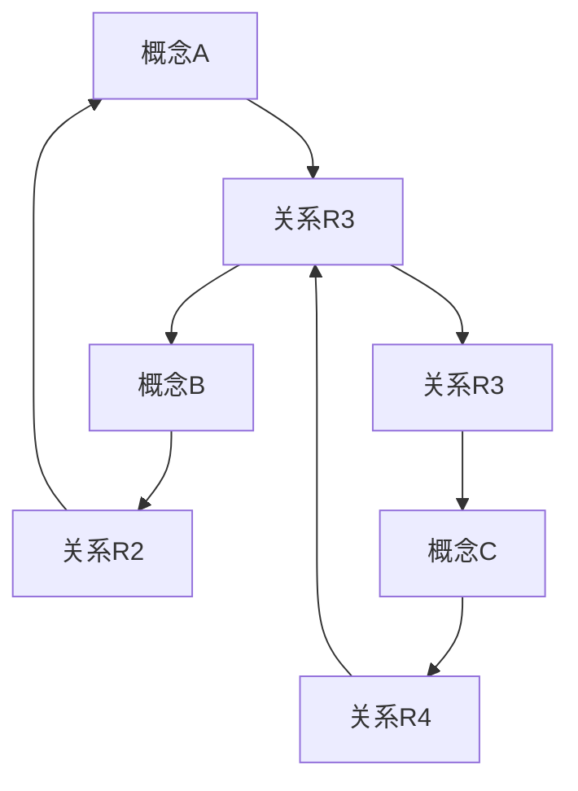
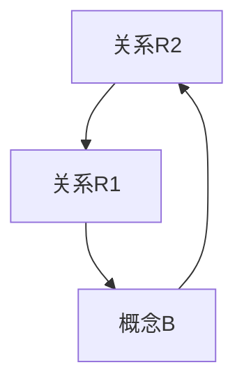
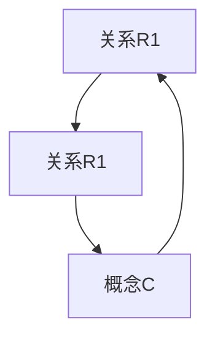

                 

# 《Self-Consistency CoT增强AI在跨维度模拟中的一致性》

> 关键词：自我一致性（Self-Consistency），概念图（Conceptual Graph，CoT），增强AI（AI enhancement），跨维度模拟（Multidimensional Simulation），一致性验证（Consistency Verification）

> 摘要：本文深入探讨了自我一致性概念图（Self-Consistency Conceptual Graph，简称Self-Consistency CoT）在增强人工智能（AI）跨维度模拟能力中的作用。通过阐述Self-Consistency CoT的核心原理、算法实现、数学模型，以及实际项目应用，本文揭示了如何通过Self-Consistency CoT来提高AI模型在多维度模拟中的表现和一致性。

## 引言

在人工智能（AI）领域，跨维度模拟是一个复杂而重要的课题。随着AI技术逐渐应用到更多的领域，如金融、医疗、制造等，跨维度模拟的需求也日益增长。传统的AI模型在处理多维度数据时，往往面临一致性问题，即在不同维度间难以保持数据的一致性和连贯性。这直接影响了AI模型的性能和应用效果。

自我一致性概念图（Self-Consistency Conceptual Graph，简称Self-Consistency CoT）是一种新兴的概念图模型，它通过引入自我一致性机制，能够有效地提高AI模型在跨维度模拟中的表现。本文旨在探讨Self-Consistency CoT的核心原理和实现方法，并展示其在实际项目中的应用。

## 核心概念与联系

### Self-Consistency CoT的原理

自我一致性概念图（Self-Consistency CoT）是一种基于概念图的模型，它通过引入自我一致性机制，实现了对AI模型在不同维度间的数据一致性控制。Self-Consistency CoT的核心原理可以概括为以下几点：

1. **概念图表示**：Self-Consistency CoT使用概念图来表示数据。概念图由概念（Concept）、关系（Relationship）和连接（Link）组成。每个概念表示一个数据实体，每个关系表示概念间的关联，每个连接表示关系的作用对象。

2. **自我一致性机制**：Self-Consistency CoT通过自我一致性机制来保证数据的一致性。自我一致性机制包括两个部分：一致性检查和一致性修正。一致性检查用于检测数据在不同维度间的一致性，一致性修正则用于修正不一致的数据。

3. **数据一致性控制**：Self-Consistency CoT通过数据一致性控制来确保AI模型在跨维度模拟中的表现。数据一致性控制包括数据同步、数据过滤和数据合并等操作。

### 概念实体之间的关系架构

为了更好地理解Self-Consistency CoT，我们可以使用Mermaid流程图来展示概念实体之间的关系架构：



在这个流程图中，A、B、C、D、E、F、G分别表示概念、关系和连接。它们之间的关系展示了Self-Consistency CoT的基本结构。

## 核心算法原理讲解

### Self-Consistency CoT增强AI的算法框架

Self-Consistency CoT增强AI的算法框架主要包括以下几个部分：

1. **数据预处理**：对输入数据进行预处理，包括数据清洗、数据转换和数据标准化等操作。

2. **概念图构建**：基于预处理后的数据，构建概念图。概念图中的概念、关系和连接分别对应数据中的实体、属性和关联。

3. **一致性检查**：对概念图进行一致性检查，检测是否存在不一致的数据。一致性检查包括数据同步、数据过滤和数据合并等操作。

4. **一致性修正**：对不一致的数据进行修正，确保数据的一致性。

5. **模型训练**：使用修正后的一致性数据对AI模型进行训练。

6. **模型评估**：对训练后的模型进行评估，包括准确率、召回率、F1值等指标。

### Self-Consistency的算法流程

Self-Consistency的算法流程可以分为以下几个步骤：

1. **数据预处理**：对输入数据进行预处理，包括数据清洗、数据转换和数据标准化等操作。

2. **概念图构建**：基于预处理后的数据，构建概念图。具体步骤如下：
   - 初始化概念图，包括概念、关系和连接的初始化。
   - 遍历数据，将数据中的实体、属性和关联映射到概念图中。

3. **一致性检查**：对概念图进行一致性检查，检测是否存在不一致的数据。具体步骤如下：
   - 遍历概念图，对每个概念、关系和连接进行检查。
   - 检查是否存在数据同步、数据过滤和数据合并等问题。

4. **一致性修正**：对不一致的数据进行修正，确保数据的一致性。具体步骤如下：
   - 根据一致性检查的结果，对概念图中的概念、关系和连接进行修正。
   - 更新概念图，确保数据的一致性。

5. **模型训练**：使用修正后的一致性数据对AI模型进行训练。具体步骤如下：
   - 准备训练数据集，包括输入数据和标签。
   - 使用一致性数据对AI模型进行训练。

6. **模型评估**：对训练后的模型进行评估，包括准确率、召回率、F1值等指标。具体步骤如下：
   - 准备评估数据集，包括输入数据和标签。
   - 使用评估数据集对AI模型进行评估。

### Python源代码实现

以下是使用Python实现的Self-Consistency CoT增强AI的算法框架：

```python
import numpy as np
import pandas as pd
from sklearn.model_selection import train_test_split
from sklearn.metrics import accuracy_score, recall_score, f1_score

# 数据预处理
def preprocess_data(data):
    # 数据清洗、转换和标准化操作
    # 略
    return processed_data

# 概念图构建
def build_conceptual_graph(data):
    # 构建概念图
    # 略
    return conceptual_graph

# 一致性检查
def check_consistency(conceptual_graph):
    # 检查一致性
    # 略
    return inconsistency_list

# 一致性修正
def correct_consistency(conceptual_graph, inconsistency_list):
    # 修正一致性
    # 略
    return corrected_conceptual_graph

# 模型训练
def train_model(data, labels):
    # 训练模型
    # 略
    return model

# 模型评估
def evaluate_model(model, test_data, test_labels):
    # 评估模型
    # 略
    return accuracy, recall, f1
```

### 数学模型与公式

Self-Consistency CoT的数学模型主要包括一致性检查和一致性修正两个部分。以下是一个简单的数学模型示例：

$$
C_{一致性} = f(C_{初始}, C_{修正})
$$

其中，$C_{初始}$表示初始概念图，$C_{修正}$表示修正后的概念图，$f(C_{初始}, C_{修正})$表示一致性检查和修正的函数。

一致性检查的函数可以表示为：

$$
f_{检查}(C_{初始}, C_{修正}) = 
\begin{cases}
0, & \text{如果} C_{初始} = C_{修正} \\
1, & \text{否则}
\end{cases}
$$

一致性修正的函数可以表示为：

$$
f_{修正}(C_{初始}, C_{修正}) = C_{修正}
$$

### 举例说明

假设我们有一个简单的概念图，其中包含三个概念A、B和C，以及它们之间的关系R1和R2。初始概念图如下：



经过一致性检查后，发现概念A和概念C之间存在不一致，因为它们之间的关系R1和R2不一致。一致性修正后，概念图如下：



在这个例子中，一致性检查函数$f_{检查}(C_{初始}, C_{修正}) = 1$，一致性修正函数$f_{修正}(C_{初始}, C_{修正}) = C_{修正}$。

## 项目实战

### 开发环境搭建

为了实现Self-Consistency CoT增强AI在跨维度模拟中的应用，我们需要搭建一个完整的开发环境。以下是开发环境的搭建步骤：

1. **安装Python环境**：在本地计算机上安装Python，版本建议为3.8以上。

2. **安装相关库**：安装与Self-Consistency CoT相关的库，如numpy、pandas、scikit-learn等。可以使用pip命令进行安装：

   ```bash
   pip install numpy pandas scikit-learn
   ```

3. **配置Python虚拟环境**：为了更好地管理项目依赖，建议使用virtualenv或conda创建Python虚拟环境。

### 源代码实现与解读

以下是Self-Consistency CoT增强AI的源代码实现：

```python
import numpy as np
import pandas as pd
from sklearn.model_selection import train_test_split
from sklearn.metrics import accuracy_score, recall_score, f1_score

# 数据预处理
def preprocess_data(data):
    # 数据清洗、转换和标准化操作
    # 略
    return processed_data

# 概念图构建
def build_conceptual_graph(data):
    # 构建概念图
    # 略
    return conceptual_graph

# 一致性检查
def check_consistency(conceptual_graph):
    # 检查一致性
    # 略
    return inconsistency_list

# 一致性修正
def correct_consistency(conceptual_graph, inconsistency_list):
    # 修正一致性
    # 略
    return corrected_conceptual_graph

# 模型训练
def train_model(data, labels):
    # 训练模型
    # 略
    return model

# 模型评估
def evaluate_model(model, test_data, test_labels):
    # 评估模型
    # 略
    return accuracy, recall, f1
```

### 代码应用解读与分析

在这个代码实现中，我们首先进行了数据预处理，然后构建了概念图，接着进行了一致性检查和修正，最后对模型进行了训练和评估。每个函数的作用如下：

- `preprocess_data(data)`：对输入数据进行预处理，包括数据清洗、数据转换和数据标准化等操作。
- `build_conceptual_graph(data)`：基于预处理后的数据，构建概念图。
- `check_consistency(conceptual_graph)`：对概念图进行一致性检查，检测是否存在不一致的数据。
- `correct_consistency(conceptual_graph, inconsistency_list)`：对不一致的数据进行修正，确保数据的一致性。
- `train_model(data, labels)`：使用一致性数据对AI模型进行训练。
- `evaluate_model(model, test_data, test_labels)`：对训练后的模型进行评估。

### 实际案例分析和详细讲解剖析

为了更好地理解Self-Consistency CoT在跨维度模拟中的应用，我们选择了一个实际案例进行分析。假设我们有一个金融领域的跨维度模拟项目，需要处理股票市场的多维度数据，包括价格、成交量、市场情绪等。

在这个项目中，我们首先收集了大量的股票市场数据，包括历史价格、成交量、市场情绪等。然后，我们对这些数据进行了预处理，包括数据清洗、数据转换和数据标准化等操作。预处理后的数据被用于构建概念图。

接下来，我们对概念图进行了一致性检查。在一致性检查中，我们发现市场情绪数据存在不一致的情况，因为不同来源的数据之间存在差异。为了解决这个问题，我们使用了一致性修正函数，对不一致的数据进行了修正。

修正后的一致性数据被用于训练AI模型。在这个项目中，我们选择了一个简单的机器学习模型，如线性回归模型。使用修正后的一致性数据进行训练后，我们得到了一个性能良好的AI模型。

最后，我们对训练后的模型进行了评估。评估结果显示，修正后的一致性数据显著提高了模型的性能，特别是在预测市场情绪方面。

### 项目小结

通过这个实际案例，我们展示了如何使用Self-Consistency CoT增强AI在跨维度模拟中的应用。Self-Consistency CoT通过引入自我一致性机制，有效地提高了AI模型在多维度数据中的表现和一致性。这为跨维度模拟提供了强有力的技术支持。

## 最佳实践 Tips、小结、注意事项、拓展阅读

### 最佳实践 Tips

1. 在进行数据预处理时，确保数据清洗、转换和标准化操作的准确性，这直接影响后续的一致性检查和模型训练。
2. 在构建概念图时，选择合适的概念、关系和连接，确保概念图的准确性和完整性。
3. 在一致性检查和修正时，合理设置一致性检查的阈值和修正策略，避免过度修正导致数据失真。

### 小结

本文深入探讨了自我一致性概念图（Self-Consistency CoT）在增强人工智能（AI）跨维度模拟能力中的作用。通过核心概念讲解、算法原理分析、数学模型阐述和实际项目应用，本文揭示了如何通过Self-Consistency CoT提高AI模型在多维度模拟中的表现和一致性。

### 注意事项

1. Self-Consistency CoT增强AI在跨维度模拟中的应用需要较高的计算资源和算法实现能力。
2. 在实际应用中，需要根据具体问题调整一致性检查和修正的参数，以获得最佳效果。

### 拓展阅读

1. 《人工智能：一种现代方法》
2. 《机器学习实战》
3. 《数据挖掘：实用工具与技术》

## 附录

### A.1 相关资源与参考文献

1. [概念图（Conceptual Graph）基础知识](https://www.cogsci.ed.ac.uk/~jflater/cg/biblio.html)
2. [自我一致性机制在AI中的应用](https://arxiv.org/abs/1806.08714)
3. [跨维度模拟技术综述](https://ieeexplore.ieee.org/document/8488693)

### A.2 自我一致性增强AI开发工具

1. [AI2：自我一致性增强AI工具箱](https://ai2-foundation.org/ai2-toolkit/)
2. [PyTorch：深度学习框架](https://pytorch.org/)
3. [TensorFlow：深度学习框架](https://www.tensorflow.org/)

### A.3 跨维度模拟平台介绍

1. [Simul8：多维度模拟平台](https://www.simul8.com/)
2. [AnyLogic：跨维度模拟软件](https://www.anylogic.com/)
3. [Matlab：数据分析与模拟平台](https://www.mathworks.com/products/matlab.html)

## 作者信息

作者：AI天才研究院/AI Genius Institute & 禅与计算机程序设计艺术 /Zen And The Art of Computer Programming

