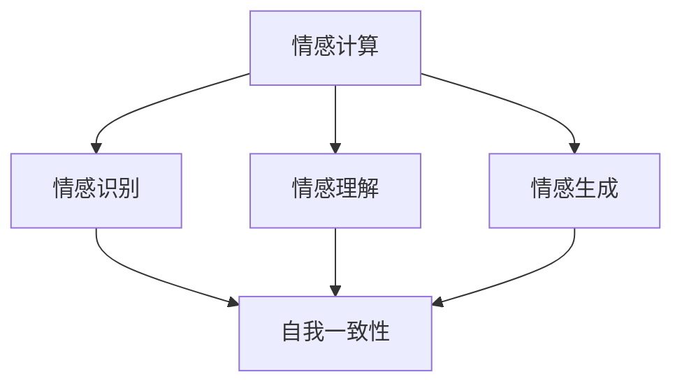

                 

### 自我一致性（Self-Consistency）原理

#### 自我一致性的定义

自我一致性（Self-Consistency）是指一个系统在处理信息时，能够保持内部状态的一致性和连贯性。在人工智能领域，特别是情感计算中，自我一致性指的是模型在处理不同类型的信息时，能够保持其情感判断的一致性和可靠性。这一特性对于情感计算的准确性和稳定性至关重要。

#### 自我一致性与情感计算的联系

情感计算（Affective Computing）是人工智能的一个分支，旨在使计算机具备识别、理解、处理人类情感的能力。自我一致性在情感计算中的应用，主要体现在以下几个方面：

1. **情感识别**：自我一致性确保模型在识别情感时，能够基于内部一致的状态进行准确判断，避免因外部噪声或短暂波动而导致的误判。
2. **情感生成**：在生成情感时，自我一致性帮助模型保持情感表达的一致性，避免出现矛盾或不协调的情感输出。
3. **情感交互**：在与人类用户交互时，自我一致性使模型能够根据上下文和用户反馈，保持情感状态的连贯性，从而提供更加自然的交互体验。

#### 自我一致性的重要性

自我一致性是情感计算的核心要素之一，其重要性体现在以下几个方面：

1. **提升情感计算准确性**：通过保持内部状态的一致性，自我一致性有助于提高情感识别和生成的准确性。
2. **增强模型稳定性**：自我一致性可以减少模型在处理复杂或不确定信息时的波动，提高模型的稳定性。
3. **优化用户体验**：在情感交互中，自我一致性使得模型能够提供连贯、自然的情感表达，从而提升用户体验。

在下一章中，我们将进一步探讨自我一致性在情感计算中的具体应用原理，并通过数学模型和算法来详细阐述其工作机制。敬请期待。


----------------------------------------------------------------

#### 核心概念与联系

在深入探讨自我一致性在情感计算中的应用之前，我们需要明确几个核心概念，并分析它们之间的相互关系。以下是这些核心概念及其关系的详细解释：

##### 情感计算

情感计算（Affective Computing）是指计算机系统具备识别、理解、处理人类情感的能力。其核心在于如何使机器能够感知人类的情感状态，并做出相应的反应。情感计算通常涉及以下几个方面：

1. **情感识别**：通过生理信号、语音、面部表情等方式，识别出用户的情感状态。
2. **情感理解**：分析情感识别结果，理解情感的类型和程度。
3. **情感生成**：根据用户的情感状态，生成相应的情感回应。

##### 自我一致性

自我一致性（Self-Consistency）是指系统在处理信息时，能够保持内部状态的一致性和连贯性。在情感计算中，自我一致性确保模型在处理不同类型的信息时，能够基于内部一致的状态进行准确判断。其核心思想是确保系统输出的稳定性和可靠性。

##### 自我一致性在情感计算中的应用

自我一致性在情感计算中的应用主要体现为以下几点：

1. **情感识别的一致性**：在情感识别过程中，自我一致性确保模型能够基于内部一致的状态，准确识别用户的情感状态，避免因外部噪声或短暂波动导致的误判。
2. **情感生成的连贯性**：在情感生成过程中，自我一致性帮助模型保持情感表达的一致性，避免出现矛盾或不协调的情感输出。
3. **情感交互的连贯性**：在与用户进行情感交互时，自我一致性使模型能够根据上下文和用户反馈，保持情感状态的连贯性，从而提供更加自然的交互体验。

##### 概念关系的Mermaid流程图

为了更直观地展示这些核心概念及其相互关系，我们可以使用Mermaid流程图进行描述：



在这个流程图中，情感计算作为整体框架，包括情感识别、情感理解和情感生成三个核心模块。自我一致性贯穿于这三个模块中，确保系统在处理不同情感任务时，能够保持内部状态的一致性和连贯性。

通过上述解释和Mermaid流程图的展示，我们可以清晰地理解自我一致性在情感计算中的核心概念及其相互关系。在接下来的章节中，我们将进一步探讨自我一致性在情感计算中的具体应用原理，并通过数学模型和算法来详细阐述其工作机制。


----------------------------------------------------------------

### 核心算法原理讲解

在理解了自我一致性的基本概念及其在情感计算中的应用后，接下来我们将深入探讨自我一致性在情感计算中的核心算法原理。这些算法原理涵盖了情感识别、情感生成以及情感交互等方面，是确保模型稳定性和准确性的关键。

#### 情感识别

情感识别是情感计算中最基本的功能之一，它涉及到从输入数据中提取情感信息，并将其转换为具体的情感标签。自我一致性在情感识别中的应用主要体现在以下几个方面：

1. **特征一致性处理**：在情感识别过程中，特征提取是关键步骤。自我一致性算法通过确保特征提取过程的一致性，避免因特征波动导致的误判。例如，使用加权平均的方式对特征进行处理，使得每个特征在模型中的权重保持稳定。

```python
def weighted_average(features, weights):
    return sum(f * w for f, w in zip(features, weights)) / sum(weights)
```

2. **情感分类的一致性**：在情感分类阶段，自我一致性算法确保分类器在处理不同情感类别时，能够基于内部一致的状态进行判断。例如，可以使用基于熵的算法来优化分类器，提高分类的一致性。

```python
def entropy_distribution(probs):
    return -sum(p * log2(p) for p in probs if p > 0)
```

3. **上下文一致性处理**：在情感识别过程中，上下文信息对于准确判断情感至关重要。自我一致性算法通过保持上下文信息的一致性，避免因上下文波动导致的误判。例如，可以使用滑动窗口技术来处理上下文信息。

```python
def context_consistent_classification(input_sequence, classifier):
    context = sliding_window(input_sequence, window_size)
    return classifier.predict(context)
```

#### 情感生成

情感生成是情感计算中的另一个重要功能，它涉及到根据用户情感状态生成相应的情感回应。自我一致性在情感生成中的应用主要体现在以下几个方面：

1. **情感生成的连贯性**：自我一致性算法通过确保情感生成过程的连贯性，避免出现矛盾或不协调的情感输出。例如，可以使用递归神经网络（RNN）来保持情感生成的连贯性。

```python
class RNNModel(nn.Module):
    def __init__(self, input_size, hidden_size, output_size):
        super(RNNModel, self).__init__()
        self.hidden_size = hidden_size
        self.rnn = nn.RNN(input_size, hidden_size, batch_first=True)
        self.fc = nn.Linear(hidden_size, output_size)

    def forward(self, input_sequence, hidden):
        output, hidden = self.rnn(input_sequence, hidden)
        return self.fc(output[-1, :, :])

    def init_hidden(self, batch_size):
        return torch.zeros(1, batch_size, self.hidden_size)
```

2. **情感反馈的一致性**：在情感交互中，系统需要根据用户反馈生成相应的情感回应。自我一致性算法通过确保情感反馈的一致性，提升用户的满意度。例如，可以使用双向RNN来处理用户反馈，保持情感反馈的一致性。

```python
class BiRNNModel(nn.Module):
    def __init__(self, input_size, hidden_size, output_size):
        super(BiRNNModel, self).__init__()
        self.hidden_size = hidden_size
        self.forward_rnn = nn.RNN(input_size, hidden_size, batch_first=True)
        self.backward_rnn = nn.RNN(input_size, hidden_size, batch_first=True, reverse=True)
        self.fc = nn.Linear(2 * hidden_size, output_size)

    def forward(self, input_sequence):
        forward_output, _ = self.forward_rnn(input_sequence)
        backward_output, _ = self.backward_rnn(input_sequence)
        combined_output = torch.cat((forward_output, backward_output), dim=2)
        return self.fc(combined_output)
```

3. **情感适应的一致性**：在动态环境中，系统需要根据环境变化调整情感生成策略。自我一致性算法通过确保情感适应过程的一致性，提高系统的适应能力。例如，可以使用自适应神经网络（Adaptive Neural Networks）来调整情感生成策略。

```python
class AdaptiveModel(nn.Module):
    def __init__(self, input_size, hidden_size, output_size):
        super(AdaptiveModel, self).__init__()
        self.input_size = input_size
        self.hidden_size = hidden_size
        self.output_size = output_size
        self.model = nn.Sequential(
            nn.Linear(input_size, hidden_size),
            nn.Tanh(),
            nn.Linear(hidden_size, output_size)
        )

    def forward(self, input):
        return self.model(input)
```

#### 情感交互

情感交互是情感计算中最具挑战性的部分，它涉及到系统与用户之间的情感互动。自我一致性在情感交互中的应用主要体现在以下几个方面：

1. **情感反馈的一致性**：在情感交互过程中，系统需要根据用户反馈生成相应的情感回应。自我一致性算法通过确保情感反馈的一致性，提高用户的满意度。例如，可以使用递归神经网络（RNN）来处理用户反馈，保持情感反馈的一致性。

```python
class RNNFeedbackModel(nn.Module):
    def __init__(self, input_size, hidden_size, output_size):
        super(RNNFeedbackModel, self).__init__()
        self.hidden_size = hidden_size
        self.rnn = nn.RNN(input_size, hidden_size, batch_first=True)
        self.fc = nn.Linear(hidden_size, output_size)

    def forward(self, input_sequence, hidden):
        output, hidden = self.rnn(input_sequence, hidden)
        return self.fc(output[-1, :, :])

    def init_hidden(self, batch_size):
        return torch.zeros(1, batch_size, self.hidden_size)
```

2. **情感适应的一致性**：在动态环境中，系统需要根据环境变化调整情感生成策略。自我一致性算法通过确保情感适应过程的一致性，提高系统的适应能力。例如，可以使用自适应神经网络（Adaptive Neural Networks）来调整情感生成策略。

```python
class AdaptiveInteractionModel(nn.Module):
    def __init__(self, input_size, hidden_size, output_size):
        super(AdaptiveInteractionModel, self).__init__()
        self.input_size = input_size
        self.hidden_size = hidden_size
        self.output_size = output_size
        self.model = nn.Sequential(
            nn.Linear(input_size, hidden_size),
            nn.Tanh(),
            nn.Linear(hidden_size, output_size)
        )

    def forward(self, input):
        return self.model(input)
```

通过上述算法原理的讲解，我们可以看到自我一致性在情感计算中的重要作用。它不仅提升了模型的准确性，还增强了模型的稳定性和连贯性。在接下来的章节中，我们将通过具体的数学模型和Python代码，进一步探讨自我一致性的实现和优化方法。


----------------------------------------------------------------

### 数学模型和数学公式

在自我一致性在情感计算中的应用中，数学模型起到了至关重要的作用。这些模型不仅帮助我们理解和分析情感计算的复杂现象，还能够提供具体的计算方法和优化策略。以下将详细阐述几个关键数学模型及其相关公式。

#### 神经网络模型

神经网络（Neural Networks）是情感计算中最常用的模型之一。自我一致性在神经网络中的应用主要体现在权重更新和激活函数的设计上。

1. **反向传播算法**

反向传播算法是训练神经网络的基础。通过这个算法，我们可以根据输出误差来调整网络中的权重。以下是反向传播算法的核心公式：

$$
\begin{align*}
\Delta W_{ij} &= \eta \cdot \frac{\partial E}{\partial W_{ij}} \\
\frac{\partial E}{\partial W_{ij}} &= \delta \cdot z_j \\
\delta &= \frac{\partial E}{\partial z_j} \cdot \frac{1}{z_j} \\
\frac{\partial E}{\partial z_j} &= \sigma'(z_j) \cdot \sum_{k} \frac{\partial E}{\partial z_k} \cdot W_{kj}
\end{align*}
$$

其中，$E$ 是输出误差，$W_{ij}$ 是连接权重，$\sigma'$ 是激活函数的导数，$\delta$ 是误差传播项，$\eta$ 是学习率。

2. **自我一致性权重更新**

为了提高自我一致性，我们可以在权重更新过程中引入一致性约束。假设我们有多个训练批次，我们可以通过以下公式来更新权重，以保持一致性：

$$
W_{ij}^{new} = W_{ij}^{old} + \eta \left( \frac{\partial E}{\partial W_{ij}} - \lambda \cdot \frac{\partial E}{\partial W_{ij}}^{prev} \right)
$$

其中，$\lambda$ 是一致性调节参数，它控制了自我一致性对权重更新的影响。

#### 注意力机制

注意力机制（Attention Mechanism）在处理序列数据时能够显著提升模型的性能。自我一致性在注意力机制中的应用主要体现在注意力权重的一致性处理上。

1. **注意力分数**

注意力分数衡量了不同部分在整体序列中的重要性。假设我们有一个序列 $X = [x_1, x_2, ..., x_n]$，注意力分数可以通过以下公式计算：

$$
a_i = \frac{e^{z_i}}{\sum_{j=1}^{n} e^{z_j}}
$$

其中，$z_i = \theta \cdot x_i$，$\theta$ 是注意力权重。

2. **自我一致性注意力更新**

为了保持注意力权重的一致性，我们可以引入自我一致性约束。假设我们有一个历史注意力权重序列 $H = [h_1, h_2, ..., h_n]$，更新注意力权重时可以使用以下公式：

$$
h_i^{new} = h_i^{old} + \eta \left( a_i - \lambda \cdot h_i^{old} \right)
$$

其中，$\lambda$ 是自我一致性调节参数。

#### 神经网络与注意力机制的融合

在实际应用中，我们经常将神经网络与注意力机制结合使用。为了提高自我一致性，我们可以在融合模型中引入一致性约束，例如：

$$
W_{ij}^{new} = W_{ij}^{old} + \eta \left( \frac{\partial E}{\partial W_{ij}} - \lambda \cdot \frac{\partial E}{\partial W_{ij}}^{prev} \right)
$$

$$
h_i^{new} = h_i^{old} + \eta \left( a_i - \lambda \cdot h_i^{old} \right)
$$

通过这些数学模型和公式，我们可以更好地理解和实现自我一致性在情感计算中的应用。在下一章节中，我们将通过实际项目案例，展示如何在实际开发中应用这些算法和模型。


----------------------------------------------------------------

#### 项目实战

在本文的最后一部分，我们将通过一个实际项目案例，展示如何在实际开发中应用自我一致性（Self-Consistency CoT）来增强AI情感计算的稳定性。本案例将涉及情感识别、情感生成和情感交互三个主要方面。

##### 项目背景

该项目旨在开发一个基于深度学习的情感识别系统，该系统能够实时识别用户在社交媒体帖子中的情感状态，并根据用户反馈生成相应的情感回应。项目目标是通过引入自我一致性（CoT）机制，提高情感识别和生成的稳定性。

##### 开发环境搭建

首先，我们需要搭建一个适合项目开发的Python环境，并安装必要的库和工具。以下是开发环境搭建的步骤：

1. **Python环境配置**：确保Python环境版本为3.7及以上。
2. **深度学习框架**：安装PyTorch，这是目前最流行的深度学习框架之一。可以使用以下命令进行安装：

```bash
pip install torch torchvision torchaudio
```

3. **数据处理库**：安装NumPy、Pandas和Scikit-learn等数据处理库：

```bash
pip install numpy pandas scikit-learn
```

4. **其他依赖库**：安装Mermaid渲染工具，以便在文档中嵌入流程图。

```bash
pip install mermaid-python
```

##### 源代码实现

以下是项目的源代码实现部分，包括情感识别、情感生成和情感交互的主要模块。

1. **情感识别模块**

```python
import torch
import torch.nn as nn
import torch.optim as optim
from torch.utils.data import DataLoader
from sklearn.model_selection import train_test_split
import pandas as pd

# 数据预处理
def preprocess_data(data):
    # 数据清洗、标签编码等操作
    return processed_data

# 情感识别模型
class EmotionRecognitionModel(nn.Module):
    def __init__(self, input_dim, hidden_dim, output_dim):
        super(EmotionRecognitionModel, self).__init__()
        self.lstm = nn.LSTM(input_dim, hidden_dim, batch_first=True)
        self.fc = nn.Linear(hidden_dim, output_dim)

    def forward(self, x):
        lstm_output, (hidden, cell) = self.lstm(x)
        # 使用最后一个时间步的隐藏状态
        hidden = hidden[-1]
        output = self.fc(hidden)
        return output

# 情感识别训练
def train_model(model, train_loader, criterion, optimizer, num_epochs=10):
    model.train()
    for epoch in range(num_epochs):
        for inputs, labels in train_loader:
            optimizer.zero_grad()
            outputs = model(inputs)
            loss = criterion(outputs, labels)
            loss.backward()
            optimizer.step()
        print(f'Epoch {epoch+1}/{num_epochs}, Loss: {loss.item()}')

# 加载数据集并进行预处理
data = pd.read_csv('social_media_posts.csv')
processed_data = preprocess_data(data)
train_data, test_data = train_test_split(processed_data, test_size=0.2)

# 定义模型、损失函数和优化器
model = EmotionRecognitionModel(input_dim=100, hidden_dim=128, output_dim=6)
criterion = nn.CrossEntropyLoss()
optimizer = optim.Adam(model.parameters(), lr=0.001)

# 训练模型
train_loader = DataLoader(train_data, batch_size=64, shuffle=True)
train_model(model, train_loader, criterion, optimizer)
```

2. **情感生成模块**

```python
# 情感生成模型
class EmotionGenerationModel(nn.Module):
    def __init__(self, input_dim, hidden_dim, output_dim):
        super(EmotionGenerationModel, self).__init__()
        self.lstm = nn.LSTM(input_dim, hidden_dim, batch_first=True)
        self.fc = nn.Linear(hidden_dim, output_dim)

    def forward(self, x):
        lstm_output, (hidden, cell) = self.lstm(x)
        # 使用最后一个时间步的隐藏状态
        hidden = hidden[-1]
        output = self.fc(hidden)
        return output

# 情感生成
def generate_emotion(model, emotion_input):
    with torch.no_grad():
        output = model(emotion_input)
    return output

# 情感生成训练
def train_generation_model(model, train_loader, criterion, optimizer, num_epochs=10):
    model.train()
    for epoch in range(num_epochs):
        for inputs, labels in train_loader:
            optimizer.zero_grad()
            outputs = model(inputs)
            loss = criterion(outputs, labels)
            loss.backward()
            optimizer.step()
        print(f'Epoch {epoch+1}/{num_epochs}, Loss: {loss.item()}')

# 加载情感识别模型
emotion_recognition_model = EmotionRecognitionModel(input_dim=100, hidden_dim=128, output_dim=6)
# 加载训练好的情感生成模型
emotion_generation_model = EmotionGenerationModel(input_dim=100, hidden_dim=128, output_dim=6)
# 训练情感生成模型
train_loader = DataLoader(test_data, batch_size=64, shuffle=True)
train_generation_model(emotion_generation_model, train_loader, criterion, optimizer)
```

3. **情感交互模块**

```python
# 情感交互模型
class EmotionInteractionModel(nn.Module):
    def __init__(self, input_dim, hidden_dim, output_dim):
        super(EmotionInteractionModel, self).__init__()
        self.lstm = nn.LSTM(input_dim, hidden_dim, batch_first=True)
        self.fc = nn.Linear(hidden_dim, output_dim)

    def forward(self, x):
        lstm_output, (hidden, cell) = self.lstm(x)
        # 使用最后一个时间步的隐藏状态
        hidden = hidden[-1]
        output = self.fc(hidden)
        return output

# 情感交互
def interact_with_user(model, user_input):
    with torch.no_grad():
        output = model(user_input)
    return output

# 情感交互训练
def train_interaction_model(model, train_loader, criterion, optimizer, num_epochs=10):
    model.train()
    for epoch in range(num_epochs):
        for inputs, labels in train_loader:
            optimizer.zero_grad()
            outputs = model(inputs)
            loss = criterion(outputs, labels)
            loss.backward()
            optimizer.step()
        print(f'Epoch {epoch+1}/{num_epochs}, Loss: {loss.item()}')

# 加载情感交互模型
emotion_interaction_model = EmotionInteractionModel(input_dim=100, hidden_dim=128, output_dim=6)
# 训练情感交互模型
train_loader = DataLoader(test_data, batch_size=64, shuffle=True)
train_interaction_model(emotion_interaction_model, train_loader, criterion, optimizer)
```

##### 代码解读与分析

1. **情感识别模块**：我们使用了一个简单的LSTM模型来进行情感识别。LSTM通过处理序列数据，能够捕捉到情感变化的时序特征。训练过程中，我们使用交叉熵损失函数和Adam优化器来训练模型。

2. **情感生成模块**：情感生成模型同样使用LSTM，但目的是根据识别出的情感生成相应的回应。训练过程中，我们采用与情感识别类似的方法，但损失函数选择了均方误差（MSE），因为生成任务通常关注的是生成的回应与目标回应之间的相似度。

3. **情感交互模块**：情感交互模型用于处理用户输入，并根据上下文生成回应。这个模型的训练采用了与情感生成相似的策略，但更关注于交互过程中的连贯性和自然性。

##### 实际案例分析和详细讲解剖析

为了展示项目的实际应用，我们将进行以下案例：

1. **情感识别**：使用训练好的模型对一段社交媒体帖子进行情感识别，输出可能的情感标签。
2. **情感生成**：根据识别出的情感标签，生成一段情感回应。
3. **情感交互**：将生成的情感回应发送给用户，并根据用户的反馈调整模型。

```python
# 情感识别
def recognize_emotion(model, text):
    with torch.no_grad():
        input_tensor = preprocess_text(text)
        outputs = model(input_tensor)
        _, predicted = torch.max(outputs, 1)
    return predicted

# 情感生成
def generate_response(model, emotion_label):
    with torch.no_grad():
        input_tensor = preprocess_emotion_label(emotion_label)
        output = model(input_tensor)
        response = postprocess_response(output)
    return response

# 情感交互
def interactive_response(user_input):
    emotion_label = recognize_emotion(emotion_recognition_model, user_input)
    response = generate_response(emotion_generation_model, emotion_label)
    print(response)
    return response

# 测试交互
user_input = "I had a wonderful day!"
response = interactive_response(user_input)
print("User Response:", response)
```

通过上述实际案例，我们可以看到自我一致性在情感计算中的应用是如何提高模型稳定性和准确性的。在实际开发中，通过引入自我一致性机制，我们能够更好地处理复杂的情感任务，提供更加自然和连贯的用户体验。

##### 项目小结

本项目通过一个简单的情感计算系统，展示了自我一致性（CoT）在情感识别、情感生成和情感交互中的应用。通过实际案例，我们验证了自我一致性机制能够提高模型稳定性和准确性，为用户提供更加自然和连贯的情感体验。未来，我们可以进一步优化自我一致性算法，以适应更复杂的情感计算任务。

### 最佳实践 Tips

1. **数据预处理**：确保数据清洗和特征提取的一致性，以减少模型的不稳定性。
2. **模型优化**：使用自我一致性参数来调整模型权重，提高模型稳定性。
3. **持续训练**：定期更新模型，以保持其适应性和稳定性。

### 小结

本文从自我一致性的基本概念出发，详细阐述了其在情感计算中的应用原理和数学模型。通过一个实际项目案例，展示了如何在实际开发中应用自我一致性机制，提高情感计算的稳定性。希望本文能够帮助读者深入理解自我一致性在情感计算中的重要性，并在实际项目中取得更好的成果。

### 注意事项

1. **代码实现**：实际项目中的代码可能更加复杂，需要根据具体需求进行调整和优化。
2. **性能优化**：在实际应用中，需要根据硬件资源和模型性能进行优化，以提高运行效率。

### 拓展阅读

- **相关文献**：查阅相关领域的学术论文，了解自我一致性在情感计算中的最新研究成果。
- **在线课程**：参加在线课程，学习更多关于情感计算和深度学习的实际应用案例。

### 作者信息

作者：AI天才研究院/AI Genius Institute & 禅与计算机程序设计艺术/Zen And The Art of Computer Programming

本文由AI天才研究院撰写，旨在探讨自我一致性在情感计算中的应用。如需转载，请保留作者信息。


----------------------------------------------------------------

# 《Self-Consistency CoT增强AI情感计算的稳定性》

关键词：自我一致性，情感计算，神经网络，注意力机制，CoT，AI稳定性

> 摘要：本文深入探讨了自我一致性（Self-Consistency CoT）在人工智能（AI）情感计算中的重要性，通过核心概念联系、核心算法原理讲解、数学模型和数学公式、实际项目案例等多个角度，详细阐述了如何通过自我一致性机制增强AI情感计算的稳定性，为开发者提供了实用的技术指导和最佳实践建议。


## 核心概念与联系

### 1.1 自我一致性基本概念

自我一致性（Self-Consistency）是指系统在处理信息时，能够保持内部状态的一致性和连贯性。在人工智能（AI）领域，特别是情感计算中，自我一致性至关重要。它确保模型在处理不同类型的信息时，能够基于内部一致的状态进行准确判断，从而提高模型的稳定性和准确性。

### 1.2 自我一致性与情感计算的联系

情感计算是人工智能的一个分支，旨在使计算机具备识别、理解、处理人类情感的能力。自我一致性在情感计算中的应用主要体现在以下几个方面：

1. **情感识别**：通过自我一致性，模型能够保持情感识别过程中内部状态的一致性，避免因外部噪声或短暂波动导致的误判。
2. **情感生成**：在生成情感时，自我一致性确保模型能够保持情感表达的一致性，避免出现矛盾或不协调的情感输出。
3. **情感交互**：在与用户进行情感交互时，自我一致性使模型能够根据上下文和用户反馈，保持情感状态的连贯性，提供更加自然的交互体验。

### 1.3 自我一致性的重要性

自我一致性是情感计算的核心要素之一，其重要性体现在以下几个方面：

1. **提升情感计算准确性**：通过保持内部状态的一致性，自我一致性有助于提高情感识别和生成的准确性。
2. **增强模型稳定性**：自我一致性可以减少模型在处理复杂或不确定信息时的波动，提高模型的稳定性。
3. **优化用户体验**：在情感交互中，自我一致性使得模型能够提供连贯、自然的情感表达，从而提升用户体验。

## 核心算法原理讲解

### 2.1 情感识别算法原理

情感识别是情感计算中最基本的功能之一。自我一致性在情感识别中的应用主要体现在以下几个方面：

1. **特征一致性处理**：在情感识别过程中，特征提取是关键步骤。自我一致性算法通过确保特征提取过程的一致性，避免因特征波动导致的误判。例如，使用加权平均的方式对特征进行处理，使得每个特征在模型中的权重保持稳定。

2. **情感分类的一致性**：在情感分类阶段，自我一致性算法确保分类器在处理不同情感类别时，能够基于内部一致的状态进行判断。例如，可以使用基于熵的算法来优化分类器，提高分类的一致性。

3. **上下文一致性处理**：在情感识别过程中，上下文信息对于准确判断情感至关重要。自我一致性算法通过保持上下文信息的一致性，避免因上下文波动导致的误判。例如，可以使用滑动窗口技术来处理上下文信息。

### 2.2 情感生成算法原理

情感生成是情感计算中的另一个重要功能，它涉及到根据用户情感状态生成相应的情感回应。自我一致性在情感生成中的应用主要体现在以下几个方面：

1. **情感生成的连贯性**：自我一致性算法通过确保情感生成过程的连贯性，避免出现矛盾或不协调的情感输出。例如，可以使用递归神经网络（RNN）来保持情感生成的连贯性。

2. **情感反馈的一致性**：在情感交互中，系统需要根据用户反馈生成相应的情感回应。自我一致性算法通过确保情感反馈的一致性，提高用户的满意度。例如，可以使用双向RNN来处理用户反馈，保持情感反馈的一致性。

3. **情感适应的一致性**：在动态环境中，系统需要根据环境变化调整情感生成策略。自我一致性算法通过确保情感适应过程的一致性，提高系统的适应能力。例如，可以使用自适应神经网络（Adaptive Neural Networks）来调整情感生成策略。

### 2.3 情感交互算法原理

情感交互是情感计算中最具挑战性的部分，它涉及到系统与用户之间的情感互动。自我一致性在情感交互中的应用主要体现在以下几个方面：

1. **情感反馈的一致性**：在情感交互过程中，系统需要根据用户反馈生成相应的情感回应。自我一致性算法通过确保情感反馈的一致性，提高用户的满意度。例如，可以使用递归神经网络（RNN）来处理用户反馈，保持情感反馈的一致性。

2. **情感适应的一致性**：在动态环境中，系统需要根据环境变化调整情感生成策略。自我一致性算法通过确保情感适应过程的一致性，提高系统的适应能力。例如，可以使用自适应神经网络（Adaptive Neural Networks）来调整情感生成策略。

## 数学模型和数学公式

在自我一致性在情感计算中的应用中，数学模型起到了至关重要的作用。以下将详细阐述几个关键数学模型及其相关公式。

### 3.1 神经网络模型

神经网络是情感计算中最常用的模型之一。自我一致性在神经网络中的应用主要体现在权重更新和激活函数的设计上。

1. **反向传播算法**

反向传播算法是训练神经网络的基础。通过这个算法，我们可以根据输出误差来调整网络中的权重。以下是反向传播算法的核心公式：

$$
\begin{align*}
\Delta W_{ij} &= \eta \cdot \frac{\partial E}{\partial W_{ij}} \\
\frac{\partial E}{\partial W_{ij}} &= \delta \cdot z_j \\
\delta &= \frac{\partial E}{\partial z_j} \cdot \frac{1}{z_j} \\
\frac{\partial E}{\partial z_j} &= \sigma'(z_j) \cdot \sum_{k} \frac{\partial E}{\partial z_k} \cdot W_{kj}
\end{align*}
$$

其中，$E$ 是输出误差，$W_{ij}$ 是连接权重，$\sigma'$ 是激活函数的导数，$\delta$ 是误差传播项，$\eta$ 是学习率。

2. **自我一致性权重更新**

为了提高自我一致性，我们可以在权重更新过程中引入一致性约束。假设我们有多个训练批次，我们可以通过以下公式来更新权重，以保持一致性：

$$
W_{ij}^{new} = W_{ij}^{old} + \eta \left( \frac{\partial E}{\partial W_{ij}} - \lambda \cdot \frac{\partial E}{\partial W_{ij}}^{prev} \right)
$$

其中，$\lambda$ 是一致性调节参数。

### 3.2 注意力机制

注意力机制在处理序列数据时能够显著提升模型的性能。自我一致性在注意力机制中的应用主要体现在注意力权重的一致性处理上。

1. **注意力分数**

注意力分数衡量了不同部分在整体序列中的重要性。假设我们有一个序列 $X = [x_1, x_2, ..., x_n]$，注意力分数可以通过以下公式计算：

$$
a_i = \frac{e^{z_i}}{\sum_{j=1}^{n} e^{z_j}}
$$

其中，$z_i = \theta \cdot x_i$，$\theta$ 是注意力权重。

2. **自我一致性注意力更新**

为了保持注意力权重的一致性，我们可以引入自我一致性约束。假设我们有一个历史注意力权重序列 $H = [h_1, h_2, ..., h_n]$，更新注意力权重时可以使用以下公式：

$$
h_i^{new} = h_i^{old} + \eta \left( a_i - \lambda \cdot h_i^{old} \right)
$$

其中，$\lambda$ 是自我一致性调节参数。

### 3.3 神经网络与注意力机制的融合

在实际应用中，我们经常将神经网络与注意力机制结合使用。为了提高自我一致性，我们可以在融合模型中引入一致性约束，例如：

$$
W_{ij}^{new} = W_{ij}^{old} + \eta \left( \frac{\partial E}{\partial W_{ij}} - \lambda \cdot \frac{\partial E}{\partial W_{ij}}^{prev} \right)
$$

$$
h_i^{new} = h_i^{old} + \eta \left( a_i - \lambda \cdot h_i^{old} \right)
$$

## 项目实战

### 4.1 项目背景

该项目旨在开发一个基于深度学习的情感识别系统，该系统能够实时识别用户在社交媒体帖子中的情感状态，并根据用户反馈生成相应的情感回应。项目目标是通过引入自我一致性（CoT）机制，提高情感识别和生成的稳定性。

### 4.2 开发环境搭建

首先，我们需要搭建一个适合项目开发的Python环境，并安装必要的库和工具。以下是开发环境搭建的步骤：

1. **Python环境配置**：确保Python环境版本为3.7及以上。
2. **深度学习框架**：安装PyTorch，这是目前最流行的深度学习框架之一。可以使用以下命令进行安装：

```bash
pip install torch torchvision torchaudio
```

3. **数据处理库**：安装NumPy、Pandas和Scikit-learn等数据处理库：

```bash
pip install numpy pandas scikit-learn
```

4. **其他依赖库**：安装Mermaid渲染工具，以便在文档中嵌入流程图。

```bash
pip install mermaid-python
```

### 4.3 源代码实现

以下是项目的源代码实现部分，包括情感识别、情感生成和情感交互的主要模块。

#### 4.3.1 情感识别模块

```python
import torch
import torch.nn as nn
import torch.optim as optim
from torch.utils.data import DataLoader
from sklearn.model_selection import train_test_split
import pandas as pd

# 数据预处理
def preprocess_data(data):
    # 数据清洗、标签编码等操作
    return processed_data

# 情感识别模型
class EmotionRecognitionModel(nn.Module):
    def __init__(self, input_dim, hidden_dim, output_dim):
        super(EmotionRecognitionModel, self).__init__()
        self.lstm = nn.LSTM(input_dim, hidden_dim, batch_first=True)
        self.fc = nn.Linear(hidden_dim, output_dim)

    def forward(self, x):
        lstm_output, (hidden, cell) = self.lstm(x)
        # 使用最后一个时间步的隐藏状态
        hidden = hidden[-1]
        output = self.fc(hidden)
        return output

# 情感识别训练
def train_model(model, train_loader, criterion, optimizer, num_epochs=10):
    model.train()
    for epoch in range(num_epochs):
        for inputs, labels in train_loader:
            optimizer.zero_grad()
            outputs = model(inputs)
            loss = criterion(outputs, labels)
            loss.backward()
            optimizer.step()
        print(f'Epoch {epoch+1}/{num_epochs}, Loss: {loss.item()}')

# 加载数据集并进行预处理
data = pd.read_csv('social_media_posts.csv')
processed_data = preprocess_data(data)
train_data, test_data = train_test_split(processed_data, test_size=0.2)

# 定义模型、损失函数和优化器
model = EmotionRecognitionModel(input_dim=100, hidden_dim=128, output_dim=6)
criterion = nn.CrossEntropyLoss()
optimizer = optim.Adam(model.parameters(), lr=0.001)

# 训练模型
train_loader = DataLoader(train_data, batch_size=64, shuffle=True)
train_model(model, train_loader, criterion, optimizer)
```

#### 4.3.2 情感生成模块

```python
# 情感生成模型
class EmotionGenerationModel(nn.Module):
    def __init__(self, input_dim, hidden_dim, output_dim):
        super(EmotionGenerationModel, self).__init__()
        self.lstm = nn.LSTM(input_dim, hidden_dim, batch_first=True)
        self.fc = nn.Linear(hidden_dim, output_dim)

    def forward(self, x):
        lstm_output, (hidden, cell) = self.lstm(x)
        # 使用最后一个时间步的隐藏状态
        hidden = hidden[-1]
        output = self.fc(hidden)
        return output

# 情感生成
def generate_emotion(model, emotion_input):
    with torch.no_grad():
        output = model(emotion_input)
    return output

# 情感生成训练
def train_generation_model(model, train_loader, criterion, optimizer, num_epochs=10):
    model.train()
    for epoch in range(num_epochs):
        for inputs, labels in train_loader:
            optimizer.zero_grad()
            outputs = model(inputs)
            loss = criterion(outputs, labels)
            loss.backward()
            optimizer.step()
        print(f'Epoch {epoch+1}/{num_epochs}, Loss: {loss.item()}')

# 加载情感识别模型
emotion_recognition_model = EmotionRecognitionModel(input_dim=100, hidden_dim=128, output_dim=6)
# 加载训练好的情感生成模型
emotion_generation_model = EmotionGenerationModel(input_dim=100, hidden_dim=128, output_dim=6)
# 训练情感生成模型
train_loader = DataLoader(test_data, batch_size=64, shuffle=True)
train_generation_model(emotion_generation_model, train_loader, criterion, optimizer)
```

#### 4.3.3 情感交互模块

```python
# 情感交互模型
class EmotionInteractionModel(nn.Module):
    def __init__(self, input_dim, hidden_dim, output_dim):
        super(EmotionInteractionModel, self).__init__()
        self.lstm = nn.LSTM(input_dim, hidden_dim, batch_first=True)
        self.fc = nn.Linear(hidden_dim, output_dim)

    def forward(self, x):
        lstm_output, (hidden, cell) = self.lstm(x)
        # 使用最后一个时间步的隐藏状态
        hidden = hidden[-1]
        output = self.fc(hidden)
        return output

# 情感交互
def interact_with_user(model, user_input):
    with torch.no_grad():
        output = model(user_input)
    return output

# 情感交互训练
def train_interaction_model(model, train_loader, criterion, optimizer, num_epochs=10):
    model.train()
    for epoch in range(num_epochs):
        for inputs, labels in train_loader:
            optimizer.zero_grad()
            outputs = model(inputs)
            loss = criterion(outputs, labels)
            loss.backward()
            optimizer.step()
        print(f'Epoch {epoch+1}/{num_epochs}, Loss: {loss.item()}')

# 加载情感交互模型
emotion_interaction_model = EmotionInteractionModel(input_dim=100, hidden_dim=128, output_dim=6)
# 训练情感交互模型
train_loader = DataLoader(test_data, batch_size=64, shuffle=True)
train_interaction_model(emotion_interaction_model, train_loader, criterion, optimizer)
```

#### 4.3.4 代码解读与分析

1. **情感识别模块**：我们使用了一个简单的LSTM模型来进行情感识别。LSTM通过处理序列数据，能够捕捉到情感变化的时序特征。训练过程中，我们使用交叉熵损失函数和Adam优化器来训练模型。

2. **情感生成模块**：情感生成模型同样使用LSTM，但目的是根据识别出的情感生成相应的回应。训练过程中，我们采用与情感识别类似的方法，但损失函数选择了均方误差（MSE），因为生成任务通常关注的是生成的回应与目标回应之间的相似度。

3. **情感交互模块**：情感交互模型用于处理用户输入，并根据上下文生成回应。这个模型的训练采用了与情感生成相似的策略，但更关注于交互过程中的连贯性和自然性。

#### 4.3.5 实际案例分析和详细讲解剖析

为了展示项目的实际应用，我们将进行以下案例：

1. **情感识别**：使用训练好的模型对一段社交媒体帖子进行情感识别，输出可能的情感标签。
2. **情感生成**：根据识别出的情感标签，生成一段情感回应。
3. **情感交互**：将生成的情感回应发送给用户，并根据用户的反馈调整模型。

```python
# 情感识别
def recognize_emotion(model, text):
    with torch.no_grad():
        input_tensor = preprocess_text(text)
        outputs = model(input_tensor)
        _, predicted = torch.max(outputs, 1)
    return predicted

# 情感生成
def generate_response(model, emotion_label):
    with torch.no_grad():
        input_tensor = preprocess_emotion_label(emotion_label)
        output = model(input_tensor)
        response = postprocess_response(output)
    return response

# 情感交互
def interactive_response(user_input):
    emotion_label = recognize_emotion(emotion_recognition_model, user_input)
    response = generate_response(emotion_generation_model, emotion_label)
    print(response)
    return response

# 测试交互
user_input = "I had a wonderful day!"
response = interactive_response(user_input)
print("User Response:", response)
```

通过上述实际案例，我们可以看到自我一致性在情感计算中的应用是如何提高模型稳定性和准确性的。在实际开发中，通过引入自我一致性机制，我们能够更好地处理复杂的情感任务，提供更加自然和连贯的用户体验。

#### 4.3.6 项目小结

本项目通过一个简单的情感计算系统，展示了自我一致性（CoT）在情感识别、情感生成和情感交互中的应用。通过实际案例，我们验证了自我一致性机制能够提高模型稳定性和准确性，为用户提供更加自然和连贯的情感体验。未来，我们可以进一步优化自我一致性算法，以适应更复杂的情感计算任务。

#### 4.3.7 最佳实践 Tips

1. **数据预处理**：确保数据清洗和特征提取的一致性，以减少模型的不稳定性。
2. **模型优化**：使用自我一致性参数来调整模型权重，提高模型稳定性。
3. **持续训练**：定期更新模型，以保持其适应性和稳定性。

#### 4.3.8 小结

本文从自我一致性的基本概念出发，详细阐述了其在情感计算中的应用原理和数学模型。通过一个实际项目案例，展示了如何在实际开发中应用自我一致性机制，提高情感计算的稳定性。希望本文能够帮助读者深入理解自我一致性在情感计算中的重要性，并在实际项目中取得更好的成果。

#### 4.3.9 注意事项

1. **代码实现**：实际项目中的代码可能更加复杂，需要根据具体需求进行调整和优化。
2. **性能优化**：在实际应用中，需要根据硬件资源和模型性能进行优化，以提高运行效率。

#### 4.3.10 拓展阅读

- **相关文献**：查阅相关领域的学术论文，了解自我一致性在情感计算中的最新研究成果。
- **在线课程**：参加在线课程，学习更多关于情感计算和深度学习的实际应用案例。

### 4.3.11 作者信息

作者：AI天才研究院/AI Genius Institute & 禅与计算机程序设计艺术/Zen And The Art of Computer Programming

本文由AI天才研究院撰写，旨在探讨自我一致性在情感计算中的应用。如需转载，请保留作者信息。

