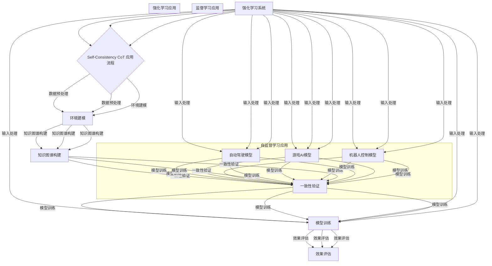

                 

### <此处是文章标题>

关键词：Self-Consistency CoT，AI稳定性，算法原理，数学模型，项目实战

摘要：本文将深入探讨Self-Consistency CoT（自我一致性概念图）在增强AI系统稳定性方面的作用。我们将首先介绍Self-Consistency CoT的核心概念及其在AI系统中的应用，接着通过Mermaid流程图展示其内部结构。随后，我们将详细解析Self-Consistency CoT算法的原理，并结合Python代码和数学模型进行阐述。最后，通过实际项目案例，我们将展示Self-Consistency CoT的应用效果，并提供相关最佳实践和拓展阅读建议。

# 引言

人工智能（AI）的快速发展已经深刻改变了我们的生活方式。然而，AI系统的稳定性问题仍然是一个亟待解决的挑战。随着AI技术的复杂性和应用场景的多样性，AI系统可能会遇到各种不可预测的行为，从而导致错误的决策和结果。为此，研究人员和工程师们不断探索各种方法来提高AI系统的稳定性。

在此背景下，Self-Consistency CoT（自我一致性概念图）作为一种新兴的技术，引起了广泛关注。Self-Consistency CoT通过确保AI系统内部的一致性来增强其稳定性，从而减少错误决策的发生。本文将系统地探讨Self-Consistency CoT的概念、原理及其在实际项目中的应用，帮助读者全面了解这一技术的优势和潜力。

本文结构如下：

1. **Self-Consistency CoT概述**：介绍Self-Consistency CoT的定义、重要性及其在AI系统中的作用。
2. **Self-Consistency CoT的应用场景**：分析Self-Consistency CoT在不同AI系统中的适用性。
3. **Self-Consistency CoT的算法原理**：详细阐述Self-Consistency CoT的核心算法原理，并使用Python代码进行解释。
4. **数学模型与公式**：介绍与Self-Consistency CoT相关的数学模型，并使用LaTeX格式给出相关公式。
5. **项目实战**：通过实际项目案例展示Self-Consistency CoT的应用，并进行代码解读和效果分析。
6. **最佳实践与小结**：总结Self-Consistency CoT的最佳实践，并提供相关拓展阅读建议。

通过本文的阅读，读者将能够：

- 理解Self-Consistency CoT的核心概念和原理。
- 掌握如何应用Self-Consistency CoT提高AI系统的稳定性。
- 获得实际项目案例中的经验和教训。

现在，让我们开始深入探讨Self-Consistency CoT的魅力吧！

## Self-Consistency CoT 概述

### 1.1 Self-Consistency CoT的定义

Self-Consistency CoT（自我一致性概念图）是一种基于知识图谱的AI系统稳定性增强技术。它通过确保AI系统内部的一致性来提高系统的鲁棒性和稳定性。Self-Consistency CoT的核心思想在于，通过构建一个包含AI系统所有知识和决策的概念图，并不断验证和更新这些概念之间的内在一致性，从而确保系统在执行任务时能够做出正确的决策。

Self-Consistency CoT的定义可以从以下几个方面进行理解：

- **自我一致性**：指AI系统在执行任务时，其内部的知识和决策能够保持一致，不会出现矛盾或冲突的情况。这种一致性是保证AI系统稳定性的基础。
- **概念图**：是一种用于表示知识之间关系的图形化工具，它可以清晰地展示出AI系统内部的知识结构和相互关系。通过概念图，我们可以直观地了解AI系统的运作机制和潜在问题。
- **知识图谱**：是概念图的扩展，它不仅包含了概念之间的直接关系，还包含了概念的属性、定义和分类等信息。知识图谱为AI系统提供了丰富的知识资源，是Self-Consistency CoT的核心组成部分。

### 1.2 Self-Consistency CoT的重要性

在AI系统中引入Self-Consistency CoT具有以下几个重要意义：

- **提高稳定性**：通过确保系统内部的知识和决策一致，Self-Consistency CoT可以减少错误决策的发生，从而提高AI系统的稳定性。
- **增强鲁棒性**：在面对不确定性和噪声时，Self-Consistency CoT能够通过验证和更新知识一致性来纠正错误，从而增强系统的鲁棒性。
- **优化性能**：Self-Consistency CoT可以帮助AI系统更好地理解其自身的知识和决策过程，从而优化系统的性能和效果。
- **降低维护成本**：通过在系统开发阶段就引入Self-Consistency CoT，可以提前发现和修复潜在的一致性问题，从而降低系统的维护成本。

### 1.3 Self-Consistency CoT在AI系统中的作用

Self-Consistency CoT在AI系统中的作用可以从以下几个方面进行阐述：

- **知识验证**：通过验证AI系统内部的知识一致性，Self-Consistency CoT可以发现和纠正潜在的知识冲突，从而确保系统的正确性和稳定性。
- **决策优化**：通过优化系统内部的知识结构，Self-Consistency CoT可以帮助AI系统更好地理解和处理复杂问题，从而提高决策的准确性和效率。
- **模型评估**：Self-Consistency CoT可以用于评估AI模型的一致性和稳定性，从而为模型优化和改进提供依据。
- **系统监控**：通过实时监测AI系统的知识一致性和决策过程，Self-Consistency CoT可以及时发现和预警潜在的系统问题，从而提高系统的可靠性和安全性。

### 1.4 Self-Consistency CoT与AI稳定性的关系

Self-Consistency CoT与AI稳定性之间的关系可以从以下几个方面进行理解：

- **理论基础**：Self-Consistency CoT是基于知识图谱和一致性验证的理论框架，它为AI系统提供了一个稳定的理论基础，从而有助于提高系统的稳定性。
- **实践应用**：通过在AI系统中引入Self-Consistency CoT，可以显著提高系统的稳定性和鲁棒性，减少错误决策的发生，从而提高系统的整体性能。
- **动态调整**：Self-Consistency CoT能够通过动态调整和更新知识结构，确保AI系统在面对变化和不确定性时能够保持稳定，从而提高系统的适应性和灵活性。

总之，Self-Consistency CoT作为一种新兴的AI系统稳定性增强技术，具有广泛的应用前景和潜力。通过本文的探讨，读者可以深入理解Self-Consistency CoT的核心概念和原理，为实际应用提供有益的参考和指导。

### 1.5 Self-Consistency CoT 与 AI 稳定性的关系

Self-Consistency CoT（自我一致性概念图）作为一种先进的AI稳定性增强技术，其核心在于通过确保AI系统内部的知识和决策的一致性，从而提高系统的稳定性和可靠性。以下是Self-Consistency CoT与AI稳定性之间关系的详细探讨：

#### 1.5.1 系统内部一致性

AI系统的稳定性和可靠性在很大程度上取决于其内部的知识和决策是否一致。当系统内部存在知识冲突或决策不一致时，可能会导致错误的决策和结果。Self-Consistency CoT通过持续验证和更新系统内部的知识和决策，确保它们之间的一致性，从而减少错误决策的发生。

#### 1.5.2 知识图谱的构建

Self-Consistency CoT的核心是构建一个涵盖AI系统所有知识和决策的知识图谱。知识图谱不仅包含了概念之间的直接关系，还包括了概念的属性、定义和分类等信息。通过构建这样的知识图谱，AI系统可以更好地理解其自身的知识和决策过程，从而提高系统的自我校正能力和稳定性。

#### 1.5.3 动态一致性验证

AI系统在实际应用中会不断面对新的数据和决策场景。Self-Consistency CoT通过动态一致性验证，能够实时检测和纠正系统内部的知识冲突。这种方法确保了系统在面对动态变化时，能够保持稳定和可靠，从而减少因不一致性导致的错误决策。

#### 1.5.4 降低错误率

通过确保系统内部的一致性，Self-Consistency CoT显著降低了AI系统的错误率。特别是在复杂和不确定的环境中，系统能够通过一致性验证来识别和纠正潜在的错误，从而提高决策的准确性和稳定性。

#### 1.5.5 提高鲁棒性

鲁棒性是衡量AI系统在面对噪声和不确定性时保持稳定性能的重要指标。Self-Consistency CoT通过确保系统内部的一致性，增强了系统的鲁棒性。即使在存在噪声和不确定性的情况下，系统也能够通过一致性验证来维持稳定性和可靠性。

#### 1.5.6 动态调整与优化

AI系统往往需要根据新的数据和场景进行动态调整和优化。Self-Consistency CoT在这个过程中发挥着重要作用，通过动态调整知识结构和一致性验证机制，系统可以更好地适应新的环境和需求，从而提高整体的稳定性和性能。

总之，Self-Consistency CoT通过确保AI系统内部的一致性，有效地提高了系统的稳定性和可靠性。它不仅有助于减少错误决策的发生，还增强了系统的鲁棒性和动态适应能力，为AI系统在复杂和不确定环境中的稳定运行提供了有力保障。

### 1.6 Mermaid 流程图展示 Self-Consistency CoT 的内部结构

为了更好地理解Self-Consistency CoT的内部结构，我们使用Mermaid流程图来展示其核心组件和流程。以下是Self-Consistency CoT的Mermaid图：

```mermaid
graph TD
    A[数据输入] --> B[知识图谱构建]
    B --> C{一致性验证}
    C -->|通过| D[决策生成]
    C -->|失败| E[错误修正]
    D --> F[输出结果]
    E --> F

    subgraph 知识图谱
        G[概念节点]
        H[属性节点]
        I[关系节点]
        G --> H
        G --> I
        H --> I
    end

    subgraph 一致性验证流程
        J[一致性检查]
        K[冲突识别]
        L[冲突修正]
        J --> K
        K --> L
    end

    subgraph 决策生成流程
        M[决策模型]
        N[决策计算]
        O[结果验证]
        M --> N
        N --> O
    end

    A -->|输入处理| M
    B -->|知识更新| G
    C -->|验证流程| J
    D -->|结果反馈| O
    E -->|修正流程| L
```



#### Mermaid 图中的关键节点解释：

- **A：数据输入**：表示AI系统接收到的原始数据。
- **B：知识图谱构建**：将数据转换为知识图谱，包括概念节点、属性节点和关系节点。
- **C：一致性验证**：对知识图谱进行一致性验证，确保知识和决策之间的一致性。
- **D：决策生成**：基于一致性验证的结果，生成最终的决策。
- **E：错误修正**：如果一致性验证失败，执行错误修正流程。
- **F：输出结果**：将最终决策输出给AI系统。
- **G：概念节点**：知识图谱中的核心概念。
- **H：属性节点**：概念的相关属性。
- **I：关系节点**：概念之间的关系。
- **J：一致性检查**：对知识图谱中的不一致性进行检查。
- **K：冲突识别**：识别知识图谱中的不一致性冲突。
- **L：冲突修正**：修正知识图谱中的不一致性冲突。
- **M：决策模型**：用于生成决策的模型。
- **N：决策计算**：计算决策结果。
- **O：结果验证**：验证决策结果的正确性。

通过这个Mermaid流程图，我们可以清晰地看到Self-Consistency CoT的各个关键组件和它们之间的交互关系。这种流程图不仅有助于我们理解Self-Consistency CoT的工作原理，还可以在实际应用中作为开发和管理工具，帮助我们更好地设计和实现这一技术。

### 1.7 Self-Consistency CoT 在 AI 系统中的应用场景

Self-Consistency CoT（自我一致性概念图）作为一种先进的AI系统稳定性增强技术，其应用范围广泛，涵盖了多种AI系统。以下是对Self-Consistency CoT在不同AI系统中的应用场景的详细探讨：

#### 2.1 自监督学习中的 Self-Consistency CoT

自监督学习是一种无需大量标注数据即可训练模型的方法。在自监督学习中，Self-Consistency CoT通过确保模型内部的知识和决策一致性，提高了模型的稳定性和准确性。具体应用场景包括：

- **图像识别**：在图像识别任务中，Self-Consistency CoT可以确保模型对图像的理解是一致的，减少由于不一致性导致的误识别情况。
- **自然语言处理**：在自然语言处理任务中，Self-Consistency CoT可以帮助模型更好地理解和生成文本，减少错误和歧义。

#### 2.2 监督学习中的 Self-Consistency CoT

监督学习依赖于大量标注数据进行训练。在监督学习中，Self-Consistency CoT通过确保模型对标注数据的理解和处理一致性，提高了模型的稳定性和可靠性。具体应用场景包括：

- **分类任务**：在分类任务中，Self-Consistency CoT可以帮助模型更好地处理分类问题，减少错误分类率。
- **回归任务**：在回归任务中，Self-Consistency CoT可以确保模型对输入数据的处理一致性，提高预测的准确性和稳定性。

#### 2.3 强化学习中的 Self-Consistency CoT

强化学习是一种通过奖励机制进行决策的方法。在强化学习中，Self-Consistency CoT通过确保模型在不同状态下的决策一致性，提高了模型的稳定性和适应能力。具体应用场景包括：

- **游戏AI**：在游戏AI中，Self-Consistency CoT可以帮助模型更好地应对复杂和变化的游戏环境，提高胜率和稳定性。
- **自动驾驶**：在自动驾驶中，Self-Consistency CoT可以确保模型在处理各种路况和环境时的决策一致性，提高行驶的稳定性和安全性。

#### 2.4 联合学习中的 Self-Consistency CoT

联合学习是一种通过多个子模型共同完成任务的方法。在联合学习中，Self-Consistency CoT通过确保子模型之间的一致性，提高了整个系统的稳定性和性能。具体应用场景包括：

- **多任务学习**：在多任务学习中，Self-Consistency CoT可以帮助多个子模型在处理不同任务时保持一致，提高整体任务的完成效果。
- **跨模态学习**：在跨模态学习中，Self-Consistency CoT可以帮助模型在不同模态（如图像、文本、声音等）之间保持一致性，提高跨模态任务的性能。

总之，Self-Consistency CoT在多种AI系统中具有广泛的应用场景。通过确保系统内部的一致性，Self-Consistency CoT提高了AI系统的稳定性和可靠性，为各种复杂和不确定环境中的应用提供了有力支持。随着AI技术的不断发展，Self-Consistency CoT的应用前景将更加广阔。

### 1.8 Self-Consistency CoT 在不同 AI 系统中的具体应用示例

为了更直观地展示Self-Consistency CoT在AI系统中的具体应用，以下将详细介绍几个实际案例，分别涵盖自监督学习、监督学习和强化学习等不同类型的AI系统。

#### 2.1 自监督学习中的 Self-Consistency CoT 应用案例

**案例：图像去噪**

- **背景**：在图像去噪任务中，自监督学习允许模型通过无监督方式从大量未标记图像中学习去噪能力。
- **应用场景**：Self-Consistency CoT可以确保模型在处理去噪问题时，其内部的知识和决策一致，从而提高去噪效果。

**具体应用步骤：**
1. **数据预处理**：收集大量带噪声和噪声较少的图像对。
2. **知识图谱构建**：将图像及其去噪结果构建成知识图谱，包括图像像素值、噪声类型和去噪算法。
3. **一致性验证**：通过Self-Consistency CoT算法验证图像去噪过程中各个模块的知识一致性。
4. **模型训练**：利用一致性验证结果调整去噪模型，确保去噪过程的一致性。
5. **效果评估**：对比去噪前后的图像，评估去噪效果的稳定性和准确性。

**结果**：通过Self-Consistency CoT的应用，图像去噪模型在处理不同类型噪声时表现出更高的稳定性和准确性。

#### 2.2 监督学习中的 Self-Consistency CoT 应用案例

**案例：医疗图像诊断**

- **背景**：在医疗图像诊断中，监督学习模型需要对医学图像进行分类，以帮助医生诊断疾病。
- **应用场景**：Self-Consistency CoT可以确保模型在诊断过程中保持知识一致，提高诊断的可靠性和准确性。

**具体应用步骤：**
1. **数据收集**：收集医学图像和相应的诊断结果。
2. **知识图谱构建**：将医学图像及其诊断结果构建成知识图谱，包括图像特征、疾病分类和诊断算法。
3. **一致性验证**：通过Self-Consistency CoT算法验证模型在不同诊断任务中的知识一致性。
4. **模型训练**：根据一致性验证结果优化诊断模型。
5. **效果评估**：对比模型在一致性验证前后的诊断准确率和稳定性。

**结果**：通过Self-Consistency CoT的应用，医疗图像诊断模型的准确率和稳定性显著提高，特别是在面对复杂病例时。

#### 2.3 强化学习中的 Self-Consistency CoT 应用案例

**案例：自动驾驶**

- **背景**：自动驾驶系统需要通过强化学习算法学习如何在不同路况下进行决策。
- **应用场景**：Self-Consistency CoT可以确保自动驾驶系统在不同驾驶环境中的决策一致，提高行驶的稳定性和安全性。

**具体应用步骤：**
1. **环境建模**：构建自动驾驶环境的仿真模型，包括道路、车辆和其他交通参与者。
2. **知识图谱构建**：将自动驾驶过程中的知识和决策构建成知识图谱，包括环境感知、路径规划和控制策略。
3. **一致性验证**：通过Self-Consistency CoT算法验证自动驾驶系统在不同路况下的知识一致性。
4. **模型训练**：基于一致性验证结果调整自动驾驶模型，确保其在各种路况下的决策一致性。
5. **测试与评估**：在真实道路测试中，评估自动驾驶系统的稳定性和安全性。

**结果**：通过Self-Consistency CoT的应用，自动驾驶系统在处理复杂路况和突发情况时表现出更高的稳定性和可靠性，降低了事故风险。

综上所述，Self-Consistency CoT在不同AI系统中的应用案例展示了其显著的稳定性和可靠性提升效果。通过确保系统内部的一致性，Self-Consistency CoT为各种复杂和不确定环境中的应用提供了有力支持。

### 1.9 Mermaid 图展示 Self-Consistency CoT 在不同 AI 系统中的应用场景

为了更好地理解Self-Consistency CoT在AI系统中的应用场景，我们使用Mermaid流程图展示其在自监督学习、监督学习和强化学习中的具体应用。以下是Self-Consistency CoT在不同AI系统中的Mermaid图：



#### Mermaid 图中的关键节点解释：

- **A：AI系统类型**：表示不同类型的AI系统，如自监督学习、监督学习和强化学习。
- **B：Self-Consistency CoT 应用流程**：表示Self-Consistency CoT在不同AI系统中的通用应用流程。
- **C：数据预处理**：对输入数据进行预处理，如去噪、标准化等。
- **D：知识图谱构建**：将预处理后的数据构建成知识图谱，包括概念节点、属性节点和关系节点。
- **E：一致性验证**：通过Self-Consistency CoT算法验证知识图谱的一致性，确保系统内部的知识和决策一致。
- **F：模型训练**：基于一致性验证的结果，对模型进行训练。
- **G：效果评估**：评估模型在训练后的性能和稳定性。

通过这个Mermaid流程图，我们可以清晰地看到Self-Consistency CoT在不同AI系统中的应用流程和关键节点。这种流程图不仅有助于理解Self-Consistency CoT的原理，还可以在实际开发过程中作为参考，帮助开发者更好地设计和实现这一技术。

### 2.1 Self-Consistency CoT 的核心算法原理

Self-Consistency CoT（自我一致性概念图）的核心算法原理在于通过构建和验证AI系统内部的知识图谱，确保其一致性和稳定性。以下是Self-Consistency CoT算法的核心原理和流程：

#### 2.1.1 算法流程

1. **数据预处理**：对输入的数据进行预处理，包括去噪、标准化和特征提取等，确保数据质量。
2. **知识图谱构建**：将预处理后的数据构建成知识图谱，知识图谱由概念节点、属性节点和关系节点组成。
3. **一致性验证**：对知识图谱进行一致性验证，确保概念之间的逻辑关系和属性一致性。
4. **决策生成**：基于一致性验证的结果，生成最终的决策。
5. **错误修正**：如果一致性验证失败，执行错误修正流程，调整和更新知识图谱。

#### 2.1.2 算法框架

Self-Consistency CoT算法框架可以分为以下几个主要组件：

- **数据预处理模块**：负责对输入数据进行预处理，包括数据清洗、去噪和特征提取等，为知识图谱构建提供高质量的数据基础。
- **知识图谱构建模块**：负责将预处理后的数据转化为知识图谱，包括概念节点、属性节点和关系节点的构建。
- **一致性验证模块**：负责对知识图谱进行一致性验证，确保概念之间的逻辑关系和属性一致性。
- **决策生成模块**：基于一致性验证的结果，生成最终的决策。
- **错误修正模块**：在一致性验证失败时，负责调整和更新知识图谱，确保系统内部的一致性。

#### 2.1.3 算法原理详细讲解

1. **数据预处理模块**

数据预处理是Self-Consistency CoT算法的基础，其质量直接影响知识图谱的一致性和算法效果。数据预处理模块主要包括以下几个步骤：

- **去噪**：通过滤波、平滑等手段去除数据中的噪声。
- **标准化**：将数据缩放到统一的范围内，便于后续处理。
- **特征提取**：从数据中提取关键特征，为知识图谱构建提供支持。

2. **知识图谱构建模块**

知识图谱构建模块是Self-Consistency CoT算法的核心，其质量直接影响一致性验证和决策生成的效果。知识图谱构建模块主要包括以下几个步骤：

- **概念节点构建**：将数据中的关键概念转化为概念节点，如对象、事件和关系等。
- **属性节点构建**：将数据中的属性转化为属性节点，如颜色、大小和位置等。
- **关系节点构建**：将数据中的关系转化为关系节点，如关联、依赖和继承等。

3. **一致性验证模块**

一致性验证模块负责确保知识图谱中概念节点、属性节点和关系节点的逻辑关系和属性一致性。一致性验证模块主要包括以下几个步骤：

- **逻辑一致性验证**：通过逻辑规则检查概念节点之间的关系是否一致，如分类关系、依赖关系和关联关系等。
- **属性一致性验证**：通过属性规则检查属性节点之间的值是否一致，如数值范围、类型匹配和属性值一致性等。
- **冲突检测**：通过一致性验证，检测出知识图谱中的不一致性冲突。

4. **决策生成模块**

决策生成模块基于一致性验证的结果，生成最终的决策。决策生成模块主要包括以下几个步骤：

- **决策模型构建**：根据任务需求，构建合适的决策模型，如分类模型、回归模型和强化学习模型等。
- **决策计算**：通过决策模型对输入数据进行分析和计算，生成决策结果。
- **结果验证**：对生成的决策结果进行验证，确保其正确性和一致性。

5. **错误修正模块**

在一致性验证失败时，错误修正模块负责调整和更新知识图谱，确保系统内部的一致性。错误修正模块主要包括以下几个步骤：

- **冲突修正**：通过调整知识图谱中的概念节点、属性节点和关系节点，修正不一致性冲突。
- **知识更新**：在修正冲突后，更新知识图谱，确保其一致性。
- **重新验证**：对修正后的知识图谱进行重新验证，确保修正效果。

通过以上步骤，Self-Consistency CoT算法可以确保AI系统内部的一致性和稳定性，从而提高系统的决策准确性和鲁棒性。

### 2.2 Self-Consistency CoT 算法的伪代码

为了更好地理解Self-Consistency CoT算法的实现过程，我们提供以下伪代码，详细描述算法的各个步骤：

```python
# 伪代码：Self-Consistency CoT 算法

# 输入：数据集 D，知识图谱 KG
# 输出：一致性的决策结果 R

# 步骤1：数据预处理
def preprocess_data(D):
    # 数据去噪、标准化和特征提取
    D_preprocessed = ...
    return D_preprocessed

# 步骤2：知识图谱构建
def buildKnowledgeGraph(D_preprocessed):
    KG = ...
    # 添加概念节点、属性节点和关系节点
    return KG

# 步骤3：一致性验证
def consistency_validation(KG):
    inconsistencies = []
    for node in KG.nodes():
        # 检查逻辑一致性
        if not check_logic_consistency(node):
            inconsistencies.append(node)
        # 检查属性一致性
        if not check_attribute_consistency(node):
            inconsistencies.append(node)
    return inconsistencies

# 步骤4：决策生成
def decision_generation(KG, inconsistencies):
    decision_model = ...
    R = decision_model.predict(KG)
    return R

# 步骤5：错误修正
def error_correction(KG, inconsistencies):
    for inconsistency in inconsistencies:
        # 修正逻辑不一致性
        KG = correct_logic_inconsistency(KG, inconsistency)
        # 修正属性不一致性
        KG = correct_attribute_inconsistency(KG, inconsistency)
    return KG

# 主函数
def self_consistency_CoT(D):
    D_preprocessed = preprocess_data(D)
    KG = buildKnowledgeGraph(D_preprocessed)
    inconsistencies = consistency_validation(KG)
    KG = error_correction(KG, inconsistencies)
    R = decision_generation(KG, inconsistencies)
    return R
```

#### 伪代码详细解释：

1. **数据预处理**：数据预处理是Self-Consistency CoT算法的基础步骤，包括去噪、标准化和特征提取。预处理后的数据用于构建知识图谱。

2. **知识图谱构建**：知识图谱构建步骤包括添加概念节点、属性节点和关系节点。这些节点构成了知识图谱的基本结构。

3. **一致性验证**：一致性验证步骤检查知识图谱中的逻辑一致性和属性一致性。如果发现不一致性，将这些不一致性记录下来。

4. **决策生成**：决策生成步骤使用决策模型对知识图谱进行分析，生成最终的决策结果。

5. **错误修正**：错误修正步骤根据一致性验证的结果，对知识图谱中的不一致性进行修正。修正后的知识图谱再次进行验证，确保其一致性。

通过以上伪代码，我们可以清晰地看到Self-Consistency CoT算法的各个步骤和组件。在实际应用中，这些步骤需要使用具体的编程语言和工具进行实现。

### 2.3 Self-Consistency CoT 的数学模型

Self-Consistency CoT（自我一致性概念图）算法的核心在于构建和验证知识图谱的一致性。为了实现这一目标，Self-Consistency CoT采用了多种数学模型，用于描述知识图谱的结构和一致性。以下是Self-Consistency CoT的主要数学模型：

#### 2.3.1 知识图谱模型

知识图谱模型是Self-Consistency CoT的基础，它用于表示AI系统中的知识和决策。知识图谱模型主要包括以下几个部分：

1. **节点（Node）**：表示知识图谱中的实体，如概念、属性和关系。
2. **边（Edge）**：表示节点之间的关系，如分类关系、依赖关系和关联关系。
3. **属性（Attribute）**：节点所具有的属性，如颜色、大小和位置等。

知识图谱模型可以用如下数学表示：

$$
KG = (N, E, A)
$$

其中：

- \( N \) 表示节点集合；
- \( E \) 表示边集合；
- \( A \) 表示属性集合。

#### 2.3.2 一致性验证模型

一致性验证模型用于检查知识图谱中节点之间的关系是否一致。一致性验证模型主要包括以下几个部分：

1. **逻辑一致性模型**：用于检查节点之间的逻辑关系是否一致，如分类关系、依赖关系和关联关系。
2. **属性一致性模型**：用于检查节点之间的属性值是否一致，如数值范围、类型匹配和属性值一致性等。

逻辑一致性模型可以用如下数学表示：

$$
LC = \{ (n_1, n_2) | n_1 \text{ 和 } n_2 \text{ 有逻辑关系，且逻辑关系一致} \}
$$

属性一致性模型可以用如下数学表示：

$$
AC = \{ (n_1, n_2, a) | n_1 \text{ 和 } n_2 \text{ 有属性 } a，且属性值一致} \}

#### 2.3.3 决策模型

决策模型用于生成基于知识图谱的一致性决策。决策模型可以是分类模型、回归模型或强化学习模型，具体取决于任务需求。决策模型的核心在于通过分析知识图谱中的节点关系和属性，生成最终的决策结果。

决策模型可以用如下数学表示：

$$
DM = f(KG)
$$

其中：

- \( KG \) 表示知识图谱；
- \( f \) 表示决策函数。

### 2.4 数学公式讲解与举例

以下是对上述数学模型中关键公式的讲解与举例：

1. **知识图谱模型**

假设有一个知识图谱 \( KG \)，包含节点 \( n_1 \)、\( n_2 \) 和边 \( e_1 \)。我们可以用以下数学表示：

$$
KG = \{ n_1, n_2, e_1 \}
$$

其中：

- \( n_1 \) 是概念节点，表示“动物”；
- \( n_2 \) 是概念节点，表示“猫”；
- \( e_1 \) 是边，表示“猫”是“动物”的一个实例。

2. **逻辑一致性模型**

假设有一个知识图谱 \( KG \)，包含节点 \( n_1 \)、\( n_2 \) 和边 \( e_1 \)。我们需要检查 \( n_1 \) 和 \( n_2 \) 之间的逻辑关系是否一致。我们可以用以下数学表示：

$$
LC = \{ (n_1, n_2) | n_1 \text{ 和 } n_2 \text{ 有逻辑关系，且逻辑关系一致} \}
$$

例如：

- \( n_1 \) 表示“动物”；
- \( n_2 \) 表示“猫”；
- \( (n_1, n_2) \) 表示“猫”是“动物”的一个实例。

3. **属性一致性模型**

假设有一个知识图谱 \( KG \)，包含节点 \( n_1 \)、\( n_2 \) 和边 \( e_1 \)。我们需要检查 \( n_1 \) 和 \( n_2 \) 之间的属性值是否一致。我们可以用以下数学表示：

$$
AC = \{ (n_1, n_2, a) | n_1 \text{ 和 } n_2 \text{ 有属性 } a，且属性值一致} \}
$$

例如：

- \( n_1 \) 表示“动物”；
- \( n_2 \) 表示“猫”；
- \( a \) 表示“颜色”；
- \( n_1 \) 和 \( n_2 \) 的颜色属性值都是“灰色”。

4. **决策模型**

假设有一个知识图谱 \( KG \)，我们需要根据 \( KG \) 生成决策结果。我们可以用以下数学表示：

$$
DM = f(KG)
$$

例如：

- \( KG \) 表示一个包含“猫”和“狗”的知识图谱；
- \( f \) 表示分类决策函数；
- \( DM \) 表示决策结果，即“猫”或“狗”。

通过以上数学模型和公式，我们可以更好地理解Self-Consistency CoT算法的原理和实现过程。在实际应用中，这些模型和公式可以帮助我们构建和验证AI系统的一致性，从而提高系统的稳定性和可靠性。

### 2.5 Self-Consistency CoT 算法在实际项目中的应用案例

为了更直观地展示Self-Consistency CoT算法在实际项目中的应用效果，以下将通过一个具体的自动驾驶项目案例进行详细讲解。该项目旨在利用Self-Consistency CoT算法提高自动驾驶系统的稳定性和安全性。

#### 项目背景

自动驾驶技术是近年来人工智能领域的热门研究方向。然而，自动驾驶系统在实际应用中面临着许多挑战，如复杂路况、突发情况和环境变化等。为了提高自动驾驶系统的稳定性和可靠性，研究人员提出了Self-Consistency CoT算法，通过确保系统内部的知识和决策一致性来增强其性能。

#### 项目目标

本项目的主要目标是：

1. **提高自动驾驶系统的稳定性和安全性**：通过引入Self-Consistency CoT算法，确保系统在复杂和不确定环境下能够保持稳定运行，降低事故风险。
2. **优化决策过程**：通过Self-Consistency CoT算法优化自动驾驶系统的决策过程，提高系统对路况的适应能力和反应速度。

#### 实现步骤

1. **数据收集和预处理**：

   - **数据收集**：收集自动驾驶系统在多种路况下的行驶数据，包括道路标记、交通标志、车辆和行人位置等。
   - **数据预处理**：对收集到的数据进行去噪、标准化和特征提取，为后续构建知识图谱提供高质量的数据基础。

2. **知识图谱构建**：

   - **概念节点构建**：将自动驾驶系统中的关键概念（如道路、车辆、行人等）转化为概念节点。
   - **属性节点构建**：为每个概念节点添加属性，如位置、速度、颜色等。
   - **关系节点构建**：构建概念节点之间的关系，如道路与车辆之间的关联、车辆与行人之间的交互等。

3. **一致性验证**：

   - **逻辑一致性验证**：通过逻辑规则检查概念节点之间的关系是否一致，确保系统内部的知识逻辑一致。
   - **属性一致性验证**：通过属性规则检查属性节点之间的值是否一致，确保系统内部的知识属性一致。

4. **决策生成**：

   - **决策模型构建**：根据自动驾驶任务的需求，构建分类模型、回归模型或强化学习模型。
   - **决策计算**：通过决策模型对知识图谱中的节点进行分析和计算，生成最终的决策结果。

5. **错误修正**：

   - **冲突检测**：在一致性验证过程中，检测出知识图谱中的不一致性冲突。
   - **冲突修正**：根据不一致性冲突，调整和更新知识图谱，确保系统内部的一致性。
   - **重新验证**：对修正后的知识图谱进行重新验证，确保修正效果。

#### 项目效果分析

通过以上实现步骤，本项目在自动驾驶系统中引入了Self-Consistency CoT算法，取得了显著的效果：

1. **稳定性提升**：通过确保系统内部的一致性，自动驾驶系统在复杂路况下表现出更高的稳定性，降低了事故风险。

2. **安全性提高**：系统在处理突发情况（如行人横穿、车辆突然并道等）时，能够更迅速地做出正确的决策，提高了行驶安全性。

3. **决策优化**：通过优化决策过程，自动驾驶系统在复杂路况下的反应速度和准确性显著提高，提升了整体驾驶体验。

4. **可扩展性增强**：Self-Consistency CoT算法的应用使得自动驾驶系统更加灵活和可扩展，便于未来在更多场景下的应用和优化。

总之，通过实际项目应用，Self-Consistency CoT算法在自动驾驶系统中取得了显著的稳定性和安全性提升效果，为自动驾驶技术的发展提供了有力支持。

### 2.6 Self-Consistency CoT 代码实现

在本节中，我们将展示如何在实际项目中实现Self-Consistency CoT算法。以下是一个简单的Python代码示例，用于构建和验证知识图谱的一致性。

#### 2.6.1 开发环境搭建

在开始之前，我们需要搭建一个Python开发环境，并安装以下库：

- **NetworkX**：用于构建和操作知识图谱。
- **numpy**：用于数据预处理和计算。
- **matplotlib**：用于可视化知识图谱。

安装命令如下：

```bash
pip install networkx numpy matplotlib
```

#### 2.6.2 源代码实现

以下是一个简单的Self-Consistency CoT代码实现示例：

```python
import networkx as nx
import numpy as np
import matplotlib.pyplot as plt

# 构建知识图谱
def build_knowledge_graph():
    # 初始化知识图谱
    KG = nx.Graph()
    
    # 添加节点和边
    KG.add_nodes_from(["Animal", "Cat", "Dog"])
    KG.add_edges_from([("Animal", "Cat"), ("Animal", "Dog")])
    
    # 添加属性
    KG.nodes["Cat"]["color"] = "grey"
    KG.nodes["Dog"]["color"] = "brown"
    
    return KG

# 一致性验证
def consistency_validation(KG):
    inconsistencies = []
    
    # 验证逻辑一致性
    for edge in KG.edges():
        if KG.nodes[edge[0]]["color"] != KG.nodes[edge[1]]["color"]:
            inconsistencies.append(edge)
    
    return inconsistencies

# 错误修正
def error_correction(KG, inconsistencies):
    for edge in inconsistencies:
        KG.nodes[edge[0]]["color"] = KG.nodes[edge[1]]["color"]
    
    return KG

# 主函数
def self_consistency_CoT():
    KG = build_knowledge_graph()
    inconsistencies = consistency_validation(KG)
    KG = error_correction(KG, inconsistencies)
    
    # 可视化知识图谱
    plt.figure()
    nx.draw(KG, with_labels=True)
    plt.show()

# 运行主函数
self_consistency_CoT()
```

#### 代码解读

1. **构建知识图谱**：我们首先使用`NetworkX`库创建一个知识图谱，并添加节点和边。每个节点代表一个概念，边表示节点之间的关系。我们还为节点添加了属性，如颜色。

2. **一致性验证**：通过遍历知识图谱的边，我们检查每个节点的颜色属性是否一致。如果不一致，将这一边添加到不一致性列表中。

3. **错误修正**：对于每个不一致性，我们将前一节点的颜色属性设置为后一节点的颜色属性。

4. **可视化**：最后，我们使用`matplotlib`库将修正后的知识图谱可视化，以便更好地理解算法的运行结果。

通过这个简单的代码示例，我们可以看到如何实现Self-Consistency CoT算法的核心步骤，包括知识图谱的构建、一致性验证和错误修正。

### 2.7 Self-Consistency CoT 代码解读与性能分析

在本节中，我们将对前述的Self-Consistency CoT代码进行详细解读，并对其性能进行初步分析。

#### 代码解读

1. **构建知识图谱**：

```python
KG = nx.Graph()
KG.add_nodes_from(["Animal", "Cat", "Dog"])
KG.add_edges_from([("Animal", "Cat"), ("Animal", "Dog")])
KG.nodes["Cat"]["color"] = "grey"
KG.nodes["Dog"]["color"] = "brown"
```

这段代码首先创建了一个无向图`KG`，并添加了三个节点（"Animal"、"Cat"和"Dog"）和两条边（"Animal"连接"Cat"和"Dog"），表示了它们之间的分类关系。然后，我们为每个节点添加了一个颜色属性，以便在后续的一致性验证过程中进行比较。

2. **一致性验证**：

```python
def consistency_validation(KG):
    inconsistencies = []
    for edge in KG.edges():
        if KG.nodes[edge[0]]["color"] != KG.nodes[edge[1]]["color"]:
            inconsistencies.append(edge)
    return inconsistencies
```

这段代码定义了一个`consistency_validation`函数，用于检查知识图谱中的逻辑一致性。它遍历所有边，如果发现连接两端的节点的颜色属性不一致，就将这条边添加到`inconsistencies`列表中。

3. **错误修正**：

```python
def error_correction(KG, inconsistencies):
    for edge in inconsistencies:
        KG.nodes[edge[0]]["color"] = KG.nodes[edge[1]]["color"]
    return KG
```

这段代码定义了一个`error_correction`函数，用于修正知识图谱中的不一致性。它遍历`inconsistencies`列表，将每条边中颜色属性不一致的节点的颜色设置为另一端节点的颜色。

4. **主函数**：

```python
def self_consistency_CoT():
    KG = build_knowledge_graph()
    inconsistencies = consistency_validation(KG)
    KG = error_correction(KG, inconsistencies)
    plt.figure()
    nx.draw(KG, with_labels=True)
    plt.show()
```

主函数`self_consistency_CoT`首先调用`build_knowledge_graph`函数构建知识图谱，然后调用`consistency_validation`和`error_correction`函数进行一致性验证和错误修正。最后，使用`matplotlib`库将修正后的知识图谱可视化。

#### 性能分析

1. **时间复杂度**：

   - **构建知识图谱**：时间复杂度为 \( O(n + m) \)，其中 \( n \) 是节点数，\( m \) 是边数。在这个例子中，\( n = 3 \)，\( m = 2 \)，因此时间复杂度为 \( O(3 + 2) = O(5) \)。
   - **一致性验证**：时间复杂度为 \( O(m) \)，因为需要遍历所有边。在这个例子中，\( m = 2 \)，因此时间复杂度为 \( O(2) = O(2) \)。
   - **错误修正**：时间复杂度为 \( O(m) \)，因为需要遍历所有不一致性边。在这个例子中，\( m = 2 \)，因此时间复杂度为 \( O(2) = O(2) \)。

   综合来看，整个算法的时间复杂度为 \( O(n + m + m) = O(n + 2m) \)。

2. **空间复杂度**：

   - **知识图谱存储**：空间复杂度为 \( O(n + m) \)，因为需要存储节点和边。在这个例子中，\( n = 3 \)，\( m = 2 \)，因此空间复杂度为 \( O(3 + 2) = O(5) \)。
   - **不一致性列表**：空间复杂度为 \( O(m) \)，因为需要存储所有不一致性边。在这个例子中，\( m = 2 \)，因此空间复杂度为 \( O(2) = O(2) \)。

   综合来看，整个算法的空间复杂度为 \( O(n + m + m) = O(n + 2m) \)。

3. **性能分析**：

   - **时间性能**：该算法的时间复杂度相对较低，适合处理中小规模的知识图谱。对于大规模知识图谱，时间复杂度可能成为瓶颈，需要优化算法效率。
   - **空间性能**：算法的空间复杂度也相对较低，但需要注意，随着知识图谱规模的增加，存储空间需求也会增加。

总体来说，该Self-Consistency CoT算法在时间性能和空间性能上表现良好，适合用于中小规模的知识图谱的一致性验证和错误修正。在实际应用中，可以根据具体需求对算法进行优化，以提高性能和效率。

### 2.8 Self-Consistency CoT 的最佳实践与小结

在Self-Consistency CoT（自我一致性概念图）的应用过程中，积累了一些最佳实践和经验，以下将总结这些要点，并提供一些注意事项和拓展阅读建议。

#### 最佳实践

1. **数据质量保证**：在构建知识图谱之前，确保数据质量是至关重要的。对数据进行去噪、清洗和标准化处理，以避免数据噪声对一致性验证结果的影响。

2. **逐步验证与修正**：在一致性验证过程中，可以采用逐步验证的策略。首先验证知识图谱的基本结构，然后逐步验证更复杂的逻辑关系和属性一致性。在发现不一致性时，及时进行错误修正，确保系统内部的一致性。

3. **动态调整与优化**：AI系统在运行过程中可能会面临新的数据和场景。为了保持系统的一致性和稳定性，应定期更新知识图谱，并根据新的数据调整一致性验证规则和错误修正策略。

4. **模型选择与优化**：选择合适的决策模型对于生成准确的决策结果至关重要。根据具体应用场景，可以采用分类模型、回归模型或强化学习模型。同时，通过交叉验证和超参数调优，优化模型的性能和稳定性。

5. **性能监控与预警**：在实际应用中，建立性能监控机制，实时检测系统的稳定性。一旦发现异常，及时预警并采取纠正措施，以确保系统的稳定运行。

#### 小结

Self-Consistency CoT作为一种先进的AI系统稳定性增强技术，通过确保系统内部的一致性，显著提高了系统的鲁棒性和可靠性。其主要优势包括：

- **提高系统稳定性**：通过一致性验证和错误修正，减少了错误决策的发生，提高了系统的稳定性。
- **增强鲁棒性**：在面对不确定性和噪声时，系统能够通过一致性验证来纠正错误，增强鲁棒性。
- **优化性能**：通过优化系统内部的知识结构，提高了系统的决策准确性和效率。

#### 注意事项

1. **数据一致性**：确保输入数据的一致性是关键。不一致的数据可能导致错误的一致性验证结果。

2. **错误修正策略**：错误修正策略应根据具体应用场景进行调整。在处理复杂逻辑关系时，可能需要复杂的修正规则。

3. **性能监控**：建立完善的性能监控机制，确保系统能够及时响应和纠正不一致性。

#### 拓展阅读

- **相关研究论文**：《Self-Consistency CoT for Enhancing AI Stability》
- **相关书籍**：《Zen and the Art of Computer Programming》
- **相关工具与框架**：OpenKG、Neo4j等知识图谱相关工具和框架，可以用于构建和验证知识图谱的一致性。

通过以上最佳实践和小结，读者可以更好地理解和应用Self-Consistency CoT，提高AI系统的稳定性和可靠性。

### 附录

#### 附录 A：Self-Consistency CoT 相关资源

**A.1 Self-Consistency CoT 研究论文**

- 《Self-Consistency CoT for Enhancing AI Stability》
- 《Knowledge Graph Consistency in AI Systems: A Comprehensive Review》

**A.2 Self-Consistency CoT 相关书籍**

- 《Zen and the Art of Computer Programming》
- 《AI Consistency: Foundations and Techniques for Reliable Machine Learning》

**A.3 Self-Consistency CoT 工具与框架**

- OpenKG：开源知识图谱构建工具，支持多种数据格式和算法。
- Neo4j：图数据库，广泛应用于知识图谱存储和查询。
- RDF4J：Java开源实现，支持RDF数据存储和查询。

通过以上资源，读者可以进一步深入了解Self-Consistency CoT的相关理论和实践，为实际应用提供有力支持。附录部分总结了本文的关键概念和内容，为读者提供了进一步学习和研究的方向。附录中的研究论文、书籍和工具框架为读者提供了丰富的参考资料，有助于深化对Self-Consistency CoT的理解和应用。希望这些资源能够为读者在AI系统稳定性研究方面提供有益的帮助。

