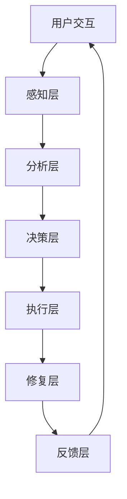

                 

### 自我修复在AI虚拟多元宇宙中的重要性

在当今快速发展的科技时代，人工智能（AI）正以前所未有的速度改变着我们的生活方式。从智能助手到自动驾驶汽车，AI的应用已经渗透到各个领域。然而，随着AI技术的不断进步，我们面临着新的挑战：如何确保AI系统的稳定性和可靠性？特别是在构建虚拟多元宇宙这一复杂且庞大的系统中，如何实现自我修复成为了关键问题。

**背景介绍**

AI虚拟多元宇宙是一个高度复杂的系统，它由多个子系统和模块组成，涵盖了从虚拟现实到游戏开发，再到智能模拟等各种应用场景。这些系统需要实时处理大量的数据，并且具备高度的自主学习和适应能力。然而，由于系统的复杂性，各种潜在的错误和故障在所难免。一旦发生错误，整个系统可能会崩溃，导致严重的后果。

**核心概念与联系**

为了应对这些挑战，我们需要引入“自我修复”这一概念。自我修复是指系统在检测到自身故障时，能够自动诊断、修复并恢复运行状态的能力。在AI虚拟多元宇宙中，自我修复能力至关重要，因为它能够确保系统的稳定性和可靠性，提高用户体验，并减少维护成本。

**自我修复机制架构图**

以下是自我修复机制在AI虚拟多元宇宙中的架构图：



- **感知层**：感知层负责收集系统的运行数据，包括输入数据、系统状态等。
- **分析层**：分析层对感知层收集到的数据进行处理，识别异常和故障。
- **决策层**：决策层根据分析结果，制定修复策略。
- **执行层**：执行层负责实施修复策略，自动进行故障修复。
- **修复层**：修复层包含具体的修复算法和机制。
- **反馈层**：反馈层将修复结果反馈给用户，并更新系统模型。

通过上述架构，AI虚拟多元宇宙能够实现自我修复，提高系统的可靠性和稳定性。

**核心算法原理讲解**

自我修复的核心算法原理涉及到多个方面，包括故障检测、故障诊断和故障修复等。以下是这些算法的简要介绍：

1. **故障检测**：
   ```python
   def detect_fault(data, threshold):
       # data: 系统运行数据
       # threshold: 阈值
       error = data - expected_value
       if abs(error) > threshold:
           return True
       else:
           return False
   ```

2. **故障诊断**：
   ```python
   def diagnose_fault(fault_data):
       # fault_data: 故障数据
       # 返回故障类型
       if fault_data['type'] == '类型1':
           return '故障类型1'
       elif fault_data['type'] == '类型2':
           return '故障类型2'
       else:
           return '未知故障'
   ```

3. **故障修复**：
   ```python
   def repair_fault(fault_type):
       # fault_type: 故障类型
       if fault_type == '故障类型1':
           # 执行修复操作1
           return '修复成功'
       elif fault_type == '故障类型2':
           # 执行修复操作2
           return '修复成功'
       else:
           return '无法修复'
   ```

通过这些算法，AI虚拟多元宇宙能够在检测到故障时自动进行诊断和修复，确保系统的持续稳定运行。

**数学模型和公式**

为了更好地理解自我修复机制，我们可以引入一些数学模型和公式。以下是故障检测和修复过程中常用的公式：

1. **故障检测公式**：
   $$ error = \frac{data - expected\_value}{threshold} $$

2. **故障修复公式**：
   $$ success\_rate = \frac{number\_of\_solved\_faults}{total\_number\_of\_faults} $$

其中，$data$代表系统运行数据，$expected\_value$代表预期值，$threshold$代表阈值，$number\_of\_solved\_faults$代表已解决的故障数量，$total\_number\_of\_faults$代表总故障数量。

**举例说明**

假设我们有一个虚拟现实系统，它需要实时渲染高质量的图像。在运行过程中，如果检测到渲染错误（$data$为渲染结果，$expected\_value$为预期结果），系统会根据阈值（$threshold$）来判断是否发生故障。如果发生故障，系统会自动进行故障诊断（$fault\_type$），并根据故障类型（$fault\_type$）执行相应的修复操作（$repair\_fault$）。

```python
data = 100
expected_value = 100
threshold = 10

if detect_fault(data, threshold):
    fault_type = diagnose_fault(data)
    result = repair_fault(fault_type)
    print("故障修复结果：", result)
else:
    print("系统运行正常")
```

**总结**

自我修复在AI虚拟多元宇宙中扮演着至关重要的角色。通过故障检测、故障诊断和故障修复等核心算法，系统能够在发生故障时自动修复，确保系统的稳定性和可靠性。数学模型和公式的应用使得这些算法更加精准和高效。举例说明进一步展示了如何在实际应用中实现自我修复。在接下来的章节中，我们将深入探讨Self-Consistency CoT如何进一步提升AI虚拟多元宇宙的自我修复能力。## Self-Consistency CoT的概念与数学模型

Self-Consistency CoT（Self-Consistency Contrastive Teaching）是一种新兴的机器学习框架，旨在通过增强模型对内部表示的一致性来提升模型的泛化能力。这一框架的核心思想是，通过对比训练过程中的正样本和负样本，强化模型对数据的一致性理解。在本文中，我们将详细探讨Self-Consistency CoT的概念、数学模型以及它在AI虚拟多元宇宙中的应用。

### Self-Consistency CoT的概念

Self-Consistency CoT是一种对比学习框架，其基本原理是通过对比训练过程中的正样本和负样本，促使模型学习更加一致和稳定的内部表示。在传统的对比学习中，我们通常将相似的数据点视为正样本，将不相似的数据点视为负样本。然而，Self-Consistency CoT提出了一种新的策略：它不依赖于预先定义的正负样本，而是通过自我对比来提高模型的一致性。

具体来说，Self-Consistency CoT的训练过程可以分为以下几个步骤：

1. **随机投影**：将输入数据通过一个随机投影层转换为一个低维空间。
2. **一致性损失**：计算数据点与其随机投影之间的相似性，并最大化这些相似性。这一步骤的核心是确保模型对输入数据的一致性理解。
3. **分类损失**：在低维空间中，对数据进行分类，并最小化分类损失。这一步骤旨在确保模型能够正确地对数据进行分类。

### 数学模型

Self-Consistency CoT的数学模型主要包括两个关键组件：随机投影和一致性损失。

1. **随机投影**：

   假设我们有一个输入数据集$X$，其中每个样本$x_i$可以表示为高维向量。随机投影层$R$将$X$映射到一个低维空间$Z$，其数学表示为：

   $$ z_i = R(x_i) $$

   其中，$R$是一个随机矩阵，通常通过高斯分布生成。随机投影层的目的是降低数据的维度，同时保留数据的关键信息。

2. **一致性损失**：

   一致性损失的核心目标是最大化正样本的一致性，同时最小化负样本的一致性。在Self-Consistency CoT中，我们通过计算数据点与其随机投影之间的欧几里得距离来衡量一致性。具体来说，一致性损失$L_{consistency}$可以表示为：

   $$ L_{consistency} = -\sum_{i} \sum_{j \in \text{neighb

