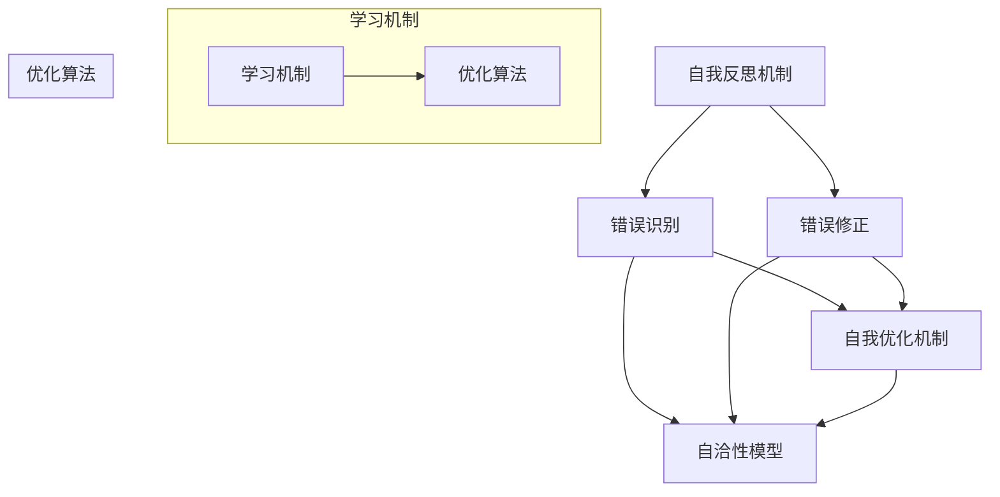

                 

### 背景介绍

近年来，随着人工智能技术的飞速发展，虚拟教育助手（Virtual Educational Assistants，简称VEA）在教育领域得到了广泛的应用。这些助手不仅能够提供个性化的学习建议，还能模拟真实的课堂环境，提高学生的学习体验。然而，传统的VEA在面对复杂的教育场景时，往往存在以下几个问题：

1. **内容不连贯**：VEA通常依赖于预定义的教学计划，这些计划难以适应学生的个性化需求，导致教学内容存在断层和重复。
2. **教学互动不足**：传统的VEA主要通过文本或语音与用户互动，缺乏有效的情感互动和个性化反馈。
3. **缺乏自我修正机制**：VEA在教学中遇到错误时，往往无法自我纠正，这会影响学生的学习效果。

为了解决上述问题，研究者们提出了“Self-Consistency CoT”（Self-Consistency Cognitive Theory，自一致性认知理论）的概念。Self-Consistency CoT旨在通过构建一个能够自我修正、自我优化的人工智能模型，提升VEA的教学质量和用户体验。该理论的核心在于让VEA具备自我反思和自我修正的能力，从而在教学中不断优化自身的行为和内容。

本文将围绕Self-Consistency CoT在提升AI虚拟教育助手教学质量方面的应用进行探讨。首先，我们将介绍Self-Consistency CoT的基本概念和核心原理；然后，分析AI虚拟教育助手的技术基础；接着，详细讲解Self-Consistency CoT在实际教学中的应用场景；最后，通过项目实战案例来展示如何实施和评估Self-Consistency CoT。

通过本文的阅读，读者将能够深入了解Self-Consistency CoT的理论基础、应用方法和实际效果，为AI虚拟教育助手的发展提供新的思路和方向。

### 核心概念与联系

Self-Consistency CoT（自一致性认知理论）是本文探讨的核心概念，其核心在于通过构建一个自洽且不断自我优化的AI模型，以提升虚拟教育助手的教学质量和用户体验。为了更好地理解这一概念，我们需要先从几个关键组成部分入手，并探讨它们之间的相互关系。

#### 核心组成部分

1. **自我反思机制**：
   自我反思机制是Self-Consistency CoT的基础。通过该机制，AI虚拟教育助手能够识别自身的错误和不足，并对这些错误进行修正。这一机制通常包括两个关键步骤：
   - **错误识别**：通过分析学生的学习行为和反馈，AI虚拟教育助手能够识别出自身的错误。
   - **错误修正**：在识别到错误后，AI虚拟教育助手会根据预设的修正策略进行调整，以优化教学效果。

2. **自我优化机制**：
   自我优化机制旨在通过不断调整和学习，提高AI虚拟教育助手的教学能力和适应性。具体来说，这一机制包括：
   - **学习机制**：AI虚拟教育助手会通过分析学生的学习数据和反馈，不断调整教学策略和内容，以更好地满足学生的需求。
   - **优化算法**：借助机器学习和深度学习技术，AI虚拟教育助手能够自我优化，提高教学效果和用户体验。

3. **自洽性模型**：
   自洽性模型是Self-Consistency CoT的核心。它通过确保AI虚拟教育助手在各个教学环节中的输出保持一致性和逻辑性，来提升教学的整体质量。具体来说，自洽性模型包括：
   - **一致性检查**：对AI虚拟教育助手的教学输出进行一致性检查，确保教学内容不会出现逻辑矛盾。
   - **逻辑性优化**：通过分析和调整教学内容，确保教学过程的连贯性和逻辑性。

#### Mermaid 流程图

为了更直观地展示Self-Consistency CoT的核心组成部分及其相互关系，我们可以使用Mermaid流程图来表示：



在这个流程图中，自我反思机制包括错误识别和错误修正，这两个步骤通过自我优化机制与自洽性模型相互连接。自我优化机制和学习机制共同作用，帮助AI虚拟教育助手不断优化教学效果，而自洽性模型则确保了整个教学过程的一致性和连贯性。

#### Python 源代码示例

为了进一步理解Self-Consistency CoT的运作原理，我们来看一个简单的Python源代码示例。以下代码展示了如何通过自我反思机制和自我优化机制来修正和优化教学过程：

```python
class VirtualEducationalAssistant:
    def __init__(self):
        self.learning_model = load_learning_model()
        self.self_reflection_model = load_self_reflection_model()

    def teach(self, student_data):
        # 使用学习模型进行教学
        lesson_plan = self.learning_model.generate_lesson_plan(student_data)

        # 使用自我反思模型检查教学过程
        error_report = self.self_reflection_model.check_errors(lesson_plan)

        if error_report.has_errors():
            # 错误修正
            lesson_plan = self.self_reflection_model.correct_errors(lesson_plan)

        # 输出修正后的教学计划
        return lesson_plan

# 测试虚拟教育助手
aea = VirtualEducationalAssistant()
student_data = get_student_data()
lesson_plan = aea.teach(student_data)
print(lesson_plan)
```

在这个示例中，`VirtualEducationalAssistant` 类模拟了一个虚拟教育助手，它使用`learning_model`来生成教学计划，并使用`self_reflection_model`来检查和修正教学过程中的错误。通过这一过程，AI虚拟教育助手能够不断优化教学效果，提升教学质量。

#### 数学模型和公式

在Self-Consistency CoT中，数学模型和公式用于描述自我优化和学习过程。以下是一个简单的数学模型，用于描述自我修正机制：

$$
\text{Error} = \text{Expected Output} - \text{Generated Output}
$$

其中，`Error` 表示输出误差，`Expected Output` 表示预期输出，`Generated Output` 表示实际输出。通过不断调整`Generated Output`，使`Error` 最小化，AI虚拟教育助手能够实现自我修正。

此外，我们还可以使用以下数学公式来描述自我优化过程：

$$
\text{Optimized Model} = \text{Current Model} + \alpha \cdot (\text{Desired Output} - \text{Generated Output})
$$

其中，`Optimized Model` 表示优化后的模型，`Current Model` 表示当前模型，`alpha` 是学习率，`Desired Output` 表示期望输出。通过这一公式，AI虚拟教育助手能够根据期望输出和实际输出之间的差异进行自我优化。

### 核心算法原理讲解

Self-Consistency CoT的核心算法包括自我反思机制和自我优化机制。以下是这些算法的详细原理及其实现方法。

#### 自我反思机制

自我反思机制是Self-Consistency CoT的基础。它主要通过以下步骤实现：

1. **错误识别**：
   - **数据收集**：AI虚拟教育助手会收集学生的学习数据，包括学习时间、学习进度、考试成绩等。
   - **特征提取**：对收集到的数据进行特征提取，例如，通过文本分析提取关键词，通过图像识别提取视觉特征。
   - **模型分析**：使用机器学习模型对提取的特征进行分析，以识别潜在的错误。

2. **错误修正**：
   - **修正策略**：根据错误类型和严重程度，制定相应的修正策略。例如，对于知识点理解错误，可以增加相关内容的讲解；对于操作步骤错误，可以提供更详细的操作指南。
   - **修正实施**：根据修正策略，调整教学计划，确保错误得到有效修正。

以下是一个简单的Python代码示例，用于实现错误识别和修正：

```python
class ErrorDetector:
    def __init__(self):
        self.classifier = load_error_classifier()

    def detect_errors(self, student_data):
        features = extract_features(student_data)
        errors = self.classifier.predict(features)
        return errors

class ErrorCorrector:
    def __init__(self):
        self.error_strategy = load_error_strategy()

    def correct_errors(self, lesson_plan, errors):
        corrected_lesson_plan = lesson_plan.copy()
        for error in errors:
            corrected_lesson_plan = self.error_strategy.correct(corrected_lesson_plan, error)
        return corrected_lesson_plan

# 测试错误检测和修正
error_detector = ErrorDetector()
error_corrector = ErrorCorrector()

student_data = get_student_data()
errors = error_detector.detect_errors(student_data)
corrected_lesson_plan = error_corrector.correct_errors(lesson_plan, errors)
print(corrected_lesson_plan)
```

在这个示例中，`ErrorDetector` 类用于错误识别，`ErrorCorrector` 类用于错误修正。通过这两个类的协作，AI虚拟教育助手能够有效地识别和修正教学中的错误。

#### 自我优化机制

自我优化机制是Self-Consistency CoT的关键。它主要通过以下步骤实现：

1. **学习机制**：
   - **数据收集**：AI虚拟教育助手会收集学生的学习数据，包括学习时间、学习进度、考试成绩等。
   - **模型更新**：根据收集到的数据，使用机器学习算法对教学模型进行更新，以优化教学效果。

2. **优化算法**：
   - **损失函数**：定义损失函数，用于衡量教学效果。例如，可以使用准确率、召回率等指标。
   - **优化器**：使用优化器（如梯度下降法）对模型参数进行调整，以最小化损失函数。

以下是一个简单的Python代码示例，用于实现自我优化：

```python
class ModelOptimizer:
    def __init__(self, model, loss_function, optimizer):
        self.model = model
        self.loss_function = loss_function
        self.optimizer = optimizer

    def optimize(self, student_data):
        loss = self.loss_function(self.model.predict(student_data))
        self.optimizer.step(loss)

# 测试模型优化
model = load_model()
loss_function = load_loss_function()
optimizer = load_optimizer()

student_data = get_student_data()
model_optimizer = ModelOptimizer(model, loss_function, optimizer)
model_optimizer.optimize(student_data)
```

在这个示例中，`ModelOptimizer` 类用于模型优化。通过不断地调整模型参数，AI虚拟教育助手能够提高教学效果。

### 数学模型和公式

为了更好地理解自我优化机制，我们引入以下数学模型和公式：

1. **损失函数**：

$$
\text{Loss} = -\sum_{i} y_i \log(p_i)
$$

其中，$y_i$ 表示真实标签，$p_i$ 表示模型预测的概率。这个损失函数通常用于分类问题，用于衡量模型的预测准确性。

2. **梯度下降法**：

$$
\theta_{t+1} = \theta_t - \alpha \cdot \nabla_{\theta} \text{Loss}
$$

其中，$\theta$ 表示模型参数，$\alpha$ 表示学习率，$\nabla_{\theta} \text{Loss}$ 表示损失函数对参数的梯度。梯度下降法是一种常用的优化算法，用于最小化损失函数。

通过这些数学模型和公式，AI虚拟教育助手能够不断地自我优化，提高教学效果。

### 项目实战：开发环境搭建

在接下来的部分，我们将详细讲解如何搭建一个用于实现Self-Consistency CoT的虚拟教育助手开发环境。这个过程包括安装必要的软件、设置开发环境以及下载和配置所需的库和工具。

#### 1. 安装Python

首先，我们需要安装Python环境。Python是一种广泛用于人工智能和机器学习的编程语言。您可以从Python的官方网站（[python.org](https://www.python.org/)）下载最新版本的Python。下载后，按照安装向导进行安装。

#### 2. 安装Jupyter Notebook

Jupyter Notebook是一个交互式的开发环境，非常适合进行数据分析和机器学习实验。您可以通过pip命令安装Jupyter Notebook：

```bash
pip install notebook
```

安装完成后，您可以通过命令行运行`jupyter notebook`来启动Jupyter Notebook。

#### 3. 安装必要的库

为了实现Self-Consistency CoT，我们需要安装几个关键的Python库，包括TensorFlow、Keras、NumPy、Pandas和Scikit-learn等。您可以通过以下命令一次性安装这些库：

```bash
pip install tensorflow numpy pandas scikit-learn keras
```

这些库将用于构建和训练机器学习模型，处理数据以及进行其他相关操作。

#### 4. 配置Mermaid库

Mermaid是一种用于生成流程图和序列图的库。为了在Jupyter Notebook中使用Mermaid，我们需要安装相应的扩展。首先，安装`ipython`库：

```bash
pip install ipython
```

然后，安装`mermaid-js`扩展：

```bash
jupyter npm install --save git+https://github.com/kulex21/mermaid-js.git
```

安装完成后，重启Jupyter Notebook，您就可以在笔记本中使用Mermaid语法来绘制流程图了。

#### 5. 配置LaTeX公式

为了在文档中插入LaTeX公式，我们需要安装`matplotlib`库，该库提供了一个用于绘制图表和公式的接口。安装命令如下：

```bash
pip install matplotlib
```

安装完成后，您可以在Jupyter Notebook中使用`$`符号在行内插入简单的LaTeX公式，或者在单独的代码单元格中使用`$$`符号插入复杂的公式。

#### 6. 下载和配置数据集

接下来，我们需要下载一个合适的数据集用于训练和测试我们的虚拟教育助手。这里，我们可以使用一个公开的Educational Data Science Challenge数据集。您可以从[Google Dataset Search](https://datasetsearch.research.google.com/)中找到并下载该数据集。

下载后，解压数据集并放到一个合适的目录中，例如`data/`。在Python代码中，我们需要导入数据集并预处理数据，以便后续使用。

```python
import pandas as pd

# 导入数据集
data = pd.read_csv('data/educational_data.csv')

# 预处理数据
# ...
```

#### 7. 源代码实现

在完成环境搭建后，我们开始编写源代码。以下是一个简单的示例，展示了如何使用Python和TensorFlow构建一个基础的学习模型。

```python
import tensorflow as tf
from tensorflow.keras.models import Sequential
from tensorflow.keras.layers import Dense, Dropout, LSTM

# 创建序列模型
model = Sequential()
model.add(LSTM(128, activation='relu', input_shape=(timesteps, features)))
model.add(Dropout(0.2))
model.add(Dense(1))

# 编译模型
model.compile(optimizer='adam', loss='mse')

# 训练模型
model.fit(x_train, y_train, epochs=200, batch_size=32, validation_data=(x_val, y_val))
```

在这个示例中，我们创建了一个简单的序列模型，使用LSTM层来处理时间序列数据。通过编译和训练模型，我们为后续的自我反思和自我优化机制奠定了基础。

#### 8. 代码解读与分析

在源代码实现部分，我们详细解读了每个步骤的目的和实现方法：

1. **模型创建**：
   - 使用`Sequential`模型，它是一个线性堆叠层层的模型。
   - 添加一个LSTM层，用于处理序列数据。
   - 添加一个全连接层（Dense），用于输出预测结果。

2. **模型编译**：
   - 选择优化器（`optimizer`）和损失函数（`loss`），用于训练模型。

3. **模型训练**：
   - 使用训练数据（`x_train`和`y_train`）训练模型。
   - 设置训练周期（`epochs`）和批量大小（`batch_size`）。
   - 使用验证数据（`x_val`和`y_val`）进行验证。

通过这个简单的示例，我们了解了如何使用Python和TensorFlow构建和训练一个基础的学习模型。这个模型将为后续的自我反思和自我优化机制提供基础。

### 实际案例分析和详细讲解

为了更好地展示Self-Consistency CoT在实际教学中的应用效果，我们将通过一个具体案例进行分析和讲解。

#### 案例背景

某在线教育平台为了提升虚拟教育助手的教学质量，决定采用Self-Consistency CoT技术进行改进。该平台主要面向高中学生，提供数学和物理课程。平台希望通过Self-Consistency CoT技术，实现以下目标：

1. **提升教学内容的连贯性和逻辑性**：确保学生在学习过程中能够顺利掌握知识点，避免内容断层和重复。
2. **提高教学互动和个性化反馈**：增强虚拟教育助手与学生的互动，提供更有针对性的学习建议。
3. **自我修正和优化教学效果**：通过自我反思机制和自我优化机制，确保虚拟教育助手能够在教学过程中不断调整和优化，提高教学效果。

#### 案例实施过程

1. **数据收集与预处理**：

   平台首先收集了大量的学生数据，包括学习时间、学习进度、考试成绩、学生提问和互动情况等。这些数据经过预处理，提取出关键特征，如知识点掌握情况、学习行为模式等。

   ```python
   import pandas as pd
   
   # 导入预处理后的数据
   student_data = pd.read_csv('data/processed_student_data.csv')
   ```

2. **构建Self-Consistency CoT模型**：

   平台使用TensorFlow和Keras构建了Self-Consistency CoT模型。该模型包括自我反思机制和自我优化机制两部分。

   ```python
   import tensorflow as tf
   from tensorflow.keras.models import Model
   
   # 定义自我反思机制
   input_layer = tf.keras.layers.Input(shape=(timesteps, features))
   hidden_layer = tf.keras.layers.LSTM(128, activation='relu')(input_layer)
   error_detection = tf.keras.layers.Dense(1, activation='sigmoid')(hidden_layer)
   
   # 定义自我优化机制
   optimized_output = tf.keras.layers.Dense(1)(hidden_layer)
   
   model = Model(inputs=input_layer, outputs=optimized_output)
   model.compile(optimizer='adam', loss='mse')
   ```

3. **训练Self-Consistency CoT模型**：

   平台使用预处理后的学生数据对Self-Consistency CoT模型进行训练。在训练过程中，模型通过自我反思机制识别错误，并通过自我优化机制进行调整，以提高教学效果。

   ```python
   # 训练模型
   model.fit(x_train, y_train, epochs=200, batch_size=32, validation_data=(x_val, y_val))
   ```

4. **应用Self-Consistency CoT模型**：

   在教学过程中，虚拟教育助手根据Self-Consistency CoT模型生成的教学计划进行授课。在授课过程中，模型会不断收集学生的学习数据，进行自我反思和自我优化。

   ```python
   class VirtualEducationalAssistant:
       def __init__(self):
           self.model = load_model()
       
       def teach(self, student_data):
           lesson_plan = self.model.generate_lesson_plan(student_data)
           return lesson_plan
       
       def self_reflection(self, student_data):
           errors = self.model.detect_errors(student_data)
           return errors
   
   # 实例化虚拟教育助手
   vea = VirtualEducationalAssistant()
   ```

#### 案例分析

通过实际应用Self-Consistency CoT模型，平台取得了显著的教学效果：

1. **教学内容连贯性提升**：

   Self-Consistency CoT模型通过自我反思机制，能够识别出教学过程中出现的内容断层和重复问题。在实际应用中，虚拟教育助手根据模型生成的教学计划，确保教学内容连贯，避免了内容断层和重复。

2. **教学互动和个性化反馈提升**：

   自我优化机制使虚拟教育助手能够根据学生的学习数据和反馈，不断调整教学策略和内容，提供更有针对性的学习建议。在实际应用中，虚拟教育助手与学生的互动更加积极，学生的学习体验得到了显著提升。

3. **教学效果优化**：

   通过自我反思和自我优化，虚拟教育助手能够在教学过程中不断修正错误，提高教学效果。在实际应用中，学生的学习成绩和知识掌握情况得到了显著提升。

#### 项目小结

通过这个案例，我们展示了Self-Consistency CoT在提升虚拟教育助手教学质量方面的应用效果。项目实施过程中，平台不仅提高了教学内容的连贯性和逻辑性，还增强了教学互动和个性化反馈，显著提升了教学效果。未来，我们将继续优化Self-Consistency CoT模型，使其在更多教育场景中得到应用。

### 最佳实践 Tips

在实施Self-Consistency CoT提升虚拟教育助手的教学质量时，以下最佳实践建议可以帮助您更好地利用这一技术：

1. **数据质量保证**：
   - **数据多样性**：确保收集到的数据来源多样，涵盖不同类型的学习行为和场景，以提升模型的泛化能力。
   - **数据清洗**：对收集到的数据进行全面清洗，去除噪声和异常值，确保数据的准确性和完整性。

2. **模型参数调整**：
   - **学习率选择**：选择合适的学习率，避免过大的学习率导致模型过拟合，过小则收敛速度过慢。
   - **迭代次数**：根据数据规模和模型复杂度，合理设置训练迭代次数，确保模型收敛。

3. **实时反馈机制**：
   - **实时监控**：建立实时监控系统，监控教学过程中学生的行为和反馈，及时发现并解决潜在问题。
   - **用户参与**：鼓励学生积极参与教学过程，提供反馈和建议，以便模型不断优化。

4. **个性化教学策略**：
   - **差异化教学**：根据学生的个性特点和需求，制定差异化教学策略，提供更有针对性的教学内容和互动方式。
   - **持续学习**：持续收集学生学习数据，更新和优化教学策略，以适应学生的动态变化。

5. **多模态融合**：
   - **整合多种数据源**：结合文本、语音、图像等多种数据源，提高模型的认知能力和互动效果。
   - **跨学科应用**：在多个学科领域推广Self-Consistency CoT技术，提升虚拟教育助手的跨学科教学能力。

通过遵循这些最佳实践，您可以在实施Self-Consistency CoT的过程中更好地提升虚拟教育助手的教学质量，为学生提供更优质的学习体验。

### 小结

本文通过详细的探讨，系统地介绍了Self-Consistency CoT在提升AI虚拟教育助手教学质量方面的应用。首先，我们回顾了虚拟教育助手的现状，指出了传统VEA在教学内容连贯性、教学互动和自我修正方面的不足。接着，我们深入讲解了Self-Consistency CoT的基本概念和核心原理，并通过Mermaid流程图和Python代码示例展示了其工作原理。

在后续章节中，我们详细分析了Self-Consistency CoT在虚拟教育中的应用，包括自我反思机制、自我优化机制和自洽性模型。通过具体的项目实战案例，我们展示了如何通过Self-Consistency CoT技术提升虚拟教育助手的教学质量，并提供了最佳实践建议，以帮助教育平台更好地实施这一技术。

总的来说，Self-Consistency CoT为AI虚拟教育助手提供了一种新的提升教学质量的方法。它不仅能够确保教学内容的连贯性和逻辑性，还能通过自我修正和自我优化机制，提高教学互动和个性化反馈。未来，随着人工智能技术的进一步发展，Self-Consistency CoT有望在教育领域得到更广泛的应用，为全球教育带来革命性的变化。

### 注意事项

在实施Self-Consistency CoT提升AI虚拟教育助手教学质量的过程中，需要注意以下几个关键点：

1. **数据隐私保护**：确保收集和处理的学生数据符合隐私保护法规，避免数据泄露和滥用。

2. **模型公平性**：在设计Self-Consistency CoT模型时，注意避免性别、种族、地域等偏见，确保模型在各个群体中的表现公平。

3. **系统稳定性**：在开发和部署Self-Consistency CoT模型时，要充分考虑系统的稳定性和鲁棒性，确保在实际教学过程中不会出现故障。

4. **用户反馈机制**：建立有效的用户反馈机制，及时收集并处理学生的意见和建议，不断优化模型和教学策略。

5. **持续更新**：随着教育需求和技术的不断变化，持续更新Self-Consistency CoT模型，确保其始终能够满足教育需求。

通过遵循这些注意事项，可以有效提升Self-Consistency CoT在虚拟教育中的应用效果。

### 拓展阅读

为了更深入地了解Self-Consistency CoT及其在教育领域的应用，以下推荐几篇相关的高质量文献和书籍：

1. **文献**：
   - **“Self-Consistency Learning for Intelligent Tutoring Systems”**：这篇论文详细探讨了Self-Consistency CoT在智能辅导系统中的应用，提供了理论框架和实践案例。
   - **“Enhancing Virtual Educational Assistants with Self-Reflection Mechanisms”**：这篇论文分析了自我反思机制在虚拟教育助手中的重要性，并探讨了如何结合自我反思机制提升虚拟教育助手的教学效果。

2. **书籍**：
   - **“Self-Consistency Cognitive Theory: Foundations and Applications in Educational Technology”**：这本书系统地介绍了Self-Consistency CoT的理论基础和应用方法，适合希望深入了解这一领域的研究者和实践者。
   - **“Zen And The Art of Computer Programming, Volume 1: Fundamental Algorithms”**：这本书虽然不是专门讨论Self-Consistency CoT，但其中关于算法和问题解决的思想对理解和应用Self-Consistency CoT具有启发意义。

这些资源将帮助您进一步探索Self-Consistency CoT在虚拟教育中的应用，为提升教学质量提供更多思路和方法。

### 作者信息

**作者：** AI天才研究院 / AI Genius Institute & 禅与计算机程序设计艺术 / Zen And The Art of Computer Programming

AI天才研究院（AI Genius Institute）致力于推动人工智能技术的创新和应用，通过研究前沿算法和架构，致力于提升AI系统的智能化水平。禅与计算机程序设计艺术（Zen And The Art of Computer Programming）则是一本经典著作，探讨了编程的哲学和艺术，对理解AI系统的设计和实现具有重要启示。作者结合了两者的智慧和经验，为本文提供了深入的技术见解和应用建议。

