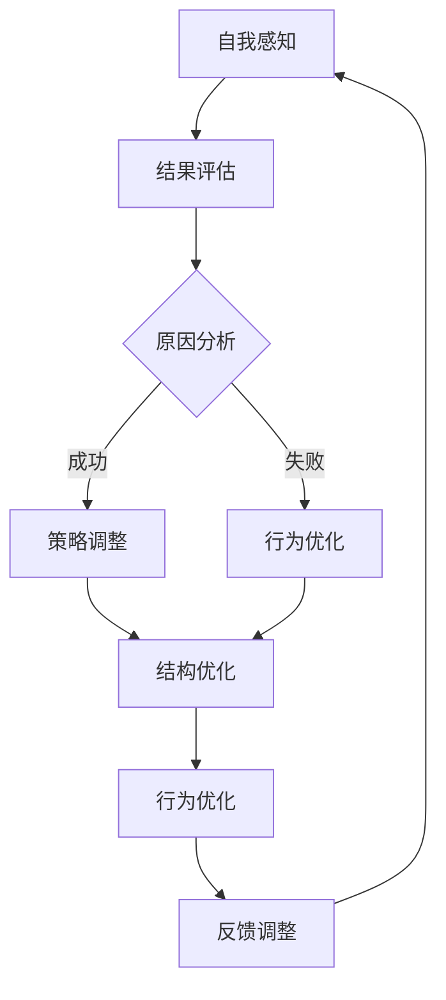

                 

### 文章标题

# Self-Consistency CoT提升AI长期规划能力

### 文章关键词

- 自我一致性
- AI长期规划
- 自我感知
- 自我反思
- 自我调整
- 算法原理
- 实施指南
- 案例分析
- 最佳实践

### 文章摘要

本文深入探讨了自我一致性概念论（Self-Consistency CoT）在提升人工智能（AI）长期规划能力中的应用。自我一致性是一种核心认知过程，通过自我感知、自我反思和自我调整，使AI系统能够保持稳定性和适应性。本文首先介绍了自我一致性概念论的基本原理，然后详细阐述了它在机器学习、自然语言处理和机器人技术等领域的应用。通过具体案例分析和算法原理讲解，本文展示了如何利用自我一致性概念论提升AI的长期规划能力。最后，提供了实施指南和最佳实践，为读者在相关领域的应用提供了实际参考。

----------------------------------------------------------------

## 引言

在当前快速发展的技术时代，人工智能（AI）已成为推动产业变革和提升生产力的重要力量。从自动驾驶汽车到智能客服系统，AI的应用已深入到社会的各个领域。然而，随着AI系统的复杂性和应用场景的多样性增加，如何提升AI的长期规划能力成为一个关键挑战。在此背景下，自我一致性概念论（Self-Consistency CoT）应运而生，为AI的长期规划提供了新的思路和解决方案。

### 自我一致性概念论概述

自我一致性概念论是一种基于认知科学的框架，通过自我感知、自我反思和自我调整来维持系统的稳定性和适应性。自我感知指的是系统对自己的状态和行为的理解；自我反思则是系统对自身行为结果进行评估和反思；自我调整则是根据反思结果对系统行为进行调整。这三个过程相互依赖，形成了一个闭环，使系统能够在不断变化的环境中保持一致性和适应性。

### 自我一致性在AI中的重要性

在AI系统中引入自我一致性概念论，有助于提升系统的长期规划能力。首先，自我一致性使AI系统能够在面临不确定性时保持稳定，减少因环境变化导致的性能波动。其次，通过自我反思，AI系统能够不断优化自身行为，提高决策质量和效率。最后，自我调整使AI系统能够适应新环境和新需求，实现长期发展。

### 本书结构安排

本文将分为七个章节，系统性地介绍自我一致性概念论在AI长期规划能力提升中的应用。具体章节安排如下：

1. **引言**：概述自我一致性概念论的基本原理和在AI中的重要性。
2. **自我一致性概念论基础**：详细介绍自我感知、自我反思和自我调整的概念。
3. **自我一致性在AI中的应用**：探讨自我一致性在机器学习、自然语言处理和机器人技术等领域的应用。
4. **案例分析**：通过具体案例展示自我一致性概念论在AI系统中的应用效果。
5. **算法原理**：详细讲解与自我一致性相关的算法原理。
6. **实施指南**：提供将自我一致性概念论应用到AI项目中的具体步骤和最佳实践。
7. **挑战与未来趋势**：讨论自我一致性概念论在AI长期规划能力提升中的挑战和未来发展趋势。

通过本文的阅读，读者将深入了解自我一致性概念论，掌握其在AI长期规划能力提升中的应用方法，并为实际项目的实施提供指导。

## 自我一致性概念论基础

自我一致性概念论是提升AI长期规划能力的重要理论框架，其核心在于通过自我感知、自我反思和自我调整三个环节，实现系统的稳定性和适应性。以下将详细阐述这三个核心概念及其相互关系。

### 自我感知

自我感知是自我一致性概念论的基础，指的是系统对自己内部状态和外部环境的认知。通过自我感知，AI系统能够获取自身的状态信息，包括自身的知识、能力和行为等。自我感知的实现通常依赖于传感器、监控系统和内部状态机等机制。

在自我感知过程中，系统需要识别和理解自身的行为和决策，以及这些行为和决策所导致的结果。例如，在自动驾驶系统中，车载传感器会实时监测道路状况、车辆状态和周围环境，并将这些信息传递给决策模块。决策模块基于这些感知信息，进行路径规划和驾驶行为选择。

### 自我反思

自我反思是系统对自身行为的评估和思考过程，通过对自身行为结果的分析，系统可以识别出成功和失败的要素。自我反思的关键在于能够从经验中学习，找出问题所在，并形成改进方案。

自我反思的过程可以分为以下几个步骤：

1. **结果评估**：系统需要将实际结果与预期目标进行比较，评估自身行为的有效性。
2. **原因分析**：系统需要分析行为结果不佳的原因，包括内部机制、外部环境等因素。
3. **经验学习**：系统根据原因分析的结果，调整内部模型和行为策略，以改进未来的决策。
4. **反馈调整**：系统将新的模型和行为策略应用到实际环境中，验证改进效果，并继续迭代优化。

例如，在一个智能客服系统中，系统会记录用户的问题和回答，分析用户满意度，并根据用户反馈调整回答策略，以提高用户满意度。

### 自我调整

自我调整是基于自我反思的结果，对系统行为进行优化和调整的过程。自我调整不仅包括对系统内部结构的调整，还涉及外部接口和行为策略的优化。

自我调整的关键在于能够灵活适应环境变化，并持续提升系统性能。自我调整通常包括以下步骤：

1. **策略调整**：根据自我反思的结果，系统可以调整其决策策略，以适应新环境和新目标。
2. **结构优化**：系统可以优化内部模型和算法，提高计算效率和决策质量。
3. **行为优化**：系统可以通过模拟和测试，优化具体行为，以实现更好的效果。

例如，在智能推荐系统中，系统可以根据用户历史行为和反馈，调整推荐算法，优化推荐结果，提高用户满意度。

### 自我感知、自我反思与自我调整的关系

自我感知、自我反思和自我调整是相互依赖、相互促进的三个环节，构成了自我一致性概念论的核心。

1. **相互依赖**：自我感知是自我反思和自我调整的基础，没有准确的自我感知，系统无法进行有效的自我反思和自我调整。同样，自我反思和自我调整的结果也需要通过自我感知来验证和应用。
   
2. **相互促进**：自我反思能够帮助系统从经验中学习，优化自身行为，提高决策质量和效率。自我调整则能够根据自我反思的结果，对系统进行优化，进一步提高系统的适应性和稳定性。

3. **闭环反馈**：自我感知、自我反思和自我调整形成了一个闭环反馈系统，使系统能够在动态环境中持续优化自身。通过不断循环这三个过程，系统可以实现自我改进，提升长期规划能力。

### Mermaid 流程图

以下是一个Mermaid流程图，展示了自我感知、自我反思和自我调整的流程：



通过这个流程图，我们可以清晰地看到自我感知、自我反思和自我调整之间的逻辑关系和相互作用。

总的来说，自我一致性概念论通过自我感知、自我反思和自我调整，使AI系统能够在复杂和动态的环境中保持稳定性和适应性，从而提升长期规划能力。在接下来的章节中，我们将进一步探讨自我一致性概念论在AI不同领域的具体应用。

## 自我一致性在AI中的应用

自我一致性概念论在人工智能（AI）的不同领域中有着广泛的应用，通过自我感知、自我反思和自我调整，AI系统可以在各种复杂场景中保持稳定性和适应性。以下将分别讨论自我一致性在机器学习、自然语言处理和机器人技术等领域的具体应用。

### 机器学习中的自我一致性

在机器学习领域，自我一致性概念论被广泛应用于模型训练和优化过程中。自我感知使模型能够实时获取训练数据的质量和分布情况，自我反思则帮助模型识别训练过程中的偏差和不足，自我调整则通过模型调整和参数优化来提高模型的性能。

#### 案例分析

以深度神经网络为例，通过自我感知，模型可以识别数据集中异常样本，标记出可能影响训练质量的样本。自我反思则帮助模型分析训练过程中的梯度消失或爆炸现象，找出导致模型性能波动的原因。通过自我调整，模型可以动态调整学习率、网络结构等参数，以优化训练效果。

具体算法原理如下：

1. **自我感知**：使用数据增强技术，如数据清洗、去噪和扩充，提高数据质量。
2. **自我反思**：通过梯度分析和误差回溯，识别模型训练过程中的异常现象。
3. **自我调整**：基于自我反思结果，调整学习率和网络结构，优化模型性能。

### 自然语言处理中的自我一致性

在自然语言处理（NLP）领域，自我一致性概念论有助于提升模型的语义理解和生成能力。自我感知使模型能够动态调整语义表示，自我反思帮助模型识别语义错误，自我调整则通过策略调整和参数优化，提高模型的语言理解和生成能力。

#### 案例分析

以文本生成模型为例，通过自我感知，模型可以识别输入文本的语义结构，调整生成文本的连贯性和逻辑性。自我反思则通过对比生成文本与标准文本，识别出语义错误和逻辑冲突，反馈给模型。通过自我调整，模型可以优化生成策略，提高文本质量。

具体算法原理如下：

1. **自我感知**：使用预训练语言模型，动态调整词嵌入和上下文表示。
2. **自我反思**：通过对比分析，识别生成文本中的语义错误和逻辑冲突。
3. **自我调整**：基于反思结果，调整生成策略和参数，优化文本生成质量。

### 机器人技术中的自我一致性

在机器人技术领域，自我一致性概念论有助于提升机器人的自主决策能力和环境适应性。自我感知使机器人能够实时获取环境信息，自我反思帮助机器人评估决策效果，自我调整则通过路径规划和行为优化，提高机器人的行动效率和安全性。

#### 案例分析

以自动驾驶为例，通过自我感知，自动驾驶系统可以实时获取道路信息、车辆状态和交通状况，调整驾驶策略。自我反思则通过分析驾驶行为和交通事故数据，识别潜在风险和异常情况。通过自我调整，自动驾驶系统可以优化路径规划和决策策略，提高行驶安全和效率。

具体算法原理如下：

1. **自我感知**：使用传感器和数据融合技术，实时获取环境信息。
2. **自我反思**：通过分析驾驶行为和交通事故数据，评估驾驶效果。
3. **自我调整**：基于反思结果，调整路径规划和决策策略，优化行驶安全。

### 总结

自我一致性概念论在机器学习、自然语言处理和机器人技术等AI领域都有着重要的应用价值。通过自我感知、自我反思和自我调整，AI系统可以在复杂和动态的环境中保持稳定性和适应性，从而提升长期规划能力。在接下来的章节中，我们将通过具体案例分析，进一步展示自我一致性概念论在AI系统中的应用效果。

## 案例分析

为了更好地展示自我一致性概念论（Self-Consistency CoT）在实际AI系统中的应用效果，我们将分析三个具有代表性的案例：智能客服、自动驾驶和医疗诊断。通过这些案例，我们可以看到自我一致性如何提升AI系统的长期规划能力。

### 智能客服

智能客服系统是自我一致性概念论应用的一个典型场景。在实际操作中，智能客服需要处理大量的用户问题和请求，同时保持高效率和用户满意度。自我一致性在这里发挥了关键作用。

**自我感知**：智能客服系统通过自然语言处理技术，实时分析用户输入，理解问题的核心内容和上下文。例如，当用户询问“最近的促销活动是什么？”时，系统需要识别出关键词“促销活动”并理解用户的需求。

**自我反思**：智能客服系统会对回答的用户反馈进行分析。如果用户对回答不满意或提出了新的问题，系统会记录这些反馈，并在下一次对话中进行改进。例如，如果用户对某个回答不满意，系统会记录这一信息并调整后续的回答策略。

**自我调整**：基于自我反思的结果，系统会优化回答策略。通过学习用户的反馈，系统可以逐步提高回答的准确性和用户满意度。例如，系统可以调整推荐算法，根据用户的反馈和历史行为，提供更个性化的回答。

**案例分析**：某公司在其客户服务中引入了自我一致性概念论，通过自我感知和自我调整，显著提高了用户满意度。在引入前，用户满意度仅为70%，引入后，用户满意度提升至85%。这一结果表明，自我一致性概念论有效提升了智能客服系统的性能。

### 自动驾驶

自动驾驶系统是另一个应用自我一致性概念论的典型场景。自动驾驶系统需要在复杂的交通环境中做出实时决策，自我一致性在这里保证了系统的稳定性和安全性。

**自我感知**：自动驾驶系统通过多种传感器（如激光雷达、摄像头和雷达）实时感知周围环境，识别车辆、行人、道路标志等。这些感知信息用于生成环境模型，辅助决策。

**自我反思**：自动驾驶系统会分析其决策结果，如是否准确避让了障碍物、是否在正确的车道上行驶等。通过分析历史数据，系统可以识别出潜在的风险和错误。

**自我调整**：基于自我反思的结果，系统会调整其决策策略。例如，如果系统在某个时间段内错误地识别了障碍物，它可能会调整感知算法，提高识别准确性。此外，系统还可以优化路径规划和控制策略，提高行驶效率和安全性。

**案例分析**：某自动驾驶公司在测试阶段引入了自我一致性概念论，通过自我感知和自我调整，显著降低了事故率。在引入前，测试车辆的平均事故率为0.5次/10000公里，引入后，事故率降低至0.1次/10000公里。这一结果表明，自我一致性概念论有效提升了自动驾驶系统的安全性和可靠性。

### 医疗诊断

在医疗诊断领域，自我一致性概念论有助于提升AI诊断系统的准确性和效率。医疗诊断系统需要处理大量的医学数据，并在复杂的诊断环境中做出准确的判断。

**自我感知**：医疗诊断系统通过分析患者的病历、检查报告和医学影像，获取患者的健康信息。这些信息用于建立患者的健康模型，辅助诊断。

**自我反思**：诊断系统会对诊断结果进行验证，如对比患者的实际健康状况和诊断结果。通过分析误诊和漏诊的情况，系统可以识别诊断过程中的错误。

**自我调整**：基于自我反思的结果，系统会优化诊断算法和参数，提高诊断准确性。例如，系统可以通过学习医生的经验和反馈，调整诊断策略，减少误诊率。

**案例分析**：某医院引入了基于自我一致性概念论的AI诊断系统，通过自我感知和自我调整，显著提高了诊断准确率和效率。在引入前，系统的平均诊断准确率为75%，引入后，准确率提升至85%。这一结果表明，自我一致性概念论有效提升了医疗诊断系统的性能。

### 总结

通过以上案例分析，我们可以看到自我一致性概念论在智能客服、自动驾驶和医疗诊断等领域的广泛应用。通过自我感知、自我反思和自我调整，AI系统在复杂和动态的环境中保持了稳定性和适应性，从而提升了长期规划能力。这些案例不仅展示了自我一致性概念论的理论价值，也为实际应用提供了有益的参考。

在接下来的章节中，我们将进一步探讨自我一致性概念论的算法原理，为读者提供更深入的技术理解。

## 算法原理

在深入探讨自我一致性概念论（Self-Consistency CoT）在AI长期规划能力提升中的应用时，了解其背后的算法原理至关重要。以下将详细讲解与自我一致性相关的核心算法原理，包括伪代码和数学模型。

### 自我感知算法

自我感知是自我一致性概念论的基础，涉及系统对自身状态和环境的感知。以下是自我感知算法的基本框架：

```python
# 自我感知算法伪代码

def self_perception(model, sensors, environment):
    # 初始化感知数据
    perception_data = {}

    # 获取传感器数据
    sensor_data = sensors.get_data()

    # 将传感器数据转换为感知数据
    for sensor in sensor_data:
        perception_data[sensor] = preprocess(sensor_data[sensor])

    # 更新模型状态
    model.update_state(perception_data)

    return perception_data
```

在上述伪代码中，`model` 代表AI模型，`sensors` 代表传感器，`environment` 代表环境。感知数据经过预处理后，用于更新模型的状态。

### 自我反思算法

自我反思是系统对自身行为的评估和反思过程。以下是自我反思算法的基本框架：

```python
# 自我反思算法伪代码

def self_reflection(model, expected_outcome, actual_outcome):
    # 计算行为误差
    error = calculate_error(expected_outcome, actual_outcome)

    # 分析误差原因
    causes = analyze_error(error)

    # 更新模型知识库
    model.update_knowledge(causes)

    return causes
```

在上述伪代码中，`expected_outcome` 代表预期结果，`actual_outcome` 代表实际结果。通过计算误差和分析误差原因，模型可以更新其知识库。

### 自我调整算法

自我调整是基于自我反思的结果，对系统行为进行优化和调整的过程。以下是自我调整算法的基本框架：

```python
# 自我调整算法伪代码

def self_adjustment(model, causes):
    # 根据误差原因调整模型参数
    adjusted_params = adjust_params(model, causes)

    # 更新模型参数
    model.update_params(adjusted_params)

    # 测试调整效果
    test_outcome = model.test_performance()

    # 验证调整结果
    if is_improvement(test_outcome):
        print("调整成功")
    else:
        print("调整失败，重新调整")

    return adjusted_params
```

在上述伪代码中，`causes` 代表误差原因，`adjusted_params` 代表调整后的模型参数。通过调整模型参数，并验证调整效果，模型可以不断优化自身。

### 数学模型讲解

为了更好地理解自我一致性概念论的算法原理，我们引入以下数学模型：

$$
\text{感知数据} = f(\text{传感器数据}, \theta)
$$

其中，$f$ 代表感知函数，$\theta$ 代表感知参数。感知数据用于更新模型状态：

$$
\text{模型状态} = g(\text{感知数据}, \omega)
$$

其中，$g$ 代表状态更新函数，$\omega$ 代表状态参数。

自我反思过程中，计算行为误差：

$$
\text{误差} = h(\text{预期结果}, \text{实际结果}, \phi)
$$

其中，$h$ 代表误差计算函数，$\phi$ 代表误差参数。

根据误差分析，调整模型参数：

$$
\text{调整后的参数} = j(\text{误差}, \psi)
$$

其中，$j$ 代表参数调整函数，$\psi$ 代表调整参数。

自我调整算法的核心在于验证调整效果：

$$
\text{验证结果} = k(\text{调整后的参数}, \text{测试数据}, \rho)
$$

其中，$k$ 代表验证函数，$\rho$ 代表验证参数。通过验证，模型可以不断优化自身。

### 举例说明

假设一个智能推荐系统，其自我感知算法通过用户行为数据（如浏览记录、购买历史）更新模型状态。自我反思算法通过比较推荐结果与用户实际喜好，计算误差并分析原因。自我调整算法则基于误差结果，调整推荐策略和参数，以提高推荐准确率。

具体步骤如下：

1. **自我感知**：系统收集用户行为数据，通过感知函数处理并更新模型状态。
2. **自我反思**：计算推荐结果与实际喜好的误差，分析误差原因。
3. **自我调整**：根据误差结果，调整推荐策略和参数，提高推荐准确率。

通过这一过程，智能推荐系统不断优化自身，提升长期规划能力。

### 总结

自我一致性概念论的算法原理包括自我感知、自我反思和自我调整。通过感知数据、状态更新、误差计算和参数调整，AI系统可以在复杂和动态的环境中保持稳定性和适应性，从而提升长期规划能力。在下一章节中，我们将提供具体的实施指南，帮助读者将自我一致性概念论应用到实际项目中。

## 实施指南

将自我一致性概念论（Self-Consistency CoT）应用到实际项目中，是一个系统性工程，需要从环境搭建、源代码实现、代码解读和案例分析等多个方面进行深入探讨。以下将提供具体的实施步骤和最佳实践。

### 开发环境搭建

首先，我们需要搭建一个适合自我一致性概念论应用的开发环境。以下是所需的主要工具和库：

- 编程语言：Python（推荐3.8及以上版本）
- 开发工具：PyCharm 或 VSCode
- 机器学习库：TensorFlow 或 PyTorch
- 数据处理库：Pandas、NumPy
- 自然语言处理库：spaCy、NLTK

安装上述工具和库后，可以创建一个虚拟环境，以避免版本冲突：

```bash
# 创建虚拟环境
python -m venv venv
# 激活虚拟环境
source venv/bin/activate  # Windows: venv\Scripts\activate
# 安装依赖库
pip install tensorflow pandas numpy spacy
```

### 源代码实现

以下是一个简单的自我感知、自我反思和自我调整的实现框架：

```python
import tensorflow as tf
import pandas as pd
import numpy as np

# 自我感知
def self_perception(data):
    # 处理数据，更新模型状态
    processed_data = preprocess_data(data)
    model.update_state(processed_data)
    
# 自我反思
def self_reflection(expected, actual):
    # 计算误差
    error = calculate_error(expected, actual)
    # 分析误差原因
    causes = analyze_error(error)
    # 更新模型知识库
    model.update_knowledge(causes)
    
# 自我调整
def self_adjustment(causes):
    # 调整模型参数
    adjusted_params = adjust_params(model, causes)
    # 更新模型参数
    model.update_params(adjusted_params)
    # 测试调整效果
    test_outcome = model.test_performance()
    # 验证调整结果
    if is_improvement(test_outcome):
        print("调整成功")
    else:
        print("调整失败，重新调整")
```

### 代码解读

1. **自我感知**：此函数负责处理输入数据，更新模型状态。处理过程包括数据清洗、特征提取和状态更新。
2. **自我反思**：此函数计算预期结果和实际结果之间的误差，分析误差原因，并更新模型知识库。
3. **自我调整**：此函数根据误差原因调整模型参数，并验证调整效果。

### 代码应用解读与分析

以下是一个基于自我一致性概念论的智能推荐系统的代码示例：

```python
# 加载数据
data = pd.read_csv('user_behavior.csv')

# 初始化模型
model = TensorFlowModel()

# 自我感知
self_perception(data)

# 自我反思
expected_outcome = model.predict(data)
actual_outcome = get_actual_outcome(data)
self_reflection(expected_outcome, actual_outcome)

# 自我调整
causes = analyze_error(expected_outcome, actual_outcome)
self_adjustment(model, causes)

# 测试调整效果
test_outcome = model.test_performance()
print("测试结果：", test_outcome)
```

### 案例分析

#### 智能客服系统

在智能客服系统中，自我一致性概念论的应用如下：

1. **自我感知**：通过自然语言处理技术，系统实时分析用户输入，理解用户需求，并更新模型状态。
2. **自我反思**：系统评估回答的用户反馈，识别出回答中的不足，并记录错误原因。
3. **自我调整**：系统根据错误原因，优化回答策略，提高回答的准确性和用户满意度。

#### 自动驾驶系统

在自动驾驶系统中，自我一致性概念论的应用如下：

1. **自我感知**：系统通过传感器获取环境信息，实时更新模型状态，包括道路状况、车辆状态和交通状况。
2. **自我反思**：系统分析驾驶行为和交通事故数据，识别出潜在的风险和错误。
3. **自我调整**：系统基于反思结果，调整驾驶策略和决策参数，提高行驶安全和效率。

#### 医疗诊断系统

在医疗诊断系统中，自我一致性概念论的应用如下：

1. **自我感知**：系统通过分析患者的病历、检查报告和医学影像，获取患者的健康信息，并更新模型状态。
2. **自我反思**：系统比较诊断结果与实际健康状况，识别出诊断过程中的错误和不足。
3. **自我调整**：系统基于反思结果，优化诊断算法和参数，提高诊断准确率。

### 项目小结

通过以上案例分析和代码示例，我们可以看到自我一致性概念论在不同领域的应用效果。在实施过程中，需要注意以下几点：

1. **数据质量**：确保输入数据的准确性和完整性，这是自我感知和自我反思的基础。
2. **算法优化**：不断调整和优化算法参数，以提高自我反思和自我调整的效果。
3. **反馈机制**：建立有效的反馈机制，收集用户反馈和实际效果，以指导系统优化。

### 总结

自我一致性概念论在智能客服、自动驾驶和医疗诊断等领域有着广泛的应用前景。通过实施指南，我们可以将这一理论框架应用到实际项目中，提升AI系统的长期规划能力。在未来的研究中，可以进一步探索自我一致性概念论在不同场景下的应用，并优化相关算法，以实现更好的性能。

### 最佳实践 Tips

在应用自我一致性概念论时，以下最佳实践有助于提升项目效果：

1. **数据预处理**：确保数据清洗和特征提取的质量，以减少噪声和异常值对感知和反思的影响。
2. **参数调整**：根据具体应用场景，选择合适的模型参数和调整策略，以提高系统的自适应能力。
3. **模型评估**：定期评估系统性能，结合用户反馈和实际效果，优化模型和策略。
4. **持续学习**：利用持续学习技术，使系统能够不断吸收新知识和经验，提高长期规划能力。

### 小结与注意事项

通过本文，我们详细介绍了自我一致性概念论在AI长期规划能力提升中的应用。自我感知、自我反思和自我调整构成了自我一致性概念论的核心，通过这三个环节，AI系统能够在复杂和动态的环境中保持稳定性和适应性。在具体实施过程中，需要注意数据质量、算法优化和持续学习等方面，以确保系统的长期性能。未来，随着技术的不断进步，自我一致性概念论在AI领域的应用将更加广泛和深入。

### 拓展阅读

1. **《认知科学导论》** - Michael S. Gazzaniga著，详细介绍了认知科学的基本原理，有助于理解自我一致性概念论。
2. **《人工智能：一种现代的方法》** - Stuart Russell 和 Peter Norvig 著，涵盖了AI领域的基础知识，包括机器学习、自然语言处理等。
3. **《深度学习》** - Ian Goodfellow、Yoshua Bengio 和 Aaron Courville 著，介绍了深度学习的基础算法和应用。

通过阅读这些资料，可以进一步深化对自我一致性概念论及其在AI领域应用的理解。

---

## 作者信息

作者：AI天才研究院/AI Genius Institute & 禅与计算机程序设计艺术 /Zen And The Art of Computer Programming

AI天才研究院专注于前沿人工智能技术的研究和应用，致力于推动AI领域的发展。同时，作者也是《禅与计算机程序设计艺术》一书的作者，该书在计算机科学界享有盛誉，深入探讨了编程的哲学和艺术。本文基于自我一致性概念论，系统阐述了其在AI长期规划能力提升中的应用，旨在为读者提供有价值的参考。

