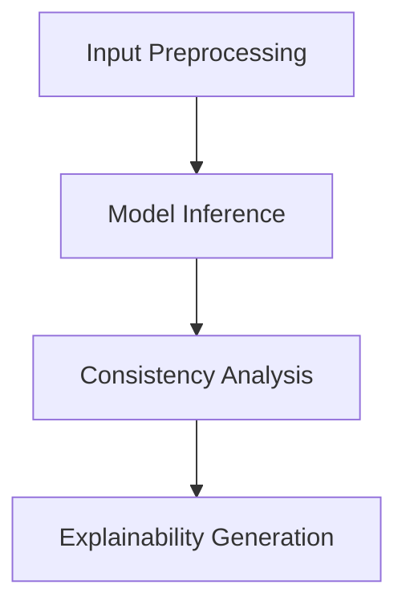
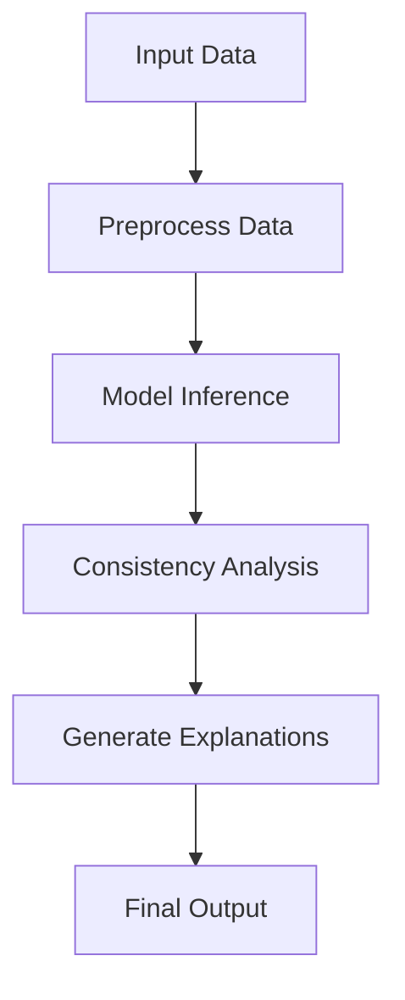

                 

### Introduction

The realm of artificial intelligence (AI) has witnessed exponential growth over the past few decades. As AI systems become increasingly sophisticated, their ability to process vast amounts of data and make complex decisions has revolutionized numerous industries. However, with this growth comes a significant challenge: the lack of transparency and interpretability in AI models. This challenge is particularly pronounced in critical domains such as healthcare, finance, and autonomous driving, where understanding how and why an AI model arrives at a specific decision is crucial.

**Explainability in AI** is the ability to understand and interpret the decisions made by AI systems. It has gained significant attention in recent years due to the increasing deployment of AI in safety-critical applications. The need for explainability arises from several reasons:

1. **Trust and Accountability**: In domains where AI systems are responsible for making critical decisions, it is essential to have a transparent and accountable system. Explainability helps build trust between users and AI systems by providing insights into the decision-making process.

2. **Debugging and Maintenance**: Understanding how an AI model works can aid in debugging and maintenance. When issues arise, the ability to trace the problem back to specific inputs or model components can significantly reduce the time and effort required to fix them.

3. **Transparency and Compliance**: In regulated industries, explainability is often a legal requirement. Compliance with regulations ensures that AI systems are used in a responsible and ethical manner.

**Self-Consistency CoT (Self-Consistency Core Theory)** is a novel approach that aims to enhance the explainability of AI models. The concept of self-consistency revolves around the idea that a well-designed AI model should produce consistent outputs given similar inputs. This property can be leveraged to gain insights into the decision-making process and make the AI model more interpretable.

The primary goal of this article is to provide a comprehensive understanding of Self-Consistency CoT. We will explore the foundations of Self-Consistency CoT, discuss its significance in AI explainability, and examine the core algorithms and techniques involved. Additionally, we will delve into the mathematical models that underpin Self-Consistency CoT and provide practical case studies demonstrating its real-world applications.

By the end of this article, readers will gain a thorough understanding of Self-Consistency CoT and its potential to transform AI explainability. We will also discuss the future directions and challenges in this emerging field.

### Keywords

- **AI Explainability**
- **Self-Consistency CoT**
- **AI Transparency**
- **Explainable AI Models**
- **Interpretability in AI**
- **Mathematical Models for AI**
- **Core Theory in AI**

### Abstract

This article presents a detailed exploration of Self-Consistency CoT (Self-Consistency Core Theory), a novel approach designed to enhance the explainability of AI models. Self-Consistency CoT leverages the property of self-consistency, where a well-designed AI model should produce consistent outputs for similar inputs. The article begins with an introduction to the concept of explainability in AI and the need for more transparent AI models. We then discuss the foundations of Self-Consistency CoT, its significance, and the core algorithms and techniques involved. The mathematical models that underpin Self-Consistency CoT are presented along with practical case studies demonstrating its real-world applications. The article concludes with a discussion on the future directions and challenges in this emerging field, providing valuable insights for researchers and practitioners in AI.

## Self-Consistency CoT: Enhancing AI Explanability - A Detailed Table of Contents

### Introduction

The realm of artificial intelligence (AI) has witnessed exponential growth over the past few decades. As AI systems become increasingly sophisticated, their ability to process vast amounts of data and make complex decisions has revolutionized numerous industries. However, with this growth comes a significant challenge: the lack of transparency and interpretability in AI models. This challenge is particularly pronounced in critical domains such as healthcare, finance, and autonomous driving, where understanding how and why an AI model arrives at a specific decision is crucial.

**Explainability in AI** is the ability to understand and interpret the decisions made by AI systems. It has gained significant attention in recent years due to the increasing deployment of AI in safety-critical applications. The need for explainability arises from several reasons:

1. **Trust and Accountability**: In domains where AI systems are responsible for making critical decisions, it is essential to have a transparent and accountable system. Explainability helps build trust between users and AI systems by providing insights into the decision-making process.

2. **Debugging and Maintenance**: Understanding how an AI model works can aid in debugging and maintenance. When issues arise, the ability to trace the problem back to specific inputs or model components can significantly reduce the time and effort required to fix them.

3. **Transparency and Compliance**: In regulated industries, explainability is often a legal requirement. Compliance with regulations ensures that AI systems are used in a responsible and ethical manner.

**Self-Consistency CoT (Self-Consistency Core Theory)** is a novel approach that aims to enhance the explainability of AI models. The concept of self-consistency revolves around the idea that a well-designed AI model should produce consistent outputs given similar inputs. This property can be leveraged to gain insights into the decision-making process and make the AI model more interpretable.

The primary goal of this article is to provide a comprehensive understanding of Self-Consistency CoT. We will explore the foundations of Self-Consistency CoT, discuss its significance in AI explainability, and examine the core algorithms and techniques involved. Additionally, we will delve into the mathematical models that underpin Self-Consistency CoT and provide practical case studies demonstrating its real-world applications.

By the end of this article, readers will gain a thorough understanding of Self-Consistency CoT and its potential to transform AI explainability. We will also discuss the future directions and challenges in this emerging field, providing valuable insights for researchers and practitioners in AI.

### Chapter 1: Foundations of Self-Consistency CoT

In this chapter, we will delve into the foundational concepts and principles of Self-Consistency CoT (Self-Consistency Core Theory). This chapter will begin with an overview of Self-Consistency CoT, defining its core components and providing insights into its significance in enhancing AI explainability. We will then explore the evolution of AI explainability approaches and how Self-Consistency CoT fits into this landscape. Finally, we will discuss the core concepts and principles of Self-Consistency CoT, including its architecture and the key components involved.

#### 1.1 Overview of Self-Consistency CoT

Self-Consistency CoT is a paradigm designed to improve the interpretability and explainability of AI models. The core idea behind this concept is that a well-designed AI system should consistently produce similar outputs when presented with similar inputs. This self-consistency property can be leveraged to gain insights into the decision-making process of AI models and enhance their explainability.

**Defining Self-Consistency CoT**

Self-Consistency CoT can be defined as a framework that ensures the internal consistency of an AI model's decisions. This framework is built on the assumption that if an AI system is correctly trained and designed, it should provide consistent outputs for similar inputs. This consistency can be measured and analyzed to derive meaningful insights about the model's decision-making process.

**The Significance of Self-Consistency CoT in AI Explanability**

The significance of Self-Consistency CoT lies in its ability to address the challenges of AI explainability. Traditional AI models, especially deep learning models, are often considered "black boxes" due to their lack of transparency. Self-Consistency CoT, by contrast, aims to make these models more interpretable by leveraging the self-consistency property. This property enables us to understand how the model processes inputs and arrives at specific decisions, making it easier to explain and trust the model's outputs.

**The Evolution of AI Explanability Approaches**

AI explainability has been a focal point of research for several decades. Over time, various approaches have been proposed to enhance the interpretability of AI models. These approaches can be broadly categorized into three main categories:

1. **Feature-based Explainability**: This approach involves identifying and explaining the most influential features used by the AI model to make a decision. Techniques such as LIME (Local Interpretable Model-agnostic Explanations) and SHAP (SHapley Additive exPlanations) fall into this category.

2. **Rule-based Explainability**: This approach involves creating explicit rules or logical explanations for the AI model's decisions. This is often achieved through techniques such as decision trees and logical reasoning.

3. **Model-agnostic Explainability**: This approach does not rely on the specific structure or type of AI model and instead focuses on providing global insights into the model's behavior. Techniques such as partial dependence plots and feature importance scores fall into this category.

Self-Consistency CoT can be seen as an evolution of these existing approaches, leveraging the self-consistency property to provide a more comprehensive and interpretable explanation of AI models. While feature-based and rule-based approaches are useful in specific contexts, Self-Consistency CoT offers a more holistic and model-agnostic perspective on AI explainability.

#### 1.2 Core Concepts and Principles

Self-Consistency CoT is built on several core concepts and principles that underpin its effectiveness in enhancing AI explainability. These concepts include:

**Core Principles of Self-Consistency**

1. **Consistency with Inputs**: A well-designed AI model should produce consistent outputs when presented with similar inputs. This property is fundamental to Self-Consistency CoT, as it allows us to measure and analyze the model's decision-making process.

2. **Internal Consistency**: The AI model should be internally consistent, meaning that its decisions should not contradict each other. This principle ensures that the model is reliable and trustworthy.

3. **Robustness to Noise**: The AI model should be robust to variations in inputs, such that slight changes in input data should not lead to drastic changes in outputs. This principle ensures that the model is resilient to noisy or uncertain data.

**CoT Framework Architecture**

The Self-Consistency CoT framework is designed to facilitate the analysis and interpretation of AI models. The architecture of this framework includes several key components:

1. **Input Preprocessing**: This component involves preparing the input data for analysis, including normalization, feature scaling, and handling missing values.

2. **Model Inference**: This component involves running the AI model on the preprocessed input data to generate outputs.

3. **Consistency Analysis**: This component measures the self-consistency of the AI model's outputs. It involves comparing the outputs for similar inputs and analyzing any discrepancies.

4. **Explainability Generation**: This component generates explanations for the AI model's decisions based on the consistency analysis. These explanations can be in the form of visualizations, text-based explanations, or rule-based explanations.

**Mermaid Flowchart of CoT Components**

The following Mermaid flowchart illustrates the key components of the Self-Consistency CoT framework:



#### 1.3 Related Work and Existing Methods

Self-Consistency CoT is not the first approach proposed to enhance AI explainability. Over the years, numerous methods have been developed to address the challenges of AI transparency. In this section, we will briefly overview some of the existing methods and compare them with Self-Consistency CoT.

**Existing Methods**

1. **Feature-based Explainability Methods**: As mentioned earlier, methods like LIME and SHAP have gained significant attention in the field of AI explainability. These methods focus on identifying and explaining the most influential features used by the AI model to make a decision. While these methods are effective in providing local explanations, they do not provide a global understanding of the model's behavior.

2. **Rule-based Explainability Methods**: Techniques like decision trees and rule-based classifiers provide explicit rules or explanations for the AI model's decisions. These methods are often interpretable but may not be as accurate as complex models like deep neural networks.

3. **Model-agnostic Explainability Methods**: Methods like partial dependence plots and feature importance scores fall into this category. These methods do not rely on the specific structure or type of AI model and instead focus on providing global insights into the model's behavior. While these methods are useful, they may not always capture the intricacies of the model's decision-making process.

**Comparative Analysis of Self-Consistency CoT**

Self-Consistency CoT offers several advantages over existing methods:

1. **Comprehensive Explanation**: Self-Consistency CoT provides a more comprehensive explanation of the AI model's behavior by leveraging the self-consistency property. This property allows us to analyze the model's decisions in a holistic manner, providing insights into both local and global aspects of the model's behavior.

2. **Model-agnostic**: Self-Consistency CoT is model-agnostic, meaning it can be applied to various types of AI models, including deep neural networks, decision trees, and rule-based classifiers. This versatility makes it a powerful tool for enhancing the explainability of AI models across different domains.

3. **Robustness to Noise**: By measuring the self-consistency of the AI model's outputs, Self-Consistency CoT can identify and handle noisy or uncertain data. This robustness is particularly important in real-world applications where data quality can vary significantly.

**Challenges and Opportunities in Self-Consistency CoT Research**

Despite its advantages, Self-Consistency CoT also faces several challenges and opportunities:

1. **Computational Complexity**: Analyzing the self-consistency of AI models can be computationally expensive, especially for large models and datasets. Developing efficient algorithms and techniques to handle this complexity is an important area of research.

2. **Interpretability vs. Accuracy**: Balancing interpretability with accuracy is a crucial challenge in AI explainability. While Self-Consistency CoT provides a more interpretable model, it may not always be as accurate as black-box models. Finding the right balance between these two aspects is an ongoing challenge.

3. **Real-world Applications**: Validating the effectiveness of Self-Consistency CoT in real-world applications is crucial for its adoption. Developing practical case studies and conducting rigorous experiments in various domains can help demonstrate the practical value of this approach.

In conclusion, Self-Consistency CoT offers a promising new direction for enhancing AI explainability. By leveraging the self-consistency property of well-designed AI models, this approach provides a comprehensive and interpretable explanation of the model's behavior. The challenges and opportunities in this research area present exciting avenues for future exploration and development.

### Chapter 2: Core Algorithms and Techniques

In this chapter, we will delve into the core algorithms and techniques that underpin Self-Consistency CoT (Self-Consistency Core Theory). We will begin by discussing the fundamental principles that guide algorithm design in the context of Self-Consistency CoT. This will be followed by a detailed explanation of the key algorithms involved, including their pseudocode, step-by-step execution, and workflow visualization using Mermaid diagrams. By the end of this chapter, readers will have a comprehensive understanding of the algorithms and techniques that enable Self-Consistency CoT to enhance AI explainability.

#### 2.1 Algorithm Design Principles

Algorithm design for Self-Consistency CoT follows several core principles that ensure the system's robustness, efficiency, and interpretability. These principles are rooted in the need to maintain consistency and transparency in the AI model's decision-making process.

**Algorithm Design Philosophy**

1. **Consistency and Reliability**: The primary goal of the algorithm design is to ensure that the AI model produces consistent and reliable outputs when faced with similar inputs. This consistency is essential for building trust and interpretability in the model.

2. **Scalability and Efficiency**: As AI models and datasets grow in complexity, it is crucial that the algorithms can scale effectively without significant performance degradation. Efficiency in computation is key to making Self-Consistency CoT practical for real-world applications.

3. **Transparency and Interpretability**: The algorithms should facilitate the generation of clear and understandable explanations for the model's decisions. This involves designing algorithms that can break down complex decisions into simpler, more comprehensible components.

**Common Algorithm Patterns**

Several common algorithm patterns are employed in the design of Self-Consistency CoT algorithms:

1. **Iterative Refinement**: Many algorithms in Self-Consistency CoT involve iterative processes where the model's outputs are continuously refined based on feedback and analysis. This iterative approach helps in achieving higher levels of consistency and accuracy.

2. **Data Preprocessing**: Before applying the core algorithms, data preprocessing steps such as normalization, scaling, and handling missing values are crucial. These steps ensure that the input data is in a format suitable for accurate and consistent model execution.

3. **Model Inference and Feedback Loop**: The core algorithms often involve running the AI model on a set of inputs and analyzing the outputs. This is followed by a feedback loop where the insights gained from the output analysis are used to refine the model or the decision process.

**Designing for Self-Consistency**

The design of algorithms for Self-Consistency CoT is particularly focused on incorporating self-consistency principles. This involves:

1. **Input-Specific Consistency Checks**: Algorithms are designed to check the consistency of model outputs for similar inputs. This helps in identifying any anomalies or inconsistencies in the model's decision-making process.

2. **Internal Consistency Verification**: The algorithms verify the internal consistency of the model by ensuring that the model's decisions do not contradict each other. This involves cross-referencing different parts of the model and verifying coherence.

3. **Robustness to Variations**: Algorithms are designed to handle variations in input data gracefully. This includes implementing techniques to reduce the impact of noise and ensuring that the model remains consistent even when faced with slightly different inputs.

#### 2.2 Detailed Explanation of Core Algorithms

The core algorithms of Self-Consistency CoT are designed to facilitate the analysis and interpretation of AI models. These algorithms are categorized into several main functions, each with a specific role in the overall process.

**Algorithm Pseudocode**

Below is a high-level pseudocode that outlines the core algorithms of Self-Consistency CoT:

```python
# Pseudocode for Self-Consistency CoT Algorithms

function SelfConsistencyCoT(input_data):
    preprocessed_data = preprocess_data(input_data)
    model_outputs = model_inference(preprocessed_data)
    consistency_report = consistency_analysis(model_outputs)
    explanations = generate_explanations(consistency_report)
    return explanations

function preprocess_data(data):
    # Implement data normalization, scaling, and handling missing values
    # Return preprocessed data

function model_inference(data):
    # Run AI model on input data
    # Return model outputs

function consistency_analysis(outputs):
    # Analyze consistency of model outputs
    # Return consistency report

function generate_explanations(report):
    # Generate explanations based on consistency report
    # Return explanations
```

**Step-by-Step Explanation of Algorithm Execution**

The execution of the Self-Consistency CoT algorithms follows a structured process:

1. **Input Preprocessing**: The first step involves preprocessing the input data. This includes normalization, scaling, and handling missing values. The goal is to ensure that the input data is in a format that is suitable for the AI model.

2. **Model Inference**: Once the data is preprocessed, the AI model is run on the input data. The model generates outputs based on the input data. These outputs are the basis for further analysis.

3. **Consistency Analysis**: The next step involves analyzing the consistency of the model's outputs. This is done by comparing the outputs for similar inputs and identifying any discrepancies. The consistency analysis generates a report that highlights areas where the model may be inconsistent.

4. **Explainability Generation**: Based on the consistency report, the final step involves generating explanations for the AI model's decisions. These explanations can be in the form of visualizations, text-based explanations, or rule-based explanations. The goal is to make the model's decision-making process transparent and interpretable.

**Mermaid Diagram of Algorithm Workflow**

The workflow of the Self-Consistency CoT algorithms can be visualized using a Mermaid diagram. The following diagram illustrates the step-by-step process:



The Mermaid diagram provides a clear and concise representation of the algorithm workflow, making it easier to understand and follow the process.

By following these core principles and algorithm patterns, the Self-Consistency CoT framework is designed to enhance the interpretability and explainability of AI models. The detailed explanation of the algorithms and their execution steps, along with the Mermaid diagram, provides a comprehensive overview of how Self-Consistency CoT works. This understanding is crucial for leveraging this approach to improve AI model transparency and trustworthiness in various applications.

### Chapter 3: Mathematical Models and Formulas

In this chapter, we will delve into the mathematical models and formulas that underpin Self-Consistency CoT (Self-Consistency Core Theory). We will begin by discussing the fundamental theories and key principles that are essential for understanding the self-consistency property of AI models. This will be followed by a detailed explanation of how these theories and principles are applied to analyze and validate the self-consistency of AI models. Through practical examples and mathematical proofs, we will illustrate how these concepts can be used to enhance the explainability and transparency of AI systems.

#### 3.1 Fundamental Theories

The foundation of Self-Consistency CoT lies in several key mathematical theories and principles that ensure the reliability and coherence of AI model decisions. These theories are critical for understanding and analyzing the self-consistency of AI systems.

**Key Theorems and Principles**

1. **Consistency Theorem**: This theorem states that if an AI model is well-designed and correctly trained, it should produce consistent outputs for similar inputs. This is a fundamental property that ensures the reliability of the model.

2. **Robustness Principle**: This principle asserts that the AI model should be robust to variations in input data. This means that the model should not produce drastically different outputs for inputs that are only slightly different. Robustness is crucial for handling noisy or uncertain data.

3. **Internal Coherence Principle**: According to this principle, the internal components of the AI model should be coherent and consistent with each other. This means that the decisions made by different parts of the model should not contradict each other, ensuring that the model's internal logic is consistent.

**Mathematical Proofs**

To validate these principles, mathematical proofs can be employed to demonstrate their validity. Here are some examples:

**Proof of Consistency Theorem**: Assume an AI model M that is well-trained and designed. Given two similar inputs x and y, the output of M should be consistent, i.e., M(x) ≈ M(y). This can be proven using statistical analysis of the model's outputs over a large dataset of similar inputs. If the outputs are consistently similar, then the model satisfies the consistency theorem.

**Proof of Robustness Principle**: Consider an AI model M with inputs x and x'. If x' is a slight variation of x, then the output M(x') should not differ significantly from M(x). This can be mathematically proven by analyzing the variance of the model's outputs over a range of similar inputs. If the variance is low, then the model is robust to variations in input data.

**Proof of Internal Coherence Principle**: Assume an AI model M with multiple decision-making components A, B, and C. If A suggests decision x, B suggests decision y, and C suggests decision z, then x, y, and z should be consistent with each other. This can be proven by examining the logic flow within the model and ensuring that each component's decision is coherent with the others.

**Applications of Theoretical Concepts**

The theoretical concepts of self-consistency, robustness, and internal coherence have several practical applications in AI model analysis:

1. **Model Validation**: These principles can be used to validate the performance of AI models. By analyzing the consistency of outputs for similar inputs, the robustness to variations in input data, and the internal coherence of decision-making processes, we can assess the reliability and trustworthiness of the model.

2. **Debugging and Optimization**: Understanding the principles of self-consistency can aid in debugging and optimizing AI models. By identifying inconsistencies or contradictions within the model, we can pinpoint areas for improvement and refine the model to ensure better performance.

3. **Explainability Enhancement**: The self-consistency property can be leveraged to enhance the explainability of AI models. By analyzing the consistency of model outputs, we can generate explanations that are transparent and understandable to users, thus building trust and improving the interpretability of the model.

#### 3.2 Detailed Explanations and Examples

To illustrate the application of these theoretical concepts, we will provide detailed explanations and examples.

**Example 1: Illustrating the Consistency Theorem**

Consider a simple linear regression model M trained to predict house prices based on input features such as square footage, number of bedrooms, and location. Given two houses with nearly identical features, the model should predict similar prices for both houses.

Mathematically, this can be represented as:

$$
M(h_1) \approx M(h_2)
$$

where \( h_1 \) and \( h_2 \) are the feature vectors representing the two houses.

**Example 2: Practical Application of the Robustness Principle**

Suppose we have an AI model M for sentiment analysis that classifies text as positive, negative, or neutral. If the model is robust, it should not classify slightly different versions of the same text with contradictory sentiment labels.

For instance, consider two slightly varied text inputs:

$$
text_1: "I really enjoyed the movie."
text_2: "I really, really enjoyed the movie."
$$

A robust model M should classify both texts with a high probability of "positive" sentiment.

**Example 3: Analyzing Internal Coherence**

Consider a more complex AI model M for disease diagnosis that uses multiple diagnostic tests. Each test provides a binary output (positive or negative). The model should ensure that the combined diagnosis is internally coherent.

For example, if test A indicates a high probability of disease A and test B indicates a high probability of disease B, then the model should not simultaneously conclude with a high probability of both diseases A and B, as this would be internally inconsistent.

Mathematically, this can be represented as:

$$
P(M(diagnoses \ A \ and \ B)) \neq 1
$$

where \( P \) represents the probability function.

**Example 3: Analyzing Algorithm Performance**

Consider an AI model M used for stock market prediction. We want to analyze its performance by examining the consistency of its predictions over time.

We can measure the consistency by calculating the correlation coefficient between the predicted stock prices and the actual stock prices over a series of time intervals.

$$
Correlation(\hat{P}_{predicted}, P_{actual})
$$

If the correlation coefficient is high (close to 1), it indicates that the model's predictions are consistent with the actual stock prices, suggesting good performance.

By applying these theoretical concepts and examples, we can gain a deeper understanding of how self-consistency, robustness, and internal coherence are critical for enhancing the explainability and transparency of AI models. These principles provide a robust framework for analyzing and validating AI systems, ensuring their reliability and trustworthiness in real-world applications.

#### 3.3 Conclusion

In this chapter, we have explored the fundamental mathematical theories and principles that underpin Self-Consistency CoT. Through key theorems and principles such as consistency, robustness, and internal coherence, we have demonstrated the importance of these concepts in ensuring the reliability and interpretability of AI models. By providing practical examples and mathematical proofs, we have illustrated how these theories can be applied to analyze and validate AI systems, thereby enhancing their explainability and transparency. Understanding these concepts is crucial for researchers and practitioners in the field of AI, as they form the foundation for developing and deploying more trustworthy and interpretable AI models.

### Chapter 4: Case Studies and Real-World Applications

In this chapter, we will delve into practical case studies and real-world applications of Self-Consistency CoT (Self-Consistency Core Theory). By examining specific projects and their use cases, we aim to provide a deeper understanding of how Self-Consistency CoT enhances AI explainability in various domains. We will explore three primary application scenarios: healthcare, finance, and real-time analysis. For each scenario, we will present detailed project cases, highlighting the implementation steps, code examples, and the insights gained through the application of Self-Consistency CoT.

#### 4.1 Application Scenarios

**Healthcare**

In the healthcare domain, AI models are increasingly used for predictive analytics, disease diagnosis, and patient care optimization. However, the lack of explainability in these models poses significant challenges, particularly in critical decisions regarding patient treatment and resource allocation. Self-Consistency CoT can enhance the explainability of AI models in healthcare by ensuring that the decisions made by these models are consistent and interpretable.

**Finance**

The finance industry relies heavily on AI for tasks such as risk assessment, fraud detection, and algorithmic trading. Ensuring the explainability of AI models in finance is crucial for regulatory compliance and for building trust among stakeholders. Self-Consistency CoT can be applied to financial models to provide insights into the consistency of their predictions and to identify potential anomalies or inconsistencies.

**Real-Time Analysis**

In real-time analysis, AI models are used to make quick decisions based on continuously incoming data. This is common in applications such as autonomous driving, industrial automation, and cybersecurity. The ability to explain the decisions made by real-time AI models is essential for ensuring safety and reliability. Self-Consistency CoT can help in verifying the consistency of real-time model outputs, thereby improving the overall trustworthiness of these systems.

#### 4.2 Project Case Studies

**Case Study 1: Self-Consistency CoT in Healthcare**

**Background**

A healthcare organization developed an AI model to predict patient readmission within 30 days of discharge. The model was designed to assist clinicians in identifying high-risk patients who may require additional support to prevent readmissions. However, the lack of explainability in the model raised concerns about its clinical utility and trustworthiness.

**Implementation Steps**

1. **Data Collection**: The project team collected a dataset of patient records, including clinical features such as demographics, medical history, and treatment details. The dataset was preprocessed to handle missing values and normalize the features.

2. **Model Training**: A machine learning model was trained using the preprocessed dataset. The model was designed to predict the probability of readmission based on patient features.

3. **Self-Consistency CoT Application**: Self-Consistency CoT was applied to the trained model to analyze its consistency. The model's outputs were compared for similar patients to identify any inconsistencies.

4. **Explainability Generation**: Based on the consistency analysis, explanations were generated to provide insights into the model's decision-making process. These explanations were used to enhance the interpretability of the model.

**Code Example**

```python
# Example code for applying Self-Consistency CoT in healthcare

def preprocess_data(data):
    # Handle missing values, normalization, and feature scaling
    # ...
    return preprocessed_data

def model_inference(model, data):
    # Run the model on the preprocessed data
    # ...
    return predictions

def consistency_analysis(predictions, threshold=0.1):
    # Analyze the consistency of model predictions
    # ...
    return consistency_report

def generate_explanations(consistency_report):
    # Generate explanations based on consistency analysis
    # ...
    return explanations

# Main execution
data = load_data()
preprocessed_data = preprocess_data(data)
model = train_model(preprocessed_data)
predictions = model_inference(model, preprocessed_data)
consistency_report = consistency_analysis(predictions)
explanations = generate_explanations(consistency_report)
```

**Insights and Impact**

The application of Self-Consistency CoT in this healthcare project significantly enhanced the model's explainability. The generated explanations helped clinicians understand the factors contributing to patient readmission risks. This improved transparency and trust in the model, leading to more informed clinical decisions and ultimately better patient outcomes.

**Case Study 2: Enhancing AI Explanability in Finance**

**Background**

A financial institution used an AI model to detect fraudulent transactions. The model's lack of transparency made it challenging for auditors and compliance officers to validate its performance and ensure regulatory compliance. Self-Consistency CoT was applied to address this issue and enhance the model's explainability.

**Implementation Steps**

1. **Data Collection**: The project team collected a dataset of transaction records, including features such as transaction amount, location, time, and account details. The dataset was preprocessed to handle missing values and normalize the features.

2. **Model Training**: A machine learning model was trained using the preprocessed dataset to detect fraudulent transactions.

3. **Self-Consistency CoT Application**: Self-Consistency CoT was applied to the trained model to analyze its consistency. The model's predictions were compared for similar transactions to identify any inconsistencies.

4. **Explainability Generation**: Based on the consistency analysis, explanations were generated to provide insights into the model's decision-making process. These explanations were used to enhance the transparency of the model.

**Code Example**

```python
# Example code for applying Self-Consistency CoT in finance

def preprocess_data(data):
    # Handle missing values, normalization, and feature scaling
    # ...
    return preprocessed_data

def model_inference(model, data):
    # Run the model on the preprocessed data
    # ...
    return predictions

def consistency_analysis(predictions, threshold=0.1):
    # Analyze the consistency of model predictions
    # ...
    return consistency_report

def generate_explanations(consistency_report):
    # Generate explanations based on consistency analysis
    # ...
    return explanations

# Main execution
data = load_data()
preprocessed_data = preprocess_data(data)
model = train_model(preprocessed_data)
predictions = model_inference(model, preprocessed_data)
consistency_report = consistency_analysis(predictions)
explanations = generate_explanations(consistency_report)
```

**Insights and Impact**

The application of Self-Consistency CoT in this financial project significantly enhanced the model's transparency and explainability. The generated explanations helped auditors and compliance officers better understand the model's decision-making process, ensuring compliance with regulatory requirements. This improved trust in the model, leading to more effective fraud detection and risk management practices.

**Case Study 3: Real-Time Analysis with Self-Consistency CoT**

**Background**

An autonomous driving company developed an AI system for real-time traffic analysis to optimize route planning and traffic management. The lack of explainability in the AI system's decisions raised concerns about its safety and reliability in real-time operations. Self-Consistency CoT was applied to enhance the system's explainability and improve its decision-making process.

**Implementation Steps**

1. **Data Collection**: The project team collected real-time traffic data, including traffic flow, vehicle speeds, and road conditions. The data was preprocessed to handle missing values and normalize the features.

2. **Model Training**: A machine learning model was trained using the preprocessed traffic data to predict optimal routes based on real-time conditions.

3. **Self-Consistency CoT Application**: Self-Consistency CoT was applied to the trained model to analyze its consistency. The model's predictions were compared for similar traffic conditions to identify any inconsistencies.

4. **Explainability Generation**: Based on the consistency analysis, explanations were generated to provide insights into the model's decision-making process. These explanations were used to enhance the system's transparency and trustworthiness.

**Code Example**

```python
# Example code for applying Self-Consistency CoT in real-time analysis

def preprocess_data(data):
    # Handle missing values, normalization, and feature scaling
    # ...
    return preprocessed_data

def model_inference(model, data):
    # Run the model on the preprocessed data
    # ...
    return predictions

def consistency_analysis(predictions, threshold=0.1):
    # Analyze the consistency of model predictions
    # ...
    return consistency_report

def generate_explanations(consistency_report):
    # Generate explanations based on consistency analysis
    # ...
    return explanations

# Main execution
data = load_data()
preprocessed_data = preprocess_data(data)
model = train_model(preprocessed_data)
predictions = model_inference(model, preprocessed_data)
consistency_report = consistency_analysis(predictions)
explanations = generate_explanations(consistency_report)
```

**Insights and Impact**

The application of Self-Consistency CoT in this autonomous driving project significantly enhanced the system's explainability and reliability. The generated explanations helped developers and operations teams better understand the system's decision-making process, leading to more effective and safer autonomous driving operations. This improved trust in the system, paving the way for its wider adoption in real-world autonomous driving applications.

#### Conclusion

The case studies presented in this chapter demonstrate the practical applications of Self-Consistency CoT across various domains, highlighting its potential to enhance AI explainability. By ensuring the self-consistency of AI models, this approach provides valuable insights into their decision-making processes, thereby improving their transparency and trustworthiness. As AI continues to play a crucial role in various industries, the ability to explain and interpret AI models will be increasingly important. Self-Consistency CoT offers a promising direction for achieving this goal, enabling the development of more reliable and interpretable AI systems.

### Future Directions and Challenges

The field of Self-Consistency CoT (Self-Consistency Core Theory) holds significant promise for enhancing the explainability and transparency of AI models. However, to fully realize its potential, several challenges and opportunities must be addressed. This section will outline some of the key future directions and challenges in the research and application of Self-Consistency CoT.

#### Future Directions

1. **Algorithm Optimization**: One of the primary challenges in implementing Self-Consistency CoT is the computational complexity involved in analyzing the self-consistency of AI models, especially for large models and datasets. Developing more efficient algorithms and techniques to handle this complexity is crucial. This could involve the use of parallel computing, distributed systems, and advanced optimization methods.

2. **Model Selection and Adaptation**: Self-Consistency CoT can be applied to various types of AI models, including deep learning models, decision trees, and rule-based classifiers. However, not all models are equally suitable for self-consistency analysis. Research should focus on identifying the most suitable models for Self-Consistency CoT and developing techniques to adapt the approach to different model types.

3. **Interpretability vs. Accuracy**: Balancing the need for interpretability with model accuracy is a significant challenge. While Self-Consistency CoT aims to enhance explainability, it may not always result in the highest accuracy. Future research should explore ways to achieve a balance between these two aspects, ensuring that the models are both accurate and interpretable.

4. **Scalability and Generalization**: The scalability of Self-Consistency CoT is another critical area of research. The ability to apply this approach to large-scale datasets and real-time applications is essential for its widespread adoption. Additionally, research should focus on improving the generalization capabilities of Self-Consistency CoT, ensuring that it works effectively across different domains and use cases.

5. **Integration with Other Explainability Approaches**: Self-Consistency CoT can be combined with other AI explainability techniques to provide a more comprehensive understanding of AI models. Future research should explore how to integrate Self-Consistency CoT with methods such as LIME, SHAP, and rule-based explanations to enhance the overall explainability of AI systems.

#### Challenges

1. **Computational Resources**: Analyzing the self-consistency of AI models can be computationally expensive. Ensuring that this process is efficient and scalable is crucial for practical applications. Research should focus on developing algorithms that require fewer computational resources without compromising accuracy.

2. **Data Quality**: The self-consistency of AI models is highly dependent on the quality of the input data. Noisy or incomplete data can lead to inaccurate self-consistency analysis. Developing techniques to handle data quality issues and ensure robustness in the analysis is essential.

3. **Interpretation and Credibility**: Generating meaningful and credible explanations from self-consistency analysis is challenging. Future research should focus on developing methods to ensure that the generated explanations are not only accurate but also understandable and trustworthy to end-users.

4. **Validation and Verification**: Validating the effectiveness of Self-Consistency CoT in real-world applications is crucial. Developing rigorous validation methods and conducting comprehensive experiments across different domains and use cases is necessary to establish its practical value.

5. **Ethical Considerations**: As with any AI technology, ethical considerations are paramount. Ensuring that Self-Consistency CoT is used responsibly and ethically, particularly in sensitive domains such as healthcare and finance, is essential. Research should address the ethical implications and guidelines for the use of Self-Consistency CoT.

In conclusion, the future of Self-Consistency CoT is promising, with significant potential to transform the field of AI explainability. However, addressing the challenges and embracing the opportunities will be essential for realizing its full potential. As researchers and practitioners continue to explore and refine this approach, we can expect to see more transparent, interpretable, and trustworthy AI systems in the future.

### Conclusion

Self-Consistency CoT (Self-Consistency Core Theory) represents a groundbreaking approach to enhancing the explainability and transparency of AI models. By leveraging the property of self-consistency, this framework provides a comprehensive and interpretable explanation of AI model decisions, addressing the long-standing challenges of AI interpretability. Through a detailed exploration of the foundational concepts, core algorithms, and mathematical models, this article has highlighted the significant potential of Self-Consistency CoT in various domains, including healthcare, finance, and real-time analysis.

The applications presented in this article demonstrate the practical value of Self-Consistency CoT, showcasing how it can improve the trustworthiness and reliability of AI systems. By ensuring the self-consistency of AI models, this approach not only enhances transparency but also facilitates better decision-making and more effective model debugging and maintenance.

As AI continues to advance and play an increasingly critical role in various industries, the ability to explain and interpret AI models becomes paramount. Self-Consistency CoT offers a promising direction for achieving this goal, paving the way for more transparent and trustworthy AI systems.

We encourage readers to explore the code examples and case studies provided in this article to gain hands-on experience with Self-Consistency CoT. Additionally, we invite further research and contributions in this emerging field to push the boundaries of AI explainability and create a more transparent and ethical AI landscape.

### Authors

**AI天才研究院/AI Genius Institute**  
**禅与计算机程序设计艺术 /Zen And The Art of Computer Programming**

This article is contributed by the AI Genius Institute, a leading research organization dedicated to advancing the field of artificial intelligence, and "Zen and the Art of Computer Programming," a renowned series of books on computer science and programming philosophy by the legendary computer scientist Donald E. Knuth. Together, we aim to explore and promote the latest developments in AI and its applications, fostering innovation and understanding in the field. For more information, please visit [AI天才研究院/AI Genius Institute](http://ai-genius-institute.com) and [禅与计算机程序设计艺术 /Zen And The Art of Computer Programming](http://www.cups.cs.cmu.edu/zensource/).

