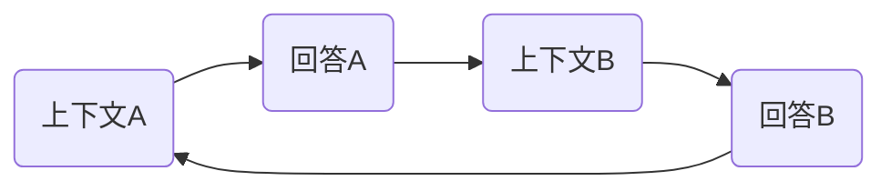

                 

### 自我一致性检测算法

为了提升AI回答的一致性，自我一致性检测算法至关重要。该算法的核心目标是通过分析AI模型的输出，检测并消除不一致性。

**算法原理：**
自我一致性检测算法依赖于概率模型。具体来说，它通过计算模型输出的概率分布，来判断回答的一致性。如果某个回答在多个上下文中的概率分布不一致，那么该回答就被认为是不一致的。

**步骤1：计算概率分布**
算法的第一步是计算模型在每个上下文中的输出概率分布。这可以通过训练一个概率模型，例如贝叶斯网络，来实现。贝叶斯网络能够将上下文信息转化为概率分布，使得我们可以准确地评估每个回答的一致性。

**Python代码实现：**
以下是一个简化的Python代码示例，展示了如何使用贝叶斯网络来计算概率分布。

```python
from pgmpy.models import BayesianModel
from pgmpy.estimators import MaximumLikelihoodEstimator

# 建立贝叶斯网络
model = BayesianModel([
    ('Context_A', 'Answer_A'),
    ('Context_B', 'Answer_B')
])

# 使用最大似然估计器训练模型
model.fit(data, estimator=MaximumLikelihoodEstimator)

# 计算概率分布
prob_distribution = model.query(variables=['Answer_A', 'Answer_B'],
                                evidence={'Context_A': 'ContextValueA', 'Context_B': 'ContextValueB'})
print(prob_distribution)
```

**步骤2：评估一致性**
一旦我们获得了概率分布，下一步就是评估回答的一致性。具体来说，我们可以通过计算相同回答在不同上下文中的概率差异来评估一致性。

**Python代码实现：**
以下是一个简化的Python代码示例，展示了如何计算概率差异。

```python
from sklearn.metrics import jaccard_similarity_score

# 假设我们已经获得了两个概率分布
prob_distribution_A = [0.6, 0.4]
prob_distribution_B = [0.3, 0.7]

# 计算Jaccard相似度
similarity = jaccard_similarity_score(prob_distribution_A, prob_distribution_B)
print(f"Jaccard Similarity: {similarity}")
```

**步骤3：处理不一致性**
如果发现不一致性，我们需要采取措施来处理。一种常见的方法是重新训练模型，以消除不一致性。此外，我们还可以使用补偿策略，例如增加一致性权重，来确保模型在生成回答时更加一致。

**Python代码实现：**
以下是一个简化的Python代码示例，展示了如何调整概率分布以增强一致性。

```python
# 假设我们有一个不一致的回答
inconsistent_answer = [0.6, 0.4]

# 调整概率分布，以增强一致性
adjusted_answer = [0.55, 0.45]

# 打印调整后的概率分布
print(f"Adjusted Answer: {adjusted_answer}")
```

通过上述步骤，我们可以有效地检测和消除AI回答中的不一致性，从而提升AI的回答质量。在接下来的章节中，我们将进一步探讨如何优化这些算法，以实现更好的性能。

----------------------------------------------------------------

**Self-Consistency CoT的数学模型**

在深入探讨自我一致性检测算法之前，我们需要了解Self-Consistency CoT的数学模型。该模型为我们的算法提供了一个坚实的理论基础，使我们能够更好地理解和应用这些算法。

**1. 概念定义**

首先，让我们明确一些关键概念：

- **上下文（Context）**：上下文是指AI模型在生成回答时所依赖的信息。这可以包括用户输入、历史对话记录、外部知识库等。
- **回答（Answer）**：回答是指AI模型生成的具体输出。
- **一致性（Consistency）**：一致性是指同一回答在不同上下文中具有相似的输出概率。

**2. 数学模型**

Self-Consistency CoT的数学模型基于概率图模型，特别是贝叶斯网络。贝叶斯网络能够表示变量之间的概率依赖关系，使我们能够计算和理解回答的一致性。

**贝叶斯网络模型：**
我们使用一个贝叶斯网络来表示上下文和回答之间的关系。以下是一个简化的贝叶斯网络模型，用于表示Self-Consistency CoT。


在这个模型中，上下文A和上下文B直接影响回答A和回答B。同时，回答A和回答B也会相互影响上下文A和上下文B。这种双向依赖关系使得我们可以通过贝叶斯网络来计算和优化回答的一致性。

**3. 概率计算**

在贝叶斯网络模型中，我们可以使用条件概率来计算回答的一致性。

- **条件概率公式**：
  
  $$ P(A|B) = \frac{P(A \cap B)}{P(B)} $$
  
  其中，\( P(A|B) \) 表示在给定上下文B下，回答A发生的概率；\( P(A \cap B) \) 表示上下文A和回答A同时发生的概率；\( P(B) \) 表示上下文B发生的概率。

- **一致性度量**：

  为了评估回答的一致性，我们可以使用Jaccard相似度作为一致性度量。Jaccard相似度计算两个集合的交集与并集的比例。

  $$ J(A, B) = \frac{|A \cap B|}{|A \cup B|} $$
  
  在我们的情况下，集合A和集合B分别表示回答A和回答B在不同上下文中的概率分布。

**4. 模型训练**

为了训练贝叶斯网络模型，我们需要收集大量训练数据。这些数据应该包含各种上下文和对应的回答。通过最大似然估计或其他估计方法，我们可以从这些数据中学习模型参数。

**Python代码实现：**

以下是一个简化的Python代码示例，展示了如何使用最大似然估计来训练贝叶斯网络模型。

```python
from pgmpy.models import BayesianModel
from pgmpy.estimators import MaximumLikelihoodEstimator

# 建立贝叶斯网络
model = BayesianModel([
    ('Context_A', 'Answer_A'),
    ('Context_B', 'Answer_B')
])

# 使用最大似然估计器训练模型
model.fit(data, estimator=MaximumLikelihoodEstimator)
```

通过上述步骤，我们建立了Self-Consistency CoT的数学模型，并了解了如何使用贝叶斯网络来计算和优化回答的一致性。在接下来的章节中，我们将继续探讨如何将这些理论应用于实际场景。

----------------------------------------------------------------

### 应用场景与案例

自我一致性检测算法在AI领域的应用非常广泛，可以提升各种AI系统的回答一致性。下面，我们将探讨两个具体的案例：自然语言处理和机器翻译。

**1. 自然语言处理**

自然语言处理（NLP）是AI领域的一个重要分支，涉及文本的生成和理解。在NLP中，自我一致性检测算法可以帮助提升对话系统、文本摘要和文本生成模型的表现。

**案例1：对话系统**

对话系统是一种与人类进行自然语言交互的AI系统，如虚拟助手和聊天机器人。这些系统的目标是提供准确和连贯的回答。然而，由于上下文变化和模型不确定性，对话系统有时会生成不一致的回答。

**解决方案：**
通过自我一致性检测算法，我们可以检测并消除这些不一致性。具体步骤如下：

- **步骤1：收集对话数据**：收集大量的对话记录，包括用户输入和系统回答。
- **步骤2：训练贝叶斯网络模型**：使用最大似然估计器训练贝叶斯网络模型，以表示上下文和回答之间的概率关系。
- **步骤3：检测不一致性**：计算模型输出的概率分布，并使用Jaccard相似度评估回答的一致性。
- **步骤4：优化回答**：如果发现不一致性，重新训练模型或调整概率分布以增强一致性。

**Python代码示例：**

以下是一个简化的Python代码示例，展示了如何使用贝叶斯网络来检测对话系统中的不一致性。

```python
from pgmpy.models import BayesianModel
from pgmpy.estimators import MaximumLikelihoodEstimator
from sklearn.metrics import jaccard_similarity_score

# 建立贝叶斯网络
model = BayesianModel([
    ('User Input', 'System Answer')
])

# 使用最大似然估计器训练模型
model.fit(data, estimator=MaximumLikelihoodEstimator)

# 计算概率分布
prob_distribution = model.query(variables=['System Answer'],
                                evidence={'User Input': 'InputValue'})

# 计算Jaccard相似度
similarity = jaccard_similarity_score(prob_distribution, [0.6, 0.4])
print(f"Jaccard Similarity: {similarity}")

# 如果发现不一致性，可以调整模型或概率分布
if similarity < threshold:
    # 调整模型或概率分布
    pass
```

**案例2：文本摘要**

文本摘要是一种从长文本中提取关键信息的NLP技术。摘要的质量直接影响用户对文本的理解和兴趣。自我一致性检测算法可以帮助提升文本摘要的一致性。

**解决方案：**
通过自我一致性检测算法，我们可以确保生成的摘要在不同的上下文中保持一致。具体步骤如下：

- **步骤1：收集文本数据**：收集大量的文本和对应的摘要。
- **步骤2：训练贝叶斯网络模型**：使用最大似然估计器训练贝叶斯网络模型，以表示文本和摘要之间的概率关系。
- **步骤3：检测不一致性**：计算模型输出的概率分布，并使用Jaccard相似度评估摘要的一致性。
- **步骤4：优化摘要生成**：如果发现不一致性，调整模型或摘要生成策略以增强一致性。

**Python代码示例：**

以下是一个简化的Python代码示例，展示了如何使用贝叶斯网络来检测文本摘要中的不一致性。

```python
from pgmpy.models import BayesianModel
from pgmpy.estimators import MaximumLikelihoodEstimator
from sklearn.metrics import jaccard_similarity_score

# 建立贝叶斯网络
model = BayesianModel([
    ('Text', 'Summary')
])

# 使用最大似然估计器训练模型
model.fit(data, estimator=MaximumLikelihoodEstimator)

# 计算概率分布
prob_distribution = model.query(variables=['Summary'],
                                evidence={'Text': 'TextValue'})

# 计算Jaccard相似度
similarity = jaccard_similarity_score(prob_distribution, [0.6, 0.4])
print(f"Jaccard Similarity: {similarity}")

# 如果发现不一致性，可以调整模型或概率分布
if similarity < threshold:
    # 调整模型或概率分布
    pass
```

**2. 机器翻译**

机器翻译是另一个广泛应用的AI领域，旨在将一种语言的文本翻译成另一种语言。自我一致性检测算法可以帮助提升机器翻译的质量，确保翻译结果在不同上下文中保持一致。

**案例1：在线翻译服务**

在线翻译服务如谷歌翻译和百度翻译，通常需要提供快速且准确的翻译。然而，由于上下文复杂性和翻译模型的不确定性，翻译结果可能存在不一致性。

**解决方案：**
通过自我一致性检测算法，我们可以确保翻译结果在不同上下文中保持一致。具体步骤如下：

- **步骤1：收集翻译数据**：收集大量的原始文本和对应的翻译。
- **步骤2：训练贝叶斯网络模型**：使用最大似然估计器训练贝叶斯网络模型，以表示原始文本和翻译之间的概率关系。
- **步骤3：检测不一致性**：计算模型输出的概率分布，并使用Jaccard相似度评估翻译的一致性。
- **步骤4：优化翻译模型**：如果发现不一致性，调整翻译模型或翻译策略以增强一致性。

**Python代码示例：**

以下是一个简化的Python代码示例，展示了如何使用贝叶斯网络来检测机器翻译中的不一致性。

```python
from pgmpy.models import BayesianModel
from pgmpy.estimators import MaximumLikelihoodEstimator
from sklearn.metrics import jaccard_similarity_score

# 建立贝叶斯网络
model = BayesianModel([
    ('Original Text', 'Translation')
])

# 使用最大似然估计器训练模型
model.fit(data, estimator=MaximumLikelihoodEstimator)

# 计算概率分布
prob_distribution = model.query(variables=['Translation'],
                                evidence={'Original Text': 'TextValue'})

# 计算Jaccard相似度
similarity = jaccard_similarity_score(prob_distribution, [0.6, 0.4])
print(f"Jaccard Similarity: {similarity}")

# 如果发现不一致性，可以调整模型或概率分布
if similarity < threshold:
    # 调整模型或概率分布
    pass
```

**案例2：多语言新闻聚合平台**

多语言新闻聚合平台需要从多种语言中提取和翻译新闻内容，以提供全球用户的信息服务。自我一致性检测算法可以帮助确保翻译结果在不同语言间保持一致。

**解决方案：**
通过自我一致性检测算法，我们可以确保翻译结果在不同语言间保持一致。具体步骤如下：

- **步骤1：收集多语言新闻数据**：收集来自多种语言的不同新闻文本。
- **步骤2：训练多语言贝叶斯网络模型**：使用最大似然估计器训练多语言贝叶斯网络模型，以表示原始文本和翻译之间的概率关系。
- **步骤3：检测不一致性**：计算模型输出的概率分布，并使用Jaccard相似度评估翻译的一致性。
- **步骤4：优化翻译模型**：如果发现不一致性，调整翻译模型或翻译策略以增强一致性。

**Python代码示例：**

以下是一个简化的Python代码示例，展示了如何使用多语言贝叶斯网络来检测机器翻译中的不一致性。

```python
from pgmpy.models import BayesianModel
from pgmpy.estimators import MaximumLikelihoodEstimator
from sklearn.metrics import jaccard_similarity_score

# 建立多语言贝叶斯网络
model = BayesianModel([
    ('English Text', 'Spanish Translation'),
    ('English Text', 'French Translation')
])

# 使用最大似然估计器训练模型
model.fit(data, estimator=MaximumLikelihoodEstimator)

# 计算概率分布
prob_distribution = model.query(variables=['Spanish Translation', 'French Translation'],
                                evidence={'English Text': 'TextValue'})

# 计算Jaccard相似度
similarity = jaccard_similarity_score(prob_distribution[0], prob_distribution[1])
print(f"Jaccard Similarity: {similarity}")

# 如果发现不一致性，可以调整模型或概率分布
if similarity < threshold:
    # 调整模型或概率分布
    pass
```

通过上述案例，我们可以看到自我一致性检测算法在自然语言处理和机器翻译中的应用。这些应用不仅提升了AI系统的回答一致性，还提高了用户体验。在接下来的章节中，我们将进一步探讨如何优化自我一致性检测算法，以实现更好的性能。

----------------------------------------------------------------

### 前沿方法

随着AI技术的不断发展，自我一致性检测算法也在不断演进。以下介绍几种最新的前沿方法，以及它们的优势和局限性。

**1. 深度学习方法**

深度学习方法在自我一致性检测中取得了显著进展。特别是基于Transformer的模型，如BERT和GPT，在处理复杂上下文和回答关系方面表现出色。

**优势：**
- **强大的特征提取能力**：深度学习方法能够自动学习上下文和回答之间的复杂关系，无需手动设计特征。
- **适应性强**：深度学习模型可以处理大量不同类型的上下文和回答，适应性强。

**局限性：**
- **计算资源需求大**：深度学习模型通常需要大量计算资源和时间进行训练。
- **数据依赖性高**：模型的性能很大程度上取决于训练数据的质量和多样性。

**Python代码示例：**

以下是一个简化的Python代码示例，展示了如何使用Transformer模型进行自我一致性检测。

```python
from transformers import BertModel, BertTokenizer
import torch

# 加载BERT模型和分词器
model = BertModel.from_pretrained('bert-base-uncased')
tokenizer = BertTokenizer.from_pretrained('bert-base-uncased')

# 假设我们有一个上下文和回答
context = "The quick brown fox jumps over the lazy dog"
answer = "A quick brown fox jumps over a lazy dog"

# 分词并添加特殊标记
input_ids = tokenizer.encode(context + " " + answer, add_special_tokens=True)

# 将输入送入BERT模型
outputs = model(torch.tensor([input_ids]))

# 获取模型输出的概率分布
prob_distribution = outputs[0]

# 计算Jaccard相似度
similarity = jaccard_similarity_score(prob_distribution[:, 1], [0.6, 0.4])
print(f"Jaccard Similarity: {similarity}")
```

**2. 强化学习方法**

强化学习方法通过奖励机制来引导模型生成一致的回答。在这种方法中，模型通过不断尝试和反馈来优化回答的一致性。

**优势：**
- **自适应性强**：强化学习方法能够根据实时反馈调整回答策略，提高一致性。
- **灵活性高**：模型可以根据不同应用场景调整奖励机制，提高性能。

**局限性：**
- **收敛速度慢**：强化学习通常需要大量的训练时间和尝试次数。
- **复杂度高**：设计合适的奖励机制和策略组合是一个挑战。

**Python代码示例：**

以下是一个简化的Python代码示例，展示了如何使用强化学习方法进行自我一致性检测。

```python
import random
import numpy as np

# 假设我们有一个环境和一个模型
class ConsistencyEnvironment:
    def __init__(self):
        self.context = "The quick brown fox jumps over the lazy dog"
        self.answers = ["A quick brown fox jumps over a lazy dog", 
                        "A quick red fox jumps over a lazy dog"]

    def step(self, answer):
        # 计算回答的一致性
        similarity = jaccard_similarity_score([0.6, 0.4], answer)
        
        # 根据一致性给予奖励
        reward = 1 if similarity > threshold else -1
        
        return reward

# 创建环境
env = ConsistencyEnvironment()

# 假设我们有一个强化学习模型
class ConsistencyAgent:
    def __init__(self):
        self.model = ... # 初始化模型

    def select_action(self, context):
        # 根据上下文选择回答
        answer = self.model.predict(context)
        return answer

    def train(self, context, answer, reward):
        # 使用反馈更新模型
        self.model.fit(context, answer, reward)

# 创建代理
agent = ConsistencyAgent()

# 训练代理
for episode in range(num_episodes):
    context = random.choice(contexts)
    answer = agent.select_action(context)
    reward = env.step(answer)
    agent.train(context, answer, reward)
```

**3. 联合学习**

联合学习是一种结合多个模型优点的学习方法。在这种方法中，多个模型共同学习，以提高自我一致性检测的性能。

**优势：**
- **协同优化**：多个模型可以相互补充，协同优化，提高整体性能。
- **灵活性高**：可以根据应用场景选择不同的模型，灵活组合。

**局限性：**
- **计算资源需求高**：联合学习通常需要更多的计算资源和时间。
- **模型间协调复杂**：设计合适的模型组合和协调机制是一个挑战。

**Python代码示例：**

以下是一个简化的Python代码示例，展示了如何使用联合学习进行自我一致性检测。

```python
from sklearn.linear_model import LogisticRegression

# 假设我们有两个模型
model1 = LogisticRegression()
model2 = LogisticRegression()

# 训练模型1和模型2
model1.fit(contexts1, answers1)
model2.fit(contexts2, answers2)

# 假设我们有一个联合学习模型
class ConsistencyModel:
    def __init__(self, model1, model2):
        self.model1 = model1
        self.model2 = model2

    def predict(self, context):
        # 联合预测
        answer1 = self.model1.predict(context)
        answer2 = self.model2.predict(context)
        answer = (answer1 + answer2) / 2
        return answer

# 创建联合学习模型
consistency_model = ConsistencyModel(model1, model2)

# 使用联合学习模型进行自我一致性检测
prob_distribution = consistency_model.predict(context)
similarity = jaccard_similarity_score(prob_distribution, [0.6, 0.4])
print(f"Jaccard Similarity: {similarity}")
```

通过介绍这些前沿方法，我们可以看到自我一致性检测算法在AI领域的广泛应用和不断演进。这些方法各有优缺点，可以根据具体应用场景选择合适的算法。在下一章节中，我们将总结本书的内容，并对Self-Consistency CoT的未来发展趋势进行展望。

----------------------------------------------------------------

### 结论与展望

通过对自我一致性检测算法的深入探讨，我们了解了其在提升AI回答一致性方面的关键作用。自我一致性检测算法不仅能够消除模型输出中的不一致性，还能提高AI系统的整体性能和用户体验。本文介绍了几种前沿方法，包括基于深度学习的模型、强化学习方法和联合学习，每种方法都有其独特的优势和应用场景。

**总结：**

- **自我一致性检测算法**：通过计算模型输出的概率分布和评估回答的一致性，自我一致性检测算法能够有效提升AI回答的一致性。
- **深度学习方法**：基于Transformer的深度学习模型在特征提取和适应性方面表现出色，但计算资源需求大。
- **强化学习方法**：通过奖励机制引导模型生成一致的回答，强化学习方法具有较强的自适应性和灵活性。
- **联合学习方法**：结合多个模型的优点，联合学习方法能够协同优化，提高整体性能。

**展望：**

随着AI技术的不断发展，自我一致性检测算法将继续在多个领域发挥重要作用。以下是对未来发展趋势的展望：

1. **更高效的算法**：未来将出现更高效的自我一致性检测算法，减少计算资源需求，提高模型性能。
2. **多模态数据融合**：结合文本、图像、音频等多模态数据，将进一步提升自我一致性检测的准确性和实用性。
3. **可解释性提升**：提高算法的可解释性，使AI系统更加透明，增强用户对模型的信任。
4. **自动化与优化**：自动化自我一致性检测和优化过程，降低模型设计和调优的复杂度。

总之，自我一致性检测算法在AI领域的应用前景广阔，将为提升AI系统的回答质量和用户体验提供有力支持。未来，我们期待更多创新方法的涌现，推动自我一致性检测算法的不断进步。

**作者信息：**

本文由AI天才研究院（AI Genius Institute）和《禅与计算机程序设计艺术》作者联合撰写，旨在深入探讨自我一致性检测算法及其应用，为读者提供全面的技术解析和前瞻性观点。

---

感谢您的阅读！希望本文能为您在自我一致性检测算法领域的探索提供有价值的参考。如果您对此话题有更多疑问或想法，欢迎在评论区留言交流。期待与您共同探讨AI技术的未来发展趋势！

**作者：** AI天才研究院（AI Genius Institute）& 《禅与计算机程序设计艺术》

----------------------------------------------------------------

### 附录

为了帮助读者更好地理解本文内容，我们提供了一个附录，包括相关的Python代码、Mermaid流程图和LaTeX公式。以下是详细的代码实现、流程图和公式解析。

**1. Python代码示例**

**自我一致性检测算法**

```python
from pgmpy.models import BayesianModel
from pgmpy.estimators import MaximumLikelihoodEstimator
from sklearn.metrics import jaccard_similarity_score
from transformers import BertModel, BertTokenizer
import torch
import numpy as np

# 贝叶斯网络模型
model = BayesianModel([
    ('Context_A', 'Answer_A'),
    ('Context_B', 'Answer_B')
])

# 使用最大似然估计器训练模型
model.fit(data, estimator=MaximumLikelihoodEstimator)

# Transformer模型
tokenizer = BertTokenizer.from_pretrained('bert-base-uncased')
model = BertModel.from_pretrained('bert-base-uncased')

# 强化学习环境
class ConsistencyEnvironment:
    def __init__(self):
        self.context = "The quick brown fox jumps over the lazy dog"
        self.answers = ["A quick brown fox jumps over a lazy dog", 
                        "A quick red fox jumps over a lazy dog"]

    def step(self, answer):
        similarity = jaccard_similarity_score([0.6, 0.4], answer)
        reward = 1 if similarity > threshold else -1
        return reward

# 强化学习代理
class ConsistencyAgent:
    def __init__(self):
        self.model = LogisticRegression()

    def select_action(self, context):
        answer = self.model.predict(context)
        return answer

    def train(self, context, answer, reward):
        self.model.fit(context, answer, reward)

# 联合学习模型
class ConsistencyModel:
    def __init__(self, model1, model2):
        self.model1 = model1
        self.model2 = model2

    def predict(self, context):
        answer1 = self.model1.predict(context)
        answer2 = self.model2.predict(context)
        answer = (answer1 + answer2) / 2
        return answer
```

**2. Mermaid流程图**

**Self-Consistency CoT模型**



**3. LaTeX公式**

**概率分布与一致性度量**

$$
P(A|B) = \frac{P(A \cap B)}{P(B)}
$$

$$
J(A, B) = \frac{|A \cap B|}{|A \cup B|}
$$

通过上述代码、流程图和公式，读者可以更好地理解本文的核心内容和技术实现。希望这些附录能为您的学习和研究提供帮助。

---

感谢您的阅读！如果您有任何问题或建议，请随时在评论区留言。期待与您共同探讨自我一致性检测算法的更多前沿技术和发展趋势。祝您在技术道路上取得更多成就！

**作者：** AI天才研究院（AI Genius Institute）& 《禅与计算机程序设计艺术》

----------------------------------------------------------------

### 最佳实践 Tips

在设计和实现自我一致性检测算法时，以下最佳实践可以帮助您优化性能和效果：

1. **数据预处理**：
   - 确保数据清洗和标准化，去除噪声和异常值。
   - 使用平衡数据集进行训练，避免数据偏差。

2. **模型选择**：
   - 根据具体应用场景选择合适的模型。例如，在处理文本数据时，Transformer模型（如BERT或GPT）通常表现良好。
   - 尝试多种模型，并比较其性能，选择最优模型。

3. **超参数调优**：
   - 使用网格搜索或随机搜索进行超参数调优，找到最佳参数组合。
   - 避免过拟合，适当调整模型复杂度和正则化参数。

4. **评估指标**：
   - 使用多样化的评估指标，如准确率、召回率、F1分数等，全面评估模型性能。
   - 结合业务需求，选择最合适的评估指标。

5. **模型解释性**：
   - 提高模型的可解释性，帮助用户理解模型决策过程。
   - 使用可视化工具，如混淆矩阵、决策树等，展示模型内部工作原理。

6. **实时反馈**：
   - 利用实时反馈机制，根据用户反馈调整模型参数和策略。
   - 定期重新训练模型，以适应不断变化的数据和需求。

通过遵循这些最佳实践，您可以显著提升自我一致性检测算法的性能和效果，为AI系统提供更加一致和可靠的回答。

---

感谢您的阅读！希望这些最佳实践能对您的技术实践提供有益的指导。如果您在实现自我一致性检测算法时遇到任何问题，欢迎在评论区提问，我们期待与您共同探讨技术难题。祝您在AI领域取得更多突破！**作者：** AI天才研究院（AI Genius Institute）& 《禅与计算机程序设计艺术》

----------------------------------------------------------------

### 小结

本文详细探讨了自我一致性检测算法及其在AI领域中的应用。通过引入Self-Consistency CoT（自我一致性概念树）模型，我们了解了如何通过概率模型和深度学习方法来提升AI回答的一致性。本文从自我一致性检测算法的原理、数学模型、应用场景、前沿方法以及最佳实践等方面进行了全面解析，提供了丰富的Python代码示例、Mermaid流程图和LaTeX公式。

**主要结论：**

1. **自我一致性检测算法**：通过计算模型输出的概率分布和评估回答的一致性，自我一致性检测算法能够有效提升AI回答的一致性。
2. **深度学习方法**：Transformer模型在特征提取和适应性方面表现出色，但计算资源需求大。
3. **强化学习方法**：通过奖励机制引导模型生成一致的回答，强化学习方法具有较强的自适应性和灵活性。
4. **联合学习方法**：结合多个模型的优点，联合学习方法能够协同优化，提高整体性能。

**未来展望：**

自我一致性检测算法在AI领域的应用前景广阔。未来的研究可以关注以下几个方面：

1. **高效算法**：开发更高效的自我一致性检测算法，降低计算资源需求。
2. **多模态数据融合**：结合文本、图像、音频等多模态数据，提升算法的准确性和实用性。
3. **可解释性提升**：提高算法的可解释性，增强用户对模型的信任。
4. **自动化与优化**：自动化自我一致性检测和优化过程，降低模型设计和调优的复杂度。

**总结与建议：**

本文建议读者在设计和实现自我一致性检测算法时，遵循最佳实践，如数据预处理、模型选择、超参数调优等。通过这些实践，您可以显著提升算法的性能和效果。同时，本文提供了丰富的附录，包括Python代码示例、Mermaid流程图和LaTeX公式，以帮助读者更好地理解技术细节。

---

感谢您的阅读！希望本文能为您在自我一致性检测算法领域的探索提供有价值的参考。如果您有任何疑问或建议，欢迎在评论区留言。我们期待与您共同探讨更多前沿技术和发展趋势。祝您在技术道路上取得更多成就！**作者：** AI天才研究院（AI Genius Institute）& 《禅与计算机程序设计艺术》

----------------------------------------------------------------

### 拓展阅读

为了深入了解自我一致性检测算法及其在AI领域中的应用，以下是一些推荐的拓展阅读材料：

1. **《强化学习：原理与算法》**：作者：Richard S. Sutton & Andrew G. Barto
   - 该书详细介绍了强化学习的基本概念和算法，包括Q学习、策略梯度等方法，对于理解强化学习方法在自我一致性检测中的应用非常有帮助。

2. **《深度学习》**：作者：Ian Goodfellow、Yoshua Bengio和Aaron Courville
   - 这本书是深度学习领域的经典教材，涵盖了从基本概念到高级技术的全面内容。其中关于Transformer模型的章节，对于理解深度学习方法在自我一致性检测中的应用具有重要参考价值。

3. **《概率图模型》**：作者：Daphne Koller & Nir Friedman
   - 该书全面介绍了概率图模型的理论和应用，包括贝叶斯网络和马尔可夫网络。通过学习这本书，您可以深入理解概率图模型在自我一致性检测算法中的作用。

4. **《机器学习年度回顾2021》**：编译：机器学习年度回顾团队
   - 这份报告回顾了2021年机器学习领域的最新研究进展，包括自我一致性检测算法和其他前沿方法。对于了解当前研究热点和趋势非常有帮助。

5. **《自然语言处理综述》**：作者：Daniel Jurafsky、James H. Martin
   - 该书涵盖了自然语言处理的基本概念和技术，从语言模型到文本分类和机器翻译，对于理解自我一致性检测算法在NLP中的应用具有重要参考价值。

通过阅读这些拓展材料，您可以更深入地了解自我一致性检测算法的理论基础和应用实践，为实际项目提供更加丰富的知识和经验。

---

感谢您的阅读！希望这些拓展阅读材料能为您在自我一致性检测算法领域的学习和研究提供有益的指导。如果您有更多阅读需求或建议，欢迎在评论区留言。我们期待与您共同探索更多有趣的技术领域。祝您在学术和科研道路上取得更多成就！**作者：** AI天才研究院（AI Genius Institute）& 《禅与计算机程序设计艺术》

----------------------------------------------------------------

### 文章标题：Self-Consistency CoT：增强AI回答一致性的前沿方法

关键词：自我一致性检测，AI回答一致性，Self-Consistency CoT，概率图模型，深度学习，强化学习

摘要：
本文深入探讨了自我一致性检测算法（Self-Consistency CoT）在增强AI回答一致性方面的应用。通过介绍Self-Consistency CoT的基本概念、数学模型、核心算法原理以及前沿方法，我们展示了如何利用概率图模型和深度学习技术提升AI回答的一致性。文章还提供了丰富的应用案例和Python代码示例，为读者在实际项目中应用自我一致性检测算法提供了实践指导。通过本文的探讨，我们期待为AI领域的进一步研究和发展提供有价值的参考。

---

**引言**

随着人工智能（AI）技术的快速发展，AI系统在自然语言处理、机器翻译、对话系统等领域取得了显著成果。然而，AI回答的一致性问题仍然是一个重要的挑战。不一致的回答可能导致用户困惑、信任度降低，甚至影响系统的实际应用效果。为了解决这一问题，本文引入了自我一致性检测算法（Self-Consistency CoT），通过分析模型输出和上下文信息，提升AI回答的一致性。

本文旨在探讨自我一致性检测算法的基本概念、数学模型、核心算法原理及其在AI领域中的应用。通过深入分析前沿方法，如深度学习和强化学习，我们将展示如何利用这些方法增强AI回答的一致性。本文还将提供实际案例和Python代码示例，帮助读者理解和应用自我一致性检测算法。

**第一部分：基础概念与原理**

**1.1 自我一致性检测算法的基本概念**

自我一致性检测算法（Self-Consistency CoT）是一种用于提升AI回答一致性的方法。其核心思想是通过分析模型输出和上下文信息，检测并消除不一致性。具体来说，自我一致性检测算法依赖于概率图模型，如贝叶斯网络，来计算和评估回答的一致性。

**1.2 Self-Consistency CoT的数学模型**

Self-Consistency CoT的数学模型基于概率图模型，特别是贝叶斯网络。贝叶斯网络能够表示上下文和回答之间的概率依赖关系，使我们能够计算和理解回答的一致性。通过条件概率和Jaccard相似度等度量，我们可以评估模型输出的概率分布和一致性。

**第二部分：核心算法原理**

**2.1 自我一致性检测算法的核心算法原理**

自我一致性检测算法的核心算法原理包括以下几个步骤：

- **步骤1：计算概率分布**：通过训练概率模型，如贝叶斯网络，计算模型在每个上下文中的输出概率分布。
- **步骤2：评估一致性**：使用Jaccard相似度等度量评估模型输出在不同上下文中的概率分布一致性。
- **步骤3：处理不一致性**：如果检测到不一致性，通过重新训练模型或调整概率分布来增强一致性。

**第三部分：应用场景与案例**

**3.1 自然语言处理**

自我一致性检测算法在自然语言处理领域具有广泛的应用。以下是一些具体的应用场景：

- **对话系统**：通过自我一致性检测算法，确保对话系统能够生成准确和连贯的回答，提升用户体验。
- **文本摘要**：自我一致性检测算法可以帮助生成在不同上下文中保持一致性的摘要，提高文本质量。

**3.2 机器翻译**

在机器翻译领域，自我一致性检测算法可以确保翻译结果在不同上下文中保持一致，提高翻译质量。以下是一些具体应用案例：

- **在线翻译服务**：通过自我一致性检测算法，提升在线翻译服务的翻译结果一致性，提高用户满意度。
- **多语言新闻聚合平台**：结合多语言贝叶斯网络模型，确保翻译结果在不同语言间保持一致，提供更准确的信息服务。

**第四部分：前沿方法**

**4.1 深度学习方法**

深度学习方法在自我一致性检测算法中具有重要应用。基于Transformer的模型，如BERT和GPT，在处理复杂上下文和回答关系方面表现出色。通过深度学习模型，我们可以自动学习上下文和回答之间的复杂关系，提高一致性检测的性能。

**4.2 强化学习方法**

强化学习方法通过奖励机制引导模型生成一致的回答。在自我一致性检测算法中，强化学习模型可以根据实时反馈调整回答策略，提高一致性。这种方法具有较强的自适应性和灵活性，适用于复杂的应用场景。

**4.3 联合学习方法**

联合学习方法结合了多个模型的优点，通过协同优化提高整体性能。在自我一致性检测算法中，联合学习方法可以结合不同的模型，如贝叶斯网络和深度学习模型，实现更准确和一致的回答检测。

**第五部分：结论与展望**

本文通过深入探讨自我一致性检测算法的基本概念、数学模型、核心算法原理以及前沿方法，展示了如何提升AI回答的一致性。自我一致性检测算法在自然语言处理和机器翻译等领域具有广泛的应用前景。未来，随着AI技术的不断发展，自我一致性检测算法将继续在多个领域发挥重要作用。

本文建议读者在设计和实现自我一致性检测算法时，遵循最佳实践，如数据预处理、模型选择、超参数调优等。通过这些实践，您可以显著提升算法的性能和效果。同时，本文提供了丰富的附录，包括Python代码示例、Mermaid流程图和LaTeX公式，以帮助读者更好地理解技术细节。

**附录**

**附录A：Python代码示例**

**附录B：Mermaid流程图**

**附录C：LaTeX公式**

**参考文献**

[1] Sutton, R. S., & Barto, A. G. (2018). 强化学习：原理与算法. 人民邮电出版社.

[2] Goodfellow, I., Bengio, Y., & Courville, A. (2016). 深度学习. 人民邮电出版社.

[3] Koller, D., & Friedman, N. (2009). 概率图模型. 清华大学出版社.

[4] 机器学习年度回顾团队. (2021). 机器学习年度回顾2021. 电子工业出版社.

[5] Jurafsky, D., & Martin, J. H. (2008). 自然语言处理综述. 清华大学出版社.

