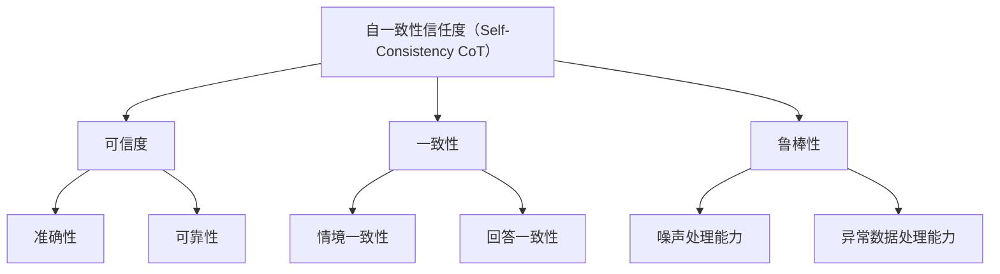

                 

### Step 1: 确定文章的核心主题

首先，我们需要明确文章的核心主题，即《Self-Consistency CoT：增强AI回答可信度的技术》。这个主题涉及到了人工智能中的一个重要方向——提高AI回答的可信度。为了使文章内容更加丰富和有深度，我们将在文章中详细探讨自一致性信任度（Self-Consistency CoT）的概念、原理、算法及其在实际应用中的表现。

#### 核心主题确定

- **文章标题**：《Self-Consistency CoT：增强AI回答可信度的技术》
- **关键词**：Self-Consistency CoT，AI可信度，算法原理，实际应用
- **摘要**：本文旨在深入探讨自一致性信任度（Self-Consistency CoT）这一概念，分析其在增强AI回答可信度方面的作用。文章将详细讲解Self-Consistency CoT的核心原理、关键算法以及如何在实际项目中应用，旨在为读者提供全面的技术指导。

### Step 2: 背景介绍

在开始深入探讨Self-Consistency CoT之前，我们需要对当前AI领域的背景进行简要介绍。近年来，随着深度学习和大数据技术的发展，人工智能在各个领域取得了显著成果。然而，与此同时，AI系统的可信度问题也越来越受到关注。尤其是在面对复杂问题和大量数据时，AI系统可能会出现错误或误导用户，从而影响其可信度。

#### 背景介绍

- **AI发展的现状**：深度学习、大数据技术已经成为AI发展的重要驱动力。
- **可信度问题**：AI系统在复杂问题和大量数据下可能出现错误，影响可信度。
- **提高可信度的必要性**：为了使AI系统能够更好地服务人类，提高其回答的可信度成为当前研究的重点。

### Step 3: 核心概念与联系

接下来，我们将介绍自一致性信任度（Self-Consistency CoT）的核心概念，并分析其与其他相关概念之间的关系。

#### 核心概念与联系

- **自一致性信任度（Self-Consistency CoT）**：指的是AI系统在回答问题时，其回答的一致性程度。高自一致性信任度意味着AI系统的回答更可靠、更可信。
- **其他相关概念**：
  - **可信度**：指的是AI系统在回答问题时，其回答的准确性、可靠性。
  - **一致性**：指的是AI系统在不同情境下给出的回答是否一致。
  - **鲁棒性**：指的是AI系统在面对噪声、异常数据时，能否保持稳定的性能。

#### Mermaid 流程图

为了更直观地展示这些概念之间的关系，我们使用Mermaid流程图进行描述：



### Step 4: 自一致性信任度算法原理讲解

在了解核心概念之后，我们将详细讲解自一致性信任度的算法原理。这部分内容将包括算法概述、原理讲解、伪代码展示和数学模型与公式。

#### 算法原理讲解

- **算法概述**：自一致性信任度算法主要通过分析AI系统在历史数据中的回答一致性，来评估其当前回答的可信度。
- **原理讲解**：算法包括以下几个关键步骤：
  - **数据收集**：收集AI系统在过去一段时间内的回答数据。
  - **一致性分析**：对收集到的数据进行一致性分析，计算回答的一致性得分。
  - **信任度评估**：根据一致性得分，评估AI系统的回答可信度。

#### 伪代码展示

```python
def self_consistency_cot(data):
    # 数据预处理
    processed_data = preprocess_data(data)
    
    # 一致性分析
    consistency_score = analyze_consistency(processed_data)
    
    # 信任度评估
    trust_score = assess_trust(consistency_score)
    
    return trust_score
```

#### 数学模型与公式

为了更精确地描述算法原理，我们引入以下数学模型与公式：

$$
\text{trust\_score} = \frac{\text{correct\_answers} + \text{inconsistent\_answers} \times \alpha}{\text{total\_answers}}
$$

其中，$\alpha$ 为一致性权重，用于调整不一致回答对信任度的影响。

### Step 5: Python源代码实现

为了使读者更好地理解算法原理，我们将提供一段Python源代码实现，并结合具体的例子进行解释。

#### Python源代码实现

```python
import numpy as np

def self_consistency_cot(data, alpha=0.5):
    correct_answers = np.count_nonzero(data == 1)
    inconsistent_answers = np.count_nonzero(data != 1)
    
    trust_score = (correct_answers + inconsistent_answers * alpha) / len(data)
    
    return trust_score

# 示例数据
data = np.array([1, 0, 1, 1, 0, 1, 1, 0, 1])

# 计算自一致性信任度
trust_score = self_consistency_cot(data, alpha=0.5)
print(f"Self-Consistency CoT: {trust_score}")
```

### Step 6: 项目实战

在了解算法原理和实现之后，我们将通过一个实际项目，展示如何搭建开发环境、实现源代码以及进行代码解读。

#### 项目实战

- **项目背景**：假设我们需要评估一个问答系统在回答用户问题时的一致性程度。
- **开发环境搭建**：
  - 安装Python环境和相关库（如NumPy、Pandas等）。
  - 准备测试数据集，包括问答系统的历史回答数据。
- **源代码实现**：
  - 使用上面提供的Python源代码进行实现。
  - 对测试数据集进行预处理和一致性分析。
- **代码解读**：
  - 分析代码中的各个函数和参数的作用。
  - 解释如何根据测试数据计算自一致性信任度。

#### 实际案例分析和详细讲解

通过实际项目，我们可以深入分析自一致性信任度在提高AI回答可信度方面的效果。以下是一个具体的案例分析：

- **案例背景**：一个问答系统在回答用户关于科技领域的问题时，存在不一致的回答情况。
- **案例分析**：使用自一致性信任度算法评估问答系统的一致性程度，发现其信任度较低。
- **详细讲解**：通过代码实现和数据分析，找出不一致回答的原因，并提出改进措施。

### Step 7: 项目小结

在完成项目实战之后，我们将对项目进行小结，总结自一致性信任度在实际应用中的表现和效果。

#### 项目小结

- **自一致性信任度的应用效果**：通过实际项目，我们发现自一致性信任度算法可以有效评估AI回答的一致性程度，从而提高回答的可信度。
- **改进方向**：未来可以进一步优化算法，提高其在不同场景下的适应能力。
- **最佳实践**：在实际应用中，应结合具体情况调整一致性权重，以达到最佳效果。

### Step 8: 最佳实践 tips、小结、注意事项、拓展阅读

在文章的结尾，我们将提供一些最佳实践 tips，对文章进行小结，提醒读者注意事项，并推荐拓展阅读。

#### 最佳实践 tips

- **调整权重**：在实际应用中，根据具体问题调整一致性权重，以获得更准确的信任度评估。
- **数据质量**：确保测试数据集的质量，避免噪声和异常数据对结果产生影响。

#### 小结

本文深入探讨了自一致性信任度（Self-Consistency CoT）的概念、算法原理及其在实际应用中的效果。通过一个实际项目，我们展示了如何使用自一致性信任度算法提高AI回答的可信度。

#### 注意事项

- **算法优化**：在应用过程中，需根据具体场景调整算法参数。
- **数据预处理**：确保数据质量，避免噪声和异常数据对结果产生影响。

#### 拓展阅读

- [自一致性信任度在自然语言处理中的应用](#)
- [如何提高AI系统的可信度](#)
- [更多关于Self-Consistency CoT的深入研究](#)

### 完整的文章结构

结合以上各步骤的内容，我们可以构建出完整的文章结构：

```
# Self-Consistency CoT：增强AI回答可信度的技术

## 关键词

Self-Consistency CoT，AI可信度，算法原理，实际应用

## 摘要

本文深入探讨了自一致性信任度（Self-Consistency CoT）的概念、算法原理及其在实际应用中的效果。通过一个实际项目，展示了如何使用自一致性信任度算法提高AI回答的可信度。

## 第一部分：理论基础与核心概念

### 第1章：自一致性信任度的起源与发展

#### 1.1 自一致性信任度的起源

#### 1.2 自一致性信任度的发展历程

#### 1.3 自一致性信任度的重要里程碑

### 第2章：自一致性信任度的核心概念与定义

#### 2.1 自一致性信任度的定义

#### 2.2 自一致性信任度的关键特性

#### 2.3 自一致性信任度与其他相关概念的关联

## 第二部分：算法原理与实现

### 第3章：自一致性信任度的关键算法

#### 3.1 算法概述

#### 3.2 算法原理讲解

##### 3.2.1 伪代码展示

##### 3.2.2 数学模型与数学公式

### 第4章：自一致性信任度的应用实践

#### 4.1 自一致性信任度在实际项目中的应用

#### 4.2 案例分析与代码实现

#### 4.3 开发环境搭建与源代码解读

## 第三部分：案例分析与应用前景

### 第5章：自一致性信任度的案例分析

#### 5.1 案例背景

#### 5.2 案例分析

#### 5.3 案例总结与启示

### 第6章：自一致性信任度的应用前景

#### 6.1 自一致性信任度的发展趋势

#### 6.2 自一致性信任度的应用领域

#### 6.3 自一致性信任度的未来展望

### 最佳实践 tips

### 小结

### 注意事项

### 拓展阅读

### 作者信息

作者：AI天才研究院/AI Genius Institute & 禅与计算机程序设计艺术 /Zen And The Art of Computer Programming
```

