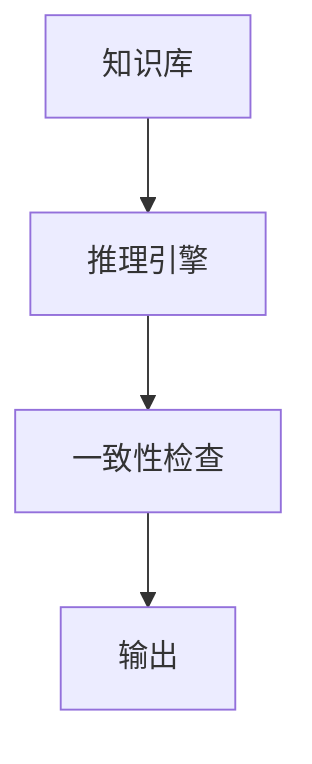

                 

## 自洽性概念与原理

### 1. 背景介绍

在人工智能领域，随着深度学习和大数据技术的迅猛发展，AI系统已经能够处理越来越多的复杂任务。然而，AI系统的可信性问题也逐渐暴露出来。特别是在自然语言处理（NLP）和问答系统中，AI模型的回答有时会出现相互矛盾或者与常识不符的情况，从而降低了用户的信任度。为了解决这一问题，自洽性（Self-Consistency，简称Self-Consistency CoT）应运而生。

自洽性是一种通过确保模型内部知识的一致性来增强AI回答可信度的方法。它要求AI模型在生成输出时，其输出结果能够与模型自身的先验知识和已知信息保持一致，避免产生相互矛盾的答案。这种内在一致性不仅能够提高AI回答的可信度，还能优化模型的整体性能。

### 2. 核心概念与联系

#### 自洽性定义

自洽性是指一个系统或模型在内部保持一致性的特性，即系统或模型内部各部分相互支持、相互验证，不存在内在矛盾。

#### 自洽性与一致性的关系

自洽性与一致性密切相关，但并不完全相同。一致性是指系统或模型的外部输出保持一致，即系统的输出在不同的条件下保持不变。而自洽性则强调系统或模型在内部保持一致，即系统内部各部分之间的相互关系保持一致。

#### 自洽性模型的基本架构

自洽性模型通常包含以下几个部分：

- **知识库**：存储已知信息和先验知识，用于生成模型输入。
- **推理引擎**：根据知识库中的信息和用户输入，生成中间推理结果。
- **一致性检查模块**：检查中间推理结果与知识库或先验知识之间的一致性。

#### Mermaid流程图

下面是一个简单的Mermaid流程图，展示了自洽性模型的基本架构：



### 3. 核心算法原理讲解

#### 自洽性算法的基本原理

自洽性算法通过以下步骤来确保模型内部的一致性：

1. **知识库构建**：将已知信息和先验知识存储在知识库中。
2. **推理过程**：根据用户输入，利用推理引擎生成中间推理结果。
3. **一致性检查**：将中间推理结果与知识库中的信息进行对比，检查是否存在不一致之处。
4. **修正过程**：如果发现不一致，则对推理过程进行调整，以确保输出结果的一致性。

#### 常见自洽性算法的伪代码实现

下面是一个简单的自洽性算法的伪代码实现：

```python
# 知识库
knowledge_base = {
    "事实1": True,
    "事实2": True,
    # ...
}

# 推理引擎
def inference_engine(user_input):
    # 根据用户输入和知识库生成推理结果
    # ...
    return inference_result

# 一致性检查
def consistency_check(inference_result):
    # 检查推理结果与知识库的一致性
    # ...
    return is_consistent

# 自洽性算法
def self_consistency_algorithm(user_input):
    inference_result = inference_engine(user_input)
    if consistency_check(inference_result):
        return inference_result
    else:
        # 如果不一致，则调整推理过程
        # ...
        return self_consistency_algorithm(user_input)
```

#### 自洽性算法的性能评估方法

自洽性算法的性能评估可以从以下几个方面进行：

- **一致性率**：衡量算法在多大程度上能够保持模型内部的一致性。
- **响应时间**：算法执行的时间，影响用户体验。
- **准确性**：算法生成结果的准确性。

### 4. 自洽性在AI应用中的实践

自洽性在AI应用中有着广泛的应用，以下是一些具体的实践案例：

- **自然语言处理**：在NLP任务中，自洽性算法可以帮助确保生成的文本回答与常识和先验知识保持一致。
- **图像识别**：在图像识别任务中，自洽性算法可以帮助确保识别结果与已知信息保持一致，从而提高识别准确性。
- **推荐系统**：在推荐系统中，自洽性算法可以帮助确保推荐结果的一致性，从而提高用户体验。

### 5. 自洽性的挑战与未来发展方向

虽然自洽性在提高AI系统可信度方面具有显著优势，但仍然面临一些挑战：

- **复杂性**：自洽性算法的复杂度较高，对计算资源和时间的要求较大。
- **不确定性**：在现实世界中，信息往往是不确定的，如何确保自洽性算法在不确定环境中的一致性仍需进一步研究。
- **扩展性**：如何将自洽性算法扩展到更多复杂的应用场景，需要更多的研究和实践。

未来，随着人工智能技术的不断发展，自洽性算法有望在更多领域得到应用，并成为提高AI系统可信度的重要手段。

### 总结

自洽性是确保AI模型内部知识一致性的一种重要方法，它通过保持模型内部的一致性来提高AI回答的可信度。本文详细介绍了自洽性的定义、核心概念与联系、算法原理、性能评估方法以及在AI应用中的实践，并讨论了自洽性面临的挑战和未来发展方向。希望通过本文，读者能够对自洽性有更深入的理解，并能够在实际应用中发挥其优势。

### 作者信息

作者：AI天才研究院/AI Genius Institute & 禅与计算机程序设计艺术 /Zen And The Art of Computer Programming

---

# 目录

- [Self-Consistency CoT：增强AI回答可信度的方法](#self-consistency-co增强ai回答可信度的方法)
- [关键词](#关键词)
- [摘要](#摘要)
- [1. 背景介绍](#背景介绍)
- [2. 核心概念与联系](#核心概念与联系)
- [3. 核心算法原理讲解](#核心算法原理讲解)
  - [3.1. 自洽性算法的基本原理](#31-自洽性算法的基本原理)
  - [3.2. 常见自洽性算法的伪代码实现](#32-常见自洽性算法的伪代码实现)
  - [3.3. 自洽性算法的性能评估方法](#33-自洽性算法的性能评估方法)
- [4. 自洽性在AI应用中的实践](#自洽性在ai应用中的实践)
- [5. 自洽性的挑战与未来发展方向](#自洽性的挑战与未来发展方向)
- [6. 总结](#总结)
- [7. 作者信息](#作者信息)

---

# 关键词

- 自洽性
- AI可信度
- 算法
- 人工智能
- 推理
- 知识库
- 一致性
- 性能评估

---

# 摘要

本文介绍了自洽性（Self-Consistency CoT）这一在人工智能领域中用于增强回答可信度的方法。自洽性通过确保模型内部知识的一致性，避免了AI系统在生成输出时出现相互矛盾的情况。本文首先介绍了自洽性的定义、核心概念与联系，然后详细讲解了自洽性算法的基本原理、伪代码实现和性能评估方法。接着，本文探讨了自洽性在AI应用中的实践案例，并分析了自洽性在AI领域面临的挑战和未来发展方向。通过本文，读者可以全面了解自洽性在提高AI回答可信度方面的重要作用，并为实际应用中的自洽性算法提供参考。

