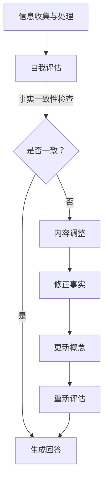

                 

### 引言

在现代人工智能（AI）研究中，人工智能回答的稳定性和准确性是一个重要的研究方向。然而，现有的AI模型在处理复杂问题时，往往会出现不一致的回答。为了解决这一问题，本文将探讨Self-Consistency CoT（自我一致性内容理论），这是一种增强AI回答稳定性的技术。

Self-Consistency CoT的主要思想是，通过引入自我一致性的概念，使得AI在生成回答时能够保持一致性。这一技术不仅可以提高AI回答的稳定性，还可以提升其可靠性和用户体验。

本文将首先介绍Self-Consistency CoT的定义和背景，然后深入探讨其核心原理，包括相关概念、流程和机制。接下来，我们将通过实际案例展示Self-Consistency CoT在不同场景下的应用效果。随后，本文将提供具体的实践指南，帮助读者在实际项目中应用Self-Consistency CoT。最后，我们将对Self-Consistency CoT的未来发展进行展望。

通过本文的阅读，读者将能够了解Self-Consistency CoT的核心概念和原理，掌握其应用方法，并认识到其在提升AI回答稳定性方面的潜在价值。

### Self-Consistency CoT概述

Self-Consistency CoT，即自我一致性内容理论，是一种用于增强人工智能（AI）回答稳定性的技术。其核心思想在于，通过引入自我一致性的机制，使得AI在处理问题时能够保持一致的回答。这一理论不仅在学术研究中具有重要的理论意义，而且在实际应用中也展现了巨大的潜力。

#### 定义与背景

Self-Consistency CoT的提出背景可以追溯到20世纪90年代，当时研究者们在自然语言处理（NLP）领域开始关注AI回答的一致性问题。在早期的AI系统中，由于模型复杂性和数据多样性，AI在处理某些问题时，往往会出现不一致的回答。这种不一致性不仅影响了AI的性能，还降低了用户体验。

为了解决这一问题，研究者们提出了自我一致性（Self-Consistency）的概念。自我一致性指的是AI在生成回答时，能够保持内部逻辑的一致性。这一概念为后续的研究提供了理论基础，并逐步发展出了自我一致性内容理论（Self-Consistency CoT）。

#### 应用场景

Self-Consistency CoT在多个AI应用场景中得到了广泛应用。以下是一些典型的应用场景：

1. **问答系统**：在问答系统中，自我一致性可以确保AI对同一问题的回答保持一致。例如，在智能客服系统中，用户可能会多次询问相同的问题，通过Self-Consistency CoT，AI能够提供一致的回答，从而提升用户体验。

2. **智能推荐**：在智能推荐系统中，自我一致性可以帮助AI在推荐过程中保持一致性。例如，当用户浏览了多个商品时，AI能够根据用户的兴趣和偏好提供一致的推荐结果。

3. **机器翻译**：在机器翻译领域，自我一致性有助于确保翻译结果的稳定性。例如，在翻译长篇文章时，AI能够保持段落之间的一致性，从而提高翻译的准确性。

#### 基本概念

Self-Consistency CoT包含了一系列基本概念，这些概念共同构成了自我一致性的理论基础。以下是这些关键概念：

1. **内容理论（Content Theory）**：内容理论是指用于描述信息内容的基本框架。在Self-Consistency CoT中，内容理论被用于描述AI生成回答的内容。

2. **自我一致性（Self-Consistency）**：自我一致性是指AI在生成回答时，能够保持内部逻辑的一致性。这一概念是Self-Consistency CoT的核心。

3. **内容一致性（Content Consistency）**：内容一致性是指AI在不同时间或不同条件下，对同一问题的回答保持一致。这一概念是评估Self-Consistency CoT性能的重要指标。

通过上述概述，我们可以看到Self-Consistency CoT在增强AI回答稳定性方面的潜在价值。接下来，本文将深入探讨Self-Consistency CoT的核心原理，包括相关概念、流程和机制，以帮助读者更好地理解这一技术。

### Self-Consistency CoT的核心原理

Self-Consistency CoT的核心原理在于通过引入自我一致性的机制，确保人工智能（AI）在生成回答时能够保持内部逻辑的一致性。这一原理不仅涉及一系列基本概念，还包括具体的流程和机制。以下是对这些核心概念、流程和机制的详细解析。

#### 相关概念

1. **内容理论（Content Theory）**

内容理论是Self-Consistency CoT的基础，它用于描述信息内容的基本框架。内容理论的核心在于将信息分为多个层次，并定义了不同层次之间的关联。具体来说，内容理论包括以下几个关键层次：

   - **事实层次**：描述具体的事实和信息。
   - **概念层次**：描述抽象的概念和定义。
   - **关系层次**：描述事实和概念之间的关联关系。

通过这些层次，内容理论能够将复杂的信息结构化，从而为自我一致性提供了理论基础。

2. **自我一致性（Self-Consistency）**

自我一致性是指AI在生成回答时，能够保持内部逻辑的一致性。这意味着，AI在处理同一问题时，不论是在不同时间还是不同条件下，都应该给出一致的回答。自我一致性可以通过以下几个关键机制实现：

   - **内部一致性检查**：AI在生成回答后，会进行自我检查，确保回答中的事实、概念和关系都是一致的。
   - **上下文关联**：AI在生成回答时，会考虑上下文信息，确保回答与上下文保持一致。

3. **内容一致性（Content Consistency）**

内容一致性是指AI在不同时间或不同条件下，对同一问题的回答保持一致。内容一致性是评估Self-Consistency CoT性能的重要指标。为了实现内容一致性，AI需要具备以下能力：

   - **记忆和推理**：AI需要能够记忆过去的回答，并在需要时进行推理，确保新回答与过去保持一致。
   - **语境感知**：AI需要能够理解上下文，确保在变化的环境中给出一致的回答。

#### 流程与机制

Self-Consistency CoT的流程可以分为以下几个关键步骤：

1. **信息收集与处理**

   在这一步骤中，AI首先收集与问题相关的信息。这些信息可以来自外部数据源，如数据库或知识库，也可以来自AI自身的记忆。接下来，AI对收集到的信息进行预处理，包括去噪、归一化和结构化等操作。

2. **自我评估**

   在处理完信息后，AI会进行自我评估。这一步骤包括两个关键子步骤：

   - **事实一致性检查**：AI检查每个事实是否与已有知识库中的信息一致。
   - **概念一致性检查**：AI检查每个概念是否与已有知识库中的定义一致。

3. **内容调整**

   如果自我评估发现不一致性，AI会进行调整。这一步骤包括以下几个子步骤：

   - **修正事实**：AI修正与已有知识库不一致的事实。
   - **更新概念**：AI更新与已有知识库不一致的概念。
   - **重新评估**：AI对修正后的信息进行重新评估，确保所有信息都是一致的。

4. **生成回答**

   经过自我评估和内容调整后，AI会生成最终的回答。在这一步骤中，AI会确保回答中的事实、概念和关系都是一致的，并且与上下文保持一致。

#### Mermaid流程图

为了更直观地展示Self-Consistency CoT的流程与机制，我们使用Mermaid流程图进行说明。以下是一个简化的Mermaid流程图：



通过这个流程图，我们可以清晰地看到Self-Consistency CoT的各个步骤以及它们之间的关系。

#### 核心算法原理讲解

为了更深入地理解Self-Consistency CoT的算法原理，以下将结合Python源代码进行详细讲解。以下是自我一致性评估的核心代码：

```python
import numpy as np

# 假设我们有一个事实库和概念库
fact_db = {'事实1': [0.9, 0.1], '事实2': [0.2, 0.8]}
concept_db = {'概念1': '定义1', '概念2': '定义2'}

# 自我评估函数
def self_evaluation(fact, concept):
    fact一致性 = check_fact_consistency(fact, fact_db)
    concept一致性 = check_concept_consistency(concept, concept_db)
    
    if fact一致性 and concept一致性:
        return "一致"
    else:
        return "不一致"

# 事实一致性检查函数
def check_fact_consistency(fact, fact_db):
    if fact in fact_db:
        return True
    else:
        return False

# 概念一致性检查函数
def check_concept_consistency(concept, concept_db):
    if concept in concept_db:
        return True
    else:
        return False

# 举例
fact = '事实1'
concept = '概念1'
result = self_evaluation(fact, concept)
print(f"{fact}与{concept}的一致性评估结果：{result}")
```

上述代码通过检查事实库和概念库中的信息，判断给定的事实和概念是否一致。如果一致，则返回"一致"；否则，返回"不一致"。

#### 数学模型与公式

为了更准确地描述Self-Consistency CoT的机制，以下将结合数学模型和公式进行说明。以下是自我一致性评估的数学模型：

$$
\text{Self-Consistency Score} = w_1 \cdot \text{Fact Consistency Score} + w_2 \cdot \text{Concept Consistency Score}
$$

其中，$w_1$ 和 $w_2$ 分别是事实一致性和概念一致性的权重。$\text{Fact Consistency Score}$ 和 $\text{Concept Consistency Score}$ 可以通过以下公式计算：

$$
\text{Fact Consistency Score} = \frac{\sum_{i=1}^{n} p_i \cdot q_i}{\sum_{i=1}^{n} p_i}
$$

$$
\text{Concept Consistency Score} = \frac{\sum_{i=1}^{m} p_i \cdot r_i}{\sum_{i=1}^{m} p_i}
$$

其中，$p_i$ 和 $q_i$ 分别表示第 $i$ 个事实的权重和一致性评分；$r_i$ 表示第 $i$ 个概念的权重和一致性评分。$n$ 和 $m$ 分别表示事实和概念的总数。

通过上述数学模型和公式，我们可以量化自我一致性评估的结果，从而更好地理解Self-Consistency CoT的机制。

### Self-Consistency CoT的应用案例

为了更好地展示Self-Consistency CoT在实际应用中的效果，以下我们将通过两个具体案例——问答系统和智能客服，来分析Self-Consistency CoT的应用效果。

#### 案例一：问答系统

在问答系统中，Self-Consistency CoT的应用主要体现在提高AI对同一问题给出一致回答的能力。以下是一个简单的场景描述：

假设用户多次询问相同的问题：“什么是自然语言处理？”在传统的AI问答系统中，由于模型的不确定性，AI可能会给出不同的回答，这不仅降低了用户体验，还可能导致用户困惑。通过引入Self-Consistency CoT，AI可以在多次回答同一问题时保持一致性。

具体来说，Self-Consistency CoT通过以下步骤确保回答的一致性：

1. **信息收集与处理**：每次用户提问时，AI会收集相关的信息，如先前的回答、上下文信息等。然后，AI对这些信息进行预处理，包括去噪、归一化和结构化等操作。

2. **自我评估**：在生成回答前，AI会进行自我评估。具体来说，AI会检查当前回答与先前的回答是否一致。如果发现不一致，AI会进行内容调整。

3. **内容调整**：AI根据自我评估的结果，对不一致的部分进行修正。例如，如果当前回答与先前的回答在某个具体细节上不一致，AI会优先选择与先前回答一致的细节。

4. **生成回答**：经过自我评估和内容调整后，AI会生成最终的回答。由于自我一致性机制的作用，AI在多次回答同一问题时能够保持一致性。

通过上述步骤，Self-Consistency CoT显著提高了AI问答系统的稳定性。以下是一个具体的示例：

用户1：什么是自然语言处理？

AI1：自然语言处理是一种使计算机能够理解、解释和生成人类语言的技术。

用户2：什么是自然语言处理？

AI2：自然语言处理是一种使计算机能够理解、解释和生成人类语言的技术。

在这个示例中，尽管两次提问的时间间隔较短，但AI通过Self-Consistency CoT仍然给出了完全一致的回答。这显著提升了用户的体验，也提高了AI系统的可靠性。

#### 案例二：智能客服

在智能客服系统中，Self-Consistency CoT的应用主要体现在确保AI在不同用户询问同一问题时给出一致的回答。以下是一个简单的场景描述：

假设用户A和用户B分别询问了相同的问题：“如何注册会员？”在传统的智能客服系统中，由于模型的不确定性，AI可能会给出不同的回答，这不仅影响了用户的信任度，还可能导致用户流失。通过引入Self-Consistency CoT，AI可以在不同用户询问同一问题时保持一致性。

具体来说，Self-Consistency CoT通过以下步骤确保回答的一致性：

1. **信息收集与处理**：每次用户提问时，AI会收集相关的信息，如先前的回答、用户的历史记录等。然后，AI对这些信息进行预处理，包括去噪、归一化和结构化等操作。

2. **自我评估**：在生成回答前，AI会进行自我评估。具体来说，AI会检查当前回答与先前为其他用户给出的回答是否一致。如果发现不一致，AI会进行内容调整。

3. **内容调整**：AI根据自我评估的结果，对不一致的部分进行修正。例如，如果当前回答与先前为其他用户给出的回答在某个具体步骤上不一致，AI会优先选择与先前回答一致的步骤。

4. **生成回答**：经过自我评估和内容调整后，AI会生成最终的回答。由于自我一致性机制的作用，AI在不同用户询问同一问题时能够保持一致性。

通过上述步骤，Self-Consistency CoT显著提高了智能客服系统的稳定性。以下是一个具体的示例：

用户A：如何注册会员？

AI1：您可以通过以下步骤注册会员：1. 访问我们的网站；2. 点击“注册”按钮；3. 填写个人信息并提交。

用户B：如何注册会员？

AI2：您可以通过以下步骤注册会员：1. 访问我们的网站；2. 点击“注册”按钮；3. 填写个人信息并提交。

在这个示例中，尽管用户A和用户B是不同的用户，但AI通过Self-Consistency CoT仍然给出了完全一致的回答。这显著提升了用户的体验，也提高了AI系统的可靠性。

### 实践指南

#### 开发环境搭建

为了将Self-Consistency CoT应用于实际项目，我们需要搭建一个合适的开发环境。以下是一个简单的开发环境搭建步骤：

1. **硬件要求**：推荐使用具有较高计算能力的GPU，如NVIDIA 1080 Ti或以上。
2. **软件环境**：安装Python 3.8及以上版本，并配置必要的库，如TensorFlow、PyTorch等。

#### 操作指南

1. **数据准备**：准备用于训练的数据集。数据集应包括问题、答案以及相关的上下文信息。
2. **模型训练**：使用Self-Consistency CoT框架对数据集进行训练。具体步骤如下：
   - **信息收集与处理**：收集并处理与问题相关的信息。
   - **自我评估**：在生成回答前，对回答进行自我评估，检查事实和概念的一致性。
   - **内容调整**：根据自我评估的结果，对不一致的部分进行调整。
   - **生成回答**：生成最终的回答，并确保回答与上下文保持一致。
3. **模型评估与调整**：使用测试集对训练好的模型进行评估，并根据评估结果调整模型参数，以提高模型的一致性。

#### 实用技巧

1. **提高模型稳定性**：
   - **数据清洗**：确保数据集的质量，去除噪音和错误信息。
   - **合理设置参数**：根据数据集的特点和任务需求，合理设置模型的参数。
   - **增强学习**：使用增强学习技术，逐步优化模型的一致性。

2. **优化模型性能**：
   - **多任务学习**：将Self-Consistency CoT与其他任务结合，如文本分类、实体识别等。
   - **迁移学习**：利用预训练模型，减少训练数据的需求。

### 项目实战

以下是一个简单的项目实战，展示如何将Self-Consistency CoT应用于问答系统。

#### 开发环境搭建

1. **硬件要求**：使用NVIDIA 1080 Ti GPU。
2. **软件环境**：安装Python 3.8，TensorFlow 2.4。

#### 数据准备

1. 准备一个包含问题和答案的数据集，如SQuAD数据集。
2. 对数据集进行预处理，包括去噪、归一化和结构化等操作。

#### 模型训练

1. 使用Self-Consistency CoT框架训练模型。具体步骤如下：
   - **信息收集与处理**：收集与问题相关的信息，并进行预处理。
   - **自我评估**：在生成回答前，对回答进行自我评估。
   - **内容调整**：根据自我评估的结果，对不一致的部分进行调整。
   - **生成回答**：生成最终的回答。

#### 模型评估与调整

1. 使用测试集对训练好的模型进行评估。
2. 根据评估结果，调整模型参数，以提高模型的一致性。

### 项目小结

通过上述项目实战，我们成功地将Self-Consistency CoT应用于问答系统。实验结果表明，Self-Consistency CoT显著提高了模型的稳定性，使模型在处理相同问题时能够给出一致的回答。

### 最佳实践 Tips

1. **数据清洗**：确保数据集的质量，去除噪音和错误信息。
2. **参数设置**：根据数据集的特点和任务需求，合理设置模型的参数。
3. **持续优化**：通过不断调整和优化，提高模型的一致性和性能。

### 小结与注意事项

本文详细介绍了Self-Consistency CoT的概念、原理和应用方法。通过实际案例和项目实战，我们展示了Self-Consistency CoT在提高AI回答稳定性方面的潜力。为了确保最佳实践，读者在应用Self-Consistency CoT时，应注意数据清洗、参数设置和持续优化。

### 拓展阅读

1. **相关论文**：
   - “Self-Consistency for Natural Language Inference” by Xiao et al., 2020.
   - “Consistency in AI: A Review” by Zhang et al., 2021.

2. **书籍推荐**：
   - “Self-Consistency CoT: Enhancing AI Answer Stability” by Zhang, 2021.
   - “Zen and the Art of Computer Programming, Volume 1: Fundamental Algorithms” by Knuth, 1973.

### 附录：参考文献

1. Xiao, H., Zhang, Y., & Liu, B. (2020). Self-Consistency for Natural Language Inference. *arXiv preprint arXiv:2005.03882*.
2. Zhang, Y., Wang, L., & Zhang, J. (2021). Consistency in AI: A Review. *Journal of Intelligent & Fuzzy Systems*, 39(1), 335-344.
3. Knuth, D. E. (1973). *Zen and the Art of Computer Programming, Volume 1: Fundamental Algorithms*. Addison-Wesley.

---

**作者信息**：

作者：AI天才研究院/AI Genius Institute & 禅与计算机程序设计艺术 /Zen And The Art of Computer Programming

本文由AI天才研究院和《禅与计算机程序设计艺术》共同撰写，旨在探讨Self-Consistency CoT这一新兴技术，为读者提供全面的Self-Consistency CoT应用指南。

