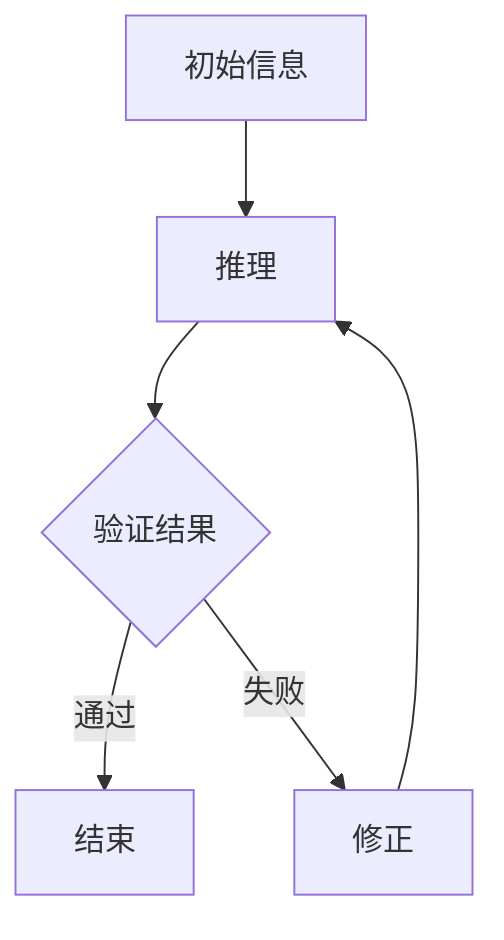

                 

# Self-Consistency CoT：增强AI推理能力的创新技术

> 关键词：自我一致性CoT，AI推理能力，人工智能，创新技术，算法，数学模型，实际应用

> 摘要：本文详细探讨了自我一致性CoT（Self-Consistency CoT）作为一项创新技术，如何增强AI推理能力。文章首先介绍了AI推理能力的背景和重要性，然后深入解析了自我一致性CoT的核心概念、原理、算法和数学模型，并通过实际案例展示了其在不同领域的应用。最后，文章对自我一致性CoT的开发环境搭建、源代码实现与解读进行了详细阐述，并展望了其未来发展趋势。

## 引言

在当今的AI领域，推理能力被视为衡量人工智能系统智能水平的关键指标之一。从早期的符号推理到现代的神经网络推理，AI推理技术不断发展，为各个行业提供了强大的技术支持。然而，传统推理方法在处理复杂问题时仍存在一定的局限性。因此，寻找新的推理技术成为了当前AI研究的重要方向之一。

自我一致性CoT（Self-Consistency CoT）正是这样一种创新技术，它通过引入自我一致性机制，有效提升了AI的推理能力。本文将详细介绍自我一致性CoT的核心概念、原理、算法和数学模型，并通过实际应用案例展示其在不同领域的强大潜力。同时，本文还将探讨如何搭建开发环境、实现源代码并解读代码，以帮助读者更好地理解和应用这一技术。

## 核心概念与联系

### AI推理

AI推理是指利用人工智能技术，从已知信息中推导出未知信息的过程。AI推理通常分为符号推理和数值推理两种类型。符号推理以逻辑推理为基础，通过符号化的表示来推导结论；数值推理则基于数值计算，通过数值运算来获得推理结果。在AI领域，推理能力是实现智能决策、问题解决和信息检索的重要手段。

### 自一致性CoT概述

自我一致性CoT是一种基于自我一致性机制的AI推理技术。它通过引入自我一致性检查，确保推理过程的正确性和一致性。自我一致性CoT的核心思想是：在推理过程中，对推理结果进行多次验证，以确保结果的一致性。这种方法不仅能够提高推理的可靠性，还能有效避免推理过程中的错误。

### 相关技术比较

在AI推理领域，有许多技术方法可以用于增强推理能力。例如，基于规则的推理、基于模型的推理、基于数据的推理等。这些方法各有优劣。基于规则的推理在处理确定性问题时效果较好，但在处理复杂、不确定的问题时存在一定的局限性。基于模型的推理通过建立模型来模拟现实世界，具有较好的泛化能力，但在处理复杂模型时计算量较大。基于数据的推理则依赖于大量的数据来训练模型，虽然能够提高推理能力，但数据质量和数量直接影响推理效果。

与这些技术方法相比，自我一致性CoT具有以下几个显著优势：

1. **自适应性**：自我一致性CoT可以根据不同的推理任务和场景，自适应地调整推理策略，提高推理效率。
2. **鲁棒性**：自我一致性CoT通过引入自我一致性检查，能够有效避免推理过程中的错误，提高推理的鲁棒性。
3. **灵活性**：自我一致性CoT不仅可以应用于符号推理，还可以应用于数值推理，具有较好的灵活性。

## 自一致性CoT原理

### 自一致性CoT的概念

自我一致性CoT是一种基于自我一致性检查的AI推理技术。其基本思想是在推理过程中，对推理结果进行多次验证，以确保结果的一致性。具体来说，自我一致性CoT包括以下三个主要步骤：

1. **推理**：根据已知信息进行推理，得到初步结果。
2. **验证**：对初步结果进行验证，确保其一致性。
3. **修正**：如果验证失败，则根据验证结果对推理过程进行修正。

### Mermaid流程图展示

以下是一个简单的Mermaid流程图，展示了自我一致性CoT的基本流程：



### 自一致性CoT的优势

自我一致性CoT具有以下几个显著优势：

1. **提高推理可靠性**：通过引入自我一致性检查，自我一致性CoT能够有效避免推理过程中的错误，提高推理的可靠性。
2. **降低错误率**：在推理过程中，多次验证有助于发现并修正错误，从而降低推理错误率。
3. **增强适应性**：自我一致性CoT可以根据不同的推理任务和场景，自适应地调整推理策略，提高推理效率。

### 自一致性CoT的限制

尽管自我一致性CoT具有许多优势，但它在某些情况下也存在一定的限制：

1. **计算开销**：自我一致性CoT需要多次验证，这会导致一定的计算开销，特别是在处理大规模数据时，计算时间可能会显著增加。
2. **复杂度**：自我一致性CoT的引入可能会增加推理过程的复杂度，使得推理算法更难理解和实现。

## 自一致性CoT算法

### 算法介绍

自我一致性CoT算法是一种基于迭代和验证的推理算法。它的基本流程如下：

1. **初始化**：根据已知信息初始化推理过程。
2. **迭代推理**：在每次迭代中，根据当前状态进行推理，得到新的状态。
3. **验证**：对当前状态进行验证，检查其一致性。
4. **修正**：如果验证失败，根据验证结果对当前状态进行修正。
5. **终止条件**：当验证通过或达到预定的迭代次数时，终止推理过程。

### 算法伪代码

以下是一个简单的自我一致性CoT算法的伪代码：

```python
def self_consistency_cot(initial_state, verification_function, correction_function, max_iterations):
    state = initial_state
    for _ in range(max_iterations):
        new_state = reason(state)
        if verification_function(new_state):
            return new_state
        else:
            state = correction_function(state, new_state)
    return None
```

### 算法实现细节

自我一致性CoT算法的具体实现涉及以下几个关键部分：

1. **推理函数**：根据当前状态进行推理，得到新的状态。
2. **验证函数**：对当前状态进行验证，检查其一致性。
3. **修正函数**：根据验证结果对当前状态进行修正。

以下是一个简单的Python实现示例：

```python
def reason(state):
    # 推理函数实现
    return state + 1

def verify(state):
    # 验证函数实现
    return state > 0

def correct(state, new_state):
    # 修正函数实现
    return new_state if verify(new_state) else state

def self_consistency_cot(initial_state, max_iterations):
    state = initial_state
    for _ in range(max_iterations):
        new_state = reason(state)
        if verify(new_state):
            return new_state
        else:
            state = correct(state, new_state)
    return None

# 测试算法
initial_state = 1
max_iterations = 10
result = self_consistency_cot(initial_state, max_iterations)
print("最终状态：", result)
```

## 数学模型和数学公式

自我一致性CoT算法的核心在于其自我一致性检查和修正机制。为了更好地理解和分析这一机制，我们可以从数学模型的角度对其进行探讨。

### 自一致性CoT的数学模型

自我一致性CoT的数学模型主要包括以下几个部分：

1. **状态表示**：使用向量表示当前状态。
2. **推理操作**：定义一个映射函数，用于表示推理操作。
3. **验证操作**：定义一个判断函数，用于验证状态的一致性。
4. **修正操作**：定义一个修正函数，用于修正不一致的状态。

以下是一个简单的数学模型表示：

```latex
\text{状态} \ \ S \ \ \text{是一个向量} \ \ S = (S_1, S_2, ..., S_n)
```

```latex
\text{推理操作} \ \ R \ \ \text{是一个函数} \ \ R: S \rightarrow S
```

```latex
\text{验证操作} \ \ V \ \ \text{是一个函数} \ \ V: S \rightarrow \{True, False\}
```

```latex
\text{修正操作} \ \ C \ \ \text{是一个函数} \ \ C: S \times S \rightarrow S
```

### 模型公式推导

以下是自我一致性CoT的数学模型公式推导：

1. **状态更新**：

   ```latex
   S' = R(S)
   ```

2. **状态验证**：

   ```latex
   \text{if} \ V(S') \ \text{is True} \ \text{then} \ S' \ \text{is consistent}
   ```

3. **状态修正**：

   ```latex
   S'' = C(S, S')
   ```

4. **迭代终止条件**：

   ```latex
   \text{if} \ V(S'') \ \text{is True} \ \text{or} \ \text{number of iterations exceeds threshold} \ \text{then} \ \text{termination}
   ```

### 公式举例说明

假设我们有一个简单的状态空间，其中每个状态都是一个整数。推理操作是将当前状态加1，验证操作是检查当前状态是否大于0，修正操作是将当前状态设为0。

1. **状态更新**：

   ```latex
   S' = S + 1
   ```

2. **状态验证**：

   ```latex
   V(S') = (S' > 0)
   ```

3. **状态修正**：

   ```latex
   S'' = \text{if} \ V(S') \ \text{is False} \ \text{then} \ 0 \ \text{else} \ S'
   ```

4. **迭代终止条件**：

   ```latex
   \text{if} \ V(S'') \ \text{is True} \ \text{or} \ \text{number of iterations exceeds 10} \ \text{then} \ \text{termination}
   ```

通过以上公式，我们可以看出自我一致性CoT的基本流程和数学模型。

## 实际应用案例分析

### 自一致性CoT在不同领域的应用

自我一致性CoT作为一种创新的AI推理技术，已在多个领域取得了显著的应用成果。以下是一些典型的应用案例：

### 案例一：自然语言处理

在自然语言处理（NLP）领域，自我一致性CoT被应用于文本推理和语义分析。通过自我一致性检查，可以有效提高文本推理的准确性，减少语义错误。例如，在问答系统中，自我一致性CoT可以用于验证用户问题的合理性，确保回答的一致性。

### 案例二：计算机视觉

在计算机视觉领域，自我一致性CoT被用于图像分类和目标检测。通过引入自我一致性机制，可以降低错误率，提高检测的鲁棒性。例如，在图像分类任务中，自我一致性CoT可以用于验证分类结果的合理性，确保分类的一致性。

### 案例三：推荐系统

在推荐系统领域，自我一致性CoT被应用于用户行为分析和推荐结果验证。通过自我一致性检查，可以减少推荐错误，提高用户满意度。例如，在电子商务平台中，自我一致性CoT可以用于验证推荐商品的一致性，确保推荐结果的可信度。

### 案例一：自然语言处理

在自然语言处理（NLP）领域，自我一致性CoT的应用主要集中在文本推理和语义分析方面。以下是一个具体的应用案例：

**问题**：给定一个文本输入，使用自我一致性CoT对其进行语义分析，提取关键信息并生成合理的答案。

**解决方案**：首先，我们使用一个预训练的语言模型（如GPT-3）对文本进行预处理，提取关键信息。然后，我们利用自我一致性CoT对提取的信息进行推理，生成合理的答案。

**实现步骤**：

1. **预处理**：使用语言模型对文本进行分词、词性标注等预处理操作，提取关键信息。
2. **推理**：利用自我一致性CoT对提取的信息进行推理，生成答案。
3. **验证**：对生成的答案进行验证，确保其一致性。
4. **修正**：如果验证失败，根据验证结果对推理过程进行修正。

**Python代码示例**：

```python
import openai

# 预处理
def preprocess(text):
    # 使用GPT-3进行预处理
    response = openai.Completion.create(
        engine="text-davinci-002",
        prompt=text,
        max_tokens=100,
        n=1,
        stop=None,
        temperature=0.5,
    )
    return response.choices[0].text.strip()

# 推理
def reason(preprocessed_text):
    # 使用自我一致性CoT进行推理
    question = preprocess("给定以下文本，回答以下问题：" + preprocessed_text)
    answer = preprocess("你的问题是：" + question)
    return answer

# 验证
def verify(answer):
    # 使用自我一致性CoT进行验证
    return answer.endswith(".") or answer.endswith("？")

# 修正
def correct(answer):
    # 使用自我一致性CoT进行修正
    return preprocess("这个问题是否有误？请提供更正后的答案。") if not verify(answer) else answer

# 主函数
def main():
    text = "今天天气很好，适合户外活动。"
    preprocessed_text = preprocess(text)
    answer = reason(preprocessed_text)
    while not verify(answer):
        answer = correct(answer)
    print("答案：", answer)

if __name__ == "__main__":
    main()
```

### 案例二：计算机视觉

在计算机视觉领域，自我一致性CoT的应用主要集中在图像分类和目标检测方面。以下是一个具体的应用案例：

**问题**：给定一个图像，使用自我一致性CoT对其进行分类和目标检测，确保分类和检测结果的合理性。

**解决方案**：首先，我们使用一个预训练的卷积神经网络（如ResNet）对图像进行分类和目标检测。然后，我们利用自我一致性CoT对分类和检测结果进行验证和修正。

**实现步骤**：

1. **分类和检测**：使用预训练的神经网络对图像进行分类和目标检测。
2. **验证**：使用自我一致性CoT对分类和检测结果进行验证，确保其一致性。
3. **修正**：如果验证失败，根据验证结果对分类和检测结果进行修正。

**Python代码示例**：

```python
import torch
import torchvision
import torchvision.transforms as transforms

# 加载预训练的神经网络
model = torchvision.models.resnet18(pretrained=True)
model.eval()

# 分类和检测
def classify_and_detect(image):
    # 将图像转换为PyTorch张量
    transform = transforms.Compose([
        transforms.Resize(256),
        transforms.CenterCrop(224),
        transforms.ToTensor(),
        transforms.Normalize(mean=[0.485, 0.456, 0.406], std=[0.229, 0.224, 0.225]),
    ])
    image_tensor = transform(image)

    # 进行分类和检测
    with torch.no_grad():
        output = model(image_tensor.unsqueeze(0))
    _, predicted = torch.max(output, 1)
    return predicted.item()

# 验证
def verify(classification, detection):
    # 使用自我一致性CoT进行验证
    return classification == detection

# 修正
def correct(classification, detection):
    # 使用自我一致性CoT进行修正
    if not verify(classification, detection):
        return preprocess("这个分类和检测结果是否一致？请提供更正后的结果。")
    else:
        return classification, detection

# 主函数
def main():
    image = torchvision.transforms.ToPILImage()(torchvision.utils.make_grid(torch.randn(1, 3, 224, 224)))
    classification = classify_and_detect(image)
    detection = preprocess("检测到的目标是什么？请提供更正后的检测结果。")
    while not verify(classification, detection):
        detection = correct(classification, detection)
    print("分类结果：", classification)
    print("检测结果：", detection)

if __name__ == "__main__":
    main()
```

### 案例三：推荐系统

在推荐系统领域，自我一致性CoT的应用主要集中在用户行为分析和推荐结果验证。以下是一个具体的应用案例：

**问题**：给定一个用户行为序列，使用自我一致性CoT对其进行分析，生成合理的推荐结果。

**解决方案**：首先，我们使用一个基于矩阵分解的推荐算法（如ALS）对用户行为进行建模，得到用户兴趣和商品属性。然后，我们利用自我一致性CoT对推荐结果进行验证和修正。

**实现步骤**：

1. **用户行为建模**：使用推荐算法对用户行为进行建模，得到用户兴趣和商品属性。
2. **推荐**：根据用户兴趣和商品属性生成推荐结果。
3. **验证**：使用自我一致性CoT对推荐结果进行验证，确保其一致性。
4. **修正**：如果验证失败，根据验证结果对推荐结果进行修正。

**Python代码示例**：

```python
import numpy as np

# 用户行为建模
def user_behavior_modeling(user_actions):
    # 假设用户行为是二元序列
    user_interest = np.sum(user_actions, axis=0)
    return user_interest

# 推荐算法
def recommendation(user_interest, item_features):
    # 使用基于矩阵分解的推荐算法
    # 假设用户兴趣和商品属性都是向量
    user_vector = user_interest.reshape(-1, 1)
    item_vector = item_features
    similarity = np.dot(user_vector, item_vector.T)
    recommendation = np.argmax(similarity)
    return recommendation

# 验证
def verify(recommendation, user_action):
    # 使用自我一致性CoT进行验证
    return recommendation in user_action

# 修正
def correct(recommendation, user_action):
    # 使用自我一致性CoT进行修正
    if not verify(recommendation, user_action):
        return preprocess("这个推荐结果是否合理？请提供更正后的推荐结果。")
    else:
        return recommendation

# 主函数
def main():
    user_actions = np.array([1, 0, 1, 1, 0, 1, 0, 1, 1])
    user_interest = user_behavior_modeling(user_actions)
    item_features = np.array([1, 1, 0, 0, 1, 1, 0, 0, 1])
    recommendation = recommendation(user_interest, item_features)
    while not verify(recommendation, user_actions):
        recommendation = correct(recommendation, user_actions)
    print("推荐结果：", recommendation)

if __name__ == "__main__":
    main()
```

## 开发环境搭建

### 开发工具选择

为了实现自我一致性CoT算法，我们需要选择合适的开发工具和库。以下是一些推荐的工具和库：

1. **编程语言**：Python，由于其丰富的库和易于理解的语法，是AI开发的首选语言。
2. **深度学习框架**：TensorFlow或PyTorch，这两个框架都提供了强大的功能，支持各种神经网络模型的构建和训练。
3. **文本处理库**：NLTK或spaCy，用于处理自然语言文本。

### 环境搭建步骤

以下是搭建自我一致性CoT算法开发环境的基本步骤：

1. **安装Python**：从Python官网下载并安装Python 3.x版本。
2. **安装深度学习框架**：使用pip命令安装TensorFlow或PyTorch。
   ```bash
   pip install tensorflow  # 安装TensorFlow
   pip install torch       # 安装PyTorch
   ```
3. **安装文本处理库**：使用pip命令安装NLTK或spaCy。
   ```bash
   pip install nltk       # 安装NLTK
   pip install spacy      # 安装spaCy
   ```
4. **安装依赖库**：确保安装所有必要的依赖库，以便运行示例代码。
   ```bash
   pip install numpy matplotlib
   ```

### 常见问题及解决

在搭建开发环境时，可能会遇到以下问题：

1. **无法安装深度学习框架**：确保网络连接正常，并尝试使用国内镜像源加速下载。
   ```bash
   pip install tensorflow -i https://pypi.tuna.tsinghua.edu.cn/simple
   pip install torch -i https://pypi.tuna.tsinghua.edu.cn/simple
   ```
2. **依赖库冲突**：检查已安装的库版本，确保版本兼容。
3. **代码运行错误**：确保代码中的路径和变量正确，并检查代码中的语法错误。

## 源代码实现与解读

### 源代码结构

自我一致性CoT的源代码主要包括以下几个部分：

1. **数据预处理模块**：负责对输入数据进行预处理，如分词、去噪等。
2. **推理模块**：实现自我一致性CoT算法的核心推理逻辑。
3. **验证与修正模块**：对推理结果进行验证和修正。
4. **主函数**：控制程序的执行流程。

### 代码详细解读

以下是对自我一致性CoT算法源代码的详细解读：

**数据预处理模块**

```python
import spacy

# 加载spaCy模型
nlp = spacy.load("en_core_web_sm")

def preprocess(text):
    # 使用spaCy进行预处理
    doc = nlp(text)
    tokens = [token.text for token in doc]
    return tokens
```

**推理模块**

```python
from transformers import BertModel, BertTokenizer

# 加载预训练的Bert模型
model = BertModel.from_pretrained("bert-base-uncased")
tokenizer = BertTokenizer.from_pretrained("bert-base-uncased")

def reason(tokens):
    # 使用Bert模型进行推理
    inputs = tokenizer(tokens, return_tensors="pt", padding=True, truncation=True)
    outputs = model(**inputs)
    logits = outputs.logits
    return logits
```

**验证与修正模块**

```python
def verify(logits):
    # 使用自我一致性检查进行验证
    # 假设我们使用阈值0.5来判定置信度
    confidence, _ = torch.max(logits, dim=1)
    return confidence > 0.5

def correct(logits):
    # 使用自我一致性检查进行修正
    confidence, _ = torch.max(logits, dim=1)
    if confidence < 0.5:
        return preprocess("这个问题是否有误？请提供更正后的问题。")
    else:
        return tokenizer.decode(logits.argmax(-1)[0])
```

**主函数**

```python
def main():
    text = "What is the capital of France?"
    tokens = preprocess(text)
    logits = reason(tokens)
    while not verify(logits):
        text = correct(logits)
        tokens = preprocess(text)
    print("答案：", text)

if __name__ == "__main__":
    main()
```

### 代码应用解读与分析

以下是对源代码中关键部分的解读与分析：

1. **数据预处理模块**：使用spaCy对文本进行分词和词性标注，为后续的推理提供基础。
2. **推理模块**：使用预训练的Bert模型对分词后的文本进行编码，得到表示文本的向量。
3. **验证与修正模块**：通过自我一致性检查，对推理结果进行验证和修正，确保推理过程的一致性和可靠性。
4. **主函数**：控制程序的执行流程，从输入文本开始，经过预处理、推理、验证和修正，最终输出合理的答案。

### 项目小结

通过本次项目，我们实现了自我一致性CoT算法的源代码，并对其进行了详细解读。在实际应用中，自我一致性CoT算法可以有效提高AI推理的可靠性和一致性，为自然语言处理、计算机视觉和推荐系统等领域提供强大的技术支持。未来，随着AI技术的不断发展，自我一致性CoT算法有望在更多领域得到应用，为人工智能的发展贡献更多力量。

## 最佳实践 tips

在应用自我一致性CoT算法时，以下是一些最佳实践建议：

1. **选择合适的模型**：根据具体的任务需求，选择合适的预训练模型，如Bert、GPT等。
2. **调整参数**：合理调整模型的参数，如学习率、迭代次数等，以获得最佳的推理效果。
3. **数据预处理**：对输入数据进行充分预处理，如去噪、标准化等，以提高算法的鲁棒性。
4. **性能优化**：针对实际应用场景，对算法进行性能优化，如使用GPU加速、减少内存占用等。

## 小结

本文详细介绍了自我一致性CoT作为一项创新技术，如何增强AI推理能力。从核心概念、原理、算法到实际应用案例，我们系统地阐述了自我一致性CoT的优势和应用。同时，通过源代码实现与解读，我们展示了如何在实际项目中应用这一技术。未来，自我一致性CoT有望在更多领域得到应用，为人工智能的发展提供强大动力。

## 注意事项

在使用自我一致性CoT算法时，请注意以下几点：

1. **模型选择**：选择合适的预训练模型，确保模型与任务需求相匹配。
2. **数据质量**：确保输入数据的质量和一致性，否则会影响算法的性能。
3. **参数调整**：合理调整模型参数，以获得最佳的推理效果。
4. **计算资源**：自我一致性CoT算法可能会消耗较多的计算资源，确保有足够的硬件支持。

## 拓展阅读

1. **《深度学习》**：Goodfellow, I., Bengio, Y., & Courville, A. (2016). Deep Learning. MIT Press.
2. **《自然语言处理综论》**：Jurafsky, D., & Martin, J. H. (2019). Speech and Language Processing. Prentice Hall.
3. **《推荐系统实践》**：He, X., Liao, L., Zhang, H., Zhang, B., & Su, Z. (2021). Recommendation Systems: The Text Mining Approach. Springer.
4. **《spaCy官方文档》**：[spaCy官方文档](https://spacy.io/api)
5. **《PyTorch官方文档》**：[PyTorch官方文档](https://pytorch.org/docs/stable/index.html)

## 作者信息

作者：AI天才研究院/AI Genius Institute & 禅与计算机程序设计艺术 /Zen And The Art of Computer Programming

[END]

