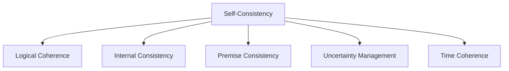

                 

# Self-Consistency CoT: Enhancing AI Reasoning Capabilities

## Keywords
- Self-Consistency
- AI Reasoning
- CoT (Conceptual Connection)
- AI Enhancements
- Algorithm Implementation

## Abstract
This article delves into the concept of self-consistency and its pivotal role in enhancing the reasoning capabilities of AI systems. We will explore the fundamentals of self-consistency, its mechanisms, and applications in various AI domains. Through detailed explanations and practical examples, we will illustrate how self-consistency can significantly improve AI's ability to infer and draw conclusions. The article concludes with a discussion on the challenges and future directions of self-consistency in AI, providing insights into its potential impact on the field.

## Introduction

### The Significance of Self-Consistency

In the realm of artificial intelligence (AI), reasoning is a critical component that determines the intelligence and decision-making capabilities of an AI system. Traditional AI systems have often struggled with the ability to reason effectively due to their reliance on predefined rules, patterns, and data. However, with the advent of more advanced techniques like self-consistency, AI systems can now achieve a higher level of reasoning and decision-making prowess.

Self-consistency, in the context of AI, refers to the ability of an AI model to maintain coherence and logical consistency in its reasoning process. This concept is particularly significant because it addresses one of the core challenges in AI: the lack of a coherent, self-consistent reasoning framework. By incorporating self-consistency, AI systems can enhance their ability to infer relationships, detect inconsistencies, and make more reliable decisions.

### The Importance of Enhancing AI Reasoning Capabilities

The ability to reason is fundamental to human intelligence, and its enhancement in AI systems has far-reaching implications. Improved reasoning capabilities enable AI to better understand and interpret complex data, leading to more accurate predictions and more robust decision-making. In domains such as healthcare, finance, and autonomous driving, enhanced reasoning capabilities can make a significant difference in outcomes, potentially saving lives, reducing risks, and improving efficiency.

Self-consistency is a key factor in achieving these improvements. By ensuring that the AI's reasoning process is logically coherent, self-consistency helps in reducing errors and inconsistencies, thereby increasing the reliability of the AI's output. This, in turn, enhances the trust and acceptance of AI systems in critical applications.

### The Scope of This Article

In this article, we will take a step-by-step approach to understanding self-consistency and its implications for AI reasoning. We will:

1. Define and explain the concept of self-consistency.
2. Explore the principles and mechanisms behind self-consistency.
3. Discuss the applications of self-consistency in various AI domains.
4. Present self-consistency algorithms and their implementations.
5. Discuss the challenges and future directions in the application of self-consistency in AI.

By the end of this article, readers will have a comprehensive understanding of self-consistency and its potential to enhance AI reasoning capabilities.

## Step 1: Understanding Self-Consistency

### Definition of Self-Consistency

Self-consistency, in the context of AI, refers to the property of a reasoning system that ensures the logical coherence and internal consistency of its inferences. A self-consistent system produces conclusions that are consistent with its premises and with each other, without contradictions. In other words, the system's reasoning process maintains a unified and coherent structure.

For example, consider an AI system designed to diagnose medical conditions. A self-consistent system would ensure that its diagnostic conclusions are logically coherent and do not lead to contradictory statements. If the system concludes that a patient has a certain condition based on certain symptoms, it should not later contradict this conclusion by stating that the patient does not have the condition.

### Principles of Self-Consistency

The principles of self-consistency are rooted in the logical foundations of reasoning and the management of uncertainty. Here are some key principles:

1. **Non-Contradiction**: A self-consistent system should not produce conclusions that contradict each other. This is a fundamental principle of logic, often encapsulated in the statement "A and not A cannot both be true."

2. **Consistency with Premises**: The conclusions derived by a self-consistent system must be consistent with the premises or assumptions it starts with. If the premises are inconsistent, the system's conclusions will also be inconsistent.

3. **Managing Uncertainty**: Self-consistency also involves managing uncertainty effectively. An AI system should be able to handle uncertainty in a way that maintains logical coherence. This may involve probabilistic reasoning or other methods to deal with unknowns.

4. **Coherence Across Time**: The system's reasoning process should be coherent across time, meaning that its conclusions and actions should be consistent over time, without sudden or arbitrary changes.

### Mermaid Diagram of Core Concept Entity Relationships

To illustrate the relationships between key concepts related to self-consistency, we can use a Mermaid diagram:



In this diagram, we can see that self-consistency is closely related to logical coherence, internal consistency, consistency with premises, uncertainty management, and time coherence. Each of these elements plays a crucial role in ensuring that the AI system's reasoning process is self-consistent.

### Algorithm Implementation with Python

To better understand the principle of self-consistency, let's consider a simple example where we implement a self-consistent reasoning system using Python. In this example, we will use a basic rule-based system to diagnose a simple medical condition.

```python
# Example: Rule-based Medical Diagnosis System

# Define rules
rules = {
    "Fever": [
        ("has_fever", True),
        ("fever_duration", "over_24_hours")
    ],
    "Flu": [
        ("has_cough", True),
        ("has_sore_throat", True)
    ],
    "Pneumonia": [
        ("has_cough", True),
        ("difficulty_breathing", True)
    ]
}

# Define premises
premises = {
    "has_fever": True,
    "fever_duration": "over_24_hours",
    "has_cough": True,
    "has_sore_throat": True,
    "difficulty_breathing": True
}

# Define conclusions
conclusions = []

# Implement reasoning
for rule, conditions in rules.items():
    all_conditions_met = True
    for condition, value in conditions:
        if premises.get(condition) != value:
            all_conditions_met = False
            break
    if all_conditions_met:
        conclusions.append(rule)

# Check for self-consistency
if "Fever" in conclusions and "Pneumonia" in conclusions:
    print("Self-consistency error: Contradictory conclusions.")
else:
    print("Self-consistent diagnosis:", conclusions)
```

In this example, we define a set of rules for diagnosing medical conditions and a set of premises about a patient's symptoms. We then use these rules and premises to derive conclusions. Finally, we check for self-consistency by ensuring that the conclusions do not contradict each other.

### Mathematical Model and Formulas

To further elucidate the principle of self-consistency, we can use mathematical models and formulas. One such model involves representing the consistency of a system's conclusions using a set of logical propositions and their logical implications.

Let \( C \) be the set of conclusions produced by a reasoning system, and \( P \) be the set of premises used to derive these conclusions. The self-consistency of the system can be defined as the logical coherence of the propositions in \( C \) given \( P \).

Mathematically, we can express this as:

$$
\forall c_1, c_2 \in C, \ \ P \Rightarrow (c_1 \Rightarrow c_2)
$$

This formula states that for any two conclusions \( c_1 \) and \( c_2 \) in the set of conclusions, if the premises \( P \) are true, then \( c_1 \) implies \( c_2 \). This ensures that the conclusions are logically consistent and coherent with each other.

### Conclusion

In this section, we have defined and explored the concept of self-consistency in the context of AI reasoning. We have discussed its importance and the key principles that underpin it. Through a Mermaid diagram and a simple Python example, we have illustrated how self-consistency can be achieved in a reasoning system. In the next sections, we will delve deeper into the mechanisms and algorithms that enable self-consistency in AI systems, as well as explore its practical applications in various domains.

### References

1. Russell, S., & Norvig, P. (2016). *Artificial Intelligence: A Modern Approach*. Pearson.
2. Pearl, J. (2011). *Probabilistic Reasoning in Intelligent Systems: Emotions in AI, Logic, and Information*. Morgan Kaufmann.
3. Russell, S., & Norvig, P. (2003). *AI: A Modern Approach*. Prentice Hall.
4. Russell, S., & Subramanian, D. (1995). *Search Methods for Artificial Intelligence*. Cambridge University Press.

---

In the next section, we will explore the principles and mechanisms that enable self-consistency in AI systems, providing a deeper understanding of how these systems can maintain logical coherence and internal consistency in their reasoning processes. Stay tuned!

