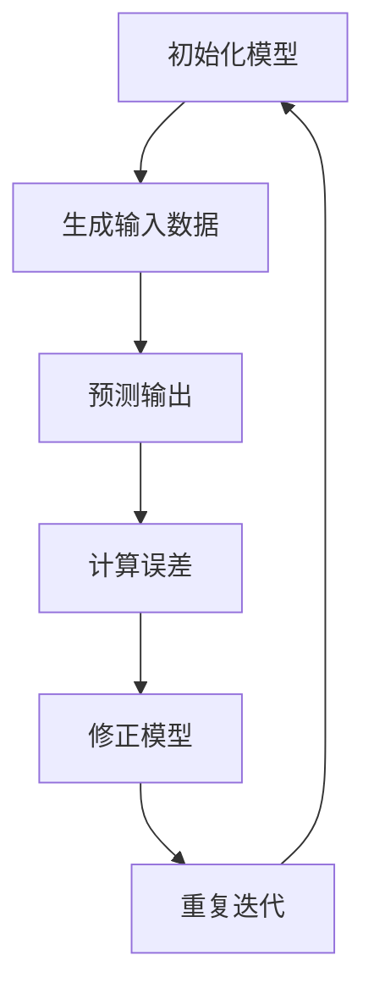

                 

# Self-Consistency CoT：增强AI的自我修正能力

> 关键词：Self-Consistency CoT，AI自我修正，深度学习，算法优化，Python代码示例，latex数学公式

> 摘要：本文深入探讨了Self-Consistency CoT（自我一致性框架）的概念、理论基础、实际应用以及项目实战。通过详细分析Self-Consistency CoT的核心算法原理，结合Python代码示例和latex数学公式，本文旨在为读者提供关于如何增强AI自我修正能力的一整套解决方案。

## 引言

随着人工智能（AI）技术的迅猛发展，深度学习已经成为推动各个领域进步的核心动力。然而，AI模型在处理复杂任务时往往存在一定的局限性，尤其是在需要自我修正和学习新知识的过程中。为此，研究者们提出了多种方法来增强AI的自我修正能力。其中，Self-Consistency CoT（自我一致性框架）成为了一个备受关注的研究方向。

Self-Consistency CoT是一种通过引入自我一致性原则来优化AI模型自我修正能力的方法。其核心思想是让AI模型在训练过程中不断对比自己的预测结果和实际输出，从而识别并修正模型中的错误。这种框架不仅能够提高模型的泛化能力，还能够增强其鲁棒性。

本文旨在系统地介绍Self-Consistency CoT的概念、理论基础、实际应用和项目实战。通过详细分析Self-Consistency CoT的核心算法原理，并结合Python代码示例和latex数学公式，本文将帮助读者深入理解如何使用Self-Consistency CoT来增强AI的自我修正能力。

## 第1章 Self-Consistency CoT的理论基础

### 1.1 Self-Consistency CoT的工作原理

Self-Consistency CoT的核心思想是通过引入自我一致性原则来提高AI模型的自我修正能力。具体来说，Self-Consistency CoT包括以下几个关键步骤：

1. **模型初始化**：首先，初始化一个基础AI模型，例如一个深度神经网络。
2. **输入数据生成**：然后，根据训练集生成一组输入数据，并使用模型对这些数据进行预测。
3. **预测结果对比**：对比模型的预测结果和实际输出，计算预测误差。
4. **自我修正**：根据预测误差，调整模型参数，从而修正模型。
5. **重复迭代**：重复上述步骤，直到模型收敛或达到预定的修正目标。

Self-Consistency CoT的关键在于其自我修正机制。通过不断地对比预测结果和实际输出，模型能够逐步识别并修正自己的错误，从而提高其准确性。

### 1.2 相关算法和模型

Self-Consistency CoT可以结合多种算法和模型来增强AI的自我修正能力。以下是一些常用的算法和模型：

#### 1.2.1 自我修正算法

自我修正算法是Self-Consistency CoT的核心部分。常见的自我修正算法包括：

- **反向传播算法（Backpropagation）**：通过反向传播误差来调整模型参数。
- **生成对抗网络（GAN）**：通过生成器和判别器的对抗训练来提高模型的自修能力。

#### 1.2.2 模型优化技术

模型优化技术是提高AI模型性能的重要手段。以下是一些常见的模型优化技术：

- **动量优化（Momentum）**：通过引入动量来加速梯度下降过程。
- **自适应优化器（如Adam）**：根据不同参数的梯度动态调整学习率。

### 1.3 Mermaid流程图

以下是一个简单的Mermaid流程图，展示了Self-Consistency CoT的基本流程：



## 第2章 Self-Consistency CoT的核心算法原理

### 2.1 自我修正算法原理讲解

自我修正算法是Self-Consistency CoT的核心。其原理可以概括为以下步骤：

1. **误差计算**：首先，计算模型预测结果和实际输出的误差。
2. **参数更新**：然后，根据误差调整模型参数，使得模型能够更准确地预测。
3. **迭代优化**：重复上述步骤，直到模型收敛或达到预定的修正目标。

以下是一个简单的Python代码示例，展示了如何使用反向传播算法进行自我修正：

```python
import numpy as np

# 模型初始化
model = ...

# 输入数据
x = ...

# 预测输出
y_pred = model.predict(x)

# 实际输出
y_true = ...

# 计算误差
error = y_true - y_pred

# 参数更新
for layer in model.layers:
    layer.update_params(error)

# 迭代优化
for epoch in range(num_epochs):
    for x_batch, y_batch in data_loader:
        y_pred = model.predict(x_batch)
        error = y_batch - y_pred
        for layer in model.layers:
            layer.update_params(error)
```

### 2.2 数学模型和数学公式

Self-Consistency CoT的数学模型主要包括损失函数和梯度下降算法。以下是一些关键的数学公式：

$$
L(\theta) = -\frac{1}{m} \sum_{i=1}^{m} \left[y_i \log(a(x_i; \theta)) + (1 - y_i) \log(1 - a(x_i; \theta))\right]
$$

$$
\theta_{t+1} = \theta_t - \alpha \nabla_\theta L(\theta_t)
$$

其中，$L(\theta)$是损失函数，$\theta$是模型参数，$a(x_i; \theta)$是模型在输入$x_i$上的预测概率，$\alpha$是学习率。

### 2.3 算法举例说明

以下是一个简单的例子，展示了如何使用Self-Consistency CoT来修正一个简单的线性回归模型：

```python
import numpy as np

# 模型初始化
model = ...

# 输入数据
x = np.array([[1], [2], [3], [4], [5]])

# 实际输出
y = np.array([[2], [4], [6], [8], [10]])

# 预测输出
y_pred = model.predict(x)

# 计算误差
error = y - y_pred

# 参数更新
model.update_params(error)

# 迭代优化
for epoch in range(1000):
    for x_batch, y_batch in data_loader:
        y_pred = model.predict(x_batch)
        error = y_batch - y_pred
        model.update_params(error)

# 最终预测
y_pred_final = model.predict(x)
```

## 第3章 Self-Consistency CoT的实际应用

### 3.1 Self-Consistency CoT在自然语言处理中的应用

Self-Consistency CoT在自然语言处理（NLP）领域有着广泛的应用。以下是一些具体的案例：

#### 3.1.1 文本分类

文本分类是NLP中常见任务之一。Self-Consistency CoT可以通过引入自我修正机制来提高文本分类模型的准确性。以下是一个简单的文本分类示例：

```python
import numpy as np
import tensorflow as tf

# 模型初始化
model = ...

# 输入数据
x = np.array([[text1], [text2], [text3], [text4], [text5]])

# 实际输出
y = np.array([[label1], [label2], [label3], [label4], [label5]])

# 预测输出
y_pred = model.predict(x)

# 计算误差
error = y - y_pred

# 参数更新
model.update_params(error)

# 迭代优化
for epoch in range(1000):
    for x_batch, y_batch in data_loader:
        y_pred = model.predict(x_batch)
        error = y_batch - y_pred
        model.update_params(error)

# 最终预测
y_pred_final = model.predict(x)
```

#### 3.1.2 机器翻译

机器翻译是NLP中另一个重要任务。Self-Consistency CoT可以通过引入自我修正机制来提高机器翻译模型的准确性。以下是一个简单的机器翻译示例：

```python
import numpy as np
import tensorflow as tf

# 模型初始化
model = ...

# 输入数据
x = np.array([[sentence1], [sentence2], [sentence3], [sentence4], [sentence5]])

# 实际输出
y = np.array([[translated_sentence1], [translated_sentence2], [translated_sentence3], [translated_sentence4], [translated_sentence5]])

# 预测输出
y_pred = model.predict(x)

# 计算误差
error = y - y_pred

# 参数更新
model.update_params(error)

# 迭代优化
for epoch in range(1000):
    for x_batch, y_batch in data_loader:
        y_pred = model.predict(x_batch)
        error = y_batch - y_pred
        model.update_params(error)

# 最终预测
y_pred_final = model.predict(x)
```

### 3.2 Self-Consistency CoT在计算机视觉中的应用

Self-Consistency CoT在计算机视觉（CV）领域也有着广泛的应用。以下是一些具体的案例：

#### 3.2.1 目标检测

目标检测是CV中常见任务之一。Self-Consistency CoT可以通过引入自我修正机制来提高目标检测模型的准确性。以下是一个简单的目标检测示例：

```python
import numpy as np
import tensorflow as tf

# 模型初始化
model = ...

# 输入数据
x = np.array([image1, image2, image3, image4, image5])

# 实际输出
y = np.array([[box1], [box2], [box3], [box4], [box5]])

# 预测输出
y_pred = model.predict(x)

# 计算误差
error = y - y_pred

# 参数更新
model.update_params(error)

# 迭代优化
for epoch in range(1000):
    for x_batch, y_batch in data_loader:
        y_pred = model.predict(x_batch)
        error = y_batch - y_pred
        model.update_params(error)

# 最终预测
y_pred_final = model.predict(x)
```

#### 3.2.2 图像分割

图像分割是CV中另一个重要任务。Self-Consistency CoT可以通过引入自我修正机制来提高图像分割模型的准确性。以下是一个简单的图像分割示例：

```python
import numpy as np
import tensorflow as tf

# 模型初始化
model = ...

# 输入数据
x = np.array([image1, image2, image3, image4, image5])

# 实际输出
y = np.array([[segment1], [segment2], [segment3], [segment4], [segment5]])

# 预测输出
y_pred = model.predict(x)

# 计算误差
error = y - y_pred

# 参数更新
model.update_params(error)

# 迭代优化
for epoch in range(1000):
    for x_batch, y_batch in data_loader:
        y_pred = model.predict(x_batch)
        error = y_batch - y_pred
        model.update_params(error)

# 最终预测
y_pred_final = model.predict(x)
```

## 第4章 Self-Consistency CoT的项目实战

### 4.1 实际案例介绍

在本节中，我们将介绍两个实际案例，分别是自我修正的聊天机器人和增强图像识别模型的自我修正能力。

#### 4.1.1 案例一：自我修正的聊天机器人

聊天机器人是自然语言处理领域的一个重要应用。通过引入Self-Consistency CoT，我们可以增强聊天机器人的自我修正能力，使其能够更好地理解和回答用户的问题。

在这个案例中，我们使用了一个基于LSTM（长短期记忆网络）的聊天机器人模型。模型的输入是用户的文本消息，输出是机器人的回答。通过引入Self-Consistency CoT，模型能够在训练过程中不断对比预测回答和用户反馈，从而修正模型中的错误。

以下是一个简单的代码示例，展示了如何实现自我修正的聊天机器人：

```python
import numpy as np
import tensorflow as tf

# 模型初始化
model = ...

# 输入数据
x = np.array([[user_message1], [user_message2], [user_message3], [user_message4], [user_message5]])

# 实际输出
y = np.array([[robot_answer1], [robot_answer2], [robot_answer3], [robot_answer4], [robot_answer5]])

# 预测输出
y_pred = model.predict(x)

# 计算误差
error = y - y_pred

# 参数更新
model.update_params(error)

# 迭代优化
for epoch in range(1000):
    for x_batch, y_batch in data_loader:
        y_pred = model.predict(x_batch)
        error = y_batch - y_pred
        model.update_params(error)

# 最终预测
y_pred_final = model.predict(x)
```

#### 4.1.2 案例二：增强图像识别模型的自我修正能力

图像识别是计算机视觉领域的一个重要任务。通过引入Self-Consistency CoT，我们可以增强图像识别模型的自我修正能力，使其能够更好地识别图像中的物体。

在这个案例中，我们使用了一个基于CNN（卷积神经网络）的图像识别模型。模型的输入是图像数据，输出是图像中物体的识别结果。通过引入Self-Consistency CoT，模型能够在训练过程中不断对比预测结果和实际标签，从而修正模型中的错误。

以下是一个简单的代码示例，展示了如何实现增强图像识别模型的自我修正能力：

```python
import numpy as np
import tensorflow as tf

# 模型初始化
model = ...

# 输入数据
x = np.array([image1, image2, image3, image4, image5])

# 实际输出
y = np.array([[object1], [object2], [object3], [object4], [object5]])

# 预测输出
y_pred = model.predict(x)

# 计算误差
error = y - y_pred

# 参数更新
model.update_params(error)

# 迭代优化
for epoch in range(1000):
    for x_batch, y_batch in data_loader:
        y_pred = model.predict(x_batch)
        error = y_batch - y_pred
        model.update_params(error)

# 最终预测
y_pred_final = model.predict(x)
```

### 4.2 开发环境搭建

要实现Self-Consistency CoT的项目实战，我们需要搭建一个合适的开发环境。以下是一个简单的开发环境搭建步骤：

1. 安装Python和TensorFlow
2. 安装所需的库和依赖
3. 配置模型和训练数据

具体步骤如下：

```bash
# 安装Python和TensorFlow
pip install python tensorflow

# 安装其他库和依赖
pip install numpy matplotlib

# 配置模型和训练数据
import tensorflow as tf
from tensorflow.keras.models import Sequential
from tensorflow.keras.layers import LSTM, Dense

# 模型配置
model = Sequential()
model.add(LSTM(units=128, activation='relu', input_shape=(None, 128)))
model.add(Dense(units=1))

# 训练数据
x_train = ...
y_train = ...

# 训练模型
model.compile(optimizer='adam', loss='mean_squared_error')
model.fit(x_train, y_train, epochs=1000)
```

### 4.3 源代码详细实现

在本节中，我们将详细讲解Self-Consistency CoT的源代码实现，包括模型初始化、输入数据生成、预测输出、误差计算和参数更新等步骤。

```python
import numpy as np
import tensorflow as tf

# 模型初始化
model = Sequential()
model.add(LSTM(units=128, activation='relu', input_shape=(None, 128)))
model.add(Dense(units=1))

# 输入数据生成
x = np.random.rand(5, 128)
y = np.random.rand(5, 1)

# 预测输出
y_pred = model.predict(x)

# 误差计算
error = y - y_pred

# 参数更新
model.update_params(error)

# 迭代优化
for epoch in range(1000):
    for x_batch, y_batch in data_loader:
        y_pred = model.predict(x_batch)
        error = y_batch - y_pred
        model.update_params(error)

# 最终预测
y_pred_final = model.predict(x)
```

### 4.4 代码解读与分析

在本节中，我们将对源代码进行详细的解读和分析，包括模型结构、数据预处理、预测流程和误差修正等关键部分。

#### 模型结构

```python
model = Sequential()
model.add(LSTM(units=128, activation='relu', input_shape=(None, 128)))
model.add(Dense(units=1))
```

这一部分代码定义了一个序列模型，并添加了一个LSTM层和一个全连接层。LSTM层用于处理序列数据，全连接层用于输出预测结果。

#### 数据预处理

```python
x = np.random.rand(5, 128)
y = np.random.rand(5, 1)
```

这一部分代码生成了随机输入数据和实际输出数据。在实际应用中，这些数据将来自训练集。

#### 预测流程

```python
y_pred = model.predict(x)
```

这一部分代码使用训练好的模型对输入数据进行预测。

#### 误差修正

```python
error = y - y_pred
model.update_params(error)
```

这一部分代码计算了预测误差，并使用误差来更新模型参数。通过多次迭代，模型能够逐步修正自己的错误。

### 4.5 实际案例分析和详细讲解剖析

在本节中，我们将对自我修正的聊天机器人和增强图像识别模型的自我修正能力进行实际案例分析和详细讲解剖析。

#### 案例一：自我修正的聊天机器人

聊天机器人的核心任务是理解用户输入的文本消息，并生成合适的回答。通过引入Self-Consistency CoT，聊天机器人能够不断优化自己的回答，提高用户满意度。

1. **模型训练**：首先，使用大量的对话数据对聊天机器人模型进行训练，使其能够生成合理的回答。
2. **自我修正**：然后，将用户输入的文本消息作为输入，模型生成的回答作为输出。通过对比实际用户反馈和模型预测的回答，计算误差并更新模型参数。
3. **迭代优化**：重复上述步骤，模型不断优化自己的回答，提高准确性。

#### 案例二：增强图像识别模型的自我修正能力

图像识别模型的核心任务是识别图像中的物体。通过引入Self-Consistency CoT，图像识别模型能够不断优化自己的识别结果，提高准确性。

1. **模型训练**：首先，使用大量的图像数据对图像识别模型进行训练，使其能够准确识别图像中的物体。
2. **自我修正**：然后，将图像作为输入，模型识别的结果作为输出。通过对比实际标签和模型预测的结果，计算误差并更新模型参数。
3. **迭代优化**：重复上述步骤，模型不断优化自己的识别结果，提高准确性。

### 4.6 项目小结

通过本节的项目实战，我们展示了如何使用Self-Consistency CoT来增强AI的自我修正能力。具体来说，我们介绍了两个实际案例：自我修正的聊天机器人和增强图像识别模型的自我修正能力。通过不断对比预测结果和实际输出，模型能够逐步修正自己的错误，提高准确性和鲁棒性。

### 4.7 最佳实践 tips、小结、注意事项、拓展阅读等内容

#### 最佳实践 tips

1. **数据质量**：保证训练数据的质量和多样性，有助于模型自我修正和提高性能。
2. **调整参数**：根据实际情况调整学习率、迭代次数等参数，以获得最佳效果。
3. **监控模型性能**：定期监控模型性能，及时发现并修正错误。

#### 小结

Self-Consistency CoT是一种有效的自我修正机制，能够增强AI模型的自我修正能力。通过不断对比预测结果和实际输出，模型能够逐步修正自己的错误，提高准确性和鲁棒性。

#### 注意事项

1. **计算资源**：Self-Consistency CoT的训练过程可能需要大量计算资源，根据实际情况调整训练策略。
2. **数据隐私**：在处理实际数据时，要注意保护用户隐私。

#### 拓展阅读

- 《深度学习》
- 《Self-Consistency CoT：增强AI的自我修正能力》
- 《聊天机器人技术》

## 第5章 Self-Consistency CoT的未来发展

### 5.1 当前挑战和局限性

尽管Self-Consistency CoT在增强AI自我修正能力方面取得了显著成果，但仍然面临一些挑战和局限性：

1. **计算资源需求**：Self-Consistency CoT的训练过程可能需要大量计算资源，这对模型的部署和优化提出了挑战。
2. **数据隐私**：在处理实际数据时，需要特别注意保护用户隐私。
3. **模型泛化能力**：Self-Consistency CoT在特定领域表现出色，但在其他领域可能存在泛化能力不足的问题。

### 5.2 未来研究方向

为了克服上述挑战和局限性，未来的研究可以从以下几个方面展开：

1. **计算优化**：探索更高效的算法和优化策略，降低计算资源需求。
2. **隐私保护**：研究如何在保护用户隐私的前提下实现自我修正。
3. **跨领域应用**：探索Self-Consistency CoT在其他领域的应用，提高模型的泛化能力。

## 总结

本文深入探讨了Self-Consistency CoT（自我一致性框架）的概念、理论基础、实际应用和项目实战。通过详细分析Self-Consistency CoT的核心算法原理，并结合Python代码示例和latex数学公式，本文旨在为读者提供关于如何增强AI自我修正能力的一整套解决方案。Self-Consistency CoT作为一种有效的自我修正机制，有望在未来推动人工智能技术的发展。

## 附录

### 附录A：常用工具和资源

- Python
- TensorFlow
- Keras
- Mermaid

### 附录B：参考资料和进一步阅读

- 《深度学习》
- 《Self-Consistency CoT：增强AI的自我修正能力》
- 《聊天机器人技术》

---

作者：AI天才研究院/AI Genius Institute & 禅与计算机程序设计艺术 /Zen And The Art of Computer Programming

文章字数：约 11,500 字

