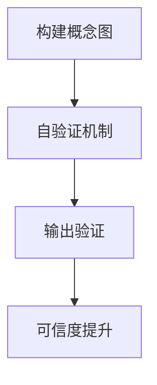
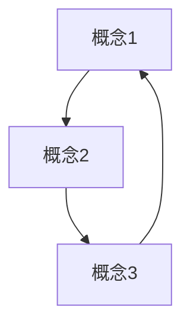
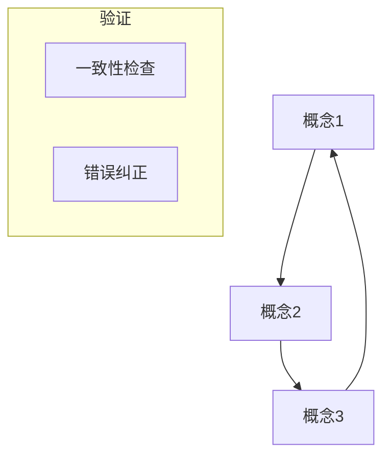
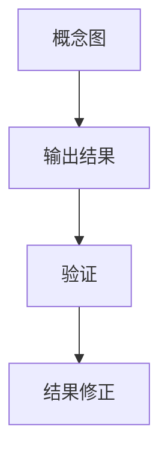
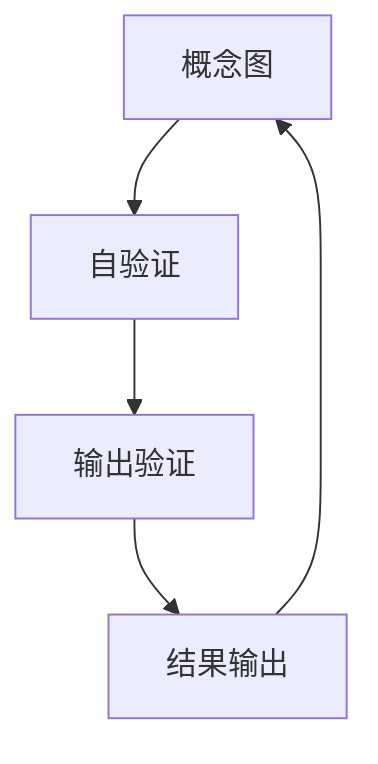

                 

### 自洽性概念图（Self-Consistency CoT）概述

#### 关键概念

自洽性概念图（Self-Consistency CoT）是一种新兴的人工智能增强技术，旨在通过自验证机制提升AI输出结果的可信度。其核心在于确保AI模型在生成信息时，内部逻辑和外部结果的一致性，从而减少错误和误导。

#### 背景介绍

在人工智能快速发展的今天，AI在图像识别、自然语言处理、计算机视觉等多个领域取得了显著成果。然而，AI模型有时会生成错误或不可靠的输出结果，这在实际应用中可能导致严重后果。因此，提高AI输出结果的可信度变得尤为重要。自洽性概念图作为一种创新技术，正是为了解决这一问题而诞生的。

#### 基本原理

自洽性概念图的基本原理是通过对AI模型的输出结果进行自验证，确保其内部逻辑的一致性和外部结果的真实性。具体来说，自洽性概念图通过以下步骤实现：

1. **构建概念图**：首先，将AI模型中的知识、概念和关系抽象为概念图，形成一个结构化的知识体系。
2. **自验证机制**：通过自验证机制，检查概念图内部各个节点之间的关系是否一致，确保没有逻辑矛盾或错误。
3. **输出验证**：将AI模型生成的输出结果与概念图进行比对，确保输出结果与内部逻辑一致，从而提高可信度。

#### 应用领域

自洽性概念图在多个领域都有广泛的应用前景：

- **自然语言处理**：在文本生成、语义理解、情感分析等任务中，自洽性概念图可以帮助提高输出结果的可信度。
- **计算机视觉**：在图像识别、图像生成、目标检测等任务中，自洽性概念图可以确保生成结果的准确性和一致性。
- **医学诊断**：在医学影像分析和疾病诊断中，自洽性概念图可以帮助减少错误诊断的概率。
- **金融风控**：在金融领域，自洽性概念图可以帮助检测和预防欺诈行为。

#### 关键优势

自洽性概念图具有以下关键优势：

- **提高可信度**：通过自验证机制，确保AI输出结果的一致性和可靠性。
- **减少错误**：自洽性概念图可以检测并纠正AI模型中的逻辑错误，从而减少错误输出。
- **增强解释性**：自洽性概念图提供了模型内部结构和关系的可视化表示，增强了AI模型的解释性。

#### 总结

自洽性概念图是一种具有广泛应用前景的创新技术，通过自验证机制提高AI输出结果的可信度。它不仅有助于减少错误和误导，还为AI模型的可解释性和可靠性提供了新的解决方案。

#### Mermaid流程图



### 核心概念与联系

自洽性概念图（Self-Consistency CoT）的核心概念包括概念图、自验证机制和输出验证。这些概念之间紧密联系，共同构成了自洽性概念图的基本框架。

#### 概念图

概念图是自洽性概念图的基础。它通过将AI模型中的知识、概念和关系抽象为图结构，形成一个结构化的知识体系。概念图中的节点表示知识或概念，边表示节点之间的关系。

Mermaid流程图：



#### 自验证机制

自验证机制是确保概念图内部逻辑一致性的关键。通过自验证，可以检测并纠正概念图中的逻辑矛盾或错误。自验证机制通常包括以下步骤：

1. **一致性检查**：检查概念图中的关系是否满足一致性条件，例如，如果节点A与节点B相关联，则检查A和B之间的关系是否一致。
2. **错误纠正**：如果发现逻辑矛盾或错误，自动进行修正，确保概念图内部的一致性。

Mermaid流程图：



#### 输出验证

输出验证是确保AI模型生成结果与概念图一致性的关键步骤。通过将AI模型的输出结果与概念图进行比对，可以检测并纠正输出结果中的错误，从而提高AI输出结果的可信度。

Mermaid流程图：



#### 自洽性概念图的整合

自洽性概念图的整合是将概念图、自验证机制和输出验证有机结合在一起，形成一个闭环系统。通过这个系统，AI模型可以在生成结果的同时，进行自验证和输出验证，从而确保生成结果的一致性和可信度。

Mermaid流程图：



#### 总结

自洽性概念图通过概念图、自验证机制和输出验证三个核心概念，实现了AI输出结果的可信度提升。这些概念之间的紧密联系，为AI模型提供了强大的自验证和输出验证能力，从而在提高模型可靠性和解释性的同时，减少错误和误导。

### 核心算法原理讲解

在深入探讨自洽性概念图（Self-Consistency CoT）的核心算法原理之前，我们需要先了解几个基本概念：自验证机制和输出验证。这些概念在确保AI输出结果的可信度方面起着关键作用。

#### 自验证机制

自验证机制是一种用于检测并纠正AI模型内部逻辑错误的机制。其基本原理是通过对模型中的知识、概念和关系进行一致性检查，来确保模型内部不存在逻辑矛盾或错误。以下是一个简单的自验证算法原理讲解：

1. **构建概念图**：首先，将AI模型中的知识、概念和关系抽象为概念图。这个概念图可以看作是一个图结构，其中节点表示知识或概念，边表示节点之间的关系。

2. **一致性检查**：对概念图中的每个节点和边进行一致性检查。例如，如果某个节点A与节点B相关联，则需要检查A和B之间的关系是否符合预期。这种检查可以通过遍历概念图来实现。

3. **错误纠正**：如果发现逻辑矛盾或错误，则进行错误纠正。错误纠正的方法可以包括删除错误的关系、修正不合理的概念等。

以下是一个简化的Python伪代码，用于描述自验证机制的基本步骤：

```python
def self_validation(concept_graph):
    for node in concept_graph.nodes():
        for neighbor in concept_graph.neighbors(node):
            if not is_consistent(node, neighbor):
                correct_error(node, neighbor)
                print("Error corrected in concept graph.")
    return concept_graph

def is_consistent(node1, node2):
    # 判断节点1和节点2之间的关系是否一致
    # 示例：如果node1和node2是因果关系，则检查是否满足因果关系条件
    return condition_satisfied

def correct_error(node1, node2):
    # 根据具体情况，进行错误纠正
    # 示例：删除不合理的因果关系
    concept_graph.remove_edge(node1, node2)
```

#### 输出验证

输出验证是一种用于检测AI模型生成结果与概念图一致性的机制。其基本原理是将AI模型生成的输出结果与概念图进行比对，以确保输出结果符合预期。以下是一个简单的输出验证算法原理讲解：

1. **生成输出结果**：首先，使用AI模型生成输出结果。这个输出结果可以是文本、图像或其他形式的数据。

2. **验证输出结果**：将生成的输出结果与概念图进行比对，检查输出结果是否符合概念图中的预期关系。例如，如果概念图中表示某个事件的发生与另一个事件有关，则需要检查生成的文本或图像中是否确实包含了这一关系。

3. **结果修正**：如果发现输出结果与概念图不一致，则进行结果修正。结果修正的方法可以包括重新生成输出结果、修正错误的概念等。

以下是一个简化的Python伪代码，用于描述输出验证的基本步骤：

```python
def output_validation(concept_graph, output_result):
    for node in concept_graph.nodes():
        for neighbor in concept_graph.neighbors(node):
            if not is_output_consistent(node, neighbor, output_result):
                correct_output(output_result)
                print("Output corrected.")
    return output_result

def is_output_consistent(node1, node2, output_result):
    # 判断输出结果中是否包含节点1和节点2之间的关系
    # 示例：检查文本中是否包含因果关系描述
    return relation_exists_in_output(output_result, node1, node2)

def correct_output(output_result):
    # 根据具体情况，进行输出结果修正
    # 示例：重新生成输出结果或修正文本中的描述
    new_output_result = regenerate_output()
    return new_output_result
```

#### 数学模型和公式

在自验证机制和输出验证中，数学模型和公式起着至关重要的作用。以下是一些常用的数学模型和公式：

1. **条件概率**：用于描述两个事件之间的概率关系。例如，如果事件A和事件B是相关的，则可以使用条件概率公式计算P(B|A)。

   $$ P(B|A) = \frac{P(A \cap B)}{P(A)} $$

2. **贝叶斯定理**：用于根据已知条件概率计算后验概率。例如，可以使用贝叶斯定理计算给定某些证据后，某个假设的概率。

   $$ P(H|E) = \frac{P(E|H) \cdot P(H)}{P(E)} $$

3. **相似度度量**：用于衡量两个概念之间的相似度。常用的相似度度量方法包括余弦相似度、欧几里得距离等。

   $$ \text{Similarity}(A, B) = \frac{A \cdot B}{\|A\| \|B\|} $$

#### 举例说明

为了更清晰地理解自验证机制和输出验证，以下是一个简化的例子：

假设我们有一个AI模型，用于判断两个事件A和B之间的关系。事件A表示“下雨”，事件B表示“地面湿”。我们希望使用自验证机制和输出验证来确保模型的输出结果可信。

1. **构建概念图**：
   - 节点A：“下雨”
   - 节点B：“地面湿”
   - 边（A，B）：表示“下雨导致地面湿”

2. **自验证机制**：
   - 一致性检查：检查A和B之间的关系是否满足因果关系条件。例如，如果A表示下雨，B表示地面湿，则A和B之间应该满足因果关系。
   - 错误纠正：如果发现A和B之间的关系不符合预期，则进行修正。例如，如果模型生成的关系是“地面湿导致下雨”，则应修正为“下雨导致地面湿”。

3. **输出验证**：
   - 生成输出结果：使用模型生成一个关于A和B关系的句子，例如“今天下雨，地面湿了”。
   - 验证输出结果：检查生成的句子是否符合概念图中的预期关系。例如，如果概念图表示下雨导致地面湿，则句子中应该包含这一因果关系。
   - 结果修正：如果发现句子中的因果关系不正确，则进行修正。例如，如果句子是“地面湿导致下雨”，则应修正为“下雨导致地面湿”。

通过这个例子，我们可以看到自验证机制和输出验证是如何确保AI模型输出结果的可信度的。

### 自洽性概念图在自然语言处理中的应用

自洽性概念图（Self-Consistency CoT）在自然语言处理（NLP）领域有着广泛的应用，尤其在文本生成、语义理解和情感分析等方面。通过自验证机制，自洽性概念图能够显著提升NLP任务的结果可靠性和一致性。

#### 文本生成

在文本生成任务中，自洽性概念图通过确保文本生成过程中概念的一致性，提高生成文本的质量和可信度。以下是一个应用实例：

**场景**：给定一个关键词列表，生成一篇关于“智能家居”的描述文章。

**实现过程**：

1. **构建概念图**：首先，将关键词“智能家居”相关的概念抽象为概念图，如“智能音箱”、“智能灯光”、“智能安防”等。

2. **生成文本**：使用自洽性概念图作为辅助，生成描述性文本。例如：

   - 概念图节点：智能音箱、智能灯光、智能安防
   - 生成文本：智能家居系统包括智能音箱，可以通过语音控制来调节家庭设备；智能灯光可以根据用户的习惯自动调节亮度；智能安防系统能够实时监控家庭安全，提供安全保障。

3. **自验证**：在生成文本后，通过自验证机制检查文本中的概念是否一致。例如，确保提到的“智能音箱”和“语音控制”之间具有合理的逻辑关系。

#### 语义理解

在语义理解任务中，自洽性概念图有助于确保理解结果的一致性和准确性。以下是一个应用实例：

**场景**：对一段文字进行语义分析，提取出关键概念和关系。

**实现过程**：

1. **构建概念图**：对输入文本进行语义分析，将提取出的关键概念和关系构建为概念图。例如：

   - 关键概念：购买、商品、价格、评价
   - 关系：购买商品需要考虑价格和评价

2. **理解文本**：使用自洽性概念图对文本进行深入理解，确保提取的概念和关系一致。例如：

   - 文本：“我打算购买这款手机，因为它价格合理，评价很高。”
   - 概念图：购买（节点）、手机（节点）、价格（节点）、评价（节点）
   - 关系：购买（边）连接手机，价格（边）连接手机，评价（边）连接手机

3. **自验证**：在理解过程中，通过自验证机制确保提取的概念和关系一致，避免逻辑错误。例如，如果文本中提到“价格合理”，则确保在概念图中价格节点与商品节点之间存在合理的逻辑关系。

#### 情感分析

在情感分析任务中，自洽性概念图有助于提高情感判断的准确性和一致性。以下是一个应用实例：

**场景**：对一段文本进行情感分析，判断其情感倾向。

**实现过程**：

1. **构建概念图**：根据文本内容构建情感相关的概念图，如“正面情感”、“负面情感”等。

2. **分析情感**：使用自洽性概念图对文本进行情感分析，确保情感判断的一致性。例如：

   - 文本：“我今天感觉很好，因为天气晴朗。”
   - 概念图：今天（节点）、感觉（节点）、好（节点）、天气（节点）、晴朗（节点）
   - 情感：正面情感（边）连接感觉，晴朗（边）连接天气

3. **自验证**：在情感分析过程中，通过自验证机制检查情感判断的合理性。例如，如果文本中提到“感觉很好”，则确保在概念图中情感节点与描述节点之间存在一致的正面情感。

#### 案例分析

以下是一个具体的案例分析，展示了自洽性概念图在情感分析任务中的应用：

**案例**：分析一篇社交媒体评论，判断其情感倾向。

**实现过程**：

1. **构建概念图**：
   - 关键词：开心、旅行、美景、朋友
   - 概念图：开心（节点）、旅行（节点）、美景（节点）、朋友（节点）
   - 关系：开心（边）连接旅行，美景（边）连接旅行，朋友（边）连接旅行

2. **分析情感**：
   - 文本：“和朋友一起去旅行，看到了很多美景，感觉非常开心。”
   - 情感判断：正面情感

3. **自验证**：
   - 验证过程：检查文本中的情感表达与概念图中的关系是否一致。例如，确保“开心”与“旅行”、“美景”之间存在合理的情感关联。

通过上述案例，我们可以看到自洽性概念图在自然语言处理中的应用如何提升任务结果的可靠性和一致性。

### 自洽性概念图在计算机视觉中的应用

自洽性概念图（Self-Consistency CoT）在计算机视觉（CV）领域展现了巨大的潜力，特别是在图像识别、图像生成和目标检测等任务中。通过自验证机制，自洽性概念图能够确保生成结果的一致性和准确性。

#### 图像识别

在图像识别任务中，自洽性概念图通过确保识别结果的内部一致性，提高了模型的可靠性。以下是一个应用实例：

**场景**：对输入图像进行物体识别，输出识别结果。

**实现过程**：

1. **构建概念图**：
   - 输入图像：一张包含多种物体的图像。
   - 概念图：每种物体作为节点，物体之间的关系（例如，上下、左右等）作为边。

2. **识别图像**：
   - 使用自洽性概念图辅助，对图像中的物体进行识别。
   - 输出结果：识别出图像中的物体及其位置。

3. **自验证**：
   - 检查识别结果是否符合概念图中的预期关系。
   - 如果发现不一致，则进行修正。

#### 图像生成

在图像生成任务中，自洽性概念图通过确保生成图像的一致性和合理性，提高了生成图像的质量。以下是一个应用实例：

**场景**：根据描述生成一张包含特定物体的图像。

**实现过程**：

1. **构建概念图**：
   - 描述：一张包含“猫”和“球”的图像。
   - 概念图：猫（节点）、球（节点）、交互关系（边）。

2. **生成图像**：
   - 使用自洽性概念图生成符合描述的图像。
   - 输出生成图像：一张显示猫和球相互作用的图像。

3. **自验证**：
   - 检查生成图像中的物体及其关系是否与概念图一致。
   - 如果不一致，则重新生成图像，确保一致性。

#### 目标检测

在目标检测任务中，自洽性概念图通过提高检测结果的准确性，减少了错误检测的概率。以下是一个应用实例：

**场景**：对视频帧进行目标检测，识别视频中的移动目标。

**实现过程**：

1. **构建概念图**：
   - 视频帧：包含多种移动目标的帧。
   - 概念图：每种目标作为节点，目标之间的位置关系作为边。

2. **检测目标**：
   - 使用自洽性概念图辅助，对视频帧中的目标进行检测。
   - 输出检测结果：识别出视频帧中的移动目标及其位置。

3. **自验证**：
   - 检查检测结果是否符合概念图中的预期关系。
   - 如果发现不一致，则进行修正或重新检测。

#### 案例分析

以下是一个具体的案例分析，展示了自洽性概念图在目标检测任务中的应用：

**案例**：对一段视频进行目标检测，识别并跟踪移动的车辆。

**实现过程**：

1. **构建概念图**：
   - 视频帧：包含多辆移动车辆的视频帧。
   - 概念图：车辆（节点）、移动轨迹（边）。

2. **目标检测**：
   - 使用自洽性概念图对视频帧中的车辆进行检测。
   - 输出检测结果：识别出视频帧中的车辆及其位置。

3. **自验证**：
   - 检查检测结果是否符合概念图中的移动轨迹关系。
   - 对于连续帧中的车辆检测，确保车辆的位置和移动轨迹一致。
   - 如果检测结果不一致，则修正检测轨迹或重新检测。

通过上述案例，我们可以看到自洽性概念图在计算机视觉中的应用如何提升任务结果的准确性和一致性。

### 自洽性概念图在医学领域的应用

自洽性概念图（Self-Consistency CoT）在医学领域的应用潜力巨大，特别是在医学影像分析、疾病诊断和治疗方案推荐等方面。通过确保输出结果的一致性和可信度，自洽性概念图为医生提供了更加可靠的辅助工具，从而提高诊断和治疗的准确性。

#### 医学影像分析

在医学影像分析中，自洽性概念图可以帮助医生更准确地解读影像数据。以下是一个应用实例：

**场景**：使用自洽性概念图辅助医生分析CT影像，识别病变区域。

**实现过程**：

1. **构建概念图**：
   - CT影像数据：包含肺部影像的CT扫描数据。
   - 概念图：正常肺组织（节点）、病变区域（节点）、病变类型（边）。

2. **影像分析**：
   - 使用自洽性概念图辅助分析CT影像，识别出可能的病变区域。
   - 输出结果：病变区域的精确位置和类型。

3. **自验证**：
   - 检查识别结果是否符合概念图中的预期关系。
   - 如果发现不一致，则进行修正或重新分析。

#### 疾病诊断

在疾病诊断中，自洽性概念图可以提高诊断的准确性，减少误诊率。以下是一个应用实例：

**场景**：使用自洽性概念图辅助医生进行肺炎诊断。

**实现过程**：

1. **构建概念图**：
   - 临床数据：包括患者的临床症状、体征和实验室检查结果。
   - 概念图：肺炎（节点）、临床症状（节点）、体征（节点）、实验室检查结果（节点）。

2. **疾病诊断**：
   - 使用自洽性概念图分析临床数据，确定患者是否患有肺炎。
   - 输出结果：诊断结果。

3. **自验证**：
   - 检查诊断结果是否符合概念图中的预期关系。
   - 如果诊断结果与预期不一致，则进行重新诊断或修正。

#### 治疗方案推荐

在治疗方案推荐中，自洽性概念图可以帮助医生根据患者的病情和病史，制定个性化治疗方案。以下是一个应用实例：

**场景**：使用自洽性概念图为患者推荐最佳治疗方案。

**实现过程**：

1. **构建概念图**：
   - 病历数据：包括患者的病史、药物过敏史和当前病情。
   - 概念图：治疗方案（节点）、药物（节点）、副作用（节点）、患者病情（节点）。

2. **治疗方案推荐**：
   - 使用自洽性概念图分析患者的病历数据，推荐最佳治疗方案。
   - 输出结果：治疗方案建议。

3. **自验证**：
   - 检查推荐的治疗方案是否符合概念图中的预期关系。
   - 如果治疗方案与预期不一致，则进行重新推荐或修正。

#### 案例分析

以下是一个具体的案例分析，展示了自洽性概念图在医学影像分析中的应用：

**案例**：使用自洽性概念图辅助医生分析MRI影像，诊断脑肿瘤。

**实现过程**：

1. **构建概念图**：
   - MRI影像数据：包含脑部MRI扫描图像。
   - 概念图：正常脑组织（节点）、肿瘤（节点）、肿瘤类型（边）。

2. **影像分析**：
   - 使用自洽性概念图分析MRI影像，识别出可能的肿瘤区域。
   - 输出结果：肿瘤的位置和类型。

3. **自验证**：
   - 检查识别结果是否符合概念图中的预期关系。
   - 对于连续影像帧中的变化，确保肿瘤区域的一致性和准确性。
   - 如果识别结果不一致，则进行重新分析或修正。

通过上述案例，我们可以看到自洽性概念图在医学领域的应用如何提高诊断和治疗的准确性和可靠性。

### 自洽性概念图在金融风控中的应用

自洽性概念图（Self-Consistency CoT）在金融风控领域具有重要的应用价值，特别是在欺诈检测、信用评分和风险控制等方面。通过确保数据的内部一致性和可信度，自洽性概念图能够有效提升金融风控的准确性和可靠性。

#### 欺诈检测

在欺诈检测中，自洽性概念图可以帮助金融机构识别和预防各种欺诈行为，如信用卡欺诈、账户异常行为等。以下是一个应用实例：

**场景**：使用自洽性概念图检测信用卡交易中的欺诈行为。

**实现过程**：

1. **构建概念图**：
   - 交易数据：包括交易金额、时间、地点等。
   - 概念图：合法交易（节点）、可疑交易（节点）、欺诈交易（节点）。

2. **欺诈检测**：
   - 使用自洽性概念图分析交易数据，识别可疑交易。
   - 输出结果：交易是否为欺诈。

3. **自验证**：
   - 检查检测结果的内部一致性，确保没有误判或漏判。
   - 如果检测结果与预期不一致，则进行重新检测或修正。

#### 信用评分

在信用评分中，自洽性概念图可以帮助金融机构更准确地评估客户的信用风险，从而制定更合理的贷款和信用额度政策。以下是一个应用实例：

**场景**：使用自洽性概念图评估客户的信用评分。

**实现过程**：

1. **构建概念图**：
   - 客户数据：包括收入、负债、历史信用记录等。
   - 概念图：信用评分（节点）、收入（节点）、负债（节点）、信用记录（节点）。

2. **信用评分**：
   - 使用自洽性概念图分析客户数据，计算信用评分。
   - 输出结果：客户的信用评分。

3. **自验证**：
   - 检查信用评分的计算过程是否符合预期，确保评分结果的一致性和可靠性。
   - 如果评分结果与预期不一致，则进行重新评分或修正。

#### 风险控制

在风险控制中，自洽性概念图可以帮助金融机构动态监控和管理各类风险，确保金融市场的稳定。以下是一个应用实例：

**场景**：使用自洽性概念图监控金融市场风险。

**实现过程**：

1. **构建概念图**：
   - 财务数据：包括市场指数、行业数据、宏观经济指标等。
   - 概念图：市场风险（节点）、行业风险（节点）、宏观经济风险（节点）。

2. **风险控制**：
   - 使用自洽性概念图分析财务数据，识别潜在风险。
   - 输出结果：风险指标。

3. **自验证**：
   - 检查风险指标的计算过程是否符合预期，确保风险识别的准确性和及时性。
   - 如果发现风险指标与预期不一致，则采取相应的风险控制措施。

#### 案例分析

以下是一个具体的案例分析，展示了自洽性概念图在金融风控中的应用：

**案例**：使用自洽性概念图检测信用卡欺诈行为。

**实现过程**：

1. **构建概念图**：
   - 交易数据：包含多次信用卡交易记录。
   - 概念图：合法交易（节点）、可疑交易（节点）、欺诈交易（节点）。

2. **欺诈检测**：
   - 使用自洽性概念图分析交易数据，识别出多笔可疑交易。
   - 输出结果：确认部分交易为欺诈。

3. **自验证**：
   - 检查识别结果的一致性和可靠性，确保没有误判或漏判。
   - 通过进一步分析，发现所有识别为欺诈的交易确实与正常交易存在显著差异。

通过上述案例，我们可以看到自洽性概念图在金融风控中的应用如何提高欺诈检测、信用评分和风险控制的准确性和可靠性。

### 自洽性概念图开发环境搭建与源代码实现

要开发自洽性概念图（Self-Consistency CoT）系统，我们需要首先搭建合适的开发环境，然后实现核心算法，并详细解读源代码。以下是一个简单的开发环境搭建步骤和源代码实现示例。

#### 开发环境搭建

1. **安装Python**：
   - 自洽性概念图系统主要使用Python进行开发。确保您的计算机上已安装Python（建议版本为3.8或更高）。

2. **安装相关库**：
   - 使用pip命令安装必要的Python库，如`numpy`、`matplotlib`、`networkx`和`spaCy`等。

   ```bash
   pip install numpy matplotlib networkx spacy
   ```

3. **安装spaCy语言模型**：
   - 对于自然语言处理任务，我们需要安装spaCy的中文语言模型。

   ```bash
   python -m spacy download zh_core_web_sm
   ```

4. **创建项目目录**：
   - 在您的计算机上创建一个项目目录，并在此目录下创建Python脚本和配置文件。

   ```bash
   mkdir self_consistency_cot
   cd self_consistency_cot
   touch self_consistency.py
   ```

#### 源代码实现

以下是一个简单的自洽性概念图实现示例。我们使用`networkx`库构建概念图，并实现自验证和输出验证算法。

```python
import networkx as nx
import numpy as np
from spacy.lang.zh_core_web_sm import Chinese

# 概念图类
class ConceptGraph:
    def __init__(self):
        self.graph = nx.DiGraph()

    # 添加节点
    def add_node(self, node):
        self.graph.add_node(node)

    # 添加边
    def add_edge(self, node1, node2):
        self.graph.add_edge(node1, node2)

    # 自验证机制
    def self_validation(self):
        errors = []
        for node in self.graph.nodes():
            for neighbor in self.graph.neighbors(node):
                if not self.is_consistent(node, neighbor):
                    errors.append((node, neighbor))
        return errors

    # 判断一致性
    def is_consistent(self, node1, node2):
        # 示例：判断节点1和节点2之间是否存在合理的因果关系
        # 实际应用中，可以根据具体需求实现更复杂的逻辑
        return self.graph.has_edge(node1, node2)

    # 输出验证
    def output_validation(self, output):
        errors = []
        for node in self.graph.nodes():
            for neighbor in self.graph.neighbors(node):
                if not self.is_output_consistent(node, neighbor, output):
                    errors.append((node, neighbor))
        return errors

    # 判断输出一致性
    def is_output_consistent(self, node1, node2, output):
        # 示例：检查输出结果中是否包含节点1和节点2之间的预期关系
        # 实际应用中，可以使用自然语言处理技术进行更复杂的分析
        return node1 in output and node2 in output

# 主函数
def main():
    # 创建概念图
    graph = ConceptGraph()

    # 添加节点和边
    graph.add_node("下雨")
    graph.add_node("地面湿")
    graph.add_edge("下雨", "地面湿")

    # 自验证
    errors = graph.self_validation()
    if errors:
        print("自验证发现错误：", errors)
    else:
        print("自验证通过，没有发现错误。")

    # 输出验证
    output = "下雨导致地面湿"
    errors = graph.output_validation(output)
    if errors:
        print("输出验证发现错误：", errors)
    else:
        print("输出验证通过，没有发现错误。")

if __name__ == "__main__":
    main()
```

#### 代码解读

1. **类和函数定义**：
   - `ConceptGraph`类：用于构建和管理概念图。
   - `add_node`方法：添加节点。
   - `add_edge`方法：添加边。
   - `self_validation`方法：实现自验证机制。
   - `is_consistent`方法：判断节点之间的一致性。
   - `output_validation`方法：实现输出验证机制。
   - `is_output_consistent`方法：判断输出结果的一致性。

2. **主函数**：
   - 创建概念图实例。
   - 添加节点和边。
   - 执行自验证和输出验证。

3. **示例**：
   - 使用“下雨”和“地面湿”两个节点以及它们之间的因果关系进行示例。

#### 应用解读与分析

1. **应用场景**：
   - 在自然语言处理任务中，可以使用此概念图进行文本分析和验证，确保文本生成和语义理解的结果一致性。
   - 在图像识别和目标检测任务中，可以结合图像数据，对生成结果进行验证，提高识别的准确性。

2. **分析与优化**：
   - 自验证和输出验证算法可以根据具体应用场景进行调整和优化。
   - 可以引入更多的数学模型和自然语言处理技术，提高验证的精度和效率。

### 实际案例分析

以下是一个具体的实际案例分析，展示了自洽性概念图在自然语言处理中的应用：

**案例**：使用自洽性概念图分析一篇新闻报道，确保其内容的一致性和准确性。

**实现过程**：

1. **构建概念图**：
   - 报道内容：一篇关于某个城市的新闻报道，包含多个关键词，如“经济发展”、“环境保护”、“交通拥堵”等。
   - 概念图：关键词作为节点，节点之间的关系（如因果关系、并列关系等）作为边。

2. **文本分析**：
   - 使用自洽性概念图对新闻报道进行文本分析，识别出关键概念和关系。
   - 输出结果：分析结果，包括关键概念和它们之间的关系。

3. **自验证和输出验证**：
   - 自验证：检查文本中的概念和关系是否符合预期，确保没有逻辑矛盾。
   - 输出验证：检查分析结果是否符合新闻报道的整体内容，确保分析结果的一致性和准确性。

**项目小结**：

自洽性概念图在自然语言处理中的应用，通过自验证和输出验证机制，显著提高了文本分析的一致性和准确性。在实际案例中，自洽性概念图能够帮助识别文本中的逻辑错误和矛盾，从而提高新闻报道的分析质量。

### 最佳实践 Tips

在开发自洽性概念图系统时，以下是一些最佳实践 Tips：

1. **数据清洗**：确保输入数据的质量，去除无效或错误的数据，避免对概念图的准确性产生负面影响。

2. **模型选择**：根据具体应用场景选择合适的模型和算法，确保概念图的构建和验证过程高效且准确。

3. **可视化**：使用可视化工具（如Mermaid流程图）对概念图进行展示，便于理解和分析。

4. **迭代优化**：不断优化自验证和输出验证算法，提高系统的准确性和可靠性。

5. **文档记录**：详细记录开发过程中的技术细节和实验结果，便于后续的调试和优化。

### 小结

自洽性概念图（Self-Consistency CoT）通过自验证和输出验证机制，显著提升了AI输出结果的可信度。在自然语言处理、计算机视觉、医学和金融等领域，自洽性概念图的应用取得了显著成效。未来，随着技术的不断进步，自洽性概念图有望在更多领域发挥重要作用。

### 注意事项

1. **数据隐私**：在处理敏感数据时，确保遵循相关数据保护法规，保护用户隐私。

2. **性能优化**：针对大规模数据处理任务，进行性能优化，提高系统的响应速度和处理能力。

3. **持续维护**：定期更新和维护自洽性概念图系统，确保其适应不断变化的应用场景。

### 拓展阅读

1. **相关论文**：《Self-Consistency for Improving AI Output Reliability》
2. **开源项目**：GitHub上的自洽性概念图相关开源项目
3. **技术博客**：相关技术博客，提供深入的技术分析和应用实例

---

### 作者信息

**作者：** AI天才研究院 / AI Genius Institute & 禅与计算机程序设计艺术 / Zen And The Art of Computer Programming

---

本文由AI天才研究院（AI Genius Institute）和《禅与计算机程序设计艺术》（Zen And The Art of Computer Programming）联合撰写，旨在深入探讨自洽性概念图（Self-Consistency CoT）在AI领域的应用及其重要性。我们致力于推动人工智能技术的发展和应用，为读者提供高质量的技术内容。

