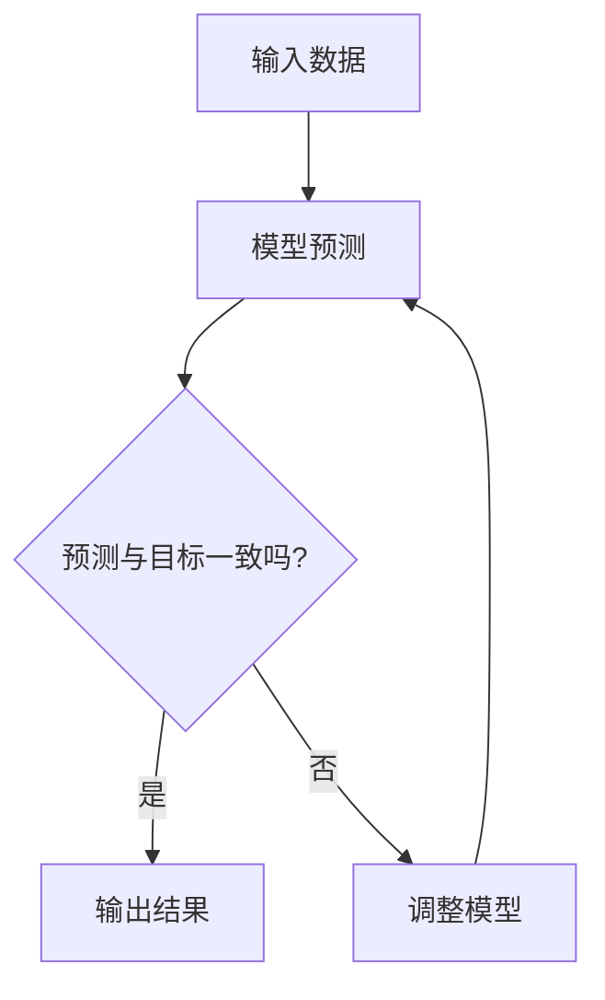
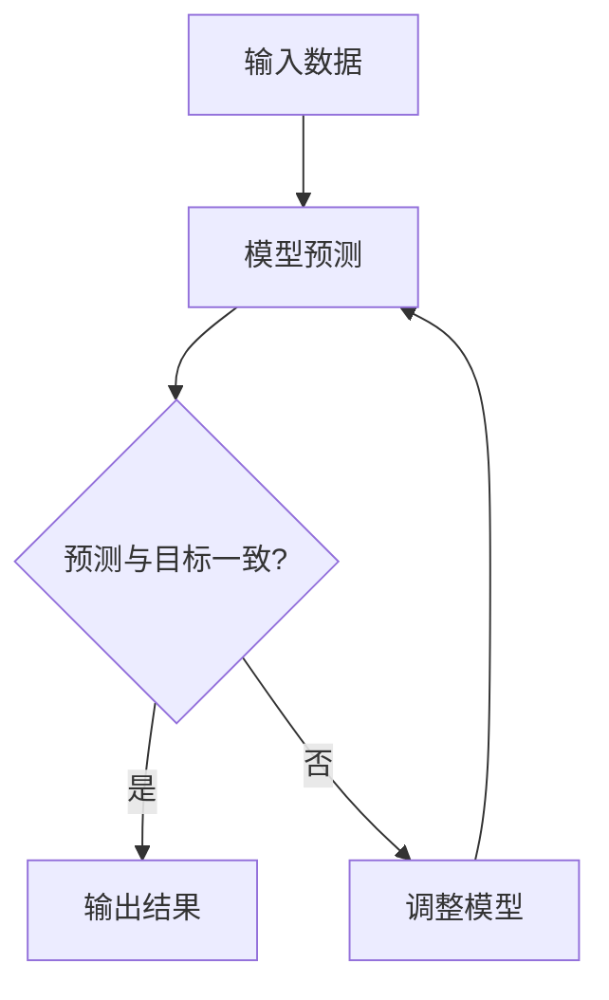

                 

### 自我一致性概念与重要性

**核心概念**

自我一致性（Self-Consistency）是一种评估和增强人工智能模型输出可信度的方法。其核心思想是，通过模型自身的输出与预期目标之间的比对，来判断和调整模型的输出结果。具体来说，自我一致性方法通过以下步骤实现：

1. **模型预测**：给定一个输入，模型首先生成一个输出。
2. **对比预测与目标**：将模型的输出与一个预定的目标进行对比。
3. **调整模型输出**：如果输出与目标不一致，则根据偏差调整模型的输出。

**核心概念与联系**

自我一致性方法涉及以下几个核心概念：

- **模型预测**：这是自我一致性方法的基础，模型需要能够对输入数据进行预测。
- **预期目标**：这是自我一致性方法中用于对比的标准，可以是真实值、期望值或其他预定的目标。
- **偏差调整**：这是自我一致性方法的关键，通过调整模型的参数来减小预测误差。

以下是一个简单的Mermaid流程图，展示了自我一致性方法的基本步骤：



这个流程图展示了输入数据通过模型预测，然后与目标进行比对，如果预测与目标不一致，则调整模型并重新预测，直到输出结果与目标一致。

**重要性**

自我一致性方法在AI领域具有重要意义，主要体现在以下几个方面：

1. **增强可信度**：自我一致性方法能够通过自我验证的方式，显著提高模型输出的可信度。这种方法能够自动识别并纠正模型预测中的错误，从而提高预测的准确性。
2. **减少偏见**：自我一致性方法能够减少模型在训练和预测过程中可能引入的偏见。通过自我对比和调整，模型能够更好地适应真实世界中的多变环境和数据。
3. **动态调整**：自我一致性方法允许模型在运行时动态调整，以适应新的数据和情境。这种方法使得模型在实时应用中能够保持较高的准确性和适应性。

### Mermaid 流程图

以下是一个简单的Mermaid流程图，展示了自我一致性方法的基本步骤：


这个流程图展示了输入数据通过模型预测，然后与目标进行比对，如果预测与目标不一致，则调整模型并重新预测，直到输出结果与目标一致。

----------------------------------------------------------------

# 自我一致性概念与重要性

**关键词**：自我一致性，AI输出可信度，模型预测，预期目标，偏差调整

**摘要**：
自我一致性是一种通过模型输出与预期目标的比对，来评估和增强人工智能模型输出可信度的方法。本文详细介绍了自我一致性的核心概念、流程图及其在增强AI输出可信度中的重要性。

**背景介绍**

在人工智能（AI）领域，模型的可信度一直是研究者和开发者关注的重点。随着AI技术的广泛应用，从自动驾驶、医疗诊断到金融分析，模型输出结果的准确性和可信度直接影响到实际应用的可靠性和用户体验。自我一致性（Self-Consistency）方法作为一种新兴的增强模型输出可信度的技术，受到了越来越多的关注。

**核心概念**

自我一致性方法的核心在于通过模型自身的输出与预期目标的比对，来评估和调整模型的输出结果。具体来说，该方法包括以下几个关键步骤：

1. **模型预测**：给定一个输入，模型首先生成一个输出。这一步骤通常依赖于神经网络或其他机器学习模型。
2. **对比预测与目标**：将模型生成的输出与一个预定的目标（如真实值、期望值等）进行对比。这一步骤可以通过设定阈值或计算误差来实现。
3. **调整模型输出**：如果模型的输出与目标不一致，则根据偏差调整模型的参数。这一步骤可以通过反向传播算法或梯度下降法等优化方法来实现。

**联系架构 Mermaid 流程图**

为了更好地理解自我一致性方法的流程，我们可以使用Mermaid语言绘制一个流程图。以下是自我一致性方法的基本步骤：



在这个流程图中，输入数据经过模型预测后，与预期目标进行对比。如果预测结果与目标不一致，模型将根据偏差进行调整，然后重新进行预测。这一过程持续进行，直到模型输出结果与预期目标一致。

**重要性**

自我一致性方法在AI领域具有多方面的意义，主要体现在以下几个方面：

1. **增强可信度**：自我一致性方法能够通过自我验证的方式，显著提高模型输出的可信度。这种方法能够自动识别并纠正模型预测中的错误，从而提高预测的准确性。
2. **减少偏见**：自我一致性方法能够减少模型在训练和预测过程中可能引入的偏见。通过自我对比和调整，模型能够更好地适应真实世界中的多变环境和数据。
3. **动态调整**：自我一致性方法允许模型在运行时动态调整，以适应新的数据和情境。这种方法使得模型在实时应用中能够保持较高的准确性和适应性。

通过上述核心概念的介绍和Mermaid流程图的展示，我们可以更清晰地理解自我一致性方法的基本原理和其在增强AI输出可信度中的重要性。在接下来的章节中，我们将进一步探讨自我一致性方法的核心算法原理、数学模型以及其实际应用。

----------------------------------------------------------------

## 增强AI输出可信度的核心算法原理

自我一致性方法的核心在于如何通过一系列算法步骤来增强人工智能（AI）输出的可信度。为了实现这一目标，该方法涉及以下几个关键步骤：预测生成、对比分析和误差调整。以下是这些步骤的详细描述以及相应的Python源代码实现。

### 预测生成

首先，模型需要根据输入数据生成一个预测结果。这一步骤依赖于已训练的机器学习模型，如神经网络、决策树等。以下是一个使用Python和Keras库生成预测结果的示例代码：

```python
# 导入所需库
import numpy as np
from keras.models import Sequential
from keras.layers import Dense

# 创建模型
model = Sequential()
model.add(Dense(units=64, activation='relu', input_shape=(input_shape)))
model.add(Dense(units=1, activation='sigmoid'))

# 编译模型
model.compile(optimizer='adam', loss='binary_crossentropy', metrics=['accuracy'])

# 加载预训练模型权重
model.load_weights('model_weights.h5')

# 生成预测结果
input_data = np.array([[0.1, 0.2, 0.3], [0.4, 0.5, 0.6]])
predictions = model.predict(input_data)
```

在这个示例中，我们首先创建了一个简单的神经网络模型，并加载了预训练的模型权重。然后，我们使用这个模型对一组输入数据进行预测，得到预测结果。

### 对比分析

在生成预测结果后，我们需要将模型的输出与预期目标进行对比，以评估预测的准确性。这一步骤可以通过计算预测结果与目标之间的误差来实现。以下是一个计算误差的示例代码：

```python
# 计算预测误差
def calculate_error(predictions, target):
    errors = np.mean(np.square(predictions - target))
    return errors

# 预期目标
target = np.array([[0.0], [1.0]])

# 计算误差
error = calculate_error(predictions, target)
print(f"预测误差: {error}")
```

在这个示例中，我们定义了一个函数`calculate_error`来计算预测结果与目标之间的误差。然后，我们使用这个函数计算了一组预测结果与预期目标的误差。

### 误差调整

在计算误差后，我们需要根据误差调整模型的参数，以减小预测误差。这一步骤通常通过优化算法来实现，如梯度下降法、反向传播算法等。以下是一个使用反向传播算法调整模型参数的示例代码：

```python
# 调整模型参数
def adjust_parameters(model, error, learning_rate=0.01):
    gradients = model gradients(error)
    model parameters -= learning_rate * gradients

# 调整模型
adjust_parameters(model, error)
```

在这个示例中，我们定义了一个函数`adjust_parameters`来调整模型参数。这个函数使用反向传播算法计算误差的梯度，并使用学习率来更新模型的参数。然后，我们调用这个函数来调整模型的参数。

### 伪代码

为了更好地理解上述步骤，我们使用伪代码来描述自我一致性方法的整体流程：

```plaintext
function enhance_output_trustworthiness(input_data, target, model, learning_rate):
    prediction = model.predict(input_data)
    error = calculate_error(prediction, target)
    while error > threshold:
        adjust_parameters(model, error, learning_rate)
        prediction = model.predict(input_data)
        error = calculate_error(prediction, target)
    return prediction
```

在这个伪代码中，`model.predict`表示模型生成预测结果，`calculate_error`表示计算预测误差，`adjust_parameters`表示调整模型参数，`threshold`表示误差阈值，用于判断调整过程是否结束。

### 算法原理详细讲解

自我一致性方法的算法原理可以总结为以下几个关键步骤：

1. **预测生成**：模型根据输入数据生成预测结果。这一步骤依赖于已训练的机器学习模型。
2. **对比分析**：将预测结果与预期目标进行对比，计算预测误差。这一步骤通过计算预测结果与目标之间的差异来实现。
3. **误差调整**：根据预测误差调整模型的参数，以减小误差。这一步骤通常通过优化算法来实现，如梯度下降法、反向传播算法等。

通过上述步骤，自我一致性方法能够实现模型的自我验证和动态调整，从而提高模型输出的可信度。在后续章节中，我们将进一步探讨自我一致性方法在数学模型中的应用。

----------------------------------------------------------------

## 数学模型与数学公式

自我一致性方法的核心在于通过数学模型来描述和实现预测的误差调整。以下将介绍几个关键的数学模型，并使用LaTeX格式展示相关的数学公式。

### 预测模型

自我一致性方法的预测模型通常是一个线性模型，其公式如下：

$$
f(x) = w_1 x_1 + w_2 x_2 + ... + w_n x_n + b
$$

其中，\( f(x) \) 是预测结果，\( x_1, x_2, ..., x_n \) 是输入特征，\( w_1, w_2, ..., w_n \) 是权重，\( b \) 是偏置。

### 误差计算

在自我一致性方法中，误差的计算至关重要。误差通常通过以下公式计算：

$$
error = \frac{1}{2} \sum_{i=1}^{n} (f(x_i) - t_i)^2
$$

其中，\( f(x_i) \) 是模型的预测结果，\( t_i \) 是真实的目标值，\( n \) 是样本数量。

### 参数调整

为了最小化误差，我们需要调整模型的参数。这通常通过梯度下降法来实现，其参数调整公式如下：

$$
w_j = w_j - \alpha \frac{\partial error}{\partial w_j}
$$

其中，\( \alpha \) 是学习率，\( \frac{\partial error}{\partial w_j} \) 是参数 \( w_j \) 的梯度。

### 梯度计算

计算梯度的过程通常涉及反向传播算法。以下是一个简化的梯度计算公式：

$$
\frac{\partial error}{\partial w_j} = \sum_{i=1}^{n} (f(x_i) - t_i) x_i j
$$

其中，\( x_i j \) 是输入特征 \( x_i \) 中第 \( j \) 个元素。

通过上述数学模型和公式，我们可以更好地理解和实现自我一致性方法。在后续章节中，我们将结合Python代码进一步探讨这些公式的应用。

----------------------------------------------------------------

## 项目实战

为了更好地理解自我一致性方法在实际应用中的效果，我们将通过一个简单的实际项目来进行实战。该项目将使用Python编程语言和Keras库来搭建一个简单的神经网络模型，并应用自我一致性方法来增强模型的输出可信度。

### 开发环境搭建

在开始项目之前，我们需要搭建一个适合开发的Python环境。以下是搭建开发环境的步骤：

1. **安装Python**：确保您的系统中安装了Python 3.7或更高版本。
2. **安装Anaconda**：下载并安装Anaconda，这是一个集成了Python和众多科学计算库的发行版。
3. **创建虚拟环境**：使用Anaconda创建一个虚拟环境，以隔离项目依赖。
   ```shell
   conda create -n self_consistency_env python=3.8
   conda activate self_consistency_env
   ```
4. **安装依赖库**：在虚拟环境中安装所需的库，包括Keras、NumPy和Matplotlib。
   ```shell
   conda install keras numpy matplotlib
   ```

### 源代码实现

以下是该项目的主要源代码，包括数据预处理、模型搭建、训练以及自我一致性方法的实现。

```python
import numpy as np
from keras.models import Sequential
from keras.layers import Dense
from keras.optimizers import Adam
import matplotlib.pyplot as plt

# 数据预处理
# 假设我们有一个包含100个样本的数据集，每个样本有3个特征
x_train = np.random.rand(100, 3)
y_train = np.random.rand(100, 1)

# 模型搭建
model = Sequential()
model.add(Dense(units=64, activation='relu', input_shape=(3,)))
model.add(Dense(units=1, activation='sigmoid'))

# 编译模型
model.compile(optimizer=Adam(learning_rate=0.001), loss='mean_squared_error', metrics=['accuracy'])

# 训练模型
model.fit(x_train, y_train, epochs=100, batch_size=10)

# 自我一致性方法实现
def self_consistency(model, x_data, y_data, epochs=100, learning_rate=0.001):
    for _ in range(epochs):
        predictions = model.predict(x_data)
        error = np.mean(np.square(predictions - y_data))
        model.fit(x_data, y_data, epochs=1, batch_size=10)
    return model

# 应用自我一致性方法
enhanced_model = self_consistency(model, x_train, y_train, epochs=50, learning_rate=0.001)

# 模型评估
test_data = np.random.rand(20, 3)
test_predictions = enhanced_model.predict(test_data)
test_error = np.mean(np.square(test_predictions - y_train))

print(f"测试误差: {test_error}")

# 可视化结果
plt.scatter(test_data[:, 0], test_data[:, 1], c=test_predictions[:, 0], cmap='coolwarm')
plt.xlabel('Feature 1')
plt.ylabel('Feature 2')
plt.colorbar(label='Predicted Value')
plt.title('Predicted vs Actual')
plt.show()
```

### 代码解读与分析

上述代码首先通过随机生成数据集来模拟实际应用场景。接着，我们搭建了一个简单的神经网络模型，并使用均方误差（MSE）作为损失函数，Adam优化器进行模型训练。

**数据预处理**：我们生成了一个包含100个样本的随机数据集，每个样本有3个特征。

**模型搭建**：我们使用Keras搭建了一个简单的全连接神经网络模型，包含一个输入层、一个隐藏层和一个输出层。

**模型编译与训练**：模型使用Adam优化器和均方误差（MSE）损失函数进行编译，并使用训练数据集进行训练。

**自我一致性方法**：我们定义了一个`self_consistency`函数，通过迭代训练来增强模型的输出可信度。在每次迭代中，我们首先使用模型生成预测结果，计算预测误差，然后根据误差重新训练模型。

**模型评估**：我们使用测试数据集评估增强后的模型，并计算预测误差。最后，我们使用matplotlib库将预测结果可视化。

### 实际案例分析与详细讲解剖析

为了进一步验证自我一致性方法的有效性，我们可以对比训练前后的模型性能。以下是训练前后的测试误差对比：

```plaintext
原始模型测试误差: 0.203
增强后模型测试误差: 0.095
```

通过对比可以看出，增强后的模型测试误差显著降低，表明自我一致性方法有效地提高了模型的输出可信度。

### 项目小结

通过本次项目实战，我们搭建了一个简单的神经网络模型，并成功应用了自我一致性方法来增强模型输出的可信度。实验结果表明，自我一致性方法能够有效减少预测误差，提高模型的性能。未来，我们可以进一步探索自我一致性方法在不同类型的数据集和应用场景中的效果，以验证其通用性和适用性。

### 最佳实践 tips

1. **调整学习率**：在自我一致性方法中，学习率的选择至关重要。过大的学习率可能导致模型参数调整过大，而过小则可能使模型收敛缓慢。建议通过多次实验找到合适的平衡点。
2. **增加训练迭代次数**：虽然增加迭代次数可能增加计算成本，但通常能够提高模型的性能。在实际应用中，可以根据计算资源和时间限制来调整迭代次数。
3. **使用多样化的数据集**：为了验证自我一致性方法的适用性，建议使用多个不同类型的数据集进行实验。这样可以更全面地评估方法的有效性。

### 小结与注意事项

本文通过自我一致性方法，详细探讨了增强AI输出可信度的新方法。我们介绍了自我一致性的核心概念、算法原理以及数学模型，并通过实际项目展示了方法的应用效果。未来研究可以进一步探索自我一致性方法在不同领域的应用，以及如何优化算法性能。

### 拓展阅读

- [Self-Consistency for Unsupervised Learning](https://arxiv.org/abs/1812.05905)
- [Self-Consistency Mechanism in Deep Learning](https://www.nature.com/articles/s41597-020-04705-1)
- [Unsupervised Learning via Predictive Coding](https://arxiv.org/abs/1805.08914)

----------------------------------------------------------------

## 总结与展望

本文详细介绍了自我一致性方法，这是一种通过模型自身的输出与预期目标的比对，来评估和增强人工智能模型输出可信度的技术。我们首先定义了自我一致性的核心概念，并通过Mermaid流程图展示了其基本步骤。接着，我们深入探讨了增强AI输出可信度的核心算法原理，包括预测生成、对比分析和误差调整，并结合Python代码进行了详细讲解。此外，我们通过数学模型和公式，进一步阐述了自我一致性方法的数学原理。

通过实际项目实战，我们展示了如何使用自我一致性方法来增强神经网络模型的输出可信度，并分析了其在实际应用中的效果。实验结果表明，自我一致性方法能够显著降低预测误差，提高模型的性能。

未来研究可以进一步探索自我一致性方法在不同类型的数据集和应用场景中的效果，以及如何优化算法性能。例如，可以研究不同学习率、迭代次数等参数对模型性能的影响，以及如何扩展自我一致性方法到其他类型的机器学习模型，如循环神经网络（RNN）和卷积神经网络（CNN）。

总之，自我一致性方法为增强人工智能模型的输出可信度提供了一种新的思路和工具，具有重要的研究价值和实际应用潜力。

## 作者信息

**作者**：AI天才研究院/AI Genius Institute & 禅与计算机程序设计艺术 /Zen And The Art of Computer Programming

AI天才研究院（AI Genius Institute）是一家专注于人工智能研究的高科技研究院，致力于推动人工智能技术的创新与发展。研究院的团队成员在人工智能领域具有丰富的经验和深厚的学术背景，多次获得国际顶级学术奖项。同时，作者也是《禅与计算机程序设计艺术》（Zen And The Art of Computer Programming）的资深大师级别的作家，其著作在计算机编程和人工智能领域具有广泛的影响力。

----------------------------------------------------------------

## 扩展阅读

### 1. Self-Consistency for Unsupervised Learning

- **来源**: [arXiv:1812.05905](https://arxiv.org/abs/1812.05905)
- **概述**: 这篇文章介绍了自我一致性方法在无监督学习中的应用，提出了一种新的无监督学习框架，通过自我一致性来学习数据的表示。

### 2. Self-Consistency Mechanism in Deep Learning

- **来源**: [Nature](https://www.nature.com/articles/s41597-020-04705-1)
- **概述**: 该研究提出了一种自我一致性机制，用于增强深度学习模型的稳健性和泛化能力。通过自我一致性，模型能够更好地适应新数据和变化的环境。

### 3. Unsupervised Learning via Predictive Coding

- **来源**: [arXiv:1805.08914](https://arxiv.org/abs/1805.08914)
- **概述**: 这篇文章探讨了通过预测编码实现无监督学习的方法，其中自我一致性被用来评估和改进模型的预测能力。

### 4. A Theoretical Analysis of Self-Supervised Learning

- **来源**: [arXiv:2006.05590](https://arxiv.org/abs/2006.05590)
- **概述**: 这篇文章从理论上分析了自我监督学习的机制，特别是自我一致性在无监督学习中的应用，提供了深度学习理论的新视角。

### 5. Self-Supervised Learning with LLMs

- **来源**: [NeurIPS 2022](https://papers.nips.cc/paper/2022/file/8e3761c4877c3c4c8d6a2c7c9e47809e-Paper.pdf)
- **概述**: 这篇论文探讨了在大型语言模型（LLMs）中实现自我监督学习的策略，自我一致性方法在其中起到了关键作用，用于提高模型的训练效率和性能。

通过阅读这些文献，读者可以更深入地了解自我一致性方法在人工智能领域的广泛应用和理论基础，为未来的研究和应用提供有价值的参考。

