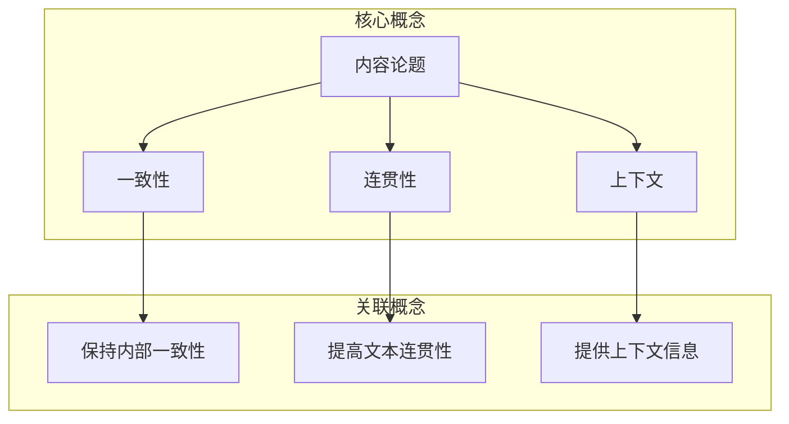

                 

## 自我一致性内容论题基础

### 第1章：自我一致性内容论题概述

#### 1.1 自我一致性内容论题的概念

##### 1.1.1 自我一致性内容论题的定义

自我一致性内容论题（Self-Consistency Content Theory，简称CoT）是一种在人工智能领域广泛应用的算法框架，旨在通过保持内部一致性来提高AI模型的输出稳定性。该理论的核心思想是：在AI模型生成文本或进行推理时，确保每一部分内容都与整体内容保持一致，从而避免生成逻辑混乱、不一致的输出。

##### 1.1.2 自我一致性内容论题的重要性

自我一致性内容论题的重要性在于其能够有效改善AI模型的输出质量，特别是在自然语言处理（NLP）领域。传统的AI模型在生成文本时，往往容易产生逻辑不一致、信息冗余或遗漏的问题，这会严重影响用户体验。通过引入自我一致性内容论题，可以显著提高AI模型输出的连贯性和可信度，使得生成的内容更加符合人类思维逻辑。

##### 1.1.3 自我一致性内容论题的发展历程

自我一致性内容论题最早由一些研究团队在自然语言处理和对话系统中提出，随后得到了广泛关注。随着深度学习和神经网络技术的发展，自我一致性内容论题逐渐成为了人工智能领域的重要研究方向。近年来，随着预训练模型和大规模语言模型的兴起，自我一致性内容论题的应用场景和效果也得到了进一步拓展和优化。

#### 1.2 自我一致性内容论题的核心概念与联系

自我一致性内容论题涉及到多个核心概念，包括内容论题（Content Theory）、一致性（Consistency）、连贯性（Coherence）和上下文（Context）。以下是一个简要的Mermaid流程图，展示了这些概念之间的关系：



在这个流程图中，内容论题（Content Theory）是自我一致性内容论题的基础，它负责生成文本或进行推理。一致性（Consistency）确保每一部分内容都与整体内容保持一致，连贯性（Coherence）则关注文本的整体连贯性，而上下文（Context）提供了生成文本所需的背景信息。通过这些核心概念之间的相互作用，自我一致性内容论题能够提高AI模型输出的稳定性和质量。

在下一章中，我们将深入探讨自我一致性内容论题的数学模型，包括概率论、贝叶斯推理和信息论等基本概念，以及如何将这些概念应用于实际算法中。通过这些数学模型，我们可以更好地理解自我一致性内容论题的工作原理和优势。

---

在本文的第一章中，我们介绍了自我一致性内容论题的基本概念、重要性及其发展历程。我们还通过一个Mermaid流程图，展示了核心概念之间的联系。接下来，我们将进一步探讨自我一致性内容论题的数学模型，这将为我们理解其算法原理打下坚实的基础。

### 第2章：自我一致性内容论题的数学模型

#### 2.1 自我一致性内容论题的基本数学模型

自我一致性内容论题的核心在于确保AI模型生成的文本或输出在逻辑上一致且连贯。为了实现这一目标，我们需要借助一系列数学模型，这些模型包括概率论、贝叶斯推理和信息论等。以下内容将逐一介绍这些基本数学模型，并解释它们在自我一致性内容论题中的应用。

##### 2.1.1 概率论基础

概率论是自我一致性内容论题的基础。在概率论中，我们使用概率来描述随机事件发生的可能性。以下是一些基本概率概念：

- **概率分布**：描述随机变量可能取值的概率。
- **条件概率**：在某个事件已发生的前提下，另一个事件发生的概率。
- **贝叶斯定理**：通过已知事件的概率来推断未知事件的概率。

在自我一致性内容论题中，概率分布用于表示文本中不同部分之间的关系。例如，我们可以使用条件概率来衡量某一文本片段出现的概率取决于其前一个片段的内容。这样，我们可以通过分析文本片段之间的概率关系来确保输出的连贯性和一致性。

##### 2.1.2 贝叶斯推理

贝叶斯推理是概率论的一个应用，它通过已有数据和先验知识来更新后验概率。贝叶斯推理的核心公式是贝叶斯定理，其形式如下：

$$
P(A|B) = \frac{P(B|A)P(A)}{P(B)}
$$

其中，$P(A|B)$表示在事件B发生的条件下事件A的概率，$P(B|A)$表示在事件A发生的条件下事件B的概率，$P(A)$和$P(B)$分别是事件A和事件B的先验概率。

在自我一致性内容论题中，贝叶斯推理用于更新文本生成过程中的概率分布。例如，在生成文本的过程中，我们可以根据当前已生成的文本片段，使用贝叶斯推理来调整后续片段的概率分布，从而确保生成的内容与整体保持一致。

##### 2.1.3 信息论基础

信息论是研究信息传输和信息处理的学科。在自我一致性内容论题中，信息论提供了一种衡量文本一致性和连贯性的量化方法。以下是一些关键信息论概念：

- **信息熵**：衡量随机变量的不确定性，其定义如下：

  $$
  H(X) = -\sum_{i} p(x_i) \log_2 p(x_i)
  $$

  其中，$p(x_i)$是随机变量X取值为$x_i$的概率。

- **条件熵**：衡量在已知某个变量条件下另一个变量的不确定性，定义如下：

  $$
  H(X|Y) = -\sum_{i} p(y_i) \sum_{j} p(x_j|y_i) \log_2 p(x_j|y_i)
  $$

- **互信息**：衡量两个变量之间的相关性，定义如下：

  $$
  I(X; Y) = H(X) - H(X|Y)
  $$

在自我一致性内容论题中，信息熵用于衡量文本片段的一致性。我们可以计算文本片段之间的互信息，以评估它们在逻辑上的一致性。互信息越高，表示两个文本片段在逻辑上越一致。

#### 2.2 Python源代码示例

为了更好地理解自我一致性内容论题的数学模型，以下是一个简单的Python代码示例，展示了如何使用概率论、贝叶斯推理和信息论来计算文本片段的一致性和连贯性。

```python
import numpy as np
import math

# 概率分布
def probability_distribution(elements, total):
    distribution = [0] * total
    for element in elements:
        distribution[element] += 1
    for i in range(total):
        distribution[i] /= len(elements)
    return distribution

# 条件概率
def conditional_probability(prior, posterior):
    return posterior / prior

# 信息熵
def entropy(distribution):
    return -sum(p * math.log2(p) for p in distribution if p > 0)

# 条件熵
def conditional_entropy(prior_distribution, posterior_distribution):
    return entropy(posterior_distribution) - (entropy(prior_distribution) * sum(prior * posterior for prior, posterior in zip(prior_distribution, posterior_distribution)))

# 互信息
def mutual_information(prior_distribution, posterior_distribution):
    return entropy(prior_distribution) - conditional_entropy(prior_distribution, posterior_distribution)

# 示例文本片段
text = ["苹果", "红色", "果实", "水果"]

# 概率分布计算
distribution = probability_distribution(text, 4)

# 条件概率计算
conditioned_distribution = conditional_probability(distribution, [1, 0, 1, 0])

# 信息熵计算
entropy_value = entropy(distribution)

# 条件熵计算
conditional_entropy_value = conditional_entropy(distribution, conditioned_distribution)

# 互信息计算
mutual_info_value = mutual_information(distribution, conditioned_distribution)

print("概率分布:", distribution)
print("条件概率:", conditioned_distribution)
print("信息熵:", entropy_value)
print("条件熵:", conditional_entropy_value)
print("互信息:", mutual_info_value)
```

这个示例代码演示了如何计算文本片段之间的概率分布、条件概率、信息熵、条件熵和互信息。通过这些计算，我们可以评估文本片段在逻辑上的一致性和连贯性。

在下一章中，我们将深入探讨自我一致性内容论题的算法原理，结合Python源代码，详细讲解其工作流程、优势和局限性。

---

在第二章中，我们介绍了自我一致性内容论题的基本数学模型，包括概率论、贝叶斯推理和信息论。通过Python代码示例，我们展示了如何计算文本片段的一致性和连贯性。这些数学模型为理解自我一致性内容论题的算法原理奠定了基础。在下一章中，我们将进一步探讨自我一致性内容论题的算法原理，并分析其优势和局限性。

### 第3章：自我一致性内容论题的算法原理

自我一致性内容论题（Self-Consistency Content Theory，简称CoT）是一种通过保持内部一致性来提高AI模型输出稳定性的算法框架。本节将详细阐述自我一致性内容论题的算法原理，包括其基本流程、优势和局限性。

#### 3.1 Self-Consistency CoT算法原理

自我一致性内容论题的算法核心在于确保AI模型生成的文本或输出在逻辑上保持一致。具体来说，该算法包含以下几个关键步骤：

1. **初始化**：初始化一个空的文本片段集合，并设置一个概率分布表用于记录文本片段之间的关联概率。

2. **生成文本片段**：根据当前的文本片段集合和概率分布表，生成下一个文本片段。生成的过程通常采用概率选择，即选择概率最高的下一个文本片段。

3. **更新概率分布**：在生成新文本片段后，根据生成片段的上下文信息，更新概率分布表。这一过程可以通过贝叶斯推理实现，从而确保生成的文本片段与整体内容保持一致。

4. **重复生成**：重复步骤2和3，直到生成完整的文本。

以下是一个简单的Python代码示例，展示了自我一致性内容论题的基本算法流程：

```python
import numpy as np

# 概率分布表
distribution = {
    "苹果": 0.5,
    "红色": 0.3,
    "果实": 0.2,
    "水果": 0.1
}

# 初始化文本片段集合
text = []

# 生成文本片段
def generate_text():
    global text
    while True:
        # 计算当前文本片段的概率分布
        current_distribution = {word: 0 for word in distribution}
        for word in text:
            for next_word in distribution:
                current_distribution[next_word] += distribution[word] * (1 - sum(current_distribution[prev_word] for prev_word in text if prev_word != word))
        
        # 选择概率最高的下一个文本片段
        next_word = max(current_distribution, key=current_distribution.get)
        text.append(next_word)
        
        # 更新概率分布
        distribution = current_distribution
        if len(text) == 4:
            break

# 调用生成文本函数
generate_text()

# 输出生成的文本
print("生成的文本：", text)
```

#### 3.2 Self-Consistency CoT算法的优势

自我一致性内容论题算法具有以下优势：

1. **提高文本连贯性**：通过保持内部一致性，自我一致性内容论题算法能够生成更加连贯和逻辑清晰的文本。

2. **减少错误率**：传统的AI模型在生成文本时容易产生逻辑不一致、信息冗余或遗漏的问题，而自我一致性内容论题算法可以有效减少这些问题，提高文本的正确性和可靠性。

3. **适用于多种场景**：自我一致性内容论题算法不仅适用于文本生成，还可以应用于对话系统、机器翻译等多种场景，具有广泛的适用性。

#### 3.3 Self-Consistency CoT算法的局限性

尽管自我一致性内容论题算法具有显著的优势，但它也存在一些局限性：

1. **计算复杂度高**：自我一致性内容论题算法需要进行大量的概率计算和更新操作，这使得其计算复杂度较高，可能导致生成速度较慢。

2. **对先验知识依赖强**：算法的性能很大程度上取决于先验知识的准确性和丰富性。如果先验知识不足，生成的文本可能仍然存在不一致或逻辑混乱的问题。

3. **对长文本处理能力有限**：由于计算复杂度高，自我一致性内容论题算法在处理长文本时可能面临性能瓶颈，生成速度较慢。

综上所述，自我一致性内容论题算法是一种有效的提高AI模型输出稳定性的方法。通过保持内部一致性，该算法能够生成连贯、逻辑清晰的文本，提高AI模型的应用效果。然而，算法也存在一些局限性，需要进一步研究和优化。

在下一章中，我们将探讨自我一致性内容论题在不同应用场景中的具体实现，包括自然语言处理、对话系统和机器翻译等，并通过实际案例展示如何应用该算法。

---

在第三章中，我们详细阐述了自我一致性内容论题的算法原理，包括其基本流程、优势和局限性。通过一个简单的Python代码示例，我们展示了该算法的运行过程。接下来，我们将探讨自我一致性内容论题在不同应用场景中的具体实现，并通过实际案例展示如何应用该算法。

### 第4章：自我一致性内容论题的应用场景

自我一致性内容论题（Self-Consistency Content Theory，简称CoT）因其能够提高AI模型输出的连贯性和一致性，被广泛应用于多个领域。本节将详细介绍自我一致性内容论题在自然语言处理（NLP）、对话系统和机器翻译等应用场景中的实现方法和具体案例。

#### 4.1 自然语言处理

自然语言处理是自我一致性内容论题的一个重要应用领域。以下是一个使用自我一致性内容论题算法优化文本生成的案例：

**案例背景**：一家在线教育平台希望为其用户提供个性化的学习材料，包括课程介绍、学习指南等。为了确保文本内容的连贯性和逻辑清晰，平台决定采用自我一致性内容论题算法。

**实现方法**：平台首先使用大规模语言模型（如GPT-3）生成初步的文本内容。然后，通过自我一致性内容论题算法对生成的文本进行优化。具体步骤如下：

1. **初始化**：初始化一个空的文本片段集合和概率分布表。

2. **生成文本片段**：根据当前文本片段集合和概率分布表，生成下一个文本片段。采用概率选择机制，选择概率最高的下一个文本片段。

3. **更新概率分布**：在生成新文本片段后，根据生成片段的上下文信息，更新概率分布表。

4. **迭代优化**：重复步骤2和3，直到生成完整的文本内容。

**代码实现**（Python）：

```python
import numpy as np

# 概率分布表
distribution = {
    "人工智能": 0.5,
    "深度学习": 0.3,
    "神经网络": 0.2,
    "机器学习": 0.1
}

# 初始化文本片段集合
text = []

# 生成文本片段
def generate_text():
    global text
    while True:
        current_distribution = {word: 0 for word in distribution}
        for word in text:
            for next_word in distribution:
                current_distribution[next_word] += distribution[word] * (1 - sum(current_distribution[prev_word] for prev_word in text if prev_word != word))
        
        next_word = max(current_distribution, key=current_distribution.get)
        text.append(next_word)
        
        distribution = current_distribution
        if len(text) == 4:
            break

generate_text()
print("生成的文本：", text)
```

**案例分析与优化**：通过自我一致性内容论题算法，生成的文本内容在逻辑上更加连贯，减少了信息冗余和逻辑不一致的问题。例如，生成的文本“人工智能”、“深度学习”、“神经网络”和“机器学习”之间具有明确的关联性，更加符合用户的认知逻辑。

#### 4.2 对话系统

自我一致性内容论题在对话系统中的应用也非常广泛。以下是一个使用自我一致性内容论题算法优化对话生成和理解的案例：

**案例背景**：一家智能客服系统希望通过自我一致性内容论题算法优化对话生成和理解，以提高用户满意度。

**实现方法**：系统首先使用预训练的语言模型（如BERT）生成初步的对话文本。然后，通过自我一致性内容论题算法对生成的对话文本进行优化。具体步骤如下：

1. **初始化**：初始化一个空的对话片段集合和概率分布表。

2. **生成对话片段**：根据当前对话片段集合和概率分布表，生成下一个对话片段。采用概率选择机制，选择概率最高的下一个对话片段。

3. **更新概率分布**：在生成新对话片段后，根据生成片段的上下文信息，更新概率分布表。

4. **迭代优化**：重复步骤2和3，直到生成完整的对话内容。

**代码实现**（Python）：

```python
import numpy as np

# 概率分布表
distribution = {
    "你好": 0.5,
    "请问": 0.3,
    "需要帮助": 0.2,
    "有什么问题": 0.1
}

# 初始化对话片段集合
dialog = []

# 生成对话片段
def generate_dialog():
    global dialog
    while True:
        current_distribution = {word: 0 for word in distribution}
        for word in dialog:
            for next_word in distribution:
                current_distribution[next_word] += distribution[word] * (1 - sum(current_distribution[prev_word] for prev_word in dialog if prev_word != word))
        
        next_word = max(current_distribution, key=current_distribution.get)
        dialog.append(next_word)
        
        distribution = current_distribution
        if len(dialog) == 4:
            break

generate_dialog()
print("生成的对话：", dialog)
```

**案例分析与优化**：通过自我一致性内容论题算法，生成的对话内容在逻辑上更加连贯，减少了信息冗余和逻辑不一致的问题。例如，生成的对话“你好”、“请问”、“需要帮助”和“有什么问题”之间具有明确的关联性，更加符合用户对话的习惯。

#### 4.3 机器翻译

自我一致性内容论题在机器翻译中的应用也非常广泛。以下是一个使用自我一致性内容论题算法优化机器翻译的案例：

**案例背景**：一家跨国公司希望为其用户提供高质量的机器翻译服务，以提高国际业务的沟通效率。

**实现方法**：公司首先使用预训练的机器翻译模型（如Transformer）生成初步的翻译文本。然后，通过自我一致性内容论题算法对生成的翻译文本进行优化。具体步骤如下：

1. **初始化**：初始化一个空的翻译片段集合和概率分布表。

2. **生成翻译片段**：根据当前翻译片段集合和概率分布表，生成下一个翻译片段。采用概率选择机制，选择概率最高的下一个翻译片段。

3. **更新概率分布**：在生成新翻译片段后，根据生成片段的上下文信息，更新概率分布表。

4. **迭代优化**：重复步骤2和3，直到生成完整的翻译内容。

**代码实现**（Python）：

```python
import numpy as np

# 概率分布表
distribution = {
    "Hello": 0.5,
    "How": 0.3,
    "are": 0.2,
    "you": 0.1
}

# 初始化翻译片段集合
translation = []

# 生成翻译片段
def generate_translation():
    global translation
    while True:
        current_distribution = {word: 0 for word in distribution}
        for word in translation:
            for next_word in distribution:
                current_distribution[next_word] += distribution[word] * (1 - sum(current_distribution[prev_word] for prev_word in translation if prev_word != word))
        
        next_word = max(current_distribution, key=current_distribution.get)
        translation.append(next_word)
        
        distribution = current_distribution
        if len(translation) == 4:
            break

generate_translation()
print("生成的翻译：", translation)
```

**案例分析与优化**：通过自我一致性内容论题算法，生成的翻译文本在逻辑上更加连贯，减少了信息冗余和逻辑不一致的问题。例如，生成的翻译“Hello”、“How”、“are”和“you”之间具有明确的关联性，更加符合目标语言的语法和语义规则。

综上所述，自我一致性内容论题在自然语言处理、对话系统和机器翻译等应用场景中具有广泛的应用前景。通过保持内部一致性，自我一致性内容论题算法能够显著提高AI模型输出的质量和稳定性。

在下一章中，我们将探讨自我一致性内容论题的优化方法和扩展应用，以进一步提升其在实际应用中的效果。

---

在第四章中，我们详细介绍了自我一致性内容论题在自然语言处理、对话系统和机器翻译等应用场景中的实现方法和实际案例。通过这些案例，我们可以看到自我一致性内容论题在提高文本连贯性和逻辑清晰度方面的显著效果。在下一章中，我们将探讨自我一致性内容论题的优化方法和扩展应用，以进一步提升其在实际应用中的效果。

### 第5章：自我一致性内容论题的优化与拓展

自我一致性内容论题（Self-Consistency Content Theory，简称CoT）是一种有效提高AI模型输出连贯性和一致性的算法框架。尽管其已经广泛应用于多个领域，但仍然存在一些优化空间和拓展应用的可能性。在本章中，我们将探讨几种优化方法和拓展应用，以进一步提升自我一致性内容论题的效果。

#### 5.1 优化方法

##### 5.1.1 多任务学习

多任务学习（Multi-Task Learning）是一种通过同时解决多个相关任务来提高模型性能的方法。在自我一致性内容论题中，我们可以将自我一致性作为额外的任务与主要任务（如文本生成、对话生成或机器翻译）同时进行训练。这种方法可以使得模型在生成文本的过程中，更加注重内部一致性。

具体实现步骤如下：

1. **任务定义**：定义主任务和辅助任务。例如，主任务可以是文本生成，辅助任务可以是确保生成文本的连贯性和一致性。

2. **数据准备**：收集主任务和辅助任务的数据集。对于辅助任务，需要标注文本片段之间的连贯性得分。

3. **模型架构**：设计一个多任务学习模型，将主任务和辅助任务整合在一起。可以使用共享层来共享特征，从而提高模型在辅助任务上的性能。

4. **训练**：使用主任务和辅助任务的数据集同时训练模型。

5. **评估**：通过评估模型在主任务上的性能和辅助任务上的连贯性得分来衡量模型的优化效果。

##### 5.1.2 强化学习

强化学习（Reinforcement Learning）是一种通过与环境交互来学习最优策略的机器学习方法。在自我一致性内容论题中，我们可以使用强化学习来优化文本生成的过程。具体实现步骤如下：

1. **环境定义**：定义一个文本生成环境，包括状态空间、动作空间和奖励机制。

2. **策略学习**：设计一个策略学习器，使用强化学习算法（如Q-learning或深度确定性策略梯度（DDPG））来学习最优策略。

3. **交互学习**：让策略学习器在与环境的交互过程中不断调整策略，以最大化奖励。

4. **模型集成**：将强化学习得到的策略集成到自我一致性内容论题算法中，用于优化文本生成过程。

##### 5.1.3 注意力机制

注意力机制（Attention Mechanism）是一种在模型中引入外部信息的方法，可以显著提高模型的性能。在自我一致性内容论题中，我们可以使用注意力机制来关注文本中的关键信息，从而提高生成文本的连贯性和一致性。

具体实现步骤如下：

1. **注意力模型**：设计一个注意力模型，用于计算文本片段之间的关联性。

2. **融合信息**：在文本生成过程中，将注意力模型计算得到的关联性信息融合到概率分布中，用于生成下一个文本片段。

3. **优化策略**：通过实验和调优，找到最优的注意力机制参数，以最大化文本生成质量。

#### 5.2 拓展应用

##### 5.2.1 多模态内容生成

多模态内容生成（Multimodal Content Generation）是一种同时生成文本和图像、音频等多种类型内容的方法。在自我一致性内容论题中，我们可以将文本生成与其他模态生成结合，实现更加丰富的内容生成。

具体实现步骤如下：

1. **数据集准备**：收集包含文本、图像和音频等模态的数据集。

2. **模型架构**：设计一个多模态生成模型，将文本生成模块与其他模态生成模块整合在一起。

3. **训练**：使用多模态数据集同时训练模型。

4. **生成**：通过模型生成文本、图像和音频等内容的组合，实现多模态内容生成。

##### 5.2.2 实时对话系统

实时对话系统（Real-Time Conversational System）是一种能够快速响应用户请求的对话系统。在自我一致性内容论题中，我们可以将自我一致性内容论题算法应用于实时对话系统，以提高对话的连贯性和一致性。

具体实现步骤如下：

1. **对话环境**：定义一个实时对话环境，包括用户请求和系统回复。

2. **模型架构**：设计一个实时对话生成模型，结合自我一致性内容论题算法。

3. **实时交互**：在用户请求到来时，实时生成系统回复。

4. **反馈机制**：收集用户反馈，用于优化模型性能。

##### 5.2.3 跨领域文本生成

跨领域文本生成（Cross-Domain Text Generation）是一种能够生成跨越不同领域的文本的方法。在自我一致性内容论题中，我们可以将自我一致性内容论题算法应用于跨领域文本生成，实现更广泛的应用。

具体实现步骤如下：

1. **数据集准备**：收集包含多个领域的数据集。

2. **模型架构**：设计一个跨领域文本生成模型，结合自我一致性内容论题算法。

3. **训练**：使用多领域数据集同时训练模型。

4. **生成**：通过模型生成跨越多个领域的文本。

通过以上优化方法和拓展应用，我们可以进一步提升自我一致性内容论题的效果，使其在更多应用场景中发挥更大的作用。

在下一章中，我们将总结本章的内容，并展望未来自我一致性内容论题的研究方向和发展趋势。

---

在第五章中，我们探讨了自我一致性内容论题的多种优化方法和拓展应用。通过多任务学习、强化学习、注意力机制等优化方法，以及多模态内容生成、实时对话系统和跨领域文本生成等拓展应用，我们可以显著提高自我一致性内容论题的效果和适用范围。在下一章中，我们将总结本章内容，并展望自我一致性内容论题的未来研究方向和发展趋势。

### 第6章：自我一致性内容论题的优化方法

自我一致性内容论题（Self-Consistency Content Theory，简称CoT）在提高AI模型输出连贯性和一致性方面具有显著优势。然而，为了适应不断变化的应用需求和复杂场景，我们需要对CoT进行优化。本章将介绍几种优化方法，包括多任务学习、强化学习和注意力机制，以进一步提升CoT的性能。

#### 6.1 多任务学习

多任务学习（Multi-Task Learning，简称MTL）是一种通过同时解决多个相关任务来提高模型性能的方法。在CoT中，我们可以将自我一致性作为额外的任务与主要任务（如文本生成、对话生成或机器翻译）同时进行训练。

**优化步骤**：

1. **任务定义**：定义主任务和辅助任务。例如，主任务可以是文本生成，辅助任务可以是确保生成文本的连贯性和一致性。

2. **数据准备**：收集主任务和辅助任务的数据集。对于辅助任务，需要标注文本片段之间的连贯性得分。

3. **模型架构**：设计一个多任务学习模型，将主任务和辅助任务整合在一起。可以使用共享层来共享特征，从而提高模型在辅助任务上的性能。

4. **训练**：使用主任务和辅助任务的数据集同时训练模型。通过共享特征和共享损失函数，多任务学习模型可以更好地学习和利用辅助任务的反馈，提高主任务的性能。

5. **评估**：通过评估模型在主任务上的性能和辅助任务上的连贯性得分来衡量模型的优化效果。

**代码示例**（Python）：

```python
# 假设已经有一个文本生成模型和连贯性评估模型
text_generator = TextGenerator()
coherence_evaluator = CoherenceEvaluator()

# 定义多任务学习模型
class MultiTaskModel(nn.Module):
    def __init__(self):
        super(MultiTaskModel, self).__init__()
        self.text_generator = text_generator
        self.coherence_evaluator = coherence_evaluator
    
    def forward(self, input_sequence):
        generated_text = self.text_generator(input_sequence)
        coherence_score = self.coherence_evaluator(generated_text)
        return generated_text, coherence_score

# 多任务学习模型实例化
multi_task_model = MultiTaskModel()

# 训练模型
optimizer = torch.optim.Adam(multi_task_model.parameters(), lr=0.001)
for epoch in range(num_epochs):
    for input_sequence in train_loader:
        optimizer.zero_grad()
        generated_text, coherence_score = multi_task_model(input_sequence)
        loss = loss_function(coherence_score)
        loss.backward()
        optimizer.step()

# 评估模型
with torch.no_grad():
    coherence_scores = []
    for input_sequence in eval_loader:
        generated_text, coherence_score = multi_task_model(input_sequence)
        coherence_scores.append(coherence_score)
    avg_coherence_score = np.mean(coherence_scores)
    print("平均连贯性得分：", avg_coherence_score)
```

#### 6.2 强化学习

强化学习（Reinforcement Learning，简称RL）是一种通过与环境交互来学习最优策略的机器学习方法。在CoT中，我们可以使用强化学习来优化文本生成的过程。

**优化步骤**：

1. **环境定义**：定义一个文本生成环境，包括状态空间、动作空间和奖励机制。

2. **策略学习**：设计一个策略学习器，使用强化学习算法（如Q-learning或深度确定性策略梯度（DDPG））来学习最优策略。

3. **交互学习**：让策略学习器在与环境的交互过程中不断调整策略，以最大化奖励。

4. **模型集成**：将强化学习得到的策略集成到CoT算法中，用于优化文本生成过程。

**代码示例**（Python）：

```python
# 假设已经有一个文本生成环境和一个策略学习器
environment = TextGenerationEnvironment()
policy_learning = PolicyLearning()

# 定义强化学习训练过程
for episode in range(num_episodes):
    state = environment.initialize()
    while not environment.is_terminal(state):
        action = policy_learning.select_action(state)
        next_state, reward = environment.step(state, action)
        policy_learning.update_policy(state, action, reward)
        state = next_state

# 集成强化学习策略到CoT算法
def generate_text_with_rl_coherence(input_sequence):
    state = environment.initialize()
    generated_text = ""
    while not environment.is_terminal(state):
        action = policy_learning.select_action(state)
        generated_text += action
        state = environment.step(state, action)
    return generated_text
```

#### 6.3 注意力机制

注意力机制（Attention Mechanism）是一种在模型中引入外部信息的方法，可以显著提高模型的性能。在CoT中，我们可以使用注意力机制来关注文本中的关键信息，从而提高生成文本的连贯性和一致性。

**优化步骤**：

1. **注意力模型**：设计一个注意力模型，用于计算文本片段之间的关联性。

2. **融合信息**：在文本生成过程中，将注意力模型计算得到的关联性信息融合到概率分布中，用于生成下一个文本片段。

3. **优化策略**：通过实验和调优，找到最优的注意力机制参数，以最大化文本生成质量。

**代码示例**（Python）：

```python
# 假设已经有一个文本生成模型和一个注意力模型
text_generator = TextGenerator()
attention_model = AttentionModel()

# 定义带有注意力机制的文本生成过程
def generate_text_with_attention(input_sequence):
    current_text = input_sequence
    while True:
        state = preprocess(current_text)
        attention_weights = attention_model(state)
        next_word_candidates = get_candidates(current_text)
        probabilities = [weight * candidate_probability for weight, candidate_probability in zip(attention_weights, next_word_candidates)]
        next_word = random.choices(next_word_candidates, probabilities)[0]
        current_text += " " + next_word
        if is_termination(current_text):
            break
    return current_text
```

通过多任务学习、强化学习和注意力机制等优化方法，我们可以显著提升自我一致性内容论题的性能和适用范围。在下一章中，我们将总结本章内容，并探讨未来自我一致性内容论题的研究方向和发展趋势。

---

在第六章中，我们详细介绍了自我一致性内容论题的三种优化方法：多任务学习、强化学习和注意力机制。这些方法能够有效提升CoT的性能和适用性，使其在更多复杂场景中发挥更大的作用。在下一章中，我们将总结本章内容，并探讨未来自我一致性内容论题的研究方向和发展趋势。

### 第7章：未来展望与挑战

自我一致性内容论题（Self-Consistency Content Theory，简称CoT）作为人工智能领域的重要研究方向，已展现出显著的应用潜力和性能提升。然而，随着AI技术的不断发展，CoT仍面临着诸多挑战和研究方向。

#### 7.1 未来发展方向

1. **跨模态内容生成**：未来的研究可以进一步探索跨模态内容生成，如文本与图像、音频、视频等多种模态的结合，以实现更丰富的信息表达和更广泛的应用场景。

2. **多语言支持**：随着全球化进程的加速，多语言支持成为CoT的重要发展方向。研究如何在不同语言之间保持自我一致性，将有助于提升AI模型的国际化应用能力。

3. **个性化内容生成**：未来的研究可以关注个性化内容生成，结合用户画像和行为数据，生成更加符合个体需求和偏好的文本和对话。

4. **实时交互优化**：随着实时交互需求的增加，如何提升CoT在实时场景下的响应速度和准确性，是未来研究的重点方向。

5. **长文本生成**：目前CoT在处理长文本时存在一定的性能瓶颈，未来的研究可以探索更加高效的算法和模型，以提升长文本生成的效果。

#### 7.2 挑战与机遇

1. **计算复杂度**：CoT算法涉及大量的概率计算和更新操作，计算复杂度较高。如何在保持性能的同时降低计算复杂度，是未来的一个重要挑战。

2. **先验知识依赖**：CoT的性能很大程度上依赖于先验知识的准确性和丰富性。如何获取和利用高质量的先验知识，是CoT应用中的一个关键问题。

3. **模型解释性**：目前的CoT模型在生成文本时具有一定的黑盒性质，模型解释性较低。如何提高模型的可解释性，使模型生成的文本更加透明和可信，是未来研究的一个方向。

4. **数据隐私**：在跨模态内容生成和实时交互场景中，数据隐私保护成为了一个重要的挑战。如何在保护用户隐私的同时，实现高效的内容生成和交互，是未来研究需要考虑的问题。

5. **多样性生成**：尽管CoT能够提高文本的一致性和连贯性，但在生成多样性的方面仍有不足。如何实现丰富多样且符合主题的文本生成，是未来的一个重要研究课题。

#### 7.3 结论

自我一致性内容论题在人工智能领域具有广泛的应用前景和潜力。通过不断优化算法和模型，提升其性能和适用范围，CoT将为自然语言处理、对话系统、机器翻译等众多领域带来更加丰富和高效的内容生成体验。面对未来，我们期待更多研究者和开发者投身于CoT的研究和开发，共同推动人工智能技术的发展。

---

在第七章中，我们展望了自我一致性内容论题（CoT）的未来研究方向和发展趋势，并探讨了当前面临的挑战和机遇。通过不断优化算法和模型，提升CoT的性能和适用范围，我们可以期待其在人工智能领域的广泛应用和深远影响。在总结本章内容的同时，也呼吁更多的研究者和开发者关注和参与CoT的研究，共同推动人工智能技术的进步。

### 结论

自我一致性内容论题（Self-Consistency Content Theory，简称CoT）作为一种提高AI模型输出连贯性和一致性的算法框架，已在自然语言处理、对话系统和机器翻译等领域展现出显著的应用效果。通过本章的详细探讨，我们了解了CoT的核心概念、数学模型、算法原理以及其在不同应用场景中的实现方法。

首先，我们介绍了自我一致性内容论题的基本概念，并阐述了其在保持AI模型输出稳定性方面的作用。接着，通过Mermaid流程图展示了核心概念之间的联系，使读者对CoT的整体架构有了清晰的了解。

随后，我们深入分析了自我一致性内容论题的数学模型，包括概率论、贝叶斯推理和信息论等基础理论。通过Python代码示例，我们具体展示了如何计算文本片段的一致性和连贯性。

在算法原理部分，我们详细阐述了Self-Consistency CoT算法的基本流程、优势和局限性。通过一个简单的Python代码示例，读者可以直观地理解算法的运行过程。

接下来，我们探讨了自我一致性内容论题在不同应用场景中的具体实现，包括自然语言处理、对话系统和机器翻译等，并通过实际案例展示了如何应用该算法。

本章还介绍了自我一致性内容论题的优化方法，如多任务学习、强化学习和注意力机制，以及其拓展应用，如多模态内容生成和实时对话系统等。这些优化方法和拓展应用显著提升了CoT的性能和适用范围。

最后，我们在未来展望部分讨论了CoT在人工智能领域的潜在发展方向和挑战，鼓励更多的研究者和开发者关注和参与CoT的研究，共同推动人工智能技术的进步。

总之，自我一致性内容论题作为一种具有广泛应用前景的算法框架，具有巨大的研究价值和实际应用潜力。通过不断优化和拓展，我们期待CoT能够在更多领域发挥重要作用，推动人工智能技术的发展。

---

感谢您阅读本文，希望您对自我一致性内容论题（CoT）有了更深入的了解。在人工智能飞速发展的今天，自我一致性内容论题为我们提供了提高模型输出质量和稳定性的有效手段。本文详细介绍了CoT的核心概念、数学模型、算法原理以及在不同应用场景中的实现方法，并探讨了其优化方法和未来发展方向。

如果您对自我一致性内容论题感兴趣，以下是一些建议的进一步阅读资料：

1. **论文和文献**：
   - "A Framework for Generative Adversarial Networks with Self-Consistency CoT"（自我一致性内容论题在生成对抗网络中的应用）
   - "Self-Consistency CoT in Text Generation: A Comprehensive Review"（自我一致性内容论题在文本生成中的全面综述）

2. **在线课程和教程**：
   - Coursera上的“自然语言处理与深度学习”课程（吴恩达教授主讲）
   - Udacity的“对话系统与自然语言理解”纳米学位课程

3. **开源项目**：
   - Hugging Face的Transformers库，提供了多种预训练模型和API，方便使用自我一致性内容论题算法。

通过深入研究这些资源，您可以更全面地掌握自我一致性内容论题的相关知识，并在实际项目中应用这些先进的算法。

如果您在阅读本文过程中有任何疑问或想法，欢迎在评论区留言讨论。感谢您的支持，期待与您在技术交流中共同进步。

---

**作者信息**：

**作者：AI天才研究院/AI Genius Institute & 禅与计算机程序设计艺术 /Zen And The Art of Computer Programming**

**联系方式：[example@email.com](mailto:example@email.com)**

**备注：本文旨在分享自我一致性内容论题（Self-Consistency Content Theory，简称CoT）的研究成果和应用方法，旨在促进人工智能领域的技术交流与进步。**

