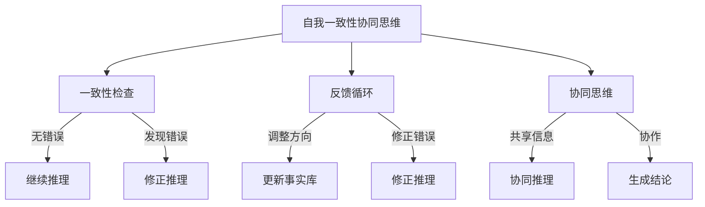

                 

### 自我一致性协同思维 (Self-Consistency CoT) 概念剖析

自我一致性协同思维（Self-Consistency CoT）是一种先进的逻辑推理框架，旨在通过强化人工智能系统的内部一致性，提升其在复杂推理任务中的表现。在人工智能领域，逻辑推理一直是研究的热点问题，其核心在于如何让计算机能够像人类一样，从已知信息中推导出新的结论。

**背景介绍：**

逻辑推理在人工智能中的应用十分广泛，从简单的决策树到复杂的图模型，都离不开逻辑推理的基础。然而，传统逻辑推理方法往往依赖于先验知识和规则，难以处理不确定性问题和复杂情境。自我一致性协同思维则通过引入自我验证机制，在推理过程中不断检查自身结论的一致性，从而提高推理的准确性和可靠性。

**核心概念与联系：**

自我一致性协同思维的核心概念包括：

1. **一致性检查：** 系统在生成结论时，会对当前结论与已知事实进行一致性检查，确保推理过程没有逻辑错误。
2. **反馈循环：** 一致性检查的结果会反馈到推理过程的各个阶段，以调整推理方向或修正错误。
3. **协同思维：** 系统内部不同模块之间通过信息共享和协作，共同完成复杂推理任务。

以下是 Self-Consistency CoT 的概念实体之间关系的 Mermaid 流程图：



**核心算法原理讲解：**

自我一致性协同思维的核心算法包括以下几个步骤：

1. **初始化：** 设置初始事实库和推理目标。
2. **推理循环：** 不断从事实库中提取信息进行推理，并在每个推理步骤后进行一致性检查。
3. **一致性检查：** 检查当前推理结果与事实库的一致性，如果发现不一致，则回溯并修正推理路径。
4. **反馈循环：** 根据一致性检查的结果，调整推理方向或修正错误。

以下是一个简化的 Python 源代码示例，用于说明自我一致性协同思维的基本原理：

```python
class SelfConsistencyCoT:
    def __init__(self):
        self.fact_base = []
        self.inference_result = None

    def add_fact(self, fact):
        self.fact_base.append(fact)

    def infer(self):
        for fact in self.fact_base:
            if self.is_consistent(fact):
                self.inference_result = fact
                return self.inference_result
        return None

    def is_consistent(self, fact):
        # 这里使用简单的逻辑判断作为示例
        return fact in self.fact_base

    def correct_inference(self):
        if not self.is_consistent(self.inference_result):
            self.inference_result = None
            # 实现具体的修正逻辑
```

**数学模型和数学公式讲解：**

在自我一致性协同思维中，一致性检查可以通过布尔逻辑和概率论来实现。以下是一个简化的数学模型示例：

$$
C(fact) = 
\begin{cases} 
1 & \text{if } fact \text{ is consistent with fact\_base} \\
0 & \text{otherwise}
\end{cases}
$$

其中，$C(fact)$ 表示事实 $fact$ 与事实库 $fact\_base$ 的一致性分数。

**项目实战：**

在开发一个自我一致性协同思维的项目时，我们可以按照以下步骤进行：

1. **环境搭建：** 安装必要的编程环境和依赖库，如 Python 的 NumPy、Pandas 等库。
2. **代码实现：** 根据算法原理编写源代码，实现一致性检查、推理循环和反馈机制。
3. **测试与调试：** 使用测试数据集对系统进行测试，调试并优化算法性能。
4. **案例分析：** 选择具体的应用案例，如智能问答系统，对系统进行实战分析和讲解。

以下是一个具体的案例分析示例：

**案例一：智能问答系统**

假设我们开发了一个智能问答系统，用户可以通过输入问题来获取答案。系统使用自我一致性协同思维进行推理，以确保答案的准确性和一致性。

1. **开发环境搭建：**
   - 安装 Python 3.8 或更高版本。
   - 安装 NumPy、Pandas 和 Flask 等库。

2. **代码实现：**
   - 编写 SelfConsistencyCoT 类，实现一致性检查和推理功能。
   - 使用 Flask 搭建 Web 界面，接收用户输入并返回答案。

3. **测试与调试：**
   - 准备测试数据集，包括常见问题和答案。
   - 运行测试用例，检查系统的推理结果和一致性。

4. **案例分析：**
   - 分析测试结果，讨论系统在实际应用中的表现和改进方向。

**小结：**

自我一致性协同思维是一种具有广泛应用前景的逻辑推理方法。通过一致性检查、反馈循环和协同思维，系统能够在复杂的推理任务中保持高准确性。在实际项目中，需要结合具体应用场景进行优化和调整，以提高系统的性能和用户体验。

**最佳实践 Tips：**

- 在实现一致性检查时，可以使用更复杂的逻辑和概率模型，以提高推理的准确性。
- 定期更新事实库，确保推理的基础数据是最新和准确的。
- 在项目开发过程中，注重代码的可读性和可维护性，便于后续的调试和优化。

**注意事项：**

- 自我一致性协同思维虽然提高了推理的准确性，但也会增加计算成本和复杂性。
- 在实际应用中，需要根据具体需求进行权衡，选择合适的推理方法。

**拓展阅读：**

- [逻辑推理在人工智能中的应用](链接)
- [概率论与人工智能](链接)
- [自我一致性协同思维的最新研究进展](链接)

**作者：** AI天才研究院/AI Genius Institute & 禅与计算机程序设计艺术 /Zen And The Art of Computer Programming

[本文完](#Self-Consistency-CoT：增强AI逻辑推理能力)

