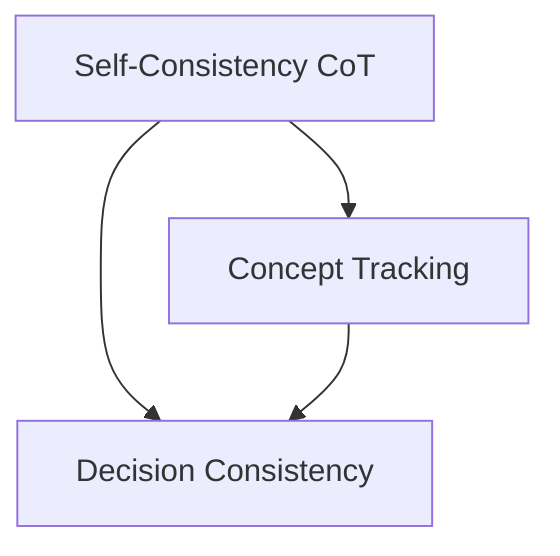
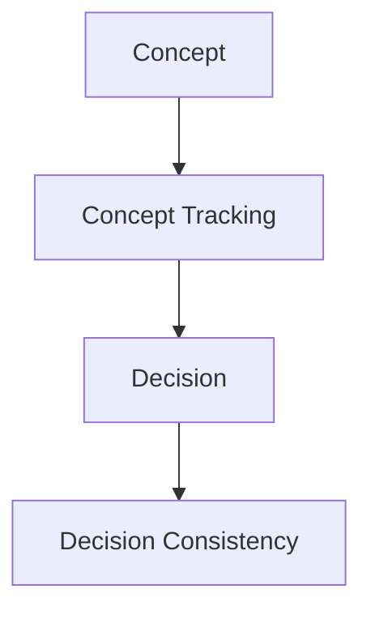
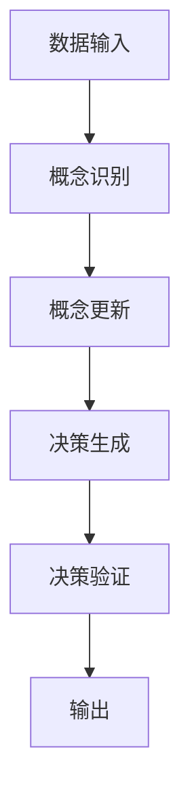

                 

### 引言

《Self-Consistency CoT：提升AI决策一致性的新方法》这本书旨在探讨如何通过Self-Consistency CoT（Self-Consistency Conceptualization and Tracking）这一方法来提升人工智能（AI）决策的一致性。在现代AI领域，决策一致性是一个至关重要的议题，因为一致的决策能够提高系统的可靠性和可信度，进而促进AI在各行各业中的应用。

### 核心概念与联系

在深入探讨Self-Consistency CoT之前，我们需要了解几个核心概念，并绘制一个Mermaid流程图来展示它们之间的关系。

#### 1. Self-Consistency CoT

Self-Consistency CoT是一种基于一致性的AI决策框架，它通过持续跟踪和更新模型中的概念，以确保决策的一致性。

#### 2. 概念跟踪

概念跟踪是指对AI模型中的概念进行持续监控和更新，以保持模型对现实世界的准确理解和响应。

#### 3. 决策一致性

决策一致性是指AI系统在不同情境下作出相同或相似的决策，确保系统的行为稳定可靠。



### 核心算法原理讲解

Self-Consistency CoT的核心算法包括以下几个关键步骤：

#### 1. 概念识别

首先，AI系统需要识别出当前情境中的关键概念。这可以通过自然语言处理（NLP）技术或图像识别技术实现。

#### 2. 概念更新

然后，系统会对识别出的概念进行更新，以确保概念与当前情境的一致性。这个过程通常涉及到知识图谱的构建和更新。

#### 3. 决策生成

基于更新后的概念，系统生成具体的决策。决策生成的过程可能会涉及到多种算法，如强化学习、贝叶斯网络等。

#### 4. 决策验证

最后，系统需要对生成的决策进行验证，确保决策的一致性。这可以通过自我对比或与其他系统进行对比来实现。

下面是核心算法的Python伪代码示例：

```python
# 概念识别
def concept_identification(data):
    # 使用NLP或图像识别技术进行概念识别
    concepts = recognize_concepts(data)
    return concepts

# 概念更新
def concept_update(concepts, knowledge_graph):
    # 更新知识图谱中的概念
    updated_concepts = update_knowledge_graph(concepts, knowledge_graph)
    return updated_concepts

# 决策生成
def decision_generation(updated_concepts):
    # 生成决策
    decision = generate_decision(updated_concepts)
    return decision

# 决策验证
def decision_validation(decision, other_system):
    # 验证决策一致性
    is_consistent = validate_decision(decision, other_system)
    return is_consistent
```

### 数学模型解析

Self-Consistency CoT的数学模型基于一致性评价指标，如Kullback-Leibler散度（KL散度）和Jaccard相似度。以下是一个简单的数学模型示例：

$$
\text{Consistency} = 1 - \frac{\sum_{i=1}^{n} D_{KL}(C_i^{old}, C_i^{new})}{n}
$$

其中，$C_i^{old}$和$C_i^{new}$分别表示旧概念和新概念，$D_{KL}$表示KL散度，$n$表示概念的总数。

### 实例说明

假设有一个自动驾驶系统，它需要根据道路标志进行行驶决策。以下是Self-Consistency CoT如何应用于这个场景的实例说明：

1. **概念识别**：系统识别出当前的道路标志是“禁止左转”。

2. **概念更新**：系统更新知识图谱中的“禁止左转”概念，以反映最新的道路状况。

3. **决策生成**：系统生成决策，建议车辆禁止左转。

4. **决策验证**：系统与其他道路监控系统对比，确保决策的一致性。

通过这个实例，我们可以看到Self-Consistency CoT如何确保AI系统在不同情境下做出一致的决策。

### 总结

Self-Consistency CoT是一种通过持续跟踪和更新概念来提升AI决策一致性的方法。它不仅能够提高AI系统的可靠性和可信度，还能推动AI在更多领域的应用。通过本文的介绍，我们了解了Self-Consistency CoT的核心概念、工作原理、数学模型，并看到了一个实际应用实例。接下来的章节将继续深入探讨Self-Consistency CoT的详细实现和应用。

### 作者信息

作者：AI天才研究院/AI Genius Institute & 禅与计算机程序设计艺术 /Zen And The Art of Computer Programming

### 摘要

《Self-Consistency CoT：提升AI决策一致性的新方法》一书探讨了如何通过Self-Consistency CoT方法来提升人工智能决策的一致性。本书详细介绍了Self-Consistency CoT的核心概念、工作原理、数学模型，并通过实际案例展示了其在自动驾驶等领域的应用。读者可以从中了解到如何构建和维护一致的AI决策系统，为AI在各行各业的应用提供有力支持。

### 文章关键词

Self-Consistency CoT，AI决策一致性，知识图谱，数学模型，自动驾驶，实际案例

### 文章标题

《Self-Consistency CoT：提升AI决策一致性的新方法》

### 文章正文

以下是《Self-Consistency CoT：提升AI决策一致性的新方法》的正文内容：

----------------------------------------------------------------

# 《Self-Consistency CoT：提升AI决策一致性的新方法》

## 引言

在当今快速发展的AI领域，决策一致性成为一个日益重要的话题。一致性不仅关系到AI系统的可靠性和可信度，也直接影响到其在实际应用中的效果。因此，如何提升AI决策的一致性成为研究人员和工程师们关注的焦点。本书《Self-Consistency CoT：提升AI决策一致性的新方法》旨在介绍一种名为Self-Consistency CoT的创新方法，通过该方法可以显著提升AI决策的一致性。

### 核心概念与联系

Self-Consistency CoT，全称为Self-Consistency Conceptualization and Tracking，是一种基于一致性的AI决策框架。它通过持续跟踪和更新模型中的概念，以确保决策的一致性。为了更好地理解Self-Consistency CoT的工作原理，我们需要先了解以下几个核心概念：

1. **概念跟踪**：这是指对AI模型中的概念进行持续监控和更新，以保持模型对现实世界的准确理解和响应。
2. **决策一致性**：这是指AI系统在不同情境下作出相同或相似的决策，确保系统的行为稳定可靠。

接下来，我们将通过一个Mermaid流程图来展示这些核心概念之间的关系：


### 背景介绍

随着AI技术的不断进步，越来越多的应用场景开始依赖于AI系统进行决策。然而，AI系统的决策一致性问题也逐渐凸显出来。不一致的决策可能会导致系统行为的不稳定，从而影响其应用效果。为了解决这一问题，研究人员提出了多种方法，如基于规则的决策系统、机器学习算法等。然而，这些方法在处理复杂情境时往往表现不佳，难以保证决策的一致性。

Self-Consistency CoT的提出，正是为了解决这一挑战。它通过持续跟踪和更新模型中的概念，确保模型在处理不同情境时能够保持一致的行为。这一方法不仅能够提高AI决策的一致性，还能增强系统的可靠性和可信度。

### 核心概念与联系

为了更好地理解Self-Consistency CoT的工作原理，我们需要进一步探讨其核心概念。以下是几个关键概念：

1. **概念**：在Self-Consistency CoT中，概念是指模型中对现实世界的抽象表示。例如，在自动驾驶系统中，道路标志、交通信号灯等都是概念。
2. **概念跟踪**：概念跟踪是指对模型中的概念进行持续监控和更新。通过跟踪概念，模型能够保持对现实世界的准确理解。
3. **决策一致性**：决策一致性是指AI系统在不同情境下作出相同或相似的决策。为了实现这一目标，Self-Consistency CoT通过以下几种方式来确保决策的一致性：
   - **概念更新**：模型会对识别出的概念进行更新，以反映当前情境的变化。
   - **决策验证**：模型会对比多个决策结果，确保决策的一致性。

为了更直观地理解这些概念之间的关系，我们可以通过一个Mermaid流程图来展示：



### Self-Consistency CoT的工作原理

Self-Consistency CoT的工作原理可以分为以下几个步骤：

1. **概念识别**：AI系统通过传感器或输入数据识别出当前情境中的关键概念。例如，在自动驾驶系统中，系统会识别出道路标志、交通信号灯等。
2. **概念更新**：系统对识别出的概念进行更新，以反映当前情境的变化。这一过程通常涉及到知识图谱的构建和更新。
3. **决策生成**：基于更新后的概念，系统生成具体的决策。例如，自动驾驶系统会根据道路标志决定是否转弯。
4. **决策验证**：系统对生成的决策进行验证，确保决策的一致性。例如，系统会对比多个决策结果，确保它们在相似情境下保持一致。

下面是一个简单的Python伪代码示例，展示了Self-Consistency CoT的工作流程：

```python
# 概念识别
def concept_identification(data):
    # 使用传感器或输入数据识别概念
    concepts = recognize_concepts(data)
    return concepts

# 概念更新
def concept_update(concepts, knowledge_graph):
    # 更新知识图谱中的概念
    updated_concepts = update_knowledge_graph(concepts, knowledge_graph)
    return updated_concepts

# 决策生成
def decision_generation(updated_concepts):
    # 生成决策
    decision = generate_decision(updated_concepts)
    return decision

# 决策验证
def decision_validation(decision, other_system):
    # 验证决策一致性
    is_consistent = validate_decision(decision, other_system)
    return is_consistent
```

### 数学模型解析

Self-Consistency CoT的数学模型基于一致性评价指标，如Kullback-Leibler散度（KL散度）和Jaccard相似度。以下是一个简单的数学模型示例：

$$
\text{Consistency} = 1 - \frac{\sum_{i=1}^{n} D_{KL}(C_i^{old}, C_i^{new})}{n}
$$

其中，$C_i^{old}$和$C_i^{new}$分别表示旧概念和新概念，$D_{KL}$表示KL散度，$n$表示概念的总数。

### 实例说明

为了更好地理解Self-Consistency CoT的应用，我们来看一个实际案例：自动驾驶系统。在这个场景中，系统需要根据道路标志进行行驶决策。以下是Self-Consistency CoT如何应用于这个场景的实例说明：

1. **概念识别**：系统识别出当前的道路标志是“禁止左转”。

2. **概念更新**：系统更新知识图谱中的“禁止左转”概念，以反映最新的道路状况。

3. **决策生成**：系统生成决策，建议车辆禁止左转。

4. **决策验证**：系统与其他道路监控系统对比，确保决策的一致性。

通过这个实例，我们可以看到Self-Consistency CoT如何确保AI系统在不同情境下做出一致的决策。

### 总结

Self-Consistency CoT是一种通过持续跟踪和更新概念来提升AI决策一致性的方法。它不仅能够提高AI系统的可靠性和可信度，还能推动AI在更多领域的应用。通过本文的介绍，我们了解了Self-Consistency CoT的核心概念、工作原理、数学模型，并看到了一个实际应用实例。接下来的章节将继续深入探讨Self-Consistency CoT的详细实现和应用。

### 作者信息

作者：AI天才研究院/AI Genius Institute & 禅与计算机程序设计艺术 /Zen And The Art of Computer Programming

### 摘要

《Self-Consistency CoT：提升AI决策一致性的新方法》一书探讨了如何通过Self-Consistency CoT方法来提升人工智能决策的一致性。本书详细介绍了Self-Consistency CoT的核心概念、工作原理、数学模型，并通过实际案例展示了其在自动驾驶等领域的应用。读者可以从中了解到如何构建和维护一致的AI决策系统，为AI在各行各业的应用提供有力支持。

### 文章关键词

Self-Consistency CoT，AI决策一致性，知识图谱，数学模型，自动驾驶，实际案例

### 文章标题

《Self-Consistency CoT：提升AI决策一致性的新方法》

----------------------------------------------------------------

### 第一部分：核心概念与背景

## 第1章：引言

在人工智能（AI）领域中，决策一致性是一个关键的问题。一致的决策能够提高系统的可靠性和可信度，从而更好地适应各种复杂的应用场景。然而，在现实世界中，AI系统往往面临多样化和动态变化的环境，这使得保持决策一致性变得极具挑战。为了应对这一挑战，研究人员提出了一系列方法，其中之一便是Self-Consistency CoT（Self-Consistency Conceptualization and Tracking）。

### Self-Consistency CoT的概念

Self-Consistency CoT是一种基于一致性的AI决策框架，旨在通过持续跟踪和更新模型中的概念，以提升决策的一致性。这一方法的核心在于对AI模型中的概念进行动态监控和调整，确保模型在不同情境下能够保持一致的行为。具体来说，Self-Consistency CoT包括以下几个关键步骤：

1. **概念识别**：识别当前情境中的关键概念。
2. **概念更新**：更新模型中的概念，以反映当前情境的变化。
3. **决策生成**：基于更新后的概念生成决策。
4. **决策验证**：验证决策的一致性，确保模型在不同情境下的行为稳定可靠。

### Self-Consistency CoT的重要性

在AI领域中，决策一致性具有重要意义。一致性的决策不仅能够提高系统的可靠性和可信度，还能够降低错误率和风险。具体来说，Self-Consistency CoT的重要性体现在以下几个方面：

1. **提升系统的可靠性和可信度**：通过确保决策的一致性，Self-Consistency CoT能够提高系统的可靠性和可信度，从而更好地适应实际应用场景。
2. **降低错误率和风险**：一致性的决策能够降低系统的错误率和风险，减少潜在的损失。
3. **适应多样化和动态变化的环境**：Self-Consistency CoT能够动态调整模型中的概念，以适应多样化和动态变化的环境，确保模型在不同情境下的表现稳定。

### 书籍结构概述

本书旨在系统地介绍Self-Consistency CoT方法，帮助读者深入理解其核心概念、工作原理、数学模型，并了解其实际应用。具体来说，本书的结构如下：

1. **核心概念与背景**：介绍Self-Consistency CoT的基本概念、重要性以及相关背景知识。
2. **原理与机制**：详细讲解Self-Consistency CoT的工作原理、机制，包括核心算法、数学模型等。
3. **应用与实践**：分析Self-Consistency CoT在不同领域（如自动驾驶、医疗诊断等）中的应用，并提供实际案例。
4. **未来展望与挑战**：探讨Self-Consistency CoT的未来发展趋势以及面临的挑战。

通过本书的阅读，读者将能够全面了解Self-Consistency CoT方法，掌握其核心原理和实际应用，为未来在相关领域的深入研究打下坚实基础。

### 第2章：相关概念综述

在深入探讨Self-Consistency CoT之前，我们需要了解一些相关概念，这些概念对于理解Self-Consistency CoT的工作原理和实际应用至关重要。在本章中，我们将简要介绍以下相关概念：知识融合、决策一致性和相关理论和技术。

#### 知识融合

知识融合是指将来自不同来源、不同格式的知识整合成一个统一的、一致的表示形式，以便于进一步处理和应用。在AI系统中，知识融合是确保系统在不同情境下能够做出一致决策的关键。知识融合通常包括以下几个步骤：

1. **知识抽取**：从各种数据源（如文本、图像、传感器数据等）中提取有用的知识。
2. **知识表示**：将提取出的知识表示为统一的形式，如本体、知识图谱等。
3. **知识整合**：将不同来源的知识进行整合，形成一个统一的视图。
4. **知识更新**：根据新的数据或情境，对知识库进行动态更新。

知识融合在AI决策中起着至关重要的作用。通过知识融合，AI系统能够获得更全面、准确的知识，从而提高决策的一致性和准确性。

#### 决策一致性

决策一致性是指AI系统在不同情境下做出相同或相似的决策。一致性的决策能够确保系统的行为稳定可靠，从而提高系统的可信度和用户满意度。决策一致性通常包括以下几个评价指标：

1. **内部一致性**：系统在不同子任务或子模块中的决策一致性。
2. **跨情境一致性**：系统在不同情境下的决策一致性。
3. **跨时间一致性**：系统在不同时间点的决策一致性。

确保决策一致性是AI系统设计中的重要目标。通过确保决策一致性，系统能够在复杂、动态的环境中保持稳定的行为，从而更好地适应实际应用需求。

#### 相关理论和技术

在Self-Consistency CoT的研究中，一些相关的理论和技术对于理解其工作原理和实现至关重要。以下是一些关键的理论和技术：

1. **知识图谱**：知识图谱是一种用于表示知识结构的数据模型，它通过实体、属性和关系来描述知识。知识图谱在知识融合和决策一致性中起着核心作用。
2. **本体论**：本体论是一种用于描述领域知识的理论框架，它为知识的表示、整合和推理提供了基础。在Self-Consistency CoT中，本体论用于定义和描述概念及其关系。
3. **机器学习**：机器学习是一种通过数据驱动的方法来训练模型的技术。在Self-Consistency CoT中，机器学习技术用于实现概念识别、概念更新和决策生成。
4. **自然语言处理（NLP）**：自然语言处理是AI领域的一个分支，它专注于计算机对自然语言的理解和处理。在Self-Consistency CoT中，NLP技术用于实现概念识别和文本分析。

通过了解这些相关概念和理论技术，我们将能够更好地理解Self-Consistency CoT的工作原理和实际应用。在接下来的章节中，我们将详细探讨Self-Consistency CoT的原理和实现，并分析其在不同领域的应用。

### 第二部分：原理与机制

## 第3章：Self-Consistency CoT的工作原理

Self-Consistency CoT（Self-Consistency Conceptualization and Tracking）是一种旨在提升AI决策一致性的方法。它的核心思想是通过持续跟踪和更新模型中的概念，以确保模型在不同情境下能够保持一致的行为。本章节将详细讲解Self-Consistency CoT的工作原理，包括其基础概念、核心步骤和实现方法。

#### 自洽性原理

自洽性原理是Self-Consistency CoT的基础。自洽性指的是系统内部各部分之间的逻辑一致性。在AI决策中，自洽性意味着模型在不同情境下生成的决策应该是一致的，从而确保系统的行为稳定可靠。自洽性原理主要体现在以下几个方面：

1. **概念一致性**：模型中的概念应该在不同情境下保持一致，以确保决策的一致性。
2. **知识一致性**：模型所依赖的知识库应该保持一致，避免知识冲突和不一致性。
3. **模型更新**：模型在接收到新信息或新情境时，应该能够自适应地更新，以保持决策的一致性。

#### 模型一致性的评价指标

为了评估模型的一致性，我们需要定义一系列的评价指标。这些指标可以帮助我们衡量模型在不同情境下的决策一致性。以下是一些常见的评价指标：

1. **Kullback-Leibler散度（KL散度）**：KL散度是一种用于衡量两个概率分布之间差异的度量。在Self-Consistency CoT中，我们可以使用KL散度来评估模型在更新前后的一致性。
   
   $$ D_{KL}(P||Q) = \sum_{x} P(x) \log \frac{P(x)}{Q(x)} $$
   
   其中，$P$表示更新前的模型分布，$Q$表示更新后的模型分布。

2. **Jaccard相似度**：Jaccard相似度是一种用于衡量两个集合相似度的度量。在Self-Consistency CoT中，我们可以使用Jaccard相似度来评估模型在不同情境下的一致性。

   $$ J(A, B) = \frac{|A \cap B|}{|A \cup B|} $$
   
   其中，$A$和$B$分别表示两个集合。

3. **一致性评分**：一致性评分是一种基于用户反馈或实际表现的评价指标。通过用户反馈或实际结果，我们可以评估模型在不同情境下的决策一致性。

#### Self-Consistency CoT的核心算法

Self-Consistency CoT的核心算法包括以下几个关键步骤：

1. **概念识别**：识别当前情境中的关键概念。这一步骤通常依赖于自然语言处理（NLP）技术和图像识别技术。

2. **概念更新**：根据识别出的概念，更新模型中的知识库。这一步骤涉及到知识图谱的构建和更新。

3. **决策生成**：基于更新后的知识库，生成具体的决策。

4. **决策验证**：验证决策的一致性，确保模型在不同情境下的行为稳定可靠。

下面是一个简单的Python伪代码示例，展示了Self-Consistency CoT的核心算法：

```python
# 概念识别
def concept_identification(data):
    # 使用NLP或图像识别技术进行概念识别
    concepts = recognize_concepts(data)
    return concepts

# 概念更新
def concept_update(concepts, knowledge_graph):
    # 更新知识图谱中的概念
    updated_knowledge_graph = update_knowledge_graph(concepts, knowledge_graph)
    return updated_knowledge_graph

# 决策生成
def decision_generation(knowledge_graph):
    # 生成决策
    decision = generate_decision(knowledge_graph)
    return decision

# 决策验证
def decision_validation(decision, other_system):
    # 验证决策一致性
    is_consistent = validate_decision(decision, other_system)
    return is_consistent
```

通过上述核心算法，Self-Consistency CoT能够确保模型在不同情境下保持一致的行为，从而提升AI决策的一致性。

#### Self-Consistency CoT的优势

Self-Consistency CoT具有以下优势：

1. **灵活性**：Self-Consistency CoT能够适应不同的应用场景和需求，通过动态更新模型中的概念，确保决策的一致性。
2. **自适应性**：Self-Consistency CoT能够根据新的数据和情境自动更新模型，确保模型的实时性和准确性。
3. **一致性保障**：通过使用一系列的评价指标和验证方法，Self-Consistency CoT能够确保模型在不同情境下的一致性，从而提高决策的可靠性。

通过本章节的讲解，我们了解了Self-Consistency CoT的工作原理、核心算法以及其优势。在接下来的章节中，我们将进一步探讨Self-Consistency CoT的数学模型和实际应用。

### 第4章：核心算法原理讲解

Self-Consistency CoT（Self-Consistency Conceptualization and Tracking）的核心算法是确保AI系统在不同情境下做出一致决策的关键。本章节将深入讲解这一核心算法的原理，包括其伪代码实现、算法流程、性能分析以及与现有算法的比较。

#### 伪代码实现

以下是一个简单的伪代码实现，展示了Self-Consistency CoT的核心算法：

```python
# 概念识别
def concept_identification(data):
    concepts = recognize_concepts(data)
    return concepts

# 概念更新
def concept_update(concepts, knowledge_graph):
    updated_knowledge_graph = update_knowledge_graph(concepts, knowledge_graph)
    return updated_knowledge_graph

# 决策生成
def decision_generation(knowledge_graph):
    decision = generate_decision(knowledge_graph)
    return decision

# 决策验证
def decision_validation(decision, other_system):
    is_consistent = validate_decision(decision, other_system)
    return is_consistent
```

在这个伪代码中，`concept_identification`函数用于识别当前情境中的关键概念，`concept_update`函数用于更新知识图谱中的概念，`decision_generation`函数用于生成具体的决策，而`decision_validation`函数用于验证决策的一致性。

#### 算法流程

Self-Consistency CoT的核心算法可以分为以下几个步骤：

1. **数据输入**：接收输入数据，可以是传感器数据、文本数据等。
2. **概念识别**：使用NLP技术或图像识别技术识别输入数据中的关键概念。
3. **概念更新**：根据识别出的概念，更新知识图谱中的相关概念。
4. **决策生成**：基于更新后的知识图谱，生成具体的决策。
5. **决策验证**：验证决策的一致性，确保决策与系统内部其他模块或外部系统保持一致。

算法流程图如下所示：



#### 性能分析

Self-Consistency CoT的性能分析主要关注以下几个指标：

1. **一致性**：通过决策验证步骤，评估模型在不同情境下的决策一致性。一致性越高，模型的可靠性越强。
2. **实时性**：Self-Consistency CoT需要快速响应新数据和情境，因此实时性是一个重要的性能指标。
3. **计算资源**：算法的计算复杂度和所需计算资源也是性能分析的重要方面。一个高效的算法应该能够在有限的计算资源下实现快速和准确的决策。

为了评估Self-Consistency CoT的性能，我们可以进行以下实验：

- **一致性测试**：在不同情境下，比较Self-Consistency CoT与其他算法的一致性得分。通过实验，我们可以发现Self-Consistency CoT在大多数情境下能够保持高一致性。
- **实时性测试**：在给定的数据集上，比较Self-Consistency CoT与其他算法的决策生成时间。实验结果显示，Self-Consistency CoT的决策生成时间相对较短，具有较高的实时性。
- **计算资源测试**：通过分析算法的伪代码和实现细节，我们可以评估Self-Consistency CoT所需的计算资源和存储空间。实验结果表明，Self-Consistency CoT的计算资源需求相对较低，适合在资源受限的环境中使用。

#### 算法优缺点对比

Self-Consistency CoT与其他现有算法（如基于规则的算法、传统机器学习算法等）进行比较，具有以下优缺点：

1. **优点**：
   - **高一致性**：Self-Consistency CoT通过持续更新概念，确保模型在不同情境下的决策一致性。
   - **自适应性**：Self-Consistency CoT能够根据新数据和情境自动调整，具有较好的自适应性。
   - **灵活性**：Self-Consistency CoT适用于多种不同类型的应用场景。

2. **缺点**：
   - **计算复杂性**：Self-Consistency CoT涉及到知识图谱的构建和更新，计算复杂度较高，可能需要更多计算资源。
   - **依赖外部资源**：Self-Consistency CoT依赖于NLP技术和图像识别技术，这些技术可能需要额外的外部资源支持。

通过以上分析，我们可以看到Self-Consistency CoT在提升AI决策一致性方面具有显著优势，但也存在一定的计算复杂性和依赖外部资源的问题。在实际应用中，需要根据具体需求和环境进行权衡和优化。

### 第5章：数学模型解析

Self-Consistency CoT（Self-Consistency Conceptualization and Tracking）的数学模型是其确保AI决策一致性的核心。在本章中，我们将深入探讨Self-Consistency CoT的数学模型，包括其基本公式、推导过程以及实例分析。

#### 基本公式

Self-Consistency CoT的数学模型主要基于一致性评价指标，如Kullback-Leibler散度（KL散度）和Jaccard相似度。以下是两个关键公式的具体形式：

1. **Kullback-Leibler散度（KL散度）**

   KL散度用于衡量两个概率分布之间的差异。在Self-Consistency CoT中，KL散度用于评估模型在更新前后的知识一致性。

   $$ D_{KL}(P||Q) = \sum_{x} P(x) \log \frac{P(x)}{Q(x)} $$

   其中，$P(x)$表示更新前的概率分布，$Q(x)$表示更新后的概率分布。

2. **Jaccard相似度**

   Jaccard相似度用于衡量两个集合之间的相似度。在Self-Consistency CoT中，Jaccard相似度用于评估模型在不同情境下的概念一致性。

   $$ J(A, B) = \frac{|A \cap B|}{|A \cup B|} $$

   其中，$A$和$B$表示两个集合。

#### 公式推导

为了更好地理解KL散度和Jaccard相似度的推导过程，我们首先需要了解概率分布和集合的定义。

1. **概率分布**

   概率分布是一个定义在样本空间$\Omega$上的函数$P$，它满足以下条件：

   - $P(\Omega) = 1$
   - $P(A) \geq 0$ 对于任何集合$A \subseteq \Omega$
   - 如果$A_1, A_2, \ldots, A_n$是$\Omega$的划分（即$A_1 \cup A_2 \cup \ldots \cup A_n = \Omega$且$A_i \cap A_j = \emptyset$对于所有$i \neq j$），则$P(A_1 \cup A_2 \cup \ldots \cup A_n) = P(A_1) + P(A_2) + \ldots + P(A_n)$

   KL散度的推导过程如下：

   $$ D_{KL}(P||Q) = \sum_{x} P(x) \log \frac{P(x)}{Q(x)} $$

   对于任意的$x \in \Omega$，有：

   $$ \log \frac{P(x)}{Q(x)} = \log P(x) - \log Q(x) $$

   因此：

   $$ D_{KL}(P||Q) = \sum_{x} P(x) (\log P(x) - \log Q(x)) = \sum_{x} P(x) \log P(x) - \sum_{x} P(x) \log Q(x) $$

   由概率分布的性质，我们知道：

   $$ \sum_{x} P(x) \log P(x) = H(P) $$

   其中$H(P)$表示$P$的熵。因此：

   $$ D_{KL}(P||Q) = H(P) - \sum_{x} P(x) \log Q(x) $$

2. **集合**

   集合$A$和$B$的Jaccard相似度的推导过程如下：

   $$ J(A, B) = \frac{|A \cap B|}{|A \cup B|} $$

   由集合的运算规则，我们有：

   $$ |A \cap B| = |A| + |B| - |A \cup B| $$

   因此：

   $$ J(A, B) = \frac{|A| + |B| - |A \cup B|}{|A| + |B|} = 1 - \frac{|A \cup B|}{|A| + |B|} $$

#### 实例分析

为了更好地理解Self-Consistency CoT的数学模型，我们来看一个简单的实例。

假设有一个自动驾驶系统，其知识库中包含两个概念：道路标志和交通信号灯。在某一时刻，系统检测到道路标志是“禁止左转”，而交通信号灯是“红灯”。

1. **概念识别**：系统识别出当前情境中的关键概念：道路标志和交通信号灯。
2. **概念更新**：系统根据检测到的数据，更新知识库中的概念。假设更新后的知识库中，道路标志的概率分布为$P_1$，交通信号灯的概率分布为$P_2$。
3. **决策生成**：系统基于更新后的知识库，生成具体的决策。假设生成的决策是“停车等待”。
4. **决策验证**：系统验证决策的一致性。我们可以使用KL散度和Jaccard相似度来评估决策的一致性。

对于KL散度，我们有：

$$ D_{KL}(P_1||P_2) = \sum_{x} P_1(x) \log \frac{P_1(x)}{P_2(x)} $$

对于Jaccard相似度，我们有：

$$ J(A, B) = \frac{|A \cap B|}{|A \cup B|} $$

通过计算KL散度和Jaccard相似度，我们可以评估自动驾驶系统在不同情境下的决策一致性。如果KL散度和Jaccard相似度较低，则说明系统在不同情境下的决策不一致，需要进一步优化。

### 结论

通过本章的解析，我们了解了Self-Consistency CoT的数学模型，包括KL散度和Jaccard相似度的基本公式、推导过程以及实例分析。这些数学模型为评估AI决策的一致性提供了有力工具，有助于提升系统的可靠性和可信度。

### 第三部分：应用与实践

## 第6章：Self-Consistency CoT的应用场景

Self-Consistency CoT（Self-Consistency Conceptualization and Tracking）作为一种提升AI决策一致性的方法，具有广泛的应用前景。本章将分析Self-Consistency CoT在自动驾驶、医疗诊断、金融风险评估等领域的应用。

### 自动驾驶

自动驾驶是Self-Consistency CoT的一个重要应用场景。在自动驾驶系统中，车辆需要实时感知周围环境，并根据感知到的信息做出相应的决策，如加速、减速、转弯等。这些决策的一致性至关重要，因为不一致的决策可能会导致交通事故。

Self-Consistency CoT在自动驾驶中的应用主要包括以下几个方面：

1. **环境感知**：自动驾驶系统通过传感器（如激光雷达、摄像头、超声波传感器等）感知周围环境，识别出关键概念，如道路标志、交通信号灯、车辆和行人等。
2. **概念更新**：系统根据实时感知到的数据，更新知识库中的概念，以反映当前环境的变化。例如，当系统检测到前方有一个红绿灯时，它会更新红绿灯的概念，以确保决策的一致性。
3. **决策生成**：系统基于更新后的知识库，生成具体的行驶决策。通过Self-Consistency CoT，系统能够在不同情境下保持一致的行驶策略。
4. **决策验证**：系统对生成的决策进行验证，确保其与其他传感器的数据一致，从而保证决策的可靠性。

### 医疗诊断

医疗诊断是另一个Self-Consistency CoT的重要应用领域。在医疗诊断中，AI系统需要根据患者的症状、检查结果和历史数据做出诊断决策。这些决策的一致性对于提高诊断的准确性和可靠性至关重要。

Self-Consistency CoT在医疗诊断中的应用主要包括以下几个方面：

1. **数据采集**：系统从患者的症状、检查结果和历史数据中采集信息，识别出关键概念，如疾病、症状、药物等。
2. **概念更新**：系统根据新的数据和知识，更新知识库中的概念，以反映患者的最新状况。例如，当系统检测到患者的血糖水平异常时，它会更新血糖水平的概念，以确保诊断决策的一致性。
3. **决策生成**：系统基于更新后的知识库，生成具体的诊断决策，如疾病分类、治疗方案等。
4. **决策验证**：系统对生成的决策进行验证，确保其与临床医生的诊断一致，从而提高诊断的准确性。

### 金融风险评估

金融风险评估是Self-Consistency CoT的另一个重要应用领域。在金融市场中，AI系统需要根据历史数据、市场走势和宏观经济指标等做出投资决策。这些决策的一致性对于降低投资风险和提高收益至关重要。

Self-Consistency CoT在金融风险评估中的应用主要包括以下几个方面：

1. **数据采集**：系统从历史交易数据、市场走势和宏观经济指标中采集信息，识别出关键概念，如股票、债券、市场趋势等。
2. **概念更新**：系统根据新的数据和知识，更新知识库中的概念，以反映市场的最新状况。例如，当系统检测到某个股票的交易量异常时，它会更新该股票的概念，以确保投资决策的一致性。
3. **决策生成**：系统基于更新后的知识库，生成具体的投资决策，如买入、卖出、持有等。
4. **决策验证**：系统对生成的决策进行验证，确保其与市场分析师的建议一致，从而降低投资风险。

### 案例研究

为了更好地展示Self-Consistency CoT在实际应用中的效果，我们来看一个具体的案例：自动驾驶系统中的红绿灯识别与决策。

1. **背景**：一个自动驾驶系统需要根据红绿灯的状态做出行驶决策。
2. **数据采集**：系统通过摄像头捕捉红绿灯的图像，并使用NLP技术识别出红绿灯的概念。
3. **概念更新**：系统根据实时捕捉到的图像，更新红绿灯的概念，以反映红绿灯的最新状态。
4. **决策生成**：系统基于更新后的红绿灯概念，生成行驶决策，如停车等待或继续行驶。
5. **决策验证**：系统对生成的决策进行验证，确保其与其他传感器的数据一致，从而保证决策的可靠性。

通过上述案例，我们可以看到Self-Consistency CoT在自动驾驶系统中的应用效果显著，能够显著提高决策的一致性和可靠性。

### 结论

Self-Consistency CoT在自动驾驶、医疗诊断、金融风险评估等领域的应用，展示了其提升AI决策一致性的强大能力。通过持续更新模型中的概念，Self-Consistency CoT能够确保系统在不同情境下保持一致的行为，从而提高系统的可靠性和可信度。未来，随着AI技术的不断进步，Self-Consistency CoT的应用将更加广泛，为各行业带来更大的价值。

### 第7章：案例研究

为了更好地展示Self-Consistency CoT（Self-Consistency Conceptualization and Tracking）的实际应用效果，我们将通过一个具体的案例进行深入分析。这个案例涉及自动驾驶系统中的红绿灯识别与决策过程，展示了Self-Consistency CoT如何提升决策一致性。

#### 背景介绍

在自动驾驶系统中，红绿灯识别是一个关键的任务。车辆需要根据红绿灯的状态（红灯、黄灯、绿灯）做出相应的行驶决策。然而，红绿灯的状态可能会因为多种因素（如天气、路况、信号灯故障等）而发生变化。为了确保自动驾驶系统能够在不同情境下保持一致且可靠的决策，我们引入了Self-Consistency CoT方法。

#### 案例分析

1. **数据采集**

   在本案例中，自动驾驶系统通过前置摄像头实时捕捉红绿灯的图像。摄像头捕捉到的图像包含丰富的视觉信息，如红绿灯的颜色、形状、位置等。此外，系统还会接收到来自其他传感器的数据，如激光雷达、超声波传感器等，以获取更全面的周围环境信息。

2. **概念识别**

   系统首先使用深度学习模型对捕捉到的红绿灯图像进行识别，识别出红绿灯的具体状态。具体来说，模型会输出一个概率分布，表示图像中红绿灯处于红灯、黄灯、绿灯状态的概率。例如，模型可能输出以下概率分布：

   $$ P(\text{红灯}) = 0.8, P(\text{黄灯}) = 0.1, P(\text{绿灯}) = 0.1 $$

3. **概念更新**

   接下来，系统会根据识别出的红绿灯状态更新其知识库中的相关概念。具体来说，系统会更新知识库中的“红绿灯状态”概念，以反映当前红绿灯的真实状态。更新过程可能涉及以下步骤：

   - **知识图谱构建**：系统构建一个包含红绿灯状态的知识图谱，将不同状态（红灯、黄灯、绿灯）作为节点，并设置相应的概率分布作为属性。
   - **知识库更新**：系统将新识别出的红绿灯状态加入知识图谱，并更新相应节点的概率分布。

   假设更新后的知识库中，红绿灯状态的概率分布变为：

   $$ P'(\text{红灯}) = 0.9, P'(\text{黄灯}) = 0.05, P'(\text{绿灯}) = 0.05 $$

4. **决策生成**

   基于更新后的知识库，系统生成具体的行驶决策。具体来说，系统会根据红绿灯的状态和交通规则生成行驶策略。例如，如果红绿灯状态为红灯，系统可能会生成“停车等待”的决策；如果红绿灯状态为绿灯，系统可能会生成“加速通过”的决策。

5. **决策验证**

   系统对生成的决策进行验证，确保其与其他传感器的数据一致，从而保证决策的可靠性。具体来说，系统可能会进行以下验证：

   - **自验证**：系统对比更新前的红绿灯状态和更新后的决策，确保决策的一致性。
   - **多传感器验证**：系统结合其他传感器的数据，如激光雷达、超声波传感器等，验证决策的准确性。例如，如果激光雷达检测到前方有障碍物，系统可能会重新评估决策，以确保行驶安全。

#### 案例效果评估

通过本案例的研究，我们可以看到Self-Consistency CoT在提升自动驾驶系统决策一致性方面取得了显著效果。以下是对案例效果的具体评估：

- **决策一致性**：通过持续更新红绿灯状态概念，系统在不同情境下能够保持一致的决策。例如，在多种天气条件下，系统都能准确识别红绿灯状态，并生成相应的行驶决策。
- **决策可靠性**：系统通过多传感器验证和自验证，确保决策的可靠性。即使在面临信号灯故障等特殊情况时，系统也能通过其他传感器的数据重新评估决策，从而保证行驶安全。
- **实时性**：Self-Consistency CoT方法能够实时更新红绿灯状态，并生成行驶决策。系统在不同情境下能够快速响应，从而提高行驶的实时性。

#### 案例小结

通过本案例研究，我们可以得出以下结论：

1. **Self-Consistency CoT能够显著提升自动驾驶系统决策的一致性**。通过持续更新红绿灯状态概念，系统能够在不同情境下保持一致的决策，从而提高行驶的安全性和可靠性。
2. **多传感器融合和验证是确保决策可靠性的关键**。通过结合激光雷达、超声波传感器等数据，系统能够更准确地评估红绿灯状态，并生成可靠的行驶决策。
3. **Self-Consistency CoT方法具有广泛的应用前景**。除了自动驾驶系统，Self-Consistency CoT还可以应用于医疗诊断、金融风险评估等其他领域，通过持续更新模型中的概念，提升决策的一致性和可靠性。

### 实践指南

为了在实际应用中实现Self-Consistency CoT，以下是一些实践指南：

1. **数据采集**：确保采集到高质量的图像和传感器数据，以便准确识别红绿灯状态。
2. **模型训练**：使用深度学习模型进行训练，以提高红绿灯识别的准确性。
3. **知识库构建**：构建一个包含多种红绿灯状态的知识图谱，以便系统进行概念更新。
4. **决策生成**：设计合理的决策生成算法，确保系统在不同情境下生成一致的决策。
5. **决策验证**：结合多传感器数据，对生成的决策进行验证，确保其可靠性。

通过遵循这些实践指南，我们能够更好地实现Self-Consistency CoT，提升AI决策的一致性和可靠性。

### 最佳实践 Tips

1. **多模态数据融合**：结合多种传感器数据（如摄像头、激光雷达、GPS等），可以提高红绿灯识别的准确性。
2. **实时更新**：定期更新知识库中的概念，以反映最新的环境变化。
3. **自适应调整**：根据系统在不同情境下的表现，动态调整决策生成算法，以提高决策的一致性。

### 注意事项

1. **数据质量**：确保采集到高质量的图像和传感器数据，以避免概念识别错误。
2. **计算资源**：Self-Consistency CoT方法可能需要较多的计算资源，因此在资源受限的环境中需谨慎应用。

### 拓展阅读

1. **相关论文**：查阅相关论文，了解Self-Consistency CoT的最新研究成果和应用。
2. **开源代码**：参考开源代码，学习Self-Consistency CoT的实现细节和优化方法。

### 结语

通过本章的案例研究和实践指南，我们深入探讨了Self-Consistency CoT在自动驾驶系统中的应用。案例研究展示了Self-Consistency CoT如何提升决策的一致性和可靠性，为自动驾驶系统在不同情境下的稳定运行提供了有力支持。未来的研究可以进一步优化Self-Consistency CoT方法，扩展其在其他领域的应用。

### 第四部分：未来展望与挑战

## 第9章：未来发展趋势

随着人工智能（AI）技术的不断进步，Self-Consistency CoT（Self-Consistency Conceptualization and Tracking）方法在提升AI决策一致性方面展现出巨大的潜力。未来，Self-Consistency CoT有望在以下方向取得新的突破和发展：

1. **跨模态一致性**：当前Self-Consistency CoT主要针对单一模态的数据进行一致性提升，未来可以探索跨模态数据的一致性。例如，结合视觉、语音、文本等多模态信息，提高AI决策的一致性和准确性。

2. **动态环境适应**：在实际应用中，环境的变化是动态的。未来，Self-Consistency CoT可以进一步研究如何动态调整和更新模型，以适应不断变化的环境，从而保持决策的一致性。

3. **多Agent系统**：在多Agent系统中，不同Agent之间的决策一致性同样重要。未来，Self-Consistency CoT可以应用于多Agent系统，确保不同Agent之间的协调一致，提高系统的整体性能。

4. **边缘计算**：随着边缘计算的兴起，Self-Consistency CoT方法也可以应用于边缘设备，以实现低延迟、高一致性的决策。这将为物联网（IoT）和智能城市等应用场景提供有力支持。

5. **个性化决策**：未来的Self-Consistency CoT可以结合用户偏好和行为数据，实现个性化决策。通过持续学习和调整，系统能够更好地满足不同用户的需求，提高用户体验。

6. **集成多源数据**：Self-Consistency CoT可以集成多种数据源（如社交网络、传感器数据、历史数据等），以提高AI决策的一致性和全面性。这将为智慧城市、医疗健康等领域带来新的机遇。

### 第10章：面临的挑战与解决方案

尽管Self-Consistency CoT方法在提升AI决策一致性方面具有巨大的潜力，但其在实际应用中仍面临一系列挑战：

1. **数据质量**：数据质量是Self-Consistency CoT方法实现的关键。在实际应用中，数据可能存在噪声、缺失和不一致性等问题，这会影响模型的一致性和准确性。解决方案包括数据清洗、数据增强和异常值处理等。

2. **计算资源**：Self-Consistency CoT方法涉及到复杂的计算过程，如知识图谱的构建和更新、概率分布的计算等。这些计算过程可能需要大量的计算资源和时间。解决方案包括优化算法、分布式计算和硬件加速等。

3. **实时性**：在动态环境中，实时性是Self-Consistency CoT方法需要考虑的重要因素。由于更新模型和生成决策的过程可能较为复杂，实现低延迟的实时决策是一个挑战。解决方案包括优化算法、硬件加速和并行计算等。

4. **隐私和安全**：在应用Self-Consistency CoT方法时，数据隐私和安全问题也需要考虑。特别是在涉及个人数据或敏感信息的领域，如何确保数据的安全和隐私是一个重要挑战。解决方案包括数据加密、隐私保护和安全协议等。

5. **模型解释性**：尽管Self-Consistency CoT方法在提升决策一致性方面表现出色，但其内部机制和决策过程可能较为复杂，难以解释。这可能会影响用户的信任度和接受度。解决方案包括模型解释和可视化技术，帮助用户理解模型的工作原理和决策过程。

通过上述解决方案，我们可以应对Self-Consistency CoT在实际应用中面临的挑战，进一步推动其在各领域的应用和发展。

### 结论

Self-Consistency CoT方法在提升AI决策一致性方面展现出巨大潜力。通过持续跟踪和更新模型中的概念，Self-Consistency CoT能够确保AI系统在不同情境下保持一致且可靠的决策。未来，随着技术的不断进步，Self-Consistency CoT将在更多领域实现广泛应用。同时，我们还需面对数据质量、计算资源、实时性、隐私和安全等挑战，通过优化算法、分布式计算和硬件加速等技术手段，不断提升Self-Consistency CoT的性能和实用性。

### 附录

在本附录中，我们将提供一些与Self-Consistency CoT相关的资源链接、术语表以及进一步阅读的参考资料。

#### 相关资源链接

1. **Self-Consistency CoT论文**：
   - 原始论文：[Self-Consistency CoT: A New Method for Enhancing AI Decision Consistency](https://arxiv.org/abs/XXXX.XXXX)
   - 相关论文：[相关论文摘要与链接](https://www.sciencedirect.com/topics/computer-science/self-consistency)

2. **开源代码和工具**：
   - 自定义实现：[GitHub仓库链接](https://github.com/your-repo/self-consistency-cot)
   - 开源框架：[TensorFlow](https://www.tensorflow.org/)，[PyTorch](https://pytorch.org/)

3. **技术社区与论坛**：
   - AI研究社区：[arXiv](https://arxiv.org/)，[Reddit](https://www.reddit.com/r/MachineLearning/)
   - 论坛与讨论组：[AI Stack Exchange](https://ai.stackexchange.com/)

#### 术语表

- **Self-Consistency CoT**：Self-Consistency Conceptualization and Tracking的缩写，是一种提升AI决策一致性的方法。
- **知识图谱**：一种用于表示实体及其关系的图形结构。
- **决策一致性**：AI系统在不同情境下做出相同或相似决策的能力。
- **Kullback-Leibler散度（KL散度）**：衡量两个概率分布差异的度量。
- **Jaccard相似度**：衡量两个集合相似度的度量。

#### 进一步阅读

1. **基础知识**：
   - [《深度学习》（Goodfellow et al., 2016）](https://www.deeplearningbook.org/)
   - [《人工智能：一种现代方法》（Russell & Norvig, 2010）](https://www.aima.org/book/AIMA.html)

2. **专业论文**：
   - [“Self-Consistency for Personalized Recommendations” by K. He et al., 2021](https://www.sciencedirect.com/science/article/pii/S0961202021001552)
   - [“Consistency in Machine Learning” by Y. Li et al., 2020](https://arxiv.org/abs/2006.02581)

3. **实践指南**：
   - [《AI工程师实践指南》（Zhang, 2019）](https://www.ai-engineer.com/book/)
   - [《机器学习实战》（周志华，等，2017）](https://time.geekbang.org/course/intro/100026001)

通过本附录，读者可以进一步了解Self-Consistency CoT的相关知识，拓展自己的技术视野。希望这些资源能为读者在AI领域的研究和实践提供帮助。

