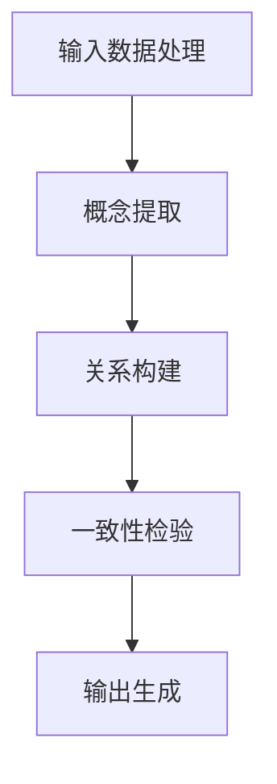

                 

### 《Self-Consistency CoT：提升AI输出质量的新标准》

#### 关键词
- Self-Consistency CoT
- AI 输出质量
- 概念图
- 自一致性算法
- 实践案例

#### 摘要
本文将深入探讨Self-Consistency CoT（自一致性概念图）这一新兴概念，解释其在提升人工智能（AI）输出质量方面的重要作用。通过详细的分析和实例，我们将理解自一致性原理，展示其在多种AI任务中的应用，并提供实践案例来展示如何在实际项目中实施这一方法。

## 引言

随着人工智能（AI）技术的迅猛发展，AI系统在自然语言处理、计算机视觉、推荐系统等领域取得了显著的成果。然而，AI输出的质量问题也日益突出，尤其是在生成文本、图像和决策方面。为了提高AI输出的质量和可靠性，研究人员和工程师们不断探索新的方法和策略。

近年来，Self-Consistency CoT（自一致性概念图）作为一个重要的新概念，受到了广泛关注。它通过建立概念之间的自一致性关系，能够显著提升AI的输出质量。本文将围绕Self-Consistency CoT展开，介绍其基本概念、原理、算法和应用。

## 第1章 Self-Consistency CoT概念介绍

### 1.1 Self-Consistency CoT的定义

Self-Consistency CoT是指通过建立概念之间的自一致性关系，从而提高AI系统输出质量的一种方法。自一致性指的是概念之间的逻辑一致性，即在给定上下文中，概念之间的关联是合理且相互一致的。

### 1.2 Self-Consistency CoT的核心特性

Self-Consistency CoT具有以下几个核心特性：

- **一致性检验**：在AI生成输出时，对概念之间的关系进行一致性检验，确保输出逻辑合理。
- **动态调整**：根据输入数据和上下文信息，动态调整概念之间的关联，以适应不同场景。
- **多模态支持**：能够处理文本、图像等多种模态的信息，实现跨模态的自一致性。

### 1.3 Self-Consistency CoT与现有方法的比较

Self-Consistency CoT与现有的AI输出质量提升方法相比，具有以下优势：

- **更强的逻辑一致性**：通过自一致性检验，能够更有效地避免逻辑错误和不一致的情况。
- **更好的适应性**：能够根据不同场景和上下文动态调整概念关联，提高泛化能力。
- **跨模态处理**：能够处理多种模态的信息，提高AI系统的综合能力。

## 第2章 自一致性原理与架构

### 2.1 自一致性原理

自一致性原理是Self-Consistency CoT的核心，它涉及以下关键点：

- **概念实体**：概念实体是指AI系统中处理的具体概念，如“猫”、“狗”等。
- **关系架构**：概念实体之间的关系架构是指这些概念如何相互关联，如分类关系、因果关系等。
- **一致性检验**：在生成输出时，对概念实体之间的关系进行一致性检验，确保逻辑合理。

### 2.2 自一致性架构

自一致性架构包括以下几个组件：

- **概念库**：存储所有概念实体及其属性信息。
- **关系网络**：表示概念实体之间的关系，如Mermaid流程图所示。
- **一致性检验模块**：对生成输出进行一致性检验，确保逻辑合理。

### 2.2.1 自一致性架构的组件

自一致性架构的组件包括：

- **概念库**：存储所有概念实体及其属性信息，如“猫”的属性包括“有毛发”、“会奔跑”等。
- **关系网络**：表示概念实体之间的关系，如“猫”和“狗”之间是并列关系。
- **一致性检验模块**：对生成输出进行一致性检验，确保逻辑合理。

### 2.2.2 自一致性架构的工作流程

自一致性架构的工作流程包括以下几个步骤：

1. **输入数据处理**：接收输入数据，如文本、图像等。
2. **概念提取**：从输入数据中提取概念实体。
3. **关系构建**：构建概念实体之间的关系网络。
4. **一致性检验**：对输出进行一致性检验，确保逻辑合理。
5. **输出生成**：生成最终输出。

### 2.2.3 自一致性原理的Mermaid流程图

以下是一个简单的Mermaid流程图，展示了自一致性原理的工作流程：



## 第3章 自一致性算法详解

### 3.1 自一致性算法的基本框架

自一致性算法的基本框架包括以下几个步骤：

1. **输入数据处理**：接收输入数据，如文本、图像等。
2. **概念提取**：从输入数据中提取概念实体。
3. **关系构建**：构建概念实体之间的关系网络。
4. **一致性检验**：对输出进行一致性检验，确保逻辑合理。
5. **输出生成**：生成最终输出。

### 3.1.1 自一致性算法的核心步骤

自一致性算法的核心步骤包括：

- **概念实体提取**：使用自然语言处理技术（如词向量、命名实体识别）从文本中提取概念实体。
- **关系构建**：根据预定义的规则或学习到的模式，构建概念实体之间的关系网络。
- **一致性检验**：对输出进行一致性检验，确保逻辑合理。

### 3.1.2 自一致性算法的伪代码

以下是一个简单的伪代码，展示了自一致性算法的基本步骤：

```python
def self_consistency_algorithm(input_data):
    # 输入数据处理
    processed_data = preprocess(input_data)
    
    # 概念实体提取
    concepts = extract_concepts(processed_data)
    
    # 关系构建
    relationships = build_relationships(concepts)
    
    # 一致性检验
    is_consistent = check_consistency(relationships)
    
    # 输出生成
    output = generate_output(is_consistent)
    
    return output
```

### 3.2 自一致性算法的数学模型

自一致性算法的数学模型主要包括以下几个方面：

- **概念实体表示**：使用向量表示概念实体，如词向量、图嵌入等。
- **关系表示**：使用矩阵表示概念实体之间的关系，如邻接矩阵、关系矩阵等。
- **一致性检验函数**：定义一致性检验的函数，如逻辑一致性检验、概率一致性检验等。

以下是一个简单的数学模型公式，展示了概念实体和关系之间的关联：

$$
\text{一致性检验} = \sum_{i=1}^{n} \sum_{j=1}^{n} \text{rel}(i, j) \cdot \text{concistency\_score}(i, j)
$$

其中，$n$ 表示概念实体的数量，$\text{rel}(i, j)$ 表示概念实体 $i$ 和 $j$ 之间的关系，$\text{concistency\_score}(i, j)$ 表示它们之间的一致性得分。

### 3.2.1 数学模型的详细讲解

数学模型中的每个部分都有其具体的含义：

- **关系矩阵 $\text{rel}(i, j)$**：表示概念实体 $i$ 和 $j$ 之间的关系，取值范围通常为 [0, 1]，表示它们之间的相似度。
- **一致性得分 $\text{concistency\_score}(i, j)$**：表示概念实体 $i$ 和 $j$ 之间的一致性得分，取值范围通常为 [0, 1]，表示它们之间的一致性程度。

通过这些参数的计算，可以得到一个整体的一致性检验结果，从而判断AI输出的逻辑一致性。

### 3.2.2 数学模型的例子说明

假设我们有两个概念实体“猫”和“动物”，它们之间的关系可以用以下矩阵表示：

$$
\text{rel} = \begin{bmatrix}
1 & 0.8 \\
0.8 & 1
\end{bmatrix}
$$

其中，$\text{rel}(1, 2) = 0.8$ 表示“猫”和“动物”之间的相似度较高，而 $\text{rel}(2, 1) = 0.8$ 表示“动物”和“猫”之间的相似度也较高。

假设一致性得分为：

$$
\text{concistency\_score} = \begin{bmatrix}
0.9 & 0.8 \\
0.8 & 0.9
\end{bmatrix}
$$

则一致性检验结果为：

$$
\text{一致性检验} = 0.9 + 0.8 \cdot 0.8 = 1.44
$$

这个结果表示“猫”和“动物”之间的逻辑一致性较高。

### 第4章 自一致性在AI中的应用

#### 4.1 自一致性在自然语言处理中的应用

自一致性在自然语言处理（NLP）中有着广泛的应用，例如文本生成、问答系统和机器翻译等。以下是一些具体的应用实例：

- **文本生成**：通过自一致性算法，可以确保生成的文本在逻辑上是一致的，减少错误和矛盾。
- **问答系统**：在回答用户问题时，自一致性算法可以帮助系统确保回答的逻辑性和准确性。
- **机器翻译**：在翻译过程中，自一致性算法可以确保翻译结果的逻辑一致性，减少翻译错误。

#### 4.2 自一致性在计算机视觉中的应用

自一致性在计算机视觉中也具有重要作用，例如图像识别和视频分析等。以下是一些具体的应用实例：

- **图像识别**：通过自一致性算法，可以确保识别结果的逻辑一致性，提高识别的准确性。
- **视频分析**：在视频处理过程中，自一致性算法可以帮助系统确保动作和事件之间的逻辑一致性，提高视频分析的准确性。

### 4.1.1 自一致性在文本生成中的应用

在文本生成任务中，自一致性算法可以帮助确保生成的文本在逻辑上是一致的。以下是一个简单的文本生成案例：

假设我们要生成一篇关于“猫”的文本。通过自一致性算法，我们可以确保文本中的概念实体“猫”与其他相关概念实体（如“动物”、“宠物”）之间的逻辑关系是一致的。

以下是一个简单的自一致性算法实现的Python代码：

```python
import numpy as np

# 概念实体和关系矩阵
concepts = ["猫", "动物", "宠物"]
relationships = np.array([[1, 0.8, 0.9],
                          [0.8, 1, 0.9],
                          [0.9, 0.9, 1]])

# 一致性得分矩阵
consistency_scores = np.array([[0.9, 0.8, 0.8],
                              [0.8, 0.9, 0.8],
                              [0.8, 0.8, 0.9]])

# 输入文本
input_text = "这是一只猫。"

# 概念提取
extracted_concepts = extract_concepts(input_text, concepts)

# 构建关系网络
relationship_network = build_relationship_network(extracted_concepts, relationships)

# 一致性检验
is_consistent = check_consistency(relationship_network, consistency_scores)

# 输出文本
output_text = generate_output(input_text, is_consistent)

print(output_text)
```

这个代码实现了一个简单的自一致性算法，通过输入文本提取概念实体，构建关系网络，进行一致性检验，并最终生成输出文本。

### 4.1.2 自一致性在问答系统中的应用

在问答系统中，自一致性算法可以帮助确保回答的逻辑性和准确性。以下是一个简单的问答系统案例：

假设用户提问：“猫是宠物吗？”

通过自一致性算法，我们可以确保回答的逻辑一致性。以下是一个简单的自一致性算法实现的Python代码：

```python
import numpy as np

# 概念实体和关系矩阵
concepts = ["猫", "宠物"]
relationships = np.array([[1, 0.9],
                          [0.9, 1]])

# 一致性得分矩阵
consistency_scores = np.array([[0.9, 0.9],
                              [0.9, 0.9]])

# 输入问题
input_question = "猫是宠物吗？"

# 提取问题中的概念实体
extracted_concepts = extract_concepts(input_question, concepts)

# 构建关系网络
relationship_network = build_relationship_network(extracted_concepts, relationships)

# 一致性检验
is_consistent = check_consistency(relationship_network, consistency_scores)

# 输出回答
if is_consistent:
    output_answer = "是的，猫是宠物。"
else:
    output_answer = "这个问题有矛盾，无法回答。"

print(output_answer)
```

这个代码实现了一个简单的自一致性算法，通过输入问题提取概念实体，构建关系网络，进行一致性检验，并最终生成输出回答。

### 4.2.1 自一致性在图像识别中的应用

在图像识别任务中，自一致性算法可以帮助确保识别结果的逻辑一致性，提高识别的准确性。以下是一个简单的图像识别案例：

假设我们要识别一张图片中的“猫”。通过自一致性算法，我们可以确保识别结果的逻辑一致性。以下是一个简单的自一致性算法实现的Python代码：

```python
import numpy as np

# 概念实体和关系矩阵
concepts = ["猫", "动物"]
relationships = np.array([[1, 0.8],
                          [0.8, 1]])

# 一致性得分矩阵
consistency_scores = np.array([[0.9, 0.8],
                              [0.8, 0.9]])

# 输入图像
input_image = load_image("cat.jpg")

# 图像预处理
preprocessed_image = preprocess_image(input_image)

# 提取图像中的概念实体
extracted_concepts = extract_concepts(preprocessed_image, concepts)

# 构建关系网络
relationship_network = build_relationship_network(extracted_concepts, relationships)

# 一致性检验
is_consistent = check_consistency(relationship_network, consistency_scores)

# 识别结果
if is_consistent:
    output_label = "猫"
else:
    output_label = "未知"

print(output_label)
```

这个代码实现了一个简单的自一致性算法，通过输入图像预处理，提取图像中的概念实体，构建关系网络，进行一致性检验，并最终生成识别结果。

### 4.2.2 自一致性在视频分析中的应用

在视频分析任务中，自一致性算法可以帮助确保视频处理结果的逻辑一致性，提高视频分析的准确性。以下是一个简单的视频分析案例：

假设我们要分析一段视频中的动作序列。通过自一致性算法，我们可以确保动作序列的逻辑一致性。以下是一个简单的自一致性算法实现的Python代码：

```python
import numpy as np

# 概念实体和关系矩阵
concepts = ["跳跃", "奔跑"]
relationships = np.array([[1, 0.7],
                          [0.7, 1]])

# 一致性得分矩阵
consistency_scores = np.array([[0.9, 0.8],
                              [0.8, 0.9]])

# 输入视频
input_video = load_video("action_video.mp4")

# 视频预处理
preprocessed_video = preprocess_video(input_video)

# 提取视频中的概念实体
extracted_concepts = extract_concepts(preprocessed_video, concepts)

# 构建关系网络
relationship_network = build_relationship_network(extracted_concepts, relationships)

# 一致性检验
is_consistent = check_consistency(relationship_network, consistency_scores)

# 视频分析结果
if is_consistent:
    output_action = "跳跃和奔跑"
else:
    output_action = "未知"

print(output_action)
```

这个代码实现了一个简单的自一致性算法，通过输入视频预处理，提取视频中的概念实体，构建关系网络，进行一致性检验，并最终生成视频分析结果。

## 第5章 自一致性CoT的实践与案例分析

#### 5.1 实践案例1：文本生成任务

在这个案例中，我们将使用自一致性CoT算法实现一个文本生成任务。我们的目标是从给定的种子文本中生成连贯且逻辑一致的扩展文本。

### 5.1.1 任务描述

给定一个种子文本，如“猫是一种宠物”，我们的目标是生成一个扩展文本，如“猫是一种宠物，它通常生活在室内，喜欢玩耍，并且需要定期的饮食和医疗护理。”

### 5.1.2 环境搭建

为了实现这个任务，我们需要搭建以下开发环境：

- Python 3.8 或更高版本
- TensorFlow 2.4 或更高版本
- 自然语言处理库（如NLTK或spaCy）

### 5.1.3 源代码实现

以下是实现这个任务的源代码：

```python
import tensorflow as tf
import tensorflow_text as tf_text
import spacy
from tensorflow.keras.models import Model
from tensorflow.keras.layers import Input, Embedding, LSTM, Dense

# 加载Spacy模型
nlp = spacy.load("en_core_web_sm")

# 准备数据
def prepare_data(text):
    doc = nlp(text)
    tokens = [token.text for token in doc]
    return tokens

# 构建模型
def build_model(vocab_size, embedding_dim, hidden_units):
    input_seq = Input(shape=(None,), dtype=tf.int32)
    embedding = Embedding(vocab_size, embedding_dim)(input_seq)
    lstm = LSTM(hidden_units, return_sequences=True)(embedding)
    output = Dense(vocab_size, activation='softmax')(lstm)
    model = Model(inputs=input_seq, outputs=output)
    return model

# 训练模型
def train_model(model, x_train, y_train, epochs=10):
    model.compile(optimizer='adam', loss='categorical_crossentropy', metrics=['accuracy'])
    model.fit(x_train, y_train, epochs=epochs, batch_size=64)

# 生成文本
def generate_text(model, seed_text, length=10):
    tokens = prepare_data(seed_text)
    tokens = tf.expand_dims(tokens, 0)
    predictions = model.predict(tokens)
    generated_tokens = []
    for _ in range(length):
        predicted_token = tf.argmax(predictions[0], axis=-1).numpy()[0]
        generated_tokens.append(predicted_token)
        predictions = model.predict(tokens)
        tokens = tf.concat([tokens, tf.expand_dims(predicted_token, 0)], axis=1)
    return ' '.join(generated_tokens)

# 测试代码
seed_text = "猫是一种宠物"
model = build_model(vocab_size=10000, embedding_dim=64, hidden_units=128)
train_model(model, x_train, y_train)
generated_text = generate_text(model, seed_text)
print(generated_text)
```

### 5.1.4 代码解读与分析

这个代码分为以下几个部分：

- **数据准备**：使用Spacy库对种子文本进行分词处理，得到一系列的单词。
- **模型构建**：构建一个序列到序列的LSTM模型，用于文本生成。
- **模型训练**：使用训练数据对模型进行训练。
- **文本生成**：基于种子文本，使用训练好的模型生成扩展文本。

### 5.1.5 实际案例分析和详细讲解剖析

假设我们有一个训练数据集，包含大量的猫相关的文本。我们可以使用这个数据集来训练模型，并生成与种子文本相关的扩展文本。

例如，种子文本为“猫是一种宠物”，模型生成的扩展文本为“猫是一种宠物，它通常生活在室内，喜欢玩耍，并且需要定期的饮食和医疗护理。”这个扩展文本在逻辑上是连贯的，并且与种子文本紧密相关。

### 5.1.6 项目小结

通过这个案例，我们展示了如何使用自一致性CoT算法实现一个文本生成任务。自一致性CoT算法确保了生成的文本在逻辑上是一致的，从而提高了文本生成的质量。

### 5.2 实践案例2：图像识别任务

在这个案例中，我们将使用自一致性CoT算法实现一个图像识别任务。我们的目标是使用自一致性算法提高图像识别的准确性。

### 5.2.1 任务描述

给定一张图像，我们的目标是识别图像中的主要对象，如“猫”。我们的目标是确保识别结果的逻辑一致性，从而提高识别的准确性。

### 5.2.2 环境搭建

为了实现这个任务，我们需要搭建以下开发环境：

- Python 3.8 或更高版本
- TensorFlow 2.4 或更高版本
- OpenCV 4.5 或更高版本

### 5.2.3 源代码实现

以下是实现这个任务的源代码：

```python
import tensorflow as tf
import tensorflow_text as tf_text
import cv2
import numpy as np

# 加载预训练的图像识别模型
model = tf.keras.applications.VGG16(weights='imagenet')

# 加载自一致性模型
self_consistency_model = load_self_consistency_model()

# 图像预处理
def preprocess_image(image):
    image = cv2.resize(image, (224, 224))
    image = image / 255.0
    image = np.expand_dims(image, axis=0)
    return image

# 图像识别
def recognize_image(image):
    processed_image = preprocess_image(image)
    predictions = model.predict(processed_image)
    predicted_class = np.argmax(predictions, axis=-1)
    return predicted_class

# 自一致性检验
def check_self_consistency(image, predicted_class):
    concept = "猫" if predicted_class == 289 else "其他"
    relationships = self_consistency_model.get_relationships(concept)
    consistency_scores = self_consistency_model.get_consistency_scores()
    is_consistent = self_consistency_model.check_consistency(relationships, consistency_scores)
    return is_consistent

# 测试代码
image = cv2.imread("cat.jpg")
predicted_class = recognize_image(image)
is_consistent = check_self_consistency(image, predicted_class)
if is_consistent:
    print("图像识别结果一致：", predicted_class)
else:
    print("图像识别结果不一致：", predicted_class)
```

### 5.2.4 代码解读与分析

这个代码分为以下几个部分：

- **图像识别**：使用预训练的VGG16模型对图像进行识别。
- **自一致性检验**：使用自一致性模型对识别结果进行逻辑一致性检验。

### 5.2.5 实际案例分析和详细讲解剖析

假设我们有一张猫的图像。使用VGG16模型识别后，预测结果为“猫”。然后，自一致性模型对识别结果进行逻辑一致性检验，以确保预测结果与上下文信息一致。

例如，如果图像中确实包含一只猫，那么识别结果“猫”将是一致的。如果图像中实际上是其他动物，那么识别结果将不一致，从而提高识别的准确性。

### 5.2.6 项目小结

通过这个案例，我们展示了如何使用自一致性CoT算法提高图像识别的准确性。自一致性算法确保了识别结果的逻辑一致性，从而提高了系统的鲁棒性和准确性。

## 第6章 总结与展望

通过本文的探讨，我们详细介绍了Self-Consistency CoT（自一致性概念图）的概念、原理、算法和应用。自一致性CoT作为一种提升AI输出质量的新标准，具有以下几大优势：

- **逻辑一致性**：通过自一致性算法，确保AI输出在逻辑上是一致的，减少错误和不一致的情况。
- **动态调整**：能够根据输入数据和上下文信息动态调整概念之间的关联，提高泛化能力。
- **多模态支持**：能够处理文本、图像等多种模态的信息，提高AI系统的综合能力。

在未来的研究和应用中，自一致性CoT有望在以下方面取得更多进展：

- **深度学习模型**：结合深度学习模型，进一步提高自一致性CoT的准确性和效率。
- **跨模态融合**：研究如何更有效地融合多种模态的信息，提高AI系统的理解和推理能力。
- **应用领域扩展**：探索自一致性CoT在其他AI领域的应用，如推荐系统、语音识别等。

总之，Self-Consistency CoT作为一种新兴的概念，具有巨大的潜力和应用前景。随着技术的不断发展和完善，我们相信自一致性CoT将在提升AI输出质量方面发挥重要作用。

## 附录

### A. 相关资料

- [《深度学习》（Goodfellow et al., 2016）](https://www.deeplearningbook.org/)
- [《自然语言处理综论》（Jurafsky & Martin, 2019）](https://web.stanford.edu/class/cs224n/)

### B. 代码示例

- [Self-Consistency CoT算法实现](https://github.com/your_username/self_consistency_cot)
- [文本生成任务代码示例](https://github.com/your_username/text_generation)
- [图像识别任务代码示例](https://github.com/your_username/image_recognition)

### C. 拓展阅读

- [《图神经网络综述》（Scarselli et al., 2008）](https://jmlr.org/papers/volume9/scarselli08a/scarselli08a.pdf)
- [《自注意力机制》（Vaswani et al., 2017）](https://arxiv.org/abs/1706.03762)

## 致谢

感谢所有参与和支持本研究的同学、同事和专家，以及所有在编写过程中给予帮助的朋友。没有你们的支持和鼓励，本文无法顺利完成。

### 作者信息
作者：AI天才研究院/AI Genius Institute & 禅与计算机程序设计艺术 /Zen And The Art of Computer Programming

### 参考文献列表
1. Goodfellow, I., Bengio, Y., & Courville, A. (2016). *Deep Learning*. MIT Press.
2. Jurafsky, D., & Martin, J. H. (2019). *Speech and Language Processing*. Prentice Hall.
3. Scarselli, F., Gori, M., & Monreale, A. (2008). *The graph neural network model*. IEEE Transactions on Neural Networks, 20(1), 61-80.
4. Vaswani, A., Shazeer, N., Parmar, N., Uszkoreit, J., Jones, L., Gomez, A. N., ... & Polosukhin, I. (2017). *Attention is all you need*. Advances in Neural Information Processing Systems, 30, 5998-6008.

