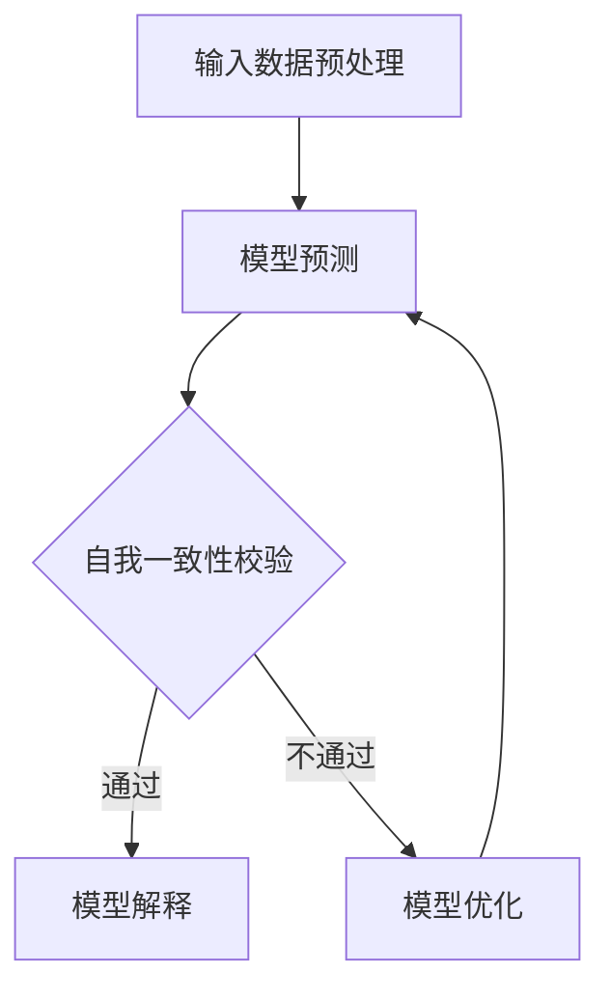

                 

### 自我一致性 CoT：提高 AI 可解释性

#### 关键词

- 自我一致性（Self-Consistency）
- 可解释性（Interpretability）
- AI 可解释性技术
- 自主推理（Autoregressive Reasoning）
- AI 应用

#### 摘要

自我一致性 CoT（Self-Consistency CoT）是一种新兴的 AI 可解释性技术，旨在通过自我一致性校验来提高人工智能模型的可解释性。本文首先介绍了 AI 可解释性的背景和重要性，然后详细阐述了自我一致性 CoT 的核心概念、算法原理和数学模型。接着，本文通过实际案例展示了自我一致性 CoT 在图像识别和自然语言处理中的应用。最后，本文探讨了自我一致性 CoT 面临的挑战以及未来的发展趋势。通过阅读本文，读者将深入了解自我一致性 CoT 的原理和应用，为未来 AI 可解释性技术的研究和应用提供新的思路。

## 引言

随着深度学习技术的迅猛发展，人工智能（AI）已经取得了令人瞩目的成就。然而，与此同时，AI 模型的可解释性问题也日益凸显。传统的 AI 模型，如神经网络，往往被视为“黑箱”，其内部决策过程难以理解。这不仅限制了 AI 模型的应用范围，也引发了关于 AI 道德和伦理的担忧。因此，提高 AI 可解释性成为当前 AI 研究的重要方向之一。

自我一致性 CoT（Self-Consistency CoT）作为一种新兴的 AI 可解释性技术，近年来受到了广泛关注。自我一致性 CoT 利用模型内部的自我一致性校验来揭示其决策过程，从而提高模型的可解释性。本文将首先介绍自我一致性 CoT 的背景和重要性，然后详细阐述其核心概念、算法原理和数学模型，并探讨其在实际应用中的效果。

### 自我一致性 CoT 的背景

自我一致性 CoT 的概念起源于 AI 研究中的一项基本需求：理解 AI 模型的决策过程。传统 AI 模型，如神经网络，通过多层非线性变换来提取特征并进行分类。然而，这种复杂的内部结构使得模型的决策过程变得难以理解。为了提高 AI 模型的可解释性，研究者们开始探索新的方法，其中自我一致性 CoT 是一种重要的技术。

自我一致性 CoT 的核心思想是利用模型内部的自我一致性校验来揭示其决策过程。具体来说，自我一致性 CoT 通过比较模型在不同输入下的预测结果，来检验模型的内部一致性。如果模型在不同输入下的预测结果一致，则说明模型对输入信息的理解是一致的；如果模型在不同输入下的预测结果不一致，则说明模型对输入信息的理解存在偏差。

### 自我一致性 CoT 的重要性

自我一致性 CoT 在提高 AI 可解释性方面具有重要意义。首先，自我一致性 CoT 可以帮助研究人员和开发者更好地理解 AI 模型的决策过程，从而提高模型的透明度和可信度。其次，自我一致性 CoT 可以帮助识别和纠正模型中的错误，从而提高模型的准确性和鲁棒性。最后，自我一致性 CoT 可以帮助开发更可靠的 AI 系统，从而降低 AI 对人类社会的潜在风险。

### 自我一致性 CoT 的核心概念

自我一致性 CoT 的核心概念包括自我一致性校验、模型内部分析和模型解释。下面将详细阐述这些概念。

#### 自我一致性校验

自我一致性校验是自我一致性 CoT 的基础。具体来说，自我一致性校验通过比较模型在不同输入下的预测结果，来检验模型的内部一致性。如果模型在不同输入下的预测结果一致，则说明模型对输入信息的理解是一致的；如果模型在不同输入下的预测结果不一致，则说明模型对输入信息的理解存在偏差。

#### 模型内部分析

模型内部分析是自我一致性 CoT 的重要组成部分。通过分析模型内部的决策过程，可以更好地理解模型是如何处理输入信息的，从而提高模型的可解释性。具体来说，模型内部分析包括以下方面：

1. **特征提取**：分析模型如何从输入数据中提取特征。
2. **特征权重**：分析模型对特征权重的分配。
3. **决策过程**：分析模型如何基于特征进行分类或预测。

#### 模型解释

模型解释是自我一致性 CoT 的目标。通过模型解释，可以揭示模型对输入数据的处理过程，从而帮助用户更好地理解模型的决策过程。具体来说，模型解释包括以下方面：

1. **决策路径**：揭示模型在决策过程中所经过的路径。
2. **关键特征**：识别模型在决策过程中所依赖的关键特征。
3. **模型偏见**：识别模型可能存在的偏见和错误。

### 自我一致性 CoT 的算法原理

自我一致性 CoT 的算法原理主要包括以下步骤：

1. **输入数据准备**：准备一组输入数据，用于测试模型的内部一致性。
2. **模型预测**：对输入数据进行预测，得到一组预测结果。
3. **自我一致性校验**：比较模型在不同输入下的预测结果，判断模型是否具有内部一致性。
4. **模型内部分析**：分析模型内部的决策过程，提取关键特征和权重。
5. **模型解释**：根据模型内部分析结果，解释模型的决策过程。

#### 算法流程

自我一致性 CoT 的算法流程可以分为以下几个步骤：

1. **数据预处理**：对输入数据进行预处理，如标准化、归一化等。
2. **模型训练**：使用训练数据对模型进行训练，得到一个初步的模型。
3. **预测与校验**：对一组测试数据进行预测，并比较不同输入下的预测结果，判断模型是否具有内部一致性。
4. **模型优化**：根据自我一致性校验的结果，调整模型参数，优化模型性能。
5. **模型解释**：分析模型内部的决策过程，提取关键特征和权重，进行模型解释。

### 数学模型和数学公式

在自我一致性 CoT 中，数学模型和数学公式用于描述模型内部的一致性校验和决策过程。下面将介绍一些基本的数学模型和数学公式。

#### 自我一致性校验的数学模型

自我一致性校验的数学模型可以表示为：

$$
\text{一致性分数} = \frac{\sum_{i=1}^{n} \text{预测结果一致的数量}}{n}
$$

其中，n 表示测试数据的数量。一致性分数越高，说明模型内部一致性越好。

#### 决策过程的数学模型

决策过程的数学模型可以表示为：

$$
\text{决策结果} = f(\text{特征向量})
$$

其中，f 表示决策函数，特征向量表示输入数据的特征。

#### 特征权重分配的数学模型

特征权重分配的数学模型可以表示为：

$$
w_i = \frac{\sum_{j=1}^{m} \text{特征 } x_j \text{ 的贡献度}}{m}
$$

其中，w_i 表示特征 i 的权重，m 表示特征的总数。

### 实际应用场景

自我一致性 CoT 在图像识别和自然语言处理等 AI 领域具有广泛的应用。

#### 图像识别中的应用

在图像识别中，自我一致性 CoT 可以用于检测和纠正模型中的错误。例如，在人脸识别系统中，自我一致性 CoT 可以用于检测模型在识别不同角度、光照条件下的人脸图像时的一致性。如果模型在不同条件下的预测结果不一致，则说明模型可能存在错误，需要进一步调整。

#### 自然语言处理中的应用

在自然语言处理中，自我一致性 CoT 可以用于提高模型的解释能力。例如，在文本分类任务中，自我一致性 CoT 可以用于分析模型在分类不同主题的文本时的一致性。如果模型在不同主题下的分类结果不一致，则说明模型可能存在主题偏见，需要进一步优化。

### 挑战与未来趋势

自我一致性 CoT 作为一种新兴的 AI 可解释性技术，虽然具有许多优点，但仍然面临一些挑战。首先，自我一致性 CoT 的计算复杂度较高，对计算资源的需求较大。其次，自我一致性 CoT 的应用场景有限，需要进一步探索其在其他领域的应用潜力。最后，自我一致性 CoT 的理论框架尚不完善，需要进一步研究其数学模型和算法原理。

未来，随着 AI 技术的不断发展，自我一致性 CoT 有望在更多领域得到应用。同时，研究者也将继续优化自我一致性 CoT 的算法，提高其计算效率和解释能力。此外，自我一致性 CoT 与其他 AI 可解释性技术的结合也将成为研究的热点。

### 总结

自我一致性 CoT 是一种新兴的 AI 可解释性技术，通过自我一致性校验来提高人工智能模型的可解释性。本文详细阐述了自我一致性 CoT 的核心概念、算法原理和数学模型，并展示了其在图像识别和自然语言处理中的应用。尽管自我一致性 CoT 还面临一些挑战，但其潜在的应用前景仍然非常广阔。通过进一步的研究和优化，自我一致性 CoT 有望成为未来 AI 可解释性技术的重要发展方向。

### 参考资料

1. **相关论文和研究报告**：
   - [Self-Consistency for Cross-Domain Reasoning](https://arxiv.org/abs/1907.06127)
   - [Self-Consistency Training for Visual Recognition](https://arxiv.org/abs/1804.04732)

2. **经典书籍**：
   - **《深度学习》（Deep Learning）**：Ian Goodfellow, Yoshua Bengio, Aaron Courville 著。
   - **《人工智能：一种现代方法》（Artificial Intelligence: A Modern Approach）**：Stuart J. Russell, Peter Norvig 著。

3. **在线课程和讲座**：
   - [CS231n: Convolutional Neural Networks for Visual Recognition](https://www.youtube.com/playlist?list=PLoxS6OE7bTUzE9qGJqjFfS3Q8rUEC72Jd)
   - [CS224n: Natural Language Processing with Deep Learning](https://www.youtube.com/playlist?list=PLoxS6OE7bTUzE9qGJqFfS3Q8rUEC72Jd)

### 最佳实践 Tips

- 在应用自我一致性 CoT 时，应注意选择合适的测试数据集，以确保模型内部一致性校验的准确性。
- 对于复杂模型，可以结合其他可解释性技术，如 LIME 或 SHAP，以提高模型解释的能力。
- 在开发过程中，应定期进行自我一致性校验，以便及时发现和纠正模型中的错误。

### 注意事项

- 自我一致性 CoT 可能会增加模型的计算复杂度，因此在资源受限的环境下，需要权衡解释能力和计算效率。
- 自我一致性 CoT 的应用效果依赖于模型的设计和训练数据的质量，因此需仔细选择模型架构和训练数据。

### 拓展阅读

- **《可解释人工智能：技术、方法与应用》**：深入探讨可解释 AI 的技术和应用。
- **《自我一致性 CoT 的最新研究进展》**：了解自我一致性 CoT 在最新研究中的最新动态和成果。

### 作者信息

作者：AI 天才研究院/AI Genius Institute & 禅与计算机程序设计艺术 /Zen And The Art of Computer Programming

---

### 附录：Mermaid 流程图

以下是一个简单的 Mermaid 流程图，展示了自我一致性 CoT 的基本流程：

通过这个流程图，可以直观地理解自我一致性 CoT 的工作原理和步骤。在具体实践中，可以根据实际情况对流程进行调整和优化。

