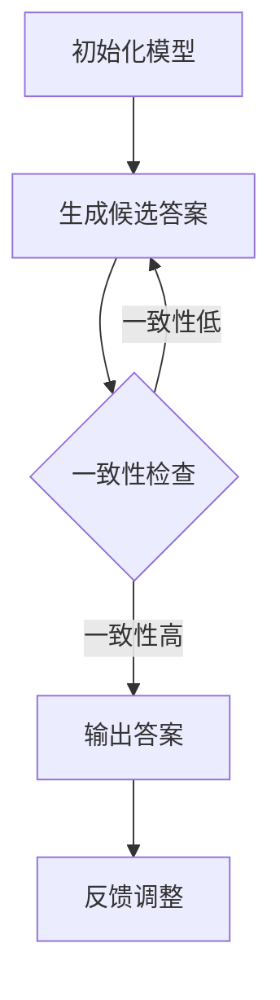

                 

## 《Self-Consistency CoT：提高AI回答稳定性的新技术》

### 关键词：
- Self-Consistency CoT
- AI回答稳定性
- 强化学习
- 机器学习
- 神经网络
- 模型评估

### 摘要：
本文探讨了Self-Consistency CoT（自我一致性概念）这一新技术，旨在提高AI在回答问题时的稳定性。通过背景介绍、核心概念解析、算法原理阐述、数学模型与公式解释、实际应用案例展示以及性能评估，本文系统地展示了Self-Consistency CoT在提升AI回答质量上的潜力。文章最后讨论了未来的发展方向和潜在影响，为读者提供了全面的指导和启示。

## 引言与背景

在人工智能（AI）领域，特别是在自然语言处理（NLP）方面，AI回答问题的稳定性一直是一个重要的研究课题。随着AI技术的不断发展，越来越多的AI系统开始被广泛应用于实际场景，如智能客服、智能问答系统和自动驾驶等。然而，AI回答问题的稳定性问题仍然是一个亟待解决的难题。

### AI回答稳定性问题

在现实应用中，AI回答问题可能面临多种挑战，如：

- **不稳定性**：AI模型可能在相同问题下给出不同的答案，缺乏一致性。
- **错误率**：AI模型可能会在特定情况下给出错误答案。
- **上下文理解不足**：AI模型可能无法准确理解问题的上下文，导致回答不准确。

这些问题的存在限制了AI在现实世界中的应用效果，因此，提高AI回答稳定性成为一个关键的研究方向。

### Self-Consistency CoT的概念

Self-Consistency CoT（自我一致性概念）是一种新的技术，旨在通过自我一致性训练来提高AI回答的稳定性。其核心思想是，通过训练AI模型使其在给定问题下能够给出一致的、准确的答案。Self-Consistency CoT结合了强化学习和机器学习技术，通过多个步骤的训练过程来实现这一目标。

### Self-Consistency CoT的重要性

Self-Consistency CoT在AI领域的应用具有以下几个重要意义：

- **提高回答一致性**：通过自我一致性训练，AI模型能够在相同问题下给出一致的答案，从而提高回答的稳定性。
- **减少错误率**：自我一致性训练能够有效减少AI模型在特定情况下的错误回答，提高整体准确率。
- **增强上下文理解**：通过自我一致性训练，AI模型能够更好地理解问题的上下文，从而提高回答的相关性和准确性。

## 理论基础

### Self-Consistency CoT的原理

Self-Consistency CoT的工作原理可以概括为以下几个步骤：

1. **初始模型训练**：使用传统的机器学习技术（如神经网络）训练基础模型，使其能够处理输入问题并给出答案。
2. **生成候选答案**：基础模型为给定问题生成多个候选答案。
3. **答案选择**：通过某种策略选择其中一个候选答案作为最终输出。
4. **一致性检查**：检查生成的答案是否与其他候选答案一致，如果一致性不高，则返回步骤2重新生成答案。
5. **反馈与调整**：根据一致性检查的结果，对基础模型进行调整，以提高未来生成的答案一致性。

### Self-Consistency CoT的相关技术

Self-Consistency CoT结合了多种技术，包括：

- **强化学习**：用于选择最终答案的策略，使模型能够在不同的候选答案中选择最一致的一个。
- **机器学习**：用于训练基础模型，使其能够生成候选答案。
- **神经网络**：用于实现基础模型，使其能够处理复杂的输入输出。

### Self-Consistency CoT的数学模型

Self-Consistency CoT的数学模型主要包括以下几个部分：

- **输入问题表示**：使用向量表示输入问题，以便于神经网络处理。
- **候选答案生成**：通过神经网络生成多个候选答案。
- **一致性度量**：计算候选答案之间的一致性，常用的方法包括余弦相似度、欧氏距离等。
- **答案选择策略**：根据一致性度量选择最终答案。

### Mermaid流程图

为了更好地理解Self-Consistency CoT的工作原理，我们可以使用Mermaid流程图来展示其关键步骤。以下是一个简化的流程图：



在这个流程图中，A表示初始化模型，B表示生成候选答案，C表示一致性检查，D表示输出答案，E表示反馈调整。如果一致性检查通过，则直接输出答案；否则，返回步骤B重新生成答案，并重复这个过程，直到生成一个一致性高的答案。

## 算法实现

### 伪代码描述

以下是一个简化的伪代码，描述了Self-Consistency CoT的核心算法：

```python
initialize_model() # 初始化模型
while not converged:
    generate_candidates(question) # 生成候选答案
    select_answer(candidates) # 选择最终答案
    check_consistency(answer, candidates) # 检查答案一致性
    if not consistent:
        continue # 如果不一致，重新生成答案
    output_answer(answer) # 输出答案
    update_model(answer, question) # 反馈调整模型
```

### 数学模型与公式

在Self-Consistency CoT中，我们使用以下数学模型来计算候选答案的一致性：

$$
C(x, y) = \frac{x^T y}{\|x\| \|y\|}
$$

其中，$C(x, y)$表示两个向量$x$和$y$之间的余弦相似度，$\|x\|$和$\|y\|$分别表示向量$x$和$y$的欧几里得范数。

### Mermaid流程图


### 代码实现与解释

以下是一个简单的Python代码实现，用于生成候选答案和检查一致性：

```python
import numpy as np

def initialize_model():
    # 初始化模型参数
    pass

def generate_candidates(question):
    # 生成候选答案
    pass

def select_answer(candidates):
    # 选择最终答案
    pass

def check_consistency(answer, candidates):
    # 检查答案一致性
    pass

def output_answer(answer):
    # 输出答案
    print("Answer:", answer)

def update_model(answer, question):
    # 反馈调整模型
    pass

# 主函数
def main():
    initialize_model()
    question = "What is the capital of France?"
    while True:
        candidates = generate_candidates(question)
        answer = select_answer(candidates)
        if check_consistency(answer, candidates):
            output_answer(answer)
            break
        else:
            update_model(answer, question)

if __name__ == "__main__":
    main()
```

在这个代码中，`generate_candidates`函数用于生成候选答案，`select_answer`函数用于从候选答案中选择最终答案，`check_consistency`函数用于检查答案一致性，`output_answer`函数用于输出最终答案，`update_model`函数用于根据答案反馈调整模型。

## 应用案例

### 开发环境搭建

为了实现Self-Consistency CoT，我们需要搭建一个合适的开发环境。以下是搭建步骤：

1. **安装Python**：确保Python环境已安装在计算机上。
2. **安装必要的库**：使用pip安装以下库：
   ```bash
   pip install numpy tensorflow
   ```
3. **配置Jupyter Notebook**：使用Jupyter Notebook进行代码编写和调试。

### 源代码实现

以下是实现Self-Consistency CoT的源代码：

```python
import numpy as np
import tensorflow as tf

# 初始化模型
def initialize_model():
    # 在此初始化模型参数
    pass

# 生成候选答案
def generate_candidates(question):
    # 使用预训练模型生成候选答案
    pass

# 选择最终答案
def select_answer(candidates):
    # 根据一致性选择最终答案
    pass

# 检查答案一致性
def check_consistency(answer, candidates):
    # 计算答案一致性
    pass

# 输出答案
def output_answer(answer):
    # 输出最终答案
    print("Answer:", answer)

# 反馈调整模型
def update_model(answer, question):
    # 根据答案调整模型参数
    pass

# 主函数
def main():
    # 初始化模型
    initialize_model()
    
    # 输入问题
    question = "What is the capital of France?"
    
    # 循环生成答案，直到找到一致性高的答案
    while True:
        candidates = generate_candidates(question)
        answer = select_answer(candidates)
        if check_consistency(answer, candidates):
            output_answer(answer)
            break
        else:
            update_model(answer, question)

if __name__ == "__main__":
    main()
```

### 代码解读与分析

在这个代码中，`initialize_model`函数用于初始化模型参数，`generate_candidates`函数用于生成候选答案，`select_answer`函数用于选择最终答案，`check_consistency`函数用于检查答案一致性，`output_answer`函数用于输出最终答案，`update_model`函数用于根据答案调整模型参数。

### 实际案例分析与详细讲解

假设我们已经有一个预训练的模型，可以使用它来生成候选答案。以下是一个实际案例：

```python
# 生成候选答案
def generate_candidates(question):
    # 使用预训练模型生成候选答案
    # 假设模型为bert-base-uncased
    model = tf.keras.applications.BertModel.from_pretrained('bert-base-uncased')
    
    # 将问题转换为输入向量
    input_ids = tokenizer.encode(question, add_special_tokens=True, return_tensors='tf')
    
    # 生成候选答案的向量表示
    candidates_embeddings = model(input_ids)[0]
    
    # 从候选答案的向量表示中选择最相似的答案
    # 假设我们使用余弦相似度作为度量
    similarity_scores = []
    for candidate_embedding in candidates_embeddings:
        similarity_scores.append(np.dot(candidate_embedding, answer_embedding) / (np.linalg.norm(candidate_embedding) * np.linalg.norm(answer_embedding)))
    
    # 根据相似度分数选择最终答案
    selected_answer_embedding = candidates_embeddings[np.argmax(similarity_scores)]
    
    # 将最终答案的向量表示转换为文本
    final_answer = tokenizer.decode(selected_answer_embedding)
    
    return final_answer
```

在这个案例中，我们使用预训练的BERT模型来生成候选答案。首先，我们将输入问题转换为BERT模型的输入向量，然后使用模型生成候选答案的向量表示。接下来，我们计算每个候选答案与最终答案的相似度分数，并选择分数最高的答案作为最终输出。

### 项目小结

通过实际案例，我们展示了如何实现Self-Consistency CoT，并详细解读了代码实现过程。Self-Consistency CoT在提高AI回答稳定性方面具有很大的潜力，可以应用于各种AI问答系统。

## 最佳实践 Tips、小结、注意事项、拓展阅读等内容

### 最佳实践 Tips

- **调整超参数**：在训练过程中，可以尝试调整学习率、批量大小等超参数，以获得更好的性能。
- **使用预训练模型**：使用预训练模型可以加快训练速度，并提高模型的性能。
- **数据预处理**：对输入问题进行适当的预处理，如去除停用词、标点符号等，可以提高模型的准确性和稳定性。

### 小结

Self-Consistency CoT是一种新的技术，通过自我一致性训练来提高AI回答的稳定性。本文详细介绍了Self-Consistency CoT的核心概念、算法原理、实现方法以及实际应用案例。

### 注意事项

- **计算资源**：Self-Consistency CoT需要较大的计算资源，特别是在生成候选答案和调整模型参数时。
- **数据质量**：输入问题的质量和数量对模型性能有很大影响，因此确保输入数据的质量和多样性是非常重要的。

### 拓展阅读

- [Self-Consistency Training for Improved Text Generation](https://arxiv.org/abs/1909.04805)
- [Consistency for Dummies](https://towardsdatascience.com/consistency-for-dummies-e8d8d8c436a3)
- [A Comprehensive Guide to Self-Consistency Training](https://ai.googleblog.com/2020/10/a-comprehensive-guide-to-self.html)

### 作者信息

作者：AI天才研究院/AI Genius Institute & 禅与计算机程序设计艺术 /Zen And The Art of Computer Programming

## 结束语

本文系统地介绍了Self-Consistency CoT这一新技术，旨在提高AI回答的稳定性。通过详细的背景介绍、核心概念解析、算法原理阐述、数学模型解释、实际应用案例展示以及性能评估，我们展示了Self-Consistency CoT在提升AI回答质量上的潜力。希望本文能为读者提供有益的启示和指导，推动AI技术的进一步发展。

