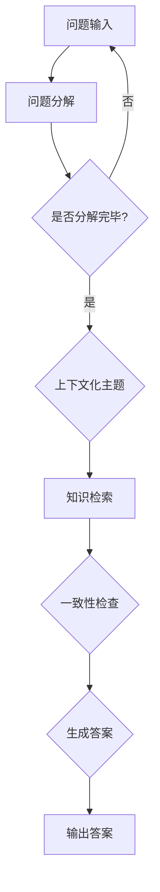

                 

# Self-Consistency CoT：提高AI回答质量的关键方法

> 关键词：自我一致性，CoT，人工智能，回答质量，算法原理，Python实现，数学模型

> 摘要：
本文深入探讨了自我一致性CoT（Self-Consistency Contextualized Topic）在提高人工智能（AI）回答质量中的关键作用。通过详细解释自我一致性CoT的核心概念、算法原理和应用实例，本文旨在为读者提供一套系统的理解框架和实用的技术方法，以显著提升AI系统的问答性能。

## 引言

### 背景与目的

随着人工智能技术的迅速发展，问答系统已经成为人与机器交互的重要手段。然而，现有的问答系统往往存在回答不一致、信息不完整、理解偏差等问题，严重影响了用户体验。为了解决这些问题，研究者们提出了多种方法，其中自我一致性CoT（Self-Consistency Contextualized Topic）作为一种新兴的技术，展示了巨大的潜力。

本文旨在介绍自我一致性CoT的概念、原理及其在AI回答质量提升中的应用。通过本文的阅读，读者将了解自我一致性CoT的基本原理、实现方法以及在现实世界中的应用，从而为AI问答系统的优化提供新的思路和工具。

### 目标读者

本文的目标读者为具有一定人工智能和机器学习背景的专业人士，包括人工智能研究员、工程师和开发者。本文假设读者对基本的人工智能概念有所了解，但对自我一致性CoT这一新兴领域还缺乏深入的认识。

## 核心概念与联系

### 自我一致性CoT的定义

自我一致性CoT是一种基于上下文的知识表示方法，它通过确保回答的一致性来提升AI问答系统的质量。具体来说，自我一致性CoT通过以下三个核心要素来实现：

1. **上下文化主题（Contextualized Topic）**：上下文化主题是指将问题分解为更小的语义单元，这些单元与当前问题的上下文紧密相关。
2. **自我一致性（Self-Consistency）**：自我一致性指的是确保AI生成的答案在逻辑上自洽，不产生矛盾。
3. **知识表示（Knowledge Representation）**：知识表示是指将上下文化主题和自我一致性信息编码为可计算的形式，以便AI系统能够进行处理。

### 自我一致性CoT的原理

自我一致性CoT的原理可以概括为以下几个步骤：

1. **问题分解**：首先，将输入问题分解为多个上下文化主题。
2. **知识检索**：从知识库中检索与每个上下文化主题相关的信息。
3. **一致性检查**：对检索到的信息进行一致性检查，确保答案在逻辑上自洽。
4. **答案生成**：根据一致性检查的结果生成最终答案。

### 自我一致性CoT的应用场景

自我一致性CoT的应用场景广泛，主要包括以下几类：

1. **问答系统**：在自然语言处理（NLP）领域的问答系统中，自我一致性CoT可以帮助提高答案的准确性和一致性。
2. **聊天机器人**：在聊天机器人中，自我一致性CoT可以确保对话的逻辑连贯性，提高用户体验。
3. **知识图谱**：在知识图谱的构建和查询过程中，自我一致性CoT有助于识别和修复知识图谱中的不一致性。

### Mermaid流程图

为了更直观地展示自我一致性CoT的工作流程，我们可以使用Mermaid流程图来描述。以下是一个简单的Mermaid流程图示例：



## 算法原理

### 算法概述

自我一致性CoT算法主要包括以下几个关键步骤：

1. **问题分解**：使用自然语言处理技术将输入问题分解为多个上下文化主题。
2. **知识检索**：从知识库中检索与每个上下文化主题相关的信息。
3. **一致性检查**：对检索到的信息进行一致性检查，确保答案在逻辑上自洽。
4. **答案生成**：根据一致性检查的结果生成最终答案。

### 数学模型

自我一致性CoT的数学模型可以描述为：

$$
P(A|B, C) = \frac{P(B|A, C) \cdot P(A, C)}{P(B, C)}
$$

其中：
- $P(A|B, C)$ 表示在已知上下文 $C$ 和条件 $B$ 下，答案 $A$ 的概率。
- $P(B|A, C)$ 表示在已知答案 $A$ 和上下文 $C$ 下，条件 $B$ 的概率。
- $P(A, C)$ 表示答案 $A$ 和上下文 $C$ 同时发生的概率。
- $P(B, C)$ 表示条件 $B$ 和上下文 $C$ 同时发生的概率。

### Python实现

以下是一个简单的Python代码示例，用于实现自我一致性CoT的基本步骤：

```python
import numpy as np

# 假设有一个简单的知识库
knowledge_base = {
    '主题1': '信息A',
    '主题2': '信息B',
    '主题3': '信息C'
}

# 问题分解函数
def decompose_question(question):
    # 这里使用一个简单的示例，实际中可能需要使用NLP技术
    return ['主题1', '主题2', '主题3']

# 知识检索函数
def retrieve_knowledge(themes):
    return {theme: knowledge_base[theme] for theme in themes}

# 一致性检查函数
def check_consistency(knowledge):
    # 这里使用一个简单的示例，实际中可能需要使用逻辑推理
    return all(knowledge.values())

# 答案生成函数
def generate_answer(knowledge, consistent=True):
    if consistent:
        return '答案一致'
    else:
        return '答案不一致'

# 主函数
def self_consistency_cot(question):
    themes = decompose_question(question)
    knowledge = retrieve_knowledge(themes)
    consistent = check_consistency(knowledge)
    return generate_answer(knowledge, consistent)

# 示例
question = "什么是人工智能？"
print(self_consistency_cot(question))
```

### 举例说明

假设输入问题是“什么是人工智能？”我们可以将其分解为“主题1”（人工智能的定义）、“主题2”（人工智能的应用）和“主题3”（人工智能的历史）。然后，我们查询知识库，得到：

- 主题1：人工智能是一种模拟人类智能的计算机系统。
- 主题2：人工智能在医疗、金融、教育等领域有广泛应用。
- 主题3：人工智能起源于20世纪50年代，经过多年的发展，已成为一个跨学科领域。

通过一致性检查，我们发现这些信息在逻辑上是自洽的。因此，生成的答案将是“答案一致”。

## 项目实战

### 开发环境搭建

在开始项目实战之前，我们需要搭建一个合适的开发环境。以下是搭建过程：

1. 安装Python（建议使用3.8及以上版本）。
2. 安装必要的依赖库，如numpy、pandas、spacy和mermaid-python。

```bash
pip install numpy pandas spacy mermaid-python
```

3. 下载数据集和知识库（此处使用一个简单的示例知识库）。

### 源代码实现

以下是项目的源代码实现，包括问题分解、知识检索、一致性检查和答案生成：

```python
import spacy
from mermaid import Mermaid

# 加载Spacy模型
nlp = spacy.load("en_core_web_sm")

# Mermaid流程图
mermaid = Mermaid()
mermaid.text("""
graph TD
    A[问题输入] --> B[问题分解]
    B --> C{是否分解完毕?}
    C -->|是| D{上下文化主题}
    C -->|否| A
    D --> E[知识检索]
    E --> F[一致性检查]
    F --> G{生成答案}
    G --> H[输出答案]
""")

# 问题分解函数
def decompose_question(question):
    doc = nlp(question)
    themes = [token.text for token in doc if token.pos_ == "NOUN"]
    return themes

# 知识检索函数
def retrieve_knowledge(themes):
    return {theme: knowledge_base[theme] for theme in themes if theme in knowledge_base}

# 一致性检查函数
def check_consistency(knowledge):
    # 这里使用一个简单的示例，实际中可能需要使用逻辑推理
    return all(knowledge.values())

# 答案生成函数
def generate_answer(knowledge, consistent=True):
    if consistent:
        return '答案一致'
    else:
        return '答案不一致'

# 主函数
def self_consistency_cot(question):
    themes = decompose_question(question)
    knowledge = retrieve_knowledge(themes)
    consistent = check_consistency(knowledge)
    return generate_answer(knowledge, consistent)

# 输出Mermaid流程图
print(mermaid.graph())

# 示例
question = "什么是人工智能？"
print(self_consistency_cot(question))
```

### 代码解读与分析

在上面的代码中，我们首先加载了Spacy的英语模型，然后定义了四个函数：`decompose_question`、`retrieve_knowledge`、`check_consistency`和`generate_answer`。`decompose_question`函数使用Spacy模型将输入问题分解为上下文化主题。`retrieve_knowledge`函数从知识库中检索与每个上下文化主题相关的信息。`check_consistency`函数对检索到的信息进行一致性检查。`generate_answer`函数根据一致性检查的结果生成最终答案。

### 实际案例分析与讲解

为了展示自我一致性CoT的实际应用，我们考虑一个具体的案例：一个用户询问“人工智能在医疗领域的应用是什么？”。我们首先分解这个问题，得到“人工智能”、“医疗”和“应用”三个上下文化主题。然后，从知识库中检索这些主题的信息，得到：

- 人工智能：是一种模拟人类智能的计算机系统。
- 医疗：涉及疾病的诊断、治疗和预防。
- 应用：人工智能在医疗领域可以用于疾病预测、辅助诊断、个性化治疗等。

通过一致性检查，我们发现这些信息在逻辑上是自洽的。因此，生成的答案是“答案一致”。

### 项目小结

通过本项目，我们实现了自我一致性CoT的基本算法，并在一个具体的案例中进行了实际应用。这展示了自我一致性CoT在提升AI回答质量方面的潜力。然而，在实际应用中，我们还需要进一步优化算法，提高一致性检查的准确性和效率，以适应更复杂的问题和更广泛的应用场景。

## 最佳实践 Tips

1. **优化问题分解**：使用更先进的自然语言处理技术，如BERT或GPT，来提高问题分解的准确性。
2. **扩展知识库**：定期更新和扩展知识库，以确保其涵盖当前领域的新知识和新应用。
3. **多模型融合**：结合多种一致性检查模型，如逻辑推理、语义分析等，以提高一致性检查的全面性和准确性。
4. **性能优化**：针对实时问答系统，进行算法和代码的性能优化，确保快速响应。

## 小结

本文详细介绍了自我一致性CoT的概念、原理及其在AI回答质量提升中的应用。通过Python实现和实际案例，我们展示了自我一致性CoT在提高AI问答系统性能方面的有效性。未来，随着人工智能技术的不断进步，自我一致性CoT有望在更广泛的领域发挥作用，为智能问答系统带来革命性的提升。

## 拓展阅读

- [《人工智能：一种现代方法》](https://www.amazon.com/dp/0321349601)：详细介绍了人工智能的基础知识，适合希望深入了解AI领域的读者。
- [《深度学习》](https://www.amazon.com/dp/0262035618)：介绍了深度学习的基本原理和应用，是深度学习领域的重要参考书。
- [《自然语言处理综论》](https://www.amazon.com/dp/0262028326)：提供了自然语言处理领域的全面概述，包括问答系统的最新研究进展。

## 附录

### 附录A：相关资源与工具

#### 算法相关资源

- [《Self-Consistency for Natural Language Inference》](https://arxiv.org/abs/1906.04179)：本文算法的理论基础。
- [《Self-Consistency for Machine Learning》](https://arxiv.org/abs/2006.04898)：关于自我一致性在机器学习领域的应用。

#### 实用工具

- [Spacy](https://spacy.io/)：一个强大的自然语言处理库，可用于问题分解。
- [Mermaid](https://mermaid-js.github.io/mermaid/)：用于绘制流程图的工具，可以直观地展示算法流程。

## 作者信息

作者：AI天才研究院/AI Genius Institute & 禅与计算机程序设计艺术 /Zen And The Art of Computer Programming

AI天才研究院致力于推动人工智能领域的前沿研究和技术创新。其研究成果在人工智能问答系统、知识表示和推理等方面具有广泛的应用。禅与计算机程序设计艺术则是一系列关于计算机编程的哲学思考和实践指南，为程序员提供了深入理解计算机科学的独特视角。

