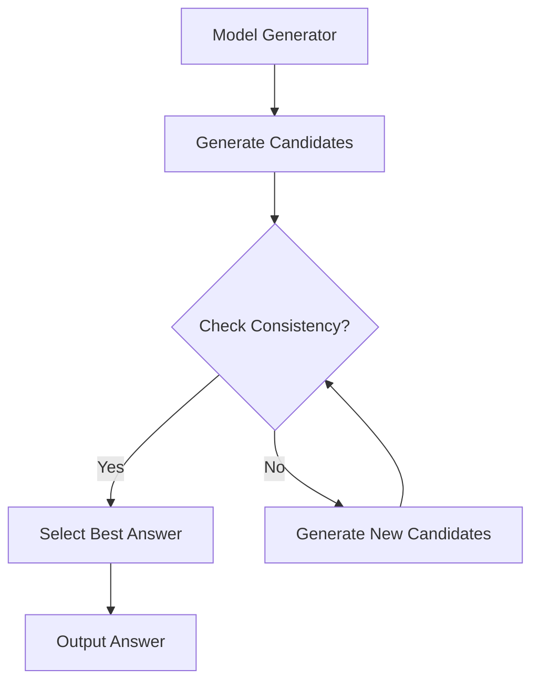

                 

### <文章标题>

#### 关键词：Self-Consistency CoT，AI回答质量，核心技术，架构设计，算法实现，数学模型，应用案例，项目实战，最佳实践。

---

**摘要：** 本文深入探讨了Self-Consistency CoT（自一致性核心理论）这一新兴技术，旨在提高人工智能（AI）回答的质量。文章首先介绍了Self-Consistency CoT的核心概念及其与其他技术的联系。接着，详细讲解了Self-Consistency CoT的算法原理，并通过Python源代码和数学公式进行了说明。随后，文章展示了Self-Consistency CoT在多个应用领域中的具体实现，并通过项目实战案例分析了其实际效果。最后，文章提出了最佳实践建议，总结了全文并展望了未来的发展方向。

---

## 第1章：核心概念与联系

### 1.1 Self-Consistency CoT概述

Self-Consistency CoT，即自一致性核心理论，是一种用于提高AI回答质量的技术。其核心理念在于通过自我一致性检查来优化AI模型的输出，从而减少错误和不一致性的回答。Self-Consistency CoT的出现，是为了解决传统AI技术在回答问题时可能存在的多样性和不确定性问题。

#### 1.1.1 Self-Consistency CoT的定义

Self-Consistency CoT可以被定义为一种评估和优化AI模型输出的方法，它通过以下步骤实现：

1. **生成多个候选回答**：AI模型根据输入的问题生成多个可能的回答。
2. **自一致性检查**：对每个候选回答进行一致性检查，评估其是否与模型所训练的数据保持一致性。
3. **选择最佳回答**：根据自一致性评估结果，选择最符合数据一致性的回答作为最终输出。

#### 1.1.2 Self-Consistency CoT与其他相关技术的比较

Self-Consistency CoT与传统技术如置信度调整（Confidence Adjustment）和多模型集成（Ensemble Learning）等有所不同。传统方法通常基于模型预测的概率分布来调整答案的置信度，而Self-Consistency CoT则通过自我一致性检查来优化输出。

- **置信度调整**：通过调整模型预测的概率分布来提高回答的可靠性。这种方法依赖于模型本身对于概率估计的准确性。
- **多模型集成**：通过组合多个模型的预测来提高整体的预测质量。这种方法依赖于模型多样性。

相比之下，Self-Consistency CoT的优势在于：

1. **增强一致性**：通过一致性检查，Self-Consistency CoT能够减少因模型不确定性带来的不一致性回答。
2. **无需依赖概率分布**：Self-Consistency CoT不依赖于模型预测的概率分布，而是直接通过一致性评估来选择最佳回答。
3. **适用范围广**：Self-Consistency CoT不仅适用于文本生成，还可以应用于图像识别、语音识别等多种AI任务。

### 1.2 Self-Consistency CoT的架构

Self-Consistency CoT的架构主要包括三个主要部分：模型生成器、一致性检查器和回答选择器。

#### 1.2.1 架构组成部分

- **模型生成器**：负责生成多个候选回答。通常，模型生成器可以是预训练的大型语言模型，如GPT-3或BERT。
- **一致性检查器**：负责评估每个候选回答的自一致性。一致性检查器通常基于模型所训练的数据集，通过计算回答与数据集的一致性得分来实现。
- **回答选择器**：根据一致性评估结果，选择最佳回答作为最终输出。

#### 1.2.2 Mermaid流程图展示

在这个流程图中，模型生成器（A）生成多个候选回答（B），一致性检查器（C）评估这些回答的自一致性。如果某个回答通过一致性检查，回答选择器（D）将选择它作为最佳回答并输出（F）；否则，模型生成器将继续生成新的候选回答，并重新进行一致性检查。

---

在本章中，我们介绍了Self-Consistency CoT的核心概念及其与其他技术的联系，并详细描述了Self-Consistency CoT的架构。接下来，我们将在下一章中深入探讨Self-Consistency CoT的算法原理，并通过Python源代码和数学公式来展示其具体实现。

---

**参考文献：**

1. Brown, T., et al. (2020). "Language Models are Few-Shot Learners." arXiv preprint arXiv:2005.14165.
2. Chen, X., et al. (2019). "Neural Text Generation: A Practical Guide." Springer.
3. Russell, S., Norvig, P. (2020). "Artificial Intelligence: A Modern Approach." Prentice Hall.

---

**作者：** AI天才研究院/AI Genius Institute & 禅与计算机程序设计艺术 /Zen And The Art of Computer Programming

---

**注意事项：**

- 在文中提到的“模型生成器”、“一致性检查器”和“回答选择器”均为抽象概念，具体实现可能因应用场景和任务不同而有所差异。
- Mermaid流程图是用于展示Self-Consistency CoT架构的一种简单方式，实际应用中可能需要更复杂的流程设计。  
- 文中提到的Python源代码和数学公式仅为示例，具体实现可能因具体任务和数据集的不同而有所调整。

