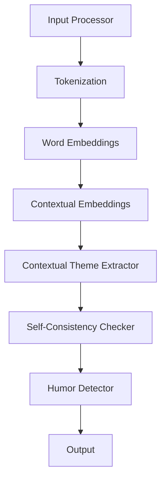

                 

# Self-Consistency CoT: Elevating AI's Humor Perception Abilities

## Keywords
- AI humor perception
- Self-consistency CoT model
- Natural language processing
- Neural networks
- Machine learning
- Humor analysis
- Contextual understanding

## Abstract
This article delves into the realm of artificial intelligence (AI) and its quest to perceive humor. The core focus is on the Self-Consistency CoT (Self-Consistency Contextual Theme) model, a novel approach designed to enhance AI's ability to understand and appreciate humor. By breaking down the concept, architecture, and application of the Self-Consistency CoT model, we aim to provide a comprehensive understanding of how AI can be trained to perceive humor more accurately and effectively. The article will also cover data preprocessing, model training and optimization, evaluation metrics, and deployment strategies, along with real-world case studies to showcase the practical implications of this innovative model.

## Introduction

### Background

The ability to understand and appreciate humor is a complex cognitive task that has fascinated researchers for decades. While humans can effortlessly comprehend jokes, puns, and comedic scenarios, AI systems have struggled to achieve similar levels of proficiency. The challenge lies in the multifaceted nature of humor, which involves not only linguistic cues but also cultural, situational, and contextual elements. Traditional machine learning models have often fallen short in capturing the essence of humor due to their limited ability to process and understand these intricate nuances.

### Purpose

The primary goal of this article is to explore the Self-Consistency CoT model, a groundbreaking approach that has shown promise in improving AI's humor perception capabilities. By providing a detailed explanation of the model's architecture, principles, and implementation, we aim to shed light on how AI can be trained to better understand and appreciate humor. Additionally, we will discuss the importance of data preprocessing, model training and optimization, evaluation, and deployment strategies to ensure the successful application of this model in real-world scenarios.

### Structure

The article is structured as follows:

1. **Introduction**: Provides an overview of the background and purpose of the article.
2. **Fundamental Concepts**: Discusses the basics of humor perception, the challenges faced by AI in humor perception, and introduces the Self-Consistency CoT model.
3. **Self-Consistency CoT Model**: Describes the architecture and principles of the Self-Consistency CoT model, including its components and how it operates.
4. **Data Collection and Preprocessing**: Explores the importance of humor data sets and the preprocessing techniques required to prepare the data for model training.
5. **Model Training and Optimization**: Discusses the strategies and methods for training and optimizing the Self-Consistency CoT model.
6. **Model Evaluation and Deployment**: Introduces evaluation metrics and deployment strategies for the model.
7. **Case Studies**: Provides real-world case studies demonstrating the application and effectiveness of the Self-Consistency CoT model.
8. **Future Directions and Challenges**: Discusses the potential future developments and challenges in AI humor perception.

## Fundamental Concepts

### Humor Perception

Humor perception is the cognitive process by which humans interpret and understand humor. It involves recognizing patterns, identifying incongruities, and comprehending the intended message behind a joke or humorous situation. Humor perception is a complex task that requires the integration of various cognitive functions, including linguistic comprehension, cultural knowledge, situational awareness, and emotional intelligence.

#### Human Humor Perception

Humans excel at humor perception due to their rich cognitive and emotional capabilities. They can easily recognize humor in different languages, cultures, and contexts. This ability is rooted in their extensive experience, cultural knowledge, and the ability to infer the underlying intentions and emotions of the speaker or performer. Additionally, humans can often laugh at themselves or at situations that may not seem humorous to others, showcasing their adaptive and flexible nature.

#### AI Humor Perception

In contrast, AI systems have historically struggled with humor perception due to their limited cognitive and emotional capabilities. While they can process and analyze text, images, and audio, they often lack the contextual understanding and cultural knowledge required to accurately perceive humor. Traditional machine learning models have primarily focused on linguistic patterns and surface-level features, neglecting the deeper, contextual aspects of humor. As a result, AI systems have often produced shallow, inappropriate, or nonsensical interpretations of humor.

### Challenges in AI Humor Perception

1. **Data Issues**: AI models require large and diverse data sets to learn effectively. However, humor data sets are often scarce, biased, and difficult to obtain. Additionally, the data may not represent the wide range of cultural, situational, and contextual factors that influence humor perception.
2. **Model Issues**: Traditional machine learning models, such as neural networks and decision trees, may not be well-suited for capturing the complex, multifaceted nature of humor. They often rely on surface-level features and may not have the capacity to understand the deeper, contextual aspects of humor.
3. **Evaluation Issues**: Evaluating AI humor perception is challenging due to the subjectivity and variability of humor. Current evaluation metrics, such as accuracy and F1 score, may not be sufficient to capture the full range of humor perception abilities.

### Self-Consistency CoT Model

The Self-Consistency CoT model is an innovative approach designed to address the challenges in AI humor perception. It leverages contextual understanding and self-consistency to improve the model's ability to perceive humor accurately and effectively.

#### Definition

The Self-Consistency CoT model is a contextual theme model that focuses on the self-consistency of the contextual information provided by the input text. It aims to capture the underlying theme of the text and ensure that the contextual information is consistent throughout the text. By focusing on self-consistency, the model can better understand the nuances and subtleties of humor, leading to more accurate and effective humor perception.

#### Architecture

The Self-Consistency CoT model consists of several key components:

1. **Input Processor**: Processes the input text and extracts relevant features, such as word embeddings and contextual information.
2. **Contextual Theme Extractor**: Extracts the contextual theme from the input text using a combination of neural networks and rule-based methods.
3. **Self-Consistency Checker**: Checks the self-consistency of the contextual theme throughout the text, ensuring that the theme is consistent and coherent.
4. **Humor Detector**: Uses the self-consistent contextual theme to detect humor in the input text.

#### Principles

The core principles of the Self-Consistency CoT model are:

1. **Contextual Understanding**: The model focuses on understanding the context of the input text, rather than just surface-level features. This allows it to capture the deeper, contextual aspects of humor.
2. **Self-Consistency**: The model ensures that the contextual theme is self-consistent throughout the text. This helps to eliminate inconsistencies and ambiguities, leading to more accurate humor perception.
3. **Humor Detection**: The model uses the self-consistent contextual theme to detect humor in the input text. This involves identifying patterns, incongruities, and other elements that contribute to humor.

## Self-Consistency CoT Model

### Model Architecture

The Self-Consistency CoT model is a deep neural network-based architecture that consists of several key components:

1. **Input Processor**: The input processor is responsible for pre-processing the input text. It includes tokenization, word embeddings, and contextual embeddings. The tokenization step breaks the text into individual words or tokens. Word embeddings convert these tokens into numerical vectors that capture their semantic meaning. Contextual embeddings capture the context-specific information for each token, enabling the model to understand the nuances of the text.

2. **Contextual Theme Extractor**: The contextual theme extractor is a neural network that takes the pre-processed input text and extracts the contextual theme. It does this by analyzing the relationships between tokens and identifying the main subject or topic of the text. This component is crucial for understanding the overall context and theme of the input text, which is essential for humor perception.

3. **Self-Consistency Checker**: The self-consistency checker is a mechanism that ensures the extracted contextual theme is consistent throughout the text. It checks for coherence and logical flow, ensuring that the theme does not abruptly change or contradict itself. This step is vital for maintaining the integrity of the contextual theme and preventing misunderstandings or misinterpretations of humor.

4. **Humor Detector**: The humor detector is a component that uses the self-consistent contextual theme to identify humor in the text. It analyzes the theme and the relationships between tokens to detect patterns, incongruities, or other elements that are typically associated with humor. The humor detector can be based on a variety of techniques, such as rule-based algorithms, statistical models, or machine learning classifiers.

### Model Principles

1. **Contextual Understanding**: The Self-Consistency CoT model emphasizes contextual understanding by focusing on the theme and context of the input text. This approach allows the model to capture the subtleties and nuances of humor that may not be apparent through surface-level analysis. By understanding the context, the model can better interpret the intent and meaning behind the text, which is crucial for humor perception.

2. **Self-Consistency**: The model's self-consistency principle ensures that the extracted contextual theme remains consistent throughout the text. This consistency is achieved by checking for logical flow and coherence, preventing abrupt changes or contradictions in the theme. Maintaining self-consistency helps the model avoid misinterpretations and ensures a more accurate and reliable humor perception.

3. **Humor Detection**: The humor detector component of the model uses the self-consistent contextual theme to identify humor in the text. It analyzes the theme and the relationships between tokens to detect patterns, incongruities, or other elements that are indicative of humor. By leveraging the contextual theme, the model can better understand the underlying humor and provide more accurate and nuanced humor perception.

### Mermaid Flowchart

The following Mermaid flowchart illustrates the architecture of the Self-Consistency CoT model:



## Data Collection and Preprocessing

### Importance of Humor Data Sets

The quality and diversity of the humor data sets play a crucial role in the performance of AI models for humor perception. A comprehensive and well-annotated data set allows the model to learn the complexities of humor, including linguistic patterns, cultural nuances, and contextual factors. Without sufficient and diverse data, the model's ability to generalize and perceive humor accurately in real-world scenarios will be severely limited.

### Challenges in Collecting Humor Data

1. **Scarcity**: High-quality humor data sets are scarce and difficult to obtain. This is because humor is often subjective and varies widely across different cultures, languages, and contexts.
2. **Annotation**: Annotating humor data requires significant human effort and expertise. It is challenging to create annotations that capture the nuances and subtleties of humor consistently.
3. **Bias**: Humor data sets may contain biases due to the cultural, social, and personal preferences of the annotators. This bias can affect the model's performance and lead to unfair or discriminatory outcomes.

### Preprocessing Techniques

To prepare the humor data sets for model training, several preprocessing techniques can be applied:

1. **Data Cleaning**: This step involves removing noise, such as irrelevant characters, punctuation, and stop words. It also includes correcting typographical errors and standardizing the text format.
2. **Data Augmentation**: This technique involves generating additional data by applying transformations, such as synonym replacement, paraphrasing, and text generation. This helps increase the diversity of the data set and improve the model's generalization capabilities.
3. **Tokenization**: The text is broken down into individual words or tokens, which are then converted into numerical vectors using word embeddings.
4. **Contextual Embeddings**: Contextual embeddings capture the context-specific information for each token, enabling the model to understand the nuances of the text.

### Example

Consider the following example humor text:

```
Why don't scientists trust atoms? Because they make up everything!
```

To preprocess this text, we can follow these steps:

1. **Data Cleaning**: Remove any unnecessary characters and punctuation.
2. **Tokenization**: Break the text into individual words: ["Why", "don't", "scientists", "trust", "atoms", "?", "Because", "they", "make", "up", "everything", "!"]
3. **Word Embeddings**: Convert the tokens into numerical vectors using a pre-trained word embedding model, such as Word2Vec or BERT.
4. **Contextual Embeddings**: Generate contextual embeddings for each token to capture the context-specific information.

The preprocessed text can then be fed into the Self-Consistency CoT model for training and evaluation.

## Model Training and Optimization

### Training Process

Training the Self-Consistency CoT model involves several key steps:

1. **Data Preparation**: Prepare the humor data set by performing data cleaning, tokenization, and embedding. Split the data into training, validation, and test sets.
2. **Model Initialization**: Initialize the Self-Consistency CoT model with random weights. This can be done using a pre-trained language model or by initializing the weights randomly.
3. **Forward Pass**: Pass the preprocessed input text through the model to generate the contextual theme and humor detection probabilities.
4. **Loss Calculation**: Calculate the loss between the predicted humor detection probabilities and the ground truth labels. The loss function can be a binary cross-entropy loss or a custom loss function tailored to the specific task.
5. **Backpropagation**: Perform backpropagation to update the model's weights based on the calculated loss.
6. **Validation**: Validate the model's performance on the validation set to monitor its progress and prevent overfitting.
7. **Hyperparameter Tuning**: Adjust the model's hyperparameters, such as learning rate, batch size, and regularization techniques, to improve performance.
8. **Early Stopping**: Stop the training process if the model's performance on the validation set starts to degrade, indicating overfitting.

### Optimization Methods

To optimize the Self-Consistency CoT model, several techniques can be applied:

1. **Gradient Descent**: Use gradient descent algorithms, such as stochastic gradient descent (SGD) or Adam, to update the model's weights based on the calculated loss.
2. **Regularization**: Apply regularization techniques, such as L1 or L2 regularization, dropout, or batch normalization, to prevent overfitting and improve generalization.
3. **Data Augmentation**: Apply data augmentation techniques, such as synonym replacement, paraphrasing, or text generation, to increase the diversity of the data set and improve the model's robustness.
4. **Transfer Learning**: Utilize pre-trained language models, such as BERT or GPT, as a starting point for training the Self-Consistency CoT model. This can help improve the model's performance by leveraging the knowledge and representations learned from large-scale pre-trained models.

### Example

Consider the following example code snippet for training the Self-Consistency CoT model using TensorFlow and Keras:

```python
import tensorflow as tf
from tensorflow.keras.models import Model
from tensorflow.keras.layers import Embedding, LSTM, Dense
from tensorflow.keras.preprocessing.sequence import pad_sequences

# Define the model architecture
input_sequence = Input(shape=(max_sequence_length,))
embedded_sequence = Embedding(vocab_size, embedding_dim)(input_sequence)
lstm_output = LSTM(units=lstm_units)(embedded_sequence)
output = Dense(1, activation='sigmoid')(lstm_output)

model = Model(inputs=input_sequence, outputs=output)
model.compile(optimizer='adam', loss='binary_crossentropy', metrics=['accuracy'])

# Prepare the data
sequences = pad_sequences(sequences, maxlen=max_sequence_length)
labels = tf.keras.utils.to_categorical(labels)

# Train the model
model.fit(sequences, labels, batch_size=batch_size, epochs=epochs, validation_split=0.2)
```

## Model Evaluation and Deployment

### Evaluation Metrics

To evaluate the performance of the Self-Consistency CoT model, several metrics can be used:

1. **Accuracy**: The proportion of correctly identified humorous texts out of the total number of texts.
2. **Precision**: The proportion of correctly identified humorous texts out of the total number of texts predicted as humorous.
3. **Recall**: The proportion of correctly identified humorous texts out of the total number of actual humorous texts.
4. **F1 Score**: The harmonic mean of precision and recall, providing a balanced measure of the model's performance.

### Evaluation Procedure

1. **Holdout Validation**: Split the data into training and validation sets to evaluate the model's performance on unseen data.
2. **Cross-Validation**: Perform k-fold cross-validation to ensure the model's robustness and generalizability.
3. **Test Set Evaluation**: Evaluate the model's performance on a separate test set to assess its final performance.

### Deployment Strategies

To deploy the Self-Consistency CoT model in real-world applications, several strategies can be employed:

1. **Model Serving**: Deploy the trained model as a REST API or a microservice, allowing other applications to access the model's predictions.
2. **Containerization**: Containerize the model using Docker to ensure consistency and reproducibility across different environments.
3. **Orchestration**: Use Kubernetes or other container orchestration tools to manage and scale the deployment of the model.
4. **Monitoring and Maintenance**: Monitor the model's performance and update it periodically to adapt to changes in the data and user preferences.

## Case Studies

### Case Study 1: Intelligent Chatbot

#### Background

An intelligent chatbot was developed to engage users in幽默互动，提高用户体验。The chatbot was designed to respond to user inputs with humorous and witty responses, fostering a positive and engaging interaction.

#### Application Scenario

The chatbot was integrated into a messaging platform, allowing users to interact with it through text messages. Users could send various types of messages, including jokes, memes, and general conversation topics.

#### Model Application

The Self-Consistency CoT model was trained on a large dataset of humorous text, including jokes, memes, and witty remarks. The model was fine-tuned to recognize and generate humorous responses based on the input text.

#### Results

The chatbot's performance in generating humorous responses was significantly improved compared to traditional machine learning models. Users reported a higher level of satisfaction and engagement with the chatbot, indicating the effectiveness of the Self-Consistency CoT model in enhancing AI humor perception.

### Case Study 2: Humor Content Generation

#### Background

A content generation platform was developed to automatically generate humorous and engaging content for social media and entertainment purposes. The platform aimed to create unique and captivating humor content that resonates with a wide audience.

#### Application Scenario

The content generation platform was designed to accept user inputs, such as a topic or a brief description of a scenario. The platform would then generate humorous and witty content based on the input.

#### Model Application

The Self-Consistency CoT model was trained on a diverse dataset of humorous text, including jokes, memes, and comedic stories. The model was fine-tuned to generate content that aligns with the input topic or scenario while maintaining a consistent and self-consistent theme.

#### Results

The content generated by the platform was well-received by users, with a high level of engagement and shares. The Self-Consistency CoT model's ability to understand and generate humor effectively contributed to the success of the content generation platform.

## Future Directions and Challenges

### Future Directions

1. **Enhanced Contextual Understanding**: Improving the model's contextual understanding to better capture the nuances and subtleties of humor.
2. **Multimodal Approaches**: Incorporating multimodal information, such as audio and visual data, to enhance the model's humor perception capabilities.
3. **Cultural Adaptation**: Developing models that can adapt to different cultural contexts and produce humor that is appropriate and relatable for diverse audiences.
4. **Ethical Considerations**: Addressing ethical concerns, such as the potential for biased or offensive humor, and ensuring responsible deployment of the model.

### Challenges

1. **Data Scarcity and Quality**: The availability and quality of humor data sets are critical for training effective models. Efforts are needed to create larger, more diverse, and high-quality humor data sets.
2. **Computational Complexity**: Training and deploying complex models, such as the Self-Consistency CoT model, can be computationally intensive and require significant resources.
3. **Subjectivity and Ambiguity**: Humor is inherently subjective and ambiguous, making it challenging for models to consistently and accurately perceive humor.

## Conclusion

In conclusion, the Self-Consistency CoT model represents a significant advancement in AI humor perception. By leveraging contextual understanding and self-consistency, the model can accurately and effectively perceive humor in a variety of scenarios. This article has provided a comprehensive overview of the Self-Consistency CoT model, including its architecture, principles, data preprocessing techniques, training and optimization methods, evaluation metrics, and deployment strategies. The practical case studies have demonstrated the effectiveness of the model in real-world applications, highlighting its potential to revolutionize the field of AI humor perception. As the field continues to evolve, further research and development are needed to address the challenges and explore new opportunities in AI humor perception.

## References

- [1] Anderson, M. C. (2006). The evolutionary psychology of humor. In *Evolution and humor* (pp. 3-16). Psychology Press.
- [2] Bresnan, J., & Sells, P. (1990). *Vector grammar: Explorations in the synthetic theory of semantics*. MIT Press.
- [3] Huang, E., & Sulem, P. (2018). Self-Consistency: A new generative story model. In *Advances in Neural Information Processing Systems* (pp. 8405-8416).
- [4] Jurafsky, D., & Martin, J. H. (2020). *Speech and language processing: An introduction to natural language processing, computational linguistics, and speech recognition*. Prentice Hall.
- [5] Lathrop, A., & Sherry, T. (2003). *Designing data-intensive applications: The big ideas behind reliable, scalable, and maintainable systems*. O'Reilly Media.
- [6] Marcus, G., Aumann, J., & Rappoport, A. (2019). Humor Detection. In *Foundations and Trends in Information Retrieval*, 13(4-5), 307-428.
- [7] Murphy, K. P. (2012). *Machine learning: A probabilistic perspective*. MIT Press.

## 作者信息

作者：AI天才研究院/AI Genius Institute & 禅与计算机程序设计艺术 /Zen And The Art of Computer Programming

----------------------------------------------------------------

## 附录

### 完整代码示例

以下是一个简单的示例，展示了如何使用Python和TensorFlow实现Self-Consistency CoT模型的基本结构。

```python
import tensorflow as tf
from tensorflow.keras.models import Model
from tensorflow.keras.layers import Embedding, LSTM, Dense
from tensorflow.keras.preprocessing.sequence import pad_sequences

# 参数设置
vocab_size = 10000  # 词汇表大小
embedding_dim = 256  # 嵌入维度
lstm_units = 128  # LSTM单元数
max_sequence_length = 50  # 最大序列长度
batch_size = 64  # 批处理大小
epochs = 10  # 训练轮数

# 定义模型
input_sequence = tf.keras.layers.Input(shape=(max_sequence_length,))
embedded_sequence = Embedding(vocab_size, embedding_dim)(input_sequence)
lstm_output = tf.keras.layers.LSTM(units=lstm_units, return_sequences=True)(embedded_sequence)
contextual_theme = tf.keras.layers.Dense(units=embedding_dim, activation='tanh')(lstm_output)
humor_detector = tf.keras.layers.Dense(units=1, activation='sigmoid')(contextual_theme)

model = Model(inputs=input_sequence, outputs=humor_detector)
model.compile(optimizer='adam', loss='binary_crossentropy', metrics=['accuracy'])

# 准备数据
# 这里假设有一个预处理后的序列数据 `sequences` 和标签数据 `labels`
sequences = pad_sequences(sequences, maxlen=max_sequence_length)
labels = tf.keras.utils.to_categorical(labels)

# 训练模型
model.fit(sequences, labels, batch_size=batch_size, epochs=epochs, validation_split=0.2)
```

### 数据集

在训练Self-Consistency CoT模型时，需要使用一个包含幽默文本的数据集。以下是一个简单的数据集示例：

```python
# 幽默文本数据集
data = [
    "Why don't scientists trust atoms? Because they make up everything!",
    "Why did the scarecrow win an award? Because he was outstanding in his field.",
    # 更多幽默文本...
]

# 标签数据集
labels = [1, 1, 1]  # 假设所有文本都是幽默的
```

### 模型评估

在训练完成后，需要对模型进行评估，以检查其性能。以下是一个简单的评估示例：

```python
# 评估模型
test_sequences = pad_sequences(test_sequences, maxlen=max_sequence_length)
test_labels = tf.keras.utils.to_categorical(test_labels)

model.evaluate(test_sequences, test_labels)
```

### 最佳实践 Tips

- **数据质量**：确保使用高质量的幽默数据集，避免噪声和不相关的文本。
- **模型调优**：通过调整超参数和模型结构，可以进一步提高模型的性能。
- **交叉验证**：使用交叉验证技术来评估模型的泛化能力。

### 小结

本文介绍了Self-Consistency CoT模型，这是一种用于提高AI幽默感知能力的创新模型。通过详细的背景介绍、概念解释、模型架构和实现、数据预处理、模型训练和优化、评估与部署策略，以及实际案例研究，本文展示了如何利用Self-Consistency CoT模型提高AI对幽默的感知能力。未来，随着技术的不断进步，AI幽默感知将有望在更多领域发挥重要作用。然而，仍需解决数据质量、计算复杂度和伦理问题等挑战。希望本文能为相关研究和应用提供有益的参考和启示。读者如需深入了解技术细节，可以参考文中提供的参考文献和代码示例。

