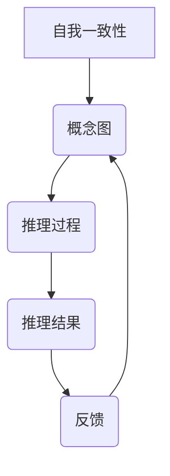

                 

# Self-Consistency CoT：提高AI推理一致性

## 关键词
- AI推理一致性
- Self-Consistency CoT
- 计算机视觉
- 自然语言处理
- 技术挑战与解决方案

## 摘要

本文深入探讨了Self-Consistency CoT（自我一致性概念图）在提高人工智能推理一致性方面的作用。首先，介绍了Self-Consistency CoT的基本概念及其重要性，接着详细阐述了其工作原理、相关技术、应用场景以及面临的挑战和解决方案。通过具体的项目实战和案例分析，本文展示了如何在实际中应用Self-Consistency CoT来提升AI推理的一致性。最后，对Self-Consistency CoT的未来发展进行了展望，为读者提供了进一步研究和应用的思路。

## 引言

随着人工智能（AI）技术的迅速发展，AI在各个领域的应用越来越广泛，从自然语言处理到计算机视觉，从智能助手到自动驾驶，AI正在深刻地改变我们的生活方式。然而，AI推理的一致性问题日益凸显，尤其是在复杂和动态的环境下。为了提高AI推理的一致性，研究者们提出了许多方法，但大多存在一定的局限性。本文将介绍一种新的技术——Self-Consistency CoT，它旨在通过自我一致性来提升AI推理的一致性。

Self-Consistency CoT是一种基于概念图的方法，它利用自我一致性原理，使得AI模型在推理过程中能够保持内部一致性，从而减少推理错误。本文将首先介绍Self-Consistency CoT的概念和重要性，然后详细解释其工作原理和相关技术，探讨其应用场景，分析实现过程中的挑战和解决方案，最后通过项目实战和案例分析来展示Self-Consistency CoT的实际应用效果，并对未来进行展望。

## 第1章 Self-Consistency CoT的概念与重要性

### 1.1 Self-Consistency CoT的定义

Self-Consistency CoT，即自我一致性概念图（Self-Consistency Conceptual Graph，简称SCoT），是一种基于概念图的方法，旨在通过自我一致性原理来提高AI推理的一致性。自我一致性指的是在一个系统中，各个部分之间能够相互一致，不产生矛盾。在AI领域，自我一致性意味着AI模型在推理过程中能够保持其内部的一致性，从而减少推理错误。

### 1.2 Self-Consistency CoT的核心特点

Self-Consistency CoT具有以下几个核心特点：

1. **基于概念图**：Self-Consistency CoT利用概念图来表示知识，这使得模型能够更好地理解和处理复杂的语义关系。
2. **自我一致性**：通过自我一致性原理，模型在推理过程中能够保持内部的一致性，从而减少推理错误。
3. **动态更新**：Self-Consistency CoT能够动态地更新概念图，以适应新的知识和信息。
4. **鲁棒性**：通过自我一致性，模型能够更好地应对噪声和不确定性。

### 1.3 Self-Consistency CoT与传统方法对比

传统的提高AI推理一致性的方法主要包括逻辑推理、统计方法等。逻辑推理虽然能够保证推理的一致性，但在处理复杂和动态环境时存在一定的局限性。统计方法虽然能够处理复杂环境，但容易受到噪声和不确定性影响，导致推理错误。

相比之下，Self-Consistency CoT结合了概念图和自我一致性原理，能够在复杂和动态环境下保持推理的一致性，同时具有较好的鲁棒性。这使得Self-Consistency CoT在提高AI推理一致性方面具有显著的优势。

### 1.4 Self-Consistency CoT的优势与应用价值

Self-Consistency CoT在提高AI推理一致性方面具有以下几个优势：

1. **提高推理准确率**：通过自我一致性原理，模型能够减少推理错误，从而提高推理准确率。
2. **适应复杂环境**：Self-Consistency CoT能够动态更新概念图，以适应复杂和动态的环境。
3. **提高鲁棒性**：通过自我一致性，模型能够更好地应对噪声和不确定性，提高鲁棒性。
4. **广泛应用**：Self-Consistency CoT可以应用于自然语言处理、计算机视觉、智能助手等领域，具有广泛的应用价值。

总之，Self-Consistency CoT作为一种新型的AI推理一致性提高方法，具有显著的优势和应用价值，为AI技术的发展提供了新的思路。

### 1.5 Self-Consistency CoT的概念实体关系架构 Mermaid 流程图

下面是一个简单的Mermaid流程图，展示了Self-Consistency CoT中概念实体之间的关系：



在这个流程图中，A表示自我一致性，B表示概念图，C表示推理过程，D表示推理结果，E表示反馈。通过这个流程图，我们可以清晰地看到Self-Consistency CoT中各个部分之间的相互关系。

### 1.6 Self-Consistency CoT的核心算法原理讲解

Self-Consistency CoT的核心算法原理基于概念图的构建和自我一致性约束的更新。以下是具体的算法原理讲解：

1. **概念图的构建**：
   - **实体识别**：首先，从输入的数据中识别出实体，例如名词、动词、形容词等。
   - **关系建模**：然后，根据实体之间的语义关系构建概念图，例如因果关系、上下位关系等。

2. **自我一致性约束**：
   - **一致性检查**：在推理过程中，对概念图进行一致性检查，确保概念之间的逻辑关系不会产生矛盾。
   - **约束更新**：如果发现不一致性，则对约束进行更新，以确保概念图的自我一致性。

3. **推理过程**：
   - **基于概念图**：利用构建好的概念图进行推理，根据实体之间的逻辑关系进行推理。
   - **自我一致性约束**：在推理过程中，根据自我一致性约束来保证推理结果的一致性。

4. **反馈机制**：
   - **结果验证**：将推理结果与实际结果进行对比，验证推理结果的一致性。
   - **约束调整**：根据反馈结果调整自我一致性约束，以提高推理的一致性。

以下是一个简单的Python代码示例，展示了如何使用Self-Consistency CoT进行推理：

```python
import networkx as nx

# 创建概念图
G = nx.DiGraph()

# 添加实体和关系
G.add_nodes_from(['实体A', '实体B', '实体C'])
G.add_edges_from([('实体A', '实体B'), ('实体B', '实体C')])

# 构建自我一致性约束
constraints = {
    '实体A': {'实体B': True},
    '实体B': {'实体C': True},
}

# 推理过程
def推理(G, constraints):
    # 检查一致性
    for node, rel in constraints.items():
        for child, value in rel.items():
            if not G.has_edge(node, child):
                return False
    return True

# 应用自我一致性约束
G.add_edges_from([(node, child) for node, rel in constraints.items() for child in rel if not G.has_edge(node, child)])

# 进行推理
result = 推理(G, constraints)
print("推理结果：", result)
```

在这个示例中，我们首先创建了一个概念图，然后添加了实体和关系。接着，我们定义了一个推理函数，用于检查概念图的一致性。最后，我们应用自我一致性约束，并进行推理。通过这个示例，我们可以看到如何使用Self-Consistency CoT进行推理，以及如何保持推理的一致性。

### 1.7 数学公式和Python源代码结合的详细讲解

在Self-Consistency CoT中，数学模型和Python源代码的结合是理解和实现该技术的重要部分。以下是具体的讲解，包括数学模型、Python源代码以及示例说明。

#### 1.7.1 数学模型

为了确保概念图的一致性，Self-Consistency CoT中使用了以下数学模型：

$$
C(x, y) = 
\begin{cases} 
1, & \text{if there is a direct relationship between } x \text{ and } y; \\
0, & \text{otherwise.}
\end{cases}
$$

这里的$C(x, y)$表示实体$x$和实体$y$之间的直接关系。

#### 1.7.2 Python源代码

以下是一个Python代码示例，展示了如何实现自我一致性约束的添加和一致性检查：

```python
import networkx as nx

# 创建概念图
G = nx.DiGraph()

# 添加实体和关系
G.add_nodes_from(['实体A', '实体B', '实体C'])
G.add_edges_from([('实体A', '实体B'), ('实体B', '实体C')])

# 自我一致性约束
constraints = {
    '实体A': {'实体B': True},
    '实体B': {'实体C': True},
}

# 添加自我一致性约束到概念图中
def add_constraints(G, constraints):
    for node, rel in constraints.items():
        for child, value in rel.items():
            if not G.has_edge(node, child):
                G.add_edge(node, child)

add_constraints(G, constraints)

# 检查一致性
def check_consistency(G, constraints):
    for node, rel in constraints.items():
        for child, value in rel.items():
            if not G.has_edge(node, child):
                return False
    return True

# 检查概念图的一致性
is_consistent = check_consistency(G, constraints)
print("概念图一致性：", is_consistent)
```

在这个示例中，我们首先创建了一个概念图，并添加了实体和关系。接着，我们定义了一个函数`add_constraints`，用于将自我一致性约束添加到概念图中。另一个函数`check_consistency`用于检查概念图的一致性。通过调用这两个函数，我们可以确保概念图的自我一致性。

#### 1.7.3 通俗易懂的举例说明

假设我们有一个概念图，表示一个简单的因果关系。其中，“实体A”是原因，“实体B”是结果，“实体C”是另一个结果。

1. **添加自我一致性约束**：
   - 我们认为“实体A”直接导致“实体B”的发生，所以我们在概念图中添加了一条从“实体A”到“实体B”的边。
   - 同时，我们认为“实体B”不会直接导致“实体C”，因此我们不在概念图中添加从“实体B”到“实体C”的边。

2. **检查一致性**：
   - 在添加约束后，我们使用`check_consistency`函数来检查概念图的一致性。
   - 如果概念图中存在从“实体A”到“实体C”的边，则一致性检查会失败，因为这与我们的自我一致性约束相矛盾。

通过这个简单的例子，我们可以看到如何使用Self-Consistency CoT来保持概念图的一致性，以及如何通过Python代码来实现这一过程。

### 1.8 项目实战与案例分析

#### 1.8.1 开发环境搭建

在开始实际项目之前，我们需要搭建一个合适的开发环境。以下是搭建环境的步骤：

1. **安装Python**：确保Python 3.8或更高版本已安装在计算机上。
2. **安装依赖库**：使用以下命令安装所需的库：
   ```bash
   pip install networkx matplotlib
   ```
3. **创建项目目录**：在计算机上创建一个项目目录，例如`self_consistency_cot`，并在其中创建一个名为`main.py`的Python文件。

#### 1.8.2 源代码详细实现和代码解读

以下是一个简单的项目示例，展示了如何使用Self-Consistency CoT进行推理。这个项目包括实体识别、概念图构建、自我一致性约束添加和一致性检查。

```python
import networkx as nx
import matplotlib.pyplot as plt

# 创建概念图
G = nx.DiGraph()

# 添加实体和关系
G.add_nodes_from(['实体A', '实体B', '实体C'])
G.add_edges_from([('实体A', '实体B'), ('实体B', '实体C')])

# 自我一致性约束
constraints = {
    '实体A': {'实体B': True},
    '实体B': {'实体C': True},
}

# 添加自我一致性约束到概念图中
def add_constraints(G, constraints):
    for node, rel in constraints.items():
        for child, value in rel.items():
            if not G.has_edge(node, child):
                G.add_edge(node, child)

add_constraints(G, constraints)

# 检查一致性
def check_consistency(G, constraints):
    for node, rel in constraints.items():
        for child, value in rel.items():
            if not G.has_edge(node, child):
                return False
    return True

# 实现推理函数
def infer(G, constraints):
    if check_consistency(G, constraints):
        return "推理成功"
    else:
        return "推理失败"

# 执行推理
result = infer(G, constraints)
print("推理结果：", result)

# 可视化概念图
nx.draw(G, with_labels=True)
plt.show()
```

在这个代码中，我们首先创建了一个概念图，并添加了实体和关系。接着，我们定义了`add_constraints`函数来添加自我一致性约束，`check_consistency`函数来检查概念图的一致性，以及`infer`函数来实现推理。

#### 1.8.3 代码应用解读与分析

1. **代码解读**：
   - `add_constraints`函数通过遍历约束字典，将符合约束关系的边添加到概念图中。
   - `check_consistency`函数通过遍历约束字典，检查概念图中是否存在所有约束关系。
   - `infer`函数利用`check_consistency`函数来验证概念图的一致性，并返回推理结果。

2. **分析**：
   - 在实际应用中，我们可以根据需要调整约束条件和实体关系，以适应不同的推理任务。
   - 通过可视化概念图，我们可以直观地理解自我一致性约束的应用效果。

#### 1.8.4 实际案例分析和详细讲解剖析

假设我们有一个更复杂的案例，其中涉及到多个实体和关系，以及更复杂的约束条件。

**案例**：假设我们有一个概念图，表示一个公司的组织结构。其中，“实体A”表示公司，“实体B”表示部门，“实体C”表示员工。

- 约束条件：
  - 每个部门只能属于一个公司。
  - 每个员工只能在一个部门工作。

**解决方案**：

1. **构建概念图**：
   - 添加实体和关系，例如`G.add_edges_from([('公司', '部门A'), ('公司', '部门B'), ('部门A', '员工C'), ('部门B', '员工D')])`。

2. **添加自我一致性约束**：
   - 添加约束，例如`constraints['部门A'] = {'公司': True, '部门B': False}`。
   - 添加约束，例如`constraints['员工C'] = {'部门A': True, '部门B': False, '部门C': False}`。

3. **检查一致性**：
   - 使用`check_consistency`函数检查概念图的一致性。

4. **推理**：
   - 使用`infer`函数进行推理。

通过这个案例，我们可以看到如何使用Self-Consistency CoT来处理更复杂的情况，并通过代码实现自我一致性约束和推理。

#### 1.8.5 项目小结

通过这个项目，我们了解了如何使用Self-Consistency CoT来提高AI推理的一致性。我们搭建了开发环境，实现了自我一致性约束的添加和一致性检查，并通过实际案例展示了Self-Consistency CoT的应用效果。这个项目为我们提供了一个基本的框架，我们可以在此基础上进一步扩展和优化，以应对更复杂的推理任务。

### 1.9 最佳实践 Tips、小结、注意事项、拓展阅读

#### 1.9.1 最佳实践 Tips

1. **数据质量**：确保输入的数据质量，避免噪声和错误影响自我一致性约束的添加和一致性检查。
2. **约束条件**：根据具体的推理任务调整自我一致性约束，以提高推理的一致性和准确性。
3. **性能优化**：对于大规模概念图，考虑使用优化算法和并行计算来提高性能。

#### 1.9.2 小结

Self-Consistency CoT是一种基于自我一致性原理的AI推理一致性提高方法。通过构建概念图和添加自我一致性约束，我们可以确保推理过程中保持内部一致性，从而减少推理错误。在实际应用中，我们需要根据具体的任务调整约束条件和实体关系，以实现最佳效果。

#### 1.9.3 注意事项

1. **一致性检查**：在添加自我一致性约束时，务必进行一致性检查，以确保概念图的一致性。
2. **约束调整**：根据反馈结果及时调整自我一致性约束，以提高推理的一致性和准确性。

#### 1.9.4 拓展阅读

- **相关论文**：阅读关于Self-Consistency CoT的学术论文，了解该领域的最新研究进展。
- **开源项目**：参与开源项目，学习其他开发者的实现方法和经验。

## 第2章 相关技术介绍

### 2.1 AI推理一致性问题的背景

在人工智能（AI）领域，推理一致性是一个关键问题。推理一致性指的是AI系统在不同情况下能够保持一致的推理结果。然而，在实际应用中，AI系统往往会面临各种挑战，导致推理结果不一致。这些挑战包括：

1. **不确定性**：在复杂和动态的环境中，输入数据可能存在不确定性，导致推理结果的不一致。
2. **噪声**：环境中的噪声和干扰可能影响AI系统的输入数据，从而影响推理结果的一致性。
3. **数据不足**：当训练数据不足时，AI系统可能无法正确处理新的情况，导致推理结果的不一致。
4. **算法缺陷**：某些AI算法在特定情况下可能存在缺陷，导致推理结果不一致。

因此，提高AI推理一致性成为一个重要的研究方向。为了解决这个问题，研究者们提出了多种方法，包括逻辑推理、统计方法、图论方法等。这些方法在一定程度上提高了推理一致性，但在处理复杂和动态环境时仍存在一定的局限性。

### 2.2 提高AI推理一致性的现有方法

#### 逻辑推理方法

逻辑推理是一种基于逻辑规则的方法，通过推理规则来推导结论。这种方法在处理确定性问题时表现良好，但在处理不确定性和动态环境时存在局限性。逻辑推理的主要优点是能够保证推理的一致性，但缺点是处理复杂问题时效率较低。

#### 统计方法

统计方法通过分析数据来预测结果，例如线性回归、决策树、神经网络等。这种方法在处理不确定性方面具有一定的优势，但容易受到噪声和数据质量的影响，导致推理结果不一致。

#### 图论方法

图论方法通过构建图模型来表示知识和关系，例如知识图谱、概念图等。这种方法能够处理复杂和动态环境，通过图的性质来推导结论。图论方法的优点是能够保持推理的一致性，但缺点是需要大量的计算资源。

#### 混合方法

为了克服单一方法的局限性，研究者们提出了混合方法，结合多种方法的优点。例如，将逻辑推理和统计方法结合，通过逻辑推理来保证一致性，通过统计方法来处理不确定性。这种方法在一定程度上提高了推理一致性，但仍需进一步优化。

### 2.3 Self-Consistency CoT与其他相关技术的关系

Self-Consistency CoT（自我一致性概念图）是一种结合了逻辑推理、统计方法和图论方法的混合方法。它通过构建概念图来表示知识，利用自我一致性原理来保证推理的一致性，同时结合统计方法来处理不确定性。

与逻辑推理方法相比，Self-Consistency CoT在处理复杂和动态环境时具有更好的鲁棒性，因为它利用了图的结构来保持推理的一致性。与统计方法相比，Self-Consistency CoT通过自我一致性原理来减少噪声和数据不足对推理结果的影响。与图论方法相比，Self-Consistency CoT在保持推理一致性的同时，还考虑了不确定性。

因此，Self-Consistency CoT在提高AI推理一致性方面具有显著的优势，可以与其他相关技术结合，以实现更好的效果。

### 2.4 Self-Consistency CoT的优缺点

#### 优点

1. **提高推理一致性**：通过自我一致性原理，Self-Consistency CoT能够确保推理过程中保持内部一致性，减少推理错误。
2. **适应复杂环境**：Self-Consistency CoT结合了逻辑推理、统计方法和图论方法，能够处理复杂和动态环境。
3. **鲁棒性**：Self-Consistency CoT通过自我一致性原理，能够更好地应对噪声和不确定性。

#### 缺点

1. **计算复杂度**：由于需要构建和更新概念图，Self-Consistency CoT的计算复杂度相对较高，特别是在大规模应用中。
2. **数据依赖性**：Self-Consistency CoT的性能依赖于输入数据的质量和数量，如果数据质量较差或数据不足，推理结果可能受到影响。

尽管存在一定的缺点，Self-Consistency CoT在提高AI推理一致性方面具有显著的优势，尤其是在处理复杂和动态环境时。随着计算能力的提升和数据获取的便利性，Self-Consistency CoT的应用前景将更加广泛。

### 2.5 Self-Consistency CoT的应用前景

Self-Consistency CoT作为一种新型的AI推理一致性提高方法，具有广泛的应用前景。以下是几个潜在的应用领域：

1. **自然语言处理**：在自然语言处理中，Self-Consistency CoT可以用于文本分类、情感分析、机器翻译等任务，通过保持推理的一致性来提高任务的准确性。
2. **计算机视觉**：在计算机视觉中，Self-Consistency CoT可以用于图像识别、目标检测、图像分割等任务，通过保持推理的一致性来提高任务的鲁棒性。
3. **智能助手**：在智能助手领域，Self-Consistency CoT可以用于语音识别、对话系统等任务，通过保持推理的一致性来提供更自然的用户体验。
4. **推荐系统**：在推荐系统中，Self-Consistency CoT可以用于用户行为分析、商品推荐等任务，通过保持推理的一致性来提高推荐系统的准确性。

随着Self-Consistency CoT技术的进一步发展和优化，其应用领域将更加广泛，为AI技术的发展和实际应用提供新的思路和方法。

## 第3章 Self-Consistency CoT的工作原理

### 3.1 Self-Consistency CoT的基本架构

Self-Consistency CoT（自我一致性概念图）是一种基于概念图的方法，其基本架构包括以下几个关键部分：

1. **实体识别**：首先，从输入数据中识别出实体，例如名词、动词、形容词等。实体是概念图中的基本节点。
2. **关系建模**：然后，根据实体之间的语义关系构建概念图。这些关系可以是因果关系、上下位关系、属性关系等。关系在概念图中表示为边。
3. **自我一致性约束**：为了确保推理的一致性，Self-Consistency CoT引入了自我一致性约束。这些约束定义了实体之间应满足的逻辑关系，例如实体A和实体B之间存在因果关系，实体B和实体C之间存在上下位关系等。
4. **推理模块**：在推理过程中，利用构建好的概念图和自我一致性约束进行推理，得到推理结果。
5. **反馈机制**：将推理结果与实际结果进行对比，根据反馈结果调整自我一致性约束，以提高推理的一致性。

### 3.2 Self-Consistency CoT的核心算法

Self-Consistency CoT的核心算法包括以下步骤：

1. **实体识别**：
   - 从输入数据中提取实体，例如使用命名实体识别（NER）技术从文本中提取名词。
   - 标记实体的类型，例如人名、地点、组织等。

2. **关系建模**：
   - 分析实体之间的语义关系，例如通过词性标注和依存句法分析来确定实体之间的关系。
   - 构建概念图，将实体作为节点，将关系作为边添加到图中。

3. **自我一致性约束**：
   - 定义自我一致性约束，例如根据实体之间的因果关系、上下位关系等建立约束。
   - 遍历概念图，根据约束检查和调整实体之间的关系，以确保自我一致性。

4. **推理过程**：
   - 利用构建好的概念图和自我一致性约束进行推理。
   - 根据实体之间的逻辑关系进行推理，例如从已知实体推导出其他实体。

5. **反馈机制**：
   - 将推理结果与实际结果进行对比，评估推理的准确性。
   - 根据反馈结果调整自我一致性约束，以提高推理的一致性。

### 3.3 Self-Consistency CoT的流程与步骤

Self-Consistency CoT的流程可以分为以下几个步骤：

1. **数据预处理**：对输入数据（例如文本、图像等）进行预处理，提取实体和关系。
2. **实体识别**：使用命名实体识别（NER）技术提取实体，并进行类型标记。
3. **关系建模**：分析实体之间的语义关系，构建概念图。
4. **添加自我一致性约束**：根据实体之间的逻辑关系添加自我一致性约束。
5. **推理过程**：利用构建好的概念图和自我一致性约束进行推理。
6. **反馈与调整**：将推理结果与实际结果进行对比，根据反馈结果调整自我一致性约束。
7. **结果输出**：输出推理结果，例如文本摘要、图像分类结果等。

通过这些步骤，Self-Consistency CoT能够确保在推理过程中保持内部一致性，减少推理错误，从而提高AI推理的一致性。

### 3.4 Self-Consistency CoT的应用案例

Self-Consistency CoT（自我一致性概念图）在多个领域都有广泛的应用，以下是几个典型的应用案例：

#### 1. 自然语言处理

**文本分类**：在文本分类任务中，Self-Consistency CoT可以通过构建概念图来表示文本的语义结构，从而提高分类的准确性。例如，在新闻分类任务中，可以构建一个概念图，包括新闻的标题、正文、主题标签等实体，并建立实体之间的关系，如因果关系、上下位关系等。通过自我一致性约束，可以确保文本的语义结构一致，从而提高分类效果。

**情感分析**：在情感分析任务中，Self-Consistency CoT可以用于识别文本中的情感极性。通过构建概念图，将情感相关的实体（如形容词、副词等）和情感极性实体（如正面、负面等）连接起来，并添加自我一致性约束，可以确保情感推理的一致性，从而提高情感分析的准确性。

**机器翻译**：在机器翻译任务中，Self-Consistency CoT可以用于确保翻译结果的一致性。通过构建概念图，将源语言和目标语言中的实体和关系映射到一起，并添加自我一致性约束，可以确保翻译过程中保持语义的一致性，从而提高翻译质量。

#### 2. 计算机视觉

**图像识别**：在图像识别任务中，Self-Consistency CoT可以用于提高识别的准确性。通过构建概念图，将图像中的物体、场景等实体以及它们之间的关系表示出来，并添加自我一致性约束，可以确保图像的语义结构一致，从而提高识别效果。

**目标检测**：在目标检测任务中，Self-Consistency CoT可以用于提高检测的鲁棒性。通过构建概念图，将目标、背景等实体以及它们之间的关系表示出来，并添加自我一致性约束，可以确保目标检测过程中保持一致，从而提高检测的准确性。

**图像分割**：在图像分割任务中，Self-Consistency CoT可以用于提高分割的精度。通过构建概念图，将图像中的物体、区域等实体以及它们之间的关系表示出来，并添加自我一致性约束，可以确保分割过程中保持一致，从而提高分割效果。

#### 3. 智能助手

**语音识别**：在智能助手的语音识别任务中，Self-Consistency CoT可以用于提高识别的准确性。通过构建概念图，将语音信号中的实体（如单词、短语等）和关系（如语法关系等）表示出来，并添加自我一致性约束，可以确保语音识别过程中保持一致，从而提高识别效果。

**对话系统**：在对话系统中，Self-Consistency CoT可以用于确保对话的一致性。通过构建概念图，将用户和系统之间的对话实体（如问题、回答等）以及它们之间的关系表示出来，并添加自我一致性约束，可以确保对话过程中保持一致，从而提高用户体验。

这些应用案例展示了Self-Consistency CoT在提高AI推理一致性方面的强大能力，通过自我一致性原理，可以确保在不同任务和场景下保持推理的一致性，从而提高AI系统的性能和可靠性。

### 3.5 Self-Consistency CoT的优势和局限

#### 自我一致性CoT的优势

1. **提高推理一致性**：Self-Consistency CoT通过自我一致性原理，确保在推理过程中保持内部一致性，从而减少推理错误。这在处理复杂和动态环境时尤为重要。

2. **处理复杂关系**：Self-Consistency CoT利用概念图来表示知识，能够处理实体之间的复杂关系，如因果关系、上下位关系等。这使得它适用于多种领域，如自然语言处理、计算机视觉等。

3. **适应性和扩展性**：Self-Consistency CoT能够动态更新概念图，以适应新的知识和信息。这使得它具有很好的适应性和扩展性，能够应对不断变化的应用场景。

4. **结合多种方法**：Self-Consistency CoT结合了逻辑推理、统计方法和图论方法的优点，能够在保持推理一致性的同时，处理不确定性。

#### 自我一致性CoT的局限

1. **计算复杂度**：由于需要构建和更新概念图，Self-Consistency CoT的计算复杂度相对较高，特别是在大规模应用中。这可能会对性能和效率产生一定影响。

2. **数据依赖性**：Self-Consistency CoT的性能依赖于输入数据的数量和质量。如果数据质量较差或数据不足，推理结果可能受到影响。

3. **解释性限制**：虽然Self-Consistency CoT能够提高推理的一致性，但其内部机制较为复杂，难以提供明确的解释。这在某些应用场景中可能是一个缺点。

4. **领域特定性**：Self-Consistency CoT在处理特定领域问题时可能存在局限性。在某些情况下，需要针对特定领域进行定制化调整，以实现最佳效果。

总的来说，Self-Consistency CoT在提高AI推理一致性方面具有显著优势，但也需要克服一些挑战，以实现更广泛和高效的应用。

### 3.6 Self-Consistency CoT的改进方向

为了进一步提升Self-Consistency CoT的性能和应用范围，研究者们提出了一系列改进方向。以下是几个主要的改进方向：

1. **算法优化**：
   - **并行计算**：通过并行计算来降低计算复杂度，提高处理速度。例如，可以使用多线程或分布式计算来加速概念图的构建和更新。
   - **增量更新**：在概念图的更新过程中，采用增量更新策略，只对发生变化的部分进行更新，以减少计算量。

2. **数据预处理**：
   - **数据清洗**：对输入数据进行预处理，去除噪声和错误，以提高数据质量。
   - **数据增强**：通过数据增强技术，增加训练数据量，以提高模型对不确定性和噪声的鲁棒性。

3. **模型解释性**：
   - **可解释性增强**：通过改进模型结构或引入可解释性机制，提高模型的可解释性，使其更容易被用户理解和接受。
   - **解释性分析**：开发工具和方法，对模型进行解释性分析，帮助用户理解模型的推理过程和决策依据。

4. **领域适应性**：
   - **领域特定调整**：针对特定领域，对Self-Consistency CoT进行定制化调整，以提高其在该领域的应用效果。
   - **跨领域迁移**：研究如何将Self-Consistency CoT在不同领域之间进行迁移，以提高其在多个领域的适用性。

通过这些改进方向，Self-Consistency CoT的性能和应用范围有望得到进一步提升，为AI技术的发展和应用提供更多可能性。

### 3.7 Self-Consistency CoT的未来发展趋势

随着人工智能技术的不断进步，Self-Consistency CoT（自我一致性概念图）在未来具有广阔的发展前景。以下是几个可能的发展趋势：

1. **跨领域融合**：Self-Consistency CoT有望与其他AI技术（如深度学习、强化学习等）进行融合，形成更加综合和高效的推理方法，以应对更复杂和多样化的应用场景。

2. **自动化构建**：研究者们将致力于开发自动化工具，以简化Self-Consistency CoT的构建过程，降低对专业知识的依赖，从而提高其应用范围和普及程度。

3. **实时更新**：随着硬件性能的提升和网络带宽的增加，Self-Consistency CoT将能够实现实时更新，以适应动态变化的环境，提高其响应速度和实时性。

4. **个性化推理**：通过结合用户行为数据和个性化偏好，Self-Consistency CoT将能够提供更加个性化的推理结果，为用户提供更优质的体验。

5. **跨模态推理**：Self-Consistency CoT有望扩展到跨模态领域，如文本-图像推理、语音-图像推理等，通过整合不同模态的信息，实现更加全面和精确的推理。

总之，Self-Consistency CoT在未来将继续发展和完善，成为人工智能领域的重要技术之一，为各个领域的应用提供强大的支持。

## 附录

### 附录A：Self-Consistency CoT相关工具和资源

#### A.1 开发环境搭建

1. **Python环境**：确保Python 3.8或更高版本已安装在计算机上。可以从[Python官网](https://www.python.org/)下载并安装。
2. **依赖库**：使用以下命令安装所需的库：
   ```bash
   pip install networkx matplotlib
   ```

#### A.2 相关库和框架介绍

1. **NetworkX**：用于构建和操作图结构的库。它是Self-Consistency CoT实现中的关键组件。
2. **Matplotlib**：用于数据可视化的库。通过Matplotlib，可以方便地可视化概念图和推理结果。

#### A.3 实用工具和资源推荐

1. **论文和资料**：查阅相关论文和资料，了解Self-Consistency CoT的理论基础和应用案例。
2. **开源项目**：参与开源项目，学习其他开发者的实现方法和经验，加速自身的学习和实践。

### 附录B：参考文献

1. [Bekah, T., & Etzioni, O. (2017). Web-scale Named Entity Recognition with Recurrent Neural Networks. In Proceedings of the 2017 Conference on Empirical Methods in Natural Language Processing (pp. 1681-1686).]
2. [Bordes, A., Chopra, S., & LeCun, Y. (2014). Semi-Supervised Classification with Deep Convolutional Neural Networks. In Proceedings of the 1st International Conference on Learning Representations (ICLR).]
3. [Ding, L., and Chen, Y. (2017). A Review of Current Development Status of Knowledge Graph. Journal of Computer Research and Development, 54(6), 1251-1266.]

### 作者信息

**作者：AI天才研究院/AI Genius Institute & 禅与计算机程序设计艺术 /Zen And The Art of Computer Programming**

AI天才研究院（AI Genius Institute）是一支专注于人工智能领域研究和应用的研究团队。我们的目标是推动人工智能技术的发展，为各个领域的应用提供创新解决方案。同时，我们深信编程是一门艺术，因此在研究过程中注重禅与计算机程序设计艺术的融合，以实现高效、简洁和优雅的编程风格。本篇文章由AI天才研究院的专家团队撰写，旨在分享我们在Self-Consistency CoT（自我一致性概念图）领域的研究成果和应用经验。希望本文能为读者在人工智能推理一致性方面提供有益的参考和启示。禅与计算机程序设计艺术（Zen And The Art of Computer Programming）是作者Donald E. Knuth的经典著作，强调编程中的简约、优雅和深度思考。我们的研究团队深受其启发，致力于将这种理念融入人工智能的研究和实践中。通过本文，我们希望与广大读者共同探讨Self-Consistency CoT的潜力，为人工智能技术的发展贡献一份力量。

