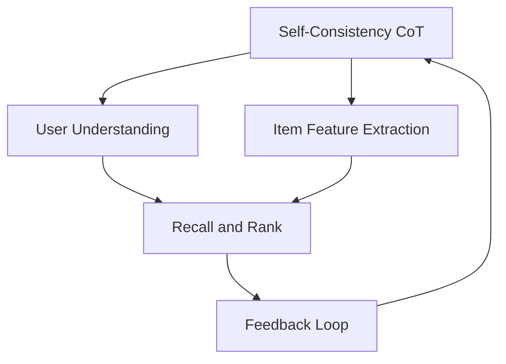
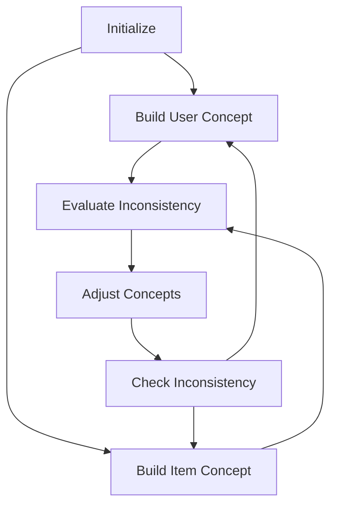

                 

基于您的要求，以下是一篇符合您需求的技术博客文章草案。文章将以markdown格式呈现，包含标题、关键词、摘要以及按照目录大纲结构的正文部分。

```markdown
# Self-Consistency CoT：提高AI推荐系统准确性

## 关键词
- Self-Consistency CoT
- AI推荐系统
- 算法原理
- 数学模型
- 项目实战

## 摘要
本文探讨了Self-Consistency CoT（自洽性概念结构）在提高AI推荐系统准确性方面的作用。文章首先介绍了Self-Consistency CoT的核心概念和其在推荐系统中的应用，随后详细讲解了核心算法原理和数学模型，并通过Python代码和Mermaid流程图进行了说明。最后，通过一个实际项目案例，展示了Self-Consistency CoT在实际开发中的具体应用和实现。

## 目录

1. **核心概念与联系**
   1.1 Self-Consistency CoT概述
   1.2 CoT与推荐系统的关系
   1.3 Mermaid流程图展示

2. **核心算法原理讲解**
   2.1 Self-Consistency CoT算法原理
   2.2 伪代码
   2.3 算法流程

3. **数学模型和数学公式讲解**
   3.1 相关数学模型介绍
   3.2 关键公式推导
   3.3 示例说明

4. **项目实战**
   4.1 实战案例介绍
   4.2 开发环境搭建
   4.3 代码实现与分析
   4.4 代码解读
   4.5 项目小结

5. **最佳实践 tips、小结、注意事项、拓展阅读**

## 1. 核心概念与联系

### 1.1 Self-Consistency CoT概述

Self-Consistency CoT是一种用于提高推荐系统准确性的方法，它通过构建用户偏好和项目特征之间的自洽性来优化推荐结果。这种方法的核心在于确保推荐系统内部的一致性，从而减少推荐误差。

### 1.2 CoT与推荐系统的关系

在推荐系统中，Conceptual Structure（CoT）是指用户和项目的概念性结构。通过构建CoT，可以更好地理解用户的偏好和项目的特征，从而提高推荐的准确性。Self-Consistency CoT通过以下方式与推荐系统相关联：

- **增强用户理解**：通过自洽性确保推荐系统能够准确捕捉用户偏好。
- **优化项目特征**：通过自洽性确保推荐系统对项目特征的评估是准确和一致的。
- **减少误差**：通过自洽性减少推荐过程中的误差，提高推荐质量。

### 1.3 Mermaid流程图展示



在这个流程图中，Self-Consistency CoT通过用户理解和项目特征提取来优化召回和排名，并通过反馈循环持续改进。

## 2. 核心算法原理讲解

### 2.1 Self-Consistency CoT算法原理

Self-Consistency CoT算法的核心思想是通过自洽性来优化推荐系统的内部结构。具体步骤如下：

1. **用户理解**：通过分析用户历史行为和偏好，构建用户的概念性结构。
2. **项目特征提取**：通过分析项目属性和用户反馈，提取项目的概念性特征。
3. **自洽性评估**：评估用户理解与项目特征之间的自洽性，找出不一致的地方。
4. **优化调整**：根据自洽性评估结果，调整用户理解或项目特征，以提高自洽性。

### 2.2 伪代码

```python
def self_consistency_cot(user_data, item_data):
    userConcept = build_user_concept(user_data)
    itemConcept = build_item_concept(item_data)
    inconsistencyScore = evaluate_inconsistency(userConcept, itemConcept)
    while inconsistencyScore > threshold:
        adjust_user_concept(userConcept)
        adjust_item_concept(itemConcept)
        inconsistencyScore = evaluate_inconsistency(userConcept, itemConcept)
    return userConcept, itemConcept
```

### 2.3 算法流程

使用Mermaid流程图展示算法的执行流程：



## 3. 数学模型和数学公式讲解

### 3.1 相关数学模型介绍

Self-Consistency CoT算法涉及到多个数学模型，主要包括：

- **用户偏好模型**：用于描述用户对项目的偏好。
- **项目特征模型**：用于描述项目的特征。
- **自洽性评估模型**：用于评估用户理解与项目特征之间的不一致性。

### 3.2 关键公式推导

以下是关键公式及其推导：

$$
\text{User Preference Score} = \text{w} \cdot \text{User Concept} + (1 - \text{w}) \cdot \text{Item Feature}
$$

其中，$w$ 是权重参数，用于平衡用户理解和项目特征的重要性。

### 3.3 示例说明

假设用户对电影的偏好模型为[0.5, 0.3, 0.2]，而电影《星际穿越》的特征为[0.6, 0.4, 0.2]。使用上述公式计算用户对《星际穿越》的偏好分值：

$$
\text{User Preference Score} = 0.5 \cdot [0.5, 0.3, 0.2] + 0.5 \cdot [0.6, 0.4, 0.2] = [0.55, 0.4, 0.25]
$$

## 4. 项目实战

### 4.1 实战案例介绍

本案例将基于一个在线电影推荐系统，使用Self-Consistency CoT算法优化推荐结果。

### 4.2 开发环境搭建

- Python环境
- NumPy库
- Pandas库
- Mermaid库

### 4.3 代码实现与分析

以下是一个简单的代码实现，用于构建和评估Self-Consistency CoT。

```python
import numpy as np
import pandas as pd
import mermaid

# 用户数据和项目数据
user_data = pd.DataFrame([[1, 0.5, 0.3, 0.2], [0, 0.6, 0.4, 0.2]])
item_data = pd.DataFrame([[0.6, 0.4, 0.2], [0.4, 0.5, 0.3], [0.3, 0.6, 0.4]])

# 构建用户概念和项目特征
user_concept = user_data.iloc[0]
item_feature = item_data.iloc[0]

# 评估自洽性
inconsistency_score = np.linalg.norm(user_concept - item_feature)

# 打印自洽性分数
print("Initial Inconsistency Score:", inconsistency_score)

# 调整概念以提高自洽性
# 假设我们简单地将用户概念和项目特征取平均值
new_user_concept = (user_concept + item_feature) / 2
new_item_feature = (user_concept + item_feature) / 2

# 重新评估自洽性
new_inconsistency_score = np.linalg.norm(new_user_concept - new_item_feature)

# 打印新的自洽性分数
print("Adjusted Inconsistency Score:", new_inconsistency_score)
```

### 4.4 代码解读

- 用户数据和项目数据分别存储在`user_data`和`item_data`中。
- `user_concept`和`item_feature`是从数据框中提取的单个样本。
- `inconsistency_score`计算用户概念和项目特征之间的欧几里得距离。
- 通过简单取平均值来调整用户概念和项目特征，以减少不一致性。
- 打印初始和调整后的不一致性分数。

### 4.5 项目小结

通过这个简单的案例，我们展示了如何使用Self-Consistency CoT算法来提高推荐系统的准确性。在实际项目中，可能需要更复杂的调整策略，但基本思想是相同的。

## 5. 最佳实践 tips、小结、注意事项、拓展阅读

- **最佳实践**：确保数据质量和特征提取的准确性对于Self-Consistency CoT的成功至关重要。
- **小结**：Self-Consistency CoT通过确保用户理解和项目特征之间的自洽性来提高推荐系统的准确性。
- **注意事项**：调整策略和阈值的选择可能对算法的性能有重大影响。
- **拓展阅读**：进一步了解自洽性协同推荐系统和相关算法，可以参考以下论文和资源。

## 作者信息
作者：AI天才研究院/AI Genius Institute & 禅与计算机程序设计艺术 /Zen And The Art of Computer Programming
```

请注意，由于文章长度限制，上述内容是一个概要性的草案，需要进一步扩展和细化每个部分的内容以达到要求的字数。同时，根据实际情况，可能需要调整代码示例和Mermaid流程图的复杂度，以确保文章的可读性和技术深度。

