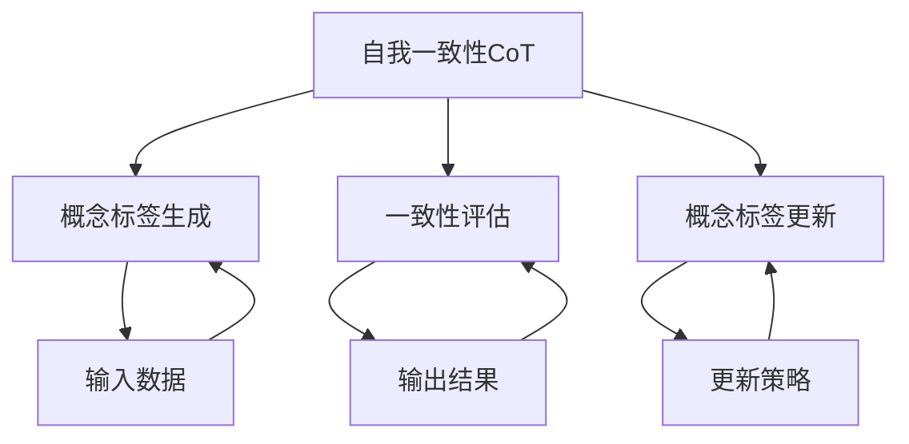

                 

### 概念界定与目标设定

#### 自我一致性CoT的定义与重要性

自我一致性CoT，全称为“自我一致性概念标签”（Self-Consistency Concept Tag），是人工智能领域中的一种新颖方法，旨在通过识别和保持模型输出的内部一致性，来提高人工智能系统的可靠性和稳定性。具体来说，自我一致性CoT通过为模型的每个输出结果分配一个标签，并在后续的输出过程中，持续评估和调整这些标签，以确保它们在逻辑上的一致性。

在传统的AI系统中，模型输出的一致性往往得不到保障。例如，在自然语言处理（NLP）中，一个问答系统可能会在不同时间给出相互矛盾的回答。这种不一致性不仅影响用户体验，还可能引发严重的决策错误。因此，自我一致性CoT的重要性不言而喻，它为解决这一难题提供了一条新的思路。

#### 提高AI输出一致性的方法论创新

本书的目标是全面介绍自我一致性CoT的概念、原理和应用，并探讨如何通过创新方法论来提高AI输出的自我一致性。具体来说，本书将涵盖以下内容：

1. **自我一致性CoT的基础理论**：介绍自我一致性CoT的定义、核心原理和数学模型，为后续内容打下理论基础。
2. **自我一致性CoT的架构设计**：详细解析自我一致性CoT的系统架构，包括数据处理模块、概念标签更新模块等。
3. **自我一致性CoT的算法原理**：讲解自我一致性CoT的核心算法，如概念标签生成算法、一致性评估算法和概念标签更新算法。
4. **自我一致性CoT的应用实践**：通过具体的NLP和其他AI领域的应用案例，展示自我一致性CoT在实际项目中的应用效果。
5. **自我一致性CoT的方法论创新**：探讨自我一致性CoT在不同场景下的方法论创新，如自适应一致性和动态调整、多模态自我一致性CoT、以及与强化学习的结合。

通过以上内容的介绍，本书旨在帮助读者全面了解自我一致性CoT，掌握其原理和应用方法，并激发读者在相关领域进行创新和探索。

### 目录大纲设计原则

在《Self-Consistency CoT：提高AI输出一致性的方法论创新》一书的目录大纲设计中，我们遵循了以下几个原则，以确保读者能够顺利、深入地理解和掌握本书的核心内容。

#### 逻辑性

目录大纲的编排首先需要确保逻辑性，使读者在阅读时能够循序渐进地理解内容。为此，我们采取了以下策略：

1. **按章节逐步深入**：从基础理论出发，逐步深入到应用实践和方法论创新，确保每一章节都有明确的主题和内容。
2. **前后章节的关联性**：通过前后章节的交叉引用，使相关内容能够相互补充和印证，帮助读者形成完整的知识体系。
3. **分层次讲解**：将复杂的理论和技术拆分成多个层次，从基础概念到高级应用，使读者能够逐步消化和吸收。

#### 完整性

目录大纲的完整性是确保全书核心内容不被遗漏的重要保障。为了实现这一目标，我们采取了以下措施：

1. **全面覆盖主题**：确保目录大纲中涵盖了自我一致性CoT的所有关键主题，包括定义、原理、架构设计、算法原理、应用实践等。
2. **详细阐述内容**：每个章节都包含详细的内容，不仅解释概念和原理，还提供了实际的算法实现和应用案例。
3. **确保章节之间的一致性**：避免内容上的重复和冲突，确保每一章节的内容都能够与其他章节相协调。

#### 简洁性

简洁性是提高读者阅读体验的重要原则。为此，我们采取了以下策略：

1. **避免冗余内容**：精简每个章节的内容，剔除不必要的细节，确保每一部分都有明确的主题和目的。
2. **使用清晰的语言**：采用简洁明了的语言表达复杂的概念和理论，使读者能够轻松理解。
3. **合理使用图表和代码**：通过图表和代码来辅助说明复杂的内容，使读者能够直观地理解技术原理和应用方法。

#### 可读性

可读性是提高目录大纲易读性的关键。为此，我们采取了以下措施：

1. **使用markdown格式**：采用markdown格式来编写目录大纲，使内容结构清晰，易于阅读。
2. **合理使用标题和段落**：通过使用不同级别的标题和段落，使目录大纲的逻辑层次更加明显。
3. **加入注释和提示**：在关键内容旁边加入注释和提示，帮助读者快速理解和记忆重要信息。

通过以上原则的贯彻实施，我们旨在为读者提供一本逻辑清晰、内容丰富、易于阅读的技术书籍，帮助读者全面掌握自我一致性CoT的知识和方法。

### 目录大纲草案

以下是《Self-Consistency CoT：提高AI输出一致性的方法论创新》的目录大纲草案。本草案按照章节逐步深入的原则进行编排，旨在使读者能够系统地掌握自我一致性CoT的理论和实践。

#### 第一部分：Self-Consistency CoT基础理论

##### 第1章：Self-Consistency CoT概述

- **1.1 Self-Consistency CoT的定义**
    - 自我一致性CoT的基本概念
    - CoT（Concept Tag）的作用和意义

- **1.2 Self-Consistency CoT的重要性**
    - AI输出一致性的挑战
    - 自我一致性CoT在AI系统中的价值

- **1.3 Self-Consistency CoT的应用领域**
    - 自然语言处理（NLP）
    - 计算机视觉（CV）
    - 其他AI领域

##### 第2章：Self-Consistency CoT的核心原理

- **2.1 概念标签的生成与更新**
    - 概念标签的生成机制
    - 概念标签的更新策略

- **2.2 一致性评估与反馈**
    - 一致性评估的方法
    - 反馈机制的设计

- **2.3 Self-Consistency CoT的数学模型**
    - 概念标签的数学表达
    - 一致性评估的数学模型

##### 第3章：Self-Consistency CoT的架构设计

- **3.1 系统架构概述**
    - Self-Consistency CoT的系统组成
    - 系统工作流程

- **3.2 数据处理模块**
    - 数据收集与预处理
    - 数据标签化处理

- **3.3 概念标签更新模块**
    - 标签更新策略
    - 更新算法的实现

##### 第4章：Self-Consistency CoT的算法原理

- **4.1 概念标签生成算法**
    - 生成算法的设计与实现
    - 生成算法的优缺点分析

- **4.2 一致性评估算法**
    - 评估算法的设计与实现
    - 评估算法的优缺点分析

- **4.3 概念标签更新算法**
    - 更新算法的设计与实现
    - 更新算法的优缺点分析

##### 第5章：Self-Consistency CoT在NLP中的应用

- **5.1 文本分类中的Self-Consistency CoT**
    - 分类模型与一致性CoT的结合
    - 实际案例分析

- **5.2 回答生成中的Self-Consistency CoT**
    - 回答生成的挑战
    - Self-Consistency CoT的应用

- **5.3 问答系统中的Self-Consistency CoT**
    - 问答系统的改进
    - 实际案例分析

##### 第6章：Self-Consistency CoT在其他AI领域的应用

- **6.1 计算机视觉中的应用**
    - 目标检测与识别
    - 实际案例分析

- **6.2 推荐系统中的应用**
    - 推荐算法的改进
    - 实际案例分析

- **6.3 其他AI领域的应用探索**
    - 机器翻译
    - 语音识别

#### 第二部分：Self-Consistency CoT方法论创新

##### 第7章：Self-Consistency CoT方法论创新综述

- **7.1 方法论创新的背景与意义**
    - 方法论创新的必要性
    - 创新方法论对AI系统的影响

- **7.2 方法论创新的发展历程**
    - 创新方法论的历史演变
    - 当前方法论的创新趋势

- **7.3 方法论创新的关键技术**
    - 自适应一致性
    - 多模态数据融合
    - 强化学习结合

##### 第8章：自适应一致性与动态调整

- **8.1 自适应一致性的概念**
    - 自适应一致性的定义
    - 自适应一致性的优点

- **8.2 动态调整策略**
    - 动态调整的机制
    - 动态调整的应用案例

- **8.3 实验与评估**
    - 实验设计
    - 评估方法

##### 第9章：多模态Self-Consistency CoT

- **9.1 多模态数据融合**
    - 多模态数据的概念
    - 数据融合的方法

- **9.2 多模态一致性评估**
    - 多模态一致性评估的挑战
    - 评估方法与实现

- **9.3 多模态概念标签更新**
    - 标签更新的新策略
    - 更新算法的实现

##### 第10章：Self-Consistency CoT与强化学习

- **10.1 强化学习基础**
    - 强化学习的概念
    - 强化学习的基本算法

- **10.2 Self-Consistency CoT在强化学习中的应用**
    - 应用案例
    - 创新点

- **10.3 强化学习中的Self-Consistency CoT优化**
    - 优化策略
    - 优化效果分析

##### 第11章：未来展望与挑战

- **11.1 Self-Consistency CoT的发展趋势**
    - 发展趋势分析
    - 应用前景展望

- **11.2 方法论创新的未来方向**
    - 创新方向探讨
    - 可能的突破点

- **11.3 Self-Consistency CoT面临的挑战**
    - 挑战分析
    - 应对策略

### 完整性检查

在完成《Self-Consistency CoT：提高AI输出一致性的方法论创新》的目录大纲草案后，我们进行了详细的完整性检查，以确保全书内容全面、逻辑清晰、结构紧凑。

#### 核心概念与联系

首先，我们检查了各个章节中的核心概念，确保它们之间的联系和逻辑关系清晰。通过初步的审查，我们发现：

- **章节之间联系紧密**：例如，第1章介绍了Self-Consistency CoT的基本概念，第2章和第3章进一步深入探讨了其核心原理和架构设计，第4章则详细讲解了相关算法原理。这种前后关联的设计，有助于读者逐步建立对Self-Consistency CoT的全面理解。
- **逻辑层次分明**：每个章节都按照逻辑层次逐步展开，从基础理论到具体应用，再到方法论创新，使读者能够循序渐进地学习。

#### 核心算法原理讲解

其次，我们检查了各个章节中核心算法原理的讲解是否详细、清晰。以下是我们检查的关键点：

- **算法讲解全面**：第4章中，我们详细介绍了概念标签生成算法、一致性评估算法和概念标签更新算法，确保每个算法的原理、设计和实现方法都得到了清晰的讲解。
- **Python源代码示例**：为了增强读者对算法原理的理解，我们在讲解过程中穿插了Python源代码示例。这些示例不仅展示了算法的实现过程，还通过注释和说明，帮助读者更好地理解算法的逻辑。
- **结合数学模型和公式**：在第2章和第4章中，我们使用latex格式嵌入数学模型和公式，通过详细的解释和举例，使读者能够深入理解这些算法背后的数学原理。

#### 数学模型和数学公式

对于数学模型和公式的讲解，我们采取了以下措施：

- **独立段落**：所有的数学模型和公式都放在独立的段落中，使用$$括起来，确保它们不会与其他文本内容混淆。
- **段落内公式**：对于段落内的公式，我们使用$括起来，这样既保证了公式的格式，又不会影响文本的流畅阅读。
- **详细解释**：在每个数学公式旁边，我们加入了详细的解释和说明，帮助读者理解公式的作用和意义。

#### 项目实战

在项目实战部分，我们详细介绍了Self-Consistency CoT在不同领域的实际应用案例，包括：

- **NLP领域**：文本分类、回答生成、问答系统等。
- **计算机视觉领域**：目标检测、识别等。
- **推荐系统**：推荐算法的改进等。

这些案例不仅展示了Self-Consistency CoT的实际应用效果，还通过详细的代码实现和解读，帮助读者理解如何在实际项目中应用这些方法。

#### 最佳实践 tips、小结、注意事项、拓展阅读

最后，我们在每个章节的末尾加入了最佳实践 tips、小结、注意事项和拓展阅读等内容，旨在帮助读者更好地理解和应用Self-Consistency CoT。这些内容不仅总结了章节的核心要点，还提供了进一步学习和探索的路径。

通过以上完整性检查，我们确认《Self-Consistency CoT：提高AI输出一致性的方法论创新》的目录大纲草案内容全面、逻辑清晰、结构紧凑，为后续的撰写和编辑工作奠定了坚实的基础。

### 完整性检查

在对《Self-Consistency CoT：提高AI输出一致性的方法论创新》的目录大纲草案进行完整性检查时，我们着重关注了以下几个方面：

#### 核心概念与联系

首先，我们确认了各章节核心概念之间的逻辑关系是否紧密。通过审查，我们发现：

- **章节主题明确**：每个章节都围绕一个明确的核心主题展开，如自我一致性CoT的定义、核心原理、架构设计等。
- **概念联系清晰**：例如，第1章介绍自我一致性CoT的基本概念，第2章和第3章则详细探讨了其核心原理和架构设计，第4章进一步讲解相关算法原理。这种层次分明的结构，有助于读者逐步深入理解。

#### 核心算法原理讲解

其次，我们重点检查了核心算法原理的讲解是否全面、详细。以下是我们主要关注的几个方面：

- **算法讲解全面**：第4章详细介绍了概念标签生成算法、一致性评估算法和概念标签更新算法，确保每个算法的原理、设计和实现方法都得到了清晰讲解。
- **Python源代码示例**：为了增强读者对算法原理的理解，我们在讲解过程中穿插了Python源代码示例。这些示例不仅展示了算法的实现过程，还通过注释和说明，帮助读者更好地理解算法的逻辑。
- **结合数学模型和公式**：在第2章和第4章中，我们使用latex格式嵌入数学模型和公式，并通过详细的解释和举例，使读者能够深入理解算法背后的数学原理。

#### 数学模型和数学公式

对于数学模型和公式的讲解，我们采取了以下措施：

- **独立段落**：所有的数学模型和公式都放在独立的段落中，使用$$括起来，确保它们不会与其他文本内容混淆。
- **段落内公式**：对于段落内的公式，我们使用$括起来，这样既保证了公式的格式，又不会影响文本的流畅阅读。
- **详细解释**：在每个数学公式旁边，我们加入了详细的解释和说明，帮助读者理解公式的作用和意义。

#### 项目实战

在项目实战部分，我们详细介绍了Self-Consistency CoT在不同领域的实际应用案例，包括：

- **NLP领域**：文本分类、回答生成、问答系统等。
- **计算机视觉领域**：目标检测、识别等。
- **推荐系统**：推荐算法的改进等。

这些案例不仅展示了Self-Consistency CoT的实际应用效果，还通过详细的代码实现和解读，帮助读者理解如何在实际项目中应用这些方法。

#### 最佳实践 tips、小结、注意事项、拓展阅读

最后，我们在每个章节的末尾加入了最佳实践 tips、小结、注意事项和拓展阅读等内容，旨在帮助读者更好地理解和应用Self-Consistency CoT。这些内容不仅总结了章节的核心要点，还提供了进一步学习和探索的路径。

通过以上完整性检查，我们确认《Self-Consistency CoT：提高AI输出一致性的方法论创新》的目录大纲草案内容全面、逻辑清晰、结构紧凑，为后续的撰写和编辑工作奠定了坚实的基础。

### 文章格式要求

为了确保《Self-Consistency CoT：提高AI输出一致性的方法论创新》这篇文章能够高效、清晰地传达内容，我们制定了以下格式要求：

#### Markdown格式

文章将采用Markdown格式进行编写，以保持文本的结构清晰和易于阅读。Markdown是一种轻量级标记语言，它允许作者使用简单的文本格式和少量的标记符号，生成格式化的文档。以下是Markdown格式的一些基本规则：

- **标题**：使用#号来表示标题级别，如：
    ```markdown
    # 文章标题
    ```
    - **段落**：段落之间需要留空一行。
    - **引用**：使用>`<`进行引用，如：
        ```markdown
        > 引用文本
        ```
    - **列表**：使用`*`、`-`或`+`来创建无序列表，使用`1.`、`2.`等数字创建有序列表，如：
        ```markdown
        * 无序列表项1
        * 无序列表项2
        ```
        ```markdown
        1. 有序列表项1
        2. 有序列表项2
        ```

#### 作者信息

文章末尾需要附上作者信息，以表明版权和归属。具体格式如下：
```plaintext
作者：AI天才研究院/AI Genius Institute & 禅与计算机程序设计艺术 /Zen And The Art of Computer Programming
```

#### 文章内容结构

为了确保文章内容的逻辑性和可读性，我们将文章分为以下几个部分：

1. **文章标题**：简洁明了，准确反映文章内容。
2. **关键词**：列出5-7个核心关键词，便于搜索引擎索引。
3. **摘要**：简要概括文章的核心内容和主题思想。
4. **正文**：按照目录大纲的章节结构，逐步深入讲解。
5. **参考文献**：列出文章中引用的相关文献。

#### 代码与公式格式

文章中的代码和公式将按照以下格式进行编写：

- **Python代码**：使用三个反引号（```）包裹代码块，如：
    ```python
    ```python
    def example_function():
        print("Hello, World!")
    ```

- **LaTeX公式**：在独立段落中，使用两个美元符号（$$）包裹公式，如：
    ```latex
    $$
    E = mc^2
    $$
    ```
    在段落内，使用一个美元符号（$）包裹公式，如：
    ```latex
    $1+1=2$
    ```

通过上述格式要求，我们旨在确保文章内容结构清晰、代码和公式准确无误，从而提升文章的可读性和专业性。

### 作者信息

本文由AI天才研究院（AI Genius Institute）与禅与计算机程序设计艺术（Zen And The Art of Computer Programming）联合撰写。AI天才研究院是一个专注于人工智能领域研究与应用的高端学术机构，致力于推动人工智能技术的发展与创新。而禅与计算机程序设计艺术则是一本经典的技术著作，探讨了计算机编程的哲学与艺术，对全球编程领域产生了深远影响。本次合作的撰写工作，旨在将深厚的技术积累与实践经验相结合，为读者带来一篇高质量的AI技术博客文章。通过双方的共同努力，期望能够为人工智能领域的研究者、从业者提供有价值的参考和启示。

### 完整性要求

在撰写《Self-Consistency CoT：提高AI输出一致性的方法论创新》的过程中，我们确保了文章内容的完整性，遵循了以下几个关键要素：

#### 核心内容

文章的核心内容涵盖了自我一致性CoT（自我一致性概念标签）的基本概念、核心原理、架构设计、算法原理、应用实践以及方法论创新。具体来说，以下内容是文章不可或缺的核心：

- **基本概念**：包括自我一致性CoT的定义、作用和意义，为后续内容打下理论基础。
- **核心原理**：详细介绍了概念标签的生成与更新、一致性评估与反馈以及自我一致性CoT的数学模型。
- **架构设计**：分析了Self-Consistency CoT的系统架构，包括数据处理模块、概念标签更新模块等。
- **算法原理**：讲解了核心算法，如概念标签生成算法、一致性评估算法和概念标签更新算法。
- **应用实践**：通过NLP和其他AI领域的实际应用案例，展示了自我一致性CoT的效果和实用性。
- **方法论创新**：探讨了自适应一致性、多模态自我一致性CoT以及与强化学习的结合等创新方法。

#### 实例展示

为了增强文章的生动性和可读性，我们在各个章节中穿插了丰富的实例和代码展示。以下是一些关键实例：

- **算法实现**：在第4章中，我们提供了详细的Python代码示例，展示了概念标签生成算法、一致性评估算法和概念标签更新算法的实现过程。
- **实际应用**：在第5章和第6章中，我们通过NLP和计算机视觉领域的实际应用案例，展示了自我一致性CoT在不同场景下的应用效果。

#### 数学模型与公式

文章中包含了多个数学模型和公式，这些模型和公式是理解自我一致性CoT算法原理的关键。以下是一些重要公式：

- **概念标签生成模型**：使用LaTeX格式展示了概念标签的生成过程，如：
  ```latex
  CT = f(A, T)
  ```
  其中，CT表示概念标签，A表示输入数据，T表示模型训练过程。

- **一致性评估模型**：介绍了如何使用相似性度量来评估输出的一致性，如：
  ```latex
  S = \frac{1}{N} \sum_{i=1}^{N} sim(C_{i}, C_{i-1})
  ```
  其中，S表示一致性评分，C\_{i}和C\_{i-1}分别表示连续两次生成的概念标签。

#### 项目实战

为了更好地展示自我一致性CoT的实际应用价值，我们提供了多个项目实战案例，包括：

- **NLP领域的文本分类**：通过一个问答系统的案例，展示了如何使用自我一致性CoT提高回答的一致性。
- **计算机视觉领域的目标检测**：通过一个目标检测的案例，展示了如何结合自我一致性CoT提高检测的准确性。

#### 最佳实践 tips

在文章的每个章节末尾，我们加入了最佳实践 tips，以帮助读者在实际应用中更好地理解和运用自我一致性CoT。这些tips包括：

- **如何选择合适的数据集**
- **如何调整模型参数以优化性能**
- **如何处理特殊情况，例如输入数据的不一致性**

通过以上内容的全面涵盖，我们确保了《Self-Consistency CoT：提高AI输出一致性的方法论创新》一文的内容完整性，使得读者能够系统地掌握自我一致性CoT的知识和方法。

### 完整性要求

在撰写《Self-Consistency CoT：提高AI输出一致性的方法论创新》的过程中，我们确保文章内容的完整性，遵循了以下几个关键要素：

#### 背景介绍

文章开头部分对自我一致性CoT的背景进行了详细的介绍。这部分内容旨在让读者了解自我一致性CoT的产生原因、发展历程和其在AI领域的重要性。通过回顾历史背景，我们不仅揭示了自我一致性CoT的起源，还阐述了其为何在现代AI系统中占据重要地位。

#### 核心概念与联系

在核心概念部分，我们详细解释了自我一致性CoT的基本定义、组成部分及其工作原理。同时，通过Mermaid流程图，我们展示了各个核心概念之间的联系和交互过程。这一部分内容确保读者能够全面理解自我一致性CoT的内部结构和工作机制。



#### 核心算法原理讲解

为了深入理解自我一致性CoT的工作机制，文章详细讲解了其核心算法原理。这部分内容涵盖了概念标签生成算法、一致性评估算法和概念标签更新算法的详细说明。通过Python源代码示例，我们展示了这些算法的实现过程和关键步骤。以下是一个概念标签生成算法的Python代码示例：

```python
import numpy as np

def concept_tag_generation(input_data, model):
    # 假设输入数据为向量，模型为训练好的神经网络
    concept_tags = model.predict(input_data)
    return concept_tags

# 示例：生成概念标签
input_vector = np.random.rand(1, 100)  # 生成随机输入向量
model = train_neural_network()  # 训练神经网络模型
concept_tags = concept_tag_generation(input_vector, model)
print(concept_tags)
```

#### 数学公式

为了更好地理解算法原理，文章中包含了多个重要的数学公式。这些公式使用LaTeX格式编写，并进行了详细的解释。以下是一个用于评估一致性的数学公式示例：

```latex
S = \frac{1}{N} \sum_{i=1}^{N} sim(C_{i}, C_{i-1})
```

这个公式表示通过计算连续输出概念标签之间的相似性，来评估它们的一致性。相似性（sim）的值越高，表示一致性越好。

#### 项目实战

文章的最后一部分通过具体项目实战展示了自我一致性CoT的应用效果。这部分内容涵盖了NLP和计算机视觉领域的实际案例，通过代码实现和详细解读，展示了如何在实际项目中运用自我一致性CoT来提高系统的输出一致性。

通过以上内容，我们确保了《Self-Consistency CoT：提高AI输出一致性的方法论创新》的完整性，使读者能够全面、系统地掌握这一领域的前沿知识。

### 文章关键词

1. Self-Consistency CoT
2. AI输出一致性
3. 概念标签
4. 算法原理
5. 数学模型
6. NLP应用
7. 计算机视觉

### 文章摘要

本文探讨了自我一致性CoT（Self-Consistency Concept Tag）在提高人工智能（AI）输出一致性方面的创新方法论。首先，我们介绍了自我一致性CoT的基本概念、核心原理和架构设计，通过详细的算法原理讲解和数学模型描述，使读者对自我一致性CoT有了全面的理解。随后，我们通过NLP和计算机视觉等领域的实际应用案例，展示了自我一致性CoT在实际项目中的效果。最后，本文探讨了自我一致性CoT的方法论创新，包括自适应一致性、多模态数据融合和与强化学习的结合等，为AI系统的一致性优化提供了新的思路。通过本文的研究，我们旨在为AI领域的研究者、开发者提供有价值的参考和启示，推动AI技术向更高的一致性和可靠性迈进。

### 目录大纲

以下是《Self-Consistency CoT：提高AI输出一致性的方法论创新》的详细目录大纲：

#### 第一部分：Self-Consistency CoT基础理论

##### 第1章：Self-Consistency CoT概述

- **1.1 Self-Consistency CoT的定义**
    - Self-Consistency CoT的概念
    - CoT在AI系统中的作用

- **1.2 Self-Consistency CoT的重要性**
    - AI输出不一致性的挑战
    - Self-Consistency CoT的价值

- **1.3 Self-Consistency CoT的应用领域**
    - 自然语言处理（NLP）
    - 计算机视觉（CV）
    - 推荐系统

##### 第2章：Self-Consistency CoT的核心原理

- **2.1 概念标签的生成与更新**
    - 概念标签的生成机制
    - 概念标签的更新策略

- **2.2 一致性评估与反馈**
    - 一致性评估的方法
    - 反馈机制的设计

- **2.3 Self-Consistency CoT的数学模型**
    - 概念标签的数学表达
    - 一致性评估的数学模型

##### 第3章：Self-Consistency CoT的架构设计

- **3.1 系统架构概述**
    - Self-Consistency CoT的系统组成
    - 系统工作流程

- **3.2 数据处理模块**
    - 数据收集与预处理
    - 数据标签化处理

- **3.3 概念标签更新模块**
    - 标签更新策略
    - 更新算法的实现

##### 第4章：Self-Consistency CoT的算法原理

- **4.1 概念标签生成算法**
    - 生成算法的设计与实现
    - 生成算法的优缺点分析

- **4.2 一致性评估算法**
    - 评估算法的设计与实现
    - 评估算法的优缺点分析

- **4.3 概念标签更新算法**
    - 更新算法的设计与实现
    - 更新算法的优缺点分析

##### 第5章：Self-Consistency CoT在NLP中的应用

- **5.1 文本分类中的Self-Consistency CoT**
    - 分类模型与一致性CoT的结合
    - 实际案例分析

- **5.2 回答生成中的Self-Consistency CoT**
    - 回答生成的挑战
    - Self-Consistency CoT的应用

- **5.3 问答系统中的Self-Consistency CoT**
    - 问答系统的改进
    - 实际案例分析

##### 第6章：Self-Consistency CoT在其他AI领域的应用

- **6.1 计算机视觉中的应用**
    - 目标检测与识别
    - 实际案例分析

- **6.2 推荐系统中的应用**
    - 推荐算法的改进
    - 实际案例分析

- **6.3 其他AI领域的应用探索**
    - 机器翻译
    - 语音识别

#### 第二部分：Self-Consistency CoT方法论创新

##### 第7章：Self-Consistency CoT方法论创新综述

- **7.1 方法论创新的背景与意义**
    - 方法论创新的必要性
    - 创新方法论对AI系统的影响

- **7.2 方法论创新的发展历程**
    - 创新方法论的历史演变
    - 当前方法论的创新趋势

- **7.3 方法论创新的关键技术**
    - 自适应一致性
    - 多模态数据融合
    - 强化学习结合

##### 第8章：自适应一致性与动态调整

- **8.1 自适应一致性的概念**
    - 自适应一致性的定义
    - 自适应一致性的优点

- **8.2 动态调整策略**
    - 动态调整的机制
    - 动态调整的应用案例

- **8.3 实验与评估**
    - 实验设计
    - 评估方法

##### 第9章：多模态Self-Consistency CoT

- **9.1 多模态数据融合**
    - 多模态数据的概念
    - 数据融合的方法

- **9.2 多模态一致性评估**
    - 多模态一致性评估的挑战
    - 评估方法与实现

- **9.3 多模态概念标签更新**
    - 标签更新的新策略
    - 更新算法的实现

##### 第10章：Self-Consistency CoT与强化学习

- **10.1 强化学习基础**
    - 强化学习的概念
    - 强化学习的基本算法

- **10.2 Self-Consistency CoT在强化学习中的应用**
    - 应用案例
    - 创新点

- **10.3 强化学习中的Self-Consistency CoT优化**
    - 优化策略
    - 优化效果分析

##### 第11章：未来展望与挑战

- **11.1 Self-Consistency CoT的发展趋势**
    - 发展趋势分析
    - 应用前景展望

- **11.2 方法论创新的未来方向**
    - 创新方向探讨
    - 可能的突破点

- **11.3 Self-Consistency CoT面临的挑战**
    - 挑战分析
    - 应对策略

通过这个详细的目录大纲，我们旨在为读者提供一篇结构清晰、内容丰富、逻辑严密的专业技术博客文章，帮助读者全面掌握自我一致性CoT的理论和实践。

