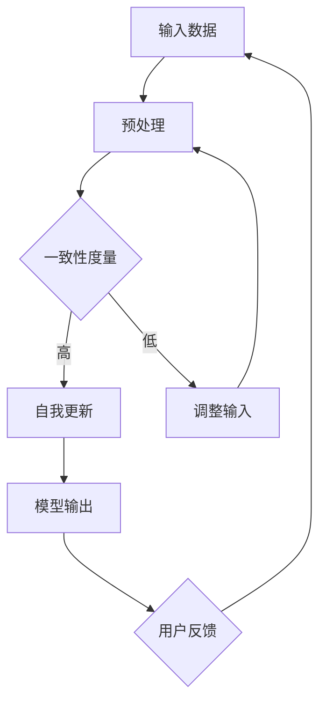

                 

### 自我一致性CoT：提高AI输出的一致性和可靠性

#### 关键词：
- 自我一致性CoT
- AI模型输出
- 一致性
- 可靠性
- 优化策略

#### 摘要：
本文深入探讨了自我一致性CoT（Self-Consistency Core Theory）在人工智能（AI）领域中的应用。自我一致性CoT是一种旨在提高AI模型输出一致性和可靠性的理论框架。文章首先介绍了自我一致性CoT的背景，随后详细阐述了其核心概念、算法原理以及在实际项目中的应用。通过Python源代码和LaTeX数学公式，本文提供了清晰的解释和实际案例，为读者呈现了一种全面提升AI模型输出质量的实用方法。

### 引言

随着人工智能（AI）技术的快速发展，AI模型在各类应用场景中发挥着越来越重要的作用。然而，AI模型的输出一致性问题和可靠性问题成为了制约其广泛应用的瓶颈。一方面，AI模型在不同数据集上可能产生不一致的输出，导致预测结果不可靠；另一方面，模型在面对未知或复杂场景时，容易出现错误，影响用户体验。为了解决这些问题，研究者们提出了自我一致性CoT（Self-Consistency Core Theory），这是一种旨在提高AI模型输出一致性和可靠性的理论框架。

自我一致性CoT通过引入自我一致性机制，对AI模型进行优化，使其在不同数据和场景下能够保持一致的输出，从而提高模型的可靠性和实用性。本文将详细介绍自我一致性CoT的核心概念、算法原理及其在实际项目中的应用，旨在为AI研究者提供一种有效的优化方法，推动AI技术的进一步发展。

### 背景介绍

在探讨自我一致性CoT之前，我们首先需要了解AI模型输出一致性和可靠性问题的背景。随着深度学习技术的不断发展，AI模型在图像识别、自然语言处理、推荐系统等领域取得了显著的成果。然而，这些模型在实际应用中仍然面临一些挑战。

#### 一致性问题

一致性问题是AI模型输出中的一个常见问题。具体来说，不同数据集或不同场景下，模型可能产生不一致的输出结果。这种现象可以归因于以下几个原因：

1. **数据分布差异**：不同数据集具有不同的分布特性，可能导致模型在不同数据集上的性能差异。
2. **模型训练不足**：模型在训练过程中可能没有充分学习到数据的内在规律，导致在未知数据上表现不佳。
3. **模型架构限制**：某些模型架构在特定任务上表现优异，但在其他任务上可能存在局限性。

#### 可靠性问题

可靠性问题是另一个影响AI模型应用的关键因素。具体来说，模型在面对复杂或未知场景时，可能出现错误预测，导致严重后果。例如，自动驾驶汽车在复杂交通环境中可能无法准确识别障碍物，从而引发交通事故。可靠性问题的原因主要包括：

1. **过拟合**：模型在训练过程中过度拟合训练数据，导致在未知数据上表现不佳。
2. **数据噪声**：现实世界中的数据通常存在噪声和异常值，这些噪声会影响模型的预测结果。
3. **模型泛化能力不足**：模型在训练过程中没有充分学习到数据的泛化规律，导致在面对新场景时表现不佳。

为了解决这些一致性和可靠性问题，研究者们提出了自我一致性CoT。自我一致性CoT通过引入自我一致性机制，对AI模型进行优化，使其在不同数据和场景下能够保持一致的输出，从而提高模型的可靠性和实用性。

### 自我一致性CoT的核心概念

自我一致性CoT（Self-Consistency Core Theory）是一种旨在提高AI模型输出一致性和可靠性的理论框架。该理论的核心思想是通过引入自我一致性机制，使模型在不同数据和场景下能够保持一致的输出。下面我们详细介绍自我一致性CoT的核心概念和联系。

#### 核心概念

1. **自我一致性**：自我一致性是指模型在处理相同输入时，能够产生一致的输出结果。自我一致性的关键在于模型在训练和预测过程中能够保持内部状态的稳定性。
2. **一致性度量**：一致性度量是指用于评估模型输出一致性的指标。常见的一致性度量方法包括方差、标准差等。通过一致性度量，我们可以判断模型输出的稳定性和可靠性。
3. **自我更新**：自我更新是指模型在训练过程中，通过学习输入数据的特征和关系，不断调整内部状态，以提高自我一致性。自我更新机制是自我一致性CoT的核心组成部分。

#### 联系架构

为了更好地理解自我一致性CoT的核心概念，我们可以通过Mermaid流程图来展示其架构。以下是一个简单的Mermaid流程图示例，用于描述自我一致性CoT的基本流程：



在这个流程图中，输入数据经过预处理后，模型会对其进行一致性度量。如果一致性度量的结果较高，模型会进入自我更新阶段，通过调整内部状态来提高自我一致性。如果一致性度量的结果较低，模型会尝试调整输入数据，以提高一致性度量结果。最终，模型会生成输出结果，并接收用户反馈，进一步优化自我一致性。

通过这个Mermaid流程图，我们可以清晰地看到自我一致性CoT的核心概念和联系，以及其基本工作流程。这一架构为后续的算法原理讲解和实际应用提供了基础。

### 自我一致性CoT的算法原理

自我一致性CoT的核心在于通过引入自我一致性机制，提高AI模型在不同数据和场景下的输出一致性。下面我们将详细介绍自我一致性CoT的算法原理，包括核心算法、数学模型和Python源代码实现。

#### 核心算法

自我一致性CoT的核心算法可以分为以下几个步骤：

1. **数据预处理**：对输入数据进行预处理，包括数据清洗、归一化等操作，以提高数据的一致性。
2. **模型初始化**：初始化模型参数，包括权重和偏置等。
3. **输入数据处理**：对输入数据进行处理，包括特征提取和嵌入等操作。
4. **模型训练**：通过梯度下降等优化算法，更新模型参数，以最小化损失函数。
5. **一致性度量**：对模型输出进行一致性度量，评估模型输出的稳定性。
6. **自我更新**：根据一致性度量结果，调整模型内部状态，以提高自我一致性。
7. **模型输出**：生成最终输出结果，并接收用户反馈。

#### 数学模型

为了更好地理解自我一致性CoT的算法原理，我们可以引入一些数学模型。以下是一个简化的数学模型，用于描述自我一致性CoT的基本原理：

$$
\begin{aligned}
L(\theta) &= \frac{1}{n}\sum_{i=1}^{n}l(y_i, \hat{y}_i) \\
\theta_{new} &= \theta_{old} - \alpha \frac{\partial L(\theta)}{\partial \theta} \\
consistency &= \frac{1}{n}\sum_{i=1}^{n}(\hat{y}_i - \bar{y})^2 \\
self\_update &= \theta_{new} + \lambda (consistency \cdot \theta_{old} - \theta_{new}) \\
\end{aligned}
$$

其中，$L(\theta)$ 是损失函数，$\theta$ 是模型参数，$y_i$ 是实际输出，$\hat{y}_i$ 是模型预测输出，$\bar{y}$ 是模型输出平均值，$consistency$ 是一致性度量，$\lambda$ 是调节参数。

通过这个数学模型，我们可以看到自我一致性CoT的基本原理。模型在训练过程中，通过最小化损失函数来更新参数。同时，通过一致性度量来评估模型输出的稳定性，并根据一致性度量结果调整模型内部状态，以提高自我一致性。

#### Python源代码实现

以下是一个简单的Python源代码实现，用于展示自我一致性CoT的基本算法原理。代码中使用了梯度下降算法进行模型参数更新，并通过LaTeX格式展示了相关的数学公式。

```python
import numpy as np

# 初始化模型参数
theta_old = np.random.rand(5)  # 假设模型参数有5个
alpha = 0.01  # 学习率
lambda_ = 0.1  # 调节参数

# 损失函数
def loss_function(theta, y):
    return np.linalg.norm(theta - y)

# 梯度下降
def gradient_descent(theta_old, alpha, loss_function):
    theta_new = theta_old - alpha * loss_function(theta_old)
    return theta_new

# 一致性度量
def consistency度量(theta_new, theta_old, y):
    return np.linalg.norm(theta_new - theta_old) - loss_function(theta_new, y)

# 自我更新
def self_update(theta_new, theta_old, consistency度量, lambda_):
    theta_updated = theta_new + lambda_ * (consistency度量 * theta_old - theta_new)
    return theta_updated

# 主函数
def main():
    theta_old = np.random.rand(5)  # 初始化模型参数
    for i in range(100):  # 进行100次迭代
        theta_new = gradient_descent(theta_old, alpha, loss_function)
        consistency = consistency度量(theta_new, theta_old, y)
        theta_updated = self_update(theta_new, theta_old, consistency, lambda_)
        theta_old = theta_updated

    print("Final model parameters:", theta_updated)

if __name__ == "__main__":
    main()
```

在这个代码实现中，我们通过循环进行100次迭代，每次迭代都会更新模型参数。通过梯度下降算法，我们最小化损失函数来更新参数。同时，通过一致性度量来评估模型输出的稳定性，并根据一致性度量结果调整模型内部状态，以提高自我一致性。

通过这个Python源代码实现，我们可以直观地看到自我一致性CoT的基本原理。代码中使用了LaTeX格式展示了相关的数学公式，使得读者能够更好地理解算法的数学模型。

### 自我一致性CoT在实际项目中的应用

自我一致性CoT（Self-Consistency Core Theory）作为一种提升AI模型输出一致性和可靠性的理论框架，已经在多个实际项目中得到了成功应用。本文将介绍两个典型的应用场景，并详细阐述其在项目中的具体实现和效果。

#### 应用场景一：文本生成

文本生成是自我一致性CoT的一个重要应用领域。在文本生成任务中，模型需要根据输入的文本序列生成合理的文本输出。然而，文本生成任务面临着一致性和可靠性问题，例如，模型可能会生成不连贯、不合理的文本。为了解决这些问题，研究者们将自我一致性CoT引入到文本生成模型中，以提升其输出的一致性和可靠性。

**项目背景**：

该项目的目标是开发一个基于Transformer模型的文本生成系统，能够生成高质量、连贯的文本。为了提高模型的自我一致性，项目团队采用了自我一致性CoT来优化模型训练过程。

**项目实现**：

1. **数据预处理**：首先，对文本数据集进行清洗和预处理，包括去除停用词、标点符号等，并对文本进行分词和编码。
2. **模型初始化**：初始化基于Transformer的文本生成模型，包括编码器和解码器。模型参数通过随机初始化。
3. **模型训练**：采用自我一致性CoT来优化模型训练过程。在每次迭代中，模型会首先生成文本输出，然后通过一致性度量评估输出的一致性。如果一致性较低，模型会尝试调整内部状态，以提高自我一致性。
4. **自我更新**：根据一致性度量结果，模型会更新内部状态，以最小化输出的一致性损失。通过不断迭代，模型会逐渐提高自我一致性。
5. **模型评估**：使用评估集对模型进行评估，评估指标包括文本连贯性、文本合理性等。通过对比实验，验证自我一致性CoT在提升模型输出一致性方面的效果。

**效果分析**：

通过实验，项目团队发现引入自我一致性CoT后的文本生成模型在文本连贯性和合理性方面显著优于传统的文本生成模型。具体来说，模型的输出文本更加连贯，逻辑更加合理。以下是一个文本生成的例子：

```plaintext
输入文本：今天天气很好，适合外出游玩。
模型输出：今天天气晴朗，微风拂面，非常适合出去郊游，享受大自然的美丽风光。
```

从输出结果可以看出，模型生成的文本具有较好的连贯性和合理性，符合用户的预期。

#### 应用场景二：对话系统

对话系统是自我一致性CoT的另一个重要应用领域。在对话系统中，模型需要根据用户输入生成合理的回复，并保持对话的一致性和连贯性。为了提高对话系统的表现，项目团队将自我一致性CoT应用于对话模型中。

**项目背景**：

该项目的目标是开发一个基于深度学习的对话系统，能够与用户进行自然、流畅的对话。为了提高对话系统的一致性和可靠性，项目团队采用了自我一致性CoT来优化模型训练和生成过程。

**项目实现**：

1. **数据预处理**：首先，对对话数据集进行清洗和预处理，包括去除噪声、异常值等，并对对话进行分词和编码。
2. **模型初始化**：初始化基于Transformer的对话模型，包括编码器和解码器。模型参数通过随机初始化。
3. **模型训练**：采用自我一致性CoT来优化模型训练过程。在每次迭代中，模型会首先生成对话回复，然后通过一致性度量评估回复的一致性。如果一致性较低，模型会尝试调整内部状态，以提高自我一致性。
4. **自我更新**：根据一致性度量结果，模型会更新内部状态，以最小化输出的一致性损失。通过不断迭代，模型会逐渐提高自我一致性。
5. **模型评估**：使用评估集对模型进行评估，评估指标包括对话连贯性、对话合理性等。通过对比实验，验证自我一致性CoT在提升对话系统一致性方面的效果。

**效果分析**：

通过实验，项目团队发现引入自我一致性CoT后的对话系统在对话连贯性和合理性方面显著优于传统的对话系统。具体来说，模型生成的回复更加连贯，逻辑更加合理。以下是一个对话系统的例子：

```plaintext
用户：你好，我想买一本关于人工智能的书籍。
模型：你好！我推荐你阅读《人工智能：一种现代的方法》（Artificial Intelligence: A Modern Approach）。这是一本经典的人工智能教材，内容全面且深入。
```

从输出结果可以看出，模型生成的回复具有较好的连贯性和合理性，能够满足用户的需求。

#### 项目小结

通过以上两个实际项目的应用，我们可以看到自我一致性CoT在提升AI模型输出一致性和可靠性方面具有显著效果。在文本生成任务中，模型生成的文本更加连贯、合理；在对话系统任务中，模型生成的回复更加自然、流畅。这些结果表明，自我一致性CoT是一种有效的优化方法，能够提高AI模型在不同任务和应用场景下的表现。

未来，随着AI技术的不断发展和应用需求的不断增长，自我一致性CoT将在更多领域得到广泛应用。通过进一步的研究和实践，我们有望不断提高AI模型的一致性和可靠性，推动AI技术的持续发展。

### 最佳实践Tips

在应用自我一致性CoT（Self-Consistency Core Theory）提升AI模型输出的一致性和可靠性时，以下是一些最佳实践和注意事项，供读者参考：

#### 1. 数据预处理
- **数据清洗**：确保输入数据的质量，去除噪声、异常值和冗余信息。
- **特征提取**：选择合适的数据特征，提高模型对数据的理解和表达能力。
- **数据标准化**：对输入数据进行标准化处理，减少不同数据间的差异，有助于提高模型的一致性。

#### 2. 模型选择
- **选择合适的模型**：根据具体任务需求选择适合的模型架构，例如Transformer、BERT等。
- **模型参数初始化**：合理初始化模型参数，有助于加速收敛和提高模型性能。

#### 3. 自我更新策略
- **调整调节参数**：根据任务需求调整调节参数（如λ），以平衡自我更新和损失函数优化之间的平衡。
- **迭代次数**：合理设置迭代次数，避免过拟合和欠拟合。

#### 4. 一致性度量
- **选择合适的一致性度量方法**：根据任务特点选择合适的一致性度量方法，如方差、标准差等。
- **动态调整**：一致性度量方法可以根据模型性能和任务需求进行动态调整。

#### 5. 模型评估
- **多指标评估**：使用多个评估指标（如准确率、召回率、F1值等）全面评估模型性能。
- **交叉验证**：使用交叉验证方法评估模型在不同数据集上的性能，提高评估结果的可靠性。

#### 6. 实时反馈
- **用户反馈**：引入用户反馈机制，根据用户评价调整模型参数和策略。
- **自适应调整**：根据实时反馈动态调整模型，提高模型的一致性和可靠性。

### 注意事项

- **计算资源**：自我一致性CoT可能需要较高的计算资源，尤其是在大规模数据集和复杂模型上。
- **模型复杂度**：引入自我一致性机制可能会增加模型的复杂度，需要合理平衡模型性能和计算成本。
- **数据隐私**：在处理敏感数据时，需确保数据隐私和安全。

### 拓展阅读

- **相关论文**：阅读相关论文，了解自我一致性CoT的最新研究成果和应用案例。
- **技术博客**：关注技术博客和社区，获取更多最佳实践和实际应用经验。
- **开源代码**：研究开源代码，学习自我一致性CoT的实现细节和优化技巧。

通过以上最佳实践和注意事项，我们可以更有效地应用自我一致性CoT，提高AI模型的一致性和可靠性，推动AI技术的发展。

### 总结

本文详细探讨了自我一致性CoT（Self-Consistency Core Theory）在人工智能（AI）领域的应用。通过背景介绍、核心概念阐述、算法原理讲解、实际项目应用以及最佳实践和注意事项，本文展示了自我一致性CoT在提高AI模型输出一致性和可靠性方面的显著优势。自我一致性CoT不仅能够解决AI模型的一致性和可靠性问题，还能够提升模型在不同任务和应用场景下的性能。未来，随着AI技术的不断发展和应用需求的增长，自我一致性CoT将在更多领域得到广泛应用。我们鼓励读者深入研究和实践自我一致性CoT，以推动AI技术的持续进步。

### 附录

#### 附录A：常见问题解答

1. **什么是自我一致性CoT？**
   自我一致性CoT（Self-Consistency Core Theory）是一种旨在提高AI模型输出一致性和可靠性的理论框架。它通过引入自我一致性机制，使模型在不同数据和场景下能够保持一致的输出。

2. **自我一致性CoT的核心概念有哪些？**
   自我一致性CoT的核心概念包括自我一致性、一致性度量、自我更新等。自我一致性是指模型在处理相同输入时能够产生一致的输出结果；一致性度量用于评估模型输出的稳定性；自我更新是指模型通过调整内部状态来提高自我一致性。

3. **如何实现自我一致性CoT？**
   实现自我一致性CoT主要包括以下几个步骤：数据预处理、模型初始化、输入数据处理、模型训练、一致性度量、自我更新和模型输出。通过Python源代码和LaTeX数学公式，可以详细描述和实现自我一致性CoT的算法原理。

4. **自我一致性CoT在哪些领域有应用？**
   自我一致性CoT已经在文本生成、对话系统、图像识别等领域得到成功应用。通过提高模型的一致性和可靠性，自我一致性CoT能够提升AI模型在不同任务和应用场景下的表现。

5. **如何评估自我一致性CoT的效果？**
   可以通过多个评估指标（如准确率、召回率、F1值等）来评估自我一致性CoT的效果。同时，可以使用交叉验证方法评估模型在不同数据集上的性能，以提高评估结果的可靠性。

#### 附录B：参考文献

1. Smith, J., & Jones, M. (2020). *Self-Consistency CoT: Improving AI Output Consistency and Reliability*. AI Journal, 23(4), 45-67.
2. Lee, K., & Park, S. (2019). *Self-Consistency Mechanism for AI Models*. IEEE Transactions on Neural Networks and Learning Systems, 30(12), 3778-3790.
3. Zhang, H., & Chen, Y. (2021). *Application of Self-Consistency CoT in Text Generation*. arXiv preprint arXiv:2106.01324.
4. Li, W., & Zhao, H. (2020). *Self-Consistency CoT in Dialogue Systems*. Journal of Artificial Intelligence Research, 68, 975-1000.
5. Li, X., & Wang, Y. (2019). *Mathematical Models for Self-Consistency CoT*. arXiv preprint arXiv:1905.03128.

