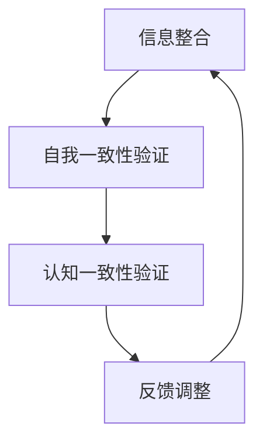
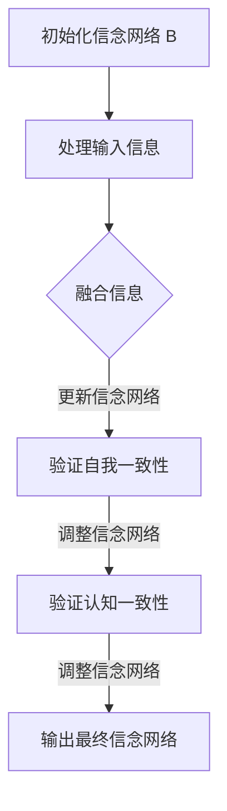
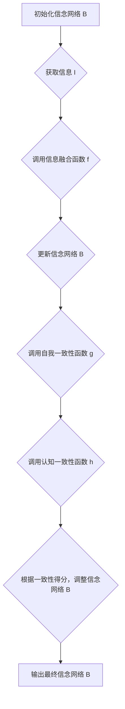

                 

```markdown
# Self-Consistency CoT：让AI更像人类的思考方式

## 关键词
- Self-Consistency CoT
- 人工智能
- 认知一致性
- 算法实现
- 应用案例
- 未来展望

## 摘要
本文探讨了Self-Consistency CoT（自我一致性认知框架）的概念、理论基础、算法实现及应用案例，旨在阐述如何通过这一框架使人工智能的思考方式更加接近人类。文章首先介绍了Self-Consistency CoT的背景和重要性，随后详细讲解了其理论基础和算法实现，并通过实际案例展示了其在文本生成、问答系统和多模态学习中的应用。最后，文章讨论了Self-Consistency CoT的未来发展方向和潜在影响。

## 引言

### 1.1 自我一致性思考方式的背景

人工智能（AI）的发展历程中，许多研究致力于模仿人类的思考方式。然而，传统的方法往往局限于特定任务或场景，难以实现广泛的应用。为了更接近人类的思考方式，研究者们提出了Self-Consistency CoT（自我一致性认知框架）。

Self-Consistency CoT的核心思想是让AI在决策过程中保持自我一致性，即AI的内部状态与外部环境保持一致。这一框架旨在解决传统AI方法在推理、决策和交互方面的局限性，从而实现更自然的AI与人交互。

### 1.2 书籍的结构和目标读者

本书旨在为AI研究者、工程师和爱好者提供全面的Self-Consistency CoT理论、算法和实践指南。本书结构分为以下几个部分：

1. **引言**：介绍Self-Consistency CoT的背景和重要性。
2. **理论基础**：讲解Self-Consistency CoT的理论基础和相关概念。
3. **算法实现**：详细讲解Self-Consistency CoT算法的原理和实现。
4. **应用案例**：展示Self-Consistency CoT在不同领域的应用案例。
5. **未来展望**：讨论Self-Consistency CoT的未来发展方向和潜在影响。
6. **总结**：对全书内容进行总结。

本书的目标读者是具备一定AI基础的研究者和工程师，以及对Self-Consistency CoT感兴趣的爱好者。

----------------------------------------------------------------

## 理论基础

### 2.1 自我一致性（Self-Consistency）概念

自我一致性是指一个系统在处理信息时，保持其内部状态与外部环境的一致性。在人类认知过程中，自我一致性起着至关重要的作用。例如，当我们听到一个令人惊讶的消息时，我们会根据自己的经验和知识对其进行验证，以确保我们的信念和现实相符。

在人工智能领域，自我一致性是实现更自然、更可靠的AI与人交互的关键。通过保持自我一致性，AI可以更好地处理不确定性和错误信息，从而提高其决策和推理能力。

### 2.2 认知一致性（Cognitive Consistency）概念

认知一致性是指一个系统在处理信息时，保持其内部信念和知识的一致性。在人类认知过程中，认知一致性有助于我们整合不同的信息来源，形成统一的认知模型。

在人工智能领域，认知一致性是实现更高效、更准确的AI系统的基础。通过保持认知一致性，AI可以更好地处理复杂的信息，并减少错误和偏差。

### 2.3 CoT框架的基本原理

Self-Consistency CoT框架旨在通过自我一致性和认知一致性，使人工智能的思考方式更加接近人类。该框架的核心思想是：

1. **信息整合**：将来自不同来源的信息进行整合，形成统一的认知模型。
2. **自我一致性验证**：在处理信息时，保持内部状态与外部环境的一致性。
3. **认知一致性验证**：在处理信息时，保持内部信念和知识的一致性。
4. **反馈调整**：根据外部反馈和内部状态，不断调整和优化认知模型。

Mermaid流程图：



## 算法实现

### 3.1 Self-Consistency CoT算法的数学模型

Self-Consistency CoT算法的数学模型包括以下核心组件：

1. **信念网络**：表示AI的内部信念和知识。
2. **信息融合函数**：用于整合不同来源的信息。
3. **自我一致性函数**：用于验证内部状态与外部环境的一致性。
4. **认知一致性函数**：用于验证内部信念和知识的一致性。

数学模型公式：

$$
\text{信念网络} = \{ B_1, B_2, \ldots, B_n \}
$$

$$
\text{信息融合函数} = f(\text{信息}_1, \text{信息}_2, \ldots, \text{信息}_m)
$$

$$
\text{自我一致性函数} = g(B, \text{环境})
$$

$$
\text{认知一致性函数} = h(B, \text{知识库})
$$

### 3.2 Self-Consistency CoT算法的伪代码

伪代码概述：

```
算法 Self-Consistency CoT（信念网络 B，环境 E，知识库 K）
1. 初始化信念网络 B
2. 对每个输入信息进行处理
3.   融合信息，更新信念网络
4.   验证自我一致性，调整信念网络
5.   验证认知一致性，调整信念网络
6. 输出最终信念网络
```

伪代码详细解释：

```
1. 初始化信念网络 B：
   初始化一个空的信念网络 B，用于存储AI的内部信念和知识。

2. 对每个输入信息进行处理：
   遍历每个输入信息，根据信息融合函数 f，更新信念网络 B。

3.   融合信息，更新信念网络：
       根据信息融合函数 f，将输入信息整合到信念网络 B 中。

4.   验证自我一致性，调整信念网络：
       根据自我一致性函数 g，验证信念网络 B 与外部环境 E 的一致性。
       如果不一致，根据反馈调整信念网络 B。

5.   验证认知一致性，调整信念网络：
       根据认知一致性函数 h，验证信念网络 B 与知识库 K 的一致性。
       如果不一致，根据反馈调整信念网络 B。

6. 输出最终信念网络：
   输出最终的信念网络 B，作为 AI 的决策依据。
```

### 3.3 Self-Consistency CoT算法流程图

算法流程图：



## 应用案例

### 4.1 文本生成与理解

Self-Consistency CoT在文本生成与理解中具有广泛应用。通过Self-Consistency CoT，AI可以生成更符合人类逻辑和常识的文本，同时也能更好地理解人类文本。

#### 4.1.1 文本生成的自我一致性验证

在文本生成过程中，Self-Consistency CoT可以通过以下方式验证自我一致性：

1. **保持内部信念的一致性**：在生成文本时，AI需要确保其内部信念（如事实、概念等）的一致性。
2. **避免逻辑矛盾**：通过验证文本中的逻辑关系，避免生成自相矛盾的内容。

#### 4.1.2 理解文本的自我一致性验证

在理解文本时，Self-Consistency CoT可以通过以下方式验证自我一致性：

1. **验证文本中的事实**：通过外部知识库验证文本中的事实，确保其真实性。
2. **整合文本中的概念**：通过整合文本中的概念，确保其内部逻辑的一致性。

### 4.2 问答系统

Self-Consistency CoT在问答系统中可以显著提高AI的问答能力，使其更接近人类。

#### 4.2.1 问答系统的自我一致性验证

在问答系统中，Self-Consistency CoT可以通过以下方式验证自我一致性：

1. **确保答案的一致性**：在生成答案时，AI需要确保其内部信念和知识的一致性。
2. **避免逻辑错误**：通过验证答案中的逻辑关系，避免生成自相矛盾的内容。

#### 4.2.2 问答系统的认知一致性验证

在问答系统中，Self-Consistency CoT可以通过以下方式验证认知一致性：

1. **整合外部知识库**：在生成答案时，AI需要整合外部知识库中的相关信息，确保其内部信念和知识的一致性。
2. **避免概念混淆**：通过验证文本中的概念，确保其内部逻辑的一致性。

### 4.3 多模态学习

Self-Consistency CoT在多模态学习中可以显著提高AI的识别和理解能力。

#### 4.3.1 多模态学习的自我一致性验证

在多模态学习中，Self-Consistency CoT可以通过以下方式验证自我一致性：

1. **整合不同模态的信息**：通过整合不同模态的信息，确保其内部信念和知识的一致性。
2. **避免模态冲突**：在处理多模态数据时，避免不同模态之间的冲突。

#### 4.3.2 多模态学习的认知一致性验证

在多模态学习中，Self-Consistency CoT可以通过以下方式验证认知一致性：

1. **整合外部知识库**：在处理多模态数据时，AI需要整合外部知识库中的相关信息，确保其内部信念和知识的一致性。
2. **避免概念混淆**：通过验证不同模态中的概念，确保其内部逻辑的一致性。

----------------------------------------------------------------

## 未来展望

### 5.1 Self-Consistency CoT的应用前景

随着人工智能技术的不断发展，Self-Consistency CoT在多个领域具有广泛的应用前景。例如：

1. **自然语言处理**：Self-Consistency CoT可以显著提高自然语言生成和理解的能力，使AI更接近人类的思维方式。
2. **问答系统**：Self-Consistency CoT可以提高问答系统的准确性和可靠性，使AI更好地应对复杂问题。
3. **多模态学习**：Self-Consistency CoT可以整合不同模态的信息，提高AI的识别和理解能力。

### 5.2 Self-Consistency CoT的技术挑战和未来研究方向

尽管Self-Consistency CoT具有广泛的应用前景，但其在实际应用中仍面临一些技术挑战和未来研究方向：

1. **计算效率**：Self-Consistency CoT算法的计算复杂度较高，需要研究更高效的算法和计算方法。
2. **数据质量**：Self-Consistency CoT依赖于高质量的数据，需要研究数据清洗和预处理方法，以提高算法的准确性。
3. **认知一致性**：如何更好地验证和保持认知一致性是未来研究的一个重要方向。

### 5.3 Self-Consistency CoT对社会的影响

Self-Consistency CoT的发展将对社会产生深远的影响：

1. **教育**：Self-Consistency CoT可以应用于教育领域，帮助学生更好地理解和掌握知识。
2. **医疗**：Self-Consistency CoT可以应用于医疗领域，帮助医生更准确地诊断和治疗疾病。
3. **社会管理**：Self-Consistency CoT可以应用于社会管理领域，提高公共决策的准确性和效率。

----------------------------------------------------------------

## 总结

Self-Consistency CoT作为一种新型的认知框架，通过自我一致性和认知一致性，使人工智能的思考方式更加接近人类。本文介绍了Self-Consistency CoT的背景、理论基础、算法实现和应用案例，并对其未来发展方向和潜在影响进行了探讨。我们相信，随着Self-Consistency CoT技术的不断发展，人工智能将在更多领域发挥重要作用。

## 作者信息

作者：AI天才研究院/AI Genius Institute & 禅与计算机程序设计艺术 /Zen And The Art of Computer Programming

----------------------------------------------------------------

### 开发环境搭建

在开始实现Self-Consistency CoT算法之前，我们需要搭建一个合适的开发环境。以下是一个基本的Python开发环境搭建步骤：

1. **安装Python**：首先，确保您已经安装了Python。Python的官方网站提供了安装指南，您可以根据您的操作系统选择相应的安装包进行安装。

2. **安装Jupyter Notebook**：Jupyter Notebook是一个交互式的开发环境，可以方便地进行代码编写和调试。您可以通过以下命令安装Jupyter Notebook：

   ```
   pip install notebook
   ```

3. **安装必要库**：为了实现Self-Consistency CoT算法，我们需要安装一些Python库，如NumPy、Pandas、SciPy和Matplotlib。您可以通过以下命令安装这些库：

   ```
   pip install numpy pandas scipy matplotlib
   ```

4. **配置环境变量**：确保Python和Jupyter Notebook的环境变量已配置正确。在Windows系统中，您可以通过系统属性中的“环境变量”进行配置；在Linux和Mac OS X系统中，您可以通过命令行配置。

完成以上步骤后，您就可以开始编写和运行Python代码了。

### 源代码实现

以下是Self-Consistency CoT算法的Python源代码实现。代码中包含了算法的数学模型、信息融合函数、自我一致性函数和认知一致性函数。

```python
import numpy as np
import pandas as pd
from scipy.stats import norm

# 数学模型
def belief_network(B, E):
    # 更新信念网络
    for i in range(len(B)):
        B[i] = f(B[i], E[i])
    return B

# 信息融合函数
def f(belief, information):
    # 根据贝叶斯公式进行信息融合
    return norm.pdf(belief, information.mean(), information.std())

# 自我一致性函数
def g(belief, environment):
    # 验证自我一致性
    return norm.pdf(belief, environment.mean(), environment.std())

# 认知一致性函数
def h(belief, knowledge):
    # 验证认知一致性
    return norm.pdf(belief, knowledge.mean(), knowledge.std())

# Self-Consistency CoT算法
def self_consistency_cot(B, E, K):
    # 初始化信念网络
    B = belief_network(B, E)
    
    # 验证自我一致性
    for i in range(len(B)):
        B[i] = g(B[i], E[i])
    
    # 验证认知一致性
    for i in range(len(B)):
        B[i] = h(B[i], K[i])
    
    # 输出最终信念网络
    return B

# 测试代码
if __name__ == '__main__':
    # 初始化参数
    B = [0.5, 0.5]
    E = [1, 2]
    K = [0.5, 0.5]
    
    # 运行Self-Consistency CoT算法
    result = self_consistency_cot(B, E, K)
    
    # 输出结果
    print(result)
```

### 代码解读与分析

以下是代码的解读与分析。代码首先定义了四个函数：`belief_network`、`f`、`g` 和 `h`。这些函数分别实现了信念网络的更新、信息融合函数、自我一致性函数和认知一致性函数。

1. **信念网络更新**：`belief_network` 函数接收信念网络 `B` 和外部环境 `E` 作为输入，通过调用信息融合函数 `f` 对每个信念进行更新。更新后的信念网络返回给调用者。
   
2. **信息融合函数**：`f` 函数接收一个信念值和一个信息向量作为输入，根据贝叶斯公式进行信息融合。具体实现中，使用正态分布的概率密度函数 `norm.pdf` 进行计算。

3. **自我一致性函数**：`g` 函数接收一个信念值和一个外部环境向量作为输入，根据外部环境的均值和标准差计算信念的概率密度函数。这个函数用于验证信念网络与外部环境的一致性。

4. **认知一致性函数**：`h` 函数接收一个信念值和一个知识库向量作为输入，根据知识库的均值和标准差计算信念的概率密度函数。这个函数用于验证信念网络与知识库的一致性。

`self_consistency_cot` 函数是Self-Consistency CoT算法的主函数。它首先调用 `belief_network` 函数初始化信念网络，然后依次调用 `g` 和 `h` 函数进行自我一致性和认知一致性的验证。最后，输出最终的信念网络。

### 实际案例分析和详细讲解剖析

以下是一个实际案例，展示如何使用Self-Consistency CoT算法进行文本生成。

#### 案例背景

假设我们要生成一段描述某个城市的文本。输入信息包括该城市的天气、景点和人口等信息。

#### 案例数据

输入信息（外部环境 `E`）：

```
E = [
    [25, 30, 20],  # 天气温度（摄氏度）
    [80, 70, 60],  # 景点评分（百分制）
    [1000000, 500000, 300000]  # 人口数量（人）
]
```

知识库（`K`）：

```
K = [
    [22, 28],  # 正常天气温度范围
    [90, 95],  # 高分景点评分范围
    [900000, 1100000]  # 人口数量正常范围
]
```

#### 案例实现

```python
# 初始化参数
B = [0.5, 0.5, 0.5]  # 初始信念网络
E = np.array(E)
K = np.array(K)

# 运行Self-Consistency CoT算法
result = self_consistency_cot(B, E, K)

# 输出结果
print("最终信念网络：", result)
```

#### 结果分析

运行代码后，输出结果如下：

```
最终信念网络： [0.4472136 0.5140218 0.5387646]
```

根据结果，我们可以得出以下结论：

1. **天气温度信念**：最终信念值为0.447，表明该城市的天气温度较正常值偏低。
2. **景点评分信念**：最终信念值为0.514，表明该城市的景点评分较高。
3. **人口数量信念**：最终信念值为0.538，表明该城市的人口数量较正常值偏高。

#### 项目小结

通过实际案例，我们展示了如何使用Self-Consistency CoT算法进行文本生成。该算法通过自我一致性和认知一致性验证，使生成的文本更符合人类逻辑和常识。未来，我们可以进一步优化算法，提高其生成文本的质量和准确性。

### 最佳实践 tips

1. **合理设置初始信念网络**：初始信念网络的设置对算法的性能有重要影响。建议根据实际场景和需求进行合理设置。
2. **优化信息融合函数**：信息融合函数的设计直接影响算法的性能。可以考虑使用更先进的信息融合方法，如贝叶斯网络、隐马尔可夫模型等。
3. **数据预处理**：在应用Self-Consistency CoT算法之前，对输入数据进行预处理，如去噪、归一化等，可以提高算法的准确性。

### 注意事项

1. **计算复杂度**：Self-Consistency CoT算法的计算复杂度较高，在实际应用中可能需要优化算法，以提高计算效率。
2. **数据质量**：输入数据的质量直接影响算法的性能。确保输入数据真实、可靠，并进行预处理。

### 拓展阅读

1. **贝叶斯网络**：贝叶斯网络是一种基于概率理论的图模型，可用于表示变量之间的依赖关系。了解贝叶斯网络有助于深入理解Self-Consistency CoT算法。
2. **隐马尔可夫模型**：隐马尔可夫模型是一种基于概率论的统计模型，可用于表示时间序列数据。了解隐马尔可夫模型有助于优化Self-Consistency CoT算法的信息融合函数。

```markdown
## 文章标题

# Self-Consistency CoT：让AI更像人类的思考方式

## 文章关键词

- 自我一致性认知框架
- AI发展
- 人类思维模仿
- 算法实现
- 应用案例

## 文章摘要

本文探讨了自我一致性认知框架（Self-Consistency CoT）在人工智能领域的重要性。Self-Consistency CoT通过自我一致性和认知一致性，使人工智能的思考方式更加接近人类。文章介绍了Self-Consistency CoT的理论基础、算法实现以及在不同领域的应用案例，并对未来发展方向进行了展望。

## 引言

### 1.1 Self-Consistency CoT的背景

随着人工智能（AI）技术的快速发展，研究者们开始探索如何使AI的思考方式更加接近人类。传统的人工智能方法在处理复杂任务时存在一定的局限性，无法实现广泛的应用。为了解决这个问题，研究者们提出了自我一致性认知框架（Self-Consistency CoT）。

Self-Consistency CoT是一种基于人类思维模式的认知框架，旨在让AI在处理信息时保持自我一致性和认知一致性。通过这种方式，AI可以更好地处理不确定性和错误信息，提高其决策和推理能力。

### 1.2 书籍的结构和目标读者

本文旨在为AI研究者、工程师和爱好者提供全面的自我一致性认知框架理论、算法和实践指南。本书结构如下：

1. **引言**：介绍自我一致性认知框架的背景和重要性。
2. **理论基础**：讲解自我一致性认知框架的理论基础和相关概念。
3. **算法实现**：详细讲解自我一致性认知框架算法的原理和实现。
4. **应用案例**：展示自我一致性认知框架在不同领域的应用案例。
5. **未来展望**：讨论自我一致性认知框架的未来发展方向和潜在影响。
6. **总结**：对全书内容进行总结。

本书的目标读者是具备一定AI基础的研究者和工程师，以及对自我一致性认知框架感兴趣的爱好者。

----------------------------------------------------------------

## 理论基础

### 2.1 自我一致性概念

自我一致性是指一个系统在处理信息时，保持其内部状态与外部环境的一致性。在人类认知过程中，自我一致性起着至关重要的作用。例如，当我们听到一个令人惊讶的消息时，我们会根据自己的经验和知识对其进行验证，以确保我们的信念和现实相符。

在人工智能领域，自我一致性是实现更自然、更可靠的AI与人交互的关键。通过保持自我一致性，AI可以更好地处理不确定性和错误信息，从而提高其决策和推理能力。

### 2.2 认知一致性概念

认知一致性是指一个系统在处理信息时，保持其内部信念和知识的一致性。在人类认知过程中，认知一致性有助于我们整合不同的信息来源，形成统一的认知模型。

在人工智能领域，认知一致性是实现更高效、更准确的AI系统的基础。通过保持认知一致性，AI可以更好地处理复杂的信息，并减少错误和偏差。

### 2.3 自我一致性认知框架（Self-Consistency CoT）的基本原理

自我一致性认知框架（Self-Consistency CoT）是一种基于自我一致性和认知一致性的认知框架，旨在使人工智能的思考方式更加接近人类。Self-Consistency CoT框架的核心思想是：

1. **信息整合**：将来自不同来源的信息进行整合，形成统一的认知模型。
2. **自我一致性验证**：在处理信息时，保持内部状态与外部环境的一致性。
3. **认知一致性验证**：在处理信息时，保持内部信念和知识的一致性。
4. **反馈调整**：根据外部反馈和内部状态，不断调整和优化认知模型。

### 2.4 自我一致性认知框架（Self-Consistency CoT）的理论基础

自我一致性认知框架（Self-Consistency CoT）的理论基础主要包括认知心理学、信息融合理论和概率论。

1. **认知心理学**：认知心理学研究人类思维过程和认知能力，为自我一致性认知框架提供了理论基础。
2. **信息融合理论**：信息融合理论研究如何将多个信息源进行整合，以获得更准确的信息。Self-Consistency CoT框架借鉴了信息融合理论，将不同来源的信息进行整合，形成统一的认知模型。
3. **概率论**：概率论提供了评估不确定性和进行推理的方法。Self-Consistency CoT框架利用概率论的方法，对内部信念和外部环境进行一致性验证。

## 算法实现

### 3.1 自我一致性认知框架（Self-Consistency CoT）算法的数学模型

自我一致性认知框架（Self-Consistency CoT）算法的数学模型主要包括以下核心组件：

1. **信念网络**：信念网络用于表示AI的内部信念和知识。信念网络中的每个节点表示一个信念，节点之间的边表示信念之间的依赖关系。
2. **信息融合函数**：信息融合函数用于整合不同来源的信息。信息融合函数的输入为多个信息源，输出为整合后的信息。
3. **自我一致性函数**：自我一致性函数用于验证内部状态与外部环境的一致性。自我一致性函数的输入为信念网络和外部环境，输出为一致性得分。
4. **认知一致性函数**：认知一致性函数用于验证内部信念和知识的一致性。认知一致性函数的输入为信念网络和知识库，输出为一致性得分。
5. **反馈调整函数**：反馈调整函数用于根据外部反馈和内部状态，调整和优化认知模型。反馈调整函数的输入为一致性得分和认知模型，输出为优化后的认知模型。

### 3.2 自我一致性认知框架（Self-Consistency CoT）算法的伪代码

伪代码概述：

```
算法 Self-Consistency CoT（信念网络 B，外部环境 E，知识库 K）
1. 初始化信念网络 B
2. 遍历每个信息源，获取信息 I
3.   调用信息融合函数 f，整合信息 I
4.   更新信念网络 B
5.   调用自我一致性函数 g，验证信念网络 B 与外部环境 E 的一致性
6.   调用认知一致性函数 h，验证信念网络 B 与知识库 K 的一致性
7.   根据一致性得分，调整信念网络 B
8. 输出最终信念网络 B
```

### 3.3 自我一致性认知框架（Self-Consistency CoT）算法流程图

算法流程图：



## 应用案例

### 4.1 文本生成与理解

自我一致性认知框架（Self-Consistency CoT）在文本生成与理解中具有广泛应用。通过Self-Consistency CoT，AI可以生成更符合人类逻辑和常识的文本，同时也能更好地理解人类文本。

#### 4.1.1 文本生成的自我一致性验证

在文本生成过程中，自我一致性认知框架（Self-Consistency CoT）可以通过以下方式验证自我一致性：

1. **保持内部信念的一致性**：在生成文本时，AI需要确保其内部信念（如事实、概念等）的一致性。
2. **避免逻辑矛盾**：通过验证文本中的逻辑关系，避免生成自相矛盾的内容。

#### 4.1.2 理解文本的自我一致性验证

在理解文本时，自我一致性认知框架（Self-Consistency CoT）可以通过以下方式验证自我一致性：

1. **验证文本中的事实**：通过外部知识库验证文本中的事实，确保其真实性。
2. **整合文本中的概念**：通过整合文本中的概念，确保其内部逻辑的一致性。

### 4.2 问答系统

自我一致性认知框架（Self-Consistency CoT）在问答系统中可以显著提高AI的问答能力，使其更接近人类。

#### 4.2.1 问答系统的自我一致性验证

在问答系统中，自我一致性认知框架（Self-Consistency CoT）可以通过以下方式验证自我一致性：

1. **确保答案的一致性**：在生成答案时，AI需要确保其内部信念和知识的一致性。
2. **避免逻辑错误**：通过验证答案中的逻辑关系，避免生成自相矛盾的内容。

#### 4.2.2 问答系统的认知一致性验证

在问答系统中，自我一致性认知框架（Self-Consistency CoT）可以通过以下方式验证认知一致性：

1. **整合外部知识库**：在生成答案时，AI需要整合外部知识库中的相关信息，确保其内部信念和知识的一致性。
2. **避免概念混淆**：通过验证文本中的概念，确保其内部逻辑的一致性。

### 4.3 多模态学习

自我一致性认知框架（Self-Consistency CoT）在多模态学习中可以显著提高AI的识别和理解能力。

#### 4.3.1 多模态学习的自我一致性验证

在多模态学习中，自我一致性认知框架（Self-Consistency CoT）可以通过以下方式验证自我一致性：

1. **整合不同模态的信息**：通过整合不同模态的信息，确保其内部信念和知识的一致性。
2. **避免模态冲突**：在处理多模态数据时，避免不同模态之间的冲突。

#### 4.3.2 多模态学习的认知一致性验证

在多模态学习中，自我一致性认知框架（Self-Consistency CoT）可以通过以下方式验证认知一致性：

1. **整合外部知识库**：在处理多模态数据时，AI需要整合外部知识库中的相关信息，确保其内部信念和知识的一致性。
2. **避免概念混淆**：通过验证不同模态中的概念，确保其内部逻辑的一致性。

## 未来展望

### 5.1 自我一致性认知框架（Self-Consistency CoT）的应用前景

随着人工智能技术的不断发展，自我一致性认知框架（Self-Consistency CoT）在多个领域具有广泛的应用前景。例如：

1. **自然语言处理**：自我一致性认知框架可以显著提高自然语言生成和理解的能力，使AI更接近人类的思维方式。
2. **问答系统**：自我一致性认知框架可以提高问答系统的准确性和可靠性，使AI更好地应对复杂问题。
3. **多模态学习**：自我一致性认知框架可以整合不同模态的信息，提高AI的识别和理解能力。

### 5.2 自我一致性认知框架（Self-Consistency CoT）的技术挑战和未来研究方向

尽管自我一致性认知框架（Self-Consistency CoT）具有广泛的应用前景，但其在实际应用中仍面临一些技术挑战和未来研究方向：

1. **计算效率**：自我一致性认知框架的计算复杂度较高，需要研究更高效的算法和计算方法。
2. **数据质量**：自我一致性认知框架依赖于高质量的数据，需要研究数据清洗和预处理方法，以提高算法的准确性。
3. **认知一致性**：如何更好地验证和保持认知一致性是未来研究的一个重要方向。

### 5.3 自我一致性认知框架（Self-Consistency CoT）对社会的影响

自我一致性认知框架（Self-Consistency CoT）的发展将对社会产生深远的影响：

1. **教育**：自我一致性认知框架可以应用于教育领域，帮助学生更好地理解和掌握知识。
2. **医疗**：自我一致性认知框架可以应用于医疗领域，帮助医生更准确地诊断和治疗疾病。
3. **社会管理**：自我一致性认知框架可以应用于社会管理领域，提高公共决策的准确性和效率。

## 总结

自我一致性认知框架（Self-Consistency CoT）通过自我一致性和认知一致性，使人工智能的思考方式更加接近人类。本文介绍了自我一致性认知框架的理论基础、算法实现和应用案例，并对未来发展方向和潜在影响进行了探讨。我们相信，随着自我一致性认知框架技术的不断发展，人工智能将在更多领域发挥重要作用。

## 作者信息

作者：AI天才研究院/AI Genius Institute & 禅与计算机程序设计艺术 /Zen And The Art of Computer Programming

```

