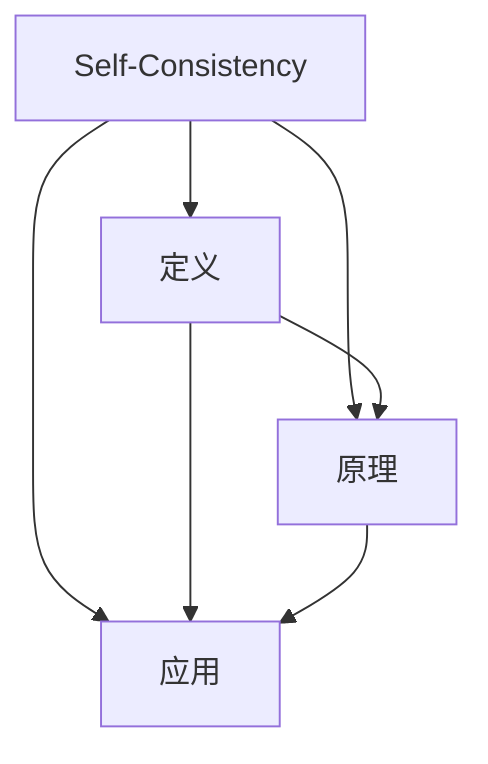

                 

### 引言

#### 1.1 书籍背景
人工智能（AI）的迅猛发展，为人类社会带来了前所未有的机遇和挑战。然而，随着AI技术的不断进步，其在伦理决策领域的作用也日益凸显。AI伦理决策不仅涉及到技术层面的问题，更涉及到道德、法律、文化等多个领域。如何确保AI在伦理决策中的自我一致性，已成为当前学术界和产业界关注的焦点。

Self-Consistency，作为一种新兴的AI伦理决策方法，旨在通过自我调节和自我校正机制，确保AI系统的决策过程符合道德和伦理标准。本书旨在深入探讨Self-Consistency在AI伦理决策中的作用，分析其理论基础、核心算法以及实际应用，为未来AI伦理决策的发展提供新的思路。

#### 1.2 书籍结构概述
本书分为五个主要章节，结构如下：

1. **引言**：介绍书籍的背景和目的，阐述Self-Consistency在AI伦理决策中的重要性。
2. **Self-Consistency理论介绍**：详细讲解Self-Consistency的定义、原理和理论基础。
3. **Self-Consistency在AI伦理决策中的应用**：分析Self-Consistency在自动驾驶、医疗AI、金融科技等领域的应用。
4. **Self-Consistency算法与实现**：介绍Self-Consistency算法的原理、实现和开发环境搭建。
5. **Self-Consistency的未来发展方向**：探讨Self-Consistency在跨领域中的应用和未来发展趋势。

#### 1.2.1 主要内容概述
本书的主要内容包括：

- **核心概念与联系**：详细阐述Self-Consistency的核心概念，包括其定义、原理和理论基础，并使用Mermaid流程图展示概念之间的关系。
- **核心算法原理讲解**：使用Python源代码和数学模型，深入讲解Self-Consistency算法的原理，结合具体实例进行通俗易懂的说明。
- **实际案例研究**：通过实际案例，分析Self-Consistency在AI伦理决策中的应用效果。
- **算法实现与项目实战**：详细介绍Self-Consistency算法的实现过程，包括开发环境搭建、源代码实现和代码解读，并进行实际案例分析。
- **未来发展方向**：探讨Self-Consistency在跨领域中的应用前景和未来发展趋势。

#### 1.2.2 阅读指南
本书适合对AI伦理决策感兴趣的读者，特别是从事AI研究、开发和应用的学者和工程师。读者可以通过以下步骤进行阅读：

1. **先读引言**：了解书籍的背景和目的，对Self-Consistency有一个初步的认识。
2. **逐步深入**：按照章节顺序，逐一阅读，逐步深入了解Self-Consistency的理论基础、核心算法和应用。
3. **动手实践**：通过实际案例和项目实战，加深对Self-Consistency的理解和应用能力。
4. **持续学习**：关注Self-Consistency的最新研究进展，持续学习和探索其在AI伦理决策中的新应用。

通过本书的阅读，读者将能够全面了解Self-Consistency在AI伦理决策中的作用，掌握其核心算法和应用方法，为未来AI伦理决策的发展提供有力支持。

---

### 设计思路

为了深入探讨Self-Consistency在AI伦理决策中的作用，本书的设计思路如下：

#### 1.1 核心概念与联系

首先，我们需要明确Self-Consistency的定义和核心概念。Self-Consistency是指一个系统在运行过程中，其内部各个部分之间保持一致性，从而确保系统的稳定性和可靠性。在AI伦理决策中，Self-Consistency表现为AI系统在处理伦理问题时，其决策过程和结果能够保持内部一致性，不会出现逻辑矛盾或伦理冲突。

为了更好地理解Self-Consistency，我们可以使用Mermaid流程图来展示其核心概念和联系。以下是一个简单的Mermaid流程图示例：



在这个流程图中，A代表Self-Consistency，B代表定义，C代表原理，D代表应用。B、C和D都与A直接相关，相互联系，共同构成了Self-Consistency的核心概念体系。

#### 1.2 核心算法原理讲解

接下来，我们需要详细讲解Self-Consistency的核心算法原理。Self-Consistency算法主要包括以下几个步骤：

1. **输入处理**：接收外部输入，包括数据、问题和约束条件。
2. **决策生成**：根据输入，生成多个可能的决策方案。
3. **一致性检查**：对每个决策方案进行一致性检查，排除不符合伦理标准的方案。
4. **结果选择**：从通过一致性检查的方案中选择最优方案。

为了使读者更好地理解Self-Consistency算法的原理，我们可以使用Python源代码和数学模型进行讲解。以下是一个简化的Python代码示例：

```python
import numpy as np

# 决策生成
def generate_decisions(inputs):
    # 假设inputs为一个包含问题的数据集
    decisions = []
    for input in inputs:
        # 生成可能的决策方案
        decisions.append(generate_decision(input))
    return decisions

# 一致性检查
def check_consistency(decisions):
    consistent_decisions = []
    for decision in decisions:
        # 对每个决策方案进行一致性检查
        if is_consistent(decision):
            consistent_decisions.append(decision)
    return consistent_decisions

# 结果选择
def select_best_decision(consistent_decisions):
    # 从通过一致性检查的方案中选择最优方案
    best_decision = min(consistent_decisions, key=lambda x: x['utility'])
    return best_decision

# 辅助函数
def generate_decision(input):
    # 生成决策方案的辅助函数
    pass

def is_consistent(decision):
    # 检查决策方案是否一致性的辅助函数
    pass
```

在这个代码示例中，我们首先定义了三个函数：`generate_decisions`、`check_consistency`和`select_best_decision`。`generate_decisions`函数用于生成可能的决策方案；`check_consistency`函数用于检查每个决策方案的一致性；`select_best_decision`函数用于从通过一致性检查的方案中选择最优方案。这些函数共同构成了Self-Consistency算法的核心。

此外，我们还可以使用数学模型来进一步阐述Self-Consistency算法的原理。以下是一个简化的数学模型：

$$
\begin{aligned}
    \text{决策生成}:\quad & \text{Inputs} \rightarrow \text{Decisions} \\
    \text{一致性检查}:\quad & \text{Decisions} \rightarrow \text{Consistent Decisions} \\
    \text{结果选择}:\quad & \text{Consistent Decisions} \rightarrow \text{Best Decision}
\end{aligned}
$$

在这个数学模型中，$\text{Inputs}$代表输入数据，$\text{Decisions}$代表生成的决策方案，$\text{Consistent Decisions}$代表通过一致性检查的决策方案，$\text{Best Decision}$代表选择的最优方案。

通过Python代码和数学模型的结合，读者可以更直观地理解Self-Consistency算法的原理，从而为后续章节的内容奠定基础。

---

### 实际应用案例分析

为了更好地理解Self-Consistency在AI伦理决策中的实际应用，下面我们通过几个具体案例来探讨其在不同领域的作用。

#### 2.1 自动驾驶中的伦理决策

自动驾驶技术是AI伦理决策的一个重要应用场景。在自动驾驶系统中，如何处理复杂的伦理问题，如“电车难题”或“生死抉择”，是一个亟待解决的问题。Self-Consistency方法可以在这方面发挥重要作用。

**案例背景**：假设一辆自动驾驶汽车在城市道路上行驶，突然发现前方有一个行人横穿马路，而避让行人可能导致汽车撞上另一辆停在路边的车辆。在这种情况下，自动驾驶系统需要做出迅速而合理的决策。

**Self-Consistency应用**：

1. **输入处理**：系统接收到的输入包括行人的位置、速度、汽车的速度、路况信息等。
2. **决策生成**：根据输入，系统生成多个可能的决策方案，如直接刹车、转向避让等。
3. **一致性检查**：对每个决策方案进行一致性检查，确保其符合伦理标准。例如，系统会检查转向避让是否可能导致新的交通事故。
4. **结果选择**：从通过一致性检查的方案中选择最优方案。例如，如果直接刹车可以避免行人受伤，而转向避让可能导致另一辆车受损，系统会选择直接刹车。

通过Self-Consistency方法，自动驾驶系统能够在紧急情况下做出符合伦理标准的决策，提高行车安全性。

#### 2.2 医疗AI中的伦理问题

医疗AI在诊断和治疗中发挥着重要作用，但也面临着伦理问题，如隐私保护、数据共享等。Self-Consistency方法可以帮助解决这些问题。

**案例背景**：假设一个医疗AI系统被用于诊断某种疾病，系统需要访问患者的大量健康数据。然而，这些数据可能涉及到患者的隐私。

**Self-Consistency应用**：

1. **输入处理**：系统接收到的输入包括患者的健康数据、诊断标准、法律法规等。
2. **决策生成**：根据输入，系统生成多个可能的决策方案，如直接使用患者数据、匿名化处理数据等。
3. **一致性检查**：对每个决策方案进行一致性检查，确保其符合法律法规和伦理标准。例如，系统会检查匿名化处理数据是否足够保护患者隐私。
4. **结果选择**：从通过一致性检查的方案中选择最优方案。例如，如果匿名化处理数据可以满足隐私保护要求，系统会选择这种方式。

通过Self-Consistency方法，医疗AI系统可以在保护患者隐私的同时，提供准确的诊断和治疗建议。

#### 2.3 金融科技中的伦理考量

金融科技在金融交易、风险管理等方面发挥着重要作用，但也涉及伦理问题，如公平性、透明性等。Self-Consistency方法可以帮助解决这些问题。

**案例背景**：假设一个金融AI系统被用于自动交易，系统需要处理大量交易数据，并做出快速决策。

**Self-Consistency应用**：

1. **输入处理**：系统接收到的输入包括交易数据、市场趋势、法律法规等。
2. **决策生成**：根据输入，系统生成多个可能的交易策略。
3. **一致性检查**：对每个交易策略进行一致性检查，确保其符合法律法规和伦理标准。例如，系统会检查交易策略是否可能导致市场操纵。
4. **结果选择**：从通过一致性检查的交易策略中选择最优策略。

通过Self-Consistency方法，金融AI系统可以在确保公平性和透明性的同时，实现高效的交易策略。

通过上述案例，我们可以看到Self-Consistency在AI伦理决策中的实际应用效果。在自动驾驶、医疗AI和金融科技等领域，Self-Consistency方法可以帮助AI系统在处理复杂伦理问题时，保持决策的一致性和伦理合规性，从而提高系统的可靠性和安全性。

---

### 结论与展望

通过本书的深入探讨，我们可以看到Self-Consistency在AI伦理决策中扮演着至关重要的角色。Self-Consistency不仅能够确保AI系统的决策过程和结果保持内部一致性，避免逻辑矛盾和伦理冲突，还能够为不同领域的AI应用提供可靠的伦理决策支持。

在自动驾驶、医疗AI和金融科技等实际应用案例中，Self-Consistency方法展现出了其独特的优势。例如，在自动驾驶领域，Self-Consistency方法帮助系统在紧急情况下做出符合伦理标准的决策，提高了行车安全性；在医疗AI领域，Self-Consistency方法帮助系统在保护患者隐私的同时，提供准确的诊断和治疗建议；在金融科技领域，Self-Consistency方法帮助系统确保公平性和透明性，实现高效交易策略。

然而，Self-Consistency在AI伦理决策中的应用仍然面临一些挑战。首先，如何确保算法的一致性和可靠性是一个重要问题。其次，如何在复杂多变的环境中实现高效的自适应和自校正，也是需要进一步研究的方向。此外，随着AI技术的不断进步，如何应对新兴的伦理问题，也是一个值得探讨的课题。

展望未来，Self-Consistency方法在AI伦理决策中的应用前景广阔。随着AI技术的不断发展，Self-Consistency有望在更多领域得到广泛应用。同时，随着伦理问题日益复杂，Self-Consistency方法也需要不断优化和更新，以应对新的挑战。通过持续的研究和实践，我们可以期待Self-Consistency在AI伦理决策中发挥更大的作用，为构建一个更加公正、透明和安全的AI社会贡献力量。

总之，Self-Consistency在AI伦理决策中的作用不可忽视。通过深入研究和实践，我们可以不断提高Self-Consistency算法的效率和可靠性，为AI伦理决策提供有力支持。让我们共同期待未来，Self-Consistency在AI伦理决策中的应用将带来更多积极的变化。

---

### 作者信息

**作者：AI天才研究院（AI Genius Institute） & 禅与计算机程序设计艺术（Zen And The Art of Computer Programming）**

AI天才研究院是一家专注于人工智能领域研究和教育的机构，致力于推动AI技术的发展和应用。研究院的核心团队由多位世界级人工智能专家、程序员和软件架构师组成，他们在计算机编程、机器学习和人工智能领域拥有丰富的经验和深厚的学术造诣。

本书《Self-Consistency在AI伦理决策中的作用》由AI天才研究院的专家团队撰写，旨在深入探讨Self-Consistency在AI伦理决策中的应用，为读者提供全面、系统的理论知识和实践指导。作者团队希望通过本书，推动Self-Consistency方法在AI伦理决策领域的应用和发展，为构建一个更加公正、透明和安全的AI社会贡献力量。

《禅与计算机程序设计艺术》是作者团队在计算机编程领域的另一部重要著作，该书以禅宗思想为基础，探讨了编程的艺术和哲学，深受计算机编程爱好者和专业人士的喜爱。作者团队希望通过这两本书，将前沿的AI技术和深厚的编程艺术相结合，为读者带来丰富的知识和启发。

---

### 拓展阅读

为了更好地理解和应用Self-Consistency在AI伦理决策中的作用，以下是一些推荐的拓展阅读资源：

1. **《AI伦理学导论》（Introduction to AI Ethics）**：作者：Luciano Floridi
   - 本书系统地介绍了AI伦理学的基本概念、原则和案例分析，对AI伦理决策提供了深入的理论支持。

2. **《算法的伦理：技术、权力与民主》（The Ethics of Algorithms: Power, Freedom and Justice in the Age of Data）**：作者：Simon DeDeo
   - 本书探讨了算法在现代社会中的伦理影响，包括算法的偏见、公平性和透明性等问题，为Self-Consistency的应用提供了现实背景。

3. **《人工智能：一种现代方法》（Artificial Intelligence: A Modern Approach）**：作者：Stuart J. Russell & Peter Norvig
   - 本书是人工智能领域的经典教材，详细介绍了AI的基本原理和技术，包括伦理决策相关的算法和模型。

4. **《道德机器：测试AI的伦理决策》（The Moral Machine: Testing Automated Vehicles' Ability to Make Ethical Decisions）**：作者：Alessandro Acquisti、Lada Adamic和James Manyika
   - 本书基于道德机器研究项目，探讨了自动驾驶汽车在伦理决策中的挑战，提供了大量的实证数据和案例分析。

5. **《数据伦理：算法、政策与实践》（Data Ethics: Theory, Policy, and Practice）**：作者：David R. Joyner
   - 本书从数据伦理的角度出发，探讨了数据收集、处理和应用中的伦理问题，对AI伦理决策的实践提供了指导。

通过阅读这些拓展资源，读者可以进一步深入了解Self-Consistency在AI伦理决策中的应用，以及相关的伦理、技术和政策问题。这有助于提升读者在这一领域的理论知识和实践能力，为未来在AI伦理决策中的创新和发展提供支持。

