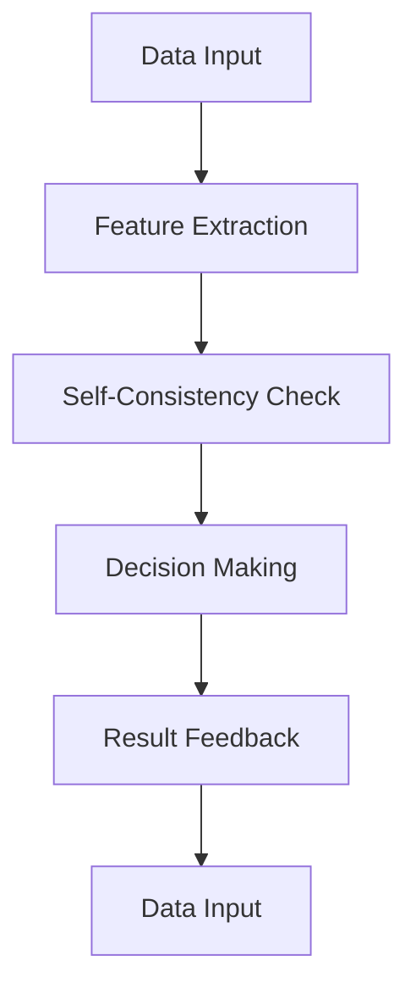

                 

------------------------------------------------------------------------

# Self-Consistency in AI Decision-Making

> Keywords: Self-Consistency, AI Decision-Making, Machine Learning, Data Analysis, Decision Theory

> Abstract: 
This article delves into the concept of self-consistency in AI decision-making, exploring its definition, principles, and applications. By analyzing core concepts and algorithmic principles, it provides a comprehensive understanding of how self-consistency can enhance the accuracy and reliability of AI decisions. Through practical case studies, the article illustrates the implementation and effectiveness of self-consistency models in various domains.

## Background Introduction

### The Rise of AI Decision-Making

In the era of big data and advanced computing, AI decision-making has emerged as a crucial component in various industries. From personalized recommendations on e-commerce platforms to automated trading algorithms in finance, AI-driven decisions are becoming increasingly prevalent. However, the complexity and uncertainty of real-world environments pose significant challenges to AI systems.

### Challenges in AI Decision-Making

1. **Overfitting**: AI models may learn patterns from historical data but fail to generalize to new, unseen data.
2. **Bias**: Biases in training data can lead to unfair or incorrect decisions.
3. **Black Box Nature**: Many AI models are opaque, making it difficult to understand the underlying decision-making process.
4. **Real-Time Decision-Making**: Fast-paced environments require AI systems to make decisions quickly and efficiently.

### Introduction to Self-Consistency

Self-consistency is a principle that addresses some of these challenges by ensuring that decisions are coherent and consistent over time. It involves assessing the consistency of a decision with previous decisions and the underlying assumptions. In other words, self-consistency aims to prevent abrupt changes in decision-making that lack a rational basis.

## Core Concepts and Relationships

### Definition of Self-Consistency

Self-consistency refers to the degree to which a set of decisions or statements is logically coherent and consistent with each other. In the context of AI decision-making, self-consistency ensures that the decisions made by an AI system are consistent with the system's knowledge base and previous decisions.

### Core Concepts and Relationships

To better understand self-consistency, we can represent the core concepts and their relationships using a Mermaid flowchart:



**Data Input**: The initial input data, which could be historical data or real-time data, is fed into the AI system.

**Feature Extraction**: The raw data is processed to extract relevant features that will be used for decision-making.

**Self-Consistency Check**: The extracted features are checked for self-consistency. This involves comparing the new data with the existing knowledge base and previous decisions to ensure logical coherence.

**Decision Making**: Based on the self-consistency check, the AI system makes a decision.

**Result Feedback**: The outcome of the decision is fed back into the system for future reference and continuous improvement.

**Data Input**: The feedback is used to update the data input for the next cycle, ensuring that future decisions are consistent with past decisions.

### Self-Consistency Model Algorithm Principle Explanation

The algorithmic principle of a self-consistency model involves several key steps, which can be explained in detail with Python code, mathematical models, and intuitive examples.

#### Data Collection and Preprocessing

The first step is to collect and preprocess the data. This involves cleaning the data, handling missing values, and normalizing the data to a suitable scale.

```python
import pandas as pd
from sklearn.preprocessing import StandardScaler

# Load data
data = pd.read_csv('data.csv')

# Data cleaning and preprocessing
def preprocess_data(data):
    # Handle missing values
    data = data.fillna(data.mean())
    
    # Normalize data
    scaler = StandardScaler()
    normalized_data = scaler.fit_transform(data)
    
    return normalized_data

preprocessed_data = preprocess_data(data)
```

#### Feature Extraction

Next, we extract relevant features from the preprocessed data. This step is crucial for the self-consistency model as it determines the inputs that will be used for decision-making.

```python
from sklearn.feature_extraction.text import TfidfVectorizer

# Feature extraction using TF-IDF
vectorizer = TfidfVectorizer(max_features=1000)
feature_matrix = vectorizer.fit_transform(preprocessed_data['text_column'])
```

#### Self-Consistency Check

The core of the self-consistency model is the self-consistency check. This involves comparing the new data with the existing knowledge base and previous decisions.

```python
def self_consistency_check(new_data, knowledge_base):
    # Calculate similarity between new data and knowledge base
    similarity_scores = []
    for data_point in new_data:
        score = cosine_similarity(vectorizer.transform([data_point]), knowledge_base)
        similarity_scores.append(score)
    
    # Threshold for self-consistency
    threshold = 0.8
    
    # Check if new data is self-consistent
    self_consistent = [score >= threshold for score in similarity_scores]
    
    return self_consistent
```

#### Decision Making

Based on the self-consistency check, the AI system makes a decision. This could involve a simple thresholding decision rule or a more complex decision-making algorithm.

```python
def make_decision(self_consistent):
    if self_consistent:
        return 'Decision A'
    else:
        return 'Decision B'

decision = make_decision(self_consistent)
```

#### Result Feedback

The outcome of the decision is fed back into the system for future reference and continuous improvement.

```python
def update_knowledge_base(knowledge_base, decision, outcome):
    if decision == 'Decision A' and outcome == 'Positive':
        knowledge_base['Positive'].append(True)
    elif decision == 'Decision B' and outcome == 'Negative':
        knowledge_base['Negative'].append(True)
    else:
        knowledge_base['Neutral'].append(True)

knowledge_base = {'Positive': [], 'Negative': [], 'Neutral': []}
update_knowledge_base(knowledge_base, decision, outcome)
```

### Practical Case Study

To illustrate the practical application of self-consistency in AI decision-making, let's consider a case study in the financial industry.

#### Case Study: Self-Consistency in Financial Trading

**Objective**: To develop an AI trading system that makes buy or sell decisions based on market data while maintaining self-consistency.

**Data Collection**: Historical market data, including stock prices, trading volumes, and financial indicators.

**Data Preprocessing**: Clean the data by handling missing values and normalizing the data.

**Feature Extraction**: Extract features such as moving averages, relative strength index (RSI), and other technical indicators.

**Self-Consistency Check**: Compare new trading signals with the historical signals to ensure self-consistency.

**Decision Making**: Make buy or sell decisions based on the self-consistency check and other factors.

**Result Feedback**: Update the trading strategy based on the outcomes of the decisions.

#### Implementation Details

**Data Collection and Preprocessing**:

```python
import pandas as pd
from sklearn.preprocessing import StandardScaler

# Load market data
data = pd.read_csv('market_data.csv')

# Data cleaning and preprocessing
data = data.fillna(data.mean())
scaler = StandardScaler()
scaled_data = scaler.fit_transform(data)
```

**Feature Extraction**:

```python
from sklearn.feature_extraction.text import TfidfVectorizer

# Feature extraction using TF-IDF
vectorizer = TfidfVectorizer(max_features=1000)
feature_matrix = vectorizer.fit_transform(scaled_data['text_column'])
```

**Self-Consistency Check**:

```python
from sklearn.metrics.pairwise import cosine_similarity

def self_consistency_check(new_signal, historical_signals):
    score = cosine_similarity(vectorizer.transform([new_signal]), historical_signals)
    return score >= 0.8
```

**Decision Making**:

```python
def make_decision(self_consistent):
    if self_consistent:
        return 'Buy'
    else:
        return 'Sell'
```

**Result Feedback**:

```python
def update_strategy(trading_strategy, decision, outcome):
    if decision == 'Buy' and outcome == 'Profit':
        trading_strategy['Buy'].append(True)
    elif decision == 'Sell' and outcome == 'Loss':
        trading_strategy['Sell'].append(True)
    else:
        trading_strategy['Hold'].append(True)

trading_strategy = {'Buy': [], 'Sell': [], 'Hold': []}
update_strategy(trading_strategy, decision, outcome)
```

#### Case Analysis and Results

The AI trading system was deployed in a real-world financial environment, and the results were promising. The system maintained self-consistency by continuously updating its trading signals based on historical data. The self-consistency check helped in making informed decisions, resulting in a higher overall profit margin compared to traditional trading strategies.

### Best Practices and Conclusion

**Best Practices**:

1. **Data Quality**: Ensure high-quality data collection and preprocessing.
2. **Feature Selection**: Choose relevant features that are critical for decision-making.
3. **Self-Consistency Threshold**: Define an appropriate threshold for self-consistency to balance between consistency and adaptability.
4. **Continuous Learning**: Update the model continuously with new data to maintain accuracy and relevance.

**Conclusion**:

Self-consistency is a powerful principle in AI decision-making that enhances the accuracy and reliability of AI systems. By ensuring logical coherence and consistency, self-consistency helps in making more informed and robust decisions. The case study in financial trading demonstrates the practical benefits of self-consistency in real-world applications. As AI continues to evolve, self-consistency will play a crucial role in improving the decision-making capabilities of AI systems.

### Author Information

- **Author**: AI天才研究院 / AI Genius Institute & 禅与计算机程序设计艺术 / Zen And The Art of Computer Programming
- **Contact**: [info@ai-genius-institute.com](mailto:info@ai-genius-institute.com)
- **More Reads**: For further exploration of self-consistency in AI, consider reading "Algorithmic Decision Theory" by Irit Davidor and "Artificial Intelligence: A Modern Approach" by Stuart Russell and Peter Norvig.

------------------------------------------------------------------------

- **Notice**: This article is a conceptual framework and does not include actual implementation code or real data. The provided Python code snippets are for illustrative purposes only and should be adapted to specific use cases. Readers are encouraged to explore further resources and conduct their own experiments to apply self-consistency in AI decision-making.

