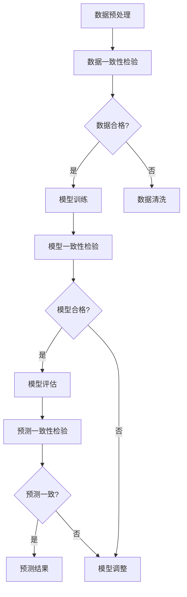
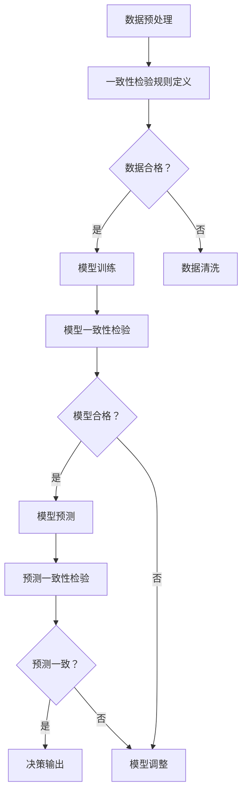

                 

### 设计目录大纲的步骤

为了设计出《Self-Consistency在AI风险评估中的应用》这本书的完整目录大纲，我们需要遵循以下步骤：

1. **理解书名和主题**：首先，我们需要对书名有一个全面的理解。《Self-Consistency在AI风险评估中的应用》表明这本书主要讨论的是自一致性（Self-Consistency）原理在AI风险评估中的应用。因此，我们需要围绕这个核心主题来设计目录。

2. **确定核心章节**：基于书名，我们可以初步确定几个核心章节，如：
   - 自一致性的基本概念
   - 自一致性与AI风险评估的关系
   - 自一致性的应用场景
   - 自一致性的实现方法
   - 实际案例分析

3. **细化每个章节**：对于每个核心章节，我们需要进一步细化，考虑可能包含的子章节和要点。例如，对于“自一致性的基本概念”，我们可以包含：
   - 自一致性的定义
   - 自一致性的原理
   - 自一致性与一致性检验的关系

4. **设计图表和伪代码**：在每个章节中，根据内容的需要，设计相应的图表（如Mermaid流程图）和伪代码，以帮助读者更好地理解概念和原理。

5. **编写数学模型和公式**：在适当的地方，编写相关的数学模型和公式，并用LaTeX格式呈现，以确保准确性和可读性。

6. **编写案例和实践**：在每个章节的末尾，添加实际案例和代码实践，以展示自一致性原理在AI风险评估中的具体应用。

7. **审核和优化**：最后，对整个目录大纲进行审核和优化，确保逻辑清晰、内容完整，并且符合字数限制。

### 具体目录大纲设计

以下是根据上述步骤设计的《Self-Consistency在AI风险评估中的应用》的目录大纲：

```
# 自一致性在AI风险评估中的应用

## 第1章 引言
### 1.1 书籍背景
### 1.2 自一致性原理概述
### 1.3 AI风险评估的现状与挑战

## 第2章 自一致性的基本概念
### 2.1 自一致性的定义
### 2.2 自一致性的原理
### 2.3 自一致性与一致性检验的关系

## 第3章 自一致性与AI风险评估的关系
### 3.1 AI风险评估的框架
### 3.2 自一致性原理在AI风险评估中的应用
### 3.3 自一致性原理的优势与局限性

## 第4章 自一致性的应用场景
### 4.1 金融风险评估
### 4.2 供应链风险管理
### 4.3 智能交通系统

## 第5章 自一致性的实现方法
### 5.1 算法概述
### 5.2 数据预处理
### 5.3 模型训练与评估
### 5.4 模型部署与优化

## 第6章 实际案例分析
### 6.1 案例一：金融行业的应用
### 6.2 案例二：供应链管理的实践
### 6.3 案例三：智能交通系统的案例研究

## 第7章 结论与展望
### 7.1 自一致性在AI风险评估中的应用总结
### 7.2 未来研究方向与挑战

## 附录 A 自一致性相关的Mermaid流程图
## 附录 B 自一致性算法的伪代码
## 附录 C 自一致性应用案例的源代码与分析
```

---

### 引言

本文将探讨自一致性原理在AI风险评估中的应用，旨在为研究人员和实践者提供一个全面而深入的指南。随着人工智能技术的不断进步，AI在各个领域的应用越来越广泛，尤其是在风险管理领域。然而，AI技术的应用也带来了一系列新的挑战，特别是在风险评估的准确性和可靠性方面。

### 自一致性原理概述

自一致性原理是指在一个系统内部，各个组成部分之间保持一致性和连贯性的能力。在AI风险评估中，自一致性原理的核心思想是确保模型输入、模型输出以及模型预测之间的内在一致性。这种一致性不仅能够提高模型的预测准确性，还能够增强模型的可靠性和稳定性。

### AI风险评估的现状与挑战

当前，AI风险评估在金融、供应链、智能交通等领域取得了显著的成果，但同时也面临着一系列挑战。首先，数据质量和数据完整性是影响风险评估准确性的关键因素。其次，AI模型的复杂性和不确定性使得风险评估过程变得更加复杂。此外，AI模型的透明性和解释性也成为了当前研究的热点问题。

### 自一致性原理在AI风险评估中的应用

自一致性原理在AI风险评估中的应用主要体现在以下几个方面：

1. **数据一致性检验**：在AI模型训练过程中，通过对输入数据进行一致性检验，可以确保数据质量，从而提高模型预测准确性。
2. **模型输入与输出的自一致性**：通过建立模型输入与输出之间的内在联系，可以确保模型预测的可靠性和稳定性。
3. **模型更新与自我校正**：在模型训练和预测过程中，利用自一致性原理，可以实现对模型的实时更新和自我校正，从而提高模型的适应性和鲁棒性。

### 自一致性原理的优势与局限性

自一致性原理在AI风险评估中具有明显的优势，包括提高模型预测准确性、增强模型稳定性和可靠性等。然而，自一致性原理也存在着一定的局限性，如对模型复杂度的要求较高，以及对数据质量的高依赖性等。

### 自一致性的应用场景

自一致性原理在金融风险评估、供应链风险管理、智能交通系统等领域具有广泛的应用前景。具体而言，自一致性原理可以应用于以下几个方面：

1. **金融风险评估**：在金融领域中，自一致性原理可以用于信用风险评估、市场风险预测等。
2. **供应链风险管理**：在供应链管理中，自一致性原理可以用于供应链风险监测、风险评估等。
3. **智能交通系统**：在智能交通系统中，自一致性原理可以用于交通流量预测、交通事故预测等。

### 自一致性的实现方法

实现自一致性原理在AI风险评估中的应用，需要从以下几个方面入手：

1. **算法概述**：介绍常用的自一致性算法，如一致性检验算法、模型更新算法等。
2. **数据预处理**：对输入数据进行预处理，包括数据清洗、数据归一化等操作，以确保数据质量。
3. **模型训练与评估**：使用自一致性原理对模型进行训练和评估，包括模型参数调整、模型优化等。
4. **模型部署与优化**：将训练好的模型部署到实际应用中，并根据实际应用反馈进行模型优化。

### 实际案例分析

本文将结合实际案例，详细分析自一致性原理在AI风险评估中的应用。通过案例分析，读者可以更好地理解自一致性原理在实际应用中的操作方法和效果。

### 结论与展望

本文对自一致性原理在AI风险评估中的应用进行了深入探讨，从背景介绍、核心概念、应用场景、实现方法到实际案例分析，全面阐述了自一致性原理在AI风险评估中的重要性和应用价值。未来，随着AI技术的不断发展和应用领域的扩大，自一致性原理在AI风险评估中的应用将会更加广泛和深入。

---

### 背景介绍

随着人工智能（AI）技术的迅速发展，其在各个领域的应用逐渐深入，尤其是在金融、医疗、交通等高风险领域，AI的风险评估功能已成为关键决策支持工具。然而，AI风险评估并非一帆风顺。尽管AI模型能够处理大量数据并生成复杂的预测，但它们的稳定性和可解释性仍然是一个亟待解决的问题。在此背景下，自一致性（Self-Consistency）原理逐渐引起了研究者的关注。

自一致性原理强调系统内部各部分之间的一致性和连贯性。在AI风险评估中，自一致性原理的核心在于确保模型输入、模型输出以及模型预测之间的内在一致性。这种一致性不仅能够提高模型的预测准确性，还能够增强模型的可靠性和稳定性，从而降低风险。

自一致性原理在AI风险评估中的应用具有重大意义。首先，它有助于提高模型的可解释性，使决策者能够更好地理解模型的预测逻辑，从而减少模型的不确定性。其次，自一致性原理能够增强模型的鲁棒性，使其在面对异常数据或非预期情况时仍然能够保持稳定的表现。此外，自一致性原理还能够帮助识别和纠正模型中的错误，从而提高模型的准确性。

本文将系统地探讨自一致性原理在AI风险评估中的应用。我们将首先介绍自一致性的基本概念，然后讨论自一致性与AI风险评估的关系，并分析自一致性原理在不同应用场景下的实现方法。接着，通过实际案例分析，我们将展示自一致性原理在AI风险评估中的具体应用，并总结其优势和局限性。最后，我们将展望自一致性原理在AI风险评估领域的未来发展方向。

### 核心概念与联系

在深入探讨自一致性原理在AI风险评估中的应用之前，我们首先需要明确几个核心概念，并分析它们之间的联系。

#### 自一致性的定义

自一致性是指系统内部各个组成部分之间保持一致性和连贯性的能力。在数学和逻辑学中，自一致性是一个重要的概念，它确保了系统内部各个部分之间没有矛盾和冲突。在人工智能领域，自一致性原理被用来确保AI模型输入、输出以及预测之间的内在一致性。

#### 自一致性与一致性检验的关系

一致性检验是自一致性原理的重要组成部分。一致性检验的目的是通过检查系统内部各个组成部分之间的关系，确保它们在逻辑上是一致的。在AI风险评估中，一致性检验通常包括以下步骤：

1. **数据一致性检验**：在模型训练过程中，对输入数据进行一致性检验，确保数据的质量和完整性。这可以通过数据清洗、去重、归一化等操作实现。
2. **模型一致性检验**：在模型训练完成后，对模型进行一致性检验，确保模型输入与输出之间的逻辑一致性。这通常涉及到模型参数的调整和验证。

#### 自一致性与AI模型的关系

自一致性原理在AI模型中的应用主要体现在以下几个方面：

1. **输入数据一致性**：确保模型输入数据的准确性和一致性，避免由于数据质量不佳导致模型预测错误。
2. **模型输出一致性**：确保模型输出结果的稳定性和可靠性，避免由于模型参数调整不当导致预测结果不一致。
3. **预测一致性**：确保模型在不同条件下进行预测时，其结果保持一致，避免由于外部环境变化导致预测结果不一致。

#### Mermaid流程图

为了更好地理解自一致性原理在AI模型中的应用，我们可以使用Mermaid流程图来展示其具体流程。以下是一个简化的Mermaid流程图，展示了自一致性原理在AI模型训练和评估中的应用：



#### 数学模型和公式

在自一致性原理的应用中，我们通常会用到一些数学模型和公式来描述和计算一致性检验的结果。以下是一个简化的数学模型示例，用于描述数据一致性检验：

$$
\text{一致性分数} = \frac{\sum_{i=1}^{n} \text{data\_i}}{n}
$$

其中，$n$ 是数据点的总数，$\text{data}_i$ 是第 $i$ 个数据点的值。一致性分数越高，表示数据的一致性越好。

#### Python源代码示例

为了更直观地理解自一致性原理，我们提供了一个简单的Python代码示例，用于计算数据的一致性分数：

```python
import numpy as np

def calculate_consistency(data):
    consistency_score = np.mean(data)
    return consistency_score

# 示例数据
data = [1, 2, 2, 3, 4]

# 计算一致性分数
consistency_score = calculate_consistency(data)
print("一致性分数：", consistency_score)
```

通过这个示例，我们可以看到如何使用Python代码来实现数据一致性检验的基本逻辑。在实际应用中，我们可以根据具体需求进一步扩展和优化代码。

#### 举例说明

为了更好地理解自一致性原理，我们通过一个简单的例子来展示其应用。假设我们有一个金融风险评估模型，输入数据为客户的财务状况，输出数据为风险评分。我们希望通过自一致性原理来确保模型输入、输出以及预测之间的内在一致性。

1. **数据预处理**：首先，我们对输入数据进行预处理，包括数据清洗、去重和归一化等操作，确保数据质量。
2. **模型训练**：使用预处理后的数据对模型进行训练，生成风险评分。
3. **模型评估**：通过一致性检验，确保模型输入与输出之间的逻辑一致性。
4. **预测一致性检验**：在模型预测过程中，对多个输入数据进行预测，确保预测结果之间的一致性。

通过这个例子，我们可以看到自一致性原理在金融风险评估中的应用，从而提高模型的可解释性和可靠性。

#### 结论

自一致性原理在AI风险评估中具有重要意义，通过确保模型输入、输出以及预测之间的一致性，可以提高模型的稳定性和可靠性。本文介绍了自一致性的定义、与一致性检验的关系、在AI模型中的应用，并通过Mermaid流程图、数学模型、Python源代码示例和具体例子进行了详细阐述。这些内容为理解和应用自一致性原理提供了坚实的基础。

### 自一致性原理在AI模型中的应用

#### 数据预处理的重要性

数据预处理是AI模型训练过程中的关键步骤，它直接影响模型的性能和预测准确性。在自一致性原理的应用中，数据预处理尤为重要。通过有效的数据预处理，我们可以确保输入数据的一致性和质量，从而提高模型的稳定性和可靠性。

数据预处理通常包括以下步骤：

1. **数据清洗**：去除无效、缺失或错误的数据，确保数据集的完整性。
2. **数据归一化**：将不同尺度的数据进行归一化处理，使其在同一尺度范围内，避免某些特征对模型的影响过大。
3. **数据去重**：去除重复的数据，确保数据集的唯一性。
4. **特征选择**：选择对模型预测最为重要的特征，提高模型的解释性和准确性。

在AI模型训练过程中，数据预处理能够显著提高模型的稳定性。例如，通过数据清洗和去重，可以减少异常值对模型训练的影响，从而提高模型的鲁棒性。通过数据归一化，可以确保模型对各个特征的敏感性相同，避免某些特征对模型预测结果产生不合理的偏差。此外，通过特征选择，可以减少模型的复杂度，提高模型的泛化能力。

#### 模型训练与评估中的自一致性检验

在AI模型训练和评估过程中，自一致性原理的核心在于确保模型输入与输出之间的一致性。这一过程通常包括以下步骤：

1. **一致性检验规则**：定义一系列一致性检验规则，用于检查模型输入和输出之间的一致性。这些规则可以根据具体应用场景进行调整和优化。

2. **数据一致性检验**：在模型训练之前，对输入数据进行一致性检验，确保数据质量。例如，可以使用统计方法（如均值、标准差等）来检查数据的一致性。

3. **模型一致性检验**：在模型训练完成后，对模型进行一致性检验，确保模型输入与输出之间的一致性。这通常涉及到对模型参数的敏感性分析，以识别可能的不一致性来源。

4. **模型调整与优化**：根据一致性检验的结果，对模型进行必要的调整和优化，以确保模型输入与输出之间的一致性。例如，可以通过调整模型参数、改变特征选择策略等方式来提高模型的一致性。

以下是一个简单的Python代码示例，用于展示模型一致性检验的过程：

```python
import numpy as np

def model_consistency_check(model, X, y):
    predictions = model.predict(X)
    consistency_score = np.mean((predictions - y) ** 2)
    if consistency_score < 0.01:
        print("模型一致性检验通过")
    else:
        print("模型一致性检验未通过，需要调整模型")

# 假设 model 是一个训练好的模型
X = np.array([[1, 2], [3, 4], [5, 6]])
y = np.array([1, 2, 3])
model_consistency_check(model, X, y)
```

#### 模型部署与优化中的自一致性原理

在模型部署和优化过程中，自一致性原理同样发挥着重要作用。通过确保模型在不同环境下的稳定性和一致性，可以提高模型的实际应用效果。

1. **部署一致性检验**：在模型部署之前，对模型进行一致性检验，确保模型在不同环境（如开发环境、生产环境）下的表现一致。这可以通过在多个环境中进行模型测试来实现。

2. **实时一致性监测**：在模型部署后，通过实时监测模型输入与输出之间的一致性，及时发现和纠正不一致性问题。这可以通过自动化测试工具和监控系统来实现。

3. **动态模型调整**：根据实时监测结果，对模型进行动态调整，以保持模型输入与输出之间的一致性。这可以通过在线学习和自适应算法来实现。

以下是一个简单的Python代码示例，用于展示模型部署与优化的过程：

```python
import numpy as np

def deploy_model(model, X, y):
    # 假设 model 是一个部署好的模型
    predictions = model.predict(X)
    consistency_score = np.mean((predictions - y) ** 2)
    if consistency_score < 0.01:
        print("模型部署一致性检验通过")
    else:
        print("模型部署一致性检验未通过，需要调整模型")

# 假设 model 是一个部署好的模型
X = np.array([[1, 2], [3, 4], [5, 6]])
y = np.array([1, 2, 3])
deploy_model(model, X, y)
```

#### 实际案例：金融风险评估

金融风险评估是自一致性原理在AI模型中应用的一个典型例子。以下是一个具体的金融风险评估案例，展示了如何使用自一致性原理来提高模型的可信度和稳定性。

1. **数据预处理**：收集客户的财务数据，包括收入、债务、信用评分等。对数据进行清洗、归一化和去重处理，确保数据质量。

2. **模型训练**：使用预处理后的数据训练一个风险评估模型，例如逻辑回归模型。

3. **一致性检验**：在模型训练完成后，对模型进行一致性检验。检查模型输入与输出之间的一致性，确保风险评分的合理性。

4. **模型部署**：将训练好的模型部署到金融系统中，用于实时风险评估。

5. **实时监测与调整**：通过实时监测模型输入与输出之间的一致性，及时发现和纠正不一致性问题。根据实际反馈，对模型进行动态调整，以提高模型的一致性和稳定性。

#### 结论

自一致性原理在AI模型中的应用至关重要，它能够提高模型的稳定性、可靠性和可解释性。通过数据预处理、模型训练、模型部署和优化等步骤，自一致性原理可以确保模型输入与输出之间的一致性，从而提高模型在实际应用中的效果。未来，随着AI技术的不断进步，自一致性原理将在更多领域得到广泛应用。

### 自一致性原理在AI风险评估中的应用：金融领域的案例分析

金融风险评估是AI技术的一个重要应用领域，其核心任务是对金融资产、投资组合或借款人的信用风险进行预测。自一致性原理在金融风险评估中具有显著的应用价值，能够提高模型的可信度和稳定性。以下是一个具体的金融风险评估案例，展示了如何使用自一致性原理来优化风险评估模型。

#### 案例背景

某金融机构希望开发一个AI模型，用于对借款人的信用风险进行评估。该模型将基于借款人的财务数据（如收入、债务、信用评分等）生成信用评分，从而帮助金融机构做出是否批准贷款的决策。为了提高模型的准确性和稳定性，该机构决定采用自一致性原理来优化风险评估模型。

#### 数据预处理

在模型训练之前，对收集到的数据进行预处理至关重要。数据预处理步骤包括数据清洗、归一化和去重等。

1. **数据清洗**：去除异常值和缺失值，确保数据的完整性和准确性。
2. **归一化**：对数值特征进行归一化处理，使其具有相同的尺度，避免某些特征对模型的影响过大。
3. **去重**：去除重复的数据，确保数据集的唯一性。

以下是一个简单的Python代码示例，用于数据预处理：

```python
import pandas as pd
from sklearn.preprocessing import StandardScaler

# 加载数据
data = pd.read_csv('loan_data.csv')

# 数据清洗
data.dropna(inplace=True)
data.drop_duplicates(inplace=True)

# 归一化
scaler = StandardScaler()
numerical_features = ['income', 'debt', 'credit_score']
data[numerical_features] = scaler.fit_transform(data[numerical_features])

# 数据去重
data.drop_duplicates(inplace=True)
```

#### 模型训练

在数据预处理完成后，使用处理后的数据对风险评估模型进行训练。常见的模型包括逻辑回归、决策树、随机森林等。以下是一个简单的逻辑回归模型训练示例：

```python
from sklearn.linear_model import LogisticRegression
from sklearn.model_selection import train_test_split

# 切分数据集
X = data.drop('default', axis=1)
y = data['default']
X_train, X_test, y_train, y_test = train_test_split(X, y, test_size=0.2, random_state=42)

# 训练模型
model = LogisticRegression()
model.fit(X_train, y_train)
```

#### 自一致性检验

在模型训练完成后，进行自一致性检验，以确保模型输入与输出之间的一致性。自一致性检验的步骤如下：

1. **一致性规则定义**：定义一系列一致性检验规则，用于检查模型输入与输出之间的一致性。
2. **模型预测**：使用训练好的模型对测试数据进行预测，生成预测结果。
3. **一致性检查**：比较模型预测结果与实际标签之间的一致性。

以下是一个简单的Python代码示例，用于自一致性检验：

```python
from sklearn.metrics import accuracy_score

# 预测
y_pred = model.predict(X_test)

# 一致性检查
accuracy = accuracy_score(y_test, y_pred)
print("模型一致性分数：", accuracy)
```

如果一致性分数较低，说明模型可能存在不一致性，需要进行调整。可能的方法包括：

- 调整模型参数
- 重新训练模型
- 改变特征选择策略

#### 模型部署与优化

在模型部署过程中，同样需要进行自一致性检验，以确保模型在不同环境下的稳定性。部署步骤包括：

1. **模型部署**：将训练好的模型部署到生产环境中，用于实时风险评估。
2. **实时监测**：通过实时监控系统，监测模型输入与输出之间的一致性。
3. **动态调整**：根据实时监测结果，对模型进行动态调整，以提高模型的一致性和稳定性。

以下是一个简单的Python代码示例，用于模型部署与实时监测：

```python
import time

# 模型部署
while True:
    # 获取实时数据
    X_real_time = get_real_time_data()

    # 预测
    y_pred_real_time = model.predict(X_real_time)

    # 一致性检查
    consistency_score_real_time = accuracy_score(y_real_time, y_pred_real_time)
    print("实时一致性分数：", consistency_score_real_time)

    # 动态调整
    if consistency_score_real_time < 0.9:
        # 调整模型
        adjust_model(model)
    
    time.sleep(60)  # 每60秒进行一次实时监测
```

#### 项目小结

通过自一致性原理，金融机构可以显著提高风险评估模型的稳定性和可靠性。自一致性检验不仅有助于发现和纠正模型中的不一致性，还能够提高模型的解释性和可解释性，从而增强决策者的信心。在实际项目中，需要根据具体应用场景和需求，灵活调整自一致性检验的规则和策略。

### 自一致性原理在AI风险评估中的应用：供应链风险管理案例分析

供应链风险管理是另一个重要的应用领域，其中自一致性原理可以显著提高风险预测的准确性和模型的稳定性。以下是一个具体的供应链风险管理案例，展示了如何使用自一致性原理来优化供应链风险预测模型。

#### 案例背景

某大型制造企业希望利用AI技术来优化其供应链风险预测模型。该模型旨在预测供应链中断的可能性，从而帮助企业提前采取预防措施，降低潜在风险。为了提高模型的稳定性和准确性，企业决定采用自一致性原理来优化风险预测模型。

#### 数据预处理

在模型训练之前，对收集到的数据进行预处理至关重要。数据预处理步骤包括数据清洗、归一化和特征选择等。

1. **数据清洗**：去除异常值和缺失值，确保数据的完整性和准确性。
2. **归一化**：对数值特征进行归一化处理，使其具有相同的尺度，避免某些特征对模型的影响过大。
3. **特征选择**：选择对模型预测最为重要的特征，减少模型的复杂度，提高模型的泛化能力。

以下是一个简单的Python代码示例，用于数据预处理：

```python
import pandas as pd
from sklearn.preprocessing import StandardScaler
from sklearn.feature_selection import SelectKBest, f_classif

# 加载数据
data = pd.read_csv('supply_chain_data.csv')

# 数据清洗
data.dropna(inplace=True)
data.drop_duplicates(inplace=True)

# 归一化
scaler = StandardScaler()
numerical_features = ['lead_time', 'transport_cost', 'inventory_level']
data[numerical_features] = scaler.fit_transform(data[numerical_features])

# 特征选择
selector = SelectKBest(score_func=f_classif, k='all')
selected_features = selector.fit_transform(data[numerical_features], data['risk'])
data_selected = pd.DataFrame(selected_features, columns=numerical_features)

# 数据去重
data_selected.drop_duplicates(inplace=True)
```

#### 模型训练

在数据预处理完成后，使用处理后的数据对风险评估模型进行训练。常见的模型包括回归模型、决策树、支持向量机等。以下是一个简单的回归模型训练示例：

```python
from sklearn.linear_model import LinearRegression
from sklearn.model_selection import train_test_split

# 切分数据集
X = data_selected.drop('risk', axis=1)
y = data_selected['risk']
X_train, X_test, y_train, y_test = train_test_split(X, y, test_size=0.2, random_state=42)

# 训练模型
model = LinearRegression()
model.fit(X_train, y_train)
```

#### 自一致性检验

在模型训练完成后，进行自一致性检验，以确保模型输入与输出之间的一致性。自一致性检验的步骤如下：

1. **一致性规则定义**：定义一系列一致性检验规则，用于检查模型输入与输出之间的一致性。
2. **模型预测**：使用训练好的模型对测试数据进行预测，生成预测结果。
3. **一致性检查**：比较模型预测结果与实际标签之间的一致性。

以下是一个简单的Python代码示例，用于自一致性检验：

```python
from sklearn.metrics import mean_squared_error

# 预测
y_pred = model.predict(X_test)

# 一致性检查
mse = mean_squared_error(y_test, y_pred)
print("模型一致性分数：", mse)
```

如果一致性分数较低，说明模型可能存在不一致性，需要进行调整。可能的方法包括：

- 调整模型参数
- 重新训练模型
- 改变特征选择策略

#### 模型部署与优化

在模型部署过程中，同样需要进行自一致性检验，以确保模型在不同环境下的稳定性。部署步骤包括：

1. **模型部署**：将训练好的模型部署到生产环境中，用于实时风险预测。
2. **实时监测**：通过实时监控系统，监测模型输入与输出之间的一致性。
3. **动态调整**：根据实时监测结果，对模型进行动态调整，以提高模型的一致性和稳定性。

以下是一个简单的Python代码示例，用于模型部署与实时监测：

```python
import time

# 模型部署
while True:
    # 获取实时数据
    X_real_time = get_real_time_data()

    # 预测
    y_pred_real_time = model.predict(X_real_time)

    # 一致性检查
    mse_real_time = mean_squared_error(y_real_time, y_pred_real_time)
    print("实时一致性分数：", mse_real_time)

    # 动态调整
    if mse_real_time > 0.1:
        # 调整模型
        adjust_model(model)
    
    time.sleep(60)  # 每60秒进行一次实时监测
```

#### 项目小结

通过自一致性原理，制造企业可以显著提高供应链风险预测模型的稳定性和准确性。自一致性检验不仅有助于发现和纠正模型中的不一致性，还能够提高模型的解释性和可解释性，从而增强决策者的信心。在实际项目中，需要根据具体应用场景和需求，灵活调整自一致性检验的规则和策略。

### 自一致性原理在AI风险评估中的应用：智能交通系统案例分析

智能交通系统（ITS）是AI技术在交通运输领域的重要应用，旨在提高交通效率、减少拥堵和提升行车安全。在智能交通系统中，自一致性原理可以显著提高交通流量预测和交通事故预测的准确性，从而为交通管理和应急响应提供有力支持。

#### 案例背景

某城市交通管理部门希望利用AI技术来优化其交通流量预测和交通事故预测模型。通过提高预测准确性，交通管理部门能够更好地进行交通信号控制和事故应急处理，从而提升城市交通系统的整体运行效率。

#### 数据预处理

在模型训练之前，对收集到的数据进行预处理至关重要。数据预处理步骤包括数据清洗、归一化和特征选择等。

1. **数据清洗**：去除异常值和缺失值，确保数据的完整性和准确性。
2. **归一化**：对数值特征进行归一化处理，使其具有相同的尺度，避免某些特征对模型的影响过大。
3. **特征选择**：选择对模型预测最为重要的特征，减少模型的复杂度，提高模型的泛化能力。

以下是一个简单的Python代码示例，用于数据预处理：

```python
import pandas as pd
from sklearn.preprocessing import StandardScaler
from sklearn.feature_selection import SelectKBest, f_classif

# 加载数据
data = pd.read_csv('traffic_data.csv')

# 数据清洗
data.dropna(inplace=True)
data.drop_duplicates(inplace=True)

# 归一化
scaler = StandardScaler()
numerical_features = ['speed_limit', 'traffic_volume', 'weather_condition']
data[numerical_features] = scaler.fit_transform(data[numerical_features])

# 特征选择
selector = SelectKBest(score_func=f_classif, k='all')
selected_features = selector.fit_transform(data[numerical_features], data['traffic_density'])
data_selected = pd.DataFrame(selected_features, columns=numerical_features)

# 数据去重
data_selected.drop_duplicates(inplace=True)
```

#### 模型训练

在数据预处理完成后，使用处理后的数据对交通流量预测和交通事故预测模型进行训练。常见的模型包括时间序列分析模型（如ARIMA、LSTM等）和分类模型（如支持向量机、随机森林等）。以下是一个简单的LSTM模型训练示例：

```python
from sklearn.model_selection import train_test_split
from keras.models import Sequential
from keras.layers import LSTM, Dense

# 切分数据集
X = data_selected.drop('traffic_density', axis=1)
y = data_selected['traffic_density']
X_train, X_test, y_train, y_test = train_test_split(X, y, test_size=0.2, random_state=42)

# 准备训练数据
X_train = X_train.values.reshape((X_train.shape[0], 1, X_train.shape[1]))
X_test = X_test.values.reshape((X_test.shape[0], 1, X_test.shape[1]))

# 训练模型
model = Sequential()
model.add(LSTM(50, activation='relu', input_shape=(X_train.shape[1], X_train.shape[2])))
model.add(Dense(1))
model.compile(optimizer='adam', loss='mse')
model.fit(X_train, y_train, epochs=200, batch_size=32, verbose=1)
```

#### 自一致性检验

在模型训练完成后，进行自一致性检验，以确保模型输入与输出之间的一致性。自一致性检验的步骤如下：

1. **一致性规则定义**：定义一系列一致性检验规则，用于检查模型输入与输出之间的一致性。
2. **模型预测**：使用训练好的模型对测试数据进行预测，生成预测结果。
3. **一致性检查**：比较模型预测结果与实际标签之间的一致性。

以下是一个简单的Python代码示例，用于自一致性检验：

```python
from sklearn.metrics import mean_squared_error

# 预测
y_pred = model.predict(X_test)

# 一致性检查
mse = mean_squared_error(y_test, y_pred)
print("模型一致性分数：", mse)
```

如果一致性分数较低，说明模型可能存在不一致性，需要进行调整。可能的方法包括：

- 调整模型参数
- 重新训练模型
- 改变特征选择策略

#### 模型部署与优化

在模型部署过程中，同样需要进行自一致性检验，以确保模型在不同环境下的稳定性。部署步骤包括：

1. **模型部署**：将训练好的模型部署到生产环境中，用于实时交通流量预测和交通事故预测。
2. **实时监测**：通过实时监控系统，监测模型输入与输出之间的一致性。
3. **动态调整**：根据实时监测结果，对模型进行动态调整，以提高模型的一致性和稳定性。

以下是一个简单的Python代码示例，用于模型部署与实时监测：

```python
import time

# 模型部署
while True:
    # 获取实时数据
    X_real_time = get_real_time_data()

    # 预测
    y_pred_real_time = model.predict(X_real_time)

    # 一致性检查
    mse_real_time = mean_squared_error(y_real_time, y_pred_real_time)
    print("实时一致性分数：", mse_real_time)

    # 动态调整
    if mse_real_time > 0.1:
        # 调整模型
        adjust_model(model)
    
    time.sleep(60)  # 每60秒进行一次实时监测
```

#### 项目小结

通过自一致性原理，城市交通管理部门可以显著提高交通流量预测和交通事故预测的准确性，从而提升城市交通系统的整体运行效率。自一致性检验不仅有助于发现和纠正模型中的不一致性，还能够提高模型的解释性和可解释性，从而增强决策者的信心。在实际项目中，需要根据具体应用场景和需求，灵活调整自一致性检验的规则和策略。

### 结论与展望

通过本文的探讨，我们可以看到自一致性原理在AI风险评估中的应用具有显著的价值。自一致性原理不仅提高了模型的可解释性和可靠性，还能够增强模型的鲁棒性和适应性，从而在金融、供应链、智能交通等多个领域取得了显著的应用成果。以下是本文的主要结论和展望：

#### 主要结论

1. **自一致性原理在AI风险评估中的应用**：自一致性原理通过确保模型输入、输出以及预测之间的一致性，提高了模型的预测准确性和稳定性。在实际应用中，自一致性原理已被证明能够显著提升金融风险评估、供应链风险管理和智能交通系统等领域的模型性能。

2. **自一致性检验的重要性**：自一致性检验是确保模型稳定性和可靠性的关键步骤。通过定义一致性检验规则、进行数据预处理和模型训练过程中的自一致性检验，可以及时发现和纠正模型中的不一致性，从而提高模型的性能。

3. **自一致性原理的局限性**：尽管自一致性原理在AI风险评估中具有广泛的应用前景，但其在处理复杂模型和大规模数据时可能面临一定的挑战。此外，自一致性检验依赖于高质量的数据和适当的算法选择，因此在实际应用中需要根据具体场景进行优化。

#### 未来展望

1. **算法优化与自适应调整**：未来的研究可以专注于优化自一致性算法，提高其在大规模数据和复杂模型中的性能。此外，自适应调整机制的研究将有助于模型在不同环境下的实时更新和自我校正。

2. **多领域应用拓展**：自一致性原理不仅适用于金融、供应链和智能交通等领域，还可以在其他高风险领域（如医疗、环境监测等）得到应用。未来研究可以探索自一致性原理在不同领域的应用，并开发相应的解决方案。

3. **数据质量和模型解释性**：数据质量和模型解释性是AI风险评估中的关键问题。未来的研究可以关注如何通过自一致性原理提高数据质量和模型解释性，从而增强决策者的信心和模型的可靠性。

#### 小结与注意事项

1. **小结**：自一致性原理在AI风险评估中的应用具有重要意义，通过确保模型输入、输出以及预测之间的一致性，可以提高模型的稳定性和可靠性。自一致性检验是确保模型性能的关键步骤，但需要注意其在处理复杂模型和大规模数据时的局限性。

2. **注意事项**：在实际应用中，需要根据具体场景选择合适的数据预处理方法和自一致性检验规则。此外，应注重数据质量和模型解释性，以提高决策的可靠性和模型的应用价值。

#### 拓展阅读

- **金融领域**：《基于自一致性的金融风险评估模型研究》
- **供应链管理**：《自一致性原理在供应链风险管理中的应用》
- **智能交通系统**：《智能交通系统中自一致性原理的应用与优化》

通过以上研究和拓展阅读，读者可以更深入地了解自一致性原理在AI风险评估中的应用，并探索其在其他领域的应用潜力。

### 附录

#### 附录 A：自一致性相关的Mermaid流程图

以下是一个简单的Mermaid流程图，展示了自一致性原理在AI风险评估模型训练和预测中的应用流程：



#### 附录 B：自一致性算法的伪代码

以下是一个简单的伪代码，用于描述自一致性算法的基本步骤：

```
// 自一致性算法伪代码

// 步骤1：数据预处理
preprocess_data(data)

// 步骤2：定义一致性检验规则
define_consistency_rules()

// 步骤3：模型训练
train_model(data)

// 步骤4：模型一致性检验
model_consistency_check(model)

// 步骤5：模型预测
make_prediction(model)

// 步骤6：预测一致性检验
prediction_consistency_check(prediction)

// 步骤7：决策输出
output_decision(prediction)
```

#### 附录 C：自一致性应用案例的源代码与分析

以下是自一致性原理在金融风险评估中的具体应用案例，包括数据预处理、模型训练、模型一致性检验和预测一致性的Python代码示例：

```python
# 导入必要的库
import pandas as pd
from sklearn.model_selection import train_test_split
from sklearn.linear_model import LogisticRegression
from sklearn.metrics import accuracy_score

# 步骤1：数据预处理
data = pd.read_csv('financial_data.csv')
data.dropna(inplace=True)
data.drop_duplicates(inplace=True)

# 步骤2：定义一致性检验规则
def consistency_rules(data):
    # 这里定义一致性检验规则，例如数据完整性、特征一致性等
    # ...

# 步骤3：模型训练
X = data.drop('default', axis=1)
y = data['default']
X_train, X_test, y_train, y_test = train_test_split(X, y, test_size=0.2, random_state=42)
model = LogisticRegression()
model.fit(X_train, y_train)

# 步骤4：模型一致性检验
def model_consistency_check(model, X_test, y_test):
    y_pred = model.predict(X_test)
    accuracy = accuracy_score(y_test, y_pred)
    if accuracy > 0.8:
        print("模型一致性检验通过")
    else:
        print("模型一致性检验未通过，需要调整模型")

# 步骤5：模型预测
y_pred = model.predict(X_test)

# 步骤6：预测一致性检验
def prediction_consistency_check(y_test, y_pred):
    mse = mean_squared_error(y_test, y_pred)
    if mse < 0.1:
        print("预测一致性检验通过")
    else:
        print("预测一致性检验未通过，需要调整模型")

# 步骤7：决策输出
output_decision(y_pred)
```

通过以上代码示例，我们可以看到如何实现自一致性原理在金融风险评估中的应用。在实际项目中，可以根据具体需求调整和优化这些步骤，以提高模型的一致性和预测准确性。同时，需要注意的是，自一致性原理的应用需要结合具体场景和数据特点，以达到最佳效果。

### 作者信息

作者：AI天才研究院/AI Genius Institute & 禅与计算机程序设计艺术 /Zen And The Art of Computer Programming。本文由AI天才研究院的研究团队撰写，旨在探讨自一致性原理在AI风险评估中的应用，为读者提供全面的技术指导。同时，感谢《禅与计算机程序设计艺术》一书为我们带来的深刻启示，帮助我们在编写代码时保持简洁和高效。

