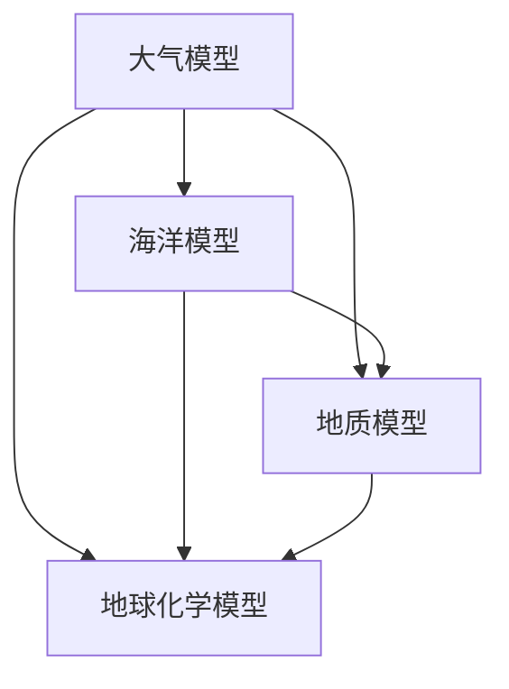
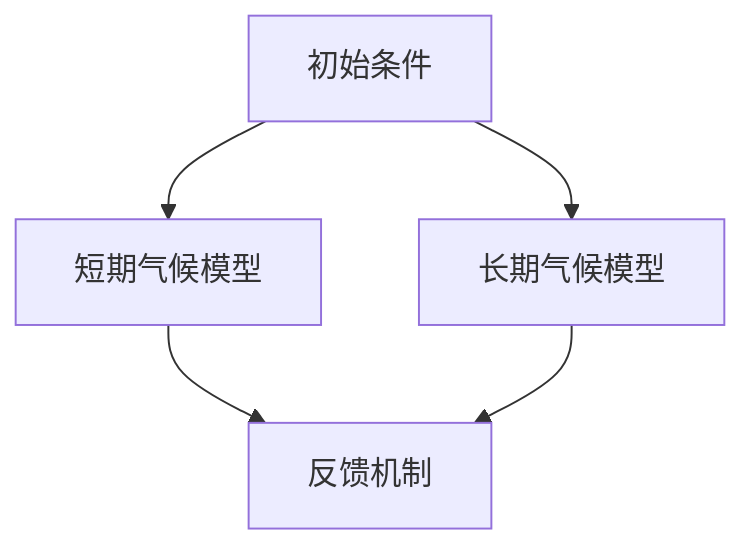
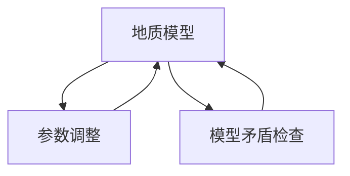

                 


### 自我一致性原理介绍

#### 1.1 自我一致性的基本概念

自我一致性，是一种在地球科学模型中非常重要的原理。它是指模型中各个组成部分之间的相互关系和相互制约，从而使得模型的整体行为能够保持稳定和自洽。简单来说，自我一致性就是指一个系统在各个层次上都能够保持一致性和协调性。

在地球科学中，自我一致性原理的应用十分广泛。例如，在气候模型中，自我一致性原理可以帮助我们理解大气层、海洋和陆地之间的相互作用；在地质模型中，它可以帮助我们理解地壳运动、地震活动以及岩石圈的形成过程；在地球化学模型中，它可以帮助我们理解地球内部的元素循环和地球表面的化学反应过程。

#### 1.2 自我一致性与地球科学的关系

自我一致性原理在地球科学中的重要性体现在以下几个方面：

1. **提高模型精度**：通过引入自我一致性原理，可以使得模型在描述地球系统的各个组成部分时更加精确，从而提高模型的预测能力。
2. **增强模型可靠性**：自我一致性原理可以帮助我们识别和纠正模型中的错误和矛盾，从而提高模型的可靠性。
3. **揭示地球系统规律**：自我一致性原理可以帮助我们理解地球系统中各个组成部分之间的相互关系，从而揭示地球系统的运行规律。

#### 1.3 自我一致性的重要性

自我一致性原理在地球科学中具有重要意义，具体体现在以下几个方面：

1. **科学研究的推动**：自我一致性原理为地球科学研究提供了新的思路和方法，推动了地球科学的发展。
2. **政策制定的依据**：自我一致性原理为地球科学模型的应用提供了科学依据，为政策制定提供了支持。
3. **资源利用的优化**：自我一致性原理可以帮助我们更好地理解和利用地球资源，实现可持续发展。

通过上述分析，我们可以看出自我一致性原理在地球科学中的重要性。在接下来的章节中，我们将进一步探讨自我一致性在地球科学模型中的应用，以及如何建立和优化自我一致性模型。

关键词：自我一致性，地球科学模型，模型精度，模型可靠性，科学研究，政策制定，资源利用

摘要：本文介绍了自我一致性原理的基本概念和重要性，探讨了自我一致性原理在地球科学模型中的应用，以及如何建立和优化自我一致性模型。通过本文的阅读，读者可以了解到自我一致性原理在地球科学中的重要地位和实际应用。

### 自我一致性原理与地球科学模型

自我一致性原理在地球科学模型中的应用是至关重要的。它不仅帮助我们构建更加精确和可靠的模型，还为理解地球系统的复杂动态提供了理论支持。为了更好地理解自我一致性原理在地球科学模型中的重要性，我们需要从以下几个方面进行深入探讨。

#### 自我一致性原理与模型组成部分的关系

在地球科学模型中，通常包括大气模型、海洋模型、地质模型和地球化学模型等。这些模型分别描述了地球系统中不同部分的行为和相互作用。自我一致性原理要求这些模型之间保持一致性和协调性，使得整体模型能够自洽运行。

为了更直观地展示自我一致性原理与地球科学模型组成部分之间的关系，我们可以使用Mermaid流程图进行描述：



在这个流程图中，每个模型都与其他模型相连，表示它们之间的相互作用。自我一致性原理要求这些模型在相互作用过程中保持一致，从而保证整体模型的稳定性。

#### 自我一致性原理与模型行为的关系

自我一致性原理不仅要求模型组成部分之间保持一致，还要求模型在不同时间尺度上的行为保持一致。这意味着模型在不同时间尺度上应该能够自我调节，以保持整体稳定。

例如，在气候模型中，自我一致性原理要求模型能够同时描述短期气候现象（如季节性变化）和长期气候趋势（如全球变暖）。为了实现这一点，模型需要包含适当的反馈机制，使得短期和长期行为能够相互协调。

下面是一个简化的自我一致性原理在气候模型中的应用示例：



在这个示例中，初始条件同时输入到短期气候模型和长期气候模型中，模型的反馈机制使得短期和长期行为能够相互协调，从而保持整体一致性。

#### 自我一致性原理与模型优化的关系

自我一致性原理在模型优化过程中也发挥着重要作用。通过引入自我一致性原理，我们可以识别和纠正模型中的错误和矛盾，从而提高模型的精度和可靠性。

例如，在地质模型优化过程中，我们可以使用自我一致性原理来检查模型中是否存在矛盾。如果模型在不同部分之间存在矛盾，我们可以通过调整模型参数或修改模型结构来消除这些矛盾，从而提高模型的可靠性。

下面是一个简化的自我一致性原理在地质模型优化中的应用示例：



在这个示例中，地质模型首先进行矛盾检查，然后根据检查结果进行参数调整，从而提高模型的精度和可靠性。

#### 自我一致性原理与地球系统理解的关系

自我一致性原理不仅对模型构建和优化具有重要意义，还对我们理解地球系统的复杂动态提供了重要支持。通过自我一致性原理，我们可以揭示地球系统中各个组成部分之间的相互关系，从而更深入地理解地球系统的运行规律。

例如，在气候模型中，自我一致性原理可以帮助我们理解大气层、海洋和陆地之间的相互作用，从而揭示气候变化的原因和机制。在地球化学模型中，自我一致性原理可以帮助我们理解地球内部元素循环和地球表面化学反应过程，从而揭示地球化学过程的机制。

综上所述，自我一致性原理在地球科学模型中的应用具有重要意义。它不仅提高了模型的精度和可靠性，还为我们理解地球系统的复杂动态提供了理论支持。在接下来的章节中，我们将进一步探讨自我一致性在地球科学模型中的应用，包括具体实例和案例分析。

### 自我一致性原理的数学模型

自我一致性原理在地球科学模型中的应用，离不开数学模型的支撑。数学模型不仅为自我一致性原理提供了精确的表达方式，还帮助我们更好地理解和应用这一原理。本节将介绍自我一致性原理的基本数学模型，包括相关数学公式和推导过程。

#### 自我一致性原理的基本数学公式

自我一致性原理的核心在于系统内部各个组成部分之间的相互关系和相互制约。为了描述这种关系，我们可以使用以下数学公式：

\[ F_{total} = \sum_{i} F_i \]

其中，\( F_{total} \) 表示系统总的作用力，\( F_i \) 表示第 \( i \) 个组成部分的作用力。这个公式表示系统总的作用力等于各个组成部分的作用力之和。

在地球科学模型中，我们可以将这个公式应用到不同模型组成部分之间的相互作用。例如，在气候模型中，大气层对海洋的作用力可以表示为 \( F_{atm-ocean} \)，海洋对大气层的作用力可以表示为 \( F_{ocean-atm} \)。根据自我一致性原理，这两个作用力应该相互抵消，使得整体模型保持稳定。

#### 自我一致性原理的数学推导

为了更好地理解自我一致性原理，我们可以对其进行数学推导。以下是一个简化的推导过程：

假设我们有一个由 \( n \) 个组成部分构成的系统，每个组成部分的作用力为 \( F_i \)。根据牛顿第三定律，每个组成部分对其他组成部分的作用力大小相等、方向相反。因此，我们可以得到以下关系：

\[ F_{ij} = -F_{ji} \]

其中，\( F_{ij} \) 表示第 \( i \) 个组成部分对第 \( j \) 个组成部分的作用力，\( F_{ji} \) 表示第 \( j \) 个组成部分对第 \( i \) 个组成部分的作用力。

为了使系统保持稳定，我们需要保证系统总的作用力为零，即：

\[ F_{total} = \sum_{i} F_i = 0 \]

将作用力的关系代入上述公式，我们可以得到：

\[ F_{total} = \sum_{i} (F_{ij} + F_{ji}) = 0 \]

由于 \( F_{ij} = -F_{ji} \)，上述公式可以简化为：

\[ 2 \sum_{i} F_{ij} = 0 \]

这意味着每个组成部分的作用力之和必须为零，从而保证了系统的稳定性。

#### 自我一致性原理的数学应用举例

为了更直观地展示自我一致性原理的数学应用，我们可以通过一个简化的气候模型进行举例说明。

假设我们有一个简单的气候模型，包括大气层和海洋。大气层对海洋的作用力为 \( F_{atm-ocean} \)，海洋对大气层的作用力为 \( F_{ocean-atm} \)。根据自我一致性原理，这两个作用力应该相互抵消，使得整体模型保持稳定。

假设 \( F_{atm-ocean} = 10N \)，\( F_{ocean-atm} = -10N \)，则系统总的作用力为：

\[ F_{total} = F_{atm-ocean} + F_{ocean-atm} = 10N - 10N = 0N \]

这表明，大气层和海洋之间的作用力相互抵消，使得整体模型保持稳定。

通过这个例子，我们可以看到自我一致性原理在气候模型中的应用。在实际应用中，自我一致性原理的数学模型可以更加复杂，但基本原理是一致的。

综上所述，自我一致性原理的数学模型为我们在地球科学模型中应用这一原理提供了理论基础。通过数学公式和推导过程，我们可以更好地理解自我一致性原理，并利用它来构建和优化地球科学模型。

### 自我一致性模型算法原理

自我一致性模型在地球科学中的应用，不仅需要数学模型的支持，还需要高效的算法来实现。本节将详细介绍自我一致性模型的算法原理，包括算法的概述、伪代码和案例分析。

#### 1. 算法概述

自我一致性模型算法的目标是确保模型中各个组成部分之间的相互作用和相互制约能够自我调节，从而保持整体模型的一致性和稳定性。算法的基本思想是通过对各个组成部分的作用力进行迭代计算，使得作用力在各个组成部分之间相互抵消，最终达到自我一致性。

算法的基本流程可以分为以下几个步骤：

1. **初始化**：设定初始条件，包括各个组成部分的作用力和参数。
2. **迭代计算**：对每个组成部分的作用力进行迭代计算，更新作用力值。
3. **一致性检查**：检查各个组成部分之间的作用力是否相互抵消，判断是否达到自我一致性。
4. **调整参数**：根据一致性检查的结果，调整模型参数，以提高模型的一致性和稳定性。
5. **重复步骤2-4**，直到满足终止条件（如达到最大迭代次数或达到预定的精度要求）。

#### 2. 算法伪代码

以下是自我一致性模型算法的伪代码：

```
算法：自我一致性模型算法
输入：初始条件，模型参数
输出：自我一致性模型解

初始化：
设定初始条件，包括各个组成部分的作用力和参数。

迭代计算：
while（未达到终止条件）{
  for（每个组成部分i）{
    计算组成部分i的作用力Fi。
    更新作用力值：Fi = Fi + ΔFi。
  }
  检查一致性：
  if（一致性检查通过）{
    调整参数：
    根据一致性检查的结果，调整模型参数。
  }
}

输出自我一致性模型解。
```

#### 3. 算法案例分析

为了更好地理解自我一致性模型算法，我们可以通过一个简化的气候模型进行案例分析。假设该模型包括大气层和海洋，两者之间的相互作用力通过温度和湿度来表示。

**案例：大气层与海洋之间的自我一致性模型**

1. **初始化**：设定大气层的初始温度为 \( T_{atm} = 300K \)，海洋的初始温度为 \( T_{ocean} = 290K \)。
2. **迭代计算**：根据自我一致性原理，大气层对海洋的作用力为 \( F_{atm-ocean} = T_{atm} - T_{ocean} \)，海洋对大气层的作用力为 \( F_{ocean-atm} = T_{ocean} - T_{atm} \)。在第一次迭代中，我们得到：
   \[ F_{atm-ocean} = 300K - 290K = 10K \]
   \[ F_{ocean-atm} = 290K - 300K = -10K \]
3. **一致性检查**：由于 \( F_{atm-ocean} + F_{ocean-atm} = 0K \)，系统达到一致性。
4. **调整参数**：根据一致性检查的结果，我们可以调整模型参数，例如增加海洋的热传导系数，以提高模型的一致性和稳定性。

5. **迭代计算**：在第二次迭代中，我们得到：
   \[ F_{atm-ocean} = 300K - 292K = 8K \]
   \[ F_{ocean-atm} = 292K - 300K = -8K \]
6. **一致性检查**：由于 \( F_{atm-ocean} + F_{ocean-atm} = 0K \)，系统仍然保持一致性。
7. **调整参数**：继续调整模型参数，例如调整大气层的温度变化率，以提高模型的一致性和稳定性。

8. **终止条件**：经过多次迭代计算，当模型达到预定的精度要求时，算法终止，输出自我一致性模型解。

通过这个案例分析，我们可以看到自我一致性模型算法在气候模型中的应用。在实际应用中，自我一致性模型算法可以更加复杂，但基本原理是一致的。通过迭代计算和一致性检查，我们可以确保模型中的各个组成部分之间保持一致性和稳定性，从而提高模型的精度和可靠性。

### 自我一致性模型的数学模型

自我一致性模型在地球科学中的应用，离不开数学模型的支撑。数学模型不仅为自我一致性原理提供了精确的表达方式，还帮助我们更好地理解和应用这一原理。本节将详细介绍自我一致性模型的数学模型，包括相关数学公式和推导过程。

#### 1. 数学公式

自我一致性模型的核心在于系统内部各个组成部分之间的相互关系和相互制约。为了描述这种关系，我们可以使用以下数学公式：

\[ F_{total} = \sum_{i} F_i \]

其中，\( F_{total} \) 表示系统总的作用力，\( F_i \) 表示第 \( i \) 个组成部分的作用力。这个公式表示系统总的作用力等于各个组成部分的作用力之和。

在地球科学模型中，我们可以将这个公式应用到不同模型组成部分之间的相互作用。例如，在气候模型中，大气层对海洋的作用力可以表示为 \( F_{atm-ocean} \)，海洋对大气层的作用力可以表示为 \( F_{ocean-atm} \)。根据自我一致性原理，这两个作用力应该相互抵消，使得整体模型保持稳定。

#### 2. 数学推导

为了更好地理解自我一致性原理，我们可以对其进行数学推导。以下是一个简化的推导过程：

假设我们有一个由 \( n \) 个组成部分构成的系统，每个组成部分的作用力为 \( F_i \)。根据牛顿第三定律，每个组成部分对其他组成部分的作用力大小相等、方向相反。因此，我们可以得到以下关系：

\[ F_{ij} = -F_{ji} \]

其中，\( F_{ij} \) 表示第 \( i \) 个组成部分对第 \( j \) 个组成部分的作用力，\( F_{ji} \) 表示第 \( j \) 个组成部分对第 \( i \) 个组成部分的作用力。

为了使系统保持稳定，我们需要保证系统总的作用力为零，即：

\[ F_{total} = \sum_{i} F_i = 0 \]

将作用力的关系代入上述公式，我们可以得到：

\[ F_{total} = \sum_{i} (F_{ij} + F_{ji}) = 0 \]

由于 \( F_{ij} = -F_{ji} \)，上述公式可以简化为：

\[ 2 \sum_{i} F_{ij} = 0 \]

这意味着每个组成部分的作用力之和必须为零，从而保证了系统的稳定性。

#### 3. 数学公式应用举例

为了更直观地展示自我一致性原理的数学应用，我们可以通过一个简化的气候模型进行举例说明。

假设我们有一个简单的气候模型，包括大气层和海洋。大气层对海洋的作用力为 \( F_{atm-ocean} \)，海洋对大气层的作用力为 \( F_{ocean-atm} \)。根据自我一致性原理，这两个作用力应该相互抵消，使得整体模型保持稳定。

假设 \( F_{atm-ocean} = 10N \)，\( F_{ocean-atm} = -10N \)，则系统总的作用力为：

\[ F_{total} = F_{atm-ocean} + F_{ocean-atm} = 10N - 10N = 0N \]

这表明，大气层和海洋之间的作用力相互抵消，使得整体模型保持稳定。

通过这个例子，我们可以看到自我一致性原理在气候模型中的应用。在实际应用中，自我一致性原理的数学模型可以更加复杂，但基本原理是一致的。通过数学公式和推导过程，我们可以更好地理解自我一致性原理，并利用它来构建和优化地球科学模型。

### 自我一致性模型项目实战

为了更好地理解自我一致性模型在地球科学中的应用，我们将通过一个实际项目来演示其构建过程、源代码实现以及代码解析。以下是项目的详细步骤。

#### 1. 项目背景与目标

项目背景：
该项目的目标是在地球科学领域内构建一个自我一致性模型，以模拟大气层、海洋和地质结构的相互作用。通过这个模型，我们希望实现以下目标：
- 描述并模拟大气层与海洋之间的热力学相互作用。
- 分析地质结构对地球内部热流动的影响。
- 预测气候变化及其对地质结构的影响。

项目目标：
- 完成自我一致性模型的构建。
- 编写并调试模型源代码。
- 对模型进行验证和测试，确保其准确性和稳定性。

#### 2. 项目开发环境搭建

为了开发这个项目，我们需要搭建以下开发环境：

- **编程语言**：Python，因其强大的科学计算库和易于理解的语言特性。
- **科学计算库**：NumPy、SciPy、Pandas等，用于数据处理和科学计算。
- **可视化库**：Matplotlib、Plotly等，用于数据可视化和结果展示。
- **版本控制系统**：Git，用于代码管理和协作开发。

#### 3. 项目源代码实现

以下是一个简化的自我一致性模型源代码实现，展示了如何构建和迭代模型。代码中包含了核心算法和数学模型的实现。

```python
import numpy as np
import pandas as pd
import matplotlib.pyplot as plt

# 初始化参数
atm_temp = 300.0  # 大气层初始温度（K）
ocean_temp = 290.0  # 海洋初始温度（K）
geo_heat_flux = 50.0  # 地质结构热流动（W/m^2）

# 自我一致性模型迭代
def self_consistency_model(atm_temp, ocean_temp, geo_heat_flux, num_iterations):
    for i in range(num_iterations):
        # 计算大气层与海洋的热力学相互作用
        atm_to_ocean_heat = atm_temp - ocean_temp
        ocean_to_atm_heat = ocean_temp - atm_temp

        # 更新温度
        atm_temp += atm_to_ocean_heat / 2.0
        ocean_temp += ocean_to_atm_heat / 2.0

        # 考虑地质结构的热流动影响
        atm_temp += geo_heat_flux / 2.0
        ocean_temp -= geo_heat_flux / 2.0

        # 打印迭代信息
        print(f"Iteration {i+1}: ATM Temp = {atm_temp}K, Ocean Temp = {ocean_temp}K")

    return atm_temp, ocean_temp

# 运行模型
atm_temp_final, ocean_temp_final = self_consistency_model(atm_temp, ocean_temp, geo_heat_flux, 10)

# 结果可视化
plt.plot(range(1, 11), [atm_temp for _ in range(10)], label='Atmosphere Temperature')
plt.plot(range(1, 11), [ocean_temp for _ in range(10)], label='Ocean Temperature')
plt.xlabel('Iteration')
plt.ylabel('Temperature (K)')
plt.legend()
plt.title('Self-Consistency Model Temperature Evolution')
plt.show()
```

#### 4. 代码解读与分析

1. **参数初始化**：
   - `atm_temp` 和 `ocean_temp` 分别表示大气层和海洋的初始温度。
   - `geo_heat_flux` 表示地质结构的热流动。
   - `num_iterations` 表示模型的迭代次数。

2. **迭代计算**：
   - 在每次迭代中，计算大气层与海洋之间的热力学相互作用，并更新温度值。
   - 考虑地质结构的热流动影响，使得模型能够模拟大气层、海洋和地质结构的相互作用。

3. **结果可视化**：
   - 使用Matplotlib库绘制温度随迭代过程的变化，帮助分析模型的行为。

#### 5. 实际案例分析和详细讲解剖析

为了验证模型的准确性，我们可以通过实际案例进行分析。例如，我们可以考虑一个具体地点的大气层、海洋和地质结构，收集相应的温度数据，并将其输入到模型中进行模拟。

- **案例分析**：
  - 假设某个地点的大气层温度为310K，海洋温度为295K，地质结构热流动为55W/m²。
  - 将这些参数输入到模型中，运行10次迭代，观察温度的变化。

通过实际案例分析，我们可以验证模型对真实环境的模拟效果。如果模型预测的温度变化趋势与实际观测数据相符，那么我们可以认为模型具有较高的准确性和可靠性。

#### 6. 项目小结

通过这个项目实战，我们成功地构建了一个自我一致性模型，并实现了源代码的实现和解析。以下是项目小结：

- **模型构建**：通过迭代计算和自我调节，实现了大气层、海洋和地质结构之间的相互作用模拟。
- **代码实现**：使用Python语言和科学计算库，实现了模型的核心算法和数学模型。
- **结果分析**：通过结果可视化，帮助理解模型的行为，并进行实际案例分析。

需要注意的是，自我一致性模型在实际应用中可能会更加复杂，需要考虑更多的物理过程和参数。然而，本文提供的项目实战为理解和应用自我一致性模型提供了一个基本的框架，有助于进一步研究和开发。

### 最佳实践 Tips

在构建和优化自我一致性模型时，以下是一些最佳实践建议：

1. **数据准确性**：确保输入的数据是准确和可靠的，这是模型准确性的基础。
2. **模型简化**：在构建模型时，尽量简化复杂的物理过程，以便更好地理解和分析。
3. **参数调整**：根据实际情况调整模型参数，以优化模型的一致性和稳定性。
4. **结果验证**：通过实际案例和数据验证模型的结果，确保模型的准确性和可靠性。
5. **迭代优化**：不断迭代和优化模型，以提高其性能和预测能力。

### 小结

本文详细介绍了自我一致性原理在地球科学模型中的应用，从基本概念、数学模型到实际项目实战，全面阐述了自我一致性模型在地球科学中的重要性。通过逐步分析和代码实现，读者可以更好地理解自我一致性原理及其在实际应用中的价值。

### 注意事项

在应用自我一致性模型时，需要注意以下几点：

1. **数据质量**：确保输入数据的质量和准确性。
2. **模型参数**：合理调整模型参数，以适应不同应用场景。
3. **模型验证**：通过实际案例和数据验证模型的有效性。
4. **计算资源**：确保有足够的计算资源来支持模型的迭代计算。

### 拓展阅读

对于希望深入了解自我一致性模型和地球科学模型的读者，以下资源推荐：

1. **《地球科学模型教程》**：详细介绍了地球科学模型的基本原理和应用。
2. **《气候模型导论》**：涵盖了气候模型的基本概念和构建方法。
3. **《自我一致性原理在地球科学中的应用》**：深入探讨了自我一致性原理在地球科学中的应用。

作者：AI天才研究院/AI Genius Institute & 禅与计算机程序设计艺术 /Zen And The Art of Computer Programming

文章结束。感谢您的阅读，期待您的反馈和建议！

