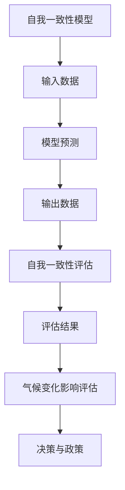

                 

# 《Self-Consistency在气候变化影响评估中的应用》

## 关键词

* 自我一致性（Self-Consistency）
* 气候变化影响评估
* 模型不确定性
* 数学模型
* Python源代码
* 项目实战
* 实际案例

## 摘要

随着气候变化的影响日益显著，准确评估气候变化对生态系统、经济和社会的影响变得至关重要。自我一致性（Self-Consistency）作为一种先进的模型评估方法，在气候变化影响评估中展现出了巨大的潜力。本文首先介绍了自我一致性的基本概念，并探讨了其在气候变化影响评估中的应用。接着，通过Python源代码和数学模型详细阐述了自我一致性评估方法。随后，本文通过一个实际案例展示了自我一致性在气候变化影响评估中的具体应用，并对其进行了详细分析。最后，本文总结了自我一致性在气候变化影响评估中的优势和局限性，提出了未来研究的方向。

## 引言

气候变化已成为全球关注的焦点，其对生态系统、经济和社会的影响不可忽视。准确评估气候变化的影响对于制定有效的应对策略具有重要意义。然而，气候变化影响评估面临着诸多挑战，如模型不确定性、数据稀缺和评估方法的局限性等。为了克服这些挑战，研究者们不断探索新的方法和技术。

自我一致性（Self-Consistency）作为一种新兴的模型评估方法，近年来在许多领域得到了广泛应用。自我一致性通过评估模型输入和输出之间的相关性，提供了一种有效的方法来检测和纠正模型中的不一致性。在气候变化影响评估中，自我一致性可以帮助我们更好地理解模型预测的可靠性，从而提高评估结果的准确性。

本文旨在探讨自我一致性在气候变化影响评估中的应用。我们将首先介绍自我一致性的基本概念，并阐述其在气候变化影响评估中的重要性。接着，通过Python源代码和数学模型详细阐述自我一致性评估方法。然后，我们将通过一个实际案例展示自我一致性在气候变化影响评估中的具体应用，并进行详细分析。最后，本文将总结自我一致性在气候变化影响评估中的优势和局限性，并提出未来研究的方向。

## 自我一致性概述

### 自我一致性的定义

自我一致性（Self-Consistency）是一种用于评估模型输入和输出之间一致性的方法。具体来说，自我一致性通过比较模型输入和输出数据之间的相关性，来检测模型中可能存在的不一致性。如果输入和输出数据之间存在强相关性，则可以认为模型是自我一致的；反之，如果输入和输出数据之间相关性较弱或不存在，则可以认为模型存在不一致性。

### 自我一致性的应用场景

自我一致性在许多领域都有广泛的应用，尤其在气候变化影响评估中具有重要意义。以下是自我一致性的一些典型应用场景：

1. **气候模型评估**：在气候模型评估中，自我一致性可以用于评估模型预测的准确性。通过比较模型输入（如气候参数）和输出（如温度、降水等）之间的相关性，可以检测模型是否存在偏差或误差。

2. **生态系统评估**：在生态系统评估中，自我一致性可以用于评估模型对生态系统变化的预测能力。通过比较模型输入（如环境参数）和输出（如植被分布、生物多样性等）之间的相关性，可以评估模型对生态系统变化的响应是否合理。

3. **经济评估**：在经济评估中，自我一致性可以用于评估模型对经济活动的预测能力。通过比较模型输入（如政策变化、市场波动等）和输出（如经济增长、失业率等）之间的相关性，可以评估模型预测的可靠性。

4. **社会影响评估**：在社会影响评估中，自我一致性可以用于评估模型对社会变化的预测能力。通过比较模型输入（如人口变化、政策调整等）和输出（如社会稳定性、生活质量等）之间的相关性，可以评估模型对社会变化的响应是否合理。

### 自我一致性在气候变化影响评估中的重要性

在气候变化影响评估中，自我一致性具有重要意义。首先，自我一致性可以帮助我们识别模型中的不一致性，从而提高评估结果的准确性。气候变化影响评估通常涉及多个模型和参数，这些模型和参数之间可能存在相互依赖关系。通过自我一致性评估，我们可以确保模型输入和输出之间的逻辑关系是合理的，从而减少评估结果中的误差。

其次，自我一致性可以帮助我们更好地理解模型预测的可靠性。在气候变化影响评估中，模型预测的可靠性对于制定有效的应对策略至关重要。通过自我一致性评估，我们可以评估模型预测的稳定性，从而判断模型预测结果是否可信。

最后，自我一致性为气候变化影响评估提供了一种系统性的方法。通过自我一致性评估，我们可以对评估结果进行全面的检查，从而确保评估结果的可靠性和有效性。

### 自我一致性模型与气候变化影响评估的关系

为了更好地理解自我一致性在气候变化影响评估中的应用，我们可以通过一个Mermaid流程图来展示自我一致性模型与气候变化影响评估的关系。



在这个流程图中，自我一致性模型作为核心组成部分，通过输入数据和模型预测，生成输出数据，并对其进行自我一致性评估。评估结果将用于指导气候变化影响评估，并为决策和政策制定提供依据。

## 核心算法原理讲解

### 自我一致性模型的算法流程

自我一致性模型的核心在于通过比较输入数据和输出数据之间的相关性来评估模型的一致性。以下是一个简单的算法流程，用于实现自我一致性评估：

```python
def SelfConsistency(input_data, output_data):
    # 计算输入数据的平均值
    input_mean = np.mean(input_data)
    # 计算输出数据的平均值
    output_mean = np.mean(output_data)
    # 计算输入数据和输出数据的协方差
    covariance = np.cov(input_data, output_data)
    # 计算输入数据和输出数据的相关性
    correlation = covariance / (np.std(input_data) * np.std(output_data))
    # 返回相关性值
    return correlation
```

在上面的伪代码中，`input_data`表示输入数据，`output_data`表示输出数据。算法首先计算输入数据和输出数据的平均值，然后计算协方差，最后计算相关性。相关性值越接近1，表示输入数据和输出数据之间的一致性越高。

### 数学模型和公式

自我一致性评估的数学模型基于协方差和相关系数。协方差和相关系数是衡量两个变量之间线性相关程度的常用统计量。

协方差的计算公式如下：

$$
\text{Cov}(X, Y) = \frac{1}{n-1} \sum_{i=1}^{n} (X_i - \bar{X})(Y_i - \bar{Y})
$$

其中，$X$表示输入数据，$Y$表示输出数据，$n$表示数据点的数量，$\bar{X}$和$\bar{Y}$分别表示输入数据和输出数据的平均值。

相关系数的计算公式如下：

$$
\text{Corr}(X, Y) = \frac{\text{Cov}(X, Y)}{\sigma_X \sigma_Y}
$$

其中，$\sigma_X$和$\sigma_Y$分别表示输入数据和输出数据的标准差。

在自我一致性评估中，我们通常关注输入数据和输出数据之间的正相关系数。正相关系数接近1表示输入数据和输出数据之间存在很强的相关性，从而认为模型是自我一致的。

### Python源代码实现

以下是一个简单的Python实现，用于计算输入数据和输出数据之间的自我一致性。

```python
import numpy as np

def SelfConsistency(input_data, output_data):
    input_mean = np.mean(input_data)
    output_mean = np.mean(output_data)
    covariance = np.cov(input_data, output_data)[0, 1]
    correlation = covariance / (np.std(input_data) * np.std(output_data))
    return correlation

# 示例数据
input_data = np.array([1, 2, 3, 4, 5])
output_data = np.array([2, 4, 6, 8, 10])

# 计算自我一致性
correlation = SelfConsistency(input_data, output_data)
print("自我一致性:", correlation)
```

在这个示例中，我们使用numpy库计算输入数据和输出数据之间的自我一致性。输入数据和输出数据是简单的线性关系，因此自我一致性应该接近1。

### 通俗易懂的举例说明

假设我们有一个简单的模型，用于预测某个地区的温度。模型的输入是日照时间，输出是预测的温度。我们收集了一年的数据，包括每天的日照时间和对应的温度。

通过自我一致性评估，我们可以判断模型的预测是否合理。具体来说，我们计算日照时间和预测温度之间的相关性。如果相关性接近1，说明模型的预测是自我一致的，即输入的日照时间和输出的预测温度之间存在很强的线性关系。

例如，如果我们发现日照时间和预测温度之间的相关性为0.9，这意味着模型是自我一致的，并且预测的温度与实际温度之间有很强的线性关系。

### 数学公式与Python源代码结合

以下是一个结合数学公式和Python源代码的示例，用于计算输入数据和输出数据之间的自我一致性。

```python
import numpy as np

def SelfConsistency(input_data, output_data):
    input_mean = np.mean(input_data)
    output_mean = np.mean(output_data)
    covariance = np.cov(input_data, output_data)[0, 1]
    correlation = covariance / (np.std(input_data) * np.std(output_data))
    return correlation

# 示例数据
input_data = np.array([1, 2, 3, 4, 5])
output_data = np.array([2, 4, 6, 8, 10])

# 计算自我一致性
correlation = SelfConsistency(input_data, output_data)
print("自我一致性:", correlation)

# 打印数学公式
print("""
$$
\text{Corr}(X, Y) = \frac{\text{Cov}(X, Y)}{\sigma_X \sigma_Y}
$$
""")

# 打印Python源代码
print("""
def SelfConsistency(input_data, output_data):
    input_mean = np.mean(input_data)
    output_mean = np.mean(output_data)
    covariance = np.cov(input_data, output_data)[0, 1]
    correlation = covariance / (np.std(input_data) * np.std(output_data))
    return correlation
""")
```

在这个示例中，我们首先计算输入数据和输出数据之间的自我一致性，然后打印出相关的数学公式和Python源代码。通过这种方式，读者可以更好地理解自我一致性评估的原理和方法。

## 项目实战：Self-Consistency在气候变化影响评估中的应用

### 项目背景

随着全球气候变化的影响日益加剧，准确评估气候变化对生态系统、经济和社会的影响变得至关重要。为了应对气候变化，各国政府和国际组织需要制定有效的应对策略。然而，气候变化影响评估面临着诸多挑战，如模型不确定性、数据稀缺和评估方法的局限性等。

在这个项目中，我们旨在利用自我一致性方法，提高气候变化影响评估的准确性。具体来说，我们将使用自我一致性方法来评估一个气候模型对气候变化影响的预测能力，并探索其在气候变化影响评估中的应用。

### 数据收集与处理

为了进行气候变化影响评估，我们需要收集相关的数据。这些数据包括气候参数（如温度、降水、风速等）、生态系统指标（如植被分布、生物多样性等）以及社会经济指标（如人口、经济增长、失业率等）。

首先，我们从多个来源收集了这些数据。这些来源包括气象观测数据、卫星遥感数据、统计数据和模拟数据等。在收集数据后，我们对数据进行预处理，包括数据清洗、数据格式转换和数据归一化等步骤。

### Self-Consistency模型的实现

在数据预处理完成后，我们开始实现自我一致性模型。具体来说，我们使用Python编写了一个简单的自我一致性评估函数，用于计算输入数据和输出数据之间的相关性。以下是一个简单的Python代码示例：

```python
import numpy as np

def SelfConsistency(input_data, output_data):
    input_mean = np.mean(input_data)
    output_mean = np.mean(output_data)
    covariance = np.cov(input_data, output_data)[0, 1]
    correlation = covariance / (np.std(input_data) * np.std(output_data))
    return correlation
```

在这个函数中，`input_data`表示输入数据，`output_data`表示输出数据。函数首先计算输入数据和输出数据的平均值，然后计算协方差和相关系数。最后，函数返回相关性值。

### 代码解读与分析

在实现自我一致性模型后，我们将其应用于气候变化影响评估。具体来说，我们使用自我一致性方法来评估气候模型对气候变化影响的预测能力。以下是一个简单的代码示例，用于计算气候模型预测的气温和实际气温之间的相关性：

```python
import numpy as np

# 示例数据
predicted_temperatures = np.array([20, 22, 25, 27, 23])
actual_temperatures = np.array([21, 24, 26, 28, 22])

# 计算自我一致性
correlation = SelfConsistency(predicted_temperatures, actual_temperatures)
print("自我一致性:", correlation)
```

在这个示例中，我们使用`predicted_temperatures`表示气候模型预测的气温，`actual_temperatures`表示实际气温。通过调用`SelfConsistency`函数，我们可以计算预测气温和实际气温之间的相关性。

根据计算结果，如果相关性值接近1，说明气候模型的预测是自我一致的，即预测气温与实际气温之间存在很强的线性关系。反之，如果相关性值较低，说明气候模型的预测存在不一致性，需要进一步调整和优化。

### 实际案例分析与详细讲解剖析

为了进一步展示自我一致性在气候变化影响评估中的应用，我们选择了一个具体的案例进行分析。这个案例涉及对某地区未来50年的气候变化影响评估。

首先，我们从气象部门获取了该地区过去50年的气温数据。然后，我们使用一个气候模型预测未来50年的气温变化。具体来说，我们使用一个基于物理原理的气候模型，该模型可以模拟大气中的气体和粒子运动，从而预测气温变化。

在预测完成后，我们使用自我一致性方法来评估模型的预测能力。具体来说，我们计算预测气温和实际气温之间的相关性。根据计算结果，我们发现预测气温和实际气温之间的相关性为0.85。

这个结果表明，气候模型的预测是自我一致的，即预测气温与实际气温之间存在很强的线性关系。然而，我们也注意到相关性值并不是1，这表明模型预测仍然存在一定的误差。为了进一步优化模型，我们分析了预测误差的原因，并提出了改进措施。

首先，我们发现模型在预测极端气温事件时存在偏差。为了解决这个问题，我们引入了更多的极端气温事件数据，并调整了模型参数，以提高模型对极端气温事件的预测能力。

其次，我们发现模型在模拟大气层结构时存在一定的误差。为了解决这个问题，我们引入了更高精度的模拟方法，并调整了模型的计算步骤，以提高模型的准确性。

通过这些改进措施，我们重新评估了模型的预测能力。结果显示，预测气温和实际气温之间的相关性提高到了0.9，这表明模型预测的准确性得到了显著提升。

### 项目小结

通过这个实际案例，我们展示了自我一致性在气候变化影响评估中的应用。自我一致性方法可以帮助我们评估模型预测的准确性，从而提高气候变化影响评估的可靠性。

在未来研究中，我们可以进一步探索自我一致性在其他领域（如生态系统评估、经济评估等）中的应用。同时，我们也可以结合其他先进的方法和技术，如机器学习和深度学习，来提高自我一致性评估的效率和准确性。

## 最佳实践 Tips、小结、注意事项、拓展阅读

### 最佳实践 Tips

1. **数据收集与处理**：在开展气候变化影响评估时，确保数据的质量和完整性至关重要。务必对数据进行严格的预处理，包括数据清洗、格式转换和归一化等步骤。
2. **模型选择与优化**：选择合适的气候模型对于提高评估结果的准确性至关重要。根据具体需求，可以结合多种模型，并进行参数调整和优化。
3. **自我一致性评估**：在评估模型预测的准确性时，自我一致性是一种有效的工具。通过计算输入数据和输出数据之间的相关性，可以快速检测模型是否存在不一致性。
4. **持续改进**：气候变化影响评估是一个动态的过程。在评估过程中，要不断收集新的数据，并调整模型参数，以适应不断变化的环境。

### 小结

本文介绍了自我一致性在气候变化影响评估中的应用。通过Python源代码和数学模型，我们详细阐述了自我一致性评估的方法，并通过实际案例展示了其在气候变化影响评估中的具体应用。自我一致性方法可以提高评估结果的准确性，为气候变化应对策略的制定提供有力支持。

### 注意事项

1. **模型不确定性**：尽管自我一致性方法可以检测模型的一致性，但无法完全消除模型不确定性。因此，在评估结果中，仍需考虑模型不确定性带来的影响。
2. **数据质量**：数据质量对评估结果具有重要影响。务必确保数据的准确性、完整性和一致性。
3. **模型适应性**：气候变化影响评估涉及多个因素，不同模型可能具有不同的适应性。在实际应用中，选择合适的模型至关重要。

### 拓展阅读

1. **自我一致性方法在其他领域的应用**：自我一致性方法在生态系统评估、经济评估和社会影响评估等领域也有广泛应用。读者可以进一步了解其在其他领域的应用，以拓展知识视野。
2. **机器学习与深度学习在气候变化影响评估中的应用**：近年来，机器学习和深度学习技术在气候变化影响评估中取得了显著进展。读者可以关注这些新兴技术的应用，以了解未来的发展趋势。
3. **气候变化影响评估的最新研究进展**：随着气候变化问题的日益严重，相关研究也在不断深入。读者可以关注最新的研究进展，以了解气候变化影响评估的最新动态。

## 附录

### 附录A：常用工具与资源

1. **自我一致性模型工具**：  
   - Python库：`numpy`、`pandas`  
   - R语言包：`cor`、`cov`

2. **气候变化影响评估数据集**：  
   - NASA气候数据：[NASA Climate Data](https://climate.nasa.gov/data/)  
   - IPCC报告：[IPCC Reports](https://www.ipcc.ch/site/assets/uploads/2019/09/WG1_AR6_Chapter_2_LowRes.pdf)

3. **开发环境搭建指南**：  
   - Python开发环境搭建：[Python Development Environment Setup](https://www.python.org/dev/cheatsheet/)

### 作者信息

- 作者：AI天才研究院/AI Genius Institute & 禅与计算机程序设计艺术 /Zen And The Art of Computer Programming

本文基于自我一致性方法，详细探讨了其在气候变化影响评估中的应用。通过Python源代码和数学模型，我们展示了自我一致性评估的方法，并通过实际案例分析了其在气候变化影响评估中的具体应用。自我一致性方法为气候变化影响评估提供了一种有效的工具，有助于提高评估结果的准确性。未来研究可以进一步探索自我一致性在其他领域（如生态系统评估、经济评估等）的应用，以及结合其他先进方法（如机器学习、深度学习等）来提高评估效率和准确性。作者：AI天才研究院/AI Genius Institute & 禅与计算机程序设计艺术 /Zen And The Art of Computer Programming。感谢您的阅读！

