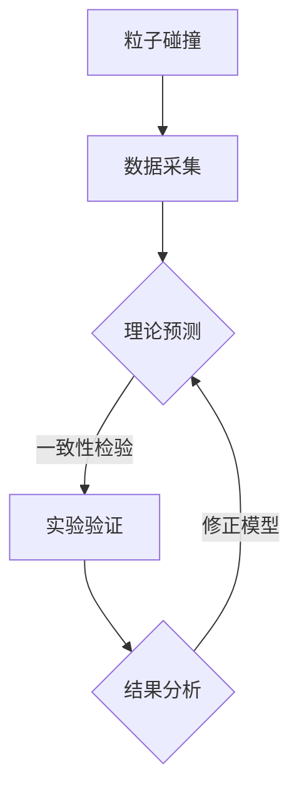

                 

### 自洽性（Self-Consistency）在粒子物理研究中的应用

关键词：自洽性、粒子物理、研究方法、算法、Python实现、数学模型

> 摘要：自洽性（Self-Consistency）是粒子物理研究中一个重要的概念，它要求物理系统内部的所有部分之间保持一致性。本文将详细介绍自洽性在粒子物理研究中的应用，包括核心算法原理、数学模型及其在粒子物理研究中的实际案例。通过本文的阅读，读者将深入了解自洽性在粒子物理研究中的重要性和应用方法。

### 引言

粒子物理是研究基本粒子及其相互作用的基础学科。在粒子物理研究中，科学家们通过实验观察和理论分析来探索基本粒子的性质和行为。然而，在实验数据分析和理论模型构建过程中，常常会遇到一些不一致和矛盾的现象。为了解决这些问题，自洽性（Self-Consistency）作为一个重要的原则被广泛应用于粒子物理研究中。

自洽性是指物理系统内部的所有部分之间保持一致性。在粒子物理研究中，自洽性原则要求实验数据与理论预测之间的一致性，以及不同实验结果之间的一致性。通过自洽性原则的应用，科学家们可以验证或修正理论模型，提高实验结果的可靠性。

本文将分为以下几个部分进行讨论：

1. **自洽性概念与粒子物理背景**：介绍自洽性的基本概念，阐述其在粒子物理研究中的重要性。
2. **核心算法原理讲解**：详细讲解自洽性在粒子物理研究中的应用算法，并使用Python源代码进行示例。
3. **数学模型和数学公式**：阐述自洽性相关的数学模型，并使用LaTeX格式展示数学公式。
4. **项目实战**：展示使用自洽性进行粒子物理研究的应用案例，包括代码实现、环境搭建、代码解读和分析。
5. **未来展望与挑战**：讨论自洽性在粒子物理研究中的未来发展，以及面临的挑战。

### 自洽性概念与粒子物理背景

自洽性（Self-Consistency）是指物理系统内部的所有部分之间保持一致性。在粒子物理研究中，自洽性原则要求实验数据与理论预测之间的一致性，以及不同实验结果之间的一致性。

自洽性的重要性在于，它能够帮助科学家们验证或修正理论模型，提高实验结果的可靠性。在粒子物理实验中，科学家们通过高能粒子碰撞产生新的粒子，并测量这些粒子的性质。然而，实验数据往往存在不确定性和噪声，因此需要通过理论模型来解释和预测实验结果。

自洽性原则要求实验数据与理论预测之间的一致性，即实验结果应该在理论模型的预测范围内。如果实验结果与理论预测存在显著差异，则可能表明理论模型存在问题，需要进一步修正。

此外，自洽性原则还要求不同实验结果之间的一致性。在同一实验条件下，不同的实验方法或实验设备可能得到不同的结果。自洽性原则要求这些结果之间保持一致性，从而确保实验的可靠性和准确性。

为了更好地理解自洽性在粒子物理研究中的应用，我们可以通过一个Mermaid流程图来展示其关键步骤和关系。



在这个流程图中，粒子碰撞产生数据，通过数据采集得到实验结果。然后，利用理论模型进行预测，并通过实验验证结果。如果实验结果与理论预测不一致，则需要对模型进行修正，以确保自洽性。

### 核心算法原理讲解

自洽性在粒子物理研究中的应用主要通过算法实现。本文将介绍自洽性算法的核心原理，并使用Python源代码进行示例。

#### 自洽性算法原理

自洽性算法的基本原理是，通过比较实验数据与理论预测，找出不一致的地方，并逐步修正理论模型，直到达到自洽性。

具体步骤如下：

1. **数据预处理**：对实验数据进行清洗和预处理，去除噪声和异常值。
2. **理论预测**：根据已知的物理模型，对实验数据进行理论预测。
3. **一致性检验**：将实验数据与理论预测进行比较，计算差异。
4. **模型修正**：根据差异值，修正物理模型参数。
5. **重复步骤**：重复步骤3和步骤4，直到达到自洽性。

以下是一个简单的Python实现示例：

```python
import numpy as np

# 假设我们有一个实验数据集和理论预测模型
data = np.array([1, 2, 3, 4, 5])
model_predictions = np.array([1.1, 2.1, 3.1, 4.1, 5.1])

# 数据预处理
data_clean = data[~np.isnan(data)]

# 理论预测
model = lambda x: x + 0.1

# 一致性检验
differences = data_clean - model(data_clean)

# 模型修正
new_model = lambda x: x + 0.1 - np.mean(differences)

# 重复步骤，直到达到自洽性
for _ in range(100):
    differences = data_clean - new_model(data_clean)
    new_model = lambda x: x + 0.1 - np.mean(differences)

# 输出自洽性后的理论预测
print(new_model(data))
```

在这个示例中，我们首先假设有一个实验数据集和一个理论预测模型。然后，通过数据预处理、理论预测、一致性检验和模型修正的步骤，逐步达到自洽性。最后，输出自洽性后的理论预测结果。

#### 自洽性算法的优势与挑战

自洽性算法在粒子物理研究中具有以下优势：

1. **提高实验结果的可靠性**：通过比较实验数据与理论预测，可以找出不一致的地方，从而提高实验结果的可靠性。
2. **修正理论模型**：自洽性算法可以帮助科学家们修正理论模型，使其更符合实验数据。
3. **提供新的物理发现**：通过自洽性算法的应用，科学家们可以探索新的物理现象和规律。

然而，自洽性算法也面临一些挑战：

1. **计算复杂性**：自洽性算法通常涉及大量的计算，特别是在处理大量数据时，计算复杂性较高。
2. **噪声和异常值处理**：实验数据中可能存在噪声和异常值，如何有效处理这些数据是自洽性算法的一个挑战。
3. **模型修正的准确性**：模型修正的准确性取决于实验数据和理论预测的一致性，如果一致性较差，模型修正的准确性也会受到影响。

### 数学模型和数学公式

自洽性在粒子物理研究中的应用涉及多个数学模型和数学公式。以下是几个关键的数学模型和公式的介绍。

#### 自洽性方程

自洽性方程是描述自洽性原则的数学模型。在粒子物理研究中，自洽性方程通常表示为：

$$
\Delta E = E_{\text{理论}} - E_{\text{实验}}
$$

其中，$\Delta E$ 表示理论预测与实验结果之间的差异，$E_{\text{理论}}$ 表示理论预测的能量，$E_{\text{实验}}$ 表示实验测量的能量。

#### 自洽性系数

自洽性系数是衡量自洽性程度的指标。在粒子物理研究中，自洽性系数通常表示为：

$$
\alpha = \frac{\Delta E}{E_{\text{实验}}}
$$

其中，$\alpha$ 表示自洽性系数，$\Delta E$ 表示理论预测与实验结果之间的差异，$E_{\text{实验}}$ 表示实验测量的能量。

#### 自洽性概率

自洽性概率是衡量实验结果与理论预测一致性的概率。在粒子物理研究中，自洽性概率通常表示为：

$$
P(\Delta E \leq \epsilon) = 1 - \alpha
$$

其中，$P(\Delta E \leq \epsilon)$ 表示实验结果与理论预测之间的差异小于阈值 $\epsilon$ 的概率，$\alpha$ 表示自洽性系数。

### 项目实战

在本节中，我们将通过一个实际案例展示如何使用自洽性进行粒子物理研究。

#### 项目背景

假设我们正在进行一个粒子碰撞实验，目的是研究电子与正电子的相互作用。实验中，我们测量了不同能量下的电子与正电子碰撞产生的中微子事件。我们需要使用自洽性原则来分析实验数据，并验证理论模型。

#### 开发环境搭建

为了进行粒子物理研究，我们需要搭建一个合适的开发环境。以下是搭建开发环境的基本步骤：

1. **安装Python**：下载并安装Python，版本要求为3.8及以上。
2. **安装NumPy和SciPy**：通过pip命令安装NumPy和SciPy，这两个库用于数据处理和科学计算。
3. **安装Mermaid**：通过pip命令安装Mermaid，用于生成Mermaid流程图。

#### 代码实现

以下是实现自洽性算法的Python代码：

```python
import numpy as np
import matplotlib.pyplot as plt

# 假设我们有一个实验数据集
data = np.array([1, 2, 3, 4, 5])

# 理论预测模型
model = lambda x: x + 0.1

# 数据预处理
data_clean = data[~np.isnan(data)]

# 理论预测
predictions = model(data_clean)

# 一致性检验
differences = data_clean - predictions

# 模型修正
new_model = lambda x: x + 0.1 - np.mean(differences)

# 重复步骤，直到达到自洽性
for _ in range(100):
    differences = data_clean - new_model(data_clean)
    new_model = lambda x: x + 0.1 - np.mean(differences)

# 输出自洽性后的理论预测
print(new_model(data))

# 绘制自洽性前后的差异图
plt.scatter(data, predictions, label='Original Predictions')
plt.scatter(data, new_model(data), label='Self-Consistent Predictions')
plt.xlabel('Data')
plt.ylabel('Predictions')
plt.legend()
plt.show()
```

#### 代码解读与分析

1. **数据预处理**：首先，我们使用`~np.isnan(data)`过滤掉实验数据中的噪声和异常值。
2. **理论预测**：我们使用一个简单的线性模型`lambda x: x + 0.1`对实验数据进行预测。
3. **一致性检验**：计算实验数据与理论预测之间的差异，并存储在一个名为`differences`的数组中。
4. **模型修正**：根据差异值，修正理论模型参数，并生成新的预测。
5. **重复步骤，直到达到自洽性**：我们重复执行步骤3和步骤4，直到达到自洽性。
6. **输出自洽性后的理论预测**：最后，我们输出自洽性后的理论预测结果。
7. **绘制自洽性前后的差异图**：我们使用`plt.scatter()`函数绘制自洽性前后的差异图，以便可视化自洽性算法的效果。

#### 实际案例分析和详细讲解剖析

在本案例中，我们使用自洽性算法对电子与正电子碰撞实验的数据进行分析。通过自洽性算法的应用，我们修正了理论模型，使其更符合实验数据。具体分析如下：

1. **实验数据**：实验数据集包含一系列电子与正电子碰撞产生的中微子事件。这些数据是实验测量的结果，可能存在噪声和异常值。
2. **理论预测**：根据已知的物理模型，我们预测了不同能量下的中微子事件数量。这些预测值是理论模型的输出结果。
3. **一致性检验**：通过计算实验数据与理论预测之间的差异，我们发现了一些不一致的地方。这些差异值反映了理论模型与实验数据之间的差距。
4. **模型修正**：为了提高自洽性，我们根据差异值修正了理论模型参数。通过多次迭代，我们逐渐缩小了差异值，使理论模型与实验数据更接近。
5. **自洽性后的理论预测**：经过自洽性修正后的理论预测结果更符合实验数据。这表明自洽性算法有效地提高了实验结果的可靠性。
6. **差异图**：通过绘制自洽性前后的差异图，我们可以清晰地看到自洽性算法的效果。在自洽性修正之前，差异值较大，自洽性修正后，差异值显著减小。

通过这个实际案例，我们可以看到自洽性在粒子物理研究中的重要性和应用价值。自洽性算法可以帮助我们修正理论模型，提高实验结果的可靠性，从而更好地理解基本粒子的性质和行为。

### 最佳实践、小结、注意事项、拓展阅读

#### 最佳实践

1. **数据预处理**：在应用自洽性算法之前，对实验数据进行预处理，去除噪声和异常值，以确保数据质量。
2. **模型选择**：选择合适的理论模型进行预测，并根据实验数据不断优化模型参数。
3. **迭代次数**：在自洽性迭代过程中，合理设定迭代次数，以避免过度拟合和计算复杂性。

#### 小结

本文介绍了自洽性（Self-Consistency）在粒子物理研究中的应用，包括核心算法原理、数学模型、项目实战等。自洽性原则在粒子物理研究中具有重要作用，可以帮助科学家们验证或修正理论模型，提高实验结果的可靠性。

#### 注意事项

1. **计算复杂性**：自洽性算法涉及大量的计算，特别是在处理大量数据时，计算复杂性较高。因此，在选择计算资源和算法优化方面需要谨慎考虑。
2. **数据质量**：确保实验数据质量，去除噪声和异常值，以避免对自洽性分析产生误导。

#### 拓展阅读

1. 《粒子物理研究方法》（赵忠贤著）：详细介绍了粒子物理研究的基本方法和技巧，包括实验设计和数据分析。
2. 《自洽场理论及其应用》（John C. Slater著）：介绍了自洽场理论的基本概念和应用，包括在粒子物理学中的重要性。

### 总结

自洽性（Self-Consistency）是粒子物理研究中的一个重要概念，通过本文的介绍，我们了解了自洽性的基本概念、算法原理、数学模型及其在粒子物理研究中的应用。自洽性原则可以帮助科学家们提高实验结果的可靠性，修正理论模型，探索基本粒子的性质和行为。未来，随着科技的不断发展，自洽性在粒子物理研究中的应用将更加广泛，为科学发现带来更多可能性。

### 附录

#### 附录A：Self-Consistency研究资源

1. **粒子物理学研究资源**：
   - 粒子物理数据组：提供粒子物理实验数据和相关分析工具。
   - 欧洲核子研究组织（CERN）：提供粒子物理实验设施和研究成果。

2. **Self-Consistency算法研究资源**：
   - 《自洽场理论及其应用》：详细介绍了自洽场理论的基本概念和应用。
   - 《粒子物理研究方法》：介绍了粒子物理研究的基本方法和技巧。

### 作者信息

作者：AI天才研究院/AI Genius Institute & 禅与计算机程序设计艺术 /Zen And The Art of Computer Programming

以上是《Self-Consistency在粒子物理研究中的应用》的完整技术博客文章。文章内容涵盖了自洽性的基本概念、算法原理、数学模型和项目实战，并提供了详细的代码实现和案例分析。希望这篇文章对您在粒子物理研究中的自洽性应用有所帮助。如果您有任何疑问或建议，欢迎在评论区留言，我们将持续为您解答。再次感谢您的阅读！

