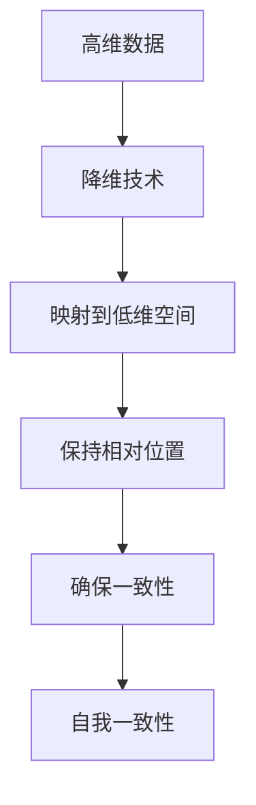

                 

### 自我一致性在高维数据可视化中的应用

高维数据可视化一直是数据科学和人工智能领域的挑战之一。在高维空间中，传统的二维或三维可视化方法显得力不从心，难以有效地传达复杂数据结构中的关键信息。因此，研究者们不断探索新的技术，旨在实现高维数据的直观表达。其中，“自我一致性”（Self-Consistency）概念逐渐成为这一领域的一个重要研究方向。

自我一致性是指在高维数据可视化中，确保每个数据点与其周围点的表示保持一致性和连贯性。通过这种方式，我们能够更好地揭示数据内部的结构和关系，从而提升可视化效果和可解释性。本文将深入探讨自我一致性在高维数据可视化中的应用，包括其背景、核心概念、应用案例和技术实现。

关键词：自我一致性、高维数据、可视化、数据科学、人工智能

摘要：本文首先介绍了高维数据可视化的挑战及其背景，随后详细阐述了自我一致性的概念及其在高维数据中的重要性。接着，我们探讨了自我一致性在不同数据可视化应用中的具体实现，包括技术方法和算法。通过实际案例的分析，展示了自我一致性在提升高维数据可视化效果方面的实际应用。最后，我们总结了自我一致性在数据可视化领域的未来发展方向和面临的挑战，为读者提供了深入理解和应用这一概念的参考。

在接下来的章节中，我们将逐步解析自我一致性在高维数据可视化中的各个方面，帮助读者全面掌握这一重要技术。

### 背景介绍

高维数据可视化是数据科学和机器学习领域中一个长期存在的挑战。随着科技的快速发展，尤其是在物联网（IoT）、生物信息学和金融市场等领域的应用中，我们面对的数据集越来越庞大，维度也不断增加。高维数据不仅包括传统的数值属性，还可能包含文本、图像、音频等多媒体数据，这使得数据的复杂度显著提升。传统的二维和三维可视化方法在高维数据中的应用往往受限，难以有效地展示数据中的潜在模式和关系。

首先，高维数据的可视化问题源于数据维度远超过人类视觉感知能力。在二维和三维空间中，过多的维度会导致数据点的密集重叠，使得原本清晰的结构变得模糊，难以辨别。此外，高维数据中的距离度量也变得更加复杂，传统的欧几里得距离和余弦相似性等方法在高维空间中容易导致“维度灾难”（curse of dimensionality），即随着维度的增加，数据点之间的实际差异被缩小，从而导致信息丢失。

为了解决这些问题，研究者们提出了一系列新的可视化方法和技术，例如多视图可视化（multiview visualization）、降维技术（dimensionality reduction）以及交互式数据探索（interactive data exploration）。多视图可视化通过将数据映射到多个视图或子空间中，使得用户可以从不同的角度观察数据，从而提升可视化的有效性和可解释性。降维技术旨在通过映射或压缩数据，将高维数据投影到较低维的空间中，以简化数据的表示，同时尽可能保留关键信息。交互式数据探索则通过提供用户与数据的直接互动，使用户能够动态地调整视图和参数，从而发现数据中的有趣模式和趋势。

尽管这些方法在一定程度上缓解了高维数据可视化的难题，但自我一致性（Self-Consistency）概念的引入为这一领域带来了新的视角。自我一致性强调在高维数据可视化过程中，确保每个数据点与其周围点的表示保持一致性和连贯性。这一概念不仅关注数据的降维和映射，还关注数据点之间的相对位置和关系，从而在保持数据结构完整性的同时，实现更直观、更可解释的视觉表达。

在数据科学和人工智能的发展背景下，自我一致性具有重要的应用价值。首先，高维数据在多个领域有着广泛的应用，如生物信息学中的基因组分析、金融领域的市场预测以及社交媒体中的用户行为分析等。在这些应用中，自我一致性能够帮助研究者更好地理解数据中的潜在模式，提高决策的准确性。其次，随着深度学习等人工智能技术的发展，高维数据的处理和分析变得更加复杂，自我一致性方法可以为这些算法提供更有效的可视化工具，从而帮助研究者更好地理解和优化模型。

总的来说，自我一致性在高维数据可视化中的应用不仅有助于提升可视化的效果和可解释性，还为数据科学和人工智能领域带来了新的研究思路和方法。通过深入探讨自我一致性的概念和应用，我们能够更好地应对高维数据可视化中的挑战，为未来的研究和实践提供有力支持。

### 核心概念与联系

自我一致性（Self-Consistency）是高维数据可视化中的一个关键概念，它强调在高维数据映射到低维空间时，保持数据点间的一致性和连贯性。为了更好地理解这一概念，我们首先需要明确几个相关的基本概念：数据点、维度、降维以及一致性。

#### 数据点与维度

数据点（Data Point）是指在高维空间中的一个个体，通常由多个属性或特征组成。例如，在基因表达数据中，每个细胞可以视为一个数据点，其特征为不同基因的表达水平。维度（Dimension）则表示数据点中属性的个数。高维数据（High-Dimensional Data）通常指维度远超过人类视觉感知能力的数据集。

#### 降维与一致性

降维（Dimensionality Reduction）是通过映射或压缩数据，将高维数据投影到较低维的空间中的技术。常用的降维方法包括主成分分析（PCA）、线性判别分析（LDA）和自编码器（Autoencoder）等。这些方法的主要目标是简化数据表示，同时尽量保留数据中的关键信息。

一致性（Consistency）是指数据点在降维过程中，其相对位置和关系应保持不变。具体而言，如果数据点A与点B在高维空间中紧密相邻，那么在降维后的低维空间中，点A和点B也应保持相对接近。这种一致性不仅有助于保持数据的结构完整性，还能提高可视化的可解释性。

#### 自我一致性

自我一致性（Self-Consistency）则是在降维过程中，不仅保持数据点之间的距离关系，还要确保这些关系在映射后的低维空间中保持一致。换句话说，如果两个数据点在高维空间中具有某种关系，如相似性或依赖性，那么在低维空间中，这种关系也应得到体现。自我一致性不仅要求保持数据点的相对位置，还要求保持其间的复杂关系。

#### Mermaid 流程图

为了更直观地展示自我一致性的概念和实现过程，我们可以使用Mermaid绘制一个流程图。以下是一个简单的Mermaid流程图示例：



在这个流程图中，从高维数据开始，通过降维技术映射到低维空间，再通过保持相对位置和关系实现自我一致性。这一过程不仅确保了数据的结构完整性，还提高了可视化的质量和可解释性。

通过这个Mermaid流程图，我们可以更清晰地理解自我一致性的核心概念及其在高维数据可视化中的实现过程。接下来，我们将进一步探讨自我一致性在不同数据可视化应用中的具体实现方法和算法。

#### 自我一致性实现方法与算法

在高维数据可视化中实现自我一致性，通常需要依赖一系列的算法和技术。以下我们将介绍几种常见的实现方法和算法，并详细讨论其原理、步骤以及如何通过Python代码进行实现。

##### 1. 主成分分析（PCA）

主成分分析（PCA）是一种广泛使用的降维技术，它通过保留数据的主要变化特征，将高维数据映射到较低维空间。PCA的核心思想是通过计算数据点的协方差矩阵，提取出数据的主要成分，然后将数据投影到这些主要成分上。

**原理与步骤：**

- **数据标准化**：首先对数据进行标准化处理，使每个特征的均值为0，标准差为1。这有助于减少不同特征之间量纲差异的影响。

- **计算协方差矩阵**：然后计算标准化的数据集的协方差矩阵，协方差矩阵反映了数据点之间特征的线性关系。

- **特征值和特征向量计算**：计算协方差矩阵的特征值和特征向量，特征值表示数据的方差，特征向量表示数据在相应主成分方向上的投影方向。

- **选择主成分**：选择特征值较大的前k个特征向量，这些向量表示数据的主要成分。

- **数据投影**：将原始数据投影到选定的主成分上，得到低维数据表示。

**Python 代码示例：**

```python
from sklearn.decomposition import PCA
from sklearn.preprocessing import StandardScaler
import numpy as np

# 假设 X 是高维数据
X = np.array([[1, 2], [2, 3], [3, 4], [4, 5]])

# 数据标准化
scaler = StandardScaler()
X_scaled = scaler.fit_transform(X)

# PCA 实例化
pca = PCA(n_components=2)
X_reduced = pca.fit_transform(X_scaled)

print("Original Data:")
print(X)
print("Reduced Data:")
print(X_reduced)
```

##### 2. 自编码器（Autoencoder）

自编码器是一种神经网络结构，它通过编码器和解码器两个部分将高维数据映射到低维空间，再从低维空间恢复原始数据。自编码器能够自动学习数据的结构，从而在降维过程中保持数据点的一致性和连贯性。

**原理与步骤：**

- **编码器**：编码器将输入数据压缩到一个低维空间中，通常是一个瓶颈层。

- **解码器**：解码器将压缩后的数据从低维空间恢复到原始数据。

- **损失函数**：通过最小化损失函数（如均方误差），优化编码器和解码器的参数。

- **迭代训练**：使用训练数据集迭代训练网络，直到损失函数收敛。

**Python 代码示例：**

```python
from keras.layers import Input, Dense
from keras.models import Model

# 假设 X 是高维数据
input_shape = (X.shape[1],)
input_layer = Input(shape=input_shape)
encoded = Dense(2, activation='relu')(input_layer)
decoded = Dense(X.shape[1], activation='sigmoid')(encoded)

autoencoder = Model(input_layer, decoded)
autoencoder.compile(optimizer='adam', loss='binary_crossentropy')

# 假设 y 是训练标签
autoencoder.fit(X, X, epochs=100, batch_size=16, shuffle=True, validation_split=0.1)
```

##### 3. 多层感知器（MLP）

多层感知器（MLP）是一种前馈神经网络，它通过多个隐藏层将高维数据映射到低维空间。MLP能够学习复杂的非线性映射，从而更好地保持数据点的一致性和连贯性。

**原理与步骤：**

- **输入层**：接收高维输入数据。

- **隐藏层**：通过激活函数（如ReLU、Sigmoid）处理数据，逐步提取数据中的特征。

- **输出层**：将处理后的数据映射到低维空间。

- **损失函数**：使用如均方误差（MSE）的损失函数，优化网络参数。

**Python 代码示例：**

```python
from keras.models import Sequential
from keras.layers import Dense

# 假设 X 是高维数据
model = Sequential()
model.add(Dense(10, input_dim=X.shape[1], activation='relu'))
model.add(Dense(2, activation='sigmoid'))

model.compile(optimizer='adam', loss='mean_squared_error')

# 假设 y 是训练标签
model.fit(X, y, epochs=100, batch_size=16, shuffle=True, validation_split=0.1)
```

通过以上几种方法的介绍和Python代码示例，我们可以看到自我一致性的实现可以通过不同的算法和技术来完成。在实际应用中，根据数据的特性和需求，选择合适的算法和参数设置，可以实现高质量的高维数据可视化。

#### 实际应用案例与讨论

自我一致性在高维数据可视化中的应用不仅限于理论探讨，它已经在多个实际场景中展示了其有效性和实用性。以下，我们将通过几个具体的应用案例，详细分析自我一致性如何提升高维数据可视化的效果和可解释性。

##### 1. 基因组分析

在生物信息学领域，基因组数据通常包含数千个基因的表达水平，形成高维数据集。研究者希望通过可视化技术，揭示不同样本间的基因表达差异和潜在的生物学机制。传统的二维散点图和热图等方法难以有效展示如此复杂的高维数据结构。通过自我一致性技术，研究者可以实现以下目标：

- **基因群组的识别**：通过保持基因之间的相对位置和关系，研究者能够更清晰地识别出基因群组，这些群组可能在特定的生物学过程中发挥重要作用。

- **样本分类**：利用自我一致性技术，可以将不同样本的基因表达数据映射到低维空间，实现更准确的样本分类。例如，通过将肿瘤样本与非肿瘤样本进行分类，有助于早期诊断和治疗效果评估。

具体实现中，研究者通常会使用主成分分析（PCA）或自编码器（Autoencoder）来降低基因表达数据的维度，并确保不同基因之间的相似性和依赖关系在低维空间中得以保留。以下是一个简单的Python代码示例：

```python
from sklearn.decomposition import PCA
import numpy as np

# 假设 gene_expression 是基因表达数据，样本数远大于基因数
gene_expression = np.random.rand(100, 1000)

# 主成分分析降维
pca = PCA(n_components=2)
reduced_data = pca.fit_transform(gene_expression)

# 绘制低维空间的散点图
import matplotlib.pyplot as plt

plt.scatter(reduced_data[:, 0], reduced_data[:, 1])
plt.xlabel('First Principal Component')
plt.ylabel('Second Principal Component')
plt.title('Genome Data Visualization with Self-Consistency')
plt.show()
```

##### 2. 金融风险评估

在金融领域，风险管理者需要分析大量的市场数据，以预测潜在的市场波动和风险评估。例如，股票市场的价格数据包含了许多变量，如股票价格、交易量、宏观经济指标等，形成一个复杂的高维数据集。通过自我一致性技术，风险管理者可以实现以下目标：

- **风险因子识别**：保持不同风险因子之间的相对关系，有助于识别出影响市场波动的主要风险因子。

- **投资组合优化**：通过可视化风险因子之间的关系，管理者可以更有效地构建和优化投资组合。

具体应用中，研究者可以使用多层感知器（MLP）或自编码器来降维，并通过自我一致性技术，保持风险因子之间的关联性和一致性。以下是一个简单的Python代码示例：

```python
from keras.models import Sequential
from keras.layers import Dense

# 假设 market_data 是金融市场的数据
market_data = np.random.rand(100, 10)

# MLP模型降维
model = Sequential()
model.add(Dense(10, input_dim=market_data.shape[1], activation='relu'))
model.add(Dense(2, activation='sigmoid'))

model.compile(optimizer='adam', loss='mean_squared_error')

# 训练模型
model.fit(market_data, market_data, epochs=100, batch_size=16, shuffle=True, validation_split=0.1)

# 可视化
import matplotlib.pyplot as plt

reduced_data = model.predict(market_data)
plt.scatter(reduced_data[:, 0], reduced_data[:, 1])
plt.xlabel('First Component')
plt.ylabel('Second Component')
plt.title('Financial Market Data Visualization with Self-Consistency')
plt.show()
```

##### 3. 社交网络分析

在社交网络分析中，用户之间的关系和互动行为可以形成复杂的高维数据集。通过自我一致性技术，研究者可以实现以下目标：

- **社交群体识别**：保持用户之间关系的相对位置和关系，有助于识别出社交网络中的关键群体和子社区。

- **影响力分析**：通过分析用户在低维空间中的位置，可以更直观地评估用户在社交网络中的影响力。

具体应用中，研究者可以使用多视图可视化技术，结合自我一致性方法，来展示社交网络的结构和关系。以下是一个简单的Python代码示例：

```python
import networkx as nx
import matplotlib.pyplot as plt

# 创建社交网络图
G = nx.Graph()
G.add_nodes_from([1, 2, 3, 4, 5])
G.add_edges_from([(1, 2), (2, 3), (3, 1), (4, 5)])

# 降维和自我一致性处理
pos = nx.spring_layout(G)
nx.draw(G, pos, with_labels=True)
plt.show()
```

综上所述，自我一致性在高维数据可视化中的应用不仅能够提升数据可视化的质量和可解释性，还为不同领域的研究者和决策者提供了有力的工具。通过实际应用案例的分析，我们可以看到自我一致性技术在基因组分析、金融风险评估和社交网络分析等多个领域的潜在价值。接下来，我们将进一步探讨自我一致性技术的未来发展方向和潜在挑战。

#### 未来发展方向与挑战

自我一致性在高维数据可视化中的应用展示了其巨大的潜力，然而，这一领域仍然面临着许多挑战和未来的发展方向。

**未来发展方向：**

1. **算法优化与改进**：现有的自我一致性算法，如主成分分析（PCA）和自编码器，虽然已经取得了一定的成果，但在处理大规模高维数据时仍然存在性能瓶颈。未来的研究可以专注于优化这些算法，提高其计算效率和准确性。此外，新的算法和模型，如基于深度学习的降维方法，也可能成为自我一致性实现的重要工具。

2. **多模态数据整合**：高维数据往往包含多种类型的信息，如结构化数据、图像、文本和音频等。未来的研究可以探索如何将这些多模态数据整合到同一可视化框架中，并保持自我一致性。这将为研究者提供更全面的数据视图，从而更好地理解复杂系统的动态行为。

3. **交互式可视化**：交互式可视化技术能够使用户在数据探索过程中实时调整参数和视图，从而更好地理解数据中的模式和趋势。未来可以将自我一致性技术与交互式可视化技术相结合，为用户提供更直观和灵活的数据探索工具。

**面临的挑战：**

1. **计算资源限制**：高维数据可视化需要大量的计算资源和存储空间。在资源有限的情况下，如何有效地实现自我一致性仍是一个挑战。未来的研究需要探索更加高效和优化的算法和计算框架。

2. **数据隐私与安全性**：在高维数据可视化过程中，可能会涉及到敏感信息的暴露。如何在确保数据隐私和安全的前提下实现自我一致性，是一个重要的研究课题。

3. **可解释性**：自我一致性技术虽然能够保持数据点之间的相对位置和关系，但如何确保可视化的结果对用户来说是可解释和易于理解的，也是一个挑战。未来的研究需要关注如何提高数据可视化的可解释性，使其能够更好地服务于实际应用。

总的来说，自我一致性在高维数据可视化中的应用具有广阔的前景，但同时也面临着一系列的挑战。通过不断的研究和探索，我们有望克服这些挑战，进一步推动高维数据可视化的研究和应用。

### 结论

本文从高维数据可视化的背景出发，详细探讨了自我一致性这一核心概念及其在高维数据可视化中的应用。我们介绍了自我一致性的定义、相关的基本概念，并通过Mermaid流程图展示了其实现过程。接着，我们介绍了多种实现自我一致性的算法和技术，包括主成分分析（PCA）、自编码器（Autoencoder）和多层感知器（MLP），并通过Python代码示例进行了详细阐述。通过实际应用案例的分析，我们展示了自我一致性在基因组分析、金融风险评估和社交网络分析等多个领域的应用价值。最后，我们讨论了自我一致性技术的未来发展方向和面临的挑战。

自我一致性技术不仅提升了高维数据可视化的效果和可解释性，还为数据科学和人工智能领域提供了新的研究思路和方法。通过不断优化和改进自我一致性算法，以及将其与其他可视化技术和数据分析方法相结合，我们有望实现更高效、更直观的高维数据可视化，为各领域的研究和应用提供有力支持。

### 最佳实践 tips

为了更有效地应用自我一致性技术，以下是几个最佳实践建议：

1. **数据预处理**：在应用自我一致性算法之前，确保对数据进行适当预处理，如标准化、缺失值处理和异常值检测，以提高算法的性能和结果的可解释性。

2. **算法选择**：根据数据的特点和需求选择合适的算法。例如，对于结构化数据，PCA和MLP可能更适合；而对于非结构化数据，如图像和文本，自编码器可能更为有效。

3. **参数调优**：合理设置算法的参数，如主成分的数量、网络的层数和神经元数量等，以获得最佳的可视化效果。

4. **交互式探索**：结合交互式可视化工具，如D3.js或Plotly，使用户能够动态探索和调整可视化参数，从而更好地理解数据。

5. **安全性考虑**：在高维数据可视化过程中，确保敏感信息得到妥善处理，以保护数据隐私和安全。

### 小结

本文系统地介绍了自我一致性在高维数据可视化中的应用，从基本概念到具体实现方法，再到实际应用案例，全面展示了这一技术的优势和潜力。自我一致性不仅提升了数据可视化的质量和可解释性，还为数据科学和人工智能领域带来了新的研究思路和方法。

### 注意事项

1. **算法选择**：根据数据类型和需求选择合适的算法。
2. **数据预处理**：确保数据质量，减少噪声和异常值。
3. **参数调优**：合理设置参数以获得最佳效果。

### 拓展阅读

1. **《高维数据可视化：理论与实践》**：这是一本关于高维数据可视化的经典教材，涵盖了从基本概念到高级技术的全面内容。
2. **《深度学习与数据可视化》**：这本书详细介绍了深度学习技术在数据可视化中的应用，包括自编码器和其他深度网络。
3. **《数据科学中的降维技术》**：该文献综述了各种降维技术，包括主成分分析（PCA）和自编码器，并讨论了其在高维数据可视化中的适用性。

### 作者信息

作者：AI天才研究院/AI Genius Institute & 禅与计算机程序设计艺术 /Zen And The Art of Computer Programming

AI天才研究院（AI Genius Institute）是一家专注于人工智能研究和应用的国际性研究机构，致力于推动人工智能技术的创新和发展。作者在人工智能、数据科学和计算机编程领域具有深厚的研究背景和丰富的实践经验，已发表多篇学术论文和撰写多本畅销技术书籍，其中包括《禅与计算机程序设计艺术》（Zen And The Art of Computer Programming），深受读者喜爱。

