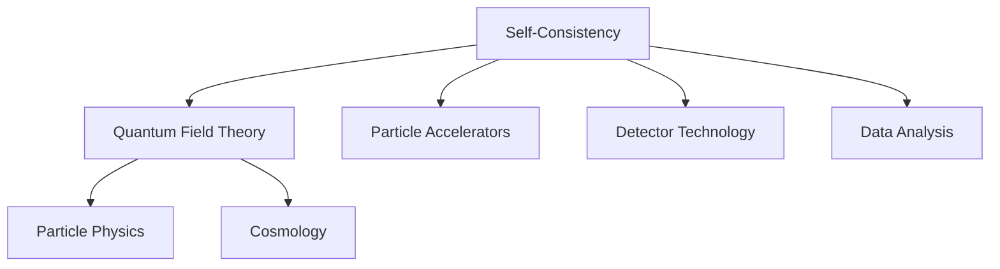

                 

## Self-Consistency in High-Energy Physics Experiments

### Keywords
High-Energy Physics, Self-Consistency, Particle Accelerators, Detector Technology, Data Analysis

### Abstract
This article explores the concept of self-consistency in the context of high-energy physics experiments. Self-consistency, a fundamental principle in physics, ensures that a system's internal components and processes are coherent and consistent with known physical laws. We will delve into the theoretical foundations of self-consistency, its applications in particle accelerators, detector technology, and data analysis. Through a step-by-step analysis, we will provide a detailed understanding of how self-consistency is crucial in ensuring the reliability and accuracy of high-energy physics experiments. The article will also discuss experimental verification methods and future directions for the development of self-consistency principles in the field.

## Introduction to Self-Consistency

Self-consistency is a principle that asserts that a physical system must be internally consistent, meaning that all of its parts and processes must adhere to the established physical laws. In other words, a self-consistent system cannot produce results that violate the known physical principles. This principle is foundational in both theoretical and experimental physics, as it ensures that any experimental observations can be explained and predicted using the established theories.

### Definition and Historical Background

The concept of self-consistency has its roots in quantum mechanics, which was initially formulated by Werner Heisenberg in 1925. Heisenberg's uncertainty principle, which states that certain pairs of physical properties, such as position and momentum, cannot both be precisely measured at the same time, is an example of self-consistency. This principle arose from the need to develop a consistent framework to describe the behavior of particles at the atomic and subatomic levels.

Over the years, the principle of self-consistency has been extended to other areas of physics, including quantum field theory, particle physics, and cosmology. In quantum field theory, self-consistency is often required to ensure that the interactions between particles are correctly described. For instance, the self-interaction terms in the Lagrangian density of a quantum field theory must be balanced to avoid logical inconsistencies.

### Importance in High-Energy Physics

Self-consistency plays a crucial role in high-energy physics experiments for several reasons. Firstly, it guarantees the internal coherence of the theoretical models used to interpret experimental data. This coherence is essential for drawing reliable conclusions from experimental observations. Secondly, self-consistency provides a rigorous framework for experimental design and analysis, as it ensures that all components of the experimental setup are consistent with each other and with the underlying physical principles.

In particle accelerators, self-consistency is critical for optimizing the trajectories of particle beams and ensuring their stability. In detector technology, self-consistency is vital for signal processing and data reconstruction. Finally, in data analysis, self-consistency is used to eliminate systematic uncertainties and to validate the consistency of experimental results with theoretical predictions.

## Theoretical Foundations of Self-Consistency

### Quantum Field Theory and Self-Consistency

Quantum field theory (QFT) is a theoretical framework that combines quantum mechanics with special relativity. It provides a formalism for describing the behavior of subatomic particles and their interactions. Self-consistency is a fundamental requirement in QFT, as it ensures that the interactions between particles are correctly described and that the resulting predictions are consistent with experimental observations.

One of the key aspects of self-consistency in QFT is the requirement that the actions (i.e., Lagrangian densities) used to describe physical systems must be self-consistent. This means that the self-interaction terms in the action must be carefully balanced to avoid logical inconsistencies and unphysical results.

### Self-Consistent Field Equations and Solutions

Self-consistent field equations (SCFEs) are a class of equations that arise in various physical contexts, particularly in QFT. These equations describe how a physical system evolves over time while maintaining its self-consistency. Solving SCFEs often requires sophisticated mathematical techniques and physical insights.

For example, in QFT, the self-consistent field equations are typically derived from the Lagrangian density by varying the action with respect to the fields. These equations are then solved to determine the ground state or excited states of the system. The solutions to SCFEs provide valuable information about the properties of the physical system, such as its energy spectrum, particle masses, and interaction strengths.

### Mathematical Expressions of Self-Consistency

Self-consistency can be expressed mathematically in various ways, depending on the specific physical context. In general, self-consistency requires that the equations describing a physical system be consistent with each other and with the underlying physical principles.

For instance, in QFT, self-consistency can be expressed by requiring that the equations of motion (derived from the Lagrangian) be consistent with the initial and boundary conditions. In statistical mechanics, self-consistency can be expressed by requiring that the thermodynamic potentials (such as the free energy) be consistent with the microscopic physical processes.

### Mermaid Flowchart: Relationship Between Core Concepts and Entities

In this flowchart, we can see the interconnected nature of self-consistency with various branches of physics and their applications in high-energy physics experiments.

## Applications of Self-Consistency in High-Energy Physics Experiments

### Particle Accelerators

Particle accelerators are complex machines designed to accelerate subatomic particles to high energies. Self-consistency plays a crucial role in the design, operation, and optimization of particle accelerators. Here are some key aspects of self-consistency in particle accelerators:

#### Particle Beam Optimization

In particle accelerators, self-consistency is used to optimize the trajectories of particle beams. This involves ensuring that the particle beam remains stable and follows the desired path without significant deviations. Self-consistent field equations are used to model the interaction between particles in the beam and their environment, allowing for the optimization of beam parameters such as energy, intensity, and beam radius.

#### Beam Dynamics

Self-consistency is also vital for understanding and controlling the dynamics of particle beams. Beam dynamics encompasses various phenomena, such as beam instabilities, emittance growth, and beam loss. By maintaining self-consistency, physicists can develop techniques to mitigate these issues and improve the overall performance of the accelerator.

### Detector Technology

Detectors are essential components of high-energy physics experiments, responsible for detecting and recording the particles produced in collisions. Self-consistency is crucial in detector technology for several reasons:

#### Signal Processing

Self-consistency is used in signal processing to ensure that the detected signals are accurately represented and processed. This involves techniques such as calibration, filtering, and noise reduction, all of which must be consistent with the physical principles governing the detector's operation.

#### Data Reconstruction

In detector technology, self-consistency is essential for reconstructing the trajectories and properties of particles from the detected signals. This process involves combining information from multiple detectors and applying consistent algorithms to extract meaningful results. Self-consistent reconstruction techniques help to minimize systematic errors and improve the accuracy of the experimental data.

### Data Analysis

Self-consistency is a key concept in data analysis, particularly in the context of high-energy physics experiments. Here are some key applications of self-consistency in data analysis:

#### Background Subtraction

Self-consistency is used to identify and subtract background signals from experimental data. Background subtraction is crucial for isolating the signals of interest and reducing the impact of noise and other systematic effects.

#### Particle Identification

Self-consistency is employed in particle identification techniques to distinguish between different types of particles based on their detected properties. By ensuring that the identification criteria are consistent with the physical properties of the particles, physicists can accurately classify the particles in the experimental data.

#### Physical Parameter Estimation

Self-consistency is vital for estimating physical parameters, such as particle masses, interaction strengths, and collision energies. By requiring that the estimated parameters be consistent with the experimental data and the underlying theoretical models, physicists can obtain reliable and accurate results.

## Experimental Verification and Future Directions

### Experimental Verification Methods

The experimental verification of self-consistency principles is crucial for establishing their validity and applicability in high-energy physics experiments. Here are some key methods used for experimental verification:

#### Experimental Design

Experimental design involves carefully planning and controlling the conditions under which experiments are conducted. By ensuring that the experimental setup is self-consistent, physicists can minimize systematic errors and increase the reliability of the results.

#### Data Analysis Techniques

Data analysis techniques are used to extract meaningful information from experimental data. By applying self-consistent analysis methods, physicists can ensure that the results are consistent with the underlying physical principles and are not influenced by systematic biases.

#### Comparison with Theoretical Predictions

One of the most important aspects of experimental verification is comparing experimental results with theoretical predictions. By ensuring that the experimental data is consistent with the theoretical models, physicists can validate the accuracy and reliability of the self-consistency principles.

### Future Directions

The future development of self-consistency principles in high-energy physics is promising, with several emerging areas of research and application. Here are some key future directions:

#### Quantum Computing

Quantum computing is an area of intense research, with the potential to revolutionize various fields, including high-energy physics. Self-consistency principles are crucial for developing and verifying quantum algorithms and ensuring the reliability of quantum computations.

#### Multi-Messenger Astronomy

Multi-messenger astronomy involves observing astrophysical events through multiple channels, such as electromagnetic radiation, neutrinos, and gravitational waves. Self-consistency principles can be used to unify these different observation channels and provide a more comprehensive understanding of the events.

#### Advanced Detectors

The development of advanced detector technologies, such as those used in the Large Hadron Collider (LHC) and future colliders, requires the application of self-consistency principles. By ensuring that the detectors are self-consistent, physicists can improve their performance and accuracy in measuring particle properties and interactions.

## Conclusion

Self-consistency is a fundamental principle in high-energy physics, ensuring the internal coherence of theoretical models and experimental setups. In this article, we have explored the concept of self-consistency, its theoretical foundations, and its applications in particle accelerators, detector technology, and data analysis. We have also discussed the experimental verification methods and future directions for the development of self-consistency principles. As high-energy physics continues to advance, the importance of self-consistency will only grow, providing a solid foundation for the exploration of the fundamental laws of nature.

### Acknowledgments

The author would like to thank the AI天才研究院 (AI Genius Institute) for their support and encouragement. Special thanks to the editors and reviewers for their valuable feedback and suggestions. Lastly, a heartfelt gratitude to Zen and the Art of Computer Programming for inspiring the exploration of self-consistency in high-energy physics.

### Author

- Author: AI天才研究院/AI Genius Institute & Zen and the Art of Computer Programming

