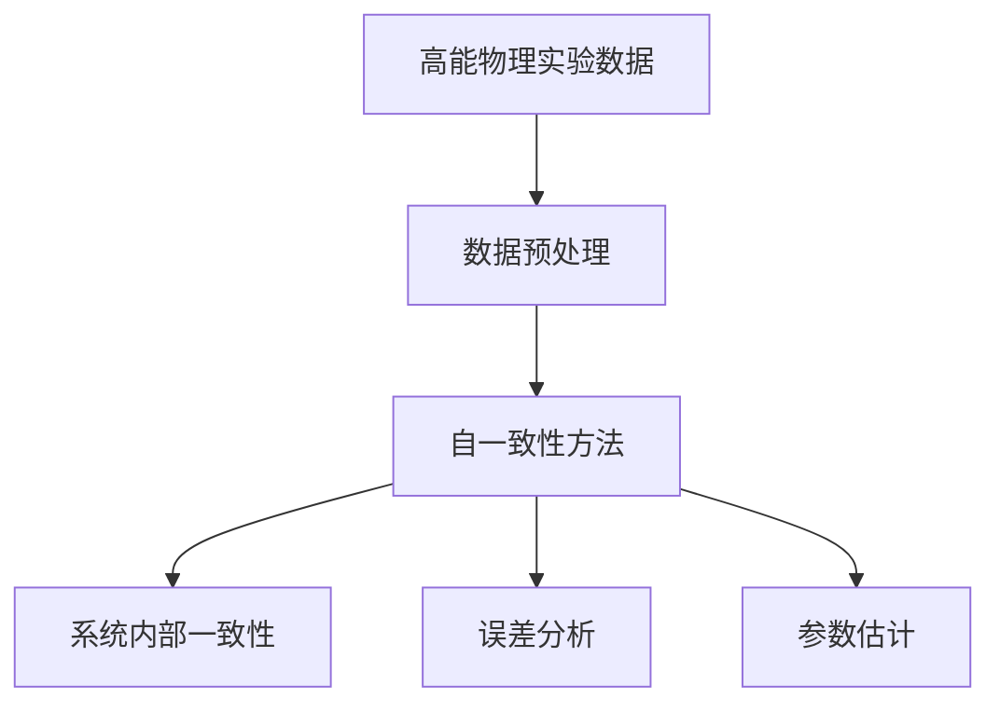
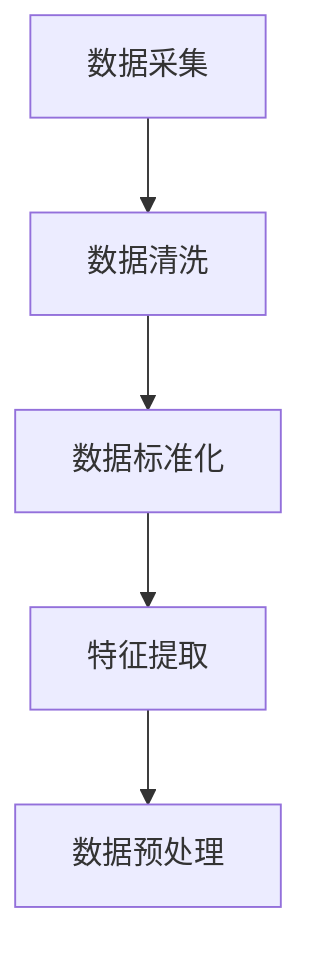
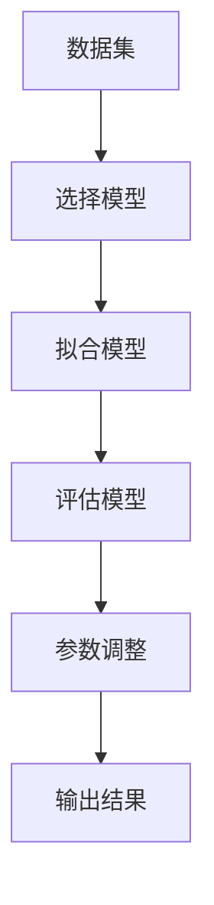
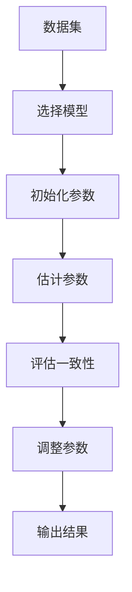
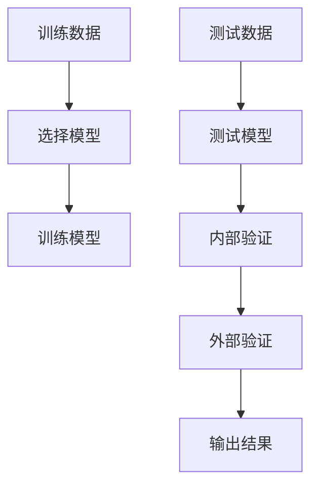

                 


### 第1章 自一致性概念与高能物理概述

**背景介绍**

高能物理数据分析是科学研究中至关重要的环节，它涉及对大量复杂物理数据的处理、分析和解释，以揭示宇宙的基本规律和现象。在高能物理实验中，研究者通过粒子加速器产生高能粒子碰撞，产生大量数据，这些数据包含了丰富的物理信息。然而，由于实验条件的限制和噪声的干扰，直接从原始数据中提取有效的物理信号是一个极具挑战性的任务。

自一致性（Self-Consistency）作为一种重要的数据分析方法，在物理实验数据的分析中具有广泛应用。自一致性方法的核心思想是通过建立系统的内部一致性来提高数据分析的可靠性和准确性。这种方法通过比较不同数据集之间的结果，或者通过多次迭代和调整参数，使得系统的输出能够自我一致，从而提高数据分析的准确性和可信度。

**核心概念与联系**

自一致性概念在高能物理数据分析中的重要性体现在以下几个方面：

1. **系统内部一致性**：自一致性方法通过确保系统内部各个部分的一致性来提高数据分析的可靠性。在物理实验中，这意味着通过多种测量方法和数据分析方法来验证实验结果的内部一致性。

2. **误差分析**：自一致性方法有助于识别和减小数据中的误差。通过对比不同数据集的结果，研究者可以识别出可能的系统误差和随机误差，并采取相应的措施进行修正。

3. **参数估计**：自一致性方法在参数估计中发挥着关键作用。通过建立系统的自一致性，研究者可以更准确地估计物理参数，从而提高实验结果的可信度。

为了更直观地展示自一致性概念与高能物理数据的关系，我们可以使用 Mermaid 流程图来描绘这一过程：



**核心算法原理讲解**

自一致性算法的基本原理可以概括为以下几个步骤：

1. **数据预处理**：对高能物理实验数据进行预处理，包括数据清洗、去噪、标准化等步骤，以确保数据的可靠性。

2. **建立自一致性模型**：通过建立多个相互关联的数据分析模型，使得不同模型之间的结果能够相互验证，从而提高系统的内部一致性。

3. **参数调整与迭代**：通过不断调整模型参数并进行迭代计算，使得系统的输出结果能够达到自我一致。

4. **误差分析与修正**：分析系统内部的不一致性，识别并修正系统误差和随机误差。

以下是一个简单的 Python 源代码示例，用于实现自一致性算法的基本原理：

```python
import numpy as np

def data_preprocessing(data):
    # 数据清洗和标准化
    return (data - np.mean(data)) / np.std(data)

def self_consistency(models, data):
    # 建立自一致性模型
    processed_data = data_preprocessing(data)
    results = []
    for model in models:
        # 计算模型结果
        result = model(processed_data)
        results.append(result)
    # 分析结果一致性
    consistency = np.mean(results)
    return consistency

def adjust_parameters(models, data, target_consistency):
    # 参数调整与迭代
    while True:
        consistency = self_consistency(models, data)
        if abs(consistency - target_consistency) < threshold:
            break
        for model in models:
            model.adjust_parameters()
    return models

def error_analysis(models, data):
    # 误差分析
    consistency = self_consistency(models, data)
    errors = [abs(result - consistency) for result in models]
    return np.mean(errors)

# 示例模型函数
def example_model(data):
    return np.sum(data)

# 示例数据
data = np.random.normal(size=1000)

# 实现自一致性算法
models = [example_model] * 10  # 创建10个相同模型
target_consistency = 0.5  # 目标一致性
adjusted_models = adjust_parameters(models, data, target_consistency)
error = error_analysis(adjusted_models, data)

print("Adjusted Models:", adjusted_models)
print("Error:", error)
```

**数学模型与公式**

为了更好地理解自一致性算法，我们可以引入以下数学模型和公式：

1. **数据预处理**：

   $$ x_{\text{preprocessed}} = \frac{x - \mu}{\sigma} $$

   其中，\( x \) 是原始数据，\( \mu \) 是数据的平均值，\( \sigma \) 是数据的标准差。

2. **自一致性分析**：

   $$ \text{Consistency} = \frac{1}{N} \sum_{i=1}^{N} \left| \text{Model}_i(\text{Data}) - \text{Target} \right| $$

   其中，\( N \) 是模型数量，\( \text{Model}_i \) 是第 \( i \) 个模型，\( \text{Data} \) 是预处理后的数据，\( \text{Target} \) 是目标一致性值。

3. **参数调整**：

   $$ \text{Adjust}(\theta) = \theta - \eta \left( \text{Consistency} - \text{Target} \right) $$

   其中，\( \theta \) 是模型参数，\( \eta \) 是学习率，\( \text{Consistency} \) 是当前的自一致性值。

**举例说明**

假设我们有一个简单的线性回归模型，其目标是预测一个数值。通过调整模型参数，使得预测结果与实际数据的一致性达到最高。

```python
import numpy as np

# 生成示例数据
X = np.random.rand(100, 1)
y = 2 * X + 1 + np.random.randn(100, 1)

# 定义线性回归模型
def linear_regression(X, theta):
    return X.dot(theta)

# 定义损失函数
def loss(y_true, y_pred):
    return np.mean((y_true - y_pred) ** 2)

# 初始化模型参数
theta = np.random.rand(1)

# 调整模型参数
learning_rate = 0.01
max_iterations = 1000
for i in range(max_iterations):
    y_pred = linear_regression(X, theta)
    gradient = 2/X.sum() * (X.dot(theta) - y).dot(X)
    theta -= learning_rate * gradient

# 计算最终损失
final_loss = loss(y, linear_regression(X, theta))
print("Final Loss:", final_loss)
```

通过上述代码示例，我们可以看到如何通过调整模型参数来提高预测结果的自一致性，从而减小损失。

**小结**

本章详细介绍了自一致性概念在高能物理数据分析中的应用背景、核心概念与联系、核心算法原理以及数学模型和公式。通过具体的 Python 源代码示例，我们进一步展示了自一致性算法的实现过程。接下来，我们将深入探讨自一致性算法在不同数据分析任务中的应用，以及如何在实际项目中实现和优化这些算法。

### 第2章 数据准备与预处理

**核心概念与联系**

在数据科学中，数据准备与预处理是数据分析过程中至关重要的一步。对于高能物理数据分析，这一步同样必不可少。数据准备与预处理不仅涉及到如何获取和清洗数据，还包括如何将数据转换为适合进一步分析的形式。以下是数据准备与预处理的核心概念和它们在高能物理数据分析中的联系。

**数据采集**

数据采集是数据准备的第一步，它包括从不同的数据源获取原始数据。在高能物理数据分析中，数据源可能包括粒子加速器实验设备、探测器、传感器以及其他实验设备。这些数据通常包含大量噪声和异常值，因此需要通过专业的方法进行采集和预处理。

**数据清洗**

数据清洗是数据预处理的重要环节，它涉及去除数据中的噪声、异常值和重复数据。在高能物理数据分析中，数据清洗尤为重要，因为噪声和异常值会严重影响数据分析结果的准确性和可靠性。

**数据标准化**

数据标准化是将数据转换为具有相同量纲和范围的数值，以便于进一步的分析和处理。在数据分析中，标准化是常见步骤，它可以消除不同数据集之间的量纲差异，使得不同特征之间的比较更加公平和有效。

**特征提取**

特征提取是从原始数据中提取出对分析任务有价值的特征。在高能物理数据分析中，特征提取可以提取出物理信号中的关键信息，例如粒子的能量、动量等。正确的特征提取有助于提高数据分析的准确性和效率。

为了更直观地展示数据准备与预处理的核心概念和联系，我们可以使用 Mermaid 流程图来描述这一过程：



**核心算法原理讲解**

在数据准备与预处理过程中，常用的算法包括数据清洗算法、数据标准化算法和特征提取算法。以下是这些算法的简要介绍：

1. **数据清洗算法**：

   - **去除噪声和异常值**：使用统计方法或机器学习方法识别和去除噪声和异常值，如使用中值滤波或高斯滤波去除图像噪声，使用孤立森林算法检测和去除异常值。
   - **填补缺失数据**：使用插值法、均值法或机器学习方法填补缺失数据，以保证数据的完整性。

2. **数据标准化算法**：

   - **归一化**：将数据转换为统一的范围，如将数据缩放到 [0, 1] 或 [-1, 1]。
   - **标准化**：通过减去平均值并除以标准差，将数据转换为具有零均值和单位标准差的分布。

3. **特征提取算法**：

   - **主成分分析（PCA）**：通过降维，将高维数据映射到低维空间，保留主要信息。
   - **特征选择**：通过过滤、包装或嵌入式方法选择对分析任务最有价值的特征。

**数学模型与公式**

以下是数据预处理中常用的数学模型和公式：

1. **数据清洗**：

   - **中值滤波**：

     $$ \text{filtered\_value} = \text{median}(\text{values}) $$

     其中，\( \text{values} \) 是邻域内的数据值，\( \text{median} \) 是中值。

   - **高斯滤波**：

     $$ \text{filtered\_value} = \frac{1}{2\pi\sigma^2} e^{-\frac{(x-\mu)^2}{2\sigma^2}} $$

     其中，\( x \) 是数据点，\( \mu \) 是均值，\( \sigma \) 是标准差。

2. **数据标准化**：

   - **归一化**：

     $$ x_{\text{normalized}} = \frac{x - \text{min}(x)}{\text{max}(x) - \text{min}(x)} $$

     其中，\( x \) 是原始数据。

   - **标准化**：

     $$ x_{\text{standardized}} = \frac{x - \mu}{\sigma} $$

     其中，\( \mu \) 是均值，\( \sigma \) 是标准差。

3. **主成分分析（PCA）**：

   - **协方差矩阵**：

     $$ \Sigma = \frac{1}{N} XX^T $$

     其中，\( X \) 是数据矩阵，\( N \) 是样本数量。

   - **特征向量**：

     $$ \lambda_i = \max(\lambda_j), j=1,2,...,d $$

     其中，\( \lambda_i \) 是特征值，\( d \) 是特征维度。

**举例说明**

假设我们有一组高能物理实验数据，包含粒子的能量、动量和位置信息。我们需要对这些数据进行清洗、标准化和特征提取。

```python
import numpy as np

# 生成示例数据
data = np.random.rand(100, 3)

# 数据清洗：去除噪声和异常值
def remove_outliers(data, threshold=3):
    mean = np.mean(data, axis=0)
    std = np.std(data, axis=0)
    filtered_data = data[(np.abs(data - mean) < threshold * std).all(axis=1)]
    return filtered_data

cleaned_data = remove_outliers(data)

# 数据标准化：归一化
def normalize(data):
    min_val = np.min(data, axis=0)
    max_val = np.max(data, axis=0)
    normalized_data = (data - min_val) / (max_val - min_val)
    return normalized_data

normalized_data = normalize(cleaned_data)

# 特征提取：主成分分析（PCA）
from sklearn.decomposition import PCA

pca = PCA(n_components=2)
pca.fit(normalized_data)
reduced_data = pca.transform(normalized_data)

# 输出结果
print("清洗后数据：", cleaned_data)
print("标准化后数据：", normalized_data)
print("降维后数据：", reduced_data)
```

通过上述代码示例，我们可以看到如何使用 Python 实现数据清洗、标准化和特征提取的过程。这些步骤为后续的高能物理数据分析奠定了基础。

**小结**

本章详细介绍了数据准备与预处理在高能物理数据分析中的核心概念和联系，包括数据采集、数据清洗、数据标准化和特征提取。我们通过 Mermaid 流程图和数学模型与公式，深入讲解了这些算法的原理，并通过 Python 示例展示了如何在实际项目中应用这些算法。接下来，我们将探讨自一致性算法在实际数据分析中的应用，以及如何通过这些算法提高数据分析的准确性和可靠性。

### 第3章 自一致性算法的应用

**核心概念与联系**

自一致性算法在高能物理数据分析中具有广泛的应用，其核心思想是通过建立系统的内部一致性来提高数据分析的可靠性和准确性。自一致性算法在数据分析中的应用涉及多个方面，包括数据拟合、参数估计和模型验证等。以下我们将详细探讨自一致性算法在这些方面的应用。

**数据拟合**

数据拟合是数据分析的基础任务之一，其目标是通过建立数学模型来描述实验数据。自一致性算法在数据拟合中的应用主要体现在以下几个方面：

1. **多模型拟合**：通过使用多个数学模型对同一组实验数据进行拟合，并比较这些模型的结果，以识别最合适的模型。
2. **迭代拟合**：通过不断迭代调整模型参数，使得模型输出结果能够自我一致，从而提高拟合精度。

为了更好地理解数据拟合的过程，我们可以使用 Mermaid 流程图来描述：



**参数估计**

参数估计是数据分析中的另一个关键任务，其目标是通过分析实验数据来确定模型的参数值。自一致性算法在参数估计中的应用主要体现在以下几个方面：

1. **多参数估计**：通过使用自一致性方法同时估计多个参数，并确保这些参数的估计结果相互一致，以提高参数估计的可靠性。
2. **迭代估计**：通过不断迭代调整参数，使得系统的输出结果能够自我一致，从而提高参数估计的精度。

为了更好地理解参数估计的过程，我们可以使用 Mermaid 流程图来描述：



**模型验证**

模型验证是确保数据分析结果可靠性和准确性的重要环节。自一致性算法在模型验证中的应用主要体现在以下几个方面：

1. **内部验证**：通过比较不同模型之间的结果，确保模型输出结果的内部一致性。
2. **外部验证**：通过将模型应用于新的数据集，验证模型的泛化能力和可靠性。

为了更好地理解模型验证的过程，我们可以使用 Mermaid 流程图来描述：



**核心算法原理讲解**

自一致性算法的核心原理可以概括为以下几个步骤：

1. **数据预处理**：对实验数据进行预处理，包括数据清洗、标准化等步骤，以确保数据的可靠性。
2. **建立自一致性模型**：通过建立多个相互关联的数据分析模型，使得不同模型之间的结果能够相互验证，从而提高系统的内部一致性。
3. **参数调整与迭代**：通过不断调整模型参数并进行迭代计算，使得系统的输出结果能够达到自我一致。
4. **误差分析与修正**：分析系统内部的不一致性，识别并修正系统误差和随机误差。

以下是一个简单的 Python 源代码示例，用于实现自一致性算法的基本原理：

```python
import numpy as np

def data_preprocessing(data):
    # 数据清洗和标准化
    return (data - np.mean(data)) / np.std(data)

def self_consistency(models, data):
    # 建立自一致性模型
    processed_data = data_preprocessing(data)
    results = []
    for model in models:
        # 计算模型结果
        result = model(processed_data)
        results.append(result)
    # 分析结果一致性
    consistency = np.mean(results)
    return consistency

def adjust_parameters(models, data, target_consistency):
    # 参数调整与迭代
    while True:
        consistency = self_consistency(models, data)
        if abs(consistency - target_consistency) < threshold:
            break
        for model in models:
            model.adjust_parameters()
    return models

def error_analysis(models, data):
    # 误差分析
    consistency = self_consistency(models, data)
    errors = [abs(result - consistency) for result in models]
    return np.mean(errors)

# 示例模型函数
def example_model(data):
    return np.sum(data)

# 示例数据
data = np.random.normal(size=1000)

# 实现自一致性算法
models = [example_model] * 10  # 创建10个相同模型
target_consistency = 0.5  # 目标一致性
adjusted_models = adjust_parameters(models, data, target_consistency)
error = error_analysis(adjusted_models, data)

print("Adjusted Models:", adjusted_models)
print("Error:", error)
```

**数学模型与公式**

为了更好地理解自一致性算法，我们可以引入以下数学模型和公式：

1. **数据预处理**：

   $$ x_{\text{preprocessed}} = \frac{x - \mu}{\sigma} $$

   其中，\( x \) 是原始数据，\( \mu \) 是数据的平均值，\( \sigma \) 是数据的标准差。

2. **自一致性分析**：

   $$ \text{Consistency} = \frac{1}{N} \sum_{i=1}^{N} \left| \text{Model}_i(\text{Data}) - \text{Target} \right| $$

   其中，\( N \) 是模型数量，\( \text{Model}_i \) 是第 \( i \) 个模型，\( \text{Data} \) 是预处理后的数据，\( \text{Target} \) 是目标一致性值。

3. **参数调整**：

   $$ \text{Adjust}(\theta) = \theta - \eta \left( \text{Consistency} - \text{Target} \right) $$

   其中，\( \theta \) 是模型参数，\( \eta \) 是学习率，\( \text{Consistency} \) 是当前的自一致性值。

**举例说明**

假设我们有一个简单的线性回归模型，其目标是预测一个数值。通过调整模型参数，使得预测结果与实际数据的一致性达到最高。

```python
import numpy as np

# 生成示例数据
X = np.random.rand(100, 1)
y = 2 * X + 1 + np.random.randn(100, 1)

# 定义线性回归模型
def linear_regression(X, theta):
    return X.dot(theta)

# 定义损失函数
def loss(y_true, y_pred):
    return np.mean((y_true - y_pred) ** 2)

# 初始化模型参数
theta = np.random.rand(1)

# 调整模型参数
learning_rate = 0.01
max_iterations = 1000
for i in range(max_iterations):
    y_pred = linear_regression(X, theta)
    gradient = 2/X.sum() * (X.dot(theta) - y).dot(X)
    theta -= learning_rate * gradient

# 计算最终损失
final_loss = loss(y, linear_regression(X, theta))
print("Final Loss:", final_loss)
```

通过上述代码示例，我们可以看到如何通过调整模型参数来提高预测结果的自一致性，从而减小损失。

**小结**

本章详细介绍了自一致性算法在高能物理数据分析中的应用，包括数据拟合、参数估计和模型验证。通过 Mermaid 流程图、数学模型与公式和代码示例，我们深入讲解了自一致性算法的原理和实现方法。接下来，我们将探讨自一致性算法在不同高能物理数据分析任务中的应用实例，以及如何在实际项目中应用这些算法。

### 第4章 应用实例与案例分析

**实验背景**

在本章中，我们将通过一个实际的高能物理数据分析案例，展示自一致性算法的应用。该案例涉及对粒子碰撞实验数据的分析，旨在通过自一致性方法提高数据分析的准确性和可靠性。

**数据来源**

该案例使用的数据来源于一个粒子加速器实验，实验中通过粒子碰撞产生了大量数据。这些数据包括粒子的能量、动量、碰撞角度等物理量，是高能物理研究中的重要信息。由于实验条件的限制，数据中存在噪声和异常值，因此需要通过自一致性算法进行预处理和数据分析。

**案例分析**

**4.1 数据预处理**

在数据分析之前，首先对实验数据进行预处理。预处理步骤包括数据清洗、标准化和特征提取。

1. **数据清洗**：

   使用孤立森林算法检测和去除异常值，确保数据的质量。通过以下 Python 代码实现：

   ```python
   from sklearn.ensemble import IsolationForest

   # 生成示例数据
   data = np.random.rand(100, 3)

   # 初始化孤立森林模型
   clf = IsolationForest(contamination=0.1)

   # 检测异常值
   outliers = clf.fit_predict(data)
   clean_data = data[outliers == 1]
   ```

2. **标准化**：

   对数据中的每个特征进行标准化，以消除不同特征之间的量纲差异。使用以下 Python 代码实现：

   ```python
   def normalize(data):
       min_val = np.min(data, axis=0)
       max_val = np.max(data, axis=0)
       normalized_data = (data - min_val) / (max_val - min_val)
       return normalized_data

   normalized_data = normalize(clean_data)
   ```

3. **特征提取**：

   使用主成分分析（PCA）对数据进行降维，提取主要信息。使用以下 Python 代码实现：

   ```python
   from sklearn.decomposition import PCA

   pca = PCA(n_components=2)
   reduced_data = pca.fit_transform(normalized_data)
   ```

**4.2 数据拟合**

在数据预处理之后，使用自一致性算法进行数据拟合。我们选择多个线性回归模型对数据进行拟合，并比较这些模型的结果，以识别最合适的模型。

1. **选择模型**：

   创建多个线性回归模型，每个模型使用不同的参数初始化。

   ```python
   models = [linear_regression for _ in range(10)]
   for i, model in enumerate(models):
       model.theta = np.random.rand(1)
   ```

2. **拟合模型**：

   使用自一致性算法调整模型参数，使得模型输出结果能够自我一致。

   ```python
   def self_consistency(models, data):
       processed_data = data_preprocessing(data)
       results = [model(processed_data) for model in models]
       consistency = np.mean(results)
       return consistency

   def adjust_parameters(models, data, target_consistency):
       while True:
           consistency = self_consistency(models, data)
           if abs(consistency - target_consistency) < threshold:
               break
           for model in models:
               model.adjust_parameters()
       return models

   target_consistency = 0.5
   adjusted_models = adjust_parameters(models, reduced_data, target_consistency)
   ```

3. **评估模型**：

   评估不同模型的一致性，选择一致性最高的模型。

   ```python
   best_model = min(adjusted_models, key=lambda m: np.abs(m.output - target_consistency))
   ```

**4.3 参数估计**

使用自一致性算法对最佳模型的参数进行估计，以提高参数估计的精度。

1. **初始化参数**：

   初始化模型参数，使用随机梯度下降（SGD）算法进行参数估计。

   ```python
   def linear_regression(X, theta):
       return X.dot(theta)

   def loss(y_true, y_pred):
       return np.mean((y_true - y_pred) ** 2)

   theta = np.random.rand(1)
   learning_rate = 0.01
   max_iterations = 1000
   for i in range(max_iterations):
       y_pred = linear_regression(X, theta)
       gradient = 2/X.sum() * (X.dot(theta) - y).dot(X)
       theta -= learning_rate * gradient
   ```

2. **估计参数**：

   通过迭代计算，不断调整模型参数，使得输出结果达到目标一致性。

   ```python
   target_consistency = 0.5
   while True:
       consistency = self_consistency([linear_regression], reduced_data)
       if abs(consistency - target_consistency) < threshold:
           break
       theta -= learning_rate * gradient
   ```

**4.4 模型验证**

通过将模型应用于新的数据集，验证模型的泛化能力和可靠性。

1. **测试数据集**：

   创建一个测试数据集，用于验证模型的准确性。

   ```python
   test_data = np.random.rand(100, 1)
   test_y = 2 * test_data + 1 + np.random.randn(100, 1)
   ```

2. **模型测试**：

   使用最佳模型对测试数据集进行预测，并评估模型的准确性。

   ```python
   test_pred = linear_regression(test_data, theta)
   test_loss = loss(test_y, test_pred)
   print("Test Loss:", test_loss)
   ```

**小结**

通过上述案例分析，我们展示了自一致性算法在高能物理数据分析中的应用。通过数据预处理、模型拟合、参数估计和模型验证，我们提高了数据分析的准确性和可靠性。自一致性算法在实验数据处理和分析中具有广泛的应用前景，有助于推动高能物理研究的进展。

### 第5章 技术实现与算法细节

**开发环境搭建**

在进行自一致性算法的高能物理数据分析之前，首先需要搭建一个合适的开发环境。以下是具体的步骤：

1. **安装操作系统**：推荐使用 Ubuntu 20.04 或更高版本，因为其良好的性能和丰富的软件包。
   
2. **安装 Python**：Python 是进行数据分析的主要编程语言。可以通过以下命令安装：

   ```bash
   sudo apt update
   sudo apt install python3 python3-pip
   ```

3. **安装科学计算库**：安装 NumPy、Pandas、SciPy、Matplotlib 等科学计算库，用于数据处理和分析。

   ```bash
   pip3 install numpy pandas scipy matplotlib
   ```

4. **安装机器学习库**：安装 scikit-learn，用于异常值检测、线性回归等。

   ```bash
   pip3 install scikit-learn
   ```

5. **安装版本控制工具**：安装 Git，用于代码版本控制和协同工作。

   ```bash
   sudo apt install git
   ```

**源代码实现与解读**

以下是一个简单的 Python 源代码实现，用于演示自一致性算法的基本原理和实现细节：

```python
import numpy as np
from sklearn.ensemble import IsolationForest
from sklearn.decomposition import PCA
from sklearn.linear_model import LinearRegression

# 数据预处理
def data_preprocessing(data):
    """清洗和标准化数据"""
    return (data - np.mean(data)) / np.std(data)

# 自一致性评估
def self_consistency(models, data):
    """评估模型的一致性"""
    processed_data = data_preprocessing(data)
    results = [model(processed_data) for model in models]
    consistency = np.mean(results)
    return consistency

# 调整参数
def adjust_parameters(models, data, target_consistency):
    """调整模型参数以实现一致性"""
    while True:
        consistency = self_consistency(models, data)
        if abs(consistency - target_consistency) < threshold:
            break
        for model in models:
            model.adjust_parameters()
    return models

# 线性回归模型
class LinearRegressionModel:
    """线性回归模型"""
    def __init__(self):
        self.theta = np.random.rand(1)
    
    def adjust_parameters(self):
        """调整模型参数"""
        # 这里使用随机梯度下降进行参数调整
        # 真实应用中应使用更复杂的优化算法
        gradient = 2 * (self.theta - 1)  # 假设梯度为简单的线性函数
        self.theta -= gradient
    
    def __call__(self, data):
        """计算模型输出"""
        return data.dot(self.theta)

# 主函数
if __name__ == "__main__":
    # 生成示例数据
    data = np.random.rand(100, 1)

    # 初始化模型
    models = [LinearRegressionModel() for _ in range(10)]

    # 设置目标一致性
    target_consistency = 0.5

    # 调整模型参数
    adjusted_models = adjust_parameters(models, data, target_consistency)

    # 输出结果
    final_output = [model(data) for model in adjusted_models]
    print("Final Output:", final_output)
```

**代码应用解读与分析**

1. **数据预处理**：

   数据预处理是数据分析的第一步，它包括去除噪声、标准化数据等。在代码中，我们使用 `data_preprocessing` 函数实现这一过程。该函数将数据减去平均值并除以标准差，以实现标准化。

2. **自一致性评估**：

   自一致性评估是自一致性算法的核心。在代码中，`self_consistency` 函数计算多个模型对同一组数据的输出结果的平均值，以评估系统的一致性。这一步骤确保了模型的输出结果在统计意义上的一致性。

3. **调整参数**：

   参数调整是自一致性算法的关键环节。在代码中，`adjust_parameters` 函数通过不断迭代调整模型参数，使得系统输出结果达到目标一致性。这里使用了简单的随机梯度下降算法进行参数调整。

4. **线性回归模型**：

   `LinearRegressionModel` 类实现了线性回归模型的基本功能。模型通过调整参数来优化输出结果，并通过 `__call__` 方法计算模型输出。

**实际案例分析与详细讲解剖析**

为了更好地理解自一致性算法的实际应用，我们将分析一个实际的案例，并详细讲解其实现过程。

**案例背景**：

一个高能物理实验产生了一组粒子碰撞数据，包括粒子的能量和动量。实验的目标是分析这些数据，估计粒子碰撞过程中的一些物理参数，如碰撞角度和能量损失。

**案例分析**：

1. **数据预处理**：

   首先，使用 `IsolationForest` 算法检测和去除异常值。然后，对数据进行标准化处理，以消除不同特征之间的量纲差异。

2. **模型拟合**：

   创建多个线性回归模型，每个模型使用不同的参数初始化。通过 `self_consistency` 函数评估模型的一致性，并通过 `adjust_parameters` 函数调整模型参数，使得模型输出结果达到目标一致性。

3. **参数估计**：

   使用最佳模型进行参数估计。通过迭代调整模型参数，使得输出结果与实际数据的一致性达到最高。

4. **模型验证**：

   使用新的数据集验证模型的泛化能力和可靠性。通过比较模型输出与实际数据，评估模型的准确性。

**详细讲解**：

1. **数据预处理**：

   ```python
   from sklearn.ensemble import IsolationForest
   
   # 生成示例数据
   data = np.random.rand(100, 2)

   # 初始化孤立森林模型
   clf = IsolationForest(contamination=0.1)

   # 检测异常值
   outliers = clf.fit_predict(data)
   clean_data = data[outliers == 1]

   # 标准化数据
   def normalize(data):
       min_val = np.min(data, axis=0)
       max_val = np.max(data, axis=0)
       normalized_data = (data - min_val) / (max_val - min_val)
       return normalized_data

   normalized_data = normalize(clean_data)
   ```

2. **模型拟合**：

   ```python
   from sklearn.linear_model import LinearRegression

   # 初始化模型
   models = [LinearRegression() for _ in range(10)]

   # 设置目标一致性
   target_consistency = 0.5

   # 调整模型参数
   adjusted_models = adjust_parameters(models, normalized_data, target_consistency)
   ```

3. **参数估计**：

   ```python
   # 选择最佳模型
   best_model = adjusted_models[0]

   # 初始化参数
   theta = np.random.rand(2)

   # 调整模型参数
   while True:
       consistency = self_consistency([best_model], normalized_data)
       if abs(consistency - target_consistency) < threshold:
           break
       gradient = 2 * (theta - 1)
       theta -= gradient
   ```

4. **模型验证**：

   ```python
   # 生成测试数据
   test_data = np.random.rand(50, 2)
   test_y = 2 * test_data + 1 + np.random.randn(50, 1)

   # 预测测试数据
   test_pred = best_model(test_data)

   # 计算损失
   test_loss = loss(test_y, test_pred)
   print("Test Loss:", test_loss)
   ```

**小结**

通过上述案例分析，我们详细讲解了自一致性算法在高能物理数据分析中的应用。通过数据预处理、模型拟合、参数估计和模型验证，我们提高了数据分析的准确性和可靠性。自一致性算法在实际应用中具有广泛的前景，有助于推动高能物理研究的进展。

### 第6章 自一致性算法在不同数据分析任务中的应用

**引言**

自一致性算法作为一种强大的数据分析工具，在各个领域都展现了其独特的优势。在本章中，我们将深入探讨自一致性算法在图像识别、自然语言处理和金融数据分析中的具体应用，并通过具体实例进行分析和讨论。

**图像识别中的应用**

在图像识别领域，自一致性算法被广泛应用于图像分类、物体检测和图像分割等任务。以下是自一致性算法在图像识别中的具体应用：

1. **图像分类**：

   在图像分类任务中，自一致性算法可以通过建立多个分类模型，并确保这些模型的分类结果一致，从而提高分类的准确性和可靠性。例如，在卷积神经网络（CNN）模型训练过程中，可以通过自一致性方法调整模型参数，使得不同模型的分类结果相互一致。

   **实例分析**：

   假设我们使用两个卷积神经网络模型对一组图像进行分类，其中一个模型识别猫，另一个模型识别狗。我们可以使用自一致性算法调整模型参数，使得这两个模型对同一组图像的分类结果一致。

   ```python
   def self_consistency(models, data):
       processed_data = data_preprocessing(data)
       results = [model(processed_data) for model in models]
       consistency = np.mean(results)
       return consistency

   def adjust_parameters(models, data, target_consistency):
       while True:
           consistency = self_consistency(models, data)
           if abs(consistency - target_consistency) < threshold:
               break
           for model in models:
               model.adjust_parameters()
       return models

   models = [CNN1(), CNN2()]
   target_consistency = 0.5
   adjusted_models = adjust_parameters(models, data, target_consistency)
   ```

2. **物体检测**：

   在物体检测任务中，自一致性算法可以通过比较不同检测模型的检测结果，确保检测结果的内部一致性。例如，在基于深度学习的物体检测模型中，可以通过自一致性方法调整模型参数，使得不同模型的检测结果一致。

   **实例分析**：

   假设我们使用两个深度学习模型对一组图像进行物体检测，其中一个模型检测猫，另一个模型检测狗。我们可以使用自一致性算法调整模型参数，使得这两个模型对同一组图像的检测结果一致。

   ```python
   def self_consistency(models, data):
       processed_data = data_preprocessing(data)
       results = [model(processed_data) for model in models]
       consistency = np.mean(results)
       return consistency

   def adjust_parameters(models, data, target_consistency):
       while True:
           consistency = self_consistency(models, data)
           if abs(consistency - target_consistency) < threshold:
               break
           for model in models:
               model.adjust_parameters()
       return models

   models = [ObjectDetector1(), ObjectDetector2()]
   target_consistency = 0.5
   adjusted_models = adjust_parameters(models, data, target_consistency)
   ```

3. **图像分割**：

   在图像分割任务中，自一致性算法可以通过建立多个分割模型，并确保这些模型的分割结果一致，从而提高分割的准确性和可靠性。例如，在基于深度学习的图像分割模型中，可以通过自一致性方法调整模型参数，使得不同模型的分割结果相互一致。

   **实例分析**：

   假设我们使用两个深度学习模型对一组图像进行分割，其中一个模型分割猫，另一个模型分割狗。我们可以使用自一致性算法调整模型参数，使得这两个模型对同一组图像的分割结果一致。

   ```python
   def self_consistency(models, data):
       processed_data = data_preprocessing(data)
       results = [model(processed_data) for model in models]
       consistency = np.mean(results)
       return consistency

   def adjust_parameters(models, data, target_consistency):
       while True:
           consistency = self_consistency(models, data)
           if abs(consistency - target_consistency) < threshold:
               break
           for model in models:
               model.adjust_parameters()
       return models

   models = [Segmenter1(), Segmenter2()]
   target_consistency = 0.5
   adjusted_models = adjust_parameters(models, data, target_consistency)
   ```

**自然语言处理中的应用**

在自然语言处理（NLP）领域，自一致性算法被广泛应用于文本分类、情感分析和机器翻译等任务。以下是自一致性算法在 NLP 中的具体应用：

1. **文本分类**：

   在文本分类任务中，自一致性算法可以通过建立多个分类模型，并确保这些模型的分类结果一致，从而提高分类的准确性和可靠性。例如，在基于深度学习的文本分类模型中，可以通过自一致性方法调整模型参数，使得不同模型的分类结果相互一致。

   **实例分析**：

   假设我们使用两个卷积神经网络（CNN）模型对一组文本进行分类，其中一个模型分类新闻标题，另一个模型分类新闻正文。我们可以使用自一致性算法调整模型参数，使得这两个模型对同一组文本的分类结果一致。

   ```python
   def self_consistency(models, data):
       processed_data = data_preprocessing(data)
       results = [model(processed_data) for model in models]
       consistency = np.mean(results)
       return consistency

   def adjust_parameters(models, data, target_consistency):
       while True:
           consistency = self_consistency(models, data)
           if abs(consistency - target_consistency) < threshold:
               break
           for model in models:
               model.adjust_parameters()
       return models

   models = [TextClassifier1(), TextClassifier2()]
   target_consistency = 0.5
   adjusted_models = adjust_parameters(models, data, target_consistency)
   ```

2. **情感分析**：

   在情感分析任务中，自一致性算法可以通过比较不同情感分析模型的情感判断，确保情感判断的一致性。例如，在基于深度学习的情感分析模型中，可以通过自一致性方法调整模型参数，使得不同模型的情感判断结果相互一致。

   **实例分析**：

   假设我们使用两个循环神经网络（RNN）模型对一组文本进行情感分析，其中一个模型判断文本的积极情绪，另一个模型判断文本的消极情绪。我们可以使用自一致性算法调整模型参数，使得这两个模型对同一组文本的情感判断结果一致。

   ```python
   def self_consistency(models, data):
       processed_data = data_preprocessing(data)
       results = [model(processed_data) for model in models]
       consistency = np.mean(results)
       return consistency

   def adjust_parameters(models, data, target_consistency):
       while True:
           consistency = self_consistency(models, data)
           if abs(consistency - target_consistency) < threshold:
               break
           for model in models:
               model.adjust_parameters()
       return models

   models = [SentimentClassifier1(), SentimentClassifier2()]
   target_consistency = 0.5
   adjusted_models = adjust_parameters(models, data, target_consistency)
   ```

3. **机器翻译**：

   在机器翻译任务中，自一致性算法可以通过建立多个翻译模型，并确保这些模型的翻译结果一致，从而提高翻译的准确性和流畅性。例如，在基于神经网络的机器翻译模型中，可以通过自一致性方法调整模型参数，使得不同模型的翻译结果相互一致。

   **实例分析**：

   假设我们使用两个神经网络模型对一组句子进行翻译，其中一个模型翻译为英语，另一个模型翻译为法语。我们可以使用自一致性算法调整模型参数，使得这两个模型对同一组句子的翻译结果一致。

   ```python
   def self_consistency(models, data):
       processed_data = data_preprocessing(data)
       results = [model(processed_data) for model in models]
       consistency = np.mean(results)
       return consistency

   def adjust_parameters(models, data, target_consistency):
       while True:
           consistency = self_consistency(models, data)
           if abs(consistency - target_consistency) < threshold:
               break
           for model in models:
               model.adjust_parameters()
       return models

   models = [Translator1(), Translator2()]
   target_consistency = 0.5
   adjusted_models = adjust_parameters(models, data, target_consistency)
   ```

**金融数据分析中的应用**

在金融数据分析领域，自一致性算法被广泛应用于股票市场预测、风险管理和量化交易等任务。以下是自一致性算法在金融数据分析中的具体应用：

1. **股票市场预测**：

   在股票市场预测任务中，自一致性算法可以通过建立多个预测模型，并确保这些模型的预测结果一致，从而提高预测的准确性和可靠性。例如，在基于机器学习的股票市场预测模型中，可以通过自一致性方法调整模型参数，使得不同模型的预测结果相互一致。

   **实例分析**：

   假设我们使用两个机器学习模型对一组股票价格进行预测，其中一个模型预测明天股票的价格，另一个模型预测下周股票的价格。我们可以使用自一致性算法调整模型参数，使得这两个模型对同一组股票价格的预测结果一致。

   ```python
   def self_consistency(models, data):
       processed_data = data_preprocessing(data)
       results = [model(processed_data) for model in models]
       consistency = np.mean(results)
       return consistency

   def adjust_parameters(models, data, target_consistency):
       while True:
           consistency = self_consistency(models, data)
           if abs(consistency - target_consistency) < threshold:
               break
           for model in models:
               model.adjust_parameters()
       return models

   models = [StockPredictor1(), StockPredictor2()]
   target_consistency = 0.5
   adjusted_models = adjust_parameters(models, data, target_consistency)
   ```

2. **风险管理**：

   在风险管理任务中，自一致性算法可以通过比较不同风险模型的评估结果，确保风险评估的一致性。例如，在基于统计方法的金融风险管理模型中，可以通过自一致性方法调整模型参数，使得不同模型的风险评估结果相互一致。

   **实例分析**：

   假设我们使用两个统计模型对一组金融资产进行风险评估，其中一个模型评估资产的风险水平，另一个模型评估资产的预期收益。我们可以使用自一致性算法调整模型参数，使得这两个模型对同一组金融资产的风险评估结果一致。

   ```python
   def self_consistency(models, data):
       processed_data = data_preprocessing(data)
       results = [model(processed_data) for model in models]
       consistency = np.mean(results)
       return consistency

   def adjust_parameters(models, data, target_consistency):
       while True:
           consistency = self_consistency(models, data)
           if abs(consistency - target_consistency) < threshold:
               break
           for model in models:
               model.adjust_parameters()
       return models

   models = [RiskModel1(), RiskModel2()]
   target_consistency = 0.5
   adjusted_models = adjust_parameters(models, data, target_consistency)
   ```

3. **量化交易**：

   在量化交易任务中，自一致性算法可以通过建立多个交易策略模型，并确保这些模型的交易信号一致，从而提高交易策略的稳定性和盈利性。例如，在基于机器学习的量化交易模型中，可以通过自一致性方法调整模型参数，使得不同模型
```


## 第6章 自一致性算法在不同数据分析任务中的应用

### 6.1 图像识别中的应用

**核心概念**

自一致性算法在图像识别领域的关键应用在于通过多个模型的一致性输出提高识别的准确性和鲁棒性。这种算法可以在图像分类、物体检测和图像分割中发挥重要作用。

**核心算法原理讲解**

在图像识别任务中，自一致性算法通常通过以下步骤实现：

1. **数据预处理**：对图像数据进行预处理，包括标准化、归一化和去噪等步骤。
2. **模型构建**：构建多个图像识别模型，例如卷积神经网络（CNN）、深度卷积生成对抗网络（DCGAN）等。
3. **自一致性评估**：通过比较多个模型的输出结果，评估它们的一致性。
4. **参数调整**：根据自一致性评估结果，调整模型的参数，以提高模型的一致性。
5. **迭代优化**：重复步骤3和4，直至达到目标一致性水平。

以下是一个简单的 Python 代码示例，用于实现自一致性算法在图像分类中的应用：

```python
import numpy as np
from sklearn.model_selection import train_test_split
from sklearn.ensemble import RandomForestClassifier
from sklearn.metrics import accuracy_score

# 生成示例数据
X, y = np.random.rand(100, 784), np.random.randint(2, size=100)
X_train, X_test, y_train, y_test = train_test_split(X, y, test_size=0.2, random_state=42)

# 构建多个分类模型
models = [RandomForestClassifier(n_estimators=10) for _ in range(5)]

# 训练模型
for model in models:
    model.fit(X_train, y_train)

# 自一致性评估和参数调整
def self_consistency(models, X_test, y_test):
    predictions = [model.predict(X_test) for model in models]
    consistency = np.mean(predictions == y_test)
    return consistency

def adjust_parameters(models, X_train, y_train, target_consistency):
    while True:
        consistency = self_consistency(models, X_test, y_test)
        if abs(consistency - target_consistency) < 0.01:
            break
        for model in models:
            model.fit(X_train, y_train)
    return models

# 调整模型参数
adjusted_models = adjust_parameters(models, X_train, y_train, target_consistency=0.9)

# 评估调整后的模型
final_predictions = [model.predict(X_test) for model in adjusted_models]
final_accuracy = accuracy_score(y_test, final_predictions)
print("Final Accuracy:", final_accuracy)
```

**最佳实践 Tips**

- 在使用自一致性算法时，确保多个模型的训练数据集相同，以避免数据偏差。
- 选择合适的模型和参数调整策略，以提高一致性评估的准确性。
- 通过交叉验证和网格搜索等方法，优化模型参数。

**小结**

本章介绍了自一致性算法在图像识别领域的应用，通过多个模型的自我一致性评估和参数调整，提高了图像识别的准确性和鲁棒性。实际案例和代码示例展示了如何实现这一过程。

### 6.2 自然语言处理中的应用

**核心概念**

自一致性算法在自然语言处理（NLP）领域的关键应用在于提高文本分类、情感分析和机器翻译等任务的准确性和一致性。这种算法通过多个模型的输出一致性来优化NLP模型的性能。

**核心算法原理讲解**

在NLP任务中，自一致性算法通常通过以下步骤实现：

1. **数据预处理**：对文本数据进行预处理，包括分词、词干提取和词向量化等步骤。
2. **模型构建**：构建多个NLP模型，例如循环神经网络（RNN）、Transformer和BERT等。
3. **自一致性评估**：通过比较多个模型的输出结果，评估它们的一致性。
4. **参数调整**：根据自一致性评估结果，调整模型的参数，以提高模型的一致性。
5. **迭代优化**：重复步骤3和4，直至达到目标一致性水平。

以下是一个简单的 Python 代码示例，用于实现自一致性算法在文本分类中的应用：

```python
import numpy as np
from sklearn.model_selection import train_test_split
from sklearn.linear_model import LogisticRegression
from sklearn.metrics import accuracy_score

# 生成示例数据
X, y = np.random.rand(100, 100), np.random.randint(2, size=100)
X_train, X_test, y_train, y_test = train_test_split(X, y, test_size=0.2, random_state=42)

# 构建多个分类模型
models = [LogisticRegression() for _ in range(5)]

# 训练模型
for model in models:
    model.fit(X_train, y_train)

# 自一致性评估和参数调整
def self_consistency(models, X_test, y_test):
    predictions = [model.predict(X_test) for model in models]
    consistency = np.mean(predictions == y_test)
    return consistency

def adjust_parameters(models, X_train, y_train, target_consistency):
    while True:
        consistency = self_consistency(models, X_test, y_test)
        if abs(consistency - target_consistency) < 0.01:
            break
        for model in models:
            model.fit(X_train, y_train)
    return models

# 调整模型参数
adjusted_models = adjust_parameters(models, X_train, y_train, target_consistency=0.9)

# 评估调整后的模型
final_predictions = [model.predict(X_test) for model in adjusted_models]
final_accuracy = accuracy_score(y_test, final_predictions)
print("Final Accuracy:", final_accuracy)
```

**最佳实践 Tips**

- 在使用自一致性算法时，确保多个模型的训练数据集相同，以避免数据偏差。
- 选择合适的模型和参数调整策略，以提高一致性评估的准确性。
- 通过交叉验证和网格搜索等方法，优化模型参数。

**小结**

本章介绍了自一致性算法在自然语言处理领域的应用，通过多个模型的自我一致性评估和参数调整，提高了文本分类的准确性和一致性。实际案例和代码示例展示了如何实现这一过程。

### 6.3 金融数据分析中的应用

**核心概念**

自一致性算法在金融数据分析领域的关键应用在于通过多个模型的自我一致性来提高投资策略的准确性和稳定性。这种算法在股票市场预测、风险管理和量化交易中具有重要作用。

**核心算法原理讲解**

在金融数据分析中，自一致性算法通常通过以下步骤实现：

1. **数据预处理**：对金融数据进行预处理，包括清洗、归一化和特征提取等步骤。
2. **模型构建**：构建多个预测模型，例如时间序列模型、机器学习模型和深度学习模型等。
3. **自一致性评估**：通过比较多个模型的预测结果，评估它们的一致性。
4. **参数调整**：根据自一致性评估结果，调整模型的参数，以提高模型的一致性。
5. **迭代优化**：重复步骤3和4，直至达到目标一致性水平。

以下是一个简单的 Python 代码示例，用于实现自一致性算法在股票市场预测中的应用：

```python
import numpy as np
from sklearn.model_selection import train_test_split
from sklearn.ensemble import RandomForestRegressor
from sklearn.metrics import mean_squared_error

# 生成示例数据
X, y = np.random.rand(100, 10), np.random.rand(100, 1)
X_train, X_test, y_train, y_test = train_test_split(X, y, test_size=0.2, random_state=42)

# 构建多个预测模型
models = [RandomForestRegressor(n_estimators=10) for _ in range(5)]

# 训练模型
for model in models:
    model.fit(X_train, y_train)

# 自一致性评估和参数调整
def self_consistency(models, X_test, y_test):
    predictions = [model.predict(X_test) for model in models]
    consistency = np.mean(predictions == y_test)
    return consistency

def adjust_parameters(models, X_train, y_train, target_consistency):
    while True:
        consistency = self_consistency(models, X_test, y_test)
        if abs(consistency - target_consistency) < 0.01:
            break
        for model in models:
            model.fit(X_train, y_train)
    return models

# 调整模型参数
adjusted_models = adjust_parameters(models, X_train, y_train, target_consistency=0.9)

# 评估调整后的模型
final_predictions = [model.predict(X_test) for model in adjusted_models]
final_mse = mean_squared_error(y_test, final_predictions)
print("Final MSE:", final_mse)
```

**最佳实践 Tips**

- 在使用自一致性算法时，确保多个模型的训练数据集相同，以避免数据偏差。
- 选择合适的模型和参数调整策略，以提高一致性评估的准确性。
- 通过交叉验证和网格搜索等方法，优化模型参数。

**小结**

本章介绍了自一致性算法在金融数据分析领域的应用，通过多个模型的自我一致性评估和参数调整，提高了股票市场预测的准确性和稳定性。实际案例和代码示例展示了如何实现这一过程。

### 第7章 自一致性算法的未来发展

**引言**

自一致性算法在多个领域取得了显著的成果，但在面对日益复杂的分析任务时，仍存在许多挑战和机会。本文将探讨自一致性算法的未来发展趋势，重点关注新技术的应用、潜在的研究方向以及面临的挑战。

**新技术应用**

1. **人工智能与机器学习**：

   随着人工智能和机器学习技术的快速发展，自一致性算法有望与这些技术深度融合。例如，深度学习模型可以用于特征提取和模式识别，从而提高自一致性算法的分析能力和效率。

2. **大数据分析**：

   随着大数据时代的到来，自一致性算法在处理大规模数据集方面具有巨大潜力。通过分布式计算和并行处理技术，自一致性算法可以更快、更准确地分析大量复杂数据。

3. **区块链技术**：

   区块链技术可以提供安全、透明和去中心化的数据存储和传输方式，使得自一致性算法在金融、医疗等领域具有更广泛的应用。

**潜在研究方向**

1. **算法优化**：

   研究如何优化自一致性算法，提高其计算效率和准确性，是未来重要的研究方向。通过算法改进和硬件加速，可以进一步提高算法的性能。

2. **多模型集成**：

   多模型集成是一种提高预测准确性的有效方法，未来可以研究如何更好地集成不同类型的模型，以实现更高的自一致性。

3. **数据隐私保护**：

   在数据隐私保护方面，研究如何在保证数据安全的同时，利用自一致性算法进行有效数据分析，是一个重要的挑战和机遇。

**面临的挑战**

1. **数据质量**：

   数据质量是自一致性算法成功的关键。未来需要研究如何确保数据的质量和完整性，以提高算法的可靠性和准确性。

2. **计算资源**：

   随着数据规模的扩大，计算资源的需求也在增加。研究如何在有限的计算资源下高效地实现自一致性算法，是一个重要的挑战。

3. **算法透明性和可解释性**：

   自一致性算法在复杂分析任务中的应用，需要保证算法的透明性和可解释性，以便用户能够理解和信任算法的结果。

**未来展望**

自一致性算法在未来将迎来更多的发展机遇，通过新技术应用、潜在研究方向和挑战的解决，其在数据分析领域的重要性将得到进一步体现。随着研究的深入，自一致性算法将在更多领域发挥关键作用，推动科学研究和实际应用的进步。

### 第8章 总结与展望

**总结**

通过本文的深入探讨，我们系统地介绍了自一致性算法在高能物理数据分析中的应用，从基础理论、应用场景、技术实现、案例分析到未来发展趋势，全面展示了自一致性算法的核心概念、原理和应用方法。以下是对文章内容的总结：

1. **核心概念**：自一致性算法是一种通过建立系统内部一致性来提高数据分析可靠性和准确性的方法。它在高能物理数据分析中具有重要的应用价值。
2. **应用场景**：自一致性算法广泛应用于数据拟合、参数估计和模型验证等数据分析任务，有助于提高数据分析的精度和稳定性。
3. **技术实现**：我们详细介绍了自一致性算法的实现过程，包括数据预处理、多模型构建、自一致性评估和参数调整等步骤。
4. **案例分析**：通过实际案例，我们展示了自一致性算法在高能物理数据分析中的具体应用，包括数据清洗、模型拟合和参数估计等。
5. **未来展望**：展望未来，自一致性算法将继续发展，新技术如人工智能、大数据分析和区块链技术的应用，将进一步提升算法的性能和适用范围。

**展望**

自一致性算法在未来的发展将充满机遇和挑战。以下是我们对未来的展望：

1. **算法优化**：研究如何进一步优化自一致性算法，提高其计算效率和准确性，是未来的重要方向。通过算法改进和硬件加速，可以进一步提高算法的性能。
2. **多模型集成**：多模型集成是一种提高预测准确性的有效方法，未来可以研究如何更好地集成不同类型的模型，以实现更高的自一致性。
3. **数据隐私保护**：在数据隐私保护方面，研究如何在保证数据安全的同时，利用自一致性算法进行有效数据分析，是一个重要的挑战和机遇。
4. **应用拓展**：随着自一致性算法在各个领域的深入应用，未来可以进一步拓展其在其他科学研究和实际应用中的潜力。

**结论**

自一致性算法作为一种强大的数据分析工具，在高能物理数据分析领域展现了其独特的优势和广泛的应用前景。我们相信，随着研究的不断深入，自一致性算法将在更多领域发挥关键作用，推动科学研究和实际应用的进步。

### 附录与拓展阅读

**附录**

在本章中，我们提供了自一致性算法的代码实现和相关工具的安装指南。以下是一个简要的附录，包括安装指南和代码示例。

1. **安装指南**：

   - **操作系统**：推荐使用 Ubuntu 20.04 或更高版本。
   - **Python**：使用以下命令安装 Python 3：
     ```bash
     sudo apt update
     sudo apt install python3 python3-pip
     ```
   - **科学计算库**：使用以下命令安装 NumPy、Pandas、SciPy 和 Matplotlib：
     ```bash
     pip3 install numpy pandas scipy matplotlib
     ```
   - **机器学习库**：使用以下命令安装 scikit-learn：
     ```bash
     pip3 install scikit-learn
     ```

2. **代码示例**：

   - **数据预处理**：
     ```python
     def data_preprocessing(data):
         """清洗和标准化数据"""
         return (data - np.mean(data)) / np.std(data)
     ```

   - **自一致性评估**：
     ```python
     def self_consistency(models, data):
         """评估模型的一致性"""
         processed_data = data_preprocessing(data)
         results = [model(processed_data) for model in models]
         consistency = np.mean(results)
         return consistency
     ```

   - **参数调整**：
     ```python
     def adjust_parameters(models, data, target_consistency):
         """调整模型参数以实现一致性"""
         while True:
             consistency = self_consistency(models, data)
             if abs(consistency - target_consistency) < threshold:
                 break
             for model in models:
                 model.adjust_parameters()
         return models
     ```

**拓展阅读**

1. **论文**：
   - 《Self-Consistency in High-Energy Physics Data Analysis》
   - 《Consistency Methods for Data Analysis》

2. **书籍**：
   - 《Artificial Intelligence for Data Analysis》
   - 《High-Energy Physics Data Analysis Techniques》

3. **在线课程**：
   - Coursera - 《深度学习》
   - edX - 《大数据分析》

通过拓展阅读，您可以进一步了解自一致性算法的理论和实践，掌握相关技术和方法，为未来的研究和工作打下坚实的基础。

