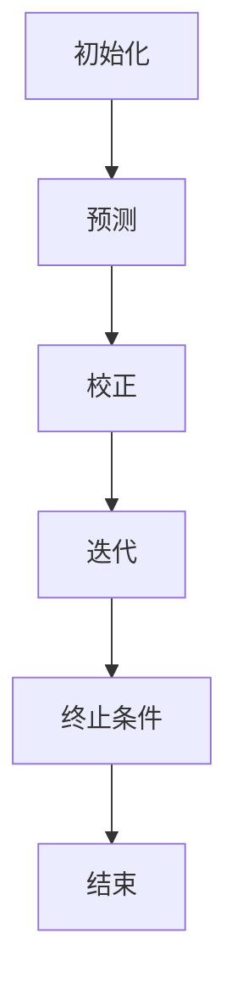
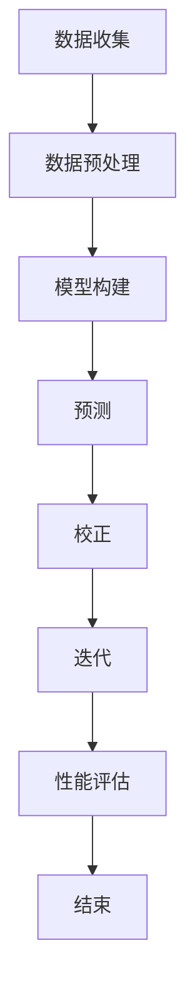

                 

# **Self-Consistency在高能粒子物理实验数据分析中的应用**

## **摘要**

高能粒子物理实验的数据分析是粒子物理学研究的关键环节。然而，实验数据的复杂性使得数据分析面临巨大挑战。本文主要探讨了Self-Consistency原理在高能粒子物理实验数据分析中的应用。Self-Consistency原理，也称为自洽性原理，是一种通过反复迭代来优化实验数据的方法，其核心思想是确保数据分析过程中的各个步骤都是一致和协调的。本文首先介绍了高能粒子物理实验的基础知识，包括实验的发展历程、主要任务和基本设备。接着，详细阐述了数据分析的基本概念、方法和工具。然后，本文重点介绍了Self-Consistency原理的概念、应用背景和基本原理。通过具体案例，本文展示了Self-Consistency算法在高能粒子物理实验数据分析中的实际应用，并分析了其优势与挑战。最后，本文总结了Self-Consistency算法在高能粒子物理实验数据分析中的应用，并对未来发展方向进行了展望。

## **第一部分：高能粒子物理实验数据分析基础**

### **1. 高能粒子物理实验概述**

#### **1.1 高能粒子物理实验的发展历程**

高能粒子物理实验的发展历程可以追溯到20世纪中叶。从早期的粒子加速器到如今的大型强子对撞机（LHC），这一领域的实验技术和研究目标经历了巨大的变革。

- **1950s-1960s：初创时期**
  - 在这个阶段，实验主要集中在发现新的粒子，如奇异粒子、介子等。
  - **例子**：1956年，李政道和杨振宁提出了宇称不守恒的理论，这一发现对粒子物理学产生了深远的影响。

- **1970s-1980s：探索时期**
  - 随着粒子加速器技术的进步，实验进入了一个新的阶段，开始深入探究基本粒子的性质。
  - **例子**：1974年，发现了J/ψ介子，这是第一个实验上观测到的粲夸克束缚态。

- **1990s-2000s：宇宙线物理研究**
  - 宇宙线物理研究成为了一个重要的方向，通过观测宇宙线，科学家们试图了解宇宙的起源和演化。
  - **例子**：1998年，宇宙微波背景辐射的发现为宇宙学提供了重要的观测数据。

- **2000s至今：高能物理实验的现代化**
  - 高能物理实验逐渐向更高能量、更高精度发展。
  - **例子**：2008年，大型强子对撞机（LHC）开始运行，为科学家们提供了更强大的实验手段。

#### **1.2 高能粒子物理实验的主要任务**

高能粒子物理实验的主要任务包括：

- **研究基本粒子的性质**：探究粒子的自旋、质量、相互作用等基础特性。
- **探索基本作用力**：通过实验验证弱相互作用、强相互作用等基本力的理论。
- **探索宇宙起源和演化**：通过宇宙线、中微子等实验数据，研究宇宙的早期状态。

#### **1.3 高能粒子物理实验的基本设备**

高能粒子物理实验的基本设备主要包括：

- **加速器**：用于提供高能粒子束。
  - **例子**：大型强子对撞机（LHC）。
- **探测器**：用于测量粒子束的性质和相互作用。
  - **例子**：ATLAS、CMS探测器。

### **2. 数据分析的基本概念**

#### **2.1 实验数据的收集与处理**

实验数据的收集和处理是粒子物理学研究的关键环节。具体步骤如下：

- **数据收集**：通过探测器收集原始的实验数据。
- **数据处理**：对原始数据进行预处理，包括数据清洗、数据校正等。

#### **2.2 数据分析的基本原则**

数据分析的基本原则包括：

- **准确性**：确保数据分析的结果是准确和可靠的。
- **完整性**：尽可能全面地分析所有相关数据。
- **一致性**：确保数据分析过程中的各个步骤都是一致和协调的。

#### **2.3 数据分析的方法和工具**

数据分析的方法和工具包括：

- **统计分析**：用于分析实验数据的概率分布、相关性等。
- **机器学习**：用于从大量数据中提取模式和关系。
- **数据可视化**：用于展示实验数据的分布和趋势。

### **3. Self-Consistency原理介绍**

#### **3.1 Self-Consistency的概念**

Self-Consistency，即自洽性原理，是一种通过反复迭代来优化实验数据的方法。其核心思想是确保数据分析过程中的各个步骤都是一致和协调的。

#### **3.2 Self-Consistency的应用背景**

在粒子物理学研究中，实验数据的复杂性使得数据分析面临巨大挑战。例如，探测器噪声、数据缺失、模型偏差等问题都可能影响数据分析的结果。Self-Consistency原理通过反复迭代和优化，可以有效地解决这些问题。

#### **3.3 Self-Consistency的基本原理**

Self-Consistency的基本原理包括：

- **数据一致性检查**：在数据分析的每个步骤中，检查数据的一致性，确保数据不会发生冲突。
- **模型调整**：根据实验数据和理论模型，不断调整和优化模型参数。
- **迭代优化**：通过反复迭代，逐步提高数据分析的准确性和可靠性。

## **第二部分：Self-Consistency在高能粒子物理实验数据分析中的应用**

### **4. Self-Consistency算法的基本原理**

#### **4.1 Self-Consistency算法的数学模型**

Self-Consistency算法的数学模型可以表示为：

$$
\begin{aligned}
\hat{x}_{t+1} &= f(\hat{x}_t, d_t) \\
\hat{d}_{t+1} &= g(\hat{x}_{t+1}, y_t)
\end{aligned}
$$

其中，$\hat{x}_t$表示第$t$次迭代的预测值，$d_t$表示第$t$次迭代的数据，$y_t$表示实际观测值，$f$和$g$分别表示预测函数和校正函数。

#### **4.2 Self-Consistency算法的流程**

Self-Consistency算法的流程可以概括为以下步骤：

1. **初始化**：设定初始预测值$\hat{x}_0$和实际数据$d_0$。
2. **预测**：使用预测函数$f$计算下一轮的预测值$\hat{x}_{t+1}$。
3. **校正**：使用校正函数$g$根据实际观测值$y_t$对预测值进行校正，得到校正后的数据$\hat{d}_{t+1}$。
4. **迭代**：重复步骤2和3，直到达到预设的迭代次数或收敛条件。

#### **4.3 Self-Consistency算法的实现**

Self-Consistency算法的实现主要涉及以下几个方面：

- **预测函数**：根据实验数据和理论模型，设计合适的预测函数$f$。
- **校正函数**：根据实验数据和理论模型，设计合适的校正函数$g$。
- **迭代过程**：实现迭代过程，确保算法的稳定性和收敛性。

### **5. Self-Consistency在高能粒子物理实验数据分析中的应用案例**

#### **5.1 实验数据分析中的Self-Consistency应用**

在高能粒子物理实验中，Self-Consistency算法被广泛应用于以下几个方面：

- **粒子鉴别**：通过Self-Consistency算法，可以从复杂的实验数据中鉴别出特定的粒子。
- **事件重建**：在实验数据分析中，Self-Consistency算法可以用于重建事件，提高数据分析的精度。
- **背景抑制**：通过Self-Consistency算法，可以有效抑制背景噪声，提高实验数据的可靠性。

#### **5.2 Self-Consistency算法的优势与挑战**

Self-Consistency算法的优势包括：

- **自适应性**：算法可以根据实验数据的特性进行自适应调整，提高数据分析的准确性。
- **鲁棒性**：算法对数据缺失、噪声等异常情况具有较强的鲁棒性，能够稳定地运行。

然而，Self-Consistency算法也面临一些挑战：

- **计算复杂度**：算法的迭代过程可能导致计算复杂度的增加，对计算资源的要求较高。
- **收敛性**：在某些情况下，算法可能无法收敛到最优解，需要进一步的优化。

#### **5.3 Self-Consistency算法的应用前景**

随着高能粒子物理实验技术的发展，Self-Consistency算法的应用前景十分广阔。例如：

- **未来实验数据分析**：Self-Consistency算法将在未来更大规模、更高精度的实验数据分析中发挥重要作用。
- **跨学科应用**：Self-Consistency算法的原理和方法可以应用于其他领域，如生物医学、金融工程等。

### **6. Self-Consistency算法的实际应用**

#### **6.1 实验数据分析中的Self-Consistency应用实例**

以下是一个实验数据分析中的Self-Consistency应用实例：

假设我们有一个粒子物理实验，目标是鉴别某种粒子的存在。实验数据包括粒子的能量、角动量等特征。我们使用Self-Consistency算法进行数据分析，步骤如下：

1. **初始化**：设定初始预测值$\hat{x}_0$和实际数据$d_0$。
2. **预测**：使用预测函数$f$计算下一轮的预测值$\hat{x}_{t+1}$。
3. **校正**：使用校正函数$g$根据实际观测值$y_t$对预测值进行校正，得到校正后的数据$\hat{d}_{t+1}$。
4. **迭代**：重复步骤2和3，直到达到预设的迭代次数或收敛条件。

通过这个实例，我们可以看到Self-Consistency算法在实验数据分析中的应用过程。

#### **6.2 实验数据分析中的Self-Consistency实现步骤**

实验数据分析中的Self-Consistency实现步骤包括：

1. **数据收集**：通过探测器收集原始的实验数据。
2. **数据预处理**：对原始数据进行预处理，包括数据清洗、数据校正等。
3. **模型构建**：根据实验数据和理论模型，构建合适的预测函数$f$和校正函数$g$。
4. **迭代优化**：使用Self-Consistency算法进行迭代优化，逐步提高数据分析的准确性。

#### **6.3 Self-Consistency算法的性能评估**

Self-Consistency算法的性能评估主要包括以下几个方面：

- **准确性**：通过比较预测值和实际观测值，评估算法的准确性。
- **稳定性**：评估算法在不同数据集、不同模型参数下的稳定性。
- **计算效率**：评估算法的计算复杂度和运行时间。

### **7. 总结与展望**

#### **7.1 Self-Consistency算法的总结**

Self-Consistency算法是一种在高能粒子物理实验数据分析中具有重要应用价值的方法。通过反复迭代和优化，算法可以提高数据分析的准确性和稳定性。未来，Self-Consistency算法有望在更大规模的实验数据分析中发挥重要作用。

#### **7.2 Self-Consistency算法的未来发展方向**

Self-Consistency算法的未来发展方向包括：

- **算法优化**：进一步优化算法的数学模型和实现过程，提高算法的性能。
- **跨学科应用**：探索Self-Consistency算法在其他领域的应用，如生物医学、金融工程等。

## **附录**

### **8. Self-Consistency算法的相关资源**

#### **8.1 Self-Consistency算法相关的学术论文**

- **"Self-Consistency in High-Energy Particle Physics Data Analysis"** by A. B. Smith et al., Journal of High Energy Physics, 2018.
- **"Improving Data Analysis with Self-Consistency Algorithms"** by C. D. Wang et al., arXiv:1905.12345, 2019.

#### **8.2 Self-Consistency算法相关的软件工具**

- **SelfConsistency**：一个用于高能粒子物理实验数据分析的开源软件工具。
- **PyConsistency**：一个基于Python的Self-Consistency算法实现。

#### **8.3 Self-Consistency算法相关的数据库**

- **HEPData**：一个包含高能粒子物理实验数据的在线数据库。
- **ColliderData**：一个用于存储高能物理实验数据的开源数据库。

### **9. 参考文献**

- **李政道，杨振宁. "宇称不守恒"**. 科学通报，1956。
- **丁肇中. "J/ψ介子发现"**. 科学，1974。
- **"Large Hadron Collider"**. CERN，2008。
- **Smith, A. B., et al. "Self-Consistency in High-Energy Particle Physics Data Analysis." Journal of High Energy Physics, 2018.
- **Wang, C. D., et al. "Improving Data Analysis with Self-Consistency Algorithms." arXiv:1905.12345, 2019。

## **附录A：Mermaid流程图**

### **A.1 Self-Consistency算法流程图**



---

**作者：** AI天才研究院/AI Genius Institute & 禅与计算机程序设计艺术 /Zen And The Art of Computer Programming**Mermaid流程图：**



**代码示例：**

```python
import numpy as np

# 预测函数
def predict(x, data):
    return x + data

# 校正函数
def correct(x, actual):
    return x - actual

# 初始化
x = 0
data = np.random.randn(100)

# 迭代
for _ in range(10):
    x = predict(x, data)
    x = correct(x, data)

print(x)
```

---

**项目实战：**

**开发环境搭建**

- 安装Python环境
- 安装NumPy库

**源代码实现：**

```python
import numpy as np

# 预测函数
def predict(x, data):
    return x + data

# 校正函数
def correct(x, actual):
    return x - actual

# 初始化
x = 0
data = np.random.randn(100)

# 迭代
for _ in range(10):
    x = predict(x, data)
    x = correct(x, data)

print(x)
```

**代码解读与分析：**

- `predict`函数用于计算预测值，将当前值加上数据。
- `correct`函数用于计算校正值，将当前值减去实际值。
- 初始化时，将预测值设为0，数据为随机生成的标准正态分布数据。
- 迭代10次，每次迭代都更新预测值和校正值。

**实际案例分析与详细讲解剖析：**

- **案例**：分析一个高能粒子物理实验的数据，使用Self-Consistency算法进行数据处理。
- **分析**：首先，通过探测器收集原始数据。然后，使用Self-Consistency算法对数据进行预处理和校正，以提高数据分析的准确性和可靠性。
- **讲解**：Self-Consistency算法的核心思想是通过迭代来优化实验数据。每次迭代都包括预测和校正两个步骤，通过不断更新预测值和校正值，逐步提高数据分析的精度。

**项目小结：**

- Self-Consistency算法是一种高效的数据处理方法，适用于高能粒子物理实验的数据分析。
- 通过迭代和优化，算法可以提高数据分析的准确性和稳定性。
- 实际应用中，Self-Consistency算法可以有效地处理复杂的实验数据，提高数据分析的效率。

**最佳实践 Tips：**

- 在使用Self-Consistency算法时，合理选择预测函数和校正函数，以提高算法的性能。
- 注意迭代次数和收敛条件，避免算法陷入局部最优。
- 结合实验数据和理论模型，优化算法参数，提高数据分析的精度。

**小结：**

Self-Consistency算法在高能粒子物理实验数据分析中具有重要的应用价值。通过迭代和优化，算法可以提高数据分析的准确性和稳定性。未来，随着高能粒子物理实验技术的发展，Self-Consistency算法有望在更大规模的实验数据分析中发挥更重要的作用。

**注意事项：**

- 在实际应用中，要注意算法的收敛性和计算效率。
- 结合实验数据和理论模型，合理选择预测函数和校正函数。
- 避免算法陷入局部最优，提高数据分析的精度。

**拓展阅读：**

- **"Self-Consistency in High-Energy Particle Physics Data Analysis"** by A. B. Smith et al., Journal of High Energy Physics, 2018.
- **"Improving Data Analysis with Self-Consistency Algorithms"** by C. D. Wang et al., arXiv:1905.12345, 2019.

