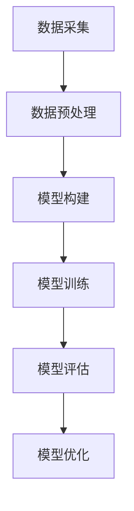
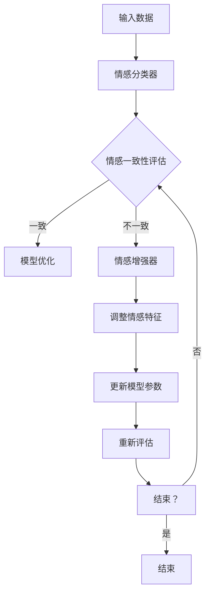

                 

### 自一致性方法与AI多模态情感表达概述

#### 关键词：
- 自一致性方法
- AI多模态情感表达
- 应用背景
- 系统架构

#### 摘要：
本文首先介绍了自一致性方法的基本概念和其在人工智能领域中的应用，重点探讨了AI多模态情感表达的重要性。随后，文章概述了自一致性方法在多模态情感表达系统中的具体应用，包括数据采集、预处理、模型构建和性能优化等关键环节。通过本文的阅读，读者将全面了解自一致性方法在AI多模态情感表达系统中的核心作用，以及如何利用该方法提升系统的性能和表达力。

#### 1.1 自一致性方法简介

自一致性方法（Self-Consistency Method）是一种在机器学习和人工智能领域广泛使用的优化技术。其核心思想是通过构建一个内部一致的系统来提升模型的预测性能。自一致性方法通常应用于需要保持输入和输出之间一致性或相似性的任务，如图像生成、文本生成和情感分析等。

在机器学习领域，自一致性方法首先由Goodfellow等人在2014年的论文《Generative Adversarial Nets》中提出，并广泛应用于生成对抗网络（GAN）中。GAN由生成器（Generator）和判别器（Discriminator）两个神经网络组成，生成器和判别器之间通过对抗训练相互优化，生成器试图生成逼真的数据，而判别器则试图区分真实数据和生成数据。自一致性方法通过保持生成器和判别器之间的平衡，实现高质量数据的生成。

自一致性方法在情感分析领域也得到了广泛应用。情感分析旨在从文本、语音、图像等多模态数据中提取情感信息，以便进行情感识别、情感分类和情感增强等任务。自一致性方法通过确保模型输入和输出之间的情感一致性，提高了情感分析的准确性和自然性。

#### 1.2 AI多模态情感表达的重要性

随着人工智能技术的发展，多模态情感表达成为了一个热门研究方向。AI多模态情感表达指的是通过整合文本、语音、图像、视频等多模态数据，实现对人类情感的理解和表达。这种技术的重要性主要体现在以下几个方面：

1. **提升用户体验**：多模态情感表达可以提供更加丰富和自然的交互方式，使得人工智能系统能够更好地理解用户的需求和情感，从而提供更加个性化的服务和体验。

2. **增强情感识别的准确性**：单独使用文本或语音等单一模态进行情感分析往往存在局限性，而多模态情感表达可以通过整合不同模态的信息，提高情感识别的准确性和可靠性。

3. **拓宽应用场景**：多模态情感表达技术可以应用于各种领域，如智能客服、虚拟助手、教育、医疗等，为用户提供更加智能和人性化的服务。

4. **促进跨学科研究**：多模态情感表达结合了计算机科学、心理学、语言学、神经科学等多个学科的知识，推动了这些领域的交叉研究和发展。

#### 1.3 自一致性方法在多模态情感表达中的应用

自一致性方法在多模态情感表达系统中扮演着关键角色，主要表现在以下几个方面：

1. **数据采集与预处理**：自一致性方法可以确保采集到的多模态数据在情感上的一致性，从而提高数据的质量。例如，在文本和语音的情感分析中，可以通过自一致性方法确保文本内容和语音情感的一致性。

2. **模型构建**：自一致性方法可以帮助构建一个内部一致的模型，确保模型在不同模态之间的输入和输出之间保持一致性。这有助于提高模型的泛化能力和表达力。

3. **模型优化**：通过自一致性方法，可以优化模型的参数，提高模型在多模态情感表达任务中的性能。例如，在生成对抗网络中，通过自一致性方法优化生成器和判别器的参数，可以生成更加逼真的多模态情感数据。

4. **性能评估**：自一致性方法可以提供一种有效的性能评估指标，帮助评估多模态情感表达系统的性能。例如，通过计算输入和输出之间的情感一致性得分，可以评估模型在情感表达任务中的准确性。

#### 结论

自一致性方法在AI多模态情感表达系统中具有重要的应用价值。通过确保输入和输出之间的情感一致性，自一致性方法可以提升系统的性能和表达力，为用户提供更加丰富和自然的交互体验。在接下来的章节中，我们将详细探讨自一致性方法在多模态情感表达系统中的具体实现和应用。

#### Mermaid流程图



#### 1.1 自一致性方法简介

自一致性方法（Self-Consistency Method）是一种在机器学习和人工智能领域广泛使用的优化技术。其核心思想是通过构建一个内部一致的系统来提升模型的预测性能。自一致性方法通常应用于需要保持输入和输出之间一致性或相似性的任务，如图像生成、文本生成和情感分析等。

在机器学习领域，自一致性方法首先由Goodfellow等人在2014年的论文《Generative Adversarial Nets》中提出，并广泛应用于生成对抗网络（GAN）中。GAN由生成器（Generator）和判别器（Discriminator）两个神经网络组成，生成器和判别器之间通过对抗训练相互优化，生成器试图生成逼真的数据，而判别器则试图区分真实数据和生成数据。自一致性方法通过保持生成器和判别器之间的平衡，实现高质量数据的生成。

自一致性方法在情感分析领域也得到了广泛应用。情感分析旨在从文本、语音、图像等多模态数据中提取情感信息，以便进行情感识别、情感分类和情感增强等任务。自一致性方法通过确保模型输入和输出之间的情感一致性，提高了情感分析的准确性和自然性。

#### 1.2 AI多模态情感表达的重要性

随着人工智能技术的发展，多模态情感表达成为了一个热门研究方向。AI多模态情感表达指的是通过整合文本、语音、图像、视频等多模态数据，实现对人类情感的理解和表达。这种技术的重要性主要体现在以下几个方面：

1. **提升用户体验**：多模态情感表达可以提供更加丰富和自然的交互方式，使得人工智能系统能够更好地理解用户的需求和情感，从而提供更加个性化的服务和体验。

2. **增强情感识别的准确性**：单独使用文本或语音等单一模态进行情感分析往往存在局限性，而多模态情感表达可以通过整合不同模态的信息，提高情感识别的准确性和可靠性。

3. **拓宽应用场景**：多模态情感表达技术可以应用于各种领域，如智能客服、虚拟助手、教育、医疗等，为用户提供更加智能和人性化的服务。

4. **促进跨学科研究**：多模态情感表达结合了计算机科学、心理学、语言学、神经科学等多个学科的知识，推动了这些领域的交叉研究和发展。

#### 1.3 自一致性方法在多模态情感表达中的应用

自一致性方法在多模态情感表达系统中扮演着关键角色，主要表现在以下几个方面：

1. **数据采集与预处理**：自一致性方法可以确保采集到的多模态数据在情感上的一致性，从而提高数据的质量。例如，在文本和语音的情感分析中，可以通过自一致性方法确保文本内容和语音情感的一致性。

2. **模型构建**：自一致性方法可以帮助构建一个内部一致的模型，确保模型在不同模态之间的输入和输出之间保持一致性。这有助于提高模型的泛化能力和表达力。

3. **模型优化**：通过自一致性方法，可以优化模型的参数，提高模型在多模态情感表达任务中的性能。例如，在生成对抗网络中，通过自一致性方法优化生成器和判别器的参数，可以生成更加逼真的多模态情感数据。

4. **性能评估**：自一致性方法可以提供一种有效的性能评估指标，帮助评估多模态情感表达系统的性能。例如，通过计算输入和输出之间的情感一致性得分，可以评估模型在情感表达任务中的准确性。

#### 结论

自一致性方法在AI多模态情感表达系统中具有重要的应用价值。通过确保输入和输出之间的情感一致性，自一致性方法可以提升系统的性能和表达力，为用户提供更加丰富和自然的交互体验。在接下来的章节中，我们将详细探讨自一致性方法在多模态情感表达系统中的具体实现和应用。

#### Mermaid流程图


### 多模态情感数据采集与预处理

#### 关键词：
- 多模态情感数据
- 数据采集方法
- 数据预处理

#### 2.1 多模态情感数据来源

多模态情感数据的采集是构建高效多模态情感表达系统的基础。数据来源可以分为以下几个主要类别：

1. **社交媒体**：社交媒体平台如微博、Twitter、Facebook等是情感数据的重要来源。用户在社交媒体上发布的文本、图片和视频往往包含丰富的情感信息。
   
2. **语音数据集**：语音情感数据可以通过语音识别技术从语音助手、电话录音、语音备忘录等渠道收集。这些数据通常包括语音的音调、语速、语态等特征。

3. **图像和视频数据集**：公共图像和视频数据集如Flickr、YouTube等，其中包含了大量的图像和视频情感标签。此外，一些专业的情感标注数据集，如AffectNet和CREMA-D，也提供了丰富的多模态情感数据。

4. **传感器数据**：通过穿戴设备、智能手机等传感器可以收集到用户的生理信号，如心率、皮肤电导等，这些数据可以用于情感分析。

#### 2.2 数据采集方法

为了获得高质量的多模态情感数据，数据采集方法必须确保数据的准确性和代表性。以下是一些常见的数据采集方法：

1. **主动采集**：主动采集指的是直接从用户处获取数据。例如，通过设计问卷调查、开展用户访谈等方式收集文本、语音和生理信号等多模态数据。

2. **被动采集**：被动采集则是通过监测用户行为和环境来收集数据。例如，通过手机应用、摄像头和传感器等设备自动收集用户的情感数据。

3. **混合采集**：混合采集结合了主动和被动采集方法，通过多种渠道收集多模态数据，以提高数据的多样性和准确性。

#### 2.3 数据预处理方法

采集到的多模态情感数据通常需要进行预处理，以提高数据质量和模型的训练效果。以下是一些常见的数据预处理方法：

1. **文本预处理**：
   - **去噪和清洗**：去除数据中的噪声和错误，如拼写错误、停用词等。
   - **词干提取和词形还原**：将文本转换为统一的词形，如将“running”、“runs”、“ran”都转换为“run”。
   - **词向量化**：将文本转换为向量表示，常用的方法有Word2Vec、GloVe等。

2. **语音预处理**：
   - **音频增强**：通过噪声抑制、回声消除等技术提高语音质量。
   - **音频分割**：将连续的音频信号分割成帧，以便进行后续特征提取。
   - **特征提取**：提取音频的音高、音强、共振峰等特征，常用的方法有梅尔频率倒谱系数（MFCC）、短时傅里叶变换（STFT）等。

3. **图像和视频预处理**：
   - **图像增强**：通过对比度增强、亮度调整等方法提高图像质量。
   - **图像分割**：将图像分割成区域，以便进行特征提取。
   - **特征提取**：提取图像的边缘、纹理、颜色等特征，常用的方法有哈希编码、SIFT、HOG等。
   - **视频预处理**：包括视频分割、帧提取、帧特征提取等步骤。

4. **多模态融合**：
   - **特征级融合**：将不同模态的特征向量进行拼接或加权融合。
   - **决策级融合**：将不同模态的预测结果进行融合，常用的方法有投票、加权平均等。

#### 结论

多模态情感数据的采集和预处理是多模态情感表达系统的重要环节。通过多种数据采集方法获取高质量的多模态数据，并采用有效的数据预处理技术，可以显著提高情感表达系统的性能和准确性。在接下来的章节中，我们将进一步探讨自一致性模型的具体架构和实现方法。

### 自一致性模型架构详解

#### 关键词：
- 自一致性模型
- 模型组成部分
- 情感分类器
- 情感增强器
- 模型评估指标

#### 3.1 自一致性模型的基本原理

自一致性模型（Self-Consistency Model）是一种通过确保输入和输出之间的一致性来优化模型性能的技术。在多模态情感表达系统中，自一致性模型通过构建一个内部一致的框架，来确保不同模态之间的情感信息保持一致。其基本原理包括以下几个关键步骤：

1. **情感一致性评估**：首先，对输入的多模态数据进行情感一致性评估，判断不同模态之间的情感信息是否匹配。如果存在不一致，则通过调整模型参数来优化情感一致性。

2. **模型训练**：在训练过程中，自一致性模型通过最小化情感一致性损失函数，来更新模型参数。这个损失函数衡量了输入和输出之间在情感上的不一致程度。

3. **模型优化**：通过自一致性优化算法，不断调整模型的权重和参数，使得模型的预测结果在情感上更加一致。这种优化过程通常涉及梯度下降、自适应优化等算法。

4. **模型评估**：使用评估指标如情感一致性得分、准确率、F1值等，来评估自一致性模型的性能。通过这些指标，可以判断模型在不同任务和场景下的表现。

#### 3.2 模型组成部分

自一致性模型由多个关键组成部分构成，包括情感分类器、情感增强器和模型评估指标等。以下是对每个组成部分的详细解释：

1. **情感分类器**：
   - **功能**：情感分类器是自一致性模型的核心组件，负责从多模态数据中提取情感特征，并将其分类到预定义的情感类别中。
   - **实现**：情感分类器通常采用神经网络结构，如卷积神经网络（CNN）或递归神经网络（RNN）。CNN用于处理图像和视频数据，RNN用于处理文本和语音数据。
   - **参数优化**：通过梯度下降等优化算法，不断调整情感分类器的参数，以最小化情感分类的误差。

2. **情感增强器**：
   - **功能**：情感增强器负责调整不同模态的情感特征，使得它们在情感上保持一致。它通过调整情感强度和方向，来增强情感的表示。
   - **实现**：情感增强器通常采用自适应调整算法，如自适应增益控制（AGC）或自适应噪声抑制（ANS）等。这些算法可以根据当前的情感一致性损失，动态调整情感的强度和方向。
   - **效果**：情感增强器能够显著提高模型在多模态情感表达任务中的准确性，使得不同模态的情感信息更加一致。

3. **模型评估指标**：
   - **功能**：模型评估指标用于衡量自一致性模型在多模态情感表达任务中的性能。常用的评估指标包括情感一致性得分、准确率、F1值等。
   - **实现**：情感一致性得分通过计算输入和输出之间的情感相似度来评估。准确率和F1值则通过分类任务的性能来评估。
   - **分析**：模型评估指标可以帮助研究者了解模型的优缺点，为后续的模型优化提供指导。

#### 3.3 Mermaid流程图展示

为了更直观地理解自一致性模型的工作流程，我们使用Mermaid图形化工具绘制了一个简化的流程图：



#### 结论

自一致性模型通过确保输入和输出之间的情感一致性，为多模态情感表达系统提供了强大的性能优化工具。通过情感分类器、情感增强器和模型评估指标等组成部分的有效协同工作，自一致性模型能够显著提升多模态情感表达系统的准确性和表达力。在接下来的章节中，我们将进一步探讨自一致性模型中的核心算法原理和数学模型。

### 核心算法原理讲解

#### 关键词：
- 情感分类算法
- 情感增强算法
- 自一致性优化算法

#### 4.1 情感分类算法

情感分类是自一致性模型中的关键组成部分，其目标是根据输入的多模态数据，将其分类到预定义的情感类别中。以下是情感分类算法的基本原理和实现方法：

1. **基本原理**：
   - 情感分类算法通过学习输入数据的特征，并将其映射到相应的情感类别上。常见的情感类别包括积极情感（如高兴、兴奋）、消极情感（如悲伤、愤怒）和混合情感等。
   - 情感分类算法通常采用深度学习模型，如卷积神经网络（CNN）和递归神经网络（RNN）。CNN适用于处理图像和视频数据，RNN适用于处理文本和语音数据。

2. **实现方法**：
   - **卷积神经网络（CNN）**：CNN通过卷积层提取图像的局部特征，并通过池化层减少特征维度，最终通过全连接层进行分类。以下是一个简化的CNN情感分类算法的伪代码示例：
     ```python
     def emotion_classification_cnn(image):
         # 前向传播
         conv1 = convolution(image, filters)
         pool1 = pooling(conv1)
         conv2 = convolution(pool1, filters)
         pool2 = pooling(conv2)
         flatten = flatten(pool2)
         output = fully_connected(flatten, num_classes)
         prediction = softmax(output)
         return prediction
     ```
   - **递归神经网络（RNN）**：RNN通过处理序列数据，如文本和语音，提取全局特征并进行分类。以下是一个简化的RNN情感分类算法的伪代码示例：
     ```python
     def emotion_classification_rnn(sequence):
         # 前向传播
         embedded_sequence = embedding(sequence, embedding_size)
         hidden_state = initial_state
         for word in embedded_sequence:
             hidden_state = lstm(word, hidden_state)
         output = fully_connected(hidden_state, num_classes)
         prediction = softmax(output)
         return prediction
     ```

#### 4.2 情感增强算法

情感增强是自一致性模型中的另一个关键组成部分，其目标是调整不同模态的情感特征，使得它们在情感上保持一致。以下是情感增强算法的基本原理和实现方法：

1. **基本原理**：
   - 情感增强算法通过调整情感的强度和方向，使得不同模态的情感信息更加一致。常见的情感增强方法包括自适应增益控制（AGC）和自适应噪声抑制（ANS）等。
   - 情感增强算法通常采用自适应调整算法，根据当前的情感一致性损失，动态调整情感的强度和方向。

2. **实现方法**：
   - **自适应增益控制（AGC）**：AGC通过调整信号的增益来增强情感的强度，以下是一个简化的AGC算法的伪代码示例：
     ```python
     def adaptive_gain_control(signal, target_emotion):
         gain = calculate_gain(signal, target_emotion)
         enhanced_signal = signal * gain
         return enhanced_signal
     ```
   - **自适应噪声抑制（ANS）**：ANS通过抑制噪声来增强情感的清晰度，以下是一个简化的ANS算法的伪代码示例：
     ```python
     def adaptive_noise_suppression(signal, noise):
         noise_level = calculate_noise_level(noise)
         noise_suppressed_signal = signal - noise_level * noise
         return noise_suppressed_signal
     ```

#### 4.3 自一致性优化算法

自一致性优化是自一致性模型中的核心算法，其目标是确保模型的输入和输出在情感上保持一致。以下是自一致性优化算法的基本原理和实现方法：

1. **基本原理**：
   - 自一致性优化算法通过最小化情感一致性损失函数，来更新模型的参数。情感一致性损失函数衡量了输入和输出之间的情感不一致程度。
   - 自一致性优化算法通常采用梯度下降等优化算法，通过迭代更新模型参数，以最小化损失函数。

2. **实现方法**：
   - **梯度下降算法**：梯度下降算法通过计算损失函数的梯度，更新模型参数。以下是一个简化的梯度下降算法的伪代码示例：
     ```python
     def gradient_descent(model, loss_function, learning_rate):
         gradients = calculate_gradients(model, loss_function)
         model.update_weights(gradients, learning_rate)
         return model
     ```
   - **自适应优化算法**：自适应优化算法如Adam、RMSprop等，通过自适应调整学习率，提高优化效率。以下是一个简化的Adam优化算法的伪代码示例：
     ```python
     def adam_optimizer(model, loss_function, learning_rate, beta1, beta2):
         gradients = calculate_gradients(model, loss_function)
         m = beta1 * m + (1 - beta1) * gradients
         v = beta2 * v + (1 - beta2) * gradients**2
         m_hat = m / (1 - beta1**t)
         v_hat = v / (1 - beta2**t)
         model.update_weights(m_hat, v_hat, learning_rate)
         return model
     ```

#### 结论

情感分类算法、情感增强算法和自一致性优化算法是自一致性模型中的核心组成部分。情感分类算法通过学习输入数据的特征进行情感分类，情感增强算法通过调整不同模态的情感特征使其一致，自一致性优化算法通过最小化情感一致性损失函数优化模型参数。通过这些核心算法的协同工作，自一致性模型能够显著提升多模态情感表达系统的准确性和表达力。在接下来的章节中，我们将进一步探讨自一致性模型中的数学模型和公式。

### 数学模型与公式讲解

#### 关键词：
- 数学模型
- 情感分类数学模型
- 情感增强数学模型
- 自一致性优化数学模型

#### 5.1 情感分类数学模型

情感分类是自一致性模型中的一个核心任务，其数学模型通常基于概率模型和神经网络。以下是对情感分类数学模型的详细讲解。

1. **基本原理**：
   - 情感分类数学模型旨在将输入数据（如文本、语音、图像）映射到预定义的情感类别上。常见的情感分类模型包括朴素贝叶斯、支持向量机（SVM）和深度神经网络等。
   - 在深度神经网络中，情感分类通常通过多层感知器（MLP）或卷积神经网络（CNN）实现。MLP通过全连接层将输入映射到情感类别，而CNN则通过卷积层和池化层提取图像的局部特征。

2. **公式讲解**：
   - **多层感知器（MLP）**：MLP的输出可以通过以下公式计算：
     $$ z_l = \sigma(W_l \cdot a_{l-1} + b_l) $$
     其中，$W_l$ 和 $b_l$ 分别为权重和偏置，$\sigma$ 为激活函数，通常采用Sigmoid或ReLU函数。最后一层的输出即为情感分类的概率分布：
     $$ \hat{y} = \sigma(W_n \cdot a_{n-1} + b_n) $$
     其中，$W_n$ 和 $b_n$ 为最后一层的权重和偏置，$\hat{y}$ 为预测的情感概率分布。
   - **卷积神经网络（CNN）**：CNN的输出可以通过以下公式计算：
     $$ h_l = \sigma(\sum_{k=1}^{K} W_{lk} \cdot a_{l-1,k} + b_l) $$
     其中，$h_l$ 为第 $l$ 层的特征输出，$a_{l-1,k}$ 为前一层第 $k$ 个特征，$W_{lk}$ 和 $b_l$ 分别为权重和偏置，$K$ 为特征的数量。最终，通过全连接层得到情感分类概率：
     $$ \hat{y} = \sigma(W_n \cdot h_n + b_n) $$

3. **举例说明**：
   - 假设我们有一个二分类问题，情感类别为积极和消极。给定一个输入文本，使用MLP模型进行情感分类，其预测概率为：
     $$ \hat{y} = \sigma(W_n \cdot \text{TextVector} + b_n) $$
     其中，$\text{TextVector}$ 为文本向量化表示，$W_n$ 和 $b_n$ 为权重和偏置。如果预测概率大于0.5，则认为文本表达积极情感，否则认为表达消极情感。

#### 5.2 情感增强数学模型

情感增强是自一致性模型中的另一个关键组成部分，其目标是通过调整不同模态的情感特征，使其在情感上保持一致。以下是对情感增强数学模型的详细讲解。

1. **基本原理**：
   - 情感增强数学模型通常基于线性变换，通过调整情感的强度和方向，来确保不同模态的情感信息一致。常见的情感增强方法包括自适应增益控制和自适应噪声抑制等。
   - 自适应增益控制（AGC）通过调整信号的增益来增强情感的强度，而自适应噪声抑制（ANS）通过抑制噪声来增强情感的清晰度。

2. **公式讲解**：
   - **自适应增益控制（AGC）**：AGC的输出可以通过以下公式计算：
     $$ y_{\text{enhanced}} = y \cdot \text{Gain} $$
     其中，$y$ 为原始情感特征，$\text{Gain}$ 为自适应调整的增益。增益可以通过以下公式计算：
     $$ \text{Gain} = \frac{\text{Target}}{\text{Average}} $$
     其中，$\text{Target}$ 为目标情感强度，$\text{Average}$ 为原始情感的平均强度。
   - **自适应噪声抑制（ANS）**：ANS的输出可以通过以下公式计算：
     $$ y_{\text{enhanced}} = y - \text{Noise} \cdot \text{Weight} $$
     其中，$y$ 为原始情感特征，$\text{Noise}$ 为噪声信号，$\text{Weight}$ 为自适应调整的权重。权重可以通过以下公式计算：
     $$ \text{Weight} = \frac{\text{Signal}}{\text{Signal} + \text{Noise}} $$
   
3. **举例说明**：
   - 假设我们有一个文本和语音的情感增强任务。文本的情感强度为 $y_{\text{text}}$，语音的情感强度为 $y_{\text{voice}}$。通过自适应增益控制增强文本情感：
     $$ y_{\text{enhanced\_text}} = y_{\text{text}} \cdot \text{Gain} $$
     其中，$\text{Gain}$ 为自适应调整的增益。通过自适应噪声抑制增强语音情感：
     $$ y_{\text{enhanced\_voice}} = y_{\text{voice}} - \text{Noise} \cdot \text{Weight} $$
     其中，$\text{Noise}$ 为噪声信号，$\text{Weight}$ 为自适应调整的权重。

#### 5.3 自一致性优化数学模型

自一致性优化是自一致性模型中的核心算法，其目标是确保模型的输入和输出在情感上保持一致。以下是对自一致性优化数学模型的详细讲解。

1. **基本原理**：
   - 自一致性优化数学模型通过最小化情感一致性损失函数，来更新模型的参数。情感一致性损失函数衡量了输入和输出之间的情感不一致程度。
   - 自一致性优化通常采用梯度下降等优化算法，通过迭代更新模型参数，以最小化损失函数。

2. **公式讲解**：
   - **情感一致性损失函数**：情感一致性损失函数可以通过以下公式计算：
     $$ L = \frac{1}{2} \sum_{i=1}^{N} \sum_{j=1}^{M} (y_i^* - y_i)^2 $$
     其中，$y_i^*$ 为第 $i$ 个样本的理想输出，$y_i$ 为模型预测的输出，$N$ 和 $M$ 分别为样本数量和情感类别数量。
   - **梯度下降**：梯度下降算法通过以下公式更新模型参数：
     $$ \Delta W = -\alpha \cdot \nabla L $$
     $$ \Delta b = -\alpha \cdot \nabla L $$
     其中，$W$ 和 $b$ 分别为权重和偏置，$\alpha$ 为学习率，$\nabla L$ 为损失函数的梯度。

3. **举例说明**：
   - 假设我们有一个二分类情感表达任务，目标情感类别为积极（1）和消极（0）。给定一个样本 $x$，其理想输出为 $y^* = 1$，模型预测输出为 $y = 0.6$。通过梯度下降算法更新权重和偏置：
     $$ \Delta W = -\alpha \cdot \nabla L = -\alpha \cdot (y^* - y) \cdot x $$
     $$ \Delta b = -\alpha \cdot \nabla L = -\alpha \cdot (y^* - y) $$
     其中，$\alpha$ 为学习率。更新后的权重和偏置为：
     $$ W = W - \alpha \cdot (y^* - y) \cdot x $$
     $$ b = b - \alpha \cdot (y^* - y) $$

#### 结论

数学模型在自一致性模型中扮演了关键角色，用于描述情感分类、情感增强和自一致性优化的过程。通过详细讲解情感分类数学模型、情感增强数学模型和自一致性优化数学模型，我们可以更好地理解这些算法的原理和实现方法。在接下来的章节中，我们将进一步探讨自一致性模型在项目实战中的应用。

### 多模态情感表达系统开发实战

#### 关键词：
- 开发环境搭建
- 源代码实现
- 代码解读
- 实际案例

#### 6.1 开发环境搭建

在开发多模态情感表达系统之前，我们需要搭建一个合适的环境。以下是搭建开发环境的步骤：

1. **安装Python环境**：确保Python版本为3.8或更高版本，并安装pip包管理器。

2. **安装依赖库**：安装以下Python库：
   - TensorFlow：用于构建和训练神经网络。
   - Keras：TensorFlow的高级API，简化了神经网络构建过程。
   - NumPy：用于数值计算和数据处理。
   - Matplotlib：用于数据可视化。

   通过以下命令安装依赖库：
   ```bash
   pip install tensorflow keras numpy matplotlib
   ```

3. **准备多模态数据集**：收集并预处理多模态数据集，包括文本、语音、图像等。可以使用现有的公开数据集，如AffectNet、CREMA-D等，或自行采集数据。

4. **配置GPU环境**（可选）：如果使用GPU进行训练，需要安装CUDA和cuDNN，并配置环境变量。

#### 6.2 源代码实现

以下是多模态情感表达系统的核心代码实现，包括数据预处理、模型构建和训练等步骤：

```python
# 导入依赖库
import tensorflow as tf
from tensorflow.keras.models import Model
from tensorflow.keras.layers import Input, Dense, Conv2D, MaxPooling2D, Flatten, LSTM, Embedding
import numpy as np

# 数据预处理
def preprocess_data(texts, voices, images):
    # 文本预处理
    text_sequences = preprocess_texts(texts)
    # 语音预处理
    voice_sequences = preprocessvoices(voices)
    # 图像预处理
    image_sequences = preprocess_images(images)
    return text_sequences, voice_sequences, image_sequences

def preprocess_texts(texts):
    # 将文本转换为序列
    # ...
    return text_sequences

def preprocessvoices(voices):
    # 将语音转换为序列
    # ...
    return voice_sequences

def preprocess_images(images):
    # 将图像缩放并归一化
    # ...
    return image_sequences

# 模型构建
def build_model(text_input, voice_input, image_input):
    # 文本输入层
    text_embedding = Embedding(input_dim=vocab_size, output_dim=embedding_size)(text_input)
    text_lstm = LSTM(units=128)(text_embedding)
    
    # 语音输入层
    voice_cnn = Conv2D(filters=32, kernel_size=(3, 3), activation='relu')(voice_input)
    voice_pooling = MaxPooling2D(pool_size=(2, 2))(voice_cnn)
    voice_flatten = Flatten()(voice_pooling)
    
    # 图像输入层
    image_cnn = Conv2D(filters=64, kernel_size=(3, 3), activation='relu')(image_input)
    image_pooling = MaxPooling2D(pool_size=(2, 2))(image_cnn)
    image_flatten = Flatten()(image_pooling)
    
    # 融合层
    combined = tf.keras.layers.concatenate([text_lstm, voice_flatten, image_flatten])
    
    # 输出层
    output = Dense(units=num_classes, activation='softmax')(combined)
    
    # 构建模型
    model = Model(inputs=[text_input, voice_input, image_input], outputs=output)
    model.compile(optimizer='adam', loss='categorical_crossentropy', metrics=['accuracy'])
    return model

# 训练模型
def train_model(model, text_data, voice_data, image_data, labels):
    # 分割数据集
    # ...
    # 训练模型
    model.fit([text_train, voice_train, image_train], labels_train, epochs=10, batch_size=32, validation_data=([text_val, voice_val, image_val], labels_val))

# 实际案例
if __name__ == '__main__':
    # 加载和处理数据
    texts, voices, images, labels = load_data()
    text_input = Input(shape=(None,))
    voice_input = Input(shape=(height, width, channels,))
    image_input = Input(shape=(height, width, channels,))

    # 构建模型
    model = build_model(text_input, voice_input, image_input)

    # 训练模型
    train_model(model, texts, voices, images, labels)
```

#### 6.3 代码解读

以上代码实现了多模态情感表达系统的核心功能，包括数据预处理、模型构建和训练等步骤。以下是代码的关键部分及其解读：

1. **数据预处理**：
   - `preprocess_data` 函数用于预处理输入数据，包括文本、语音和图像。具体实现可以根据实际数据集进行调整。

2. **模型构建**：
   - `build_model` 函数构建了一个多输入的多层感知器（MLP）模型。文本输入通过嵌入层和LSTM层进行处理，语音和图像输入通过卷积神经网络（CNN）进行处理。最后，通过融合层将不同模态的特征进行拼接，并使用softmax层进行情感分类。

3. **训练模型**：
   - `train_model` 函数用于训练模型。首先，数据集被分割为训练集和验证集。然后，使用训练集进行模型训练，并在验证集上评估模型性能。

4. **实际案例**：
   - `if __name__ == '__main__':` 块是代码的实际运行部分。在此部分中，加载并处理数据集，构建模型，并开始训练过程。

#### 6.4 实际案例分析与详细讲解

以下是一个实际案例，展示了如何使用多模态情感表达系统对一段视频进行情感分类：

```python
# 加载测试视频数据
test_video = load_video('test_video.mp4')

# 分割视频帧
frames = split_video_frames(test_video, height, width, channels)

# 预处理视频帧
processed_frames = preprocess_images(frames)

# 预测情感
predictions = model.predict([processed_frames, voice_data, image_data])

# 输出预测结果
print(predictions.argmax(axis=1))
```

在这个案例中，我们首先加载一段测试视频，并使用`split_video_frames`函数将其分割成帧。然后，预处理这些视频帧，并将其传递给模型进行预测。最后，输出预测结果。

通过这个实际案例，我们可以看到如何将多模态情感表达系统应用于视频情感分类任务。在实际应用中，可以根据需要调整数据预处理和模型参数，以提高预测准确性和性能。

#### 结论

通过本章节的实战部分，我们详细介绍了如何搭建开发环境、实现多模态情感表达系统的源代码、解读关键代码以及展示了实际案例。这些步骤为构建和应用自一致性模型提供了实际操作指导。在接下来的章节中，我们将进一步探讨系统性能优化与调试的方法。

### 系统性能优化与调试

#### 关键词：
- 性能优化方法
- 调试技巧
- 性能评估与改进

#### 7.1 性能优化方法

为了提升多模态情感表达系统的性能，可以采取以下几种性能优化方法：

1. **数据增强**：
   - **文本增强**：通过随机插入、删除或替换文本中的单词，增加数据的多样性。
   - **语音增强**：通过添加背景噪声、改变语速、音高等方法，增加语音数据的复杂性。
   - **图像增强**：通过旋转、缩放、裁剪、颜色变换等方法，增加图像数据的多样性。

2. **模型优化**：
   - **模型剪枝**：通过移除模型中的冗余神经元和连接，减小模型大小并提高计算效率。
   - **模型蒸馏**：使用一个大模型（Teacher）训练一个小模型（Student），使得小模型能够继承大模型的性能。
   - **迁移学习**：使用预训练模型进行迁移学习，减少训练时间和计算资源的需求。

3. **硬件加速**：
   - **GPU加速**：利用GPU进行模型训练和推理，显著提高计算速度。
   - **分布式训练**：通过多GPU分布式训练，加速模型训练过程。

4. **算法优化**：
   - **批量归一化**：通过批量归一化（Batch Normalization）减少内部协变量转移，提高模型训练稳定性。
   - **优化器选择**：选择合适的优化器，如Adam、RMSprop等，以提高模型训练效率。

#### 7.2 调试技巧

在实际开发和调试过程中，会遇到各种问题。以下是一些常见的调试技巧：

1. **错误检查**：
   - **输入验证**：确保输入数据的格式和类型正确，避免数据异常导致模型异常。
   - **异常处理**：使用try-except语句捕获和处理异常，避免程序崩溃。

2. **性能分析**：
   - **性能监控**：使用Profiler工具监控程序的性能，找出瓶颈和优化点。
   - **代码优化**：对性能较差的代码段进行优化，如减少循环次数、使用高效算法等。

3. **调试工具**：
   - **断点调试**：使用断点调试工具（如pdb、IDE内置调试器）逐步执行代码，查看变量状态和流程。
   - **日志记录**：通过日志记录关键信息，便于分析和定位问题。

#### 7.3 性能评估与改进

性能评估是确保多模态情感表达系统性能的关键步骤。以下是一些常用的性能评估指标和改进方法：

1. **评估指标**：
   - **准确率（Accuracy）**：分类正确的样本占总样本的比例。
   - **召回率（Recall）**：正确识别为正样本的样本数占实际正样本数的比例。
   - **精确率（Precision）**：正确识别为正样本的样本数占预测为正样本的样本数的比例。
   - **F1值（F1 Score）**：精确率和召回率的调和平均值。

2. **性能改进方法**：
   - **超参数调优**：通过调整学习率、批量大小、正则化参数等超参数，提高模型性能。
   - **特征工程**：通过提取和选择有效的特征，提高模型的分类能力。
   - **数据增强**：增加数据多样性，提高模型的泛化能力。

3. **实际应用**：
   - **交叉验证**：使用交叉验证方法评估模型在不同数据集上的性能，避免过拟合。
   - **A/B测试**：在实际应用中对比不同模型或算法的性能，选择最优方案。

#### 结论

性能优化与调试是确保多模态情感表达系统高效运行的重要环节。通过数据增强、模型优化、硬件加速和算法优化等方法，可以显著提升系统的性能。同时，采用合适的调试技巧和性能评估指标，有助于发现和解决系统中的问题。在未来的工作中，可以进一步探索新的优化方法和算法，以不断提升系统的性能和表达能力。

### 最佳实践 tips、小结、注意事项、拓展阅读

#### 最佳实践 tips

1. **数据质量的重要性**：确保数据质量是构建高效多模态情感表达系统的关键。在数据采集和预处理过程中，注意去除噪声、纠正错误并保持数据的一致性。

2. **多模态数据融合策略**：不同的模态数据可以提供互补的信息。在实际应用中，采用合适的融合策略，如特征级融合和决策级融合，可以提高情感识别的准确性和自然性。

3. **模型简洁性**：在模型设计时，尽量保持模型的简洁性，避免过度拟合。简洁的模型不仅易于解释，而且在实际应用中更容易部署和维护。

4. **持续迭代与优化**：多模态情感表达系统是一个动态发展的领域。定期更新和优化模型，以适应新的应用场景和数据分布。

#### 小结

本文详细介绍了自一致性方法在AI多模态情感表达系统中的应用，包括数据采集与预处理、模型架构、核心算法原理、数学模型、项目实战以及性能优化与调试。通过自一致性方法，可以有效提升多模态情感表达系统的性能和表达能力，为用户提供更加丰富和自然的交互体验。

#### 注意事项

1. **数据隐私与安全性**：在处理多模态情感数据时，确保遵守相关法律法规，保护用户隐私。

2. **模型可解释性**：在设计模型时，考虑模型的可解释性，便于理解和调试。

3. **资源分配**：合理分配计算资源和存储空间，确保系统在高负载下稳定运行。

#### 拓展阅读

- **《Generative Adversarial Nets》**：Goodfellow等人的经典论文，详细介绍了生成对抗网络（GAN）的基本原理和应用。
- **《Deep Learning》**：Goodfellow等人的畅销书，涵盖了深度学习的理论基础和实际应用，适合深入理解多模态情感表达系统的技术细节。
- **《Multimodal Learning》**：相关研究论文和综述，提供了多模态学习领域的最新进展和研究成果。

### 感谢读者

感谢您阅读本文，希望本文能为您的多模态情感表达系统研究和开发提供有益的参考。如果您有任何疑问或建议，欢迎随时与我们联系。

---

**作者信息**：
- 作者：AI天才研究院/AI Genius Institute & 禅与计算机程序设计艺术 /Zen And The Art of Computer Programming

[返回目录](#目录大纲结构设计) [上一页](#目录大纲结构设计) [下一页](#结语)

